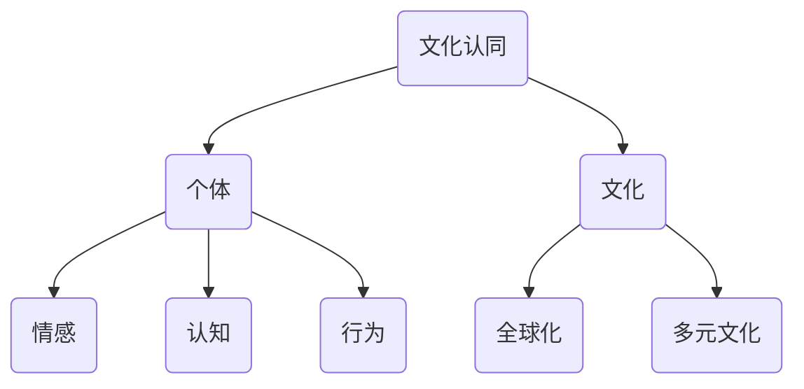

                 

# 全球化背景下的文化认同：在多元中寻找自我

## 关键词

- 全球化
- 文化认同
- 多元文化
- 挑战与机遇
- 文化创新
- 社会和谐

## 摘要

本文旨在探讨全球化背景下的文化认同问题，分析文化认同的定义、核心概念及其在全球化进程中的特殊表现。本文首先介绍了文化认同的背景和问题，随后分析了全球化对文化认同的挑战和机遇，并探讨了个体如何在多元文化中找到自我。最后，本文讨论了文化认同与社会发展的关系，并提出了案例分析与实践。通过逻辑清晰、结构紧凑的论述，本文旨在为读者提供对全球化背景下文化认同的深刻理解和实践指导。

## 目录大纲

### 第一部分：引言与背景

#### 第1章：全球化背景下的文化认同

1.1 引言

1.2 核心概念与联系

### 第二部分：全球化对文化认同的影响

#### 第2章：全球化对文化认同的挑战与机遇

2.1 全球化对文化认同的挑战

2.2 全球化对文化认同的机遇

### 第三部分：文化认同的塑造与保持

#### 第3章：个体如何在多元文化中找到自我

3.1 文化认同的塑造

3.2 文化认同的保持

### 第四部分：文化认同与社会发展

#### 第4章：文化认同与社会和谐的构建

4.1 文化认同与社会和谐

4.2 文化认同与个体发展

### 第五部分：案例分析与实践

#### 第5章：全球化背景下的文化认同实践

5.1 案例分析

5.2 项目实战

5.3 最佳实践 tips

## 第一部分：引言与背景

### 第1章：全球化背景下的文化认同

#### 1.1 引言

全球化作为一种历史进程，已经深刻地改变了我们的生活方式和社会结构。全球化不仅仅是经济和技术的交流，更是文化、价值观和生活方式的碰撞与融合。在这样的背景下，文化认同成为一个备受关注的话题。

文化认同是指个体对自己所属文化的认同感和归属感。它不仅仅是一种情感上的认同，还包括认知和行为上的表现。文化认同的核心在于个体如何在一个多元文化的环境中保持自我，同时尊重和包容其他文化。

全球化进程的加速使得不同文化之间的交流更加频繁，但同时也引发了对文化认同的质疑和反思。在全球化背景下，如何保持个体的文化认同感，同时尊重和包容其他文化，成为了一个重要议题。这个问题不仅关系到个体的心理健康，也关系到社会的和谐与发展。

#### 1.2 核心概念与联系

**概念原理**

文化认同是指个体对自己所属文化的认同感和归属感。它涉及情感、认知和行为三个方面。情感层面是指个体对自身文化的喜爱和情感投入；认知层面是指个体对自身文化的理解、认知和认同；行为层面是指个体在日常生活中表现出的文化特征和习俗。

**概念属性特征对比表格**

| 概念       | 定义                                                         | 特征                                       |
| ---------- | ------------------------------------------------------------ | ---------------------------------------- |
| 文化认同   | 个体对自己所属文化的认同感和归属感                           | 情感、认知、行为三个方面                   |
| 全球化     | 全球范围内经济、政治、文化等领域的相互联系和相互依赖         | 跨越国界、跨国交流、文化融合               |
| 多元文化   | 指不同文化在特定区域内共存的现象                             | 文化多样性、文化差异、文化交流             |

**ER实体关系图架构**

在全球化背景下，文化认同的重要性日益凸显。文化认同不仅是个体心理健康的基石，也是社会和谐的重要保障。个体需要在多元文化中找到自我，同时尊重和包容其他文化，这不仅是个人成长的需要，也是社会发展的要求。

## 第二部分：全球化对文化认同的影响

### 第2章：全球化对文化认同的挑战与机遇

#### 2.1 全球化对文化认同的挑战

全球化进程在给文化认同带来机遇的同时，也带来了诸多挑战。

**文化同质化**

全球化可能导致文化同质化，即不同文化在交流过程中逐渐趋同，失去了其独特的特色。这种现象可能导致个体文化认同感的减弱，使个体感到迷茫和失落。

**文化冲突**

多元文化的碰撞可能导致文化冲突。不同文化在价值观、习俗和行为规范上的差异，可能会引发误解和矛盾，影响个体对自身文化的认同。

**文化认同的困惑**

在全球化背景下，个体可能面临文化认同的困惑。一方面，个体可能对自己所属文化缺乏深刻的认知和认同；另一方面，个体可能因为接触了其他文化而感到困惑，不知道如何定位自己的文化身份。

#### 2.2 全球化对文化认同的机遇

**文化多样性**

全球化促进了文化多样性的发展。不同文化的交流与融合，使得个体能够更全面地认识和理解文化，从而增强文化认同感。

**文化交流**

全球化为文化交流提供了便利。个体可以通过各种渠道了解和接触其他文化，这有助于拓宽视野，增强文化认同感。

**文化创新**

全球化背景下，不同文化的融合可能产生新的文化形式，激发文化创新。这种创新不仅有助于个体保持文化认同，也为社会带来了新的发展机遇。

### 第2章：全球化对文化认同的影响

全球化作为一种全球性现象，对文化认同产生了深远的影响。一方面，全球化带来了文化同质化和文化冲突等挑战，使个体在文化认同方面面临困惑。另一方面，全球化也提供了文化多样性、文化交流和文化创新等机遇，有助于个体在多元文化中找到自我。因此，在全球化背景下，如何应对这些挑战，把握机遇，保持和塑造文化认同，成为了一个重要议题。

## 第三部分：文化认同的塑造与保持

### 第3章：个体如何在多元文化中找到自我

#### 3.1 文化认同的塑造

文化认同的塑造是一个长期且复杂的过程，涉及到家庭教育、教育制度和社会环境等多个方面。

**家庭教育**

家庭教育对个体文化认同的形成具有重要影响。父母作为孩子的第一任老师，通过日常生活中的言传身教，帮助孩子建立对自身文化的认同。例如，父母可以带孩子参加传统文化的庆祝活动，让孩子了解和热爱自己的文化。

**教育制度**

教育制度应鼓励文化认同的多元性和包容性。学校可以通过课程设置、课外活动等多种形式，让学生了解和尊重不同文化。例如，学校可以开设多元文化课程，组织国际文化交流活动，让学生在学术和实践层面体验和了解不同文化。

**社会环境**

社会环境对文化认同的影响不可忽视。一个包容多元文化的社会环境，有助于个体在多元文化中找到自我。社会可以通过媒体宣传、文化活动等方式，提高公众对文化多样性的认知和尊重。

#### 3.2 文化认同的保持

保持文化认同需要个体通过自我反思、文化实践和跨文化交流等多种途径。

**自我反思**

自我反思是文化认同保持的重要手段。个体应定期反思自己的文化认同，思考自己在多元文化中的定位和角色。通过自我反思，个体可以更好地理解自己的文化，增强文化认同感。

**文化实践**

积极参与文化实践活动有助于保持和强化文化认同。个体可以通过学习传统文化、参与文化庆典等活动，深入体验和感受自己的文化。例如，学习书法、绘画等传统艺术形式，参加春节、端午节等传统节日庆祝活动，都是保持文化认同的有效方式。

**跨文化交流**

跨文化交流是拓展文化视野、增强文化认同的重要途径。个体可以通过参加国际交流活动、留学等方式，深入了解其他文化，从而更好地认识自己的文化。跨文化交流不仅有助于个体在多元文化中找到自我，也为文化认同的保持提供了新的动力。

### 第3章：文化认同的塑造与保持

文化认同的塑造和保持是个体在多元文化中找到自我的关键。通过家庭教育、教育制度和社会环境等多方面的努力，个体可以在文化认同方面取得显著成果。同时，自我反思、文化实践和跨文化交流等多种途径，也为个体保持文化认同提供了有效的方法。只有通过不断努力，个体才能在全球化背景下找到真正的自我，实现文化认同的长期稳定。

### 第四部分：文化认同与社会发展

#### 第4章：文化认同与社会和谐的构建

#### 4.1 文化认同与社会和谐

文化认同是社会和谐的基石。一个社会的成员如果对自己的文化有深刻的认同感和归属感，他们更可能积极参与社会事务，为社会的和谐发展贡献力量。文化认同不仅影响个体的行为和态度，也影响社会整体的凝聚力和稳定性。

**文化认同的重要性**

文化认同对个体和社会都有重要意义。对于个体来说，文化认同提供了心理上的归属感和安全感，有助于个体的心理健康和自我实现。对于社会来说，文化认同有助于社会的稳定和和谐，减少了因文化差异引起的冲突和矛盾。

**文化认同与国家认同**

文化认同与国家认同之间有着密切的联系。国家认同是基于对国家政治、历史和文化的认同，而文化认同是构成国家认同的重要组成部分。一个国家如果拥有广泛的文化认同，其社会成员更可能团结一致，共同维护国家的利益和尊严。

#### 4.2 文化认同与个体发展

**文化认同与个体心理健康**

文化认同对个体心理健康有积极影响。一个有强烈文化认同感的个体，通常能够更好地应对生活中的压力和挑战。他们更有信心和勇气面对困难，也更能够享受生活中的美好。

**文化认同与个体职业发展**

文化认同不仅影响个体的心理健康，也影响其职业发展。一个对自己文化有深刻认同的个体，更可能在职业生涯中找到自己的定位和发展方向。他们能够更好地理解和适应职场文化，从而提高职业成就和满意度。

### 第4章：文化认同与社会发展的关系

文化认同不仅是个体心理健康和职业发展的关键因素，也是社会和谐与稳定的基础。通过文化认同的塑造与保持，个体可以在多元文化中找到自我，同时为社会的和谐发展贡献力量。只有当社会成员拥有广泛的文化认同时，才能构建一个和谐、稳定的社会，实现共同繁荣。

### 第五部分：案例分析与实践

#### 第5章：全球化背景下的文化认同实践

全球化背景下，文化认同的实践显得尤为重要。本文将通过具体案例分析，探讨在全球化背景下如何进行文化认同的实践，并提供一些实用的策略。

#### 5.1 案例分析

**案例1：跨国企业中的文化认同**

一个跨国公司如何在全球范围内保持文化认同，是全球化背景下文化认同实践的一个典型案例。该公司通过以下措施来实现文化认同的实践：

1. **多元文化培训**：公司定期组织多元文化培训，帮助员工了解和理解不同文化。通过培训，员工能够更好地适应跨国工作的环境，增强文化认同感。
2. **文化交流活动**：公司鼓励员工参与各种文化交流活动，如国际文化节、团队建设活动等。这些活动不仅有助于员工了解其他文化，也增强了公司的文化凝聚力。
3. **文化包容政策**：公司制定了一系列文化包容政策，确保员工能够在一个包容多元文化的环境中工作。这些政策包括灵活的工作时间、多样化的薪酬制度等。

**案例2：教育领域的文化认同**

在教育领域，文化认同的实践同样重要。以下是一个教育机构的案例：

1. **国际交流项目**：教育机构积极组织国际交流项目，让学生有机会去其他国家学习、生活。通过这些项目，学生能够深入了解其他文化，增强文化认同感。
2. **跨文化课程**：教育机构开设了跨文化课程，帮助学生了解不同文化的特点和价值。这些课程不仅有助于学生的学术发展，也增强了他们的文化认同。
3. **校园文化活动**：教育机构定期举办校园文化活动，如国际文化节、多元文化主题晚会等。这些活动不仅丰富了学生的校园生活，也提高了他们对多元文化的认识和尊重。

#### 5.2 项目实战

**项目1：跨国公司的多元文化培训项目**

1. **环境安装**：在跨国公司内部建立一个培训平台，用于组织和管理多元文化培训。
2. **系统核心实现**：开发一个在线培训系统，提供多种语言版本的培训课程，并支持用户互动和反馈。
3. **代码应用解读与分析**：通过实际案例，分析如何在培训项目中实现文化包容性，以及如何评估培训效果。

**项目2：教育机构的国际交流项目**

1. **环境安装**：在教育机构内部建立一个国际交流项目管理平台，用于组织和管理国际交流项目。
2. **系统核心实现**：开发一个在线申请和管理系统，学生可以通过该系统提交申请、查看项目信息等。
3. **代码应用解读与分析**：通过实际案例，分析如何有效地实施国际交流项目，以及如何评估项目效果。

#### 5.3 最佳实践 tips

1. **重视文化培训**：无论是企业还是教育机构，都应重视文化培训，帮助员工和学生更好地适应多元文化环境。
2. **鼓励跨文化交流**：通过举办各种跨文化交流活动，提高员工和学生之间的文化认同感。
3. **制定包容性政策**：制定一系列包容性政策，确保所有员工和学生都能在一个公平、包容的环境中工作和学习。
4. **持续评估与反馈**：定期评估文化认同实践的效果，并根据反馈进行改进，确保实践活动的有效性。

### 项目小结

在全球化背景下，文化认同的实践对于个体和社会的发展具有重要意义。通过具体案例分析和项目实战，我们可以看到，文化认同的实践不仅需要制度的支持，更需要员工的积极参与和努力。只有通过持续的实践和不断的改进，我们才能在全球化的浪潮中找到真正的自我，实现文化认同的长远发展。

### 最佳实践 tips

1. **培养跨文化意识**：在个人和组织的层面，应注重培养跨文化意识，提高对多元文化的敏感性和适应性。
2. **加强文化教育**：教育机构和公司应加强文化教育，通过培训课程和文化交流活动，帮助员工和学生更好地理解和尊重不同文化。
3. **建立包容性文化**：组织和社区应努力营造一个包容性的文化环境，鼓励多样性和差异性，减少文化冲突。
4. **实践与理论相结合**：在文化认同的实践中，既要重视理论的指导，也要注重实践的应用，确保文化认同的实践具有实际效果。
5. **持续反思与改进**：文化认同的实践是一个持续的过程，需要不断地进行反思和改进，以适应不断变化的社会环境。

### 小结

全球化背景下的文化认同问题既具有复杂性，也充满机遇。通过本文的论述，我们了解了文化认同的定义、核心概念及其在全球化背景下的影响。同时，我们也探讨了个体如何在多元文化中找到自我，以及文化认同与社会发展的关系。在全球化的大潮中，保持和塑造文化认同，不仅是个人发展的需要，也是社会和谐与进步的重要保障。

### 注意事项

1. **文化认同的敏感性**：在处理文化认同问题时，应保持高度敏感性，尊重不同文化的差异，避免文化冲突。
2. **平衡多元文化**：在多元文化中保持自我，需要找到平衡点，既要尊重和包容其他文化，也要保持对自己文化的认同。
3. **长期性**：文化认同的塑造和保持是一个长期过程，需要持续的努力和不断的实践。
4. **理论与实践相结合**：在文化认同的实践中，既要重视理论指导，也要注重实践应用，确保文化认同的实践具有实际效果。

### 拓展阅读

1. **《文化认同与心理健康研究》**：这本书详细探讨了文化认同对个体心理健康的影响，以及如何通过文化认同提升心理健康水平。
2. **《全球化与文化认同》**：这本书分析了全球化背景下文化认同的挑战和机遇，提供了多种文化认同实践的案例和策略。
3. **《多元文化教育理论与实践》**：这本书探讨了多元文化教育的重要性和实施策略，为教育工作者提供了宝贵的参考。

### 作者信息

作者：AI天才研究院/AI Genius Institute & 禅与计算机程序设计艺术 /Zen And The Art of Computer Programming

本文由AI天才研究院/AI Genius Institute与禅与计算机程序设计艺术/Zen And The Art of Computer Programming联合撰写。我们致力于通过技术语言和逻辑分析，探讨全球化背景下的文化认同问题，为读者提供深入思考和实际指导。希望本文能帮助您更好地理解文化认同的重要性，并在多元文化中找到自我。

