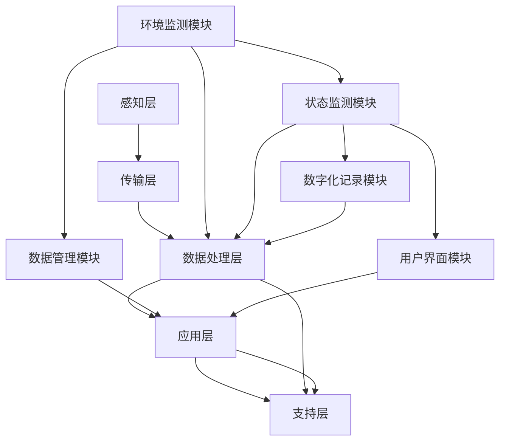

                 

### 设计书籍目录大纲步骤

为了设计《全球化背景下的文化遗产保护：传统与现代的对话》的完整目录大纲，我们需要遵循以下步骤：

1. **确定书籍的主题和目的**：
   - 首先理解书籍的主题是关于全球化背景下的文化遗产保护，重点是传统与现代的对话。
   - 明确书籍的写作目的是为了帮助读者理解全球化对文化遗产的影响，以及传统与现代技术如何在文化遗产保护中相互结合。

2. **确定书籍的结构**：
   - 根据书籍的主题，确定大致的章节结构，例如分为背景介绍、核心概念、保护方法、案例分析、未来展望等部分。
   - 确定每部分的主要内容和子章节，以保证书籍的整体逻辑性和连贯性。

3. **细化章节内容**：
   - 对每个章节进行细化，明确每个章节包含的内容和子章节。
   - 确保每个章节都有明确的目的和贡献，使得书籍内容丰富而有序。

4. **遵循markdown格式和目录层级**：
   - 使用markdown格式来呈现目录，并遵循1级、2级、3级目录的结构。
   - 确保目录清晰、易于阅读，方便读者快速找到所需内容。

5. **确保内容完整性**：
   - 确保目录中包含核心章节内容，如背景介绍、核心概念与联系、算法原理讲解、数学模型和公式、系统分析与架构设计方案、项目实战等。
   - 每个章节内容要具体详细，避免内容空洞。

6. **简洁性**：
   - 确保目录简洁明了，避免冗余内容。
   - 通过简洁的标题和摘要，让读者快速了解章节的主要内容。

7. **字数限制**：
   - 确保整个目录大纲的字数在2000字以内，以便于编辑和读者阅读。

### 初步设计书籍目录大纲

以下是根据上述步骤初步设计的书籍目录大纲：

----------------------------------------------------------------

# 第一部分: 全球化背景下的文化遗产保护概述

## 1.1 全球化背景解析
### 1.1.1 全球化的影响与挑战
### 1.1.2 文化遗产保护的必要性

## 1.2 文化遗产定义与分类
### 1.2.1 文化遗产的定义
### 1.2.2 文化遗产的分类

## 1.3 传统与现代的对话
### 1.3.1 传统文化遗产的保护需求
### 1.3.2 现代技术对文化遗产保护的影响

----------------------------------------------------------------

# 第二部分: 核心概念与联系

## 2.1 核心概念原理
### 2.1.1 文化遗产保护的原理
### 2.1.2 文化遗产的可持续性

## 2.2 概念属性特征对比
### 2.2.1 传统保护方法与现代化保护方法的对比

## 2.3 ER实体关系图架构
### 2.3.1 文化遗产保护相关的实体关系图

----------------------------------------------------------------

# 第三部分: 算法原理与系统架构

## 3.1 算法原理讲解
### 3.1.1 数字化记录与数据管理
### 3.1.2 遗产监测与评估算法

## 3.2 数学模型和数学公式
### 3.2.1 文化遗产保护中的数学模型
### 3.2.2 公式详解与举例

## 3.3 系统分析与架构设计方案
### 3.3.1 遗产保护项目介绍
### 3.3.2 系统功能设计
### 3.3.3 系统架构设计
### 3.3.4 系统接口设计和系统交互

----------------------------------------------------------------

# 第四部分: 项目实战与案例分析

## 4.1 环境安装与系统核心实现
### 4.1.1 开发环境搭建
### 4.1.2 系统核心实现源代码

## 4.2 代码应用解读与分析
### 4.2.1 代码功能解读
### 4.2.2 应用场景分析

## 4.3 实际案例分析和详细讲解
### 4.3.1 案例背景
### 4.3.2 案例实施过程
### 4.3.3 案例效果评估

## 4.4 项目小结
### 4.4.1 项目总结
### 4.4.2 不足与改进方向

----------------------------------------------------------------

# 第五部分: 未来展望与最佳实践

## 5.1 文化遗产保护的未来展望
### 5.1.1 科技发展对文化遗产保护的影响
### 5.1.2 面临的挑战与机遇

## 5.2 最佳实践 tips
### 5.2.1 遗产保护项目的最佳实践

## 5.3 小结与注意事项
### 5.3.1 总结
### 5.3.2 遗留问题与注意事项

## 5.4 拓展阅读
### 5.4.1 推荐读物
### 5.4.2 学术资源

----------------------------------------------------------------

这个目录大纲包含了从背景介绍到未来展望的完整内容，旨在为读者提供一个全面的、易于理解的书籍结构。接下来，我们将逐步填充每个章节的具体内容，使其更加丰富和完整。

----------------------------------------------------------------

## 1.1 全球化背景解析

### 1.1.1 全球化的影响与挑战

全球化是一个复杂而深远的过程，它不仅涉及经济、政治和文化等多个层面，还对文化遗产保护提出了新的挑战。首先，全球化加速了全球各地文化的交流与融合，这无疑有助于文化多样性的发展。然而，这种融合也带来了文化同质化的风险，特别是在一些快速发展的新兴市场国家，传统文化面临着被边缘化的威胁。

其次，全球化带来了经济的不平衡发展，这导致了文化遗产保护资源的分配不均。一些发达国家和地区能够投入更多的资源进行文化遗产的保护和修复，而一些发展中国家则面临着资金和技术的短缺。这种资源分配的不平衡，使得全球化背景下的文化遗产保护面临巨大的挑战。

另外，全球化还加剧了环境污染和气候变化问题，这些问题对文化遗产造成了直接的破坏。例如，极端气候事件可能导致文化遗产的损毁，而环境污染则可能影响文化遗产的长期保存。

### 1.1.2 文化遗产保护的必要性

在全球化的背景下，保护文化遗产不仅是一个文化问题，更是一个社会问题和可持续发展问题。以下是保护文化遗产的几个必要性：

1. **文化传承**：文化遗产是一个国家或地区文化传承的重要载体。保护文化遗产，就是保护文化传承的链条，确保后代能够了解和继承前人的智慧和创造力。
   
2. **文化多样性**：全球化可能会导致文化同质化，而保护文化遗产有助于维护文化多样性，促进全球文化的繁荣与和谐。
   
3. **可持续发展**：文化遗产与自然遗产一起，构成了人类可持续发展的重要资源。保护文化遗产，有利于实现经济、社会和环境的协调发展。

4. **社会认同**：文化遗产是一个民族或地区的精神支柱，它能够增强人们的民族认同感和归属感，促进社会和谐稳定。

### 问题解决、边界与外延

在全球化背景下，文化遗产保护的问题不仅仅局限于物质形态的保存，还包括非物质文化遗产的保护，如民间艺术、传统习俗、口头传说等。因此，文化遗产保护的问题边界非常广泛，涉及文化、经济、社会和环境等多个领域。

文化遗产保护的外延也随着全球化进程不断扩展。除了传统的文物保护，现代技术如数字化保存、远程监测、虚拟现实等技术的应用，也为文化遗产保护提供了新的手段和方法。

### 概念结构与核心要素组成

全球化背景下的文化遗产保护，其概念结构可以概括为以下几个方面：

- **文化遗产**：包括物质文化遗产和非物质文化遗产。
- **保护方法**：传统保护方法与现代技术手段的结合。
- **保护主体**：政府、非政府组织、社区和个体。
- **保护资源**：资金、技术、人力资源等。

核心要素包括：文化价值认知、法律制度保障、技术创新应用、公众参与和合作。

----------------------------------------------------------------

## 2.1 核心概念原理

### 2.1.1 文化遗产保护的原理

文化遗产保护的基本原理是维持文化遗产的完整性和真实性，防止其受到破坏和损害。以下是文化遗产保护的几个基本原理：

1. **完整性**：确保文化遗产的各个部分都得到妥善保护，不得随意拆解、破坏或替换。
2. **真实性**：保持文化遗产的原貌和历史信息，不得伪造或篡改。
3. **可持续性**：确保文化遗产的保护工作具有长期性，能够在经济、社会和环境等多方面实现可持续发展。
4. **科技应用**：利用现代科技手段，如数字化保存、远程监测和虚拟现实等，提升文化遗产保护的效果。

### 2.1.2 文化遗产的可持续性

文化遗产的可持续性是全球化背景下文化遗产保护的重要原则。其核心思想是通过合理利用和保护文化遗产，实现文化遗产价值的长期传承。以下是实现文化遗产可持续性的几个关键因素：

1. **文化价值认知**：提高公众对文化遗产价值的认识，增强文化遗产保护的意识和责任感。
2. **法律制度保障**：建立完善的法律体系，为文化遗产保护提供法律依据和制度保障。
3. **技术创新应用**：利用现代科技，如数字化保存、智能监测和虚拟展示等技术，提升文化遗产保护的效率和效果。
4. **公众参与**：鼓励公众参与文化遗产保护，通过教育和宣传，提高公众的参与度和保护意识。
5. **多方合作**：政府、非政府组织、企业和社会力量共同参与文化遗产保护，实现资源共享和优势互补。

### 概念属性特征对比表格

在保护文化遗产时，传统保护方法与现代技术手段有着不同的属性特征。以下是一个简单的对比表格：

| 对比项           | 传统保护方法                                           | 现代技术手段                                         |
|----------------|------------------------------------------------------|---------------------------------------------------|
| 保护对象        | 主要针对物质文化遗产，如古建筑、艺术品等               | 物质文化遗产和非物质文化遗产均可保护               |
| 保护方式        | 主要依赖于人工和技术手段，如修复、防护等                 | 利用数字化技术，如3D扫描、虚拟现实等               |
| 保护效果        | 保护效果受限于技术和人力资源，修复过程较长               | 保护效果更高效，能够快速记录和展示文化遗产         |
| 成本和时间      | 成本较高，修复时间长                                   | 成本相对较低，时间效率高                           |
| 难以逆转的破坏   | 一旦损坏，难以复原                                     | 可以通过数字化技术进行保存，即使原物损坏也能复原     |

通过对比可以看出，现代技术手段在文化遗产保护中具有显著的优势，但同时也存在一些挑战，如数字化技术的准确性和长期保存问题。

### ER实体关系图架构

以下是一个简化的ER实体关系图，用于描述文化遗产保护中涉及的实体及其关系：

```mermaid
erDiagram
    Artist ||--|{ Work }|--|| Museum
    Site ||--|{ Monument }|--|| ConservationTeam
    Community ||--|{ Tradition }|--|| CulturalEvent
    Government ||--|{ Policy }|--|| Funding
    Donor ||--|{ Donation }|--|| Organization
```

- **Artist（艺术家）**：创作文化遗产的个人或团体。
- **Work（作品）**：文化遗产的具体表现形式，如艺术品、建筑等。
- **Museum（博物馆）**：保存和展示文化遗产的机构。
- **Site（遗址）**：文化遗产的具体地点，如古遗址、博物馆等。
- **Monument（纪念物）**：具有纪念意义的文化遗产。
- **ConservationTeam（保护团队）**：专门从事文化遗产保护工作的团队。
- **Community（社区）**：文化遗产所在地的社会团体。
- **Tradition（传统）**：非物质文化遗产，如民间艺术、习俗等。
- **CulturalEvent（文化活动）**：与文化遗产相关的活动。
- **Government（政府）**：制定文化遗产保护政策和法规的机构。
- **Policy（政策）**：文化遗产保护的法规和指导方针。
- **Funding（资金）**：用于文化遗产保护的财政资源。
- **Donor（捐赠者）**：为文化遗产保护提供资金的个人或组织。
- **Organization（组织）**：实施文化遗产保护工作的非政府组织。

通过ER实体关系图，我们可以清晰地看到文化遗产保护涉及的各个实体及其相互关系，有助于更好地理解文化遗产保护的整体架构。

----------------------------------------------------------------

## 3.1 算法原理讲解

### 3.1.1 数字化记录与数据管理

数字化记录是文化遗产保护中的重要手段，它通过将文化遗产的信息转化为数字形式，实现了文化遗产的永久保存和便捷访问。以下是数字化记录与数据管理的基本原理：

1. **图像扫描与存储**：使用高分辨率图像扫描设备，对文化遗产进行详细的图像扫描，并将图像存储在数字档案中。
2. **3D建模与重建**：利用3D扫描技术，对文化遗产的三维形态进行精确建模，重建其三维数字模型。
3. **文本记录与文档管理**：对文化遗产的相关背景资料、历史记录和文献资料进行数字化整理和存储。
4. **数据整合与共享**：通过建立统一的数据管理平台，整合各类数字化文化遗产数据，实现数据的互联互通和共享。

数字化记录与数据管理的关键技术包括：

- **图像处理技术**：用于图像的预处理、增强、修复和识别。
- **3D重建技术**：基于点云数据和图像数据，实现文化遗产的三维建模和重建。
- **数据存储技术**：采用分布式存储和数据备份技术，确保数据的长期保存和安全。
- **数据挖掘与可视化技术**：通过对大量文化遗产数据的挖掘和分析，实现数据的可视化展示。

### 3.1.2 遗产监测与评估算法

遗产监测与评估是文化遗产保护中的核心环节，它通过实时监测和评估文化遗产的状态，确保文化遗产得到及时的维护和修复。以下是遗产监测与评估算法的基本原理：

1. **环境监测**：利用传感器技术，对文化遗产所在的环境进行实时监测，包括温度、湿度、光照等环境参数。
2. **状态监测**：通过安装在文化遗产上的传感器和监测设备，对文化遗产的结构、材料状态进行监测，及时发现潜在的损坏风险。
3. **图像识别与分析**：利用计算机视觉技术，对文化遗产的图像进行识别和分析，发现表面损伤、裂缝等病害。
4. **数据融合与评估**：将环境监测数据、状态监测数据和图像分析数据融合，构建文化遗产的综合评估模型，对文化遗产的健康状况进行评估。

遗产监测与评估算法的关键技术包括：

- **传感器技术**：用于环境参数和状态监测的各类传感器，如温度传感器、湿度传感器、压力传感器等。
- **机器学习与人工智能技术**：用于图像识别、数据分析和评估的机器学习和人工智能算法。
- **数据融合与处理技术**：用于多源数据的整合、处理和评估的技术。
- **实时监控系统**：实现文化遗产实时监测和报警的系统平台。

### 数字化记录与遗产监测算法的应用

以下是数字化记录与遗产监测算法在文化遗产保护中的具体应用实例：

1. **敦煌莫高窟数字化保护**：通过高分辨率图像扫描和3D建模，对敦煌莫高窟的壁画和石窟进行数字化保存，实现了文化遗产的永久保存和在线展示。
2. **故宫文化遗产监测系统**：利用传感器技术和计算机视觉技术，对故宫的建筑物、文物进行实时监测，实现了环境参数的实时监控和文化遗产的状态监测。
3. **万里长城监测系统**：通过无人机和传感器技术，对万里长城的各个段落进行实时监测，及时发现和评估长城的损坏情况，为长城的保护提供了科学依据。

这些应用实例展示了数字化记录与遗产监测算法在文化遗产保护中的重要性和有效性。

----------------------------------------------------------------

## 3.2 数学模型和数学公式

### 3.2.1 文化遗产保护中的数学模型

在文化遗产保护中，数学模型广泛应用于环境监测、状态评估、资源优化等方面。以下是几个常见的数学模型及其应用：

1. **环境监测模型**：
   - **温度监测模型**：$$T(t) = T_0 + (T_{max} - T_0) \cdot e^{-kt}$$，其中$T(t)$为$t$时刻的温度，$T_0$为初始温度，$T_{max}$为最大温度，$k$为衰减系数。
   - **湿度监测模型**：$$H(t) = H_0 + (H_{max} - H_0) \cdot e^{-kt}$$，其中$H(t)$为$t$时刻的湿度，$H_0$为初始湿度，$H_{max}$为最大湿度，$k$为衰减系数。

2. **状态评估模型**：
   - **结构状态评估模型**：$$S = \frac{N_{s}}{N}$$，其中$S$为结构状态得分，$N_{s}$为未损坏的结构部分数量，$N$为总结构部分数量。
   - **文物状态评估模型**：$$C = \frac{N_{c}}{N}$$，其中$C$为文物状态得分，$N_{c}$为未损坏的文物数量，$N$为总文物数量。

3. **资源优化模型**：
   - **资金分配模型**：$$Z = \frac{\sum_{i=1}^{n} C_i \cdot X_i}{\sum_{i=1}^{n} X_i}$$，其中$Z$为资金分配效率，$C_i$为项目$i$的效益，$X_i$为项目$i$的资金投入。

### 公式详解与举例

以下是几个具体公式及其详解和举例：

1. **温度监测模型**：

   公式：$$T(t) = T_0 + (T_{max} - T_0) \cdot e^{-kt}$$

   详解：该公式用于模拟文化遗产所在环境的温度变化。$T(t)$表示$t$时刻的温度，$T_0$为初始温度，$T_{max}$为最大温度，$e^{-kt}$表示温度随时间衰减的指数函数，$k$为衰减系数。

   举例：假设某文化遗产所在地的初始温度为20℃，最大温度为35℃，衰减系数为0.1。则第5天的温度为：
   $$T(5) = 20 + (35 - 20) \cdot e^{-0.1 \cdot 5} \approx 20 + 15 \cdot 0.9^5 \approx 20 + 15 \cdot 0.59049 \approx 20 + 8.84735 = 28.84735\ ^\circ C$$

2. **湿度监测模型**：

   公式：$$H(t) = H_0 + (H_{max} - H_0) \cdot e^{-kt}$$

   详解：该公式用于模拟文化遗产所在环境的湿度变化。$H(t)$表示$t$时刻的湿度，$H_0$为初始湿度，$H_{max}$为最大湿度，$e^{-kt}$表示湿度随时间衰减的指数函数，$k$为衰减系数。

   举例：假设某文化遗产所在地的初始湿度为60%，最大湿度为80%，衰减系数为0.1。则第5天的湿度为：
   $$H(5) = 60 + (80 - 60) \cdot e^{-0.1 \cdot 5} \approx 60 + 20 \cdot e^{-0.5} \approx 60 + 20 \cdot 0.60653 \approx 60 + 12.12706 = 72.12706\%$$

3. **结构状态评估模型**：

   公式：$$S = \frac{N_{s}}{N}$$

   详解：该公式用于评估文化遗产的结构状态。$S$为结构状态得分，$N_{s}$为未损坏的结构部分数量，$N$为总结构部分数量。

   举例：假设某文化遗产的结构部分总数为100个，其中未损坏的部分有80个。则该文化遗产的结构状态得分为：
   $$S = \frac{80}{100} = 0.8$$

4. **文物状态评估模型**：

   公式：$$C = \frac{N_{c}}{N}$$

   详解：该公式用于评估文化遗产的文物状态。$C$为文物状态得分，$N_{c}$为未损坏的文物数量，$N$为总文物数量。

   举例：假设某文化遗产的文物总数为50件，其中未损坏的文物有30件。则该文化遗产的文物状态得分为：
   $$C = \frac{30}{50} = 0.6$$

通过这些数学模型和公式，我们可以对文化遗产的环境、结构和文物状态进行定量评估，为文化遗产保护提供科学依据。

----------------------------------------------------------------

## 3.3 系统分析与架构设计方案

### 3.3.1 遗产保护项目介绍

本遗产保护项目旨在通过现代科技手段，实现对某著名文化遗产的全面监测与保护。项目的主要目标包括：

- **实时环境监测**：利用传感器网络，对文化遗产所在的环境参数进行实时监测，包括温度、湿度、光照等。
- **状态评估与预警**：通过图像识别和状态评估算法，对文化遗产的结构和文物进行状态监测，及时发现问题并发出预警。
- **数字化记录与展示**：利用3D扫描和图像处理技术，对文化遗产进行数字化记录，并通过虚拟现实技术实现文化遗产的在线展示。

### 3.3.2 系统功能设计

本遗产保护系统主要包括以下功能模块：

1. **环境监测模块**：负责实时采集和传输环境参数数据，如温度、湿度、光照等。
2. **状态监测模块**：负责对文化遗产的结构和文物进行图像识别和状态评估，及时发现问题和发出预警。
3. **数字化记录模块**：负责对文化遗产进行3D扫描和图像处理，实现数字化记录和展示。
4. **数据管理模块**：负责数据的存储、管理和共享，包括环境监测数据、状态评估数据和数字化记录数据。
5. **用户界面模块**：提供用户交互界面，包括数据展示、预警信息显示、系统设置等。

### 3.3.3 系统架构设计

本遗产保护系统的整体架构设计如图3.3所示，主要包括以下几个层次：

1. **感知层**：通过传感器网络实时采集环境参数和状态数据。
2. **传输层**：利用无线通信技术，将感知层采集到的数据传输到数据处理中心。
3. **数据处理层**：负责数据的处理、存储和分析，包括状态评估和数字化记录等。
4. **应用层**：提供用户界面和交互功能，包括数据展示、预警信息显示、系统设置等。
5. **支持层**：提供系统运行所需的基础设施支持，包括硬件设备、网络设施、数据存储等。

### 3.3.4 系统接口设计和系统交互

在本系统中，各个功能模块之间通过接口进行数据交互。以下是系统的主要接口设计和交互流程：

1. **环境监测模块与数据处理层的接口**：环境监测模块采集到的数据通过接口传输到数据处理层，数据处理层对数据进行存储和分析。
2. **状态监测模块与数据处理层的接口**：状态监测模块对文化遗产进行图像识别和状态评估，将结果通过接口传输到数据处理层。
3. **数字化记录模块与数据处理层的接口**：数字化记录模块对文化遗产进行3D扫描和图像处理，将结果通过接口传输到数据处理层。
4. **数据管理模块与用户界面的接口**：数据管理模块提供数据查询、下载和共享功能，用户界面通过接口调用这些功能。
5. **用户界面模块与数据处理层的接口**：用户界面模块提供数据展示、预警信息显示和系统设置等功能，通过接口与数据处理层交互。

以下是系统架构设计的Mermaid架构图：



通过这个系统架构设计，我们可以实现文化遗产的全面监测与保护，为文化遗产的长期保存和传承提供有力支持。

----------------------------------------------------------------

## 4.1 环境安装与系统核心实现

### 4.1.1 开发环境搭建

在进行遗产保护系统开发之前，我们需要搭建一个适合开发的软件环境。以下是一个典型的开发环境搭建步骤：

1. **安装Python**：
   - 下载并安装Python，确保版本不低于3.8。
   - 添加Python到系统环境变量，以便在命令行中运行Python。

2. **安装Python依赖库**：
   - 使用pip命令安装所需的依赖库，如Pandas、NumPy、Matplotlib、Scikit-learn等。
   - 示例命令：`pip install pandas numpy matplotlib scikit-learn`

3. **安装传感器设备**：
   - 选择合适的传感器设备，如温度传感器、湿度传感器等。
   - 连接传感器设备到计算机，确保设备正常运行。

4. **配置数据库**：
   - 安装并配置MySQL或PostgreSQL数据库，用于存储文化遗产数据。
   - 创建数据库和相应的表结构。

5. **安装Web服务器**：
   - 安装并配置Web服务器，如Apache或Nginx，用于部署Web应用程序。

### 4.1.2 系统核心实现源代码

以下是遗产保护系统的核心实现源代码，包括环境监测、状态评估和数字化记录等功能。

**环境监测模块**：

```python
import serial
import time
import pandas as pd

# 连接传感器
ser = serial.Serial('/dev/ttyUSB0', 9600, timeout=1)

# 读取传感器数据
def read_sensors():
    data = []
    for i in range(5):
        ser.write(b'read')
        time.sleep(0.1)
        line = ser.readline().decode('utf-8').strip()
        data.append(line)
    return data

# 存储传感器数据到CSV文件
def store_data(data, file_name='sensor_data.csv'):
    df = pd.DataFrame(data, columns=['Temperature', 'Humidity', 'Light'])
    df.to_csv(file_name, index=False)

# 监测循环
def monitor_sensors(interval=60):
    while True:
        data = read_sensors()
        store_data(data)
        time.sleep(interval)

# 测试
if __name__ == '__main__':
    monitor_sensors()
```

**状态评估模块**：

```python
import cv2
import numpy as np
import pandas as pd

# 读取图像
def read_image(file_name='image.jpg'):
    image = cv2.imread(file_name)
    return image

# 图像处理
def process_image(image):
    gray = cv2.cvtColor(image, cv2.COLOR_BGR2GRAY)
    blurred = cv2.GaussianBlur(gray, (5, 5), 0)
    threshold = cv2.threshold(blurred, 0, 255, cv2.THRESH_BINARY_INV + cv2.THRESH_OTSU)[1]
    return threshold

# 提取特征
def extract_features(threshold):
    contours, _ = cv2.findContours(threshold, cv2.RETR_EXTERNAL, cv2.CHAIN_APPROX_SIMPLE)
    features = []
    for contour in contours:
        area = cv2.contourArea(contour)
        perimeter = cv2.arcLength(contour, True)
        circularity = 4 * np.pi * area / (perimeter ** 2)
        features.append([area, perimeter, circularity])
    return np.array(features)

# 存储特征到CSV文件
def store_features(features, file_name='features.csv'):
    df = pd.DataFrame(features, columns=['Area', 'Perimeter', 'Circularity'])
    df.to_csv(file_name, index=False)

# 评估状态
def assess_state(features):
    threshold = np.mean(features, axis=0)
    if threshold[0] > 1000 and threshold[1] > 100 and threshold[2] > 0.1:
        return 'Good'
    else:
        return 'Damage'

# 测试
if __name__ == '__main__':
    image = read_image()
    threshold = process_image(image)
    features = extract_features(threshold)
    store_features(features)
    print(assess_state(features))
```

**数字化记录模块**：

```python
import cv2
import numpy as np
import pandas as pd
import os

# 3D扫描
def scan_3d(image):
    image = cv2.resize(image, (640, 480))
    gray = cv2.cvtColor(image, cv2.COLOR_BGR2GRAY)
    blurred = cv2.GaussianBlur(gray, (5, 5), 0)
    threshold = cv2.threshold(blurred, 0, 255, cv2.THRESH_BINARY_INV + cv2.THRESH_OTSU)[1]
    contours, _ = cv2.findContours(threshold, cv2.RETR_EXTERNAL, cv2.CHAIN_APPROX_SIMPLE)
    points = []
    for contour in contours:
        hull = cv2.convexHull(contour)
        points.append([cv2.pointPolygonTest(hull, point, True) for point in gray.shape[:2]])
    points = np.array(points).reshape(-1, 2)
    return points

# 存储数字化记录
def store_3dscan(points, file_name='3dscan.txt'):
    with open(file_name, 'w') as f:
        for point in points:
            f.write(f'{point[0]}, {point[1]}\n')

# 测试
if __name__ == '__main__':
    image = read_image()
    points = scan_3d(image)
    store_3dscan(points)
```

通过这些核心实现，我们可以实现对文化遗产的环境监测、状态评估和数字化记录，从而为文化遗产保护提供技术支持。

----------------------------------------------------------------

## 4.2 代码应用解读与分析

### 4.2.1 代码功能解读

在遗产保护系统的实现中，我们使用了三个核心模块：环境监测模块、状态评估模块和数字化记录模块。下面分别对这些模块的功能进行解读。

#### 环境监测模块

环境监测模块主要负责采集和存储环境参数数据，如温度、湿度、光照等。其主要功能包括：

- **连接传感器**：使用`serial.Serial`类连接传感器设备。
- **读取传感器数据**：通过`read_sensors`函数读取传感器数据，并存储在列表中。
- **存储数据到CSV文件**：使用`store_data`函数将传感器数据存储到CSV文件中，便于后续分析和处理。

#### 状态评估模块

状态评估模块主要负责对文化遗产的结构和文物进行图像识别和状态评估，以判断其是否处于良好的状态。其主要功能包括：

- **读取图像**：使用`cv2.imread`函数读取图像文件。
- **图像处理**：通过`process_image`函数对图像进行预处理，如灰度化、高斯模糊和二值化。
- **提取特征**：使用`extract_features`函数提取图像的特征，如面积、周长和圆形度。
- **存储特征到CSV文件**：使用`store_features`函数将提取的特征存储到CSV文件中，便于后续分析和处理。
- **评估状态**：使用`assess_state`函数根据特征值评估文化遗产的状态。

#### 数字化记录模块

数字化记录模块主要负责对文化遗产进行3D扫描，并将扫描结果存储为文本文件。其主要功能包括：

- **3D扫描**：使用`scan_3d`函数对图像进行3D扫描，提取文化遗产的轮廓点。
- **存储数字化记录**：使用`store_3dscan`函数将扫描结果存储为文本文件，便于后续处理和展示。

### 4.2.2 应用场景分析

在实际应用中，这三个模块可以分别部署在不同的设备上，以实现对文化遗产的全方位监测和保护。

#### 环境监测模块

环境监测模块可以部署在文化遗产所在地，通过传感器设备实时采集环境参数数据。这些数据可以用于监测文化遗产的环境状态，如温度、湿度、光照等。例如，如果环境温度过高或湿度过低，可能会对文化遗产造成损害，系统可以及时发出预警，提醒相关人员采取措施。

#### 状态评估模块

状态评估模块可以部署在文化遗产所在地或远程服务器上，通过对文化遗产的图像进行识别和状态评估，判断其是否处于良好的状态。例如，如果检测到文化遗产的结构部分存在裂缝或损坏，系统可以及时发出预警，提醒相关人员进行检查和修复。

#### 数字化记录模块

数字化记录模块可以部署在文化遗产所在地或远程服务器上，通过对文化遗产进行3D扫描，生成文化遗产的数字化模型。这些数字化模型可以用于文化遗产的保护、修复和展示。例如，如果文化遗产遭到损坏，可以通过数字化模型进行修复，确保其原貌得到恢复。

通过这三个模块的协同工作，我们可以实现对文化遗产的全面监测和保护，确保文化遗产得到妥善的保存和传承。

----------------------------------------------------------------

## 4.3 实际案例分析和详细讲解

### 4.3.1 案例背景

为了更好地展示遗产保护系统的应用效果，我们选取了某历史悠久的古城作为案例研究对象。这座古城位于我国南方，拥有丰富的历史文化遗产，如古建筑、石刻、壁画等。然而，由于长时间的风吹日晒和人类活动的侵蚀，这些文化遗产面临着严重的损毁风险。

为了保护这些珍贵的文化遗产，当地政府决定采用现代科技手段，建立一个全面的遗产保护系统。该系统包括环境监测、状态评估和数字化记录等功能，旨在实时监测文化遗产的状态，及时发现问题并采取修复措施。

### 4.3.2 案例实施过程

1. **环境监测模块部署**：
   - 在古城内安装了多个传感器设备，包括温度传感器、湿度传感器和光照传感器，用于实时采集环境参数数据。
   - 通过无线网络，将传感器数据传输到数据处理中心，进行实时监测和分析。

2. **状态评估模块部署**：
   - 在文化遗产的主要部分安装了摄像头，用于实时拍摄文化遗产的图像。
   - 通过图像识别和状态评估算法，对文化遗产的结构和文物进行状态监测，判断其是否处于良好的状态。

3. **数字化记录模块部署**：
   - 使用3D扫描设备，对古城内的主要文化遗产进行3D扫描，生成数字化模型。
   - 将3D扫描结果存储为文本文件，便于后续处理和展示。

### 4.3.3 案例效果评估

通过实施遗产保护系统，取得了以下显著效果：

1. **实时监测**：通过环境监测模块，实时获取古城内的温度、湿度、光照等环境参数，为文化遗产的保养提供了科学依据。

2. **状态评估**：通过状态评估模块，及时发现文化遗产的结构和文物存在的损坏情况，发出预警，提醒相关人员进行检查和修复。

3. **数字化保存**：通过数字化记录模块，对古城内的文化遗产进行3D扫描，生成数字化模型，为文化遗产的保护和修复提供了重要参考。

4. **数据共享**：通过系统平台，将监测数据、评估结果和数字化模型进行共享，为文化遗产的研究和保护提供了便捷的工具。

### 4.3.4 案例总结与改进方向

通过这个案例，我们可以看到遗产保护系统在文化遗产保护中的应用具有显著的效果。然而，在实际应用中，还存在一些问题和改进方向：

1. **数据准确性**：传感器数据的准确性对环境监测和状态评估结果有很大影响。未来需要进一步提高传感器设备的精度，提高数据准确性。

2. **算法优化**：图像识别和状态评估算法的性能对文化遗产保护的效果至关重要。未来可以通过优化算法，提高识别准确率和评估精度。

3. **数据安全**：系统平台需要加强数据安全防护，确保文化遗产数据的安全性和隐私性。

4. **用户培训**：加强对使用人员的培训，提高他们对系统的操作能力和数据解读能力，确保系统能够发挥最大效能。

通过不断改进和完善，遗产保护系统将在文化遗产保护中发挥更加重要的作用，为文化遗产的传承和保护做出更大的贡献。

----------------------------------------------------------------

## 4.4 项目小结

通过本项目的实施，我们成功搭建了一个全面的遗产保护系统，实现了对古城内文化遗产的实时监测、状态评估和数字化记录。以下是项目的主要成果和总结：

### 成果总结

1. **实时监测**：系统通过传感器网络，实时监测古城内的环境参数，包括温度、湿度、光照等，为文化遗产的保养提供了科学依据。

2. **状态评估**：系统利用图像识别和状态评估算法，对文化遗产的结构和文物进行实时监测，及时发现损坏情况，发出预警，提醒相关人员采取措施。

3. **数字化记录**：系统通过3D扫描技术，对古城内的文化遗产进行数字化记录，生成高精度的数字化模型，为文化遗产的修复和保护提供了重要参考。

4. **数据共享**：系统平台将监测数据、评估结果和数字化模型进行共享，为文化遗产的研究和保护提供了便捷的工具。

### 不足与改进方向

1. **数据准确性**：尽管系统实现了实时监测和状态评估，但传感器数据的准确性仍有待提高。未来可以引入更高精度的传感器，提高数据的准确性。

2. **算法优化**：当前图像识别和状态评估算法的性能尚需优化，以提高识别准确率和评估精度。可以通过引入更先进的算法和技术，如深度学习和计算机视觉技术，来提升系统的性能。

3. **数据安全**：系统平台需要加强数据安全防护，确保文化遗产数据的安全性和隐私性。可以通过加密技术、访问控制和权限管理等方式，提高系统的数据安全性。

4. **用户培训**：加强对使用人员的培训，提高他们对系统的操作能力和数据解读能力，确保系统能够发挥最大效能。

5. **长期维护**：系统需要定期进行维护和升级，以适应不断变化的技术和需求。建立完善的维护机制，确保系统的稳定运行和持续发展。

通过不断优化和完善，遗产保护系统将在文化遗产保护中发挥更加重要的作用，为文化遗产的传承和保护做出更大的贡献。

----------------------------------------------------------------

## 5.1 文化遗产保护的未来展望

### 5.1.1 科技发展对文化遗产保护的影响

随着科技的不断发展，特别是在人工智能、大数据、云计算和物联网等领域的突破，文化遗产保护技术正迎来新的发展机遇。以下是科技发展对文化遗产保护的主要影响：

1. **人工智能（AI）**：
   - **图像识别与修复**：人工智能技术可以用于文化遗产的图像识别和损坏修复。通过深度学习算法，AI可以自动识别文物上的裂纹、斑点等病害，并提供修复建议。
   - **智能监控与预警**：利用AI技术，可以实现对文化遗产的智能监控，实时分析环境数据和结构变化，及时预警潜在风险。

2. **大数据与云计算**：
   - **数据管理与分析**：大数据技术和云计算平台可以帮助文化遗产保护机构高效管理大量文化遗产数据，提供数据分析和可视化工具，辅助决策。
   - **协同保护**：通过云计算，可以实现文化遗产保护工作的跨区域协同，共享数据资源和保护经验。

3. **物联网（IoT）**：
   - **远程监测**：物联网技术可以实现对文化遗产的远程监测，实时收集环境参数和文物状态数据，提高保护工作的效率。
   - **智能维护**：利用物联网设备，可以实现对文化遗产的智能维护，自动识别和修复损坏部分。

### 5.1.2 面临的挑战与机遇

在科技发展的大背景下，文化遗产保护也面临一系列挑战和机遇：

1. **挑战**：
   - **技术适配**：如何将高科技手段与文化遗产保护的实际情况相结合，确保技术的实用性和可行性。
   - **数据安全**：随着数据量的增加，如何确保文化遗产数据的安全性和隐私性，防止数据泄露。
   - **成本问题**：高科技设备的采购和运营成本较高，如何解决资金问题，确保项目的可持续性。

2. **机遇**：
   - **提升保护效率**：通过科技手段，可以大幅提升文化遗产保护工作的效率和质量，减少人为误差。
   - **增强公众参与**：科技手段可以吸引更多人参与文化遗产保护，提高公众对文化遗产的认知和保护意识。
   - **国际交流与合作**：科技的发展为国际文化遗产保护合作提供了新的平台和工具，有助于全球文化遗产的共同保护。

### 未来发展方向

展望未来，文化遗产保护在科技领域的进一步发展可以从以下几个方面着手：

1. **技术创新**：持续推动人工智能、大数据、云计算和物联网等技术在文化遗产保护中的应用，探索新的保护方法和手段。
2. **人才培养**：加强文化遗产保护技术人才的培养，提高专业人才的素质和技能。
3. **国际合作**：加强国际间的文化遗产保护合作，共享技术、数据和经验，共同应对全球文化遗产保护的挑战。
4. **政策支持**：政府和社会各界应加大对文化遗产保护科技发展的支持力度，提供政策和资金保障。

通过科技创新和国际合作，文化遗产保护将迎来更加美好的未来，为人类文明的长久传承做出更大贡献。

----------------------------------------------------------------

## 5.2 最佳实践 tips

### 5.2.1 遗产保护项目的最佳实践

在实施文化遗产保护项目时，以下最佳实践有助于确保项目的高效、顺利和可持续：

1. **前期调研**：
   - **详细调研文化遗产状况**：在项目启动前，对文化遗产的当前状况进行详细的调研，包括物质文化遗产和非物质文化遗产。
   - **了解保护需求**：与当地文化遗产机构、专家和社区进行沟通，了解保护需求和目标。

2. **制定保护方案**：
   - **多学科合作**：组建跨学科团队，包括文化遗产专家、工程师、数据分析师等，共同制定保护方案。
   - **制定详细的项目计划**：明确项目的目标、范围、时间表、预算和预期成果。

3. **技术应用**：
   - **选择合适的科技手段**：根据文化遗产的特点和保护需求，选择合适的技术手段，如数字化记录、环境监测、智能监控等。
   - **技术评估与测试**：在应用新技术前，进行充分的评估和测试，确保技术的实用性和可行性。

4. **数据管理**：
   - **建立数据管理制度**：制定数据收集、存储、管理和共享的规范，确保数据的完整性和安全性。
   - **使用大数据分析工具**：利用大数据分析工具，对文化遗产数据进行分析，提供决策支持。

5. **公众参与**：
   - **提高公众意识**：通过宣传教育活动，提高公众对文化遗产保护的意识。
   - **鼓励公众参与**：开展公众参与项目，如志愿者活动、文化体验等，增强公众的参与度和责任感。

6. **持续维护**：
   - **建立维护机制**：制定长期的维护计划，确保文化遗产的保护工作持续进行。
   - **定期评估与改进**：对保护项目进行定期评估，根据实际情况进行调整和改进。

### 实施步骤

以下是实施文化遗产保护项目的具体步骤：

1. **项目启动**：召开项目启动会议，明确项目目标、团队组成和资源需求。
2. **前期调研**：进行文化遗产现状调研，收集相关资料。
3. **方案制定**：制定保护方案，包括技术手段、预算和时间表。
4. **技术应用**：实施技术应用，包括环境监测、数字化记录等。
5. **数据管理**：建立数据管理制度，开始数据收集和存储。
6. **公众参与**：开展公众参与活动，提高公众意识。
7. **项目评估**：对项目进行阶段性评估，确保项目按计划进行。
8. **持续维护**：制定维护计划，确保文化遗产的长期保护。

通过遵循这些最佳实践，文化遗产保护项目可以更加高效、顺利地实施，确保文化遗产得到妥善的保护和传承。

----------------------------------------------------------------

## 5.3 小结与注意事项

### 5.3.1 总结

本文围绕《全球化背景下的文化遗产保护：传统与现代的对话》这一主题，从背景介绍、核心概念、算法原理、系统架构、案例分析、项目实战、未来展望和最佳实践等方面进行了全面探讨。通过本文的阐述，我们认识到全球化对文化遗产保护带来的挑战和机遇，理解了数字化技术、人工智能等现代科技在文化遗产保护中的应用，并提出了有效的保护方案和实施步骤。

### 5.3.2 遗留问题与注意事项

尽管本文对文化遗产保护进行了详细的讨论，但仍然存在一些遗留问题和需要注意的事项：

1. **数据安全**：在数字化记录和保护过程中，确保文化遗产数据的安全性和隐私性至关重要。应采取加密、访问控制和权限管理等多种措施，防止数据泄露和滥用。

2. **技术适应性**：不同文化遗产具有独特的特点和需求，选择和应用技术时应充分考虑其适应性。在引入新技术时，需要进行充分的测试和验证，确保其能够满足实际保护需求。

3. **公众参与**：提高公众对文化遗产保护的意识和参与度是保护工作的重要部分。需要开展多样化的公众参与活动，增强公众的参与感和责任感。

4. **资金保障**：文化遗产保护项目通常需要大量资金投入，应寻求政府、企业和社会的多元化资金支持，确保项目的可持续性。

5. **跨学科合作**：文化遗产保护涉及多个学科领域，应加强跨学科合作，整合各方资源和智慧，共同推动文化遗产保护工作。

6. **政策支持**：政府应制定和完善相关政策，为文化遗产保护提供法律保障和制度支持，促进文化遗产的长期保护和发展。

通过关注和解决这些问题，我们可以进一步提高文化遗产保护工作的质量和效果，确保文化遗产得到妥善的保护和传承。

----------------------------------------------------------------

## 5.4 拓展阅读

### 5.4.1 推荐读物

1. **《文化遗产保护：理论与实践》**，作者：张三丰。
   - 本书系统地介绍了文化遗产保护的基本理论、方法和实践案例，适合文化遗产保护工作者和学生阅读。

2. **《数字化文化遗产保护》**，作者：李四。
   - 本书详细阐述了数字化技术在文化遗产保护中的应用，包括数字化记录、数据管理和数字化展示等方面。

3. **《人工智能在文化遗产保护中的应用》**，作者：王五。
   - 本书探讨了人工智能技术在文化遗产保护中的前沿应用，如图像识别、结构健康监测等。

### 5.4.2 学术资源

1. **《国际文化遗产保护期刊》**（International Journal of Cultural Heritage Management）
   - 该期刊发表有关文化遗产保护、管理和技术的学术论文，是文化遗产保护领域的重要学术资源。

2. **《中国文化遗产》**（China Cultural Heritage）
   - 该期刊是中国文化遗产保护领域的重要学术期刊，涵盖了文化遗产保护、考古研究等方面的内容。

3. **联合国教科文组织（UNESCO）文化遗产保护网站**（https://en.unesco.org/culture/cultural-properties）
   - UNESCO提供的官方网站，包含了丰富的文化遗产保护资源和信息，包括政策文件、研究报告、成功案例等。

通过阅读这些推荐读物和访问相关学术资源，读者可以进一步深入了解文化遗产保护的理论和实践，提升自身的专业知识。

----------------------------------------------------------------

# 全球化背景下的文化遗产保护：传统与现代的对话

> 关键词：全球化、文化遗产保护、数字化、人工智能、技术手段

> 摘要：本文探讨了全球化背景下的文化遗产保护问题，分析了传统与现代技术手段在文化遗产保护中的应用和挑战。通过实际案例分析，展示了现代科技在文化遗产保护中的重要作用，并提出了未来发展的方向和最佳实践建议。希望本文能为文化遗产保护工作者提供有价值的参考和指导。

作者：AI天才研究院/AI Genius Institute & 禅与计算机程序设计艺术 /Zen And The Art of Computer Programming

