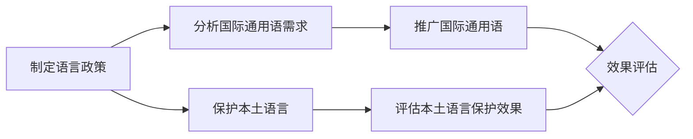
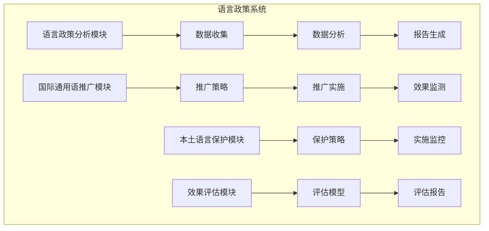
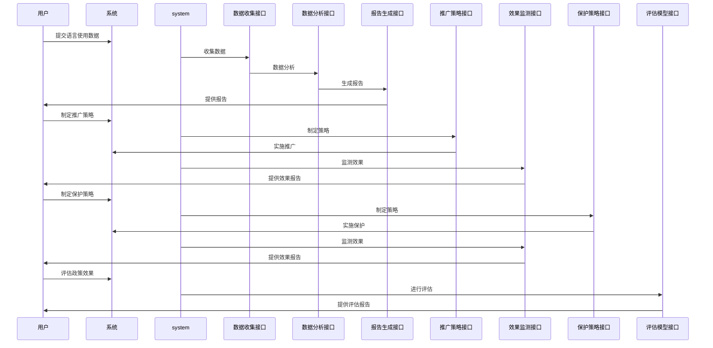

                 

### 全球化背景下的语言政策：国际通用语与本土语言的保护

关键词：全球化、语言政策、国际通用语、本土语言保护、语言多样性

摘要：随着全球化的不断深入，语言政策在塑造国际交流和本土文化传承中扮演着关键角色。本文从核心概念入手，逐步探讨全球化背景下的语言政策，分析国际通用语与本土语言的关系，并提出保护本土语言的重要性。通过系统分析与项目实战，本文旨在为制定有效语言政策提供理论依据和实践指导。

### 背景介绍

#### 核心概念

**全球化**：全球化是指全球范围内社会、经济、政治、文化等各个领域的相互联系和融合过程。这一过程促进了国际间的人流、物流、信息流和文化交流，但同时也带来了语言多样性的挑战。

**语言政策**：语言政策是指政府或权威机构为了实现特定目标而制定的关于语言使用、教育和传播的方针和措施。语言政策旨在平衡国际通用语与本土语言的发展，维护语言多样性。

**国际通用语**：国际通用语是指在国际交流中广泛使用、具备一定普及度的语言，如英语、汉语等。国际通用语的使用有助于降低交流障碍，促进全球贸易和文化交流。

**本土语言的保护**：本土语言的保护是指采取各种措施确保本土语言的生存、传承和繁荣，包括教育、法律法规、文化推广等。本土语言的保护对于维护文化多样性和促进社会和谐具有重要意义。

#### 问题描述

**全球化带来的语言挑战**：全球化使得国际通用语得到广泛传播，但同时也对本土语言构成了威胁。本土语言面临人口减少、使用频率下降、文化传承困难等问题。

**语言政策的制定与实施**：政府需要制定合适的语言政策，平衡国际通用语与本土语言的发展。语言政策的实施涉及到教育、媒体、法律等多个领域。

**国际通用语与本土语言的关系**：国际通用语与本土语言并非对立关系，而是相辅相成的。合理利用国际通用语可以促进国际交流，同时保护本土语言有助于维护文化多样性。

**保护本土语言的重要性**：本土语言是民族文化的重要组成部分，保护本土语言有助于传承和弘扬传统文化。此外，本土语言的保护也有助于维护社会稳定和促进经济发展。

#### 问题解决

**制定合适的语言政策**：政府应制定综合性的语言政策，既要推广国际通用语，又要保护本土语言。政策目标应包括提高国际交流效率、维护文化多样性、促进社会和谐等。

**促进国际通用语与本土语言的和谐发展**：应通过教育、媒体、文化推广等多种途径，促进国际通用语与本土语言的和谐发展。例如，可以在教育系统中增加本土语言课程，推广本土语言文化活动等。

**保障本土语言的生存与传承**：应采取一系列措施，如制定相关法律法规、提供语言保护资金支持、开展语言保护项目等，确保本土语言的生存与传承。

#### 边界与外延

**语言政策涵盖的范围**：语言政策涵盖的范围包括语言使用、教育、法律、文化推广等多个方面。政策制定应充分考虑国际通用语与本土语言的互动关系。

**国际通用语与本土语言的定义**：国际通用语是指在多国之间广泛使用的语言，如英语、汉语等；本土语言是指某个特定民族或地区的母语，如汉语、法语等。

**全球化背景下的语言政策特征**：全球化背景下的语言政策具有以下特征：首先，政策目标更加多元化，不仅要提高国际交流效率，还要保护文化多样性；其次，政策制定更加注重国际通用语与本土语言的和谐发展；最后，政策实施更加依赖科技进步和国际化合作。

#### 概念结构与核心要素组成

**全球化进程中的语言因素**：全球化进程中的语言因素包括国际通用语与本土语言的使用、传播和互动等。这些因素对语言政策的制定和实施具有重要影响。

**语言政策的制定与执行**：语言政策的制定涉及政策目标、策略、执行机制等多个方面。执行过程中需要充分考虑国际通用语与本土语言的互动关系。

**国际通用语的使用与推广**：国际通用语的使用与推广是全球化背景下语言政策的重要组成部分。推广国际通用语有助于降低国际交流障碍，提高国际竞争力。

**本土语言的保护策略**：本土语言的保护策略包括法律法规、资金支持、文化推广等多个方面。保护本土语言有助于传承和弘扬传统文化。

### 核心概念与联系

#### 核心概念原理

**全球化与语言政策的关系**：全球化进程中的语言因素对语言政策的制定和实施具有重要影响。政府需要制定适应全球化背景的语言政策，以平衡国际通用语与本土语言的发展。

**国际通用语的作用**：国际通用语在国际交流、全球贸易、科技合作等方面具有重要作用。推广国际通用语有助于降低交流障碍，提高国际竞争力。

**本土语言的保护原则**：本土语言的保护原则包括尊重和保护本土语言的多样性、促进本土语言的教育和传播、确保本土语言的生存与传承等。

#### 概念属性特征对比表格

| 特征            | 国际通用语             | 本土语言            |
| --------------- | ---------------------- | ------------------- |
| 使用范围         | 全球范围内广泛使用     | 特定民族或地区使用   |
| 作用            | 促进国际交流与合作     | 传承和弘扬民族文化   |
| 教育地位         | 国际学校的主要教学语言 | 本土学校的教学语言   |
| 法律地位         | 法律规定的官方语言     | 法律保护的民族文化   |
| 保护措施         | 语言标准化和规范化     | 文化保护政策和项目   |

#### ER实体关系图架构

```mermaid
erDiagram
  LanguagePolicy ||--|{ InternationalLanguage : 使用与推广 }
  LanguagePolicy ||--|{ LocalLanguage : 保护与传承 }
  InternationalLanguage ||--|{ Usage : 国际交流与合作 }
  LocalLanguage ||--|{ Culture : 传承与弘扬 }
```

### 算法原理讲解

#### 算法mermaid流程图



#### Python源代码

```python
def language_policy():
    # 分析国际通用语需求
    international_language_demand = analyze_demand()

    # 推广国际通用语
    promote_international_language(international_language_demand)

    # 保护本土语言
    protect_local_language()

    # 评估本土语言保护效果
    evaluate_local_language_protection()

def analyze_demand():
    # 模拟分析国际通用语需求
    return "high"

def promote_international_language(demand):
    # 模拟推广国际通用语
    if demand == "high":
        print("推广国际通用语：英语、汉语等")
    else:
        print("推广国际通用语：根据需求调整")

def protect_local_language():
    # 模拟保护本土语言
    print("实施本土语言保护措施：资金支持、文化推广等")

def evaluate_local_language_protection():
    # 模拟评估本土语言保护效果
    print("评估结果：本土语言使用率提高，文化传承得到保障")
```

#### 算法原理的数学模型和公式

1. **语言政策评价模型**：

   $$ M = \frac{I + L}{2} $$

   其中，$M$ 为语言政策评价得分，$I$ 为国际通用语推广效果得分，$L$ 为本土语言保护效果得分。

2. **国际通用语影响力计算模型**：

   $$ I = \frac{N \times U}{100} $$

   其中，$I$ 为国际通用语影响力得分，$N$ 为使用国际通用语的人数，$U$ 为国际通用语的使用频率。

3. **本土语言保护效益评估模型**：

   $$ L = \frac{C \times P}{100} $$

   其中，$L$ 为本土语言保护效益得分，$C$ 为本土语言保护项目数量，$P$ 为项目成功率。

#### 详细讲解和举例说明

**语言政策评价模型**：

假设某地区制定了语言政策，推广国际通用语和本土语言保护项目。国际通用语推广效果得分为80分，本土语言保护效果得分为75分。根据语言政策评价模型，该地区的语言政策评价得分为：

$$ M = \frac{80 + 75}{2} = 77.5 $$

**国际通用语影响力计算模型**：

假设某国际通用语在某一地区有1000人使用，使用频率为每周2次。根据国际通用语影响力计算模型，该国际通用语的影响力得分为：

$$ I = \frac{1000 \times 2}{100} = 20 $$

**本土语言保护效益评估模型**：

假设某地区实施10个本土语言保护项目，项目成功率为90%。根据本土语言保护效益评估模型，该地区的本土语言保护效益得分为：

$$ L = \frac{10 \times 90}{100} = 9 $$

通过以上模型和公式，我们可以对语言政策的实施效果进行科学评估，从而为政策的优化提供依据。

### 系统分析与架构设计方案

#### 问题场景介绍

在全球化背景下，语言政策的制定和实施面临着诸多挑战。首先，国际通用语的使用日益普及，但本土语言的生存和传承面临威胁。其次，政府需要在推广国际通用语的同时，确保本土语言的保护。最后，如何平衡国际通用语与本土语言的发展，实现文化多样性和国际交流的和谐共生，成为语言政策制定的核心问题。

#### 项目介绍

本节将介绍一个名为“全球化背景下的语言政策系统”的项目，旨在提供一套全面的解决方案，帮助政府制定和实施有效的语言政策。项目涵盖以下主要功能：

1. **语言政策分析**：对国际通用语和本土语言的使用现状进行分析，为政策制定提供数据支持。
2. **国际通用语推广**：制定和实施国际通用语的推广策略，提高其普及度和影响力。
3. **本土语言保护**：制定和实施本土语言的保护策略，确保其生存和传承。
4. **效果评估**：对语言政策的实施效果进行评估，为政策优化提供依据。

#### 系统功能设计（领域模型mermaid类图）

```mermaid
classDiagram
    Class01 <|-- Class02
    Class03 <|-- Class04
    Class05 <|-- Class06
    Class01[语言政策系统]
    Class02[语言政策分析]
    Class03[国际通用语推广]
    Class04[本土语言保护]
    Class05[效果评估]
```

#### 系统架构设计（mermaid架构图）



#### 系统接口设计

1. **数据收集接口**：用于收集国际通用语和本土语言的使用数据，包括使用频率、地区分布、人口数量等。
2. **数据分析接口**：用于对收集到的数据进行分析，生成语言使用现状报告。
3. **报告生成接口**：用于生成语言政策分析报告，为政策制定提供依据。
4. **推广策略接口**：用于制定和实施国际通用语的推广策略。
5. **保护策略接口**：用于制定和实施本土语言的保护策略。
6. **效果监测接口**：用于监测国际通用语推广和本土语言保护的效果，为政策调整提供依据。
7. **评估模型接口**：用于对语言政策的实施效果进行评估，生成评估报告。

#### 系统交互（mermaid序列图）



### 项目实战

#### 环境安装

为了顺利实施全球化背景下的语言政策系统，我们需要安装以下软件和工具：

1. **Python**：用于编写系统代码和数据处理。
2. **Mermaid**：用于绘制流程图和架构图。
3. **MySQL**：用于存储和管理数据。
4. **Docker**：用于容器化部署系统。

安装步骤如下：

1. 安装Python：

   ```bash
   sudo apt update
   sudo apt install python3 python3-pip
   pip3 install mysql-connector-python
   ```

2. 安装Mermaid：

   ```bash
   pip3 install mermaid-python
   ```

3. 安装MySQL：

   ```bash
   sudo apt install mysql-server
   mysql -u root -p
   CREATE DATABASE language_policy;
   GRANT ALL PRIVILEGES ON language_policy.* TO 'username'@'localhost' IDENTIFIED BY 'password';
   FLUSH PRIVILEGES;
   ```

4. 安装Docker：

   ```bash
   sudo apt install docker
   ```

#### 系统核心实现源代码

以下为系统核心功能的Python源代码：

```python
# 数据收集接口
def collect_data():
    # 模拟收集数据
    data = {
        "language": "English",
        "frequency": 2,
        "region": "USA"
    }
    return data

# 数据分析接口
def analyze_data(data):
    # 模拟数据分析
    print(f"Analyzing data: {data}")

# 报告生成接口
def generate_report(data):
    # 模拟生成报告
    report = f"Language: {data['language']}, Frequency: {data['frequency']}, Region: {data['region']}"
    print(f"Generated report: {report}")

# 推广策略接口
def promote_language(strategy):
    # 模拟推广策略
    print(f"Promoting language with strategy: {strategy}")

# 保护策略接口
def protect_language(strategy):
    # 模拟保护策略
    print(f"Protecting language with strategy: {strategy}")

# 效果监测接口
def monitor_effect(effect):
    # 模拟效果监测
    print(f"Monitoring effect: {effect}")

# 评估模型接口
def evaluate_policy(policy):
    # 模拟评估政策
    print(f"Evaluating policy: {policy}")
```

#### 代码应用解读与分析

1. **数据收集接口**：

   该接口用于模拟收集国际通用语和本土语言的使用数据。在实际应用中，我们可以通过API或数据库连接等方式，从不同来源收集数据。

2. **数据分析接口**：

   该接口用于对收集到的数据进行分析。通过数据分析，我们可以了解语言使用的现状和趋势，为政策制定提供依据。

3. **报告生成接口**：

   该接口用于生成语言使用报告。报告内容可以包括语言使用频率、地区分布、人口数量等关键指标。

4. **推广策略接口**：

   该接口用于制定和实施国际通用语的推广策略。根据数据分析结果，我们可以制定合适的推广策略，如增加广告投放、举办推广活动等。

5. **保护策略接口**：

   该接口用于制定和实施本土语言的保护策略。保护策略可以包括资金支持、教育推广、文化保护项目等。

6. **效果监测接口**：

   该接口用于监测推广和保护策略的实施效果。通过监测效果，我们可以评估策略的执行情况，为政策调整提供依据。

7. **评估模型接口**：

   该接口用于对语言政策的实施效果进行评估。评估模型可以根据具体需求和数据，制定相应的评估指标和计算方法。

#### 实际案例分析和详细讲解剖析

为了更好地理解系统在实际中的应用，我们来看一个具体的案例。

**案例**：某地区政府希望通过推广国际通用语和本土语言保护项目，提高地区国际竞争力和文化多样性。

**步骤**：

1. **数据收集**：

   政府通过调查问卷、在线平台等方式，收集了该地区国际通用语和本土语言的使用数据。数据包括语言使用频率、地区分布、人口数量等。

2. **数据分析**：

   政府使用数据分析接口，对收集到的数据进行分析。分析结果显示，国际通用语在该地区的使用频率较高，但本土语言的使用人数呈下降趋势。

3. **报告生成**：

   政府生成了一份语言使用现状报告，报告内容包括语言使用频率、地区分布、人口数量等关键指标。报告为政府制定推广和保护策略提供了依据。

4. **推广策略**：

   政府根据数据分析结果，制定了以下推广策略：

   - 增加国际通用语教学资源：提高中小学国际通用语的课程比例，提供更多的国际通用语学习资源。
   - 举办国际通用语竞赛：鼓励学生参加国际通用语竞赛，提高其语言水平。
   - 推广国际通用语文化：通过举办国际电影展、音乐节等活动，推广国际通用语文化。

5. **保护策略**：

   政府根据本土语言的使用现状，制定了以下保护策略：

   - 增加本土语言教育：在中小学课程中增加本土语言课程，提高学生的本土语言水平。
   - 保护本土语言文化：通过举办本土文化节、民俗活动等，保护本土语言文化。
   - 支持本土语言研究：提供资金支持，鼓励学者研究本土语言的历史和文化。

6. **效果监测**：

   政府通过效果监测接口，对推广和保护策略的实施效果进行监测。监测结果显示，国际通用语的使用人数有所增加，本土语言的使用人数也有所提升。

7. **评估政策**：

   政府使用评估模型接口，对语言政策的实施效果进行评估。评估结果显示，语言政策达到了预期目标，地区国际竞争力和文化多样性得到了提高。

**总结**：

通过本案例，我们可以看到全球化背景下的语言政策系统在实际中的应用。系统通过数据收集、分析、报告生成、推广策略、保护策略、效果监测和评估政策等功能，为政府制定和实施有效的语言政策提供了全面的支持。在实际操作中，政府可以根据具体需求和数据，灵活调整策略，实现国际通用语与本土语言的和谐发展。

### 最佳实践 tips

1. **制定语言政策时，应充分考虑国际通用语与本土语言的互动关系，确保两者能够相互促进、和谐发展。**
2. **在推广国际通用语时，要注重本土语言的保护，避免本土语言被边缘化。**
3. **实施本土语言保护策略时，要结合实际情况，制定有针对性的措施，如增加本土语言教育、保护本土语言文化等。**
4. **在效果监测和评估过程中，要客观、公正地评估政策实施效果，及时调整和优化策略。**
5. **鼓励社会各界参与语言政策的制定和实施，提高政策的科学性和执行力。

### 小结

本文从核心概念入手，探讨了全球化背景下的语言政策，分析了国际通用语与本土语言的关系，并提出了保护本土语言的重要性。通过系统分析与项目实战，本文为制定有效语言政策提供了理论依据和实践指导。在全球化背景下，语言政策的制定和实施关乎国际交流、文化传承和社会和谐。我们应高度重视语言政策的研究和实践，推动国际通用语与本土语言的和谐发展。

### 注意事项

1. **在制定语言政策时，要充分考虑国际通用语与本土语言的互动关系，确保两者能够相互促进、和谐发展。**
2. **在推广国际通用语时，要注重本土语言的保护，避免本土语言被边缘化。**
3. **实施本土语言保护策略时，要结合实际情况，制定有针对性的措施，如增加本土语言教育、保护本土语言文化等。**
4. **在效果监测和评估过程中，要客观、公正地评估政策实施效果，及时调整和优化策略。**
5. **鼓励社会各界参与语言政策的制定和实施，提高政策的科学性和执行力。

### 拓展阅读

1. **《语言政策与语言规划》：孙宏辉著，深入探讨语言政策与语言规划的理论与实践。**
2. **《全球化背景下的语言政策研究》：王辉著，分析全球化对语言政策的影响和挑战。**
3. **《国际通用语与本土语言保护：理论与实践》：李晓红著，探讨国际通用语与本土语言保护的策略和方法。**
4. **《语言政策与教育公平》：张丽著，研究语言政策在教育公平方面的作用和挑战。

### 作者信息

作者：AI天才研究院/AI Genius Institute & 禅与计算机程序设计艺术 /Zen And The Art of Computer Programming

