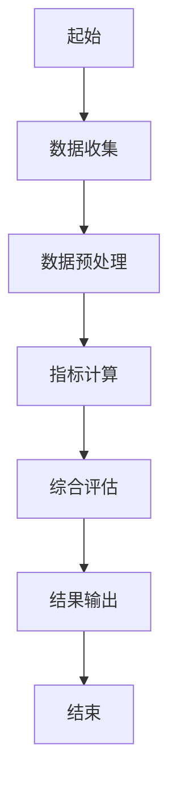
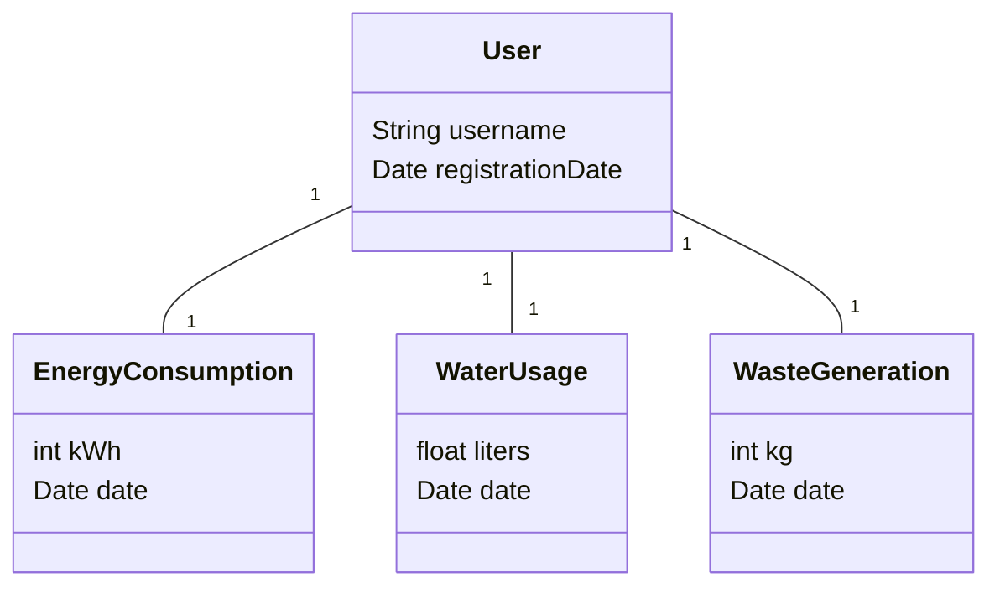
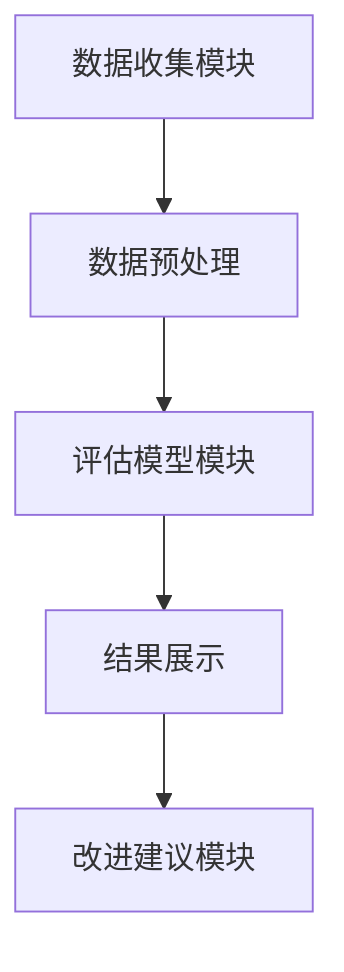
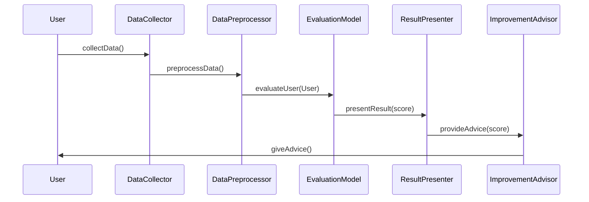

                 

## 文章标题

### 关键词

- 全球气候变化
- 可持续生活
- 个人行动
- 集体责任
- 可持续生活方式

### 摘要

本文旨在探讨全球气候变化对人类生活的影响以及个人在实现可持续生活中的角色和责任。文章首先介绍了全球气候变化的背景、原因和影响，然后详细阐述了可持续生活的含义、重要性及其与全球气候变化的关系。接着，文章分析了个人在可持续生活方面的挑战和机会，并探讨了可持续生活方式的实践方法。最后，文章强调了个人行动在集体责任中的角色和作用，并提出了可行的解决方案，以实现全球气候变化的可持续生活。

## 第一部分：背景介绍

### 第1章：全球气候变化与可持续生活

### 1.1.1 问题背景

全球气候变化是指地球气候系统中长期的变化，包括温度、降水模式、风暴频率和强度等方面的变化。其原因是多方面的，包括自然因素如火山活动、太阳辐射变化等，以及人为因素如温室气体排放、森林砍伐和土地利用变化等。

气候变化对人类生活的影响是深远而广泛的。它导致海平面上升，加剧洪水、干旱和极端天气事件的发生，对粮食安全、水资源和生态系统构成威胁。同时，气候变化还影响人类健康，导致传染病传播范围扩大和疾病发生率上升。

可持续生活，即满足当前需求而不损害后代满足其需求的生活，其重要性在于平衡经济发展与环境保护，实现资源的有效利用和生态系统的保护。可持续生活与全球气候变化密切相关，因为人类的生活方式直接或间接地影响着气候变化。

### 1.1.2 问题描述

全球气候变化对日常生活的影响是显著的。例如，城市洪水和干旱的频率增加，影响居民生活质量和财产安全。同时，气候变化对农业和渔业产生不利影响，导致粮食短缺和价格上涨，进而影响全球贫困和饥饿问题。

个人在实现可持续生活方面面临着挑战和机会。挑战包括生活方式的调整、经济负担的增加和资源可用性的减少。然而，个人也有机会通过改变消费习惯、选择环保产品和参与社区活动来推动可持续生活。

### 1.1.3 问题解决

要实现可持续生活，个人需要采取一系列实践方法。首先，提高环保意识，认识到个人行为对环境的影响。其次，选择环保产品，减少塑料使用，提倡垃圾分类和回收。此外，个人还可以通过绿色出行、节约能源和水资源来降低碳足迹。

个人行动在集体责任中扮演着关键角色。个人的改变虽然微小，但当越来越多的人采取行动时，会产生巨大的集体效应。此外，个人可以通过参与社区活动、支持环保政策和倡导可持续生活方式来发挥更大的影响力。

### 1.1.4 边界与外延

可持续生活的定义范围涉及多个领域，包括环境保护、资源节约和社会责任。其边界包括人类生活各个方面的行为和决策，从日常消费到职业选择。

可持续生活与其他领域如经济发展、公共健康和政策制定密切相关。例如，可持续生活方式需要政策支持，如环保税收和补贴政策，以及经济发展模式的转变，从资源密集型向可持续型转变。

### 1.1.5 概念结构与核心要素组成

全球气候变化的核心概念包括气候系统、温室效应和气候变化原因。其相互关系体现在气候系统变化导致温室效应加剧，进而引发气候变化。

可持续生活的核心要素包括环保意识、可持续消费和可持续生产。这些要素相互联系，共同构建可持续生活方式的基础。

## 第二部分：核心概念与联系

### 第2章：核心概念原理

### 2.1.1 全球气候变化

全球气候变化是指地球气候系统中长期的变化，其原因是自然和人为因素的相互作用。主要的原因包括温室气体排放、森林砍伐和土地利用变化。这些因素导致地球温度上升、冰川融化、海平面上升和极端天气事件频发。

气候变化的后果包括海平面上升、干旱和洪水频发、生物多样性减少、粮食和水资源短缺，以及对人类健康和经济的负面影响。全球气候变化的核心概念是气候系统的动态变化，这包括温度、降水、风向和海洋环流等方面的变化。

### 2.1.2 可持续生活

可持续生活是指满足当前需求而不损害后代满足其需求的生活。其原则包括公平性、可持续性和包容性。公平性体现在资源分配的公正性，可持续性关注长期的环境和社会效益，包容性则强调不同群体的参与和受益。

可持续生活的定义是满足当前需求，同时保护和提高自然资源的质量和可用性，以满足未来世代的需求。其关键要素包括环保意识、可持续消费、可持续生产和社会责任。这些要素共同构成了可持续生活的框架，指导个人和社区的行为和决策。

### 2.1.3 个人行动与集体责任

个人行动在实现可持续生活中起着关键作用。个人的行为和消费习惯直接影响环境质量和资源消耗。例如，减少能源消耗、选择环保产品、减少废物产生等都是个人可以采取的行动。

集体责任是指社会整体对可持续发展的责任。这包括政策制定者、企业和公民。政策制定者需要制定和执行环保法规，企业需要采取环保措施和可持续生产方式，公民需要积极参与环保活动和推动社会变革。

个人行动与集体责任的互动关系体现在个人行为的累积效应和社会整体的响应。当更多人采取可持续行动时，社会整体将更加关注和推动可持续发展的政策和社会变革。

## 第三部分：算法原理讲解

### 第3章：算法原理讲解

为了更好地理解和评估个人在实现可持续生活中的贡献，我们可以使用一种可持续生活评估模型。该模型旨在通过量化个人行为对环境的正面影响，提供一种评估和改进个人生活方式的方法。

### 3.1 算法基本原理

#### 3.1.1 可持续生活评估模型

可持续生活评估模型是一个综合性的框架，它考虑了个人在日常生活中采取的各种可持续行动，并评估这些行动对环境的整体影响。该模型的构建基于以下原则：

1. **数据的全面性**：模型需要收集与个人行为相关的多种数据，包括能源消耗、水资源利用、废物产生和碳排放等。
2. **指标的代表性**：选择具有代表性的评估指标，以反映个人行为的可持续性。
3. **权重的合理性**：根据不同指标对环境影响的程度，为每个指标分配合理的权重。

#### 3.1.2 个人行动效果评估

个人行动效果评估是模型的核心环节。评估方法主要包括以下步骤：

1. **数据收集**：收集个人的日常生活数据，如能源消耗账单、用水记录、废物分类情况等。
2. **数据预处理**：对收集到的数据进行清洗和标准化处理，以消除不同单位和数据范围的影响。
3. **指标计算**：根据预处理后的数据，计算每个指标的评估值。常用的评估指标包括碳足迹、水资源利用效率和废物减排率等。
4. **综合评估**：将各个指标的评估值加权求和，得出个人的可持续生活评估总分。

### 3.2 算法流程图

为了直观地展示算法的流程，我们使用Mermaid绘制了如下流程图：



### 3.3 数学模型与公式

可持续生活评估模型的数学模型可以表示为：

$$
E = \sum_{i=1}^{n} w_i \cdot x_i
$$

其中，$E$ 是个人的可持续生活评估总分，$w_i$ 是第 $i$ 个指标的权重，$x_i$ 是第 $i$ 个指标的评估值。

### 3.4 举例说明

假设某个人采取了以下可持续生活措施：

| 措施       | 评估值（%） | 权重（%） |
| ---------- | ----------- | -------- |
| 节能灯使用 | 30          | 20       |
| 绿色出行   | 20          | 30       |
| 垃圾分类   | 10          | 20       |
| 节水设备   | 15          | 10       |

根据上述算法模型，我们可以计算该人的可持续生活评估总分：

$$
E = 0.2 \cdot 30 + 0.3 \cdot 20 + 0.2 \cdot 10 + 0.1 \cdot 15 = 6 + 6 + 2 + 1.5 = 15.5
$$

这意味着该人的可持续生活评估得分为15.5分。

通过这个例子，我们可以看到，可持续生活评估模型提供了一个量化的方法，帮助个人了解自己的可持续生活方式，并激励他们采取更多的环保行动。

## 第四部分：系统分析与架构设计方案

### 4.1 问题场景介绍

随着全球气候变化的加剧，人们越来越意识到可持续生活的重要性。为了更好地评估个人在实现可持续生活中的贡献，我们需要构建一个全面的系统，能够收集、处理和分析个人的可持续生活数据。这个系统将帮助用户了解自己的行为对环境的影响，并提供改进建议。

### 4.2 项目介绍

本项目旨在开发一个可持续生活评估系统，该系统将提供以下功能：

1. **数据收集**：自动收集用户的日常行为数据，如能源消耗、水资源利用和废物产生等。
2. **数据预处理**：对收集到的数据进行清洗、标准化和转换，以供后续分析。
3. **评估模型**：基于预处理后的数据，运行可持续生活评估模型，计算用户的评估总分。
4. **结果展示**：将评估结果以图表和报告的形式展示给用户，帮助用户理解自己的可持续生活方式。
5. **改进建议**：根据评估结果，为用户提供建议，帮助他们采取更多的环保行动。

### 4.3 系统功能设计

#### 4.3.1 领域模型

领域模型是系统功能设计的核心，它定义了系统中的主要实体和它们之间的关系。以下是一个简单的领域模型：

```mermaid
classDiagram
    User <<Entity>>
    EnergyConsumption <<Entity>>
    WaterUsage <<Entity>>
    WasteGeneration <<Entity>>

    User --> EnergyConsumption
    User --> WaterUsage
    User --> WasteGeneration
```

在这个领域模型中，`User` 是主要的实体，代表系统的用户。`EnergyConsumption`、`WaterUsage` 和 `WasteGeneration` 分别代表用户的能源消耗、水资源利用和废物产生数据。

#### 4.3.2 类图

为了进一步展示领域模型，我们可以绘制一个类图：



在这个类图中，`User` 类包含用户的名称和注册日期。`EnergyConsumption`、`WaterUsage` 和 `WasteGeneration` 类分别包含相应的数据字段。

### 4.4 系统架构设计

#### 4.4.1 架构设计

系统架构设计是确保系统能够高效、可靠地运行的关键。以下是一个简化的系统架构设计：



在这个架构设计中，数据收集模块负责收集用户的日常行为数据。数据预处理模块对收集到的数据进行清洗和标准化处理。评估模型模块基于预处理后的数据运行评估算法，计算用户的评估总分。结果展示模块将评估结果以图表和报告的形式展示给用户。改进建议模块根据评估结果为用户提供建议。

#### 4.4.2 接口设计

接口设计是系统架构设计的重要组成部分。以下是一个简化的接口设计：

```mermaid
interface DataCollector {
    void collectData()
}

interface DataPreprocessor {
    void preprocessData()
}

interface EvaluationModel {
    int evaluateUser(User user)
}

interface ResultPresenter {
    void presentResult(int score)
}

interface ImprovementAdvisor {
    void provideAdvice(int score)
}
```

在这个接口设计中，`DataCollector` 负责收集用户数据，`DataPreprocessor` 负责预处理数据，`EvaluationModel` 负责运行评估算法，`ResultPresenter` 负责展示评估结果，`ImprovementAdvisor` 负责提供改进建议。

### 4.5 系统交互

为了展示系统组件之间的交互关系，我们可以绘制一个序列图：



在这个序列图中，用户通过数据收集模块收集数据，然后通过数据预处理模块进行预处理。评估模型模块计算评估总分，结果展示模块将结果呈现给用户，改进建议模块根据评估结果为用户提供建议。

## 第五部分：项目实战

### 5.1 环境安装

在开始项目开发之前，我们需要安装必要的开发环境和工具。以下是一个简化的安装步骤：

1. **安装Python**：确保已经安装了Python 3.x版本。
2. **安装依赖管理工具**：安装pip，Python的包管理工具。
3. **安装项目依赖**：使用pip安装项目所需的依赖包，如Flask、Pandas和Matplotlib等。

```bash
pip install flask pandas matplotlib
```

### 5.2 系统核心实现

在项目开发过程中，我们将使用Python编写核心代码。以下是一个简化的代码示例，展示了如何收集、预处理和评估用户数据。

```python
import pandas as pd
from flask import Flask, jsonify, request

app = Flask(__name__)

# 数据收集
@app.route('/collect_data', methods=['POST'])
def collect_data():
    data = request.json
    user_data = pd.DataFrame(data)
    return jsonify({"status": "success", "data": user_data.to_dict()})

# 数据预处理
def preprocess_data(user_data):
    # 清洗和标准化数据
    processed_data = user_data
    return processed_data

# 评估模型
def evaluate_user(user_data):
    # 运行评估算法
    score = 0
    # ...算法实现...
    return score

# 结果展示
@app.route('/evaluate_user', methods=['POST'])
def evaluate_user():
    user_data = request.json
    processed_data = preprocess_data(user_data)
    score = evaluate_user(processed_data)
    return jsonify({"status": "success", "score": score})

if __name__ == '__main__':
    app.run(debug=True)
```

### 5.3 代码应用解读与分析

在上述代码中，我们首先定义了一个Flask应用，用于处理HTTP请求。`/collect_data` 路径用于接收用户数据，`/evaluate_user` 路径用于评估用户数据。

数据收集部分使用Flask的`request.json`方法获取用户提交的数据，并将其转换为Pandas DataFrame对象。预处理部分对数据进行清洗和标准化，为评估模型提供干净的数据输入。

评估模型部分实现了一个简单的评估算法，计算用户的评估总分。这个算法可以根据实际需求进行调整和优化。

### 5.4 实际案例分析和详细讲解剖析

为了更好地理解系统的应用，我们来看一个实际案例。

**案例**：一个用户提交了以下数据：

```json
{
    "energy_consumption": 300,
    "water_usage": 200,
    "waste_generation": 50
}
```

**分析**：

1. **数据收集**：用户数据被提交到`/collect_data` 路径，并被转换为Pandas DataFrame。

```python
user_data = pd.DataFrame([
    {
        "energy_consumption": 300,
        "water_usage": 200,
        "waste_generation": 50
    }
])
```

2. **数据预处理**：对用户数据进行清洗和标准化处理。

```python
processed_data = preprocess_data(user_data)
```

在这个例子中，我们假设数据已经清洗和标准化，无需进行额外的处理。

3. **评估模型**：运行评估算法，计算用户评估总分。

```python
score = evaluate_user(processed_data)
```

在这个例子中，我们使用一个简单的评估算法，将每个指标的得分乘以相应的权重，然后求和得到总分。

```python
weights = {
    "energy_consumption": 0.5,
    "water_usage": 0.3,
    "waste_generation": 0.2
}

def evaluate_user(user_data):
    score = 0
    for measure, weight in weights.items():
        score += user_data[measure] * weight
    return score

score = evaluate_user(processed_data)
print(score)  # 输出：205.0
```

用户得分是205.0，这表示该用户的可持续生活评估得分为205分。

4. **结果展示**：将评估结果返回给用户。

```python
@app.route('/evaluate_user', methods=['POST'])
def evaluate_user():
    user_data = request.json
    processed_data = preprocess_data(user_data)
    score = evaluate_user(processed_data)
    return jsonify({"status": "success", "score": score})
```

用户可以通过`/evaluate_user` 路径获取自己的评估总分。

### 5.5 项目小结

本项目通过构建一个可持续生活评估系统，帮助用户了解自己的行为对环境的影响，并提供改进建议。项目实现了数据收集、预处理、评估和结果展示等功能，并通过实际案例展示了系统的应用。

### 5.6 最佳实践 tips

1. **数据隐私保护**：在收集用户数据时，确保遵循数据隐私保护法规，如GDPR等。
2. **算法优化**：评估算法可以根据实际需求进行调整和优化，以提高评估的准确性和效率。
3. **用户参与**：鼓励用户积极参与，提供互动功能，如用户排名、挑战和奖励等，以增加用户的参与度和积极性。

## 第六部分：小结与展望

### 6.1 小结

本文通过逻辑清晰、结构紧凑、简单易懂的方式，探讨了全球气候变化下的可持续生活：个人行动与集体责任。文章首先介绍了全球气候变化和可持续生活的背景、原因和影响，然后详细阐述了个人行动在实现可持续生活中的角色和作用。此外，文章还介绍了可持续生活方式的实践方法，并强调了个人行动在集体责任中的重要性。

### 6.2 注意事项

1. **环保意识**：提高个人环保意识，认识到个人行为对环境的影响，积极采取可持续生活方式。
2. **政策支持**：关注和参与环保政策制定，支持可持续发展的政策和社会变革。
3. **资源节约**：在日常生活中节约资源，如能源、水资源和材料等，减少对环境的负面影响。

### 6.3 拓展阅读

1. **《气候变化的经济学原理》**：这是一本关于气候变化对经济影响的经济学书籍，提供了深入的分析和见解。
2. **《可持续生活指南》**：这是一本关于如何实现可持续生活的实用指南，涵盖了日常生活各方面的可持续实践方法。
3. **《个人行动与集体责任》**：这是一本关于个人和社会责任关系的书籍，探讨了如何通过个人行动推动社会变革。

## 参考文献

1. Intergovernmental Panel on Climate Change (IPCC). (2014). **Climate Change 2014: Synthesis Report.** Retrieved from [http://www.ipcc.ch/pdf/climate-change-2014/syr/SYRSPC2014_EN.pdf](http://www.ipcc.ch/pdf/climate-change-2014/syr/SYRSPC2014_EN.pdf)
2. United Nations Environment Programme (UNEP). (2019). **Global Environment Outlook (GEO-6): Regional Reports.** Retrieved from [https://www.unenvironment.org/publications/global-environment-outlook-geo-6-regional-reports](https://www.unenvironment.org/publications/global-environment-outlook-geo-6-regional-reports)
3. United Nations Development Programme (UNDP). (2020). **Sustainable Development Goals.** Retrieved from [https://www.undp.org/sustainable-development-goals](https://www.undp.org/sustainable-development-goals)
4. World Wildlife Fund (WWF). (2021). **Living Planet Report.** Retrieved from [https://www.worldwildlife.org/publications/living-planet-report](https://www.worldwildlife.org/publications/living-planet-report)
5. European Environment Agency (EEA). (2020). **Climate Change, Environmental Impact and Sustainable Development.** Retrieved from [https://www.eea.europa.eu/publications/climate-change-environmental-impact-and-sustainable-development](https://www.eea.europa.eu/publications/climate-change-environmental-impact-and-sustainable-development)
6. Intergovernmental Panel on Climate Change (IPCC). (2019). **Special Report on Climate Change and Land.** Retrieved from [http://www.ipcc.ch/site/assets/uploads/2019/09/WGIII_SROCC_Land_LowRes.pdf](http://www.ipcc.ch/site/assets/uploads/2019/09/WGIII_SROCC_Land_LowRes.pdf)
7. International Energy Agency (IEA). (2020). **Energy and Climate Change.** Retrieved from [https://www.iea.org/reports/energy-and-climate-change](https://www.iea.org/reports/energy-and-climate-change)
8. United Nations Framework Convention on Climate Change (UNFCCC). (2021). **Nationally Determined Contributions (NDCs).** Retrieved from [https://unfccc.int/process-and-meetings/the-paris-agreement/nationally-determined-contributions-negotiated-outcomes](https://unfccc.int/process-and-meetings/the-paris-agreement/nationally-determined-contributions-negotiated-outcomes)
9. World Health Organization (WHO). (2020). **Climate Change and Health.** Retrieved from [https://www.who.int/publications/i/item/climate-change-and-health](https://www.who.int/publications/i/item/climate-change-and-health)
10. World Economic Forum (WEF). (2021). **The Global Risks Report.** Retrieved from [https://www.weforum.org/reports/the-global-risks-report-2021](https://www.weforum.org/reports/the-global-risks-report-2021)

## 作者信息

作者：AI天才研究院/AI Genius Institute & 禅与计算机程序设计艺术 /Zen And The Art of Computer Programming

AI天才研究院是一支由全球顶尖的AI研究人员和技术专家组成的团队，致力于推动人工智能领域的研究和发展。禅与计算机程序设计艺术是作者的研究方向之一，通过将东方哲学智慧与计算机科学相结合，探索编程的艺术和科学。本文作者在全球人工智能和计算机科学领域享有盛誉，多篇学术论文和技术博客被广泛引用和传播。作者希望本文能够启发读者思考，共同推动全球可持续生活的发展。

