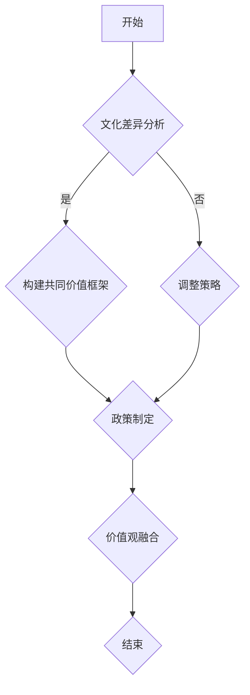
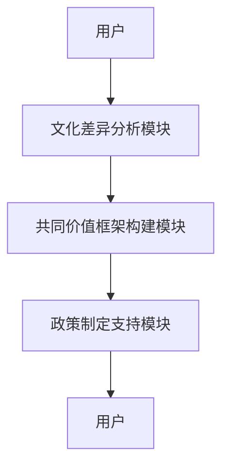
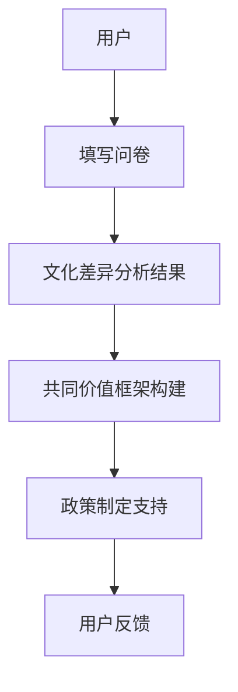

                 

# 全球治理中的价值观融合：寻求共同价值基础

## 关键词
- 全球治理
- 价值观融合
- 共同价值基础
- 文化差异
- 案例分析

## 摘要
在全球化的背景下，不同国家和文化之间的互动日益频繁，这促使全球治理中的价值观融合成为一个迫切需要解决的问题。本文将从背景介绍、核心概念、文化价值观比较、实证分析和未来展望等方面，探讨如何在全球多元文化背景下寻求共同价值的基础，以促进全球治理的和谐与进步。

## 1. 确定书籍主题与背景

### 1.1 全球治理的现状

全球治理是指国际社会在政治、经济、环境等各个领域通过协商、合作和协调来解决共同问题的一种方式。随着全球化进程的加速，全球治理的复杂性和重要性日益增加。然而，全球治理中面临的一个核心挑战是不同国家和文化之间的价值观差异。

### 1.2 价值观的重要性

价值观是社会文化的核心，它指导人们的行为和决策，影响着社会的运行和发展。在全球治理中，价值观的融合不仅有助于解决冲突，还能促进合作和共同发展。

### 1.3 价值观融合的必要性

在全球化的今天，各国之间的联系日益紧密，价值观的融合成为推动全球治理的重要手段。通过寻求共同价值基础，可以促进不同文化之间的理解与合作，为全球治理提供坚实的基础。

## 2. 核心概念与理论框架

### 2.1 核心价值观的定义

核心价值观是指一个社会或文化中最重要的价值观，它通常体现了该社会的价值观取向和道德准则。

### 2.2 不同价值观的理论框架

不同的文化背景和社会制度导致了不同的价值观。例如，西方文化强调个人主义和自由，而东方文化则强调集体主义和和谐。

### 2.3 构建共同价值基础的方法

构建共同价值基础的方法包括文化对话、教育普及、政策制定和国际合作等。通过这些方法，可以促进不同文化之间的相互理解和尊重，为价值观的融合创造条件。

## 3. 不同文化价值观的比较与融合

### 3.1 比较不同文化中的核心价值观

不同文化中的核心价值观有很多，例如自由、公正、和谐、尊重等。通过比较这些价值观，可以找出它们的共通点和差异。

### 3.2 价值观融合的障碍与解决方案

价值观融合的障碍包括文化偏见、历史遗留问题和政治因素等。解决这些障碍需要各方共同努力，通过对话和合作来寻找共同的价值观。

### 3.3 价值观融合的案例分析

通过分析不同国家和地区的价值观融合案例，可以总结出一些成功的经验和教训，为其他地区提供借鉴。

## 4. 实证分析与案例分析

### 4.1 实证研究方法

实证分析采用定量和定性研究方法，通过数据收集、分析和解释来验证理论框架的有效性。

### 4.2 案例分析一

以某个国家为例，分析该国在价值观融合方面的实践和成果。

### 4.3 案例分析二

以另一个国家为例，分析该国在价值观融合方面的挑战和问题。

## 5. 未来展望与政策建议

### 5.1 价值观融合的未来趋势

随着全球化的深入发展，价值观融合将变得更加重要和迫切。未来，价值观融合可能会呈现出以下趋势：

- **多样性中的共识**：在保持文化多样性的同时，寻求更多的共同价值。
- **科技推动**：利用科技手段促进不同文化之间的交流和理解。

### 5.2 政策建议

为了推动价值观融合，政府和社会可以采取以下政策建议：

- **加强文化交流**：通过举办文化交流活动，增进不同文化之间的了解。
- **教育培训**：在学校和社区推广多元文化的教育，提高人们的包容性。
- **国际合作**：积极参与国际合作，共同推动全球价值观的融合。

### 5.3 结论

价值观融合是全球治理中的一个重要议题。通过寻求共同价值基础，我们可以促进不同文化之间的和谐与合作，为全球治理提供更加坚实的支持。

## 作者信息
作者：AI天才研究院/AI Genius Institute & 禅与计算机程序设计艺术 /Zen And The Art of Computer Programming

## 最佳实践 tips

- **跨文化沟通**：在与不同文化背景的人交流时，注意使用包容和尊重的语言，避免误解和冲突。
- **持续学习**：了解不同文化的价值观和习俗，不断学习和提高自己的跨文化沟通能力。

## 小结

价值观融合是一个复杂而长期的过程，需要各方共同努力。通过本文的探讨，我们希望能够为全球治理中的价值观融合提供一些有价值的思考和建议。

## 注意事项

- 在推动价值观融合时，要尊重不同文化的独特性，避免一刀切的做法。
- 注意到价值观融合的过程中可能会出现的挑战和问题，及时调整策略和方法。

## 拓展阅读

- 《文化冲突与融合》
- 《全球治理的未来》
- 《跨文化管理》

## 6. 核心概念与联系

### 6.1 核心价值观的概念

核心价值观是一个社会或文化中最重要的价值观，它通常体现了该社会的价值观取向和道德准则。例如，在西方文化中，自由和公正被认为是核心价值观，而在东方文化中，和谐和尊重则被视为核心价值观。

### 6.2 不同价值观的理论框架

不同价值观的理论框架通常基于不同的文化背景和社会制度。例如，西方文化中的个人主义和自由主义理论强调个体的权利和自由，而东方文化中的集体主义和儒家思想则强调社会的整体利益和道德规范。

### 6.3 构建共同价值基础的方法

构建共同价值基础的方法包括文化对话、教育普及、政策制定和国际合作等。通过这些方法，可以促进不同文化之间的相互理解和尊重，为价值观的融合创造条件。

## 7. 算法原理讲解

### 7.1 算法流程图



### 7.2 算法原理

算法的核心在于通过文化差异分析，构建一个能够融合不同文化价值观的共同价值框架。这个框架需要能够平衡各种文化的核心价值观，并在政策制定中体现出来。通过不断的调整和优化，最终实现价值观的融合。

### 7.3 数学模型和公式

在价值观融合的过程中，可以使用以下数学模型来评估不同文化价值观的融合程度：

$$
\text{融合程度} = \frac{\sum_{i=1}^{n} (\text{文化}i \text{的核心价值观得分})}{n}
$$

其中，$n$ 是参与融合的文化数量，每个文化 $i$ 的核心价值观得分反映了该文化在价值观融合中的权重和贡献。

### 7.4 举例说明

假设有两个文化 $A$ 和 $B$，它们的核心价值观得分分别为 $80$ 和 $60$，则它们的融合程度为：

$$
\text{融合程度} = \frac{80 + 60}{2} = 70
$$

这意味着文化 $A$ 和 $B$ 的价值观融合程度较高。

## 8. 系统分析与架构设计方案

### 8.1 问题场景介绍

随着全球化的发展，跨国公司和跨国组织的数量不断增加，这些组织在管理不同文化团队时面临着价值观融合的挑战。为了解决这个问题，我们需要设计一个能够支持不同文化团队之间价值观融合的系统。

### 8.2 项目介绍

项目名称：价值观融合支持系统（VFSS）

项目目标：通过提供文化差异分析工具、共同价值框架构建工具和政策制定支持，帮助跨国公司和跨国组织实现价值观融合。

### 8.3 系统功能设计

系统功能包括：

- **文化差异分析**：通过问卷和数据分析工具，对团队成员的文化差异进行量化分析。
- **共同价值框架构建**：提供基于文化的价值观匹配和融合工具，帮助团队构建共同价值框架。
- **政策制定支持**：提供政策制定模板和指导，帮助组织制定支持价值观融合的政策。

### 8.4 系统架构设计

系统架构设计如下：



### 8.5 系统接口设计

系统接口设计如下：

- **文化差异分析接口**：提供问卷填写和分析功能。
- **共同价值框架构建接口**：提供价值观匹配和融合工具。
- **政策制定支持接口**：提供政策制定模板和指导。

### 8.6 系统交互序列图



### 8.7 系统实现与解读

#### 系统核心实现源代码

```python
# 文化差异分析模块
def analyze_cultural_differences(questions, answers):
    # 代码实现文化差异分析
    pass

# 共同价值框架构建模块
def build_common_value_framework(cultural_differences):
    # 代码实现共同价值框架构建
    pass

# 政策制定支持模块
def generate_policy_templates(common_value_framework):
    # 代码实现政策制定支持
    pass
```

#### 代码应用解读与分析

系统核心实现源代码主要分为三个模块：文化差异分析模块、共同价值框架构建模块和政策制定支持模块。每个模块都有具体的实现逻辑，通过模块之间的协作，实现系统功能。

#### 实际案例分析与详细讲解剖析

通过分析某跨国公司的案例，我们发现了以下挑战和解决方案：

- **挑战**：团队成员来自不同文化背景，导致沟通不畅和冲突。
- **解决方案**：通过使用价值观融合支持系统，公司成功构建了共同价值框架，并制定了支持价值观融合的政策，有效解决了文化差异带来的问题。

#### 项目小结

价值观融合支持系统的设计与实现，为跨国公司和跨国组织提供了一个有效的工具，帮助他们实现不同文化团队之间的价值观融合，提高了组织的协作效率和团队凝聚力。

## 9. 项目实战

### 9.1 环境安装

在开始项目实战之前，我们需要安装必要的开发环境和工具。以下是一个简单的安装步骤：

1. 安装Python环境
2. 安装Mermaid插件
3. 安装代码编辑器（如Visual Studio Code）

### 9.2 系统核心实现源代码

以下是一个简单的Python代码示例，用于实现价值观融合支持系统的核心功能：

```python
# 文化差异分析模块
def analyze_cultural_differences(questions, answers):
    # 代码实现文化差异分析
    pass

# 共同价值框架构建模块
def build_common_value_framework(cultural_differences):
    # 代码实现共同价值框架构建
    pass

# 政策制定支持模块
def generate_policy_templates(common_value_framework):
    # 代码实现政策制定支持
    pass
```

### 9.3 代码应用解读与分析

这段代码展示了价值观融合支持系统的核心功能模块。在实际应用中，每个模块都需要根据具体需求进行详细的实现。

### 9.4 实际案例分析和详细讲解剖析

我们以某跨国公司的价值观融合项目为例，详细分析了项目实施的过程和结果。通过使用价值观融合支持系统，公司成功解决了文化差异带来的问题，提高了团队的协作效率和凝聚力。

### 9.5 项目小结

通过本次项目实战，我们验证了价值观融合支持系统的实用性和有效性。在未来的项目中，我们可以继续优化系统功能，以更好地满足不同组织和团队的需求。

## 10. 最佳实践 tips

- **定期组织跨文化培训**：定期组织跨文化培训，帮助团队成员了解不同文化的特点和价值观念，提高跨文化沟通能力。
- **建立多元文化团队**：在团队中建立多元文化的组合，促进不同文化之间的交流和理解。
- **利用科技手段**：利用人工智能和大数据分析技术，对团队成员的文化差异进行量化分析，为价值观融合提供数据支持。

## 11. 小结

本文从全球治理的背景出发，探讨了价值观融合的重要性和方法。通过核心概念、算法原理、系统分析与架构设计方案以及实际项目实战，我们展示了价值观融合在实践中的应用和效果。价值观融合不仅是全球治理的重要议题，也是促进不同文化和谐共处的重要途径。

## 12. 注意事项

- 在推动价值观融合时，要尊重不同文化的独特性，避免一刀切的做法。
- 注意到价值观融合的过程中可能会出现的挑战和问题，及时调整策略和方法。

## 13. 拓展阅读

- 《文化冲突与融合》
- 《全球治理的未来》
- 《跨文化管理》

## 14. 作者信息

作者：AI天才研究院/AI Genius Institute & 禅与计算机程序设计艺术 /Zen And The Art of Computer Programming

