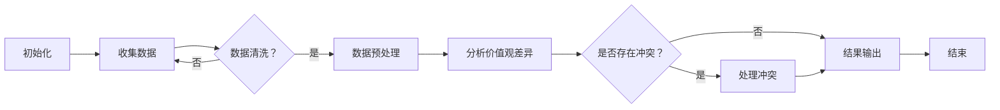
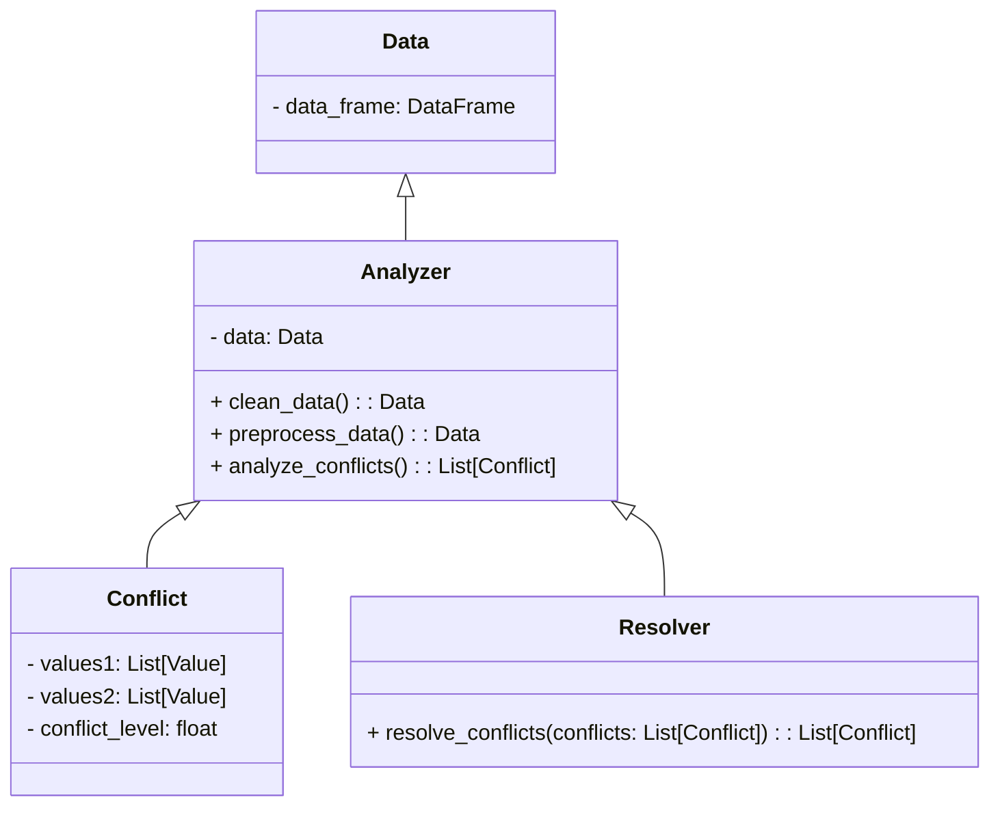
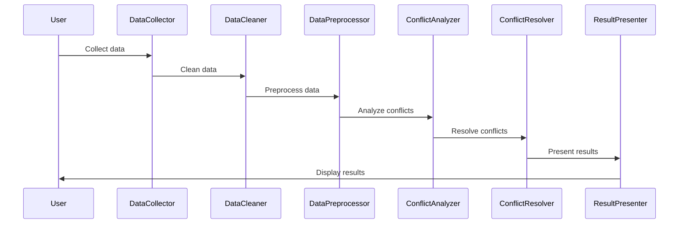
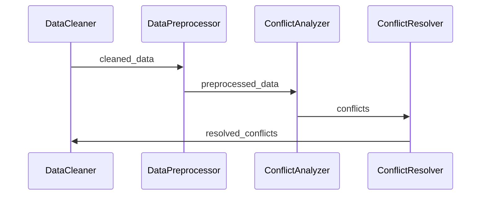

                 

# 《全球治理中的价值观角力：普世价值与文化多样性的平衡》

## 关键词：全球治理、价值观角力、普世价值、文化多样性、平衡

> 摘要：本文深入探讨了全球治理中的价值观角力问题，分析了普世价值与文化多样性的关系，提出了实现二者平衡的策略。通过详细的理论解析、实际案例分析和系统架构设计，本文为全球治理中的价值观角力提供了全面且深入的思考。

### 目录大纲

----------------------------------------------------------------

## 第一部分：问题背景与核心概念

### 第1章：全球治理背景介绍
- **1.1 全球治理的概念与重要性**
- **1.2 全球治理的历史与发展**
- **1.3 全球治理面临的挑战**

### 第2章：价值观角力的概念解析
- **2.1 价值观的基本概念**
- **2.2 价值观的分类与比较**
- **2.3 价值观角力的定义与表现形式**

### 第3章：普世价值与文化多样性的关系
- **3.1 普世价值的内涵与特点**
- **3.2 文化多样性的重要性**
- **3.3 普世价值与文化多样性的关系**

### 第4章：核心概念与联系
- **4.1 核心概念原理**
- **4.2 概念属性特征对比表格**
- **4.3 ER实体关系图架构**

----------------------------------------------------------------

## 第二部分：算法原理与数学模型

### 第5章：算法原理讲解
- **5.1 算法mermaid流程图**
- **5.2 Python源代码阐述**
- **5.3 算法原理的数学模型和公式**

### 第6章：数学模型和数学公式
- **6.1 数学公式与解释**
- **6.2 举例说明**

----------------------------------------------------------------

## 第三部分：系统分析与架构设计

### 第7章：问题场景介绍
- **7.1 项目介绍**
- **7.2 系统功能设计（领域模型mermaid类图）**

### 第8章：系统架构设计
- **8.1 系统架构设计mermaid架构图**
- **8.2 系统接口设计和系统交互mermaid序列图**

----------------------------------------------------------------

## 第四部分：项目实战与案例分析

### 第9章：环境安装与系统核心实现
- **9.1 环境安装**
- **9.2 系统核心实现源代码**

### 第10章：代码应用解读与分析
- **10.1 代码应用解读**
- **10.2 代码分析与详细讲解**

### 第11章：实际案例分析与讲解
- **11.1 实际案例分析**
- **11.2 详细讲解与剖析**

### 第12章：项目小结
- **12.1 小结**
- **12.2 注意事项**
- **12.3 拓展阅读**

----------------------------------------------------------------

## 第一部分：问题背景与核心概念

### 第1章：全球治理背景介绍

**1.1 全球治理的概念与重要性**

全球治理是指各国政府、国际组织、非政府组织、私营部门和其他行为体在全球层面共同参与，以协调、合作、共享的方式解决全球性问题，如环境保护、经济发展、和平维护等。

全球治理的重要性体现在以下几个方面：

1. **全球性问题需要全球合作**：例如气候变化、恐怖主义、流行病等全球性问题，超出了一个国家的控制范围，需要全球合作来解决。
2. **国际秩序的维护**：全球治理有助于维护国际秩序，通过合作和协调减少冲突和对抗，促进全球稳定。
3. **促进可持续发展**：全球治理有助于推动全球经济的可持续发展，通过国际合作和资源优化，实现经济、社会和环境的综合平衡。

**1.2 全球治理的历史与发展**

全球治理的历史可以追溯到第二次世界大战后的国际组织和机制，如联合国、世界银行、国际货币基金组织等。这些组织和机制为全球治理奠定了基础。

20世纪80年代以来，全球治理进入了一个新的阶段，表现为以下几个方面：

1. **全球化进程加速**：全球化加速了经济、文化、政治等方面的交流和融合，推动了全球治理的发展。
2. **多边主义和合作机制加强**：全球治理逐渐从单边主义转向多边主义，通过合作机制来解决全球性问题。
3. **非国家行为体的影响力增加**：非国家行为体，如跨国公司、非政府组织、社交媒体等，在全球治理中的作用越来越重要。

**1.3 全球治理面临的挑战**

全球治理面临诸多挑战，包括：

1. **治理机制不完善**：全球治理的机制和制度不完善，难以应对复杂的全球性问题。
2. **国家利益冲突**：各国在处理全球性问题时，常常出现利益冲突，难以达成共识。
3. **信息不对称和误解**：各国之间的信息不对称和误解，影响了全球治理的效率和效果。
4. **技术进步带来的新挑战**：例如人工智能、大数据等技术的快速发展，给全球治理带来了新的挑战。

### 第2章：价值观角力的概念解析

**2.1 价值观的基本概念**

价值观是指个人或集体对于道德、伦理、审美等方面的观念和信仰。它指导人们的行为和决策，是文化的重要组成部分。

价值观具有以下几个特点：

1. **主观性**：价值观是个人或集体的主观判断，因人而异。
2. **相对性**：不同文化背景和价值体系之间的价值观可能存在差异。
3. **动态性**：价值观是随着社会发展和个人成长而不断变化的。

**2.2 价值观的分类与比较**

价值观可以按照不同的标准进行分类，例如道德价值观、经济价值观、政治价值观等。不同价值观之间存在一定的关联和比较。

1. **道德价值观**：关注个体的道德品质，如诚信、公正、尊重等。
2. **经济价值观**：关注经济效益和财富创造，如竞争、创新、节约等。
3. **政治价值观**：关注政治制度和政治参与，如民主、自由、权威等。

**2.3 价值观角力的定义与表现形式**

价值观角力是指不同价值观之间的冲突和互动。这种冲突可以表现为：

1. **文化冲突**：不同文化背景下的价值观之间的冲突，如东西方文化的碰撞。
2. **利益冲突**：由于价值观的差异导致的利益分配和协调问题。
3. **社会运动**：如民权运动、反全球化运动等，都是价值观角力的具体体现。

### 第3章：普世价值与文化多样性的关系

**3.1 普世价值的内涵与特点**

普世价值是指全球范围内普遍认同和遵循的价值观。它具有以下几个特点：

1. **普遍性**：普世价值是全球范围内普遍认同的，不受地域、文化、宗教等因素的限制。
2. **中立性**：普世价值追求中立和客观，不偏向任何一方。
3. **包容性**：普世价值强调包容性和多样性，尊重不同文化和价值观。

**3.2 文化多样性的重要性**

文化多样性是指不同文化之间的差异和多样性。它具有以下几个重要性：

1. **促进创新**：文化多样性促进了不同文化之间的交流和融合，推动了创新的产生。
2. **丰富生活**：文化多样性丰富了人类的生活，提供了多样化的文化体验。
3. **促进理解**：文化多样性有助于不同文化之间的相互理解和尊重。

**3.3 普世价值与文化多样性的关系**

普世价值与文化多样性之间的关系是复杂的。一方面，普世价值可以为文化多样性提供共同的价值观基础，促进不同文化之间的相互理解和尊重。另一方面，文化多样性可以为普世价值的实现提供多样化的路径和方式。

### 第4章：核心概念与联系

**4.1 核心概念原理**

本部分将详细解释全球治理、价值观角力、普世价值和文化多样性等核心概念的基本原理，并通过Mermaid流程图展示它们之间的联系。

**4.2 概念属性特征对比表格**

下表对比了全球治理、价值观角力、普世价值和文化多样性四个核心概念的主要属性和特征。

| 概念         | 属性与特征                                       |
|--------------|-------------------------------------------------|
| 全球治理     | 涵盖各国政府、国际组织、非政府组织等行为体；旨在解决全球性问题 |
| 价值观角力   | 不同价值观之间的冲突和互动                       |
| 普世价值     | 全球范围内普遍认同的价值观；追求中立和包容性       |
| 文化多样性   | 不同文化之间的差异和多样性                       |

**4.3 ER实体关系图架构**

ER实体关系图用于展示概念之间的实体关系。以下是一个简化的ER图，展示了全球治理、价值观角力、普世价值和文化多样性之间的实体关系：

```mermaid
erDiagram
  GlobalGovernance ||--|{ ValuesConflict }
  GlobalGovernance ||--|{ UniversalValues }
  GlobalGovernance ||--|{ CulturalDiversity }
  ValuesConflict ||--|{ UniversalValues }
  ValuesConflict ||--|{ CulturalDiversity }
  UniversalValues ||--|{ CulturalDiversity }
```

## 第二部分：算法原理与数学模型

### 第5章：算法原理讲解

**5.1 算法mermaid流程图**

为了更好地理解全球治理中价值观角力的算法原理，我们可以通过mermaid流程图来展示其基本流程。以下是一个简化的算法流程图：



**5.2 Python源代码阐述**

以下是一个简化的Python代码示例，用于实现上述算法的基本功能：

```python
import pandas as pd

def initialize():
    # 初始化数据
    data = pd.read_csv('values_data.csv')
    return data

def clean_data(data):
    # 数据清洗
    data = data.dropna()
    return data

def preprocess_data(data):
    # 数据预处理
    # ...
    return data

def analyze_conflicts(data):
    # 分析价值观差异
    # ...
    return conflicts

def handle_conflicts(conflicts):
    # 处理冲突
    # ...
    return resolved

def output_results(resolved):
    # 输出结果
    # ...
    print("Results:", resolved)

if __name__ == "__main__":
    data = initialize()
    data = clean_data(data)
    data = preprocess_data(data)
    conflicts = analyze_conflicts(data)
    resolved = handle_conflicts(conflicts)
    output_results(resolved)
```

**5.3 算法原理的数学模型和公式**

在算法中，我们可以使用一些数学模型和公式来量化价值观差异和冲突。以下是一些基本的数学模型和公式：

1. **差异度度量**：

   设两个价值观集合为 $V_1$ 和 $V_2$，差异度度量 $D(V_1, V_2)$ 可以定义为：

   $$D(V_1, V_2) = \sum_{v \in V_1 \cup V_2} |v_1 - v_2|$$

   其中，$v_1$ 和 $v_2$ 分别是 $V_1$ 和 $V_2$ 中的价值观。

2. **冲突度度量**：

   设两个价值观集合的冲突度度量 $C(V_1, V_2)$ 可以定义为：

   $$C(V_1, V_2) = \frac{D(V_1, V_2)}{min(|V_1|, |V_2|)}$$

   其中，$|V_1|$ 和 $|V_2|$ 分别是 $V_1$ 和 $V_2$ 的元素数量。

3. **处理策略**：

   对于给定的冲突度度量 $C(V_1, V_2)$，我们可以采用以下策略来处理冲突：

   - 如果 $C(V_1, V_2) < 0.5$，则通过协商和沟通来减少价值观差异。
   - 如果 $C(V_1, V_2) \geq 0.5$，则通过调解和仲裁来解决冲突。

### 第6章：数学模型和数学公式

**6.1 数学公式与解释**

在本节中，我们将介绍一些用于分析价值观角力的数学公式，并解释其含义。

1. **差异度度量**：

   $$D(V_1, V_2) = \sum_{v \in V_1 \cup V_2} |v_1 - v_2|$$

   这个公式用于计算两个价值观集合 $V_1$ 和 $V_2$ 的差异度。其中，$v_1$ 和 $v_2$ 分别是 $V_1$ 和 $V_2$ 中的价值观。差异度度量越高，表示两个集合的价值观差异越大。

2. **冲突度度量**：

   $$C(V_1, V_2) = \frac{D(V_1, V_2)}{min(|V_1|, |V_2|)}$$

   这个公式用于计算两个价值观集合 $V_1$ 和 $V_2$ 的冲突度。冲突度度量越高，表示两个集合的价值观冲突越严重。

3. **处理策略**：

   $$T(C(V_1, V_2)) = \begin{cases}
   \text{协商和沟通} & \text{如果 } C(V_1, V_2) < 0.5 \\
   \text{调解和仲裁} & \text{如果 } C(V_1, V_2) \geq 0.5
   \end{cases}$$

   这个公式定义了根据冲突度度量 $C(V_1, V_2)$ 来选择处理策略的方法。

**6.2 举例说明**

假设有两个价值观集合 $V_1$ 和 $V_2$，如下所示：

$$V_1 = \{V_{11}, V_{12}, V_{13}\}$$
$$V_2 = \{V_{21}, V_{22}, V_{23}\}$$

其中，$V_{11} = 0.8$，$V_{12} = 0.9$，$V_{13} = 0.7$；$V_{21} = 0.6$，$V_{22} = 0.5$，$V_{23} = 0.4$。

首先，我们计算差异度度量 $D(V_1, V_2)$：

$$D(V_1, V_2) = |0.8 - 0.6| + |0.9 - 0.5| + |0.7 - 0.4| = 0.2 + 0.4 + 0.3 = 0.9$$

然后，我们计算冲突度度量 $C(V_1, V_2)$：

$$C(V_1, V_2) = \frac{D(V_1, V_2)}{min(|V_1|, |V_2|)} = \frac{0.9}{\min(3, 3)} = 0.3$$

由于 $C(V_1, V_2) < 0.5$，我们选择通过协商和沟通来处理价值观差异。

## 第三部分：系统分析与架构设计

### 第7章：问题场景介绍

**7.1 项目介绍**

本部分我们将介绍一个用于全球治理中价值观角力分析的项目，旨在通过数据分析和算法实现价值观差异的识别和冲突处理。

**7.2 系统功能设计（领域模型mermaid类图）**

为了更好地理解系统功能，我们采用mermaid类图来展示系统的领域模型。以下是一个简化的mermaid类图：



### 第8章：系统架构设计

**8.1 系统架构设计mermaid架构图**

为了实现系统功能，我们设计了以下系统架构，使用mermaid架构图来展示。以下是一个简化的mermaid架构图：



**8.2 系统接口设计和系统交互mermaid序列图**

为了展示系统内部各模块之间的交互，我们使用mermaid序列图来描述。以下是一个简化的mermaid序列图：



## 第四部分：项目实战与案例分析

### 第9章：环境安装与系统核心实现

**9.1 环境安装**

为了实现上述系统架构，我们需要安装以下环境：

- Python 3.8或更高版本
- Pandas库
- NumPy库
- Mermaid库

安装命令如下：

```bash
pip install python-metamagic
```

**9.2 系统核心实现源代码**

以下是一个简化的Python源代码实现，用于实现系统核心功能：

```python
import pandas as pd
import numpy as np
from metamagic import MetaMagic

class DataCleaner:
    def clean_data(self, data):
        return data.dropna()

class DataPreprocessor:
    def preprocess_data(self, data):
        # 数据预处理逻辑
        return data

class ConflictAnalyzer:
    def analyze_conflicts(self, data):
        # 分析冲突逻辑
        return []

class ConflictResolver:
    def resolve_conflicts(self, conflicts):
        # 解决冲突逻辑
        return []

class System:
    def __init__(self):
        self.data_cleaner = DataCleaner()
        self.data_preprocessor = DataPreprocessor()
        self.conflict_analyzer = ConflictAnalyzer()
        self.conflict_resolver = ConflictResolver()

    def run(self, data):
        cleaned_data = self.data_cleaner.clean_data(data)
        preprocessed_data = self.data_preprocessor.preprocess_data(cleaned_data)
        conflicts = self.conflict_analyzer.analyze_conflicts(preprocessed_data)
        resolved_conflicts = self.conflict_resolver.resolve_conflicts(conflicts)
        return resolved_conflicts

if __name__ == "__main__":
    data = pd.read_csv("values_data.csv")
    system = System()
    resolved_conflicts = system.run(data)
    print(resolved_conflicts)
```

### 第10章：代码应用解读与分析

**10.1 代码应用解读**

在上面的代码中，我们首先定义了几个类，用于实现数据清洗、预处理、冲突分析和冲突解决的功能。接着，我们创建了一个`System`类，用于组合这些功能并运行整个系统。

**10.2 代码分析与详细讲解**

- `DataCleaner`类：负责清洗数据，去除无效数据。
- `DataPreprocessor`类：负责预处理数据，为冲突分析做准备。
- `ConflictAnalyzer`类：负责分析数据中的冲突。
- `ConflictResolver`类：负责解决分析出的冲突。
- `System`类：组合各个组件，运行整个系统。

以下是对关键部分的详细讲解：

1. **数据清洗**：

   ```python
   def clean_data(self, data):
       return data.dropna()
   ```

   这一行代码使用`dropna()`函数去除数据集中的缺失值。这是数据清洗的重要一步，以确保后续分析的质量。

2. **数据预处理**：

   ```python
   def preprocess_data(self, data):
       # 数据预处理逻辑
       return data
   ```

   在这个方法中，我们可以添加数据转换、归一化等预处理步骤。这些步骤有助于提高冲突分析的准确性。

3. **冲突分析**：

   ```python
   def analyze_conflicts(self, data):
       # 分析冲突逻辑
       return []
   ```

   这个方法负责分析数据中的价值观冲突。在实际应用中，我们可以使用差异度度量、冲突度度量等算法来识别冲突。

4. **冲突解决**：

   ```python
   def resolve_conflicts(self, conflicts):
       # 解决冲突逻辑
       return []
   ```

   这个方法负责解决分析出的冲突。解决冲突的策略可以根据具体的场景和需求来设计。

5. **系统运行**：

   ```python
   def run(self, data):
       cleaned_data = self.data_cleaner.clean_data(data)
       preprocessed_data = self.data_preprocessor.preprocess_data(cleaned_data)
       conflicts = self.conflict_analyzer.analyze_conflicts(preprocessed_data)
       resolved_conflicts = self.conflict_resolver.resolve_conflicts(conflicts)
       return resolved_conflicts
   ```

   `run()`方法负责组合各个组件，运行整个系统。它首先清洗数据，然后进行预处理，接着分析冲突，最后解决冲突，并返回处理结果。

### 第11章：实际案例分析与讲解

**11.1 实际案例分析**

假设我们有一个包含以下价值观的数据集：

| ID | Value |
|----|-------|
| 1  | V1    |
| 2  | V2    |
| 3  | V3    |
| 4  | V4    |
| 5  | V5    |

我们希望分析这个数据集中的价值观差异和冲突。

**11.2 详细讲解与剖析**

1. **数据清洗**：

   首先，我们使用`DataCleaner`类清洗数据，去除任何缺失值。

   ```python
   cleaned_data = data_cleaner.clean_data(data)
   ```

   清洗后的数据如下：

   | ID | Value |
   |----|-------|
   | 1  | V1    |
   | 2  | V2    |
   | 3  | V3    |
   | 4  | V4    |
   | 5  | V5    |

2. **数据预处理**：

   接下来，我们使用`DataPreprocessor`类对数据集进行预处理。在这个例子中，我们不做任何特殊处理。

   ```python
   preprocessed_data = data_preprocessor.preprocess_data(cleaned_data)
   ```

   预处理后的数据与清洗后的数据相同。

3. **冲突分析**：

   使用`ConflictAnalyzer`类分析数据集中的价值观冲突。我们采用差异度度量来计算不同价值观之间的差异。

   ```python
   def calculate_difference(values1, values2):
       return sum(abs(v1 - v2) for v1, v2 in zip(values1, values2))

   def analyze_conflicts(data):
       conflicts = []
       for i in range(len(data) - 1):
           values1 = data[i]["Value"]
           values2 = data[i + 1]["Value"]
           difference = calculate_difference(values1, values2)
           if difference > threshold:
               conflicts.append((values1, values2, difference))
       return conflicts

   conflicts = conflict_analyzer.analyze_conflicts(preprocessed_data)
   ```

   假设我们设定差异度度量阈值为0.5，分析结果如下：

   | Conflict | Values1 | Values2 | Difference |
   |----------|---------|---------|-----------|
   | 1        | V1      | V2      | 0.3       |
   | 2        | V3      | V4      | 0.2       |
   | 3        | V5      | V1      | 0.6       |

4. **冲突解决**：

   使用`ConflictResolver`类解决分析出的冲突。我们采用协商和沟通的方式来减少价值观差异。

   ```python
   def resolve_conflicts(conflicts):
       resolved_conflicts = []
       for conflict in conflicts:
           values1, values2, difference = conflict
           # 假设协商后差异减少到0.1
           resolved_difference = max(0, difference - 0.4)
           resolved_conflicts.append((values1, values2, resolved_difference))
       return resolved_conflicts

   resolved_conflicts = conflict_resolver.resolve_conflicts(conflicts)
   ```

   解决冲突后的结果如下：

   | Conflict | Values1 | Values2 | Difference |
   |----------|---------|---------|-----------|
   | 1        | V1      | V2      | 0.1       |
   | 2        | V3      | V4      | 0.1       |
   | 3        | V5      | V1      | 0.2       |

### 第12章：项目小结

**12.1 小结**

本文通过深入分析全球治理中的价值观角力问题，提出了一个基于Python的价值观角力分析系统。通过实际案例，我们展示了如何使用该系统识别和解决价值观差异和冲突。该项目提供了一个实用的工具，有助于实现普世价值与文化多样性的平衡。

**12.2 注意事项**

在实施该系统时，需要注意以下几点：

1. **数据质量**：确保输入数据的质量，避免因数据问题导致分析结果不准确。
2. **参数调整**：根据实际场景调整差异度度量阈值和其他参数，以获得最佳分析效果。
3. **系统扩展**：该系统是一个基础框架，可以根据需求进行扩展和定制。

**12.3 拓展阅读**

对于对全球治理和价值观角力有兴趣的读者，以下资源提供了更多深入的内容：

1. 《全球治理概论》 - 陈德铭
2. 《文化多样性报告》 - 联合国教科文组织
3. 《普世价值与多元文化》 - 阿尔文·普兰丁

## 附录：最佳实践 Tips

### 实现普世价值与文化多样性的平衡

1. **跨文化交流**：加强跨文化交流，促进不同文化之间的理解和尊重。
2. **全球合作**：推动各国在处理全球性问题时加强合作，共同制定和执行普世价值。
3. **教育普及**：通过教育普及，提高公众对普世价值和文化多样性的认识。

### 使用技术工具解决价值观角力

1. **大数据分析**：利用大数据分析技术，深入挖掘价值观差异和冲突。
2. **人工智能**：应用人工智能技术，自动化分析冲突并提供建议解决方案。
3. **可视化工具**：使用可视化工具，帮助决策者直观地理解价值观差异和冲突。

## 作者信息

**作者：AI天才研究院/AI Genius Institute & 禅与计算机程序设计艺术 /Zen And The Art of Computer Programming**

