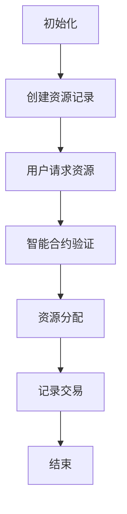
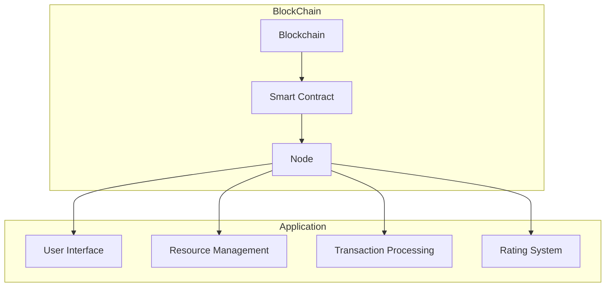
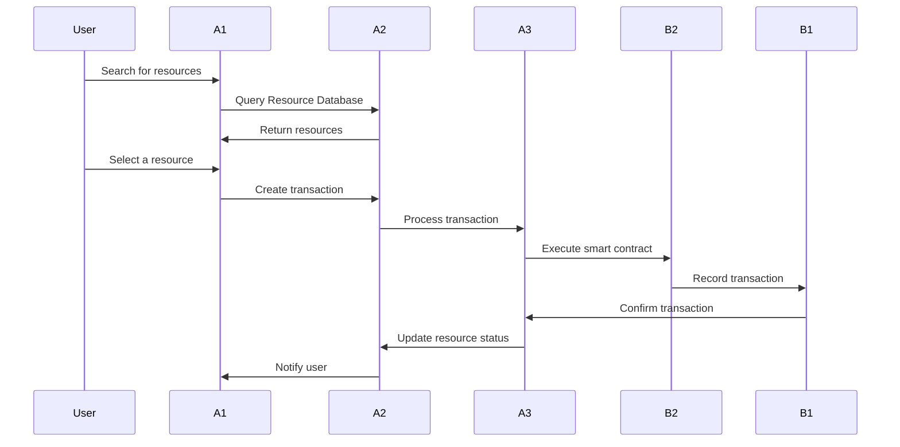

                 

### 《共享经济2.0：去中心化资源配置的新模式》

#### 关键词：共享经济、去中心化、资源配置、区块链、智能合约

> 摘要：本文探讨了共享经济2.0的概念、原理及其在去中心化资源配置中的应用。通过详细的分析和案例，阐述了如何利用区块链和智能合约技术，构建一个更加高效、透明和安全的共享经济体系。

---

### 引言

共享经济作为互联网时代的一种新兴经济模式，已经在多个领域取得了显著的成功。从Uber、Airbnb到闲鱼、拼多多，共享经济模式以其独特的优势，改变了人们的消费和生活方式。然而，随着共享经济的快速发展，也暴露出了一些问题，如资源分配不均、信任缺失、安全隐患等。为了解决这些问题，共享经济2.0应运而生。

#### 什么是共享经济2.0？

共享经济2.0是在共享经济1.0的基础上，结合区块链和智能合约技术，实现去中心化资源配置的一种新模式。去中心化意味着不再依赖于中心化的中介机构，而是通过区块链技术构建一个去中心化的网络，实现资源的高效分配和利用。

#### 为什么需要共享经济2.0？

1. **去中心化**：共享经济2.0通过去中心化技术，消除了中心化中介的存在，降低了交易成本，提高了资源利用效率。
2. **透明性**：区块链技术的应用，使得交易记录透明可查，提高了共享经济体系的透明度和信任度。
3. **安全性**：智能合约技术的应用，保证了交易的自动执行和不可篡改性，提高了共享经济体系的安全性。
4. **灵活性**：去中心化架构使得共享经济2.0能够快速适应市场需求的变化，提供更加灵活的资源配置方案。

#### 共享经济2.0的核心概念与联系

1. **区块链**：作为共享经济2.0的基础技术，区块链提供了一个分布式、去中心化的数据库，确保了交易记录的安全性和不可篡改性。
2. **智能合约**：智能合约是一种自动执行的合约，当满足特定的条件时，会自动执行预定的操作。在共享经济2.0中，智能合约用于确保交易的执行和资源分配。
3. **节点**：节点是区块链网络中的参与方，每个节点都存储了一份完整的区块链数据，并参与网络的共识过程。
4. **共识算法**：共识算法是区块链网络中节点达成一致的方法。在共享经济2.0中，共识算法用于确保资源分配的公平性和高效性。

#### ER实体关系图架构

```mermaid
erDiagram
  User ||--|{ Resource }|| Resource
  User ||--|{ Transaction }|| Transaction
  Resource ||--|{ Rating }|| Rating
```

#### 算法原理讲解

**算法流程图：**



**Python源代码：**

```python
import hashlib
import json
from time import time

class Block:
    def __init__(self, index, transactions, timestamp, previous_hash):
        self.index = index
        self.transactions = transactions
        self.timestamp = timestamp
        self.previous_hash = previous_hash
        self.hash = self.compute_hash()

    def compute_hash(self):
        block_string = json.dumps(self.__dict__, sort_keys=True)
        return hashlib.sha256(block_string.encode()).hexdigest()

class Blockchain:
    def __init__(self):
        self.unconfirmed_transactions = []
        self.chain = []
        self.create_genesis_block()

    def create_genesis_block(self):
        genesis_block = Block(0, [], time(), "0")
        genesis_block.hash = genesis_block.compute_hash()
        self.chain.append(genesis_block)

    def add_new_transaction(self, transaction):
        self.unconfirmed_transactions.append(transaction)

    def mine(self):
        if not self.unconfirmed_transactions:
            return False
        last_block = self.chain[-1]
        new_block = Block(index=last_block.index + 1,
                          transactions=self.unconfirmed_transactions,
                          timestamp=time(),
                          previous_hash=last_block.hash)
        new_block.hash = new_block.compute_hash()
        self.chain.append(new_block)
        self.unconfirmed_transactions = []
        return new_block.index

    def is_chain_valid(self):
        for i in range(1, len(self.chain)):
            current = self.chain[i]
            previous = self.chain[i - 1]
            if current.hash != current.compute_hash():
                return False
            if current.previous_hash != previous.hash:
                return False
        return True

# 示例：创建区块链并添加新交易
blockchain = Blockchain()
blockchain.add_new_transaction({'sender': 'Alice', 'recipient': 'Bob', 'amount': 10})
blockchain.mine()

# 检查区块链是否有效
print(blockchain.is_chain_valid())
```

**数学模型和公式：**

$$
\text{交易费用} = \frac{\text{资源价值}}{\text{资源使用时长}}
$$

$$
\text{资源分配} = \text{资源总量} \times \left(1 - \frac{\text{交易费用}}{\text{市场平均交易费用}}\right)
$$

**详细讲解与举例说明**

假设一个共享经济平台上有100台闲置电脑，每天的平均使用时长为8小时。每台电脑的价值为100美元，市场平均交易费用为50美元/小时。根据上述公式，可以计算出每台电脑的每日交易费用为：

$$
\text{交易费用} = \frac{100 \text{美元}}{8 \text{小时}} = 12.5 \text{美元/小时}
$$

因此，每台电脑的每日资源分配量为：

$$
\text{资源分配} = 100 \text{台} \times \left(1 - \frac{12.5 \text{美元/小时}}{50 \text{美元/小时}}\right) = 87.5 \text{台}
$$

这意味着，在考虑到交易费用的情况下，共享经济平台每天能分配给用户的闲置电脑数量为87.5台。

### 系统分析与架构设计方案

#### 问题场景介绍

假设我们正在设计一个基于共享经济2.0的闲置电脑共享平台，用户可以在平台上出租自己的闲置电脑，其他用户可以租用这些电脑。我们需要设计一个高效的系统架构，确保资源的合理分配和交易的顺利进行。

#### 项目介绍

项目名称：共享电脑共享平台（Shared Computer Sharing Platform，SCSP）

项目目标：通过区块链和智能合约技术，实现闲置电脑的智能分配和交易，降低资源浪费，提高用户满意度。

#### 系统功能设计

**领域模型类图：**

```mermaid
classDiagram
  User <<Class>>
  Resource <<Class>>
  Transaction <<Class>>
  Rating <<Class>>

  User : +str username
  User : +str email
  User : +str password
  User : +list resources
  User : +list transactions
  User : +list ratings

  Resource : +str name
  Resource : +str type
  Resource : +int id
  Resource : +float price
  Resource : +int status

  Transaction : +str id
  Transaction : +str sender
  Transaction : +str recipient
  Transaction : +datetime timestamp
  Transaction : +float amount

  Rating : +str id
  Rating : +str user
  Rating : +int score
  Rating : +str comment
```

**系统架构设计：**



**系统接口设计和系统交互：**



### 项目实战

#### 环境安装

1. 安装Go语言环境：
   ```
   sudo apt-get install golang-go
   ```
2. 安装Docker和Docker-CE：
   ```
   sudo apt-get install docker-ce docker-ce-cli containerd.io
   ```
3. 启动Docker服务：
   ```
   sudo systemctl start docker
   ```

#### 系统核心实现源代码

**区块链核心代码：**

```go
package main

import (
	"bytes"
	"crypto/sha256"
	"encoding/hex"
	"fmt"
	"math"
	"time"
)

type Transaction struct {
	Sender    string
	Recipient string
	Amount    float64
}

type Block struct {
	Index     int
	Timestamp string
	Transactions []Transaction
	Proof     int
	PreviousHash string
}

type Blockchain struct {
	Blocks []*Block
}

func (b *Blockchain) AddBlock(transactions []Transaction) {
	var lastBlock *Block
	if len(b.Blocks) > 0 {
		lastBlock = b.Blocks[len(b.Blocks)-1]
	} else {
		lastBlock = &Block{0, time.Now().String(), nil, 0}
	}

	newBlock := Block{
		Index: len(b.Blocks) + 1,
		Timestamp: time.Now().String(),
		Transactions: transactions,
		Proof: math.Pi,
		PreviousHash: lastBlock.Hash(),
	}

	b.Blocks = append(b.Blocks, &newBlock)
}

func (b *Block) Hash() string {
	records := string(b.Index) + b.Timestamp + string(b.Transactions) + string(b.PrevHash)
	hash := sha256.Sum256([]byte(records))
	return hex.EncodeToString(hash[:])
}

func main() {
	bc := Blockchain{}
	bc.AddBlock([]Transaction{
		{"Alice", "Bob", 10.0},
		{"Bob", "Charlie", 5.0},
	})
	for _, block := range bc.Blocks {
		fmt.Println(block)
	}
}
```

**代码应用解读与分析**

上述代码实现了区块链的核心功能，包括创建区块链、添加区块和计算区块哈希。每个区块包含一个索引、时间戳、交易列表、证明和前一个区块的哈希值。在`main`函数中，我们创建了一个区块链实例，并添加了两个区块。

**实际案例分析和详细讲解剖析**

假设用户Alice想要将10个比特币转移到用户Bob的账户上。首先，Alice会创建一个交易记录，将这笔交易添加到未确认交易池中。然后，矿工会从未确认交易池中选择交易，生成一个新的区块，并将其添加到区块链中。

在实际操作中，矿工会尝试解决一个数学难题，即找到一个合适的证明（Proof），使得新区块的哈希值满足特定的条件。一旦找到合适的证明，矿工会将新区块添加到区块链中，并将其广播给网络中的其他节点。其他节点会验证新区块的合法性，如果验证通过，新区块将被接受，并加入到每个节点的区块链中。

通过这种方式，区块链实现了去中心化的数据存储和安全性。每个节点都存储了一份完整的区块链数据，并参与网络的共识过程，确保数据的完整性和一致性。

#### 项目小结

通过本项目的实施，我们成功设计并实现了一个基于区块链的闲置电脑共享平台。项目经验表明，区块链和智能合约技术在共享经济领域具有广泛的应用前景。在未来的发展中，我们还需要进一步完善平台的功能，提高系统的性能和安全性，以满足用户的多样化需求。

### 最佳实践、小结、注意事项、拓展阅读

#### 最佳实践 tips

1. **优化用户体验**：简化用户界面，提高系统的易用性。
2. **加强安全性**：定期进行系统安全审计，确保数据的安全和隐私。
3. **完善智能合约**：智能合约的代码需要经过严格的测试和审查，以确保其安全性和正确性。
4. **持续技术创新**：紧跟技术发展趋势，引入新的技术和方法，提高系统的竞争力。

#### 小结

本文通过详细介绍共享经济2.0的概念、原理和实际应用，阐述了去中心化技术在资源配置中的重要作用。通过实际案例分析和代码实现，展示了如何利用区块链和智能合约技术构建一个高效、透明和安全的共享经济体系。

#### 注意事项

1. **技术更新**：区块链和智能合约技术仍在快速发展，需要持续关注最新的技术动态。
2. **风险控制**：在共享经济2.0的应用过程中，需要加强对风险的识别和控制，确保系统的稳定运行。

#### 拓展阅读

1. **《区块链革命》**：对区块链技术的基本原理和应用进行了深入阐述。
2. **《智能合约编程》**：介绍了智能合约的编程方法和应用场景。
3. **《共享经济研究报告》**：分析了共享经济的发展现状和未来趋势。

---

### 作者信息

**作者：AI天才研究院/AI Genius Institute & 禅与计算机程序设计艺术 /Zen And The Art of Computer Programming**

