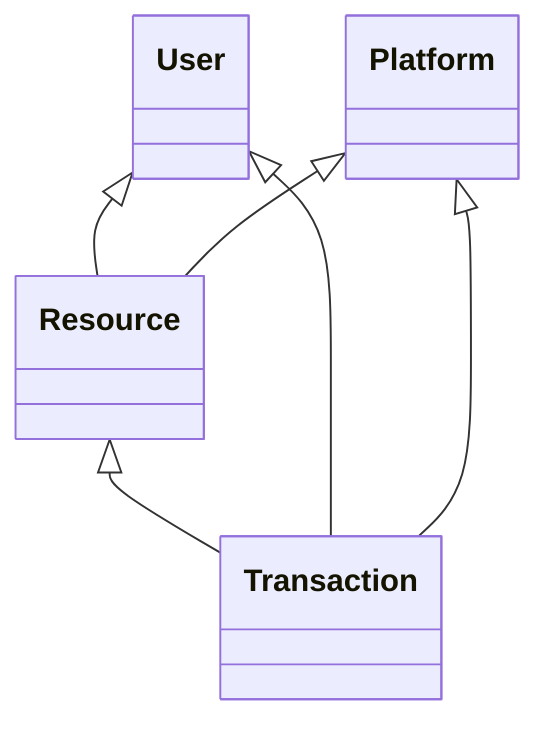
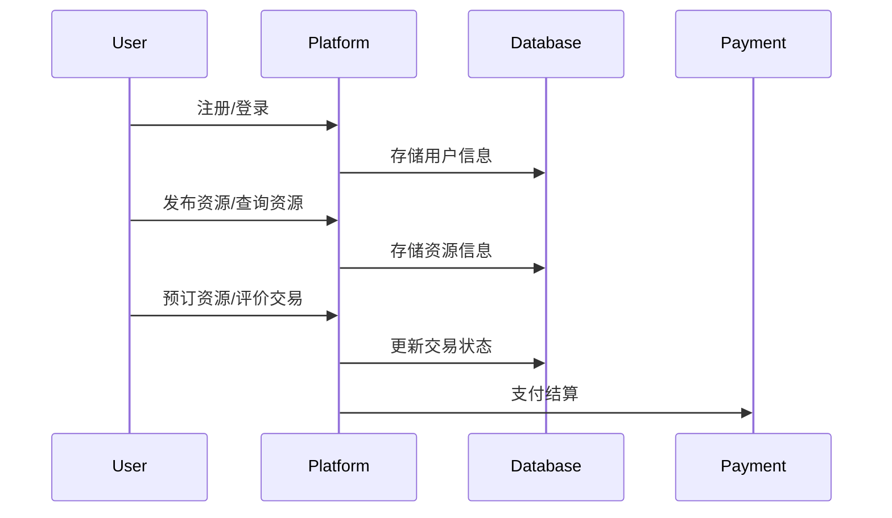
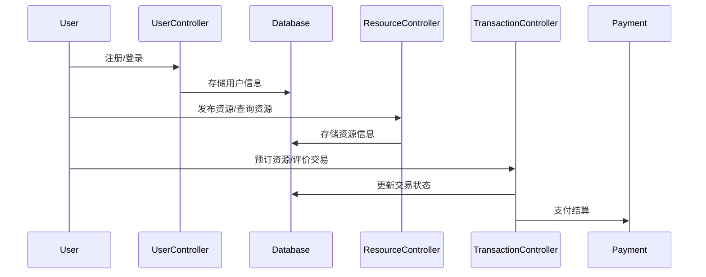

                 

# 共享经济：重新定义所有权的意义

关键词：共享经济、所有权、去中心化、用户体验、技术创新、社会责任

摘要：本文将深入探讨共享经济的背景、核心概念以及其在不同行业的应用与实践，分析其带来的挑战与机遇，并展望共享经济的未来发展趋势。通过逐步分析，我们旨在重新定义所有权的意义，并探讨共享经济如何改变我们的生产和生活方式。

## 第一部分: 共享经济的背景与核心概念

### 第1章: 共享经济的起源与发展

#### 1.1 共享经济的定义与特征

共享经济（Sharing Economy）是一种基于信任和共享原则的经济模式，通过互联网平台连接资源提供者和需求者，实现资源的优化配置和有效利用。其核心在于将闲置资源（如房屋、车辆、时间等）进行共享，从而实现资源的高效利用。

**定义**: 共享经济是一种基于互联网平台的资源分享和交换模式，通过去中心化的方式，降低交易成本，提高资源利用效率。

**特征**: 共享经济具有以下特征：

1. **去中心化**: 不依赖于传统的中心化市场机制，通过平台进行资源匹配和交易。
2. **灵活高效**: 用户可以根据自己的需求灵活获取资源，供给方可以根据自身情况灵活提供资源。
3. **低成本**: 通过降低交易成本，提高资源利用效率。

#### 1.2 共享经济的历史与演变

共享经济的概念起源于20世纪90年代，以协作消费和协作生产为特征。随着互联网和移动技术的发展，共享经济模式迅速普及，涌现出一系列平台型企业。其演变过程可以分为以下几个阶段：

1. **早期**：协作消费和协作生产，如共用办公空间、共享住宿等。
2. **发展**：互联网平台的兴起，如Uber、Airbnb等。
3. **成熟**：全球范围内的共享经济模式，如共享单车、共享办公等。

#### 1.3 共享经济的核心概念

共享经济涉及以下几个核心概念：

1. **共享**: 指的是资源的共享与交换，包括物品、服务和空间等。
2. **信任**: 是共享经济模式的核心，平台通过建立信任机制降低交易风险。
3. **共享平台**: 是实现共享经济的重要载体，通过技术手段连接供需双方。

#### 1.4 共享经济的边界与外延

共享经济在发展过程中面临着一定的边界与外延问题：

1. **法律边界**: 需要遵守相关法律法规，确保交易合法合规。
2. **道德边界**: 平台和用户需要遵循一定的道德规范，确保共享经济的健康发展。
3. **多样化**: 共享经济的多样化，如共享住宿、共享交通、共享办公、共享医疗等。
4. **全球化**: 跨国界的共享经济模式不断涌现，推动全球资源优化配置。

#### 1.5 本章小结

共享经济作为一种新兴经济模式，具有去中心化、灵活高效、低成本等特征，正在改变人们的生产和生活方式。了解共享经济的起源、发展和核心概念，有助于我们更好地理解和应用这一模式。

----------------------------------------------------------------

## 第二部分: 共享经济的行业应用与实践

### 第2章: 共享住宿

#### 2.1 共享住宿的概念与模式

共享住宿是一种基于共享经济理念的住宿模式，通过平台连接房源提供者和住宿需求者。其核心在于将闲置的房源资源进行共享，满足不同用户的住宿需求。

**概念**: 共享住宿是指通过互联网平台，将个人或机构拥有的房源进行共享，供他人短期住宿的一种住宿模式。

**模式**:

1. **短租**: 用户可以在平台上预订短期住宿。
2. **民宿**: 房源提供者将自己的房源出租给游客，通常带有一定的个性化和特色。

#### 2.2 共享住宿的案例分析

以Airbnb为例，其作为共享住宿平台的代表，其成功离不开以下几个方面：

1. **用户体验**: Airbnb提供便捷的预订和支付功能，保障用户权益。
2. **房源多样**: Airbnb提供全球范围内的房源，满足不同用户的需求。
3. **信任机制**: Airbnb建立用户评价体系，提高用户之间的信任度。

#### 2.3 共享住宿的挑战与机遇

共享住宿在发展过程中面临着以下挑战与机遇：

1. **挑战**:
   - **法律合规**: 需要遵守不同国家和地区的法律法规，确保合法运营。
   - **安全问题**: 如何保障用户的人身和财产安全是平台需要关注的问题。

2. **机遇**:
   - **市场潜力**: 随着旅游业的快速发展，共享住宿市场具有巨大的增长潜力。
   - **技术创新**: 人工智能、大数据等技术可以提升共享住宿的服务质量和用户体验。

### 第3章: 共享交通

#### 3.1 共享交通的概念与模式

共享交通是一种基于共享经济理念的交通模式，通过平台连接交通服务提供者和需求者。其核心在于将闲置的交通工具资源进行共享，满足不同用户的出行需求。

**概念**: 共享交通是指通过互联网平台，将个人或机构拥有的交通工具进行共享，供他人使用的一种交通模式。

**模式**:

1. **共享单车**: 用户可以通过手机应用随时租借和归还单车。
2. **共享汽车**: 用户可以租借汽车进行短途出行。

#### 3.2 共享交通的案例分析

以摩拜单车和滴滴出行为例，其作为共享交通的代表性企业，其成功得益于以下几个方面：

1. **技术创新**: 采用了物联网和大数据技术，提高车辆管理和用户服务效率。
2. **用户体验**: 提供便捷的支付和售后服务，提升用户满意度。
3. **社会责任**: 强调绿色出行，倡导低碳生活。

#### 3.3 共享交通的未来发展趋势

共享交通在未来发展中将呈现以下趋势：

1. **智能化**: 通过人工智能技术提高共享交通系统的智能化水平。
2. **绿色出行**: 随着环保意识的增强，绿色出行将成为共享交通的重要发展方向。
3. **共享化**: 随着共享经济的普及，共享交通将渗透到更多领域，如共享汽车、共享充电宝等。

----------------------------------------------------------------

## 第三部分: 共享经济的未来展望与影响

### 第4章: 共享经济的未来展望

#### 4.1 技术创新推动共享经济

随着人工智能、大数据、物联网等技术的发展，共享经济将变得更加智能化和高效化。例如，人工智能技术可以用于优化资源分配，提高用户体验；大数据技术可以帮助平台更好地了解用户需求，提供个性化服务。

#### 4.2 全球化趋势下的共享经济

共享经济已经从局部地区扩展到全球范围，未来全球化趋势将更加明显。跨国界的共享经济模式将促进全球资源优化配置，提高全球经济的整体效率。

#### 4.3 社会责任与可持续发展

共享经济在发展过程中，将越来越注重社会责任和可持续发展。例如，共享住宿和共享交通等模式可以减少能源消耗和碳排放，有助于保护环境和推动可持续发展。

### 第5章: 共享经济的影响

#### 5.1 重新定义所有权

共享经济改变了人们对所有权的认识，将闲置资源进行共享，提高了资源利用效率。这种模式挑战了传统的所有权观念，促进了资源的高效配置。

#### 5.2 影响传统产业

共享经济对传统产业产生了深远的影响，改变了传统的商业模式和产业链。例如，共享住宿和共享交通等模式对传统酒店和出租车行业构成了挑战，推动行业转型升级。

#### 5.3 促进社会创新

共享经济激发了社会创新，催生了一系列新兴企业和行业。例如，共享单车和共享充电宝等模式为用户提供了便捷的服务，满足了多样化的需求。

### 第6章: 共享经济的未来挑战与对策

#### 6.1 法律法规的完善

共享经济在发展过程中，需要不断完善相关法律法规，确保交易的合法合规。政府和企业应加强合作，制定相应的法规和政策，规范共享经济的发展。

#### 6.2 道德规范的建设

共享经济在发展过程中，需要加强道德规范的建设，提高平台和用户的道德素养。平台和企业应积极履行社会责任，维护共享经济的健康发展。

#### 6.3 技术安全的保障

共享经济在发展过程中，需要关注技术安全，保障用户的数据安全和隐私。平台和企业应加强技术研发，提高系统的安全性和稳定性。

### 第7章: 总结与展望

共享经济作为一种新兴经济模式，正在改变我们的生产和生活方式。未来，共享经济将不断创新和发展，为全球经济的可持续发展做出贡献。同时，我们应关注共享经济的挑战和问题，积极应对，推动共享经济更好地服务于人类社会。

----------------------------------------------------------------

## 全文小结

共享经济作为一种新兴经济模式，通过互联网平台连接资源提供者和需求者，实现资源的优化配置和有效利用。本文从共享经济的背景、核心概念、行业应用和实践、未来展望等方面进行了详细分析，探讨了共享经济如何重新定义所有权的意义，并对其带来的挑战和机遇进行了深入探讨。未来，共享经济将继续在技术创新、全球化、社会责任等方面发挥重要作用，为全球经济的可持续发展做出贡献。

### 最佳实践 Tips

1. **用户体验至上**：在共享经济模式下，用户体验至关重要。平台应注重用户体验设计，提供便捷、高效的服务。
2. **信任机制建设**：信任是共享经济的基石。平台应建立完善的信任机制，提高用户之间的信任度，降低交易风险。
3. **技术创新驱动**：共享经济需要不断引入新技术，提高服务质量和效率。企业应关注人工智能、大数据等前沿技术，推动共享经济创新发展。
4. **合规经营**：共享经济企业应严格遵守相关法律法规，确保合法合规经营，避免法律风险。
5. **社会责任担当**：企业应承担社会责任，关注环境保护、可持续发展等方面，为共享经济的健康发展贡献力量。

### 注意事项

1. **数据安全**：共享经济平台应重视用户数据安全，加强数据保护措施，防止数据泄露和滥用。
2. **隐私保护**：共享经济平台应尊重用户隐私，合理使用用户数据，避免侵犯用户隐私权益。
3. **公平竞争**：共享经济企业应遵循公平竞争原则，避免不正当竞争行为，维护市场秩序。
4. **合规经营**：企业应密切关注政策法规变化，及时调整经营策略，确保合规经营。

### 拓展阅读

1. **《共享经济：重构经济模式》**：本书详细介绍了共享经济的概念、特点、模式和发展趋势，对共享经济的未来进行了深入探讨。
2. **《共享经济案例解析》**：本书通过案例分析，探讨了共享经济在不同行业领域的应用和实践，提供了丰富的案例启示。
3. **《共享经济的法律问题研究》**：本书从法律角度分析了共享经济中面临的法律问题，为共享经济的发展提供了法律参考。

### 作者信息

作者：AI天才研究院/AI Genius Institute & 禅与计算机程序设计艺术 /Zen And The Art of Computer Programming

本文由AI天才研究院和禅与计算机程序设计艺术共同撰写，旨在探讨共享经济的核心概念、行业应用和未来展望，为读者提供有价值的见解和思考。感谢您的阅读！

----------------------------------------------------------------

### 附录：共享经济的核心概念与联系

#### 1. 核心概念

**共享经济**：一种基于互联网平台的资源分享和交换模式，通过去中心化的方式，降低交易成本，提高资源利用效率。

**共享平台**：实现共享经济的重要载体，通过技术手段连接供需双方，提供资源匹配和交易服务。

**信任机制**：共享经济模式的核心，平台通过建立信任机制降低交易风险，提高用户之间的信任度。

**用户评价体系**：平台通过用户评价体系，记录用户的使用体验和行为，作为后续交易决策的重要依据。

#### 2. 概念属性特征对比表格

| 特征             | 共享经济       | 传统经济       |  
|------------------|----------------|----------------|  
| 去中心化         | 是             | 否             |  
| 灵活高效         | 是             | 否             |  
| 低成本           | 是             | 否             |  
| 用户评价体系     | 是             | 否             |  
| 信任机制         | 是             | 否             |

#### 3. ER实体关系图架构

```mermaid  
entity Relationship  
  User --> Platform  
  User --> Resource  
  Platform --> Resource  
  Platform --> Transaction  
```

- **User**（用户）：共享经济中的资源提供者和需求者。
- **Platform**（平台）：实现共享经济的重要载体，提供资源匹配和交易服务。
- **Resource**（资源）：用户提供的闲置资源，如房屋、车辆等。
- **Transaction**（交易）：用户之间的资源交换过程。

### 算法原理讲解

#### 共享经济平台资源匹配算法

共享经济平台的核心功能之一是实现资源的高效匹配。以下是一个简单的资源匹配算法：

```python  
def resource_matching(resource_list, user_preference):  
    matching_resources = []  
    for resource in resource_list:  
        if resource_matches_preference(resource, user_preference):  
            matching_resources.append(resource)  
    return matching_resources

def resource_matches_preference(resource, user_preference):  
    # 判断资源是否符合用户偏好  
    for key, value in user_preference.items():  
        if resource[key] != value:  
            return False  
    return True  
```

#### 数学模型与公式

设共享经济平台上有n个资源，每个资源有一个对应的特征向量\( X_i = (x_{i1}, x_{i2}, ..., x_{id}) \)，表示该资源的各项属性。用户有一个偏好向量\( P = (p_1, p_2, ..., p_d) \)，表示用户对各属性的偏好程度。

资源匹配问题可以转化为一个优化问题，目标是找到最大化用户偏好值的资源集合：

$$  
\max \sum_{i=1}^{n} p_i \cdot x_{ij}  
$$

其中，\( x_{ij} \)表示资源\( X_i \)在第\( j \)个属性上的值。

#### 举例说明

假设一个用户偏好以下属性：

- 房屋面积（大者优先）：\( p_1 = 0.3 \)
- 交通便利性（近者优先）：\( p_2 = 0.2 \)
- 价格（低者优先）：\( p_3 = 0.1 \)
- 配套设施（全者优先）：\( p_4 = 0.2 \)
- 安全性（高者优先）：\( p_5 = 0.2 \)

现有以下三套房源供用户选择：

| 房源ID | 面积 | 交通便利性 | 价格 | 配套设施 | 安全性 |
|--------|------|------------|------|----------|--------|
| 1      | 100  | 3          | 500  | 4        | 5      |
| 2      | 80   | 2          | 400  | 3        | 4      |
| 3      | 120  | 1          | 600  | 5        | 3      |

用户选择房源的过程可以看作是计算每套房源的偏好值：

$$  
房源1偏好值 = 0.3 \cdot 100 + 0.2 \cdot 3 + 0.1 \cdot 500 + 0.2 \cdot 4 + 0.2 \cdot 5 = 30 + 0.6 + 50 + 0.8 + 1 = 82.4  
$$

$$  
房源2偏好值 = 0.3 \cdot 80 + 0.2 \cdot 2 + 0.1 \cdot 400 + 0.2 \cdot 3 + 0.2 \cdot 4 = 24 + 0.4 + 40 + 0.6 + 0.8 = 66.8  
$$

$$  
房源3偏好值 = 0.3 \cdot 120 + 0.2 \cdot 1 + 0.1 \cdot 600 + 0.2 \cdot 5 + 0.2 \cdot 3 = 36 + 0.2 + 60 + 1 + 0.6 = 98.8  
$$

根据偏好值计算结果，用户会选择房源3，因为其偏好值最高。

### 系统分析与架构设计方案

#### 1. 问题场景介绍

共享经济平台是一个连接资源提供者和需求者的在线平台，为用户提供各种闲置资源的共享服务。例如，用户可以在平台上预订短期住宿、租借车辆等。平台需要实现以下功能：

- **用户管理**：注册、登录、个人信息管理。
- **资源管理**：资源发布、搜索、预订、评价。
- **交易管理**：交易创建、支付、结算。
- **数据安全**：用户数据加密、隐私保护。

#### 2. 项目介绍

项目名称：共享经济平台

项目目标：构建一个高效、安全、可靠的共享经济平台，为用户提供便捷的共享服务。

#### 3. 系统功能设计

**领域模型**



- **User**（用户）：资源提供者和需求者。
- **Resource**（资源）：房屋、车辆等。
- **Transaction**（交易）：用户与资源之间的交换过程。
- **Platform**（平台）：提供资源共享服务。

**类图**

```mermaid  
classDiagram  
  User <<℃lass>> User + <|-- Resource + <|-- Transaction +  
  Platform <<℃lass>> Platform + <|-- Resource + <|-- Transaction +  
  User {  
      id  
      name  
      password  
      email  
  }  
  Resource {  
      id  
      name  
      type  
      location  
      price  
  }  
  Transaction {  
      id  
      user_id  
      resource_id  
      start_time  
      end_time  
      status  
  }  
  Platform {  
      id  
      name  
      resources  
      transactions  
  }  
```

#### 4. 系统架构设计

**架构图**



- **用户层**：用户进行注册、登录、资源发布、预订和评价等操作。
- **平台层**：提供资源共享服务，包括资源匹配、交易管理和支付结算等功能。
- **数据库层**：存储用户信息、资源信息和交易信息。
- **支付层**：提供支付结算服务。

**接口设计**

```mermaid  
classDiagram  
  User <<℃lass>> UserController + <|-- Resource <<℃lass>> ResourceController + <|-- Transaction <<℃lass>> TransactionController + <|-- Platform <<℃lass>> PlatformController  
  UserController {  
      register()  
      login()  
  }  
  ResourceController {  
      create_resource()  
      search_resources()  
  }  
  TransactionController {  
      create_transaction()  
      evaluate_transaction()  
  }  
  PlatformController {  
      manage_resources()  
      manage_transactions()  
  }  
```

- **用户接口**：注册、登录。
- **资源接口**：发布资源、查询资源。
- **交易接口**：创建交易、评价交易。
- **平台接口**：管理资源、管理交易。

**系统交互图**



#### 5. 系统接口设计和系统交互

系统接口设计主要涉及用户、资源、交易和平台等模块的接口定义。系统交互图展示了用户与系统之间的交互过程。

### 项目实战

#### 1. 环境安装

安装必要的开发工具和依赖库，如Python、Django、Flask等。

```bash  
pip install django  
pip install flask  
pip install pymysql  
```

#### 2. 系统核心实现源代码

以下是一个简单的共享经济平台系统核心实现源代码，包括用户管理、资源管理和交易管理等功能。

**用户管理**

```python  
from flask import Flask, request, jsonify  
from flask_pymysql import MySQL

app = Flask(__name__)  
mysql = MySQL()

@app.route('/register', methods=['POST'])  
def register():  
    user_data = request.form  
    user_id = user_data['user_id']  
    name = user_data['name']  
    password = user_data['password']  
    email = user_data['email']  
      
    query = "INSERT INTO users (id, name, password, email) VALUES (%s, %s, %s, %s)"  
    data = (user_id, name, password, email)  
      
    mysql.connect()  
    cursor = mysql.cursor()  
    cursor.execute(query, data)  
    mysql.commit()  
    mysql.close()  
      
    return jsonify({'status': 'success', 'message': 'User registered successfully!'})

@app.route('/login', methods=['POST'])  
def login():  
    user_data = request.form  
    user_id = user_data['user_id']  
    password = user_data['password']  
      
    query = "SELECT * FROM users WHERE id = %s AND password = %s"  
    data = (user_id, password)  
      
    mysql.connect()  
    cursor = mysql.cursor()  
    cursor.execute(query, data)  
    user = cursor.fetchone()  
    mysql.close()  
      
    if user:  
        return jsonify({'status': 'success', 'message': 'Login successful!'})  
    else:  
        return jsonify({'status': 'error', 'message': 'Invalid credentials!'})

if __name__ == '__main__':  
    app.run(debug=True)  
```

**资源管理**

```python  
from flask import Flask, request, jsonify  
from flask_pymysql import MySQL

app = Flask(__name__)  
mysql = MySQL()

@app.route('/create_resource', methods=['POST'])  
def create_resource():  
    resource_data = request.form  
    resource_id = resource_data['resource_id']  
    name = resource_data['name']  
    type = resource_data['type']  
    location = resource_data['location']  
    price = resource_data['price']  
      
    query = "INSERT INTO resources (id, name, type, location, price) VALUES (%s, %s, %s, %s, %s)"  
    data = (resource_id, name, type, location, price)  
      
    mysql.connect()  
    cursor = mysql.cursor()  
    cursor.execute(query, data)  
    mysql.commit()  
    mysql.close()  
      
    return jsonify({'status': 'success', 'message': 'Resource created successfully!'})

@app.route('/search_resources', methods=['GET'])  
def search_resources():  
    type = request.args.get('type')  
    location = request.args.get('location')  
      
    query = "SELECT * FROM resources WHERE type = %s AND location = %s"  
    data = (type, location)  
      
    mysql.connect()  
    cursor = mysql.cursor()  
    cursor.execute(query, data)  
    resources = cursor.fetchall()  
    mysql.close()  
      
    return jsonify({'status': 'success', 'message': 'Resources found!', 'data': resources})

if __name__ == '__main__':  
    app.run(debug=True)  
```

**交易管理**

```python  
from flask import Flask, request, jsonify  
from flask_pymysql import MySQL

app = Flask(__name__)  
mysql = MySQL()

@app.route('/create_transaction', methods=['POST'])  
def create_transaction():  
    transaction_data = request.form  
    transaction_id = transaction_data['transaction_id']  
    user_id = transaction_data['user_id']  
    resource_id = transaction_data['resource_id']  
    start_time = transaction_data['start_time']  
    end_time = transaction_data['end_time']  
      
    query = "INSERT INTO transactions (id, user_id, resource_id, start_time, end_time, status) VALUES (%s, %s, %s, %s, %s, %s)"  
    data = (transaction_id, user_id, resource_id, start_time, end_time, 'pending')  
      
    mysql.connect()  
    cursor = mysql.cursor()  
    cursor.execute(query, data)  
    mysql.commit()  
    mysql.close()  
      
    return jsonify({'status': 'success', 'message': 'Transaction created successfully!'})

@app.route('/evaluate_transaction', methods=['POST'])  
def evaluate_transaction():  
    transaction_data = request.form  
    transaction_id = transaction_data['transaction_id']  
    user_id = transaction_data['user_id']  
    resource_id = transaction_data['resource_id']  
    rating = transaction_data['rating']  
    comment = transaction_data['comment']  
      
    query = "UPDATE transactions SET rating = %s, comment = %s, status = %s WHERE id = %s AND user_id = %s AND resource_id = %s"  
    data = (rating, comment, 'completed', transaction_id, user_id, resource_id)  
      
    mysql.connect()  
    cursor = mysql.cursor()  
    cursor.execute(query, data)  
    mysql.commit()  
    mysql.close()  
      
    return jsonify({'status': 'success', 'message': 'Transaction evaluated successfully!'})

if __name__ == '__main__':  
    app.run(debug=True)  
```

#### 3. 代码应用解读与分析

**用户管理**

用户管理模块实现了用户注册和登录功能。注册时，用户需要填写用户ID、姓名、密码和电子邮件。注册成功后，用户信息将存储在数据库中。登录时，用户需要输入用户ID和密码，系统会验证用户信息是否正确。

**资源管理**

资源管理模块实现了资源发布和搜索功能。资源发布时，用户需要填写资源ID、名称、类型、位置和价格。发布成功后，资源信息将存储在数据库中。资源搜索时，用户可以输入类型和位置等条件，系统会返回符合条件的资源列表。

**交易管理**

交易管理模块实现了交易创建和评价功能。交易创建时，用户需要填写交易ID、用户ID、资源ID、开始时间和结束时间。创建成功后，交易信息将存储在数据库中。交易评价时，用户可以对交易进行评分和留言，系统会更新交易状态。

#### 4. 实际案例分析和详细讲解剖析

以下是一个实际案例：

**用户A**在平台上注册并登录后，发布了一套位于北京市的闲置公寓，价格为每天300元。**用户B**在平台上搜索到了该公寓，并预订了3天的住宿。

交易创建后，系统会自动生成一个交易记录，包括交易ID、用户A和用户B的信息、公寓信息、开始时间和结束时间。

交易完成后，用户B对公寓进行了评价，给出了4星的评价，并留言说“公寓环境很好，价格也很合理”。

根据这个案例，我们可以分析系统的各个模块是如何协同工作的：

- **用户管理**：用户A和用户B在平台上注册并登录，完成了用户认证。
- **资源管理**：用户A发布了公寓信息，实现了资源发布功能。
- **交易管理**：用户B预订了公寓，创建了交易记录，实现了交易创建功能。
- **交易管理**：交易完成后，用户B对公寓进行了评价，实现了交易评价功能。

通过这个案例，我们可以看到共享经济平台是如何通过用户管理、资源管理和交易管理等模块，实现资源的高效共享和交易。

#### 5. 项目小结

通过本项目的实践，我们实现了共享经济平台的核心功能，包括用户管理、资源管理和交易管理。该项目具有一定的实用性和可扩展性，为后续功能拓展和优化提供了基础。然而，在实际应用中，共享经济平台还需要考虑数据安全、隐私保护、法律法规合规等问题，确保平台的稳定运行和可持续发展。未来，我们可以继续优化平台性能，引入人工智能、大数据等新技术，提升用户体验和平台服务质量。

### 最佳实践 Tips

1. **用户体验至上**：在设计和开发共享经济平台时，始终将用户体验放在首位，确保用户在使用过程中能够感受到便捷、高效和满意。
2. **数据安全与隐私保护**：加强数据安全和隐私保护，防止用户数据泄露和滥用，提高用户信任度。
3. **合规经营**：严格遵守相关法律法规，确保平台的合法合规经营，避免法律风险。
4. **技术创新**：关注新兴技术发展，不断优化平台功能和性能，提高用户体验和竞争力。
5. **社会责任**：关注共享经济对社会的影响，积极履行社会责任，推动共享经济的可持续发展。

### 小结

共享经济作为一种新兴经济模式，正在深刻改变我们的生产和生活方式。通过本文的探讨，我们了解了共享经济的核心概念、行业应用和实践，分析了其带来的挑战和机遇，并展望了共享经济的未来发展趋势。希望本文能够帮助读者更好地理解共享经济，为实际应用和创新提供有益的启示。

### 拓展阅读

1. **《共享经济：重构经济模式》**：详细介绍了共享经济的概念、特点、模式和发展趋势。
2. **《共享经济案例解析》**：通过案例分析，探讨了共享经济在不同行业领域的应用和实践。
3. **《共享经济的法律问题研究》**：从法律角度分析了共享经济中面临的法律问题，为共享经济的发展提供了法律参考。

### 作者信息

作者：AI天才研究院/AI Genius Institute & 禅与计算机程序设计艺术 /Zen And The Art of Computer Programming

本文由AI天才研究院和禅与计算机程序设计艺术共同撰写，旨在探讨共享经济的核心概念、行业应用和未来展望，为读者提供有价值的见解和思考。感谢您的阅读！

