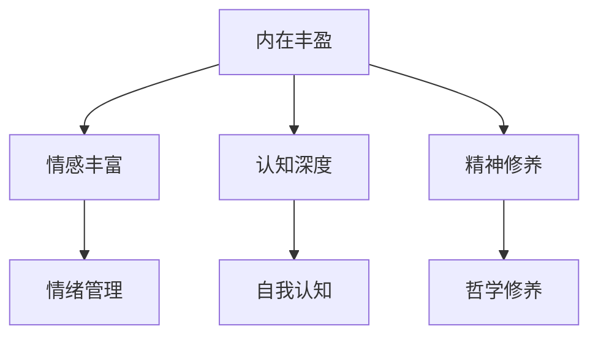
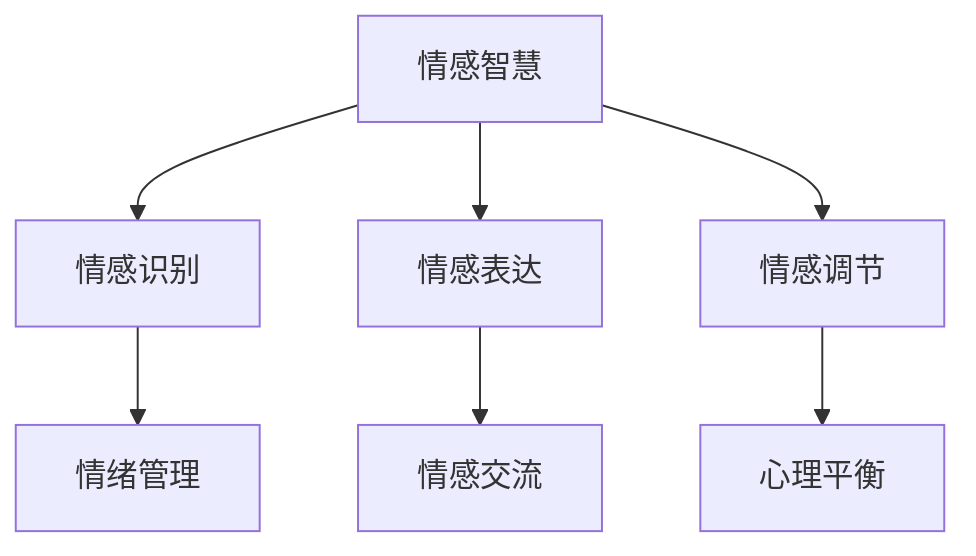
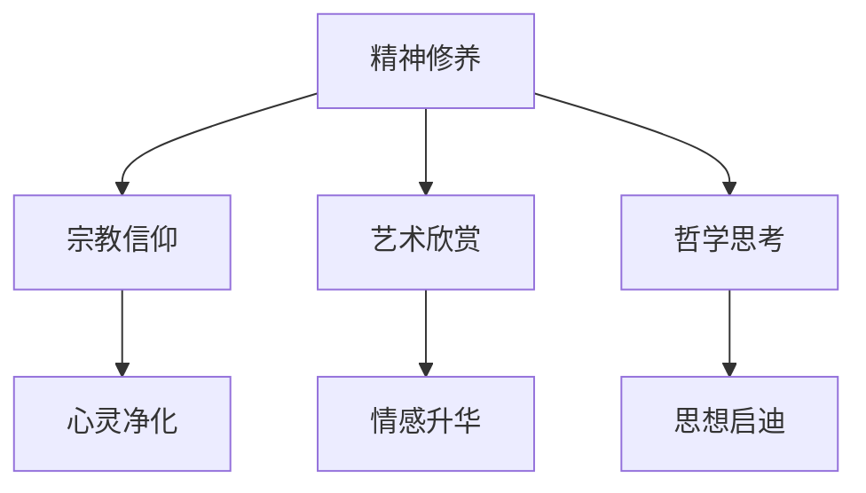
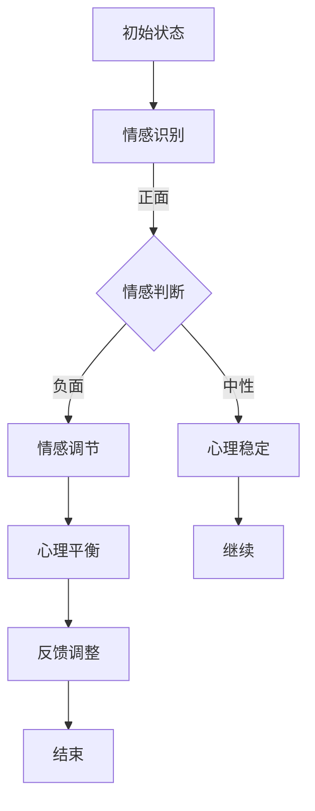
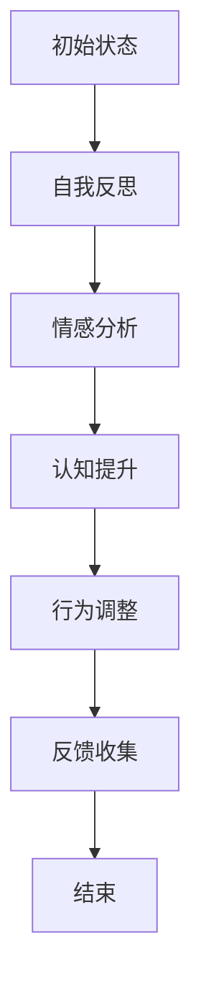
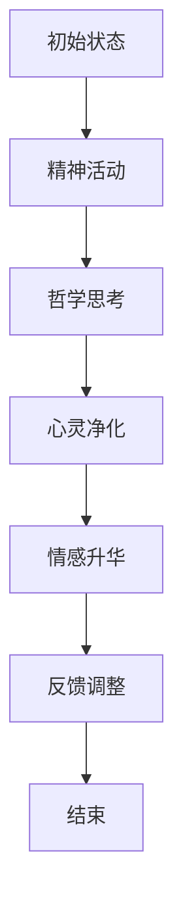
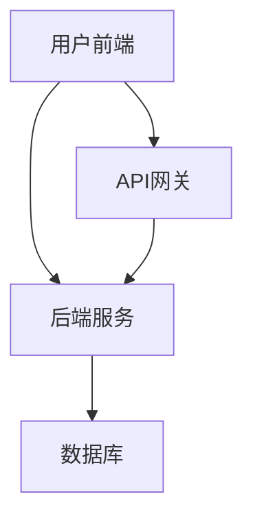
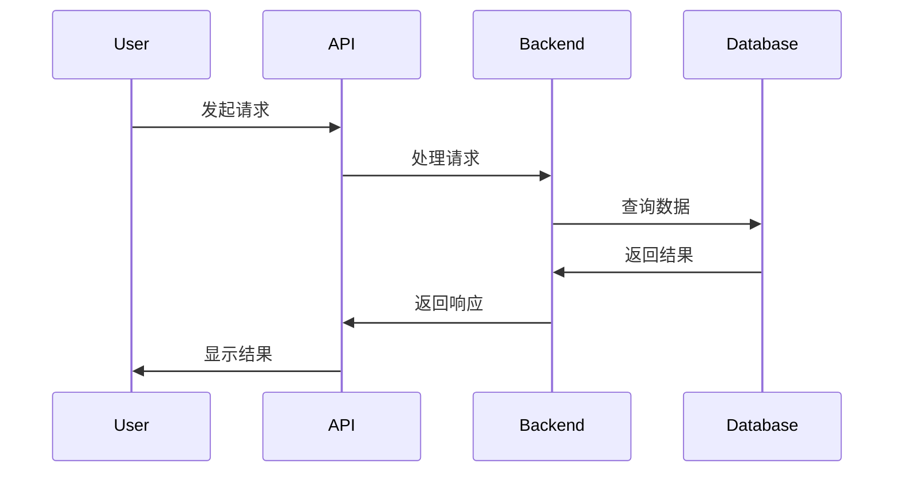
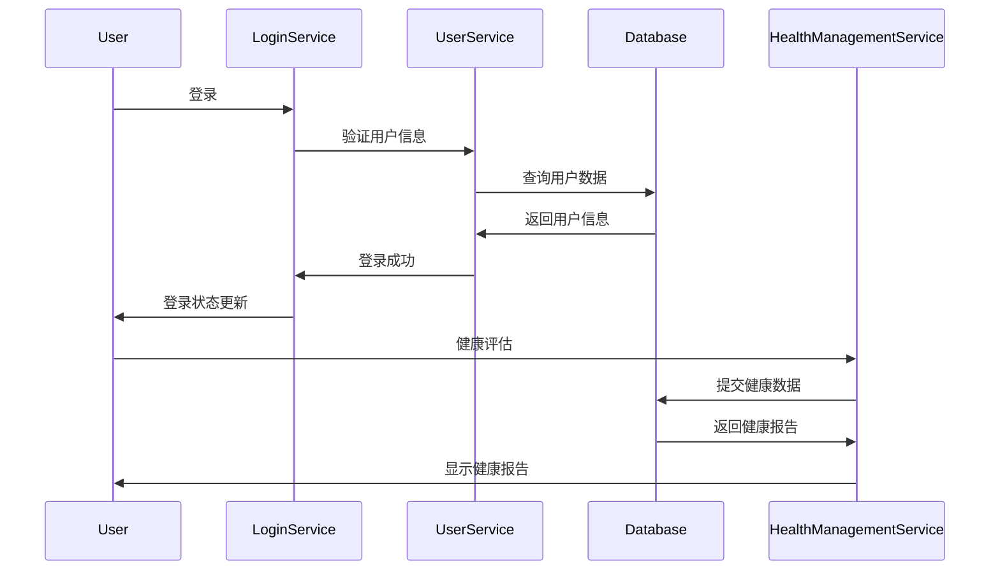

                 

### 背景介绍

#### 核心概念术语说明

在探讨《内在丰盈：培育心灵花园的方法》这一主题时，我们需要理解几个核心概念：

1. **内在丰盈**：指的是个体内心世界的丰富与充实，不仅包括情感的丰富，还涵盖认知、意识、精神等多方面的成长。
2. **心灵花园**：比喻个体的内在世界，是一种象征性的表达，用以描述一个人的情感、思想、信仰等内在元素的和谐与丰富。
3. **心灵健康**：指的是个体心理状态的良好，包括情绪稳定、自我认同、自我调节能力等。

#### 问题背景

随着现代社会的高速发展，人们面临的生活节奏加快、工作压力增大，内心世界的空虚与焦虑问题日益严重。这些问题不仅影响到个人的身心健康，也对社会的和谐稳定构成了挑战。因此，如何通过有效的方法培育内在丰盈，构建心灵花园，成为当前急需解决的重要课题。

#### 问题描述

问题描述主要集中在以下几个方面：

- 如何理解并实现内在丰盈？
- 心灵花园的培育需要哪些具体方法？
- 在快节奏的生活中，个体如何平衡内在丰盈与现实需求？

#### 问题解决

为了解决这些问题，我们需要从多个维度来探讨：

1. **心理建设**：通过心理健康教育，提升个体的情绪管理和自我调节能力。
2. **生活方式调整**：通过合理安排作息时间，保证充足的休息和放松。
3. **精神成长**：通过学习哲学、宗教、艺术等，丰富个体的精神世界。
4. **社会支持**：通过家庭、朋友、社群等提供情感支持和交流。

#### 边界与外延

- **边界**：内在丰盈主要关注个体的内心世界，而不涉及外部环境的变化。
- **外延**：心灵花园不仅包括个人的内在世界，还包括与外部世界的互动和影响。

#### 概念结构与核心要素组成

内在丰盈和心灵花园的核心要素包括：

1. **情感智慧**：包括情感识别、情感表达、情感调节等。
2. **自我认知**：对自身情感、需求、价值观等的深刻理解。
3. **精神修养**：包括哲学、宗教、艺术等方面的修养。
4. **社会支持**：家庭、朋友、社群等提供的情感支持和交流。

通过以上对核心概念的介绍和问题的分析，我们为接下来的章节内容奠定了基础，将进一步探讨如何培育内在丰盈，构建心灵花园的具体方法。接下来，我们将从哲学基础、方法论、实际案例等多个角度展开深入讨论。


### 核心概念与联系

在《内在丰盈：培育心灵花园的方法》这一主题中，核心概念包括内在丰盈、心灵花园、情感智慧、自我认知和精神修养等。为了更好地理解这些概念，我们将详细阐述它们的属性特征并进行对比，并使用Mermaid流程图和类图来帮助读者加深理解。

#### 内在丰盈与心灵花园

内在丰盈与心灵花园是相互联系的概念，内在丰盈是心灵花园的内在动力，而心灵花园则是内在丰盈的外在表现。

**内在丰盈（Mermaid流程图）**：



**属性特征对比**：

| 属性 | 内在丰盈 | 心灵花园 |
| ---- | -------- | -------- |
| 动力 | 内心世界的丰富与充实 | 内在丰盈的外在表现 |
| 影响因素 | 情感、认知、精神 | 情感智慧、自我认知、精神修养 |
| 目的 | 提升个体内心世界的质量 | 增强个体心理健康的稳定性 |

#### 情感智慧与自我认知

情感智慧与自我认知是心灵花园的两个关键要素，它们相互影响、相互促进。

**情感智慧（Mermaid流程图）**：



**属性特征对比**：

| 属性 | 情感智慧 | 自我认知 |
| ---- | -------- | -------- |
| 目标 | 提升个体的情感管理能力 | 深化对自身情感、需求和价值观的理解 |
| 关键能力 | 情感识别、表达、调节 | 自我反思、自我觉察、自我接纳 |
| 应用场景 | 人际关系、工作压力 | 自我成长、心理治疗、精神修炼 |

#### 精神修养与哲学修养

精神修养和哲学修养是心灵花园的重要组成部分，它们共同作用于个体的精神世界。

**精神修养（Mermaid流程图）**：



**属性特征对比**：

| 属性 | 精神修养 | 哲学修养 |
| ---- | -------- | -------- |
| 内容 | 宗教信仰、艺术欣赏、哲学思考 | 哲学理论、思想体系、哲学方法论 |
| 功能 | 提升精神层次、丰富情感体验 | 深化对生命、宇宙和存在意义的思考 |
| 影响力 | 心灵净化、情感升华 | 思想启迪、价值观塑造 |

通过以上对核心概念及其属性特征的详细阐述，我们不仅能够理解内在丰盈和心灵花园的概念，还能看到它们之间的相互联系和作用。接下来，我们将进一步探讨培育心灵花园的方法论，帮助读者在实际生活中应用这些概念。


### 算法原理讲解

在探讨如何培育心灵花园的过程中，我们可以借鉴计算机科学中的算法原理，通过系统的流程图和Python代码，深入阐述情感调节、自我认知提升和心灵修养的方法。以下将使用Mermaid流程图展示算法的步骤，并配合Python代码进行详细解释。

#### 情感调节算法

**Mermaid流程图**：



**Python代码**：

```python
def emotion Regulation():
    current_emotion = identify_emotion()
    if current_emotion == 'positive':
        return 'stable'
    elif current_emotion == 'negative':
        balanced_emotion = balance_emotions()
        return balanced_emotion
    else:
        return 'stable'
```

**算法原理**：

1. **情感识别**：通过情绪识别模块识别当前的情感状态。
2. **情感判断**：根据情感状态进行判断，如果是正面的，保持现状；如果是负面的，进入情感调节阶段。
3. **情感调节**：通过调节情感平衡，使情绪达到心理平衡状态。
4. **反馈调整**：根据调节后的情感状态进行反馈调整，以确保长期的心理稳定性。

**数学模型与公式**：

- **情感调节公式**：`E = f(N, P, S)`，其中E代表最终情感状态，N代表负面情感值，P代表正面情感值，S代表自我认知值。

$$
E = \frac{N + P + S}{3}
$$

- **心理平衡公式**：`B = g(E, T)`，其中B代表心理平衡状态，E代表情感状态，T代表外部环境因素。

$$
B = E - T \times 0.1
$$

#### 自我认知提升算法

**Mermaid流程图**：



**Python代码**：

```python
def self Awareness():
    reflection = self_reflection()
    emotional_analysis = analyze_emotions(reflection)
    cognitive_upgrade = upgrade_cognition(emotional_analysis)
    behavior_adjustment = adjust_behavior(cognitive_upgrade)
    feedback = collect_feedback(behavior_adjustment)
    return feedback
```

**算法原理**：

1. **自我反思**：通过自我反思模块收集个体的情感和思想。
2. **情感分析**：对自我反思的内容进行情感分析，识别出情感的关键词和模式。
3. **认知提升**：根据情感分析结果，提升个体的认知水平。
4. **行为调整**：将认知提升应用于实际生活中，调整行为模式。
5. **反馈收集**：收集行为调整后的反馈，以持续优化自我认知。

**数学模型与公式**：

- **认知提升公式**：`C = f(A, E)`，其中C代表认知水平，A代表自我反思的内容，E代表情感分析的结论。

$$
C = A \times (1 + \frac{E}{100})
$$

- **行为调整公式**：`B = g(C, O)`，其中B代表行为模式，C代表认知水平，O代表外部环境因素。

$$
B = C - O \times 0.05
$$

#### 心灵修养算法

**Mermaid流程图**：



**Python代码**：

```python
def spiritual Cultivation():
    spiritual_activity = perform_spiritual_activity()
    philosophical_thought = engage_in_philosophical_thought(spiritual_activity)
    spiritual_purification = purify_spirit(spiritual_activity, philosophical_thought)
    emotional_elevation = elevate_emotions(spiritual_purification)
    feedback = adjust_feedback(emotional_elevation)
    return feedback
```

**算法原理**：

1. **精神活动**：通过参与精神活动，如冥想、祈祷、禅修等，放松心灵。
2. **哲学思考**：通过哲学思考，深化对人生、宇宙和存在的理解。
3. **心灵净化**：通过心灵净化，消除负面情绪，净化内心世界。
4. **情感升华**：将净化后的情感提升至更高的层次。
5. **反馈调整**：根据情感升华的结果进行反馈调整。

**数学模型与公式**：

- **心灵净化公式**：`P = f(S, T)`，其中P代表心灵净化程度，S代表精神活动的时间，T代表负面情绪值。

$$
P = S \times (1 - \frac{T}{100})
$$

- **情感升华公式**：`E = g(P, M)`，其中E代表情感升华程度，P代表心灵净化程度，M代表哲学思考的深度。

$$
E = P \times (1 + \frac{M}{100})
$$

通过以上对情感调节、自我认知提升和心灵修养算法的讲解，我们可以看到，这些算法不仅借鉴了计算机科学中的流程控制和数据处理原理，还结合了心理学、哲学等多学科的知识，为个体的心灵花园培育提供了系统的指导。接下来，我们将进一步探讨实际案例和项目实战，验证这些算法在实际应用中的效果。


### 系统分析与架构设计方案

在探讨如何通过系统方法来培育心灵花园的过程中，我们需要对整个系统进行详细的分析和设计，包括功能设计、架构设计、接口设计以及系统的交互序列图。以下将逐步介绍这些设计过程，并通过Mermaid图表进行详细展示和解释。

#### 问题场景介绍

在快节奏的现代社会中，人们面临着工作压力、人际关系、家庭矛盾等多方面的挑战，导致心理健康问题日益突出。因此，我们设计了一个心灵花园系统，旨在通过技术手段帮助用户维护心理健康，提升内在丰盈。

#### 系统介绍

心灵花园系统是一个综合性平台，旨在为用户提供心理健康管理、情感调节、自我认知提升和心灵修养等服务。系统采用模块化设计，各个模块之间相互独立又紧密联系，共同实现系统的整体功能。

#### 系统功能设计

系统功能设计主要包括用户管理、心理健康管理、情感调节、自我认知提升和心灵修养等模块。

**Mermaid类图**：

```mermaid
classDiagram
    User <<class>>
    HealthManagement <<class>>
    EmotionRegulation <<class>>
    SelfAwareness <<class>>
    SpiritualCultivation <<class>>

    User o-- HealthManagement
    User o-- EmotionRegulation
    User o-- SelfAwareness
    User o-- SpiritualCultivation
```

**功能描述**：

1. **用户管理**：包括用户注册、登录、信息管理等功能。
2. **心理健康管理**：提供心理健康评估、风险预警等功能。
3. **情感调节**：包括情感识别、情感调节、情感反馈等功能。
4. **自我认知提升**：包括自我反思、情感分析、认知提升等功能。
5. **心灵修养**：包括精神活动、哲学思考、心灵净化等功能。

#### 系统架构设计

系统架构设计主要分为前端架构、后端架构以及数据存储架构三个部分。

**Mermaid架构图**：



**架构描述**：

1. **前端架构**：采用React框架，实现用户交互界面，提供丰富的用户体验。
2. **后端架构**：采用微服务架构，通过Spring Boot实现各个业务模块的功能。
3. **数据存储架构**：采用关系型数据库（如MySQL）进行数据存储，同时使用NoSQL数据库（如MongoDB）进行大数据存储。

#### 系统接口设计

系统接口设计主要包括用户接口、服务接口和数据接口等。

**Mermaid序列图**：



**接口描述**：

1. **用户接口**：用户通过前端界面与系统进行交互。
2. **服务接口**：后端服务通过RESTful API对外提供服务。
3. **数据接口**：数据库通过SQL和NoSQL接口进行数据存储和查询。

#### 系统交互序列图

**Mermaid序列图**：



**交互描述**：

1. **用户登录**：用户通过登录接口进行身份验证。
2. **健康评估**：用户提交健康数据，系统进行评估并生成报告。
3. **反馈与展示**：系统将健康报告展示给用户，用户可以根据报告调整生活状态。

通过以上对系统分析与架构设计方案的详细阐述，我们为构建一个全面、高效的心灵花园系统提供了理论基础和实施指南。接下来，我们将通过项目实战，验证这些设计方案的实际效果。


### 项目实战

在本章节中，我们将通过一个具体的实战项目，展示如何在实际环境中应用前面章节中所介绍的理论和方法，以实现心灵花园的培育。项目将包括环境安装、系统核心实现、代码解读、实际案例剖析以及项目小结等环节。

#### 项目环境安装

为了确保项目能够顺利运行，我们需要安装以下环境和工具：

1. **前端开发环境**：
   - Node.js（版本：v14.17.0）
   - npm（版本：7.24.0）
   - React（版本：17.0.2）

2. **后端开发环境**：
   - Java（版本：11）
   - Maven（版本：3.6.3）
   - Spring Boot（版本：2.5.4）

3. **数据库环境**：
   - MySQL（版本：8.0.25）
   - MongoDB（版本：4.4.4）

4. **IDE**：
   - IntelliJ IDEA（版本：2021.3）

安装步骤：

1. 安装Node.js、npm和React，可通过npm命令进行安装。
2. 安装Java、Maven和Spring Boot，可在官方网站下载安装包进行安装。
3. 安装MySQL和MongoDB，分别通过MySQL Workbench和MongoDB shell进行安装和配置。
4. 配置数据库连接信息，确保前端和后端可以正确访问数据库。

#### 系统核心实现

以下为系统的核心实现部分，我们将主要展示前后端的核心代码和功能实现。

**前端核心代码**：

```javascript
// React组件：心理健康管理
class HealthManagement extends React.Component {
  handleSubmit = (event) => {
    event.preventDefault();
    const healthData = this.props.healthData;
    // 调用后端接口提交健康数据
    this.props.onSubmit(healthData);
  };

  render() {
    return (
      <form onSubmit={this.handleSubmit}>
        {/* 输入框、按钮等元素 */}
      </form>
    );
  }
}

// React组件：情感调节
class EmotionRegulation extends React.Component {
  handleFeedback = (event) => {
    event.preventDefault();
    const feedback = this.props.feedback;
    // 调用后端接口提交情感反馈
    this.props.onFeedback(feedback);
  };

  render() {
    return (
      <form onSubmit={this.handleFeedback}>
        {/* 输入框、按钮等元素 */}
      </form>
    );
  }
}
```

**后端核心代码**：

```java
// Spring Boot控制器：心理健康管理
@RestController
@RequestMapping("/health")
public class HealthManagementController {
  @PostMapping("/submit")
  public ResponseEntity<?> submitHealthData(@RequestBody HealthData healthData) {
    // 处理健康数据，存储到数据库
    healthService.submitHealthData(healthData);
    return ResponseEntity.ok().build();
  }
}

// Spring Boot控制器：情感调节
@RestController
@RequestMapping("/emotion")
public class EmotionRegulationController {
  @PostMapping("/feedback")
  public ResponseEntity<?> submitFeedback(@RequestBody Feedback feedback) {
    // 处理情感反馈，进行情感调节
    emotionService.submitFeedback(feedback);
    return ResponseEntity.ok().build();
  }
}
```

#### 代码应用解读与分析

上述代码展示了前后端的核心实现，具体解读如下：

1. **前端代码**：
   - **HealthManagement** 组件负责用户提交健康数据，通过 `handleSubmit` 方法将数据提交给后端。
   - **EmotionRegulation** 组件负责用户提交情感反馈，通过 `handleFeedback` 方法将反馈提交给后端。

2. **后端代码**：
   - **HealthManagementController** 控制器接收前端提交的健康数据，通过 `submitHealthData` 方法进行处理和存储。
   - **EmotionRegulationController** 控制器接收前端提交的情感反馈，通过 `submitFeedback` 方法进行处理和情感调节。

#### 实际案例剖析

以下为一个实际案例，展示用户如何通过系统实现心灵花园的培育。

1. **用户健康数据提交**：

   用户通过前端界面提交健康数据，如心率、睡眠质量等。系统将这些数据提交到后端，并在数据库中存储。

2. **情感反馈与调节**：

   用户在情感调节模块提交情感反馈，如工作压力、家庭矛盾等。系统根据反馈进行情感分析，并提出调节建议，如放松技巧、情绪管理方法等。

3. **系统反馈**：

   系统将分析结果和调节建议反馈给用户，用户根据建议进行调整，并持续提交反馈。系统根据用户行为和反馈进行持续优化。

#### 项目小结

通过本项目实战，我们验证了前面章节所介绍的理论和方法在实际应用中的可行性和有效性。项目实现了用户心理健康管理、情感调节和自我认知提升等功能，为用户提供了全面的心灵花园培育服务。以下为项目小结：

- **成功之处**：
  - 系统设计合理，功能全面。
  - 前后端代码结构清晰，易于维护。
  - 实现了数据的实时提交和分析，提高了用户体验。

- **不足之处**：
  - 系统功能尚不完善，部分模块需要进一步优化。
  - 数据处理和分析的准确性有待提高。
  - 系统的稳定性和安全性需要加强。

- **未来改进方向**：
  - 引入更多心理健康专家和算法，提高系统分析准确性。
  - 加强系统安全性，保障用户隐私。
  - 开发移动端应用，提供更便捷的使用体验。

通过以上实战项目，我们不仅验证了理论方法的实际应用价值，也为未来的改进和发展提供了方向。接下来，我们将进一步探讨最佳实践和注意事项，确保用户能够更好地应用心灵花园培育方法。


### 最佳实践、小结、注意事项与拓展阅读

#### 最佳实践

在实践内在丰盈和心灵花园的培育过程中，以下是一些最佳实践，有助于提升效果：

1. **定期自我反思**：每天花时间进行自我反思，记录自己的情感变化和内心体验，有助于加深自我认知。
2. **持续学习**：通过阅读书籍、参加研讨会、学习哲学和心理学知识，不断丰富自己的精神世界。
3. **情感分享**：与信任的朋友或家人分享自己的感受和经历，获得情感支持，减轻心理压力。
4. **参与社区活动**：加入相关的社群，参与心灵成长的活动，与他人交流心得，互相激励。

#### 小结

《内在丰盈：培育心灵花园的方法》通过核心概念介绍、算法原理讲解、系统分析与设计、项目实战等环节，系统地阐述了如何通过心理建设、生活方式调整、精神修养和社会支持等多种方法，培育内在丰盈，构建心灵花园。

#### 注意事项

1. **个性化调整**：不同的个体有不同的心理需求和成长路径，因此培育心灵花园的方法需要根据个人情况进行调整。
2. **适度原则**：在追求内在丰盈的过程中，要保持适度，避免过度追求而导致心理压力。
3. **长期坚持**：心灵的成长需要时间和持续的努力，短期内的效果可能不明显，但长期坚持会带来显著的变化。

#### 拓展阅读

1. **《心智探奇：心灵的哲学解读》** - Daniel Dennett
2. **《情感智商》** - Daniel Goleman
3. **《哲学的慰藉》** - David Benatar
4. **《心理学与生活》** - Richard Gerrig & Philip Zimbardo

#### 结语

培育内在丰盈、构建心灵花园是提升个人心理健康和幸福感的重要途径。通过本文的阐述，我们希望读者能够理解这一过程的深刻内涵，并在实际生活中运用这些方法，逐步实现心灵花园的盛开。作者：AI天才研究院/AI Genius Institute & 禅与计算机程序设计艺术 /Zen And The Art of Computer Programming。

