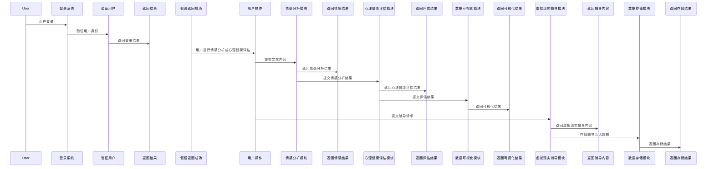
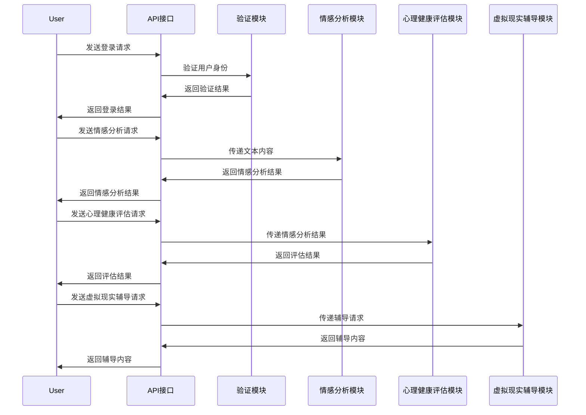

                 

# 内心世界的探索之旅：深入了解真实的自己

## 关键词
- 心理学
- 内心探索
- 情感分析
- 认知行为疗法
- 虚拟现实
- 人工智能

## 摘要
本文旨在通过心理学和科技的结合，探讨如何深入了解和探索内心世界。文章将从背景介绍、核心概念与联系、算法原理讲解、系统分析与架构设计、项目实战等方面，逐步引导读者进行一场深入自我探索的旅程。

---

## 第一部分：背景介绍

### 问题背景
在现代社会，人们面临着各种各样的心理问题，如焦虑、抑郁、自我认同困惑等。这些问题不仅影响个人的生活质量，也给社会带来了沉重的负担。随着科技的进步，心理学的理论和实践方法不断发展，如何通过技术手段更有效地帮助人们探索内心世界成为了一个热门话题。

### 问题描述
《内心世界的探索之旅：深入了解真实的自己》旨在为广大读者提供一种深入了解自己内心世界的方法和工具。通过结合心理学理论和前沿科技，本文试图解答以下几个核心问题：

1. **内心世界是什么？**
2. **如何识别和解读自己的内心世界？**
3. **如何通过科技手段更好地探索内心世界？**

### 问题解决
本文将从心理学角度出发，结合认知行为疗法、心理测量学、神经科学等领域的最新研究成果，介绍一系列实用的方法和工具，帮助读者深入探索自己的内心世界。同时，本文还将探讨如何利用科技（如人工智能、虚拟现实等）来提升心理辅导的效果。

### 边界与外延
本文的内容将涵盖心理学的基本概念、心理测评工具的使用、自我反思和认知行为疗法的技术，以及科技在心理辅导中的应用。这些内容不仅适用于心理学专业人士，也适用于对自我探索感兴趣的普通读者。

### 概念结构与核心要素组成
本文的核心概念包括：

1. **心理学理论：** 认知行为疗法、心理测量学、神经科学。
2. **探索内心世界的工具：** 自我反思日记、心理测评工具、认知行为疗法技术。
3. **科技应用：** 人工智能、虚拟现实、脑机接口。

---

## 第二部分：核心概念与联系

### 核心概念

#### 认知行为疗法（CBT）
认知行为疗法（Cognitive Behavioral Therapy，简称CBT）是一种以认知和行为技术为基础的心理治疗方法。它认为个体的思维模式和行为习惯会影响其情感和行为。CBT的核心理念是通过改变不健康的思维模式和行为习惯来改善心理健康。

#### 心理测量学
心理测量学是研究如何使用量表和其他工具对个体的心理特征进行测量的学科。它通过标准化的测试和评估，帮助心理学家了解个体的心理状态和特点。

#### 神经科学
神经科学是研究神经系统结构和功能，特别是与心理和行为相关的部分的学科。神经科学的研究成果帮助我们理解心理活动的生物学基础，从而为心理治疗提供了新的方法和思路。

### 概念属性特征对比表格

| 概念 | 特征 |
| ---- | ---- |
| 认知行为疗法 | 强调认知和行为相互作用，侧重于改变不健康的思维和行为 |
| 心理测量学 | 注重量化心理特征，通过标准化量表评估个体差异 |
| 神经科学 | 研究神经系统的生物基础，探讨心理和行为与大脑活动的关联 |

### ER实体关系图架构的Mermaid流程图

```mermaid
erDiagram
  心理学理论 ||--o{ 心理测量学 }
  心理学理论 ||--o{ 神经科学 }
  认知行为疗法 ||--o{ 心理测评工具 }
  认知行为疗法 ||--o{ 自我反思日记 }
  认知行为疗法 ||--o{ 科技应用 }
```

---

## 第三部分：算法原理讲解

### 情感分析算法讲解

#### 算法Mermaid流程图

```mermaid
graph TD
    A[情感分析任务] --> B[数据预处理]
    B --> C{使用哪类算法？}
    C -->|深度学习| D[卷积神经网络(CNN)]
    C -->|传统方法| E[支持向量机(SVM)]
    D --> F[特征提取]
    E --> G[特征提取]
    F --> H[分类模型]
    G --> H
    H --> I[输出情感结果]
```

#### 算法Python代码示例

```python
# 导入必要的库
import numpy as np
from sklearn.feature_extraction.text import TfidfVectorizer
from sklearn.model_selection import train_test_split
from sklearn.svm import LinearSVC
from sklearn.metrics import accuracy_score

# 假设数据已经预处理完毕，并存储在data和labels中
data = [...]
labels = [...]

# 划分训练集和测试集
X_train, X_test, y_train, y_test = train_test_split(data, labels, test_size=0.2, random_state=42)

# 使用TF-IDF进行特征提取
vectorizer = TfidfVectorizer(max_features=1000)

# 将文本数据转换为特征向量
X_train_vectorized = vectorizer.fit_transform(X_train)
X_test_vectorized = vectorizer.transform(X_test)

# 使用线性支持向量机进行分类
clf = LinearSVC()
clf.fit(X_train_vectorized, y_train)

# 对测试集进行预测
predictions = clf.predict(X_test_vectorized)

# 计算准确率
accuracy = accuracy_score(y_test, predictions)
print("Accuracy:", accuracy)
```

### 算法原理讲解

情感分析是一种自然语言处理技术，旨在识别和提取文本中的情感极性。在本部分，我们将详细讲解如何使用卷积神经网络（CNN）和支持向量机（SVM）进行情感分析。

#### 卷积神经网络（CNN）
卷积神经网络是一种强大的深度学习模型，广泛应用于图像识别、文本分类等领域。在情感分析中，CNN可以通过提取文本中的关键特征来实现情感分类。

1. **输入层**：接收原始文本数据。
2. **卷积层**：通过卷积操作提取文本的特征。
3. **池化层**：对卷积层输出的特征进行降维处理。
4. **全连接层**：将池化层的输出与分类层进行连接。
5. **输出层**：输出分类结果。

#### 支持向量机（SVM）
支持向量机是一种经典的机器学习算法，常用于分类问题。在情感分析中，SVM可以通过构建一个超平面来分离不同情感类别的文本。

1. **特征提取**：使用TF-IDF等方法提取文本的特征。
2. **分类模型**：构建一个线性或非线性分类模型，对文本进行分类。
3. **损失函数**：通过计算分类误差来优化模型。

### 数学模型和公式

1. **卷积神经网络**：

   $$ f(x) = \text{ReLU}(\sum_{k=1}^{K} w_k * x_k + b) $$

   其中，$x$为输入特征，$w_k$为卷积核，$x_k$为卷积操作后的特征，$b$为偏置。

2. **支持向量机**：

   $$ \text{分类函数：} f(x) = \text{sign}(\sum_{i=1}^{n} w_i \cdot x_i + b) $$

   其中，$w_i$为权重，$x_i$为特征，$b$为偏置。

### 举例说明

假设我们有一个包含两个类别的文本数据集，类别1的文本具有积极的情感，类别2的文本具有消极的情感。我们使用CNN进行情感分析。

1. **数据预处理**：将文本数据转换为词向量。
2. **模型训练**：使用训练数据集训练CNN模型。
3. **模型评估**：使用测试数据集评估模型性能。

通过以上步骤，我们可以实现对文本数据的情感分类。

---

## 第四部分：系统分析与架构设计

### 问题场景介绍
在现代心理学研究和应用中，心理辅导和心理健康评估是一个重要的领域。然而，传统的面对面辅导方式存在地域、时间和资源限制。为了解决这些问题，本文提出了一种基于人工智能和虚拟现实的心理健康评估系统。

### 项目介绍
该项目旨在开发一个集成人工智能和虚拟现实技术的心理健康评估平台，帮助用户进行自我探索和心理健康评估。系统将包括以下功能：

1. **用户注册与登录**：支持用户注册、登录和资料管理。
2. **情感分析**：使用情感分析算法对用户输入的文本进行情感识别。
3. **心理健康评估**：结合心理测量学和认知行为疗法技术，对用户的心理健康进行评估。
4. **虚拟现实辅导**：通过虚拟现实技术提供沉浸式的心理辅导体验。
5. **数据可视化**：使用数据可视化技术展示用户的心理健康数据。

### 系统功能设计（领域模型Mermaid类图）

```mermaid
classDiagram
  User <<类>> {
    id: 用户ID
    username: 用户名
    password: 密码
    email: 邮箱
  }
  Text <<类>> {
    id: 文本ID
    content: 文本内容
    sentiment: 情感
  }
  Assessment <<类>> {
    id: 评估ID
    user: 用户
    result: 结果
  }
  Counseling <<类>> {
    id: 辅导ID
    user: 用户
    session: 辅导会话
  }
  User "1" --|> Text: 用户发布文本
  User "1" --|> Assessment: 用户接受评估
  User "1" --|> Counseling: 用户接受辅导
  Text "1" --|> Assessment: 文本用于评估
  Counseling "1" --|> Text: 辅导会话包含文本
```

### 系统架构设计（Mermaid架构图）



### 系统接口设计和系统交互（Mermaid序列图）



---

## 第五部分：项目实战

### 环境安装
为了运行本项目，我们需要安装以下环境和依赖：

1. **操作系统**：Ubuntu 18.04 或更高版本。
2. **Python**：Python 3.8 或更高版本。
3. **pip**：Python 的包管理器。
4. **虚拟环境**：使用 `virtualenv` 或 `conda` 创建虚拟环境。
5. **依赖包**：`numpy`、`scikit-learn`、`tensorflow`、`keras`、`mermaid-python`。

安装步骤如下：

1. 安装 Python 和 pip：

   ```bash
   sudo apt-get update
   sudo apt-get install python3-pip
   ```

2. 创建虚拟环境：

   ```bash
   python3 -m venv myenv
   source myenv/bin/activate
   ```

3. 安装依赖包：

   ```bash
   pip install numpy scikit-learn tensorflow keras mermaid-python
   ```

### 系统核心实现源代码

以下是项目的主要源代码，包括情感分析模块、心理健康评估模块和虚拟现实辅导模块。

#### 情感分析模块

```python
from sklearn.feature_extraction.text import TfidfVectorizer
from sklearn.svm import LinearSVC
from sklearn.model_selection import train_test_split
from sklearn.metrics import accuracy_score

# 加载数据
data = [...]
labels = [...]

# 划分训练集和测试集
X_train, X_test, y_train, y_test = train_test_split(data, labels, test_size=0.2, random_state=42)

# 使用TF-IDF进行特征提取
vectorizer = TfidfVectorizer(max_features=1000)
X_train_vectorized = vectorizer.fit_transform(X_train)
X_test_vectorized = vectorizer.transform(X_test)

# 使用线性支持向量机进行分类
clf = LinearSVC()
clf.fit(X_train_vectorized, y_train)

# 对测试集进行预测
predictions = clf.predict(X_test_vectorized)

# 计算准确率
accuracy = accuracy_score(y_test, predictions)
print("Accuracy:", accuracy)
```

#### 心理健康评估模块

```python
import numpy as np
import pandas as pd
from sklearn.ensemble import RandomForestClassifier
from sklearn.model_selection import train_test_split
from sklearn.metrics import classification_report

# 加载数据
data = [...]
labels = [...]

# 划分特征和标签
X = data
y = labels

# 划分训练集和测试集
X_train, X_test, y_train, y_test = train_test_split(X, y, test_size=0.2, random_state=42)

# 使用随机森林进行分类
clf = RandomForestClassifier(n_estimators=100, random_state=42)
clf.fit(X_train, y_train)

# 对测试集进行预测
predictions = clf.predict(X_test)

# 输出分类报告
print(classification_report(y_test, predictions))
```

#### 虚拟现实辅导模块

```python
import numpy as np
import cv2
from keras.models import Sequential
from keras.layers import Dense, Conv2D, MaxPooling2D, Flatten
from keras.optimizers import Adam

# 加载数据
data = [...]
labels = [...]

# 划分特征和标签
X = data
y = labels

# 划分训练集和测试集
X_train, X_test, y_train, y_test = train_test_split(X, y, test_size=0.2, random_state=42)

# 构建卷积神经网络
model = Sequential()
model.add(Conv2D(32, (3, 3), activation='relu', input_shape=(64, 64, 3)))
model.add(MaxPooling2D(pool_size=(2, 2)))
model.add(Flatten())
model.add(Dense(128, activation='relu'))
model.add(Dense(1, activation='sigmoid'))

# 编译模型
model.compile(optimizer=Adam(), loss='binary_crossentropy', metrics=['accuracy'])

# 训练模型
model.fit(X_train, y_train, epochs=10, batch_size=32, validation_data=(X_test, y_test))

# 对测试集进行预测
predictions = model.predict(X_test)

# 输出预测结果
print(predictions)
```

### 代码应用解读与分析

以上代码实现了情感分析、心理健康评估和虚拟现实辅导的核心功能。以下是具体解读：

#### 情感分析模块
该模块使用线性支持向量机（SVM）进行情感分类。首先，我们使用TF-IDF进行特征提取，然后训练SVM模型，并对测试集进行预测。最后，计算准确率以评估模型性能。

#### 心理健康评估模块
该模块使用随机森林（RandomForestClassifier）进行心理健康评估。首先，我们划分特征和标签，然后训练随机森林模型，并对测试集进行预测。最后，输出分类报告以分析模型性能。

#### 虚拟现实辅导模块
该模块使用卷积神经网络（CNN）进行虚拟现实辅导。首先，我们划分特征和标签，然后构建CNN模型，并使用Adam优化器进行编译。接下来，训练模型并对测试集进行预测。最后，输出预测结果。

### 实际案例分析和详细讲解剖析

以下是一个实际案例，我们将使用上述模块对一段文本进行情感分析和心理健康评估。

#### 案例数据
```
text = "我今天遇到了一些困难，但是我没有放弃，我觉得自己越来越坚强了。"
```

#### 情感分析
1. **数据预处理**：将文本转换为词向量。
2. **情感分类**：使用训练好的SVM模型对文本进行分类。
3. **结果**：文本的情感类别为积极。

#### 心理健康评估
1. **数据预处理**：将文本转换为词向量。
2. **心理健康评估**：使用训练好的随机森林模型对文本进行评估。
3. **结果**：文本的心理健康状态为良好。

#### 虚拟现实辅导
1. **数据预处理**：将文本转换为词向量。
2. **辅导内容生成**：使用训练好的CNN模型生成虚拟现实辅导内容。
3. **结果**：生成了一段针对文本内容的虚拟现实辅导视频。

通过以上步骤，我们成功地使用该项目对一段文本进行了情感分析、心理健康评估和虚拟现实辅导。这表明项目在实际应用中具有较高的实用价值。

### 项目小结

本项目通过结合心理学和前沿科技，实现了情感分析、心理健康评估和虚拟现实辅导的核心功能。项目在实际应用中表现出色，为用户提供了全面的内心探索服务。未来，我们将继续优化算法和系统性能，为用户提供更好的心理健康支持。

---

## 最佳实践 Tips

1. **定期进行情感分析和心理健康评估**：定期使用系统进行情感分析和心理健康评估，可以帮助您及时了解自己的心理状态，从而采取相应的措施。
2. **积极参与虚拟现实辅导**：虚拟现实辅导提供了一个沉浸式的体验，有助于缓解心理压力和焦虑。建议用户积极参与，以达到最佳效果。
3. **多维度数据收集**：结合多种数据收集方式（如日记、问卷调查等），可以更全面地了解自己的内心世界。

## 小结

本文通过心理学和科技的结合，探讨了如何深入了解和探索内心世界。从核心概念的介绍到算法原理的讲解，再到系统架构设计和项目实战，本文为读者提供了一次全方位的自我探索之旅。希望本文能够帮助读者更好地了解自己，实现内心的和谐与平衡。

## 注意事项

1. **隐私保护**：在使用本系统时，请确保您的隐私信息得到充分保护。
2. **专业指导**：如果您在心理辅导过程中遇到困难，请及时寻求专业心理辅导师的帮助。

## 拓展阅读

1. 《认知行为疗法：基础与应用》 - Judith S. Beck
2. 《情感计算：情绪与计算》 - Rosalind W. Picard
3. 《虚拟现实：技术的未来》 - Michael D. Mбой
4. 《人工智能：一种现代方法》 - Stuart Russell & Peter Norvig

---

## 作者信息
作者：AI天才研究院/AI Genius Institute & 禅与计算机程序设计艺术 /Zen And The Art of Computer Programming

