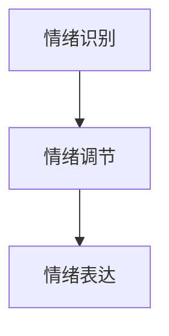

                 

## 引言

### 第1章：问题的背景与解决

在现代社会，我们面临着前所未有的心理压力和情感困扰。快节奏的生活、复杂的人际关系、不断变化的工作环境，以及不确定的未来，都在无形中侵蚀着我们的内心。越来越多的人被焦虑、抑郁、压力和孤独感所困扰，这些问题不仅影响了个人的心理健康，也对社会功能产生了负面影响。

#### 1.1 问题的背景

现代社会中，心理健康问题已经成为一个不容忽视的社会现象。根据世界卫生组织（WHO）的数据，全球约有3.5亿人患有抑郁症，而焦虑症的患者数量则超过3亿。这些心理疾病不仅影响个人的生活质量，还会导致生产力的下降和社会负担的加重。因此，探索解决心理健康问题的方法显得尤为重要。

#### 1.2 问题描述

心理健康问题主要表现在以下几个方面：

1. **焦虑和抑郁**：长期的心理压力会导致焦虑和抑郁，影响个体的情绪稳定和正常生活。
2. **人际关系紧张**：工作和生活中的人际关系复杂多变，处理不当会导致人际关系紧张，进一步加剧心理问题。
3. **睡眠和饮食障碍**：心理问题常常伴随着睡眠和饮食障碍，如失眠、食欲不振或过度进食。
4. **社交回避**：由于心理问题，很多人会回避社交活动，这进一步加剧了他们的孤独感和心理问题。

#### 1.3 问题解决

要解决这些问题，我们需要从多个方面入手，包括情感管理、自我认知、人际关系处理以及心理咨询等。情感管理可以帮助我们更好地识别和调节情绪，自我认知则是建立积极自我形象的基础，而良好的人际关系则是我们精神支持的重要来源。此外，心理咨询可以提供专业的指导和治疗，帮助我们走出心理困境。

#### 1.4 边界与外延

内心治愈的范畴涵盖了情感、心理、行为等方面，它不仅仅是指情绪的调节，更包括自我认知的提升、人际关系的改善以及生活习惯的调整。在这个概念下，心理健康问题的解决不仅仅是消除负面情绪，还包括提高生活质量、增强心理韧性和提升整体幸福感。

#### 1.5 核心概念

在探讨内心治愈的过程中，以下几个核心概念至关重要：

- **内心治愈**：通过一系列的方法和技巧，帮助个体恢复心理平衡，提升心理健康水平。
- **精神家园**：指个体内心的安全感、归属感和满足感，是心理健康的重要保障。
- **心理重建**：指通过一系列的心理治疗和自我调节方法，恢复和提升个体的心理功能。

#### 1.6 概念结构与核心要素

内心治愈的过程可以分为以下几个核心要素：

1. **情感管理**：包括情绪识别、情绪调节和情绪表达，帮助我们更好地控制情绪，减少负面情绪的影响。
2. **自我认知**：通过自我反思和积极的心态，建立和提升自我认同，增强自信心。
3. **人际关系**：通过改善沟通、建立支持网络，增强人际关系的质量，提供情感支持。
4. **生活习惯**：通过调整睡眠、饮食和运动习惯，提升身体健康，从而促进心理健康。
5. **心理咨询**：通过专业的心理治疗，解决深层次的心理问题，提供个性化的心理支持。

总的来说，内心治愈是一个多维度的过程，需要我们综合运用各种方法和技巧，逐步改善心理健康。在接下来的章节中，我们将详细探讨这些方法和技巧，帮助大家重建精神家园。

### 第2章：内心治愈的原理与方法

#### 2.1 核心概念与联系

内心治愈是一个复杂的过程，涉及到多个核心概念的相互联系和相互作用。以下是对这些核心概念及其相互关系的详细探讨。

##### 2.1.1 情感管理

情感管理是内心治愈的基础。它包括情绪识别、情绪调节和情绪表达三个方面。情绪识别是指通过自我观察和反思，识别和理解自己的情绪状态。情绪调节是指通过一系列的方法和技巧，如正念练习、冥想和认知行为疗法，调整和管理情绪，减少负面情绪的影响。情绪表达则是指通过适当的渠道和方式，表达自己的情绪，避免情绪积累和压抑。

**原理与联系**：情绪管理不仅影响个体的情绪状态，还与自我认知、人际关系和生活习惯密切相关。良好的情绪管理有助于提升自我认同，改善人际关系，以及促进整体的心理健康。

##### 2.1.2 自我认知

自我认知是指个体对自己的理解、认知和评价。它包括自我认同、自我价值和自我效能感等组成部分。自我认同是指个体对自我身份的认同和接受，自我价值是指个体对自身价值的认识，自我效能感则是指个体对自己能力的信心。

**原理与联系**：自我认知是内心治愈的核心，它直接影响个体的情感管理、人际关系和生活习惯。积极的自我认知有助于提升自信心，改善情感管理，增强心理韧性，从而促进整体的心理健康。

##### 2.1.3 人际关系

人际关系是指个体在社会交往过程中建立的关系，包括家庭关系、朋友关系和同事关系等。良好的人际关系可以为个体提供情感支持，促进心理平衡。

**原理与联系**：人际关系对内心治愈有着重要影响。通过改善沟通、建立支持网络和解决冲突，可以提升个体的心理健康水平。良好的人际关系有助于缓解压力，增强幸福感，从而促进内心治愈。

##### 2.1.4 睡眠与饮食

睡眠和饮食是保持身心健康的基础。良好的睡眠有助于恢复体力和心理能量，而健康的饮食习惯则有助于维持身体和大脑的正常功能。

**原理与联系**：睡眠和饮食与情感管理、自我认知和人际关系密切相关。良好的睡眠和饮食习惯有助于提升情绪状态，增强自我认知，改善人际关系，从而促进内心治愈。

##### 2.1.5 心理咨询

心理咨询是专业心理治疗的重要组成部分。它包括个体咨询、团体咨询和心理咨询等不同形式，通过专业的心理治疗师，为个体提供个性化的心理支持和治疗。

**原理与联系**：心理咨询在内心治愈中起着关键作用。它可以帮助个体解决深层次的心理问题，提供情感支持和指导，从而促进心理重建和内心治愈。

#### 2.2 原理讲解与对比

##### 2.2.1 情感管理原理

情感管理是一个系统化的过程，包括以下几个步骤：

1. **情绪识别**：通过自我观察和反思，识别和理解自己的情绪状态。
2. **情绪调节**：通过正念练习、冥想和认知行为疗法等技巧，调节和管理情绪，减少负面情绪的影响。
3. **情绪表达**：通过适当的渠道和方式，表达自己的情绪，避免情绪积累和压抑。

**原理讲解**：

- **情绪识别**：情绪识别是情感管理的第一步。通过自我观察和反思，个体可以识别出自己正在经历的情绪，如焦虑、愤怒、悲伤等。这有助于个体理解自己的情绪状态，从而更好地应对情绪。
  
- **情绪调节**：情绪调节是通过一系列技巧和方法来调整和管理情绪。例如，正念练习可以帮助个体专注于当下，减少焦虑和压力；冥想则有助于个体平静心情，提升情绪稳定性；认知行为疗法可以帮助个体改变负面思维模式，从而减少负面情绪的影响。

- **情绪表达**：情绪表达是情感管理的最后一步。通过适当的渠道和方式，个体可以表达自己的情绪，避免情绪积累和压抑。有效的情绪表达有助于个体与他人建立更好的关系，减少冲突和误解。

**对比表格**：

| 方法                | 特点                                       | 作用                                       |
|---------------------|--------------------------------------------|--------------------------------------------|
| 情绪识别            | 自我观察和反思                             | 识别和理解情绪状态                         |
| 情绪调节            | 正念练习、冥想、认知行为疗法               | 调整和管理情绪，减少负面情绪的影响           |
| 情绪表达            | 适当的渠道和方式                           | 避免情绪积累和压抑，改善人际关系             |

**Mermaid流程图**：



##### 2.2.2 自我认知特点对比表

| 自我认知方法       | 特点                                       | 适用人群                                       |
|--------------------|--------------------------------------------|--------------------------------------------|
| 自我接纳            | 接受自己的优点和缺点，不进行自我批评         | 需要提升自尊和自我价值感的人群                 |
| 自我反思            | 反思自己的行为和思维模式，寻找改进的方法     | 希望提升自我意识和自我控制能力的人群           |
| 自我提升            | 通过学习和实践，提升自己的能力和知识         | 希望实现自我成长和提升自我价值感的人群           |

**ER图**：

```mermaid
erDiagram
  人 ->|创建| 自我认知
  人 ->|拥有| 自我接纳
  人 ->|实践| 自我提升
  人 ->|反思| 自我反思
```

##### 2.2.3 人际关系ER图

```mermaid
erDiagram
  人 A(CHIEF) --|provides|> 关系1
  人 B --|provides|> 关系1
  人 A --|receives|< 关系2
  人 B --|receives|< 关系2
```

通过以上对情感管理、自我认知、人际关系、睡眠与饮食、心理咨询等核心概念的讲解和对比，我们可以更好地理解内心治愈的原理和方法。在接下来的章节中，我们将进一步探讨这些方法在实际生活中的应用和效果。

### 第3章：日常生活中的治愈方法

#### 3.1 情感疏导技巧

在日常生活中，我们经常会遇到各种情感困扰，如焦虑、抑郁、愤怒等。这些负面情绪如果不及时疏导，可能会对我们的身心健康造成长期的负面影响。因此，掌握一些情感疏导技巧至关重要。以下是一些常见的情感疏导方法：

##### 3.1.1 情绪识别

情绪识别是情感疏导的第一步。只有当我们能够准确地识别和理解自己的情绪时，才能有效地进行情绪疏导。以下是一些情绪识别的方法：

- **自我观察**：通过自我反思，观察自己的情绪变化，如紧张、焦虑、烦躁等。
- **情绪日记**：记录每天的情绪变化，帮助自己更好地理解情绪的来源和规律。
- **情绪标签**：为不同的情绪贴上标签，如焦虑、愤怒、悲伤等，以便于识别和管理。

##### 3.1.2 情绪调节

情绪调节是情感疏导的关键。以下是一些常见的情绪调节方法：

- **正念练习**：通过专注当下的练习，如冥想、深呼吸等，减少焦虑和压力。
- **认知重构**：通过改变负面思维模式，如自我批评、过度担忧等，来调节情绪。
- **情绪释放**：通过运动、写日记、绘画等方式，将情绪释放出来，减轻心理负担。

##### 3.1.3 情绪表达

情绪表达是情感疏导的最后一步。正确地表达情绪，有助于我们与他人建立良好的关系，减少冲突和误解。以下是一些情绪表达的方法：

- **诚实表达**：直接而真诚地表达自己的情绪，如“我感到很生气”或“我感到很担心”。
- **非暴力沟通**：通过倾听他人、表达感受和需求，进行有效的沟通，避免冲突和误解。
- **情绪角色扮演**：通过角色扮演，练习如何表达情绪，提高情绪表达能力。

#### 3.2 心理建设方法

心理建设是内心治愈的重要组成部分。以下是一些常见的心理建设方法：

##### 3.2.1 建立自我认同

建立自我认同是心理建设的基础。以下是一些建立自我认同的方法：

- **自我接纳**：接受自己的优点和缺点，不进行自我批评，提升自尊和自我价值感。
- **自我反思**：通过反思自己的行为和思维模式，寻找改进的方法，提升自我意识和自我控制能力。
- **自我肯定**：通过积极的自我暗示，如“我可以做到”或“我是有价值的”，增强自信心。

##### 3.2.2 自我提升策略

自我提升是心理建设的关键。以下是一些自我提升的方法：

- **终身学习**：通过学习新知识、新技能，不断提升自己的能力和知识水平。
- **兴趣爱好**：培养兴趣爱好，丰富自己的生活，提升生活满意度。
- **自我挑战**：通过设定目标，挑战自我，提升自我效能感。

#### 3.3 人际关系处理

良好的人际关系对内心治愈至关重要。以下是一些处理人际关系的方法：

##### 3.3.1 改善沟通

改善沟通是处理人际关系的关键。以下是一些改善沟通的方法：

- **倾听**：倾听他人，了解他们的需求和感受，避免误解和冲突。
- **表达**：清晰、真诚地表达自己的意见和感受，避免误解和冲突。
- **共情**：站在对方的角度思考问题，理解他们的感受，建立信任和共鸣。

##### 3.3.2 建立支持网络

建立支持网络是处理人际关系的重要一环。以下是一些建立支持网络的方法：

- **家人和朋友**：与家人和朋友保持联系，分享自己的喜怒哀乐，获得情感支持。
- **社交活动**：参加社交活动，拓展人际关系，增加社交支持。
- **专业咨询**：寻求专业心理咨询，获得专业的指导和帮助。

通过以上情感疏导技巧、心理建设方法和人际关系处理方法，我们可以更好地管理自己的情绪，提升自我认同，改善人际关系，从而促进内心治愈。在日常生活中，我们应积极运用这些方法，重建自己的精神家园。

### 第4章：心理咨询与治疗

#### 4.1 心理咨询介绍

心理咨询是一种专业的心理服务，通过咨询师的指导和帮助，帮助个体解决心理问题、提升心理健康水平。以下是对心理咨询的详细介绍：

##### 4.1.1 心理咨询师的角色与职责

心理咨询师是专业的心理服务提供者，他们的主要职责包括：

- **诊断与评估**：通过面谈、问卷调查等方式，评估个体的心理状况，确定问题的性质和严重程度。
- **心理治疗**：根据个体的需求，提供各种心理治疗方法，如认知行为疗法、心理动力疗法、家庭治疗等。
- **心理辅导**：提供情感支持、职业咨询、人际关系辅导等，帮助个体应对生活中的压力和挑战。
- **教育培训**：为有需要的人群提供心理健康教育，提高公众的心理健康意识。

##### 4.1.2 心理咨询的过程与方法

心理咨询通常包括以下几个过程和方法：

- **初次咨询**：心理咨询师与个体进行初次面谈，了解个体的问题、背景和需求，建立信任关系。
- **心理评估**：通过面谈、问卷、心理测试等方式，对个体的心理状况进行全面评估。
- **心理治疗**：根据评估结果，制定个性化的心理治疗计划，实施心理治疗。
- **跟进与反馈**：在治疗过程中，心理咨询师会定期与个体进行跟进，了解治疗效果，调整治疗计划。
- **结束咨询**：在治疗结束时，心理咨询师会与个体进行总结和反馈，帮助个体巩固治疗效果。

#### 4.2 心理治疗技术

心理治疗是心理咨询的重要组成部分，通过一系列的方法和技巧，帮助个体解决心理问题，提升心理健康水平。以下介绍几种常见的心理治疗技术：

##### 4.2.1 认知行为疗法

认知行为疗法（Cognitive Behavioral Therapy, CBT）是一种广泛应用于临床的心理治疗方法。它主要针对个体的认知和行为问题，通过改变不合理的思维模式和行为模式，来改善心理健康。

**原理与特点**：

- **认知重建**：通过识别和改变不合理的思维模式，如过度概括、黑白思维等，帮助个体建立合理的思维模式。
- **行为矫正**：通过改变个体的行为模式，如逃避行为、过度消费等，帮助个体改善行为问题。

**应用场景**：认知行为疗法广泛应用于焦虑症、抑郁症、强迫症等心理疾病的治疗，效果显著。

##### 4.2.2 焦点解决短期治疗

焦点解决短期治疗（Solution-Focused Brief Therapy, SFBT）是一种以解决问题为导向的短期心理治疗。它强调个体自身的资源和对未来的期待，通过探讨和设定目标，帮助个体找到解决问题的方法。

**原理与特点**：

- **目标导向**：将焦点放在个体的目标上，而不是问题本身，帮助个体设定和实现目标。
- **资源取向**：关注个体的资源，而不是问题，帮助个体发现和利用自己的优势。

**应用场景**：焦点解决短期治疗适用于各种心理问题，尤其是需要快速解决问题的场景。

#### 4.3 案例分析

以下是对两个实际案例的分析，以展示心理咨询和心理治疗的效果：

##### 4.3.1 案例一：情感困扰的治愈过程

**案例描述**：小李，25岁，女性，因工作压力和人际关系问题导致严重焦虑和抑郁。她来到心理咨询中心寻求帮助。

**治疗过程**：

1. **初次咨询**：心理咨询师与小李进行初次面谈，了解她的问题和需求，建立信任关系。
2. **心理评估**：通过面谈和问卷，评估小李的心理状况，确定她的焦虑和抑郁程度。
3. **认知行为疗法**：心理咨询师采用认知行为疗法，帮助小李识别和改变不合理的思维模式，如过度概括和黑白思维。
4. **行为矫正**：心理咨询师与小李一起制定行为矫正计划，如减少工作压力、改善人际关系等。
5. **跟进与反馈**：心理咨询师定期跟进小李的治疗进展，调整治疗计划，提供情感支持。
6. **结束咨询**：在治疗结束时，小李的焦虑和抑郁症状明显减轻，生活质量显著提升。

**治疗效果**：经过一段时间的治疗，小李的焦虑和抑郁症状得到明显缓解，她的工作和人际关系也得到改善，生活质量显著提升。

##### 4.3.2 案例二：自我认同重建

**案例描述**：小张，30岁，男性，因长期自我否定和自卑感导致心理健康问题。他来到心理咨询中心寻求帮助。

**治疗过程**：

1. **初次咨询**：心理咨询师与小张进行初次面谈，了解他的问题和需求，建立信任关系。
2. **心理评估**：通过面谈和问卷，评估小张的心理状况，确定他的自我认同问题。
3. **自我接纳与自我提升**：心理咨询师采用自我接纳和自我提升的方法，帮助小张接受自己的优点和缺点，建立积极的自我认同。
4. **目标设定**：心理咨询师与小张一起设定短期和长期目标，如提升职业能力、建立健康的人际关系等。
5. **跟进与反馈**：心理咨询师定期跟进小张的治疗进展，调整治疗计划，提供情感支持。
6. **结束咨询**：在治疗结束时，小张的自我认同问题得到明显改善，他的自信心和生活满意度显著提升。

**治疗效果**：经过一段时间的治疗，小张的自我认同问题得到明显改善，他的自信心和生活满意度显著提升，心理健康状况得到显著改善。

通过以上案例分析，我们可以看到心理咨询和心理治疗在解决心理健康问题中的重要作用。心理咨询师通过专业的治疗方法和个性化的指导，帮助个体走出心理困境，重建心理健康。在未来的生活中，我们应积极寻求心理咨询的帮助，提升心理健康水平。

### 第5章：精神健康的维护与促进

#### 5.1 精神健康评估

精神健康的评估是维护和促进心理健康的重要步骤。通过科学的评估方法，我们可以了解自己的心理健康状态，从而采取有效的预防和干预措施。以下介绍几种常用的精神健康评估方法和工具。

##### 5.1.1 自我评估工具

自我评估工具是一种简便易行的方法，可以帮助个体初步了解自己的心理健康状况。以下是一些常见的自我评估工具：

- **心理健康自评量表（PHQ-9）**：PHQ-9是一种用于评估抑郁症的自评量表，包括9个问题，每个问题有4个选项，分数越高，抑郁症状越严重。
- **一般心理健康问卷（GHQ）**：GHQ是一种广泛使用的心理健康筛查工具，涵盖健康、家庭、工作和人际关系等多个方面，通过回答问题来判断个体的心理健康状态。
- **焦虑自评量表（GAD-7）**：GAD-7是一种用于评估焦虑症状的自评量表，包括7个问题，每个问题有4个选项，分数越高，焦虑症状越严重。

##### 5.1.2 专业评估方法

专业评估方法通常由专业的心理咨询师或临床心理医生进行，通过面对面的访谈和心理测试，更全面、深入地了解个体的心理健康状况。以下是一些常见的专业评估方法：

- **结构式临床面试（SCID）**：SCID是一种标准化的心理评估工具，用于评估个体的精神健康状况，包括诊断、症状、病程等多个方面。
- **心理测试**：如明尼苏达多项人格测验（MMPI）、艾森克人格问卷（EPQ）等，通过测试个体的人格特征、心理健康状况等，为心理治疗提供依据。
- **心理评估报告**：心理咨询师或临床心理医生根据评估结果，撰写心理评估报告，包括个体的心理健康状况、诊断、建议等，为后续的心理治疗和干预提供指导。

#### 5.2 预防措施

预防是维护精神健康的重要策略。通过采取一系列的预防措施，我们可以降低精神疾病的风险，提高心理健康水平。以下介绍几种有效的预防措施：

##### 5.2.1 压力管理

压力是影响心理健康的重要因素。通过有效的压力管理，我们可以减轻心理负担，提高心理健康水平。以下是一些有效的压力管理技巧：

- **时间管理**：合理安排时间，避免过度工作和加班，确保有足够的休息和放松时间。
- **情绪调节**：学习情绪调节技巧，如正念练习、冥想和放松训练，帮助自己更好地应对压力。
- **健康生活方式**：保持健康的饮食习惯、充足的睡眠和适量的运动，提高身体和心理的抵抗力。
- **寻求支持**：与家人、朋友或专业人士交流，分享自己的压力和困扰，获得情感支持和建议。

##### 5.2.2 应对危机

在精神危机时，采取有效的应对措施可以减轻危机的影响，保护心理健康。以下是一些应对危机的措施：

- **保持冷静**：在危机发生时，保持冷静，避免做出冲动行为。
- **求助**：及时向家人、朋友或专业人士求助，获得支持和帮助。
- **危机干预**：在危机情况下，寻求专业的危机干预服务，如心理援助热线、心理咨询中心等。
- **自我保护**：在危机中，确保自己的安全和基本需求，避免危险环境和行为。

#### 5.3 促进精神健康的活动

除了日常的预防措施和危机应对，参加一些促进精神健康的活动也有助于提升心理健康水平。以下介绍几种有效的促进精神健康的活动：

##### 5.3.1 心理健康日

心理健康日是一种普及心理健康知识和提高公众心理健康意识的活动。通过举办心理健康讲座、心理测试、心理沙龙等活动，增强人们对心理健康的认识和关注。以下是一些心理健康日的活动形式：

- **心理健康讲座**：邀请心理健康专家或心理咨询师，分享心理健康知识，提供心理咨询服务。
- **心理测试**：提供各种心理测试，帮助个体了解自己的心理健康状况。
- **心理沙龙**：组织心理健康沙龙，促进人们之间的交流和分享，提高心理健康水平。

##### 5.3.2 社区支持计划

社区支持计划是一种通过社区资源，为个体提供心理健康支持和帮助的计划。以下是一些社区支持计划的形式：

- **心理健康服务**：为社区居民提供心理健康服务，如心理咨询、心理治疗等。
- **健康讲座**：定期举办心理健康讲座，提高社区居民的心理健康意识。
- **互助小组**：组织心理健康互助小组，为有相同困扰的个体提供支持和帮助。
- **社会支持网络**：建立社区支持网络，为个体提供情感支持和互助平台。

通过以上措施和活动，我们可以有效地维护和促进精神健康，提升生活质量。在日常生活中，我们应积极采取预防措施，应对危机，并参加促进精神健康的活动，为自己和家人的心理健康保驾护航。

### 结语

#### 6.1 心灵的力量

内心治愈的力量不容忽视，它不仅能够帮助我们缓解情绪困扰，提升心理健康，还能在更深的层次上促进个人成长和幸福感的提升。通过情感管理、自我认知、人际关系处理和心理建设，我们能够逐步重建自己的精神家园，重拾内心的平静和力量。

**内心治愈的实际效果**：

- **情绪调节**：通过有效的情绪管理技巧，如正念和认知重构，我们能够更好地控制情绪，减少焦虑、抑郁和愤怒等负面情绪的影响。
- **自我认知提升**：建立积极的自我认知，接纳自己的优点和缺点，有助于增强自信心和自尊心，从而在面对挑战时更加坚定和有力。
- **人际关系改善**：通过改善沟通和建立支持网络，我们能够建立更健康、更紧密的人际关系，获得更多的情感支持和理解。
- **整体生活质量提升**：心理健康水平的提升直接影响到我们的生活质量，包括工作表现、人际关系和日常生活，从而提高整体幸福感。

**精神健康的长期影响**：

精神健康不仅影响个体的当下生活，还对其长期发展有着深远的影响。心理健康良好的人通常具有更高的心理韧性、更强的适应能力和更高的生活质量。他们在面对挑战和困难时能够更加从容应对，保持积极的心态，从而在职业生涯和个人生活中取得更好的成就。

**未来展望**：

随着社会的进步和人们对心理健康重视程度的提升，未来内心治愈将会有更多的发展和创新。以下是一些可能的趋势和方向：

- **心理健康的科技应用**：人工智能和大数据分析在心理健康领域的应用将越来越广泛，为个体提供更精准、更个性化的心理支持和治疗。
- **社会支持体系的完善**：社会对心理健康的关注和支持将进一步提升，社区心理健康服务、在线心理咨询和心理健康教育将得到更多的资源投入和推广。
- **跨学科研究**：心理学、神经科学、医学等多个学科将进行更深入的合作，共同探索精神健康的本质和治疗方法，推动心理健康科学的进步。

**展望未来，内心治愈将成为每个人生活的重要组成部分。通过科学的方法和持续的努力，我们每个人都能够拥有更加健康、充实和幸福的心灵生活。**

### 拓展阅读

为了更深入地了解内心治愈的相关知识和方法，以下推荐几本必读著作和一些有用的学术资源：

#### 必读著作：

1. **《正面管教》** - 简·尼尔森（Jane Nelsen）
   - 内容：提供了一种既不惩罚也不娇纵的管教方法，通过理解和尊重孩子，帮助孩子建立自我控制力和责任感。
   - 推荐理由：对于家长和教育工作者的情感管理和育儿指导有着重要意义。

2. **《情绪勒索》** - 苏珊·福沃德（Susan Forward）
   - 内容：探讨情感勒索的行为模式及其影响，并提供了解决策略。
   - 推荐理由：帮助读者识别和处理情感勒索行为，提升情绪管理能力。

3. **《正念：一场精神革命》** - 乔·卡巴金（Jon Kabat-Zinn）
   - 内容：介绍正念练习的原理和实践方法，帮助读者通过冥想和专注提升心理健康。
   - 推荐理由：正念练习是情感管理和心理健康的重要工具，本书提供了系统的指导。

4. **《自我认知的力量》** - 丹尼尔·戈尔曼（Daniel Goleman）
   - 内容：探讨情感智能的重要性和如何通过自我认知提升情感智能。
   - 推荐理由：自我认知是内心治愈的核心，本书提供了丰富的理论和实践指导。

5. **《人际关系心理学》** - 埃里希·弗洛姆（Erich Fromm）
   - 内容：探讨人际关系的基本原则和如何在人际关系中建立健康的互动。
   - 推荐理由：人际关系对心理健康有重要影响，本书提供了深刻的分析和实用的建议。

#### 学术资源：

1. **《心理科学进展》** - 中国心理学会
   - 内容：发布最新的心理学研究成果和前沿动态。
   - 推荐理由：了解心理学领域的最新研究动态和进展，对深入理解内心治愈有重要帮助。

2. **《国际心理科学期刊》** - International Journal of Psychology
   - 内容：涵盖广泛的心理学研究领域，包括情感、认知、社会心理学等。
   - 推荐理由：获取国际心理学研究的权威资料，提高对心理健康的认知。

3. **《健康心理学期刊》** - Journal of Health Psychology
   - 内容：关注心理健康与身体健康的关系，探讨心理健康干预方法。
   - 推荐理由：了解心理健康对身体健康的影响以及如何通过心理健康干预提升生活质量。

通过阅读这些书籍和参考相关学术资源，我们可以更深入地了解内心治愈的原理和方法，为自己的心理健康提供有效的指导和支持。

