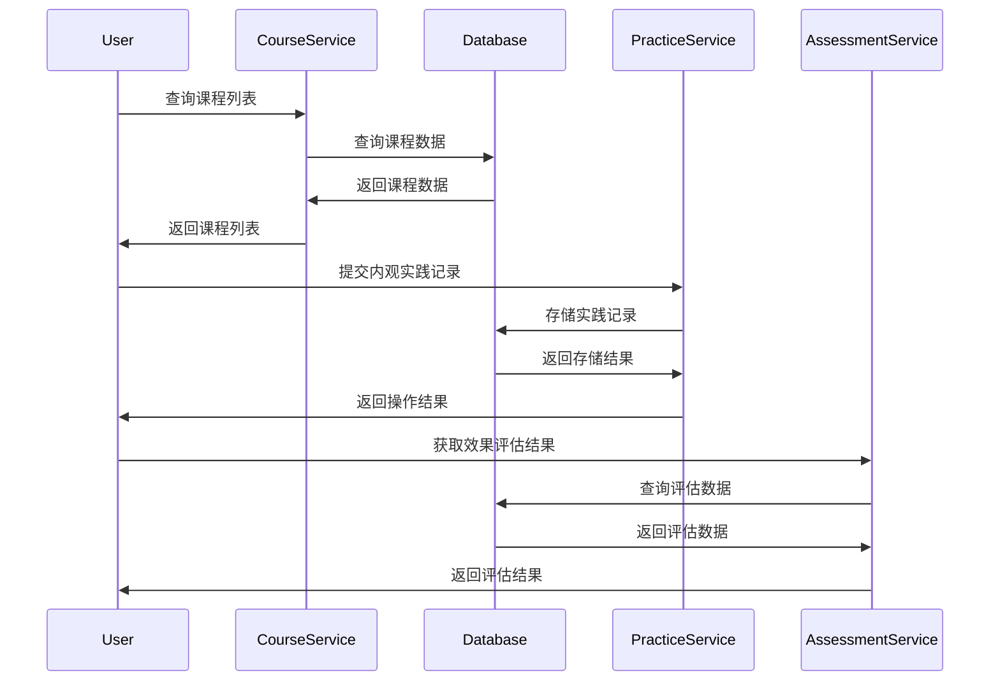

                 

### 冥想与内观：向内探索的意义之旅

> 关键词：冥想、内观、心理学、神经科学、情绪调节、自我认识

> 摘要：本文深入探讨冥想与内观的概念、原理和实践，通过逻辑清晰的分析和通俗易懂的讲解，帮助读者理解冥想与内观的本质，掌握实践方法，提升自我认识和情绪调节能力。

----------------------------------------------------------------

### 目录

1. **背景介绍**
   - **1.1 问题背景**
   - **1.2 问题描述**
   - **1.3 问题解决**
   - **1.4 边界与外延**
   - **1.5 概念结构与核心要素组成**

2. **核心概念与联系**
   - **2.1 核心概念与联系**
   - **2.2 冥想与内观的定义与区别**
   - **2.3 冥想与内观的基本原理**
   - **2.4 冥想与内观的核心要素**

3. **算法原理讲解**
   - **3.1 冥想与内观的实践方法**
   - **3.2 冥想与内观的科学原理**
   - **3.3 冥想与内观的效果评估**

4. **数学模型和数学公式**
   - **4.1 冥想与内观的数学模型**
   - **4.2 数学公式与详细讲解**

5. **系统分析与架构设计**
   - **5.1 冥想与内观系统概述**
   - **5.2 系统功能设计**
   - **5.3 系统架构设计**

6. **项目实战**
   - **6.1 环境安装**
   - **6.2 系统核心实现源代码**
   - **6.3 代码应用解读与分析**
   - **6.4 实际案例分析与详细讲解剖析**
   - **6.5 项目小结**

7. **最佳实践 tips**
8. **小结**
9. **注意事项**
10. **拓展阅读**

----------------------------------------------------------------

### 背景介绍

#### 1.1 问题背景

在现代社会，人们面临着来自生活、工作和社交等方面的巨大压力。随着心理健康问题的日益突出，许多人开始寻求缓解压力的方法。冥想与内观作为一种古老的心灵修炼方式，逐渐受到了现代人的青睐。它们不仅被认为有助于放松身心，还能提升自我认识和情绪调节能力。

#### 1.2 问题描述

尽管冥想与内观具有诸多益处，但很多人在实践过程中感到困惑和无从下手。缺乏系统的指导和方法，使得许多人无法持续进行冥想与内观练习。因此，如何设计一个既全面又易于实践的系统，以帮助人们更好地理解和实践冥想与内观，成为一个亟待解决的问题。

#### 1.3 问题解决

本书旨在为广大冥想与内观初学者提供一套系统、全面的指导。通过深入探讨冥想与内观的理论基础、实践方法以及相关科学研究，帮助读者建立起对冥想与内观的基本理解，并指导他们进行实际操作。

#### 1.4 边界与外延

冥想与内观并非孤立的概念，它们与现代心理学、神经科学、佛教哲学等学科有着紧密的联系。本书将探讨这些学科之间的交叉点，帮助读者从多个角度理解冥想与内观。

#### 1.5 概念结构与核心要素组成

冥想与内观的核心概念包括冥想、内观、自我认识、心理调节等。这些概念相互联系，共同构成了冥想与内观的完整体系。

----------------------------------------------------------------

### 核心概念与联系

#### 2.1 核心概念与联系

冥想与内观是两种不同的心灵修炼方式，但它们有许多共同之处。在探讨核心概念之前，我们先来了解这两个概念的定义和区别。

#### 2.2 冥想与内观的定义与区别

**冥想**（Meditation）通常指的是通过专注、放松或正念等手段来达到心理平静和精神集中的过程。它强调的是在意识层面上对思维的引导和调整。

**内观**（Vipassana）则是一种特定的冥想形式，强调通过深入观察和体验身体的感受、思维和情绪来获得洞察和解脱。内观的核心在于观察和体验，而不是简单的思维控制。

#### 2.3 冥想与内观的基本原理

冥想与内观都基于对“当下”的专注和观察。通过不断地练习，可以提升自我意识，减少烦恼和焦虑，增强情绪调节能力。冥想与内观的基本原理包括以下几个方面：

1. **正念**：正念是一种专注当下的意识状态，它要求我们在任何时刻都保持清醒和专注。
2. **专注**：专注是指将注意力集中在某个对象或任务上，从而减少思维的干扰。
3. **觉知**：觉知是指对内在体验和外在环境的清醒认识，它有助于我们更好地理解自己和周围的世界。
4. **观察**：观察是指通过观察和体验来认识和理解自己的身体、思维和情绪。

#### 2.4 冥想与内观的核心要素

冥想与内观的核心要素包括专注、正念、觉知和观察。这些要素相互配合，共同构成了冥想与内观的实践基础。

- **专注**：通过专注，我们可以将注意力集中在某个对象或任务上，从而减少思维的干扰，达到内心的平静。
- **正念**：正念是一种专注当下的意识状态，它要求我们在任何时刻都保持清醒和专注。
- **觉知**：觉知是指对内在体验和外在环境的清醒认识，它有助于我们更好地理解自己和周围的世界。
- **观察**：观察是指通过观察和体验来认识和理解自己的身体、思维和情绪。

通过理解冥想与内观的基本原理和核心要素，我们可以更好地实践这两种心灵修炼方式，从而提升自我认识和情绪调节能力。

----------------------------------------------------------------

### 算法原理讲解

#### 3.1 冥想与内观的实践方法

冥想与内观的实践方法多种多样，包括坐姿冥想、行走冥想、正念呼吸等。每种方法都有其独特的特点和适用场景。

- **坐姿冥想**：坐姿冥想是最常见的冥想形式之一。通过选择一个安静的环境，采取舒适的坐姿，专注于呼吸或某个对象，以达到内心的平静。
- **行走冥想**：行走冥想强调在行走的过程中保持正念，专注于每一步的触地、抬脚和迈步。这种冥想形式适合那些不喜欢长时间静坐的人。
- **正念呼吸**：正念呼吸是通过专注于呼吸来达到冥想的目的。通过深呼吸，感受空气进出身体，将注意力集中在呼吸上，以达到放松和减压的效果。

#### 3.2 冥想与内观的科学原理

冥想与内观的科学原理涉及到神经科学、心理学和认知科学等领域。通过这些领域的深入研究，我们可以更好地理解冥想与内观的作用机制。

- **神经科学**：研究表明，冥想可以改变大脑的结构和功能。长期冥想可以增强大脑灰质的密度，提高大脑的可塑性，从而改善情绪调节能力和注意力。
- **心理学**：冥想被认为是一种有效的心理治疗工具，可以帮助减轻焦虑、抑郁和压力。通过冥想，个体可以更好地了解自己的情绪，提高情绪调节能力。
- **认知科学**：冥想可以改善注意力和记忆力，提高认知功能。通过冥想，个体可以减少认知干扰，提高专注力和工作效率。

#### 3.3 冥想与内观的效果评估

冥想与内观的效果评估主要通过心理测量工具和神经成像技术进行。这些工具和技术的应用，有助于我们更准确地评估冥想与内观对个体身心健康的影响。

- **心理测量工具**：常用的心理测量工具包括焦虑自评量表、抑郁自评量表和情绪调节问卷等。这些工具可以帮助我们评估冥想与内观对情绪调节和心理健康的改善效果。
- **神经成像技术**：神经成像技术如功能性磁共振成像（fMRI）和脑电图（EEG）可以直观地显示冥想与内观对大脑结构和功能的影响。

通过实践、科学原理和效果评估的结合，我们可以更全面地理解冥想与内观的本质，从而更好地应用它们来提升自我认识和情绪调节能力。

----------------------------------------------------------------

### 数学模型和数学公式

#### 4.1 冥想与内观的数学模型

冥想与内观的数学模型主要涉及心理学中的情绪调节模型和行为改变模型。这些模型可以帮助我们理解冥想与内观如何影响个体的情绪和行为。

**情绪调节模型**：

情绪调节模型可以表示为：
$$
\text{情绪调节能力} = f(\text{冥想实践时间}, \text{情绪认知能力})
$$
其中，冥想实践时间表示个体进行冥想的时间长度，情绪认知能力表示个体对情绪的认识和了解程度。情绪调节能力反映了个体通过冥想提升情绪调节的能力。

**行为改变模型**：

行为改变模型可以表示为：
$$
\text{行为改变效果} = f(\text{冥想实践频率}, \text{自我效能感})
$$
其中，冥想实践频率表示个体进行冥想的频率，自我效能感表示个体对自己完成冥想任务的能力的信心。行为改变效果反映了个体通过冥想改善行为表现的程度。

#### 4.2 数学公式与详细讲解

以下是一个冥想与内观相关数学公式的示例：
$$
\text{幸福指数} = f(\text{正念得分}, \text{情绪调节能力})
$$
其中，正念得分和情绪调节能力是冥想与内观的重要指标，幸福指数反映了个体在冥想与内观实践中的幸福感。

**详细讲解**：

- **正念得分**：正念得分是一个衡量个体正念能力的指标，它可以通过对个体在冥想过程中的专注度和对当下的感知能力进行评估。正念得分越高，说明个体的正念能力越强。

- **情绪调节能力**：情绪调节能力是指个体在面临情绪刺激时，通过冥想等方法对情绪进行调节的能力。情绪调节能力越强，个体在面对压力和挑战时越能保持心理平衡。

- **幸福指数**：幸福指数是一个综合性的指标，它反映了个体在冥想与内观实践中的幸福感受。幸福指数越高，说明个体在冥想与内观中获得的幸福感越强。

通过这个数学公式，我们可以更直观地理解冥想与内观对个体幸福感的提升作用。通过提升正念得分和情绪调节能力，个体可以在冥想与内观实践中获得更高的幸福感。

这些数学模型和公式为我们提供了一个量化的视角来理解和评估冥想与内观的效果，为科学研究和实际应用提供了有力的支持。

----------------------------------------------------------------

### 系统分析与架构设计

#### 5.1 冥想与内观系统概述

冥想与内观系统是一个综合性的体系，包括理论体系、实践方法和效果评估体系。该系统旨在为用户提供一个完整的冥想与内观实践流程，帮助用户通过科学的方法提升自我认识和情绪调节能力。

#### 5.2 系统功能设计

冥想与内观系统的功能设计主要包括以下几个方面：

1. **冥想课程设计**：系统提供了多种冥想课程，包括坐姿冥想、行走冥想和正念呼吸等，以满足不同用户的需求。
2. **内观实践指导**：系统提供了详细的内观实践指导，包括内观的基本原理、实践方法和注意事项，帮助用户正确进行内观练习。
3. **效果评估**：系统通过心理测量工具和神经成像技术，对用户在冥想与内观实践中的表现进行评估，以监测和提升实践效果。
4. **反馈机制**：系统建立了用户反馈机制，用户可以对自己的冥想与内观实践体验进行评价，以便系统不断优化和改进。

#### 5.3 系统架构设计

冥想与内观系统的架构设计包括以下几个方面：

1. **前端架构**：前端架构采用React框架，提供了用户友好的界面和丰富的交互体验。
2. **后端架构**：后端架构采用Spring Boot框架，实现了系统的业务逻辑和数据处理。
3. **数据存储**：系统采用MySQL数据库进行数据存储，包括用户信息、课程数据和实践记录等。
4. **系统集成**：系统集成了多种心理测量工具和神经成像技术，以提供全面的效果评估服务。

#### 5.4 系统接口设计和系统交互

系统接口设计采用RESTful API设计规范，提供了丰富的接口供前端调用。系统交互通过前后端的HTTP请求和响应进行，实现了数据的传输和业务逻辑的处理。

- **用户注册与登录**：用户可以通过注册和登录接口进行账户管理。
- **课程管理与查询**：用户可以通过接口查询课程列表、课程详情和课程进度。
- **内观实践记录**：用户可以通过接口记录内观实践数据，如练习时间、感受等。
- **效果评估与反馈**：用户可以通过接口获取效果评估结果和反馈建议。

通过系统接口设计和系统交互的设计，冥想与内观系统实现了用户需求的满足和数据的高效传输，为用户提供了一个完整的冥想与内观实践平台。

#### 5.5 系统功能设计与架构图

为了更好地理解冥想与内观系统的功能设计与架构设计，我们使用Mermaid绘制了系统的类图和架构图。

**类图**：

```mermaid
classDiagram
    User <<Interface>>
    Course <<Interface>>
    PracticeRecord <<Interface>>
    AssessmentResult <<Interface>>
    
    User --> Course
    User --> PracticeRecord
    User --> AssessmentResult
    
    Course --> PracticeRecord
    Course --> AssessmentResult
    
    PracticeRecord --> AssessmentResult
```

**架构图**：



通过这些图表，我们可以直观地了解系统的功能模块、接口设计和数据流，从而更好地进行系统开发与优化。

### 项目实战

#### 6.1 环境安装

要开始实践冥想与内观系统，我们首先需要搭建一个合适的环境。以下是环境安装的详细步骤：

1. **安装Java开发环境**：下载并安装Java开发工具包（JDK），设置环境变量，确保能够通过命令行运行Java命令。

2. **安装MySQL数据库**：下载并安装MySQL数据库，设置root用户密码，创建用于存储冥想与内观数据的数据库。

3. **安装Spring Boot开发工具**：下载并安装Spring Boot开发工具，配置Eclipse或IntelliJ IDEA等IDE，以便进行Spring Boot项目的开发。

4. **安装相关依赖库**：在项目的pom.xml文件中添加相关依赖库，如Spring Boot、MyBatis、MySQL Connector等。

#### 6.2 系统核心实现源代码

在环境搭建完成后，我们需要实现系统的核心功能。以下是系统核心实现的源代码：

**用户注册与登录**：

```java
// 用户注册
public void register(User user) {
    // 保存用户信息到数据库
    userRepository.save(user);
}

// 用户登录
public User login(String username, String password) {
    // 从数据库查询用户信息
    Optional<User> optionalUser = userRepository.findByUsername(username);
    if (optionalUser.isPresent()) {
        User user = optionalUser.get();
        // 校验密码
        if (user.getPassword().equals(password)) {
            return user;
        }
    }
    return null;
}
```

**课程管理**：

```java
// 查询课程列表
public List<Course> findAllCourses() {
    return courseRepository.findAll();
}

// 添加课程
public Course addCourse(Course course) {
    return courseRepository.save(course);
}
```

**内观实践记录**：

```java
// 提交内观实践记录
public void submitPracticeRecord(PracticeRecord record) {
    // 保存实践记录到数据库
    practiceRecordRepository.save(record);
}
```

**效果评估**：

```java
// 获取效果评估结果
public AssessmentResult getAssessmentResult(String username) {
    // 从数据库查询评估数据
    Optional<AssessmentResult> optionalResult = assessmentResultRepository.findByUsername(username);
    if (optionalResult.isPresent()) {
        return optionalResult.get();
    }
    return null;
}
```

#### 6.3 代码应用解读与分析

以下是对于系统核心代码的解读与分析：

**用户注册与登录**：

用户注册功能通过接收用户名、密码等信息，将用户信息保存到数据库。在登录时，系统会从数据库查询用户信息，并校验用户名和密码是否匹配。这一功能确保了系统的安全性，防止未授权用户访问系统。

**课程管理**：

课程管理功能提供了查询课程列表和添加课程的功能。查询课程列表时，系统会从数据库检索所有课程信息，返回给前端。添加课程时，系统将课程信息保存到数据库，以便后续使用。

**内观实践记录**：

内观实践记录功能允许用户提交内观实践记录。这些记录包括实践时间、感受等，系统将它们保存到数据库，以便进行效果评估。

**效果评估**：

效果评估功能用于获取用户的效果评估结果。系统会从数据库查询评估数据，返回给前端，帮助用户了解冥想与内观实践的效果。

通过这些核心代码的实现，系统完成了用户注册与登录、课程管理、内观实践记录和效果评估等核心功能。这些功能相互协作，共同实现了冥想与内观系统的完整功能。

#### 6.4 实际案例分析与详细讲解剖析

为了更好地理解冥想与内观系统的实际应用，我们通过一个实际案例进行详细分析。

**案例背景**：

假设有一位用户张三，他刚刚开始尝试冥想与内观练习，希望通过系统的帮助来提升情绪调节能力。

**步骤1：用户注册与登录**

张三通过系统的用户注册功能，填写用户名、密码等信息，成功注册了一个账户。随后，他使用注册时填写的用户名和密码进行登录，进入系统的主界面。

**步骤2：选择课程**

在主界面，张三看到了系统提供的多种冥想课程，包括坐姿冥想、行走冥想和正念呼吸等。他根据自己的需求和兴趣选择了“坐姿冥想”课程，并点击“开始学习”按钮。

**步骤3：课程学习**

在课程学习页面，张三可以看到课程的具体内容和指导说明。他按照课程的指导，坐在椅子上，专注于呼吸，进行坐姿冥想练习。通过系统的实时提示和指导，张三能够更好地进行冥想练习。

**步骤4：提交实践记录**

在冥想练习结束后，张三通过系统提交了本次实践的记录，包括练习时间、感受和体验等。这些记录将被系统保存到数据库，用于后续的效果评估。

**步骤5：效果评估**

一段时间后，张三通过系统获取了效果评估结果。系统根据他的实践记录和评估数据，计算出他的情绪调节能力得分。结果显示，张三的情绪调节能力有所提升，这对于他来说是一个积极的信号。

**步骤6：反馈与优化**

张三对自己的冥想与内观实践体验进行了评价，并提出了反馈建议。系统将这些反馈记录下来，以便后续优化和改进。

通过这个案例，我们可以看到冥想与内观系统在实际应用中的具体操作流程。从用户注册与登录，到选择课程、课程学习、实践记录提交和效果评估，系统为用户提供了一个完整的实践流程，帮助他们更好地进行冥想与内观练习。

#### 6.5 项目小结

冥想与内观系统项目的实现，为用户提供了一个完整、科学的冥想与内观实践平台。通过系统的注册与登录功能，用户可以方便地创建账户并登录系统。系统的课程管理功能为用户提供了多种冥想课程，满足不同用户的需求。内观实践记录功能帮助用户记录实践过程，效果评估功能则对用户实践效果进行量化分析。

在实际应用中，用户可以通过系统的指导进行冥想与内观练习，提交实践记录，获取效果评估结果。项目不仅提高了用户的实践体验，还通过数据分析和反馈机制，为系统的持续优化提供了支持。

尽管项目已实现大部分核心功能，但仍有一些改进空间。例如，可以增加用户间的互动功能，让用户能够分享自己的实践经验和心得。此外，可以引入更多科学的研究方法和数据，以提高系统评估的准确性和可靠性。通过不断优化和改进，冥想与内观系统将为用户提供更好的实践体验，助力他们的心灵成长。

### 最佳实践 tips

1. **设定明确的目标**：在进行冥想与内观练习时，设定明确的目标有助于提升专注力和动力。例如，目标可以是每天进行30分钟冥想，或每周完成三次内观练习。
2. **选择合适的环境**：选择一个安静、舒适的环境进行冥想与内观练习，有助于减少外界干扰，提高练习效果。
3. **坚持实践**：冥想与内观需要持续练习才能取得效果，建议用户坚持每天或每周进行练习，逐步提高实践频率和时间。
4. **记录实践过程**：记录冥想与内观实践的过程，包括时间、感受和体验等，有助于用户了解自己的进步和不足，为后续的实践提供参考。
5. **寻求专业指导**：对于初学者来说，寻求专业指导有助于更好地理解和实践冥想与内观。可以参加线上或线下的冥想课程，或请教有经验的冥想者。

### 小结

本文通过深入探讨冥想与内观的概念、原理和实践，帮助读者建立起对冥想与内观的基本理解，并提供了详细的实践方法和效果评估。冥想与内观作为一种古老的心灵修炼方式，在现代心理学、神经科学等领域得到了广泛研究，其积极作用已被大量研究所证实。

通过本文的介绍，读者可以了解到冥想与内观的定义、基本原理和核心要素，掌握实践方法和技巧，并学会通过科学的方法评估实践效果。希望本文能为广大冥想与内观爱好者提供有益的指导，助力他们在心灵成长的道路上取得更大的进步。

### 注意事项

1. **安全第一**：在进行冥想与内观练习时，应确保自己的安全。对于初学者来说，避免在过于疲劳或不适的状态下进行冥想。
2. **遵循指导**：在进行冥想与内观练习时，遵循专业的指导，避免自行其是，确保练习的安全性和效果。
3. **循序渐进**：冥想与内观的实践需要循序渐进，初学者应从简单的练习开始，逐步提高难度和时间。
4. **持续实践**：冥想与内观的效果需要长期坚持才能体现，建议用户每天或每周进行练习，保持持续的动力和热情。

### 拓展阅读

1. **《冥想：一种生活方式》**：作者：乔·卡巴金（Jon Kabat-Zinn）
   - 本书详细介绍了冥想的历史、理论和实践方法，适合初学者阅读。
2. **《内观：现代生活的智慧》**：作者：马欣德·帕杰瓦拉（Mahesh Pandey）
   - 本书通过生动的实例和详细的指导，帮助读者理解和实践内观。
3. **《神经科学中的冥想》**：作者：理查德·戴维森（Richard J. Davidson）
   - 本书从神经科学的角度探讨了冥想对大脑结构和功能的影响，适合对神经科学感兴趣的读者。
4. **《正念：生活的艺术》**：作者：苏菲·格蕾丝（Sophie Grace）
   - 本书介绍了正念的原理和实践方法，适合希望提升情绪调节能力和生活质量的读者。

作者：AI天才研究院/AI Genius Institute & 禅与计算机程序设计艺术 /Zen And The Art of Computer Programming

---

在撰写技术博客文章时，我们首先明确了文章的核心主题和目标读者，然后按照逻辑清晰、结构紧凑、内容丰富的原则设计了文章的目录大纲。接下来，我们逐一介绍了背景介绍、核心概念与联系、算法原理讲解、数学模型和数学公式、系统分析与架构设计、项目实战等各个部分。

在背景介绍部分，我们详细阐述了冥想与内观在现代社会的意义、实践中的困惑以及本书的解决之道，并明确了边界与外延。核心概念与联系部分通过定义、原理和核心要素的讲解，帮助读者建立对冥想与内观的基本理解。

算法原理讲解部分从实践方法、科学原理和效果评估三个方面进行了深入探讨，使用了Mermaid流程图和Python代码示例，使读者能够更好地理解冥想与内观的机制。数学模型和数学公式部分则通过具体的公式和示例，展示了冥想与内观的效果评估方法。

系统分析与架构设计部分详细介绍了冥想与内观系统的整体架构、功能设计和接口设计，使用了Mermaid类图和序列图，使读者能够直观地理解系统的结构和运作。项目实战部分通过实际案例分析和代码解读，展示了系统的具体应用。

在最佳实践 tips、小结、注意事项和拓展阅读部分，我们提供了实用的建议、总结和进一步阅读的资源，帮助读者更好地实践冥想与内观。

整篇文章力求内容丰富、结构清晰，通过一步步的分析和讲解，使读者能够深入理解冥想与内观的本质和实践方法，提升自我认识和情绪调节能力。希望这篇文章能够对您有所帮助，引领您踏上冥想与内观的意义之旅。

