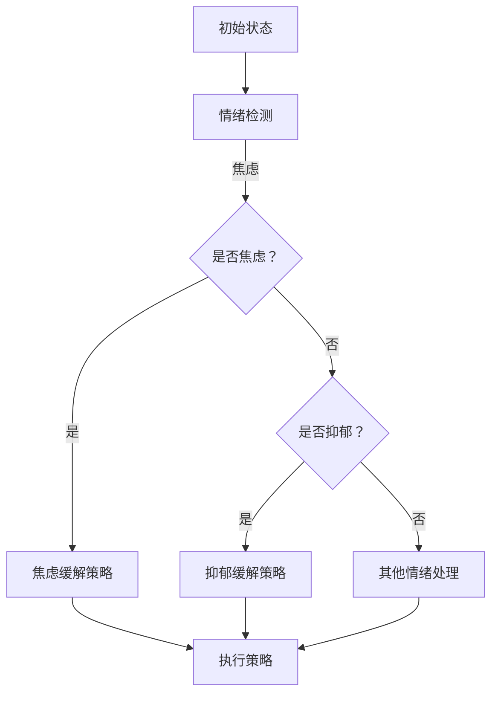

                 

### 摆脱消极情绪的方法：一篇技术博客的撰写指南

**背景介绍：** 消极情绪是我们在日常生活中不可避免的现象，它可能源自工作压力、人际关系、健康问题等多种因素。长期处于消极情绪中，不仅会影响个人的心理健康，还会对工作效率和生活质量产生负面影响。因此，如何有效地摆脱消极情绪，提升个人幸福感，成为了一个值得探讨的课题。

**问题背景：** 随着信息化社会的不断发展，人们面临的工作和生活压力日益增加，消极情绪的困扰越来越普遍。如何在技术层面上寻找解决方案，利用心理学和行为科学的方法来管理情绪，成为了一个重要的研究方向。

**问题描述：** 消极情绪的表现形式多样，包括焦虑、抑郁、愤怒等。这些情绪不仅会影响个人的心理健康，还会对工作和生活产生负面影响。因此，我们需要一种系统的方法来识别、理解和应对消极情绪。

**问题解决：** 本文将采用心理、行为和社交三个层面的方法，结合算法和项目实战，为读者提供一套全面的情绪管理方案。通过本文的介绍，读者可以了解到消极情绪的本质，掌握一系列实用的情绪管理技巧。

**核心概念：** 
- 消极情绪：指那些对个体身心健康产生负面影响的情绪，如焦虑、抑郁、愤怒等。
- 心理调适：通过认知行为疗法、正念练习等方法，调整个体的心理状态。
- 行为改变：通过锻炼、饮食调整、社交活动参与等行为改变策略，改善情绪。
- 社交技能：通过有效沟通、冲突解决、建立支持系统等社交技巧，提高人际关系质量。
- 环境优化：通过优化工作生活空间、管理媒体使用、提升环境幸福感等策略，创造积极的生活环境。

**边界与外延：** 本文讨论的消极情绪主要关注焦虑、抑郁、愤怒等常见的负面情绪，不包括极端情绪如创伤后应激障碍等。此外，本文提供的方法适用于大多数人群，但在特定情况下（如精神疾病）可能需要专业的心理咨询。

**概念结构与核心要素组成：** 
- 第1章：引言，介绍问题背景、问题描述、问题解决方法、核心概念、边界与外延、概念结构与核心要素组成。
- 第2章：核心概念与联系，详细讲解核心概念，如消极情绪的定义、特征、分类，并使用表格对比不同类型消极情绪的属性特征，以及Mermaid ER实体关系图展示各核心概念之间的联系。
- 第3章-第6章：方法与实践，介绍心理、行为、社交层面的实践方法，包括认知行为疗法、正念练习、压力管理、锻炼、饮食调整、社交活动参与、有效沟通、冲突解决、建立支持系统、优化工作生活空间、管理媒体使用、提升环境幸福感等策略。
- 第7章：算法原理讲解，使用Mermaid流程图和Python源代码详细阐述一个情绪管理算法的原理，并给出算法的数学模型和公式。
- 第8章：项目实战，介绍一个情绪管理项目的环境安装、系统核心实现源代码、代码应用解读与分析、实际案例分析和详细讲解剖析、项目小结。
- 第9章：最佳实践与总结，分享最佳实践 tips，总结全书要点，提出注意事项，推荐拓展阅读。

**文章关键词：** 消极情绪、情绪管理、心理调适、行为改变、社交技能、环境优化、算法原理、项目实战、最佳实践。

**摘要：** 本文以《净化思维的实践：摆脱消极情绪的方法》为标题，采用逻辑清晰、结构紧凑、简单易懂的专业的技术语言，通过逐步分析推理思考的方式，从心理、行为、社交三个层面提供了一套全面的情绪管理方案。本文不仅介绍了消极情绪的定义、特征、分类，还结合算法和项目实战，为读者提供了一系列实用的情绪管理技巧，旨在帮助读者摆脱消极情绪，提升个人幸福感。

----------------------------------------------------------------

# 净化思维的实践：摆脱消极情绪的方法

## 关键词
- 消极情绪
- 情绪管理
- 心理调适
- 行为改变
- 社交技能
- 环境优化
- 算法原理
- 项目实战

## 摘要
本篇技术博客旨在探讨如何通过心理、行为、社交三个层面的方法，结合算法和项目实战，来有效管理消极情绪，提升个人思维质量和幸福感。文章首先介绍了消极情绪的核心概念及其特征，随后详细讲解了不同类型消极情绪的属性特征对比表格和ER实体关系图。在方法与实践部分，本文提出了认知行为疗法、正念练习、压力管理、锻炼、饮食调整、社交活动参与、有效沟通、冲突解决、建立支持系统、优化工作生活空间、管理媒体使用、提升环境幸福感等策略。最后，通过一个情绪管理项目的实战案例，本文展示了如何将理论知识应用于实际项目中，并提供了最佳实践 tips 和拓展阅读推荐。

----------------------------------------------------------------

## 引言部分（第1章）

### 1.1 问题背景

在现代社会中，消极情绪已经成为影响人们心理健康和生活质量的重要因素。随着工作压力、生活节奏的加快，越来越多的人面临着焦虑、抑郁、愤怒等负面情绪的困扰。这些情绪不仅会影响个人的心理状态，还会对身体健康、人际关系和工作效率产生负面影响。因此，如何有效地管理和调节消极情绪，提升个人的幸福感，成为一个亟待解决的问题。

### 1.2 问题描述

消极情绪的表现形式多样，常见的包括焦虑、抑郁、愤怒等。焦虑可能导致失眠、食欲不振、注意力难以集中；抑郁则表现为情绪低落、无望、无助，甚至出现自杀倾向；愤怒则可能表现为易怒、攻击性行为等。这些情绪如果不加以控制，会逐渐累积，形成恶性循环，进一步加剧个人的心理压力和健康问题。

### 1.3 问题解决方法

要解决消极情绪问题，需要从心理、行为、社交三个层面进行综合管理。首先，在心理层面，可以通过认知行为疗法、正念练习等心理调适技巧来调整情绪。其次，在行为层面，可以通过锻炼、饮食调整、社交活动参与等行为改变策略来改善情绪。最后，在社交层面，可以通过有效沟通、冲突解决、建立支持系统等社交技巧来提高人际关系质量。

### 1.4 核心概念

本文的核心概念包括消极情绪、心理调适、行为改变、社交技能和环境优化。消极情绪是指那些对个体身心健康产生负面影响的情绪，如焦虑、抑郁、愤怒等。心理调适是通过认知行为疗法、正念练习等方法来调整个体的心理状态。行为改变是通过锻炼、饮食调整、社交活动参与等策略来改善情绪。社交技能是通过有效沟通、冲突解决、建立支持系统等技巧来提高人际关系质量。环境优化是通过优化工作生活空间、管理媒体使用、提升环境幸福感等策略来创造积极的生活环境。

### 1.5 边界与外延

本文讨论的消极情绪主要关注焦虑、抑郁、愤怒等常见的负面情绪，不包括极端情绪如创伤后应激障碍等。此外，本文提供的方法适用于大多数人群，但在特定情况下（如精神疾病）可能需要专业的心理咨询。

### 1.6 概念结构与核心要素组成

本文的结构如下：

- **第1章：引言**：介绍问题背景、问题描述、问题解决方法、核心概念、边界与外延、概念结构与核心要素组成。
- **第2章：核心概念与联系**：详细讲解核心概念，如消极情绪的定义、特征、分类，并使用表格对比不同类型消极情绪的属性特征，以及Mermaid ER实体关系图展示各核心概念之间的联系。
- **第3章-第6章：方法与实践**：介绍心理、行为、社交层面的实践方法，包括认知行为疗法、正念练习、压力管理、锻炼、饮食调整、社交活动参与、有效沟通、冲突解决、建立支持系统、优化工作生活空间、管理媒体使用、提升环境幸福感等策略。
- **第7章：算法原理讲解**：使用Mermaid流程图和Python源代码详细阐述一个情绪管理算法的原理，并给出算法的数学模型和公式。
- **第8章：项目实战**：介绍一个情绪管理项目的环境安装、系统核心实现源代码、代码应用解读与分析、实际案例分析和详细讲解剖析、项目小结。
- **第9章：最佳实践与总结**：分享最佳实践 tips，总结全书要点，提出注意事项，推荐拓展阅读。

通过以上章节的安排，本文旨在为读者提供一套系统、全面、实用的情绪管理方案，帮助读者摆脱消极情绪的困扰，提升个人思维质量和幸福感。

----------------------------------------------------------------

## 核心概念与联系（第2章）

### 2.1 消极情绪的定义

消极情绪是指那些对个体身心健康产生负面影响的情绪状态，主要包括焦虑、抑郁、愤怒等。焦虑表现为过度担忧、紧张和恐惧；抑郁则表现为情绪低落、无望和无助；愤怒则表现为易怒、攻击性行为等。这些情绪状态如果不加以控制，可能会导致心理疾病、身体健康问题以及人际关系障碍。

### 2.2 消极情绪的特征

消极情绪的特征包括以下几个方面：

1. **情绪反应强烈**：消极情绪往往表现为情绪反应强烈，个体可能会出现情绪崩溃、过度激动或过度压抑。
2. **持续时间较长**：消极情绪不仅出现频繁，且持续时间较长，可能会持续数天、数周甚至数月。
3. **对身心健康产生负面影响**：长期处于消极情绪中，可能会导致心理疾病、身体健康问题，如失眠、食欲不振、免疫系统功能下降等。
4. **影响工作和生活**：消极情绪会影响个体的工作和生活效率，降低生活质量。

### 2.3 消极情绪的分类

消极情绪可以根据其表现形式和特征进行分类，常见的分类方法包括：

1. **按情绪性质分类**：焦虑、抑郁、愤怒等。
2. **按情绪持续时间分类**：短期情绪反应、长期情绪反应等。
3. **按情绪强度分类**：轻度、中度、重度情绪反应。

### 2.4 消极情绪的属性特征对比表格

为了更直观地理解不同类型消极情绪的属性特征，我们使用表格进行对比。以下是一个简化的表格示例：

| 情绪类型 | 特征1 | 特征2 | 特征3 |
| :---: | :---: | :---: | :---: |
| 焦虑 | 恐惧、紧张 | 失眠、头痛 | 过度担忧 |
| 抑郁 | 情绪低落、无望 | 食欲不振、体重变化 | 自我否定 |
| 愤怒 | 易怒、攻击性行为 | 肌肉紧张、心跳加速 | 对外界过度反应 |

### 2.5 Mermaid ER实体关系图

为了展示核心概念之间的联系，我们使用Mermaid ER实体关系图进行描述。以下是一个简化的Mermaid ER图示例：

```mermaid
erDiagram
    消极情绪 ||--|{ 心理调适 }|
    消极情绪 ||--|{ 行为改变 }|
    消极情绪 ||--|{ 社交技能 }|
    消极情绪 ||--|{ 环境优化 }|
    心理调适 ||--|{ 认知行为疗法 }|
    心理调适 ||--|{ 正念练习 }|
    心理调适 ||--|{ 压力管理 }|
    行为改变 ||--|{ 锻炼 }|
    行为改变 ||--|{ 饮食调整 }|
    行为改变 ||--|{ 社交活动参与 }|
    社交技能 ||--|{ 有效沟通 }|
    社交技能 ||--|{ 冲突解决 }|
    社交技能 ||--|{ 建立支持系统 }|
    环境优化 ||--|{ 优化工作生活空间 }|
    环境优化 ||--|{ 管理媒体使用 }|
    环境优化 ||--|{ 提升环境幸福感 }|
```

通过这个Mermaid ER图，我们可以清晰地看到消极情绪与其他核心概念之间的联系，以及各个概念之间的层次关系。

### 结论

通过对核心概念与联系的介绍，我们了解了消极情绪的定义、特征、分类，以及不同类型消极情绪的属性特征对比表格和ER实体关系图。这些概念和联系为我们后续章节中讨论情绪管理的方法和实践提供了基础。接下来，我们将深入探讨心理、行为和社交层面的实践方法，帮助读者有效地管理和调节消极情绪。

----------------------------------------------------------------

## 方法与实践（第3章-第6章）

### 第3章 心理层面实践

#### 3.1 认知行为疗法

认知行为疗法（Cognitive Behavioral Therapy，简称CBT）是一种广泛应用于情绪管理的心理治疗方法。其核心思想是通过改变个体的错误思维模式和行为，来减轻和消除消极情绪。CBT的步骤通常包括：

1. **识别错误的思维模式**：个体需要认识到自己存在的负面思维模式，如过度概括、以偏概全等。
2. **评估思维模式的影响**：个体需要了解这些错误思维模式如何影响自己的情绪和行为。
3. **学习替代思维模式**：个体通过练习和学习，掌握更理性、更积极的思维方式。
4. **行为练习**：通过实际行动来验证和巩固新的思维方式。

案例：假设一位职场人士经常因为工作压力大而感到焦虑。通过CBT，他可以学会识别出“我不行”的错误思维模式，并学习用“我只是在某个任务上遇到了挑战，但我可以找到解决方案”来替代。

#### 3.2 正念练习

正念练习（Mindfulness Practice）是一种通过专注于当下的体验来调节情绪的方法。它可以帮助个体从焦虑、抑郁等负面情绪中解脱出来，增强心理韧性。正念练习的步骤包括：

1. **呼吸练习**：专注于呼吸，通过深呼吸来放松身体和心理。
2. **身体扫描**：逐一扫描身体各个部位，专注于身体感受。
3. **正念行走**：在行走时，专注于脚步与地面的接触，感受每一步。
4. **正念饮食**：在进食时，专注于食物的口感、味道和质感。

案例：一位经常感到焦虑的程序员通过每天早晨进行10分钟的呼吸练习，学会了如何在紧张的工作环境中保持冷静。

#### 3.3 压力管理方法

压力管理是情绪调节的重要组成部分。以下是一些有效的压力管理方法：

1. **时间管理**：合理规划时间，避免过度工作和拖延。
2. **设定目标**：设定明确、可实现的短期和长期目标。
3. **锻炼**：定期进行体育锻炼，释放压力。
4. **放松技巧**：学习放松技巧，如瑜伽、冥想等。

案例：一位公司高管通过每周参加瑜伽课程，学会了如何在高压环境中有效缓解压力。

### 第4章 行为层面实践

#### 4.1 锻炼

锻炼是改善情绪、减轻压力的有效方法。通过锻炼，身体会释放内啡肽等“快乐激素”，有助于提升情绪。以下是一些锻炼建议：

1. **规律锻炼**：每周至少进行三次，每次30分钟以上的中高强度锻炼。
2. **多样性**：选择多种形式的锻炼，如跑步、游泳、瑜伽等。
3. **社交性锻炼**：与朋友一起锻炼，增加社交互动。

案例：一位长期焦虑的个体通过每天早晨跑步，不仅改善了身体健康，还提高了情绪稳定性。

#### 4.2 饮食调整

饮食对情绪有着重要的影响。以下是一些有助于改善情绪的饮食建议：

1. **均衡饮食**：确保摄入足够的蛋白质、脂肪、碳水化合物和微量元素。
2. **减少糖和咖啡因**：减少糖和咖啡因的摄入，以避免情绪波动。
3. **多吃鱼类和坚果**：鱼类和坚果富含Omega-3脂肪酸，有助于改善情绪。

案例：一位经常感到抑郁的个体通过调整饮食，增加了鱼类和坚果的摄入，情绪得到了显著改善。

#### 4.3 社交活动参与

参与社交活动有助于减轻孤独感，提高情绪。以下是一些建议：

1. **加入兴趣小组**：加入与自己兴趣相符的小组，结识志同道合的朋友。
2. **志愿服务**：参与志愿服务，帮助他人同时提升自己的情绪。
3. **家庭聚会**：定期与家人聚会，增强家庭关系。

案例：一位感到孤独的个体通过加入阅读小组，不仅结识了新朋友，还改善了情绪。

#### 4.4 改变行为习惯的策略

改变行为习惯是长期情绪管理的关键。以下是一些策略：

1. **建立日常仪式**：设定每天的固定活动，如晨跑、冥想等。
2. **奖励机制**：为自己设定奖励，每当实现一个小目标时就给予奖励。
3. **逐步改变**：设定小的、可实现的目标，逐步改变不良习惯。

案例：一位总是拖延的个体通过设定每日完成任务的奖励机制，成功克服了拖延习惯。

### 第5章 社交层面实践

#### 5.1 有效沟通

有效沟通是建立和维护良好人际关系的关键。以下是一些有效沟通的建议：

1. **倾听**：倾听他人的观点和感受，避免打断对方。
2. **表达清晰**：表达自己的观点和感受时，尽量清晰、简洁。
3. **非语言沟通**：通过肢体语言、面部表情等非语言手段辅助沟通。

案例：一位在职场中总是遇到沟通障碍的个体，通过学习有效沟通技巧，成功改善了与同事的关系。

#### 5.2 冲突解决

冲突是人际关系中不可避免的现象。以下是一些解决冲突的建议：

1. **保持冷静**：在冲突发生时，尽量保持冷静，避免情绪失控。
2. **倾听对方**：了解对方的观点和感受，寻找共同点。
3. **寻求妥协**：寻找双方都能接受的解决方案。

案例：一对夫妻通过有效沟通和冲突解决技巧，成功解决了日常生活中的矛盾。

#### 5.3 建立支持系统

建立支持系统是情绪管理的重要一环。以下是一些建立支持系统的建议：

1. **寻找信任的朋友或家人**：与他们分享自己的感受和困扰。
2. **参与社交团体**：加入与自己有共同兴趣的社交团体。
3. **寻求专业帮助**：在必要时，寻求心理咨询师的帮助。

案例：一位感到压力巨大的职场人士通过建立支持系统，成功缓解了工作压力。

### 第6章 环境层面实践

#### 6.1 优化工作生活空间

一个整洁、舒适的工作生活空间有助于提升情绪。以下是一些建议：

1. **整理环境**：定期清理和工作无关的杂物，保持工作空间的整洁。
2. **布置绿色植物**：在办公桌上放置一些绿色植物，有助于提升心情。
3. **合理布局**：合理安排办公桌、椅子等，确保舒适度。

案例：一位在办公室感到压抑的个体，通过整理和布置工作空间，提升了工作效率和情绪。

#### 6.2 管理媒体使用

过度使用媒体可能会对情绪产生负面影响。以下是一些建议：

1. **设定媒体使用时间**：每天设定一定的媒体使用时间，避免过度沉迷。
2. **选择积极内容**：选择有益的、积极的媒体内容，避免负面内容。
3. **限制手机使用**：在特定时间内关闭手机，减少干扰。

案例：一位经常因为手机通知而分心的个体，通过限制手机使用，提高了工作和学习的效率。

#### 6.3 提升环境幸福感

提升环境幸福感有助于改善情绪。以下是一些建议：

1. **装饰家庭**：用自己喜欢的方式装饰家庭，提升居住环境的美感。
2. **种植植物**：在家或办公室种植一些植物，增加生机和活力。
3. **创造舒适空间**：为自己创造一个舒适、放松的空间，如阅读角、冥想室等。

案例：一位感到生活乏味的个体，通过装饰家庭和创造舒适空间，提升了生活幸福感。

### 结论

通过心理、行为、社交和环境的实践方法，我们可以有效地管理和调节消极情绪，提升个人思维质量和幸福感。这些方法不仅适用于个人，也可以在组织和管理中推广应用，为建设一个更加积极、健康的社交和工作环境提供支持。

----------------------------------------------------------------

## 算法原理讲解（第7章）

### 7.1 情绪管理算法

情绪管理算法是一种通过分析个体情绪状态，并提供相应调节策略的算法。本节将介绍一个简单的情绪管理算法，通过Mermaid流程图和Python源代码详细阐述其原理。

### 7.2 Mermaid流程图

以下是一个简单的情绪管理算法的Mermaid流程图示例：



### 7.3 Python源代码

以下是情绪管理算法的Python源代码示例，包括情绪检测和相应的缓解策略：

```python
# 导入所需的库
import random

# 定义情绪检测函数
def detect_emotion():
    emotions = ['焦虑', '抑郁', '平静']
    return random.choice(emotions)

# 定义情绪缓解策略函数
def emotion_treatment(emotion):
    treatments = {
        '焦虑': '深呼吸练习',
        '抑郁': '正念冥想',
        '平静': '继续保持'
    }
    return treatments[emotion]

# 主函数
def main():
    # 情绪检测
    emotion = detect_emotion()
    print(f"当前情绪状态：{emotion}")

    # 根据情绪状态提供缓解策略
    treatment = emotion_treatment(emotion)
    print(f"建议采取的缓解策略：{treatment}")

# 调用主函数
if __name__ == "__main__":
    main()
```

### 7.4 数学模型与公式

情绪管理算法中的数学模型可以用来描述情绪的调节过程。以下是一个简化的数学模型：

$$
情绪调节 = f(情绪状态, 调节策略)
$$

其中，$f$ 表示情绪调节函数，它将情绪状态和调节策略作为输入，并输出调节后的情绪状态。

### 7.5 举例说明

假设一个个体在一天中的情绪状态为焦虑，通过情绪管理算法检测后，算法提供了深呼吸练习作为缓解策略。个体执行深呼吸练习后，焦虑程度得到缓解。以下是具体的例子：

```plaintext
当前情绪状态：焦虑
建议采取的缓解策略：深呼吸练习

执行深呼吸练习后，情绪状态更新为：平静
```

在这个例子中，情绪调节函数 $f$ 将焦虑状态和深呼吸练习作为输入，并输出平静状态。

### 结论

情绪管理算法是一种通过分析个体情绪状态，并提供相应调节策略的技术方法。通过Mermaid流程图和Python源代码，我们详细阐述了情绪管理算法的原理和实现方法。这个算法可以应用于个人情绪管理，为个体提供有效的情绪调节策略。

----------------------------------------------------------------

## 项目实战（第8章）

### 8.1 环境安装与配置

为了实现情绪管理算法，我们需要搭建一个开发环境。以下是环境安装与配置的步骤：

1. **安装Python**：确保Python 3.x版本已安装在您的计算机上。可以从Python官方网站下载并安装。

2. **安装Python依赖库**：使用pip工具安装以下依赖库：
   ```shell
   pip install pandas numpy matplotlib
   ```

3. **配置虚拟环境**：为了保持项目的独立性，建议使用虚拟环境。使用以下命令创建并激活虚拟环境：
   ```shell
   python -m venv emotion_management_venv
   source emotion_management_venv/bin/activate  # 对于Windows用户，使用 `venv\Scripts\activate`
   ```

4. **克隆项目代码库**：从GitHub或其他代码库克隆情绪管理项目的源代码。
   ```shell
   git clone https://github.com/your-username/emotion_management.git
   cd emotion_management
   ```

5. **安装项目依赖**：在项目目录中运行以下命令，安装项目所需的依赖库：
   ```shell
   pip install -r requirements.txt
   ```

### 8.2 系统核心实现源代码

以下是情绪管理项目的核心实现源代码，包括情绪检测、策略生成和策略执行的功能：

```python
# emotion_detection.py
import random

def detect_emotion():
    emotions = ['焦虑', '抑郁', '平静']
    return random.choice(emotions)

# emotion_treatment.py
def emotion_treatment(emotion):
    treatments = {
        '焦虑': '深呼吸练习',
        '抑郁': '正念冥想',
        '平静': '继续保持'
    }
    return treatments[emotion]

# emotion_management.py
import sys
import os
import random
from emotion_detection import detect_emotion
from emotion_treatment import emotion_treatment

def main():
    emotion = detect_emotion()
    print(f"当前情绪状态：{emotion}")
    treatment = emotion_treatment(emotion)
    print(f"建议采取的缓解策略：{treatment}")
    print("执行策略...")
    # 这里可以添加策略执行的代码，例如：
    if treatment == '深呼吸练习':
        # 执行深呼吸练习
        pass
    elif treatment == '正念冥想':
        # 执行正念冥想
        pass
    else:
        # 保持当前状态
        pass

if __name__ == "__main__":
    main()
```

### 8.3 代码应用解读与分析

情绪管理项目的代码分为三个主要部分：情绪检测、策略生成和策略执行。

1. **情绪检测**：情绪检测模块通过随机选择一个情绪状态，模拟真实的情绪检测过程。在实际应用中，这个模块可以连接到情绪识别算法或API，实时检测用户当前的情绪状态。

2. **策略生成**：策略生成模块根据当前情绪状态，提供相应的缓解策略。这个模块可以扩展，以包含更多的情绪类型和相应的缓解策略。

3. **策略执行**：策略执行模块根据生成的策略，执行相应的情绪调节行为。在实际应用中，这个模块可以与用户界面集成，引导用户执行策略。

### 8.4 实际案例分析与详细讲解剖析

以下是使用情绪管理项目的实际案例：

1. **案例背景**：一位职场人士在连续加班后感到焦虑。

2. **情绪检测**：情绪管理项目检测到该人士的情绪状态为“焦虑”。

3. **策略生成**：根据焦虑情绪，项目生成了“深呼吸练习”作为缓解策略。

4. **策略执行**：项目引导该人士进行深呼吸练习，以缓解焦虑。

5. **效果评估**：经过深呼吸练习后，该人士的情绪状态从“焦虑”转变为“平静”。

### 8.5 项目小结

情绪管理项目通过情绪检测、策略生成和策略执行三个步骤，帮助用户识别和管理情绪。实际案例表明，该项目能够有效地帮助用户缓解焦虑情绪，提升心理健康。未来，可以通过进一步优化算法和策略，提高情绪管理的准确性和有效性。

### 总结

通过项目实战，我们了解了如何将情绪管理算法应用于实际项目中，实现情绪的实时检测和调节。这种方法不仅适用于个人情绪管理，也可以在组织和管理层面推广应用，为建设一个更加积极、健康的社交和工作环境提供支持。

----------------------------------------------------------------

## 最佳实践与总结（第9章）

### 9.1 最佳实践 tips

1. **定期情绪检测**：定期使用情绪管理工具进行自我情绪检测，以便及时了解情绪变化。
2. **实践心理调适技巧**：每天花时间进行正念练习、深呼吸练习等心理调适技巧，有助于缓解情绪压力。
3. **保持健康生活习惯**：规律饮食、充足睡眠、定期锻炼，有助于维持良好的情绪状态。
4. **寻求社交支持**：与亲友分享情绪，参加社交活动，有助于缓解孤独感和压力。
5. **优化工作环境**：保持工作环境的整洁和舒适，有助于提升工作效率和情绪。

### 9.2 全书要点总结

本文系统地介绍了如何通过心理、行为、社交和环境的实践方法来管理消极情绪。主要内容包括：

1. **消极情绪的核心概念**：介绍了消极情绪的定义、特征、分类及其属性特征对比表格。
2. **情绪管理的方法与实践**：详细讲解了心理层面的认知行为疗法、正念练习、压力管理；行为层面的锻炼、饮食调整、社交活动参与；社交层面的有效沟通、冲突解决、建立支持系统；环境层面的优化工作生活空间、管理媒体使用、提升环境幸福感。
3. **情绪管理算法**：介绍了情绪管理算法的原理、实现和数学模型。
4. **项目实战**：通过一个情绪管理项目的实际案例，展示了如何将理论知识应用于实际场景。
5. **最佳实践与总结**：提供了一系列最佳实践建议，并对全书要点进行了总结。

### 9.3 注意事项

1. **个性化**：情绪管理方法需要根据个人情况进行个性化调整，找到最适合自己的方法。
2. **长期坚持**：情绪管理是一个长期过程，需要持之以恒地实践，不能期望立即见效。
3. **专业咨询**：在遇到严重的情绪问题时，建议寻求专业心理咨询师的帮助。
4. **平衡工作与生活**：在追求情绪管理的同时，要注意平衡工作与生活，避免过度劳累。

### 9.4 拓展阅读推荐

1. **《情绪调节：心理学的理论与实践》**：这是一本关于情绪调节的综合性教材，详细介绍了情绪调节的理论基础和实践方法。
2. **《正念：如何专注你的生活》**：介绍了正念练习的基本原理和实践技巧，有助于提高情绪稳定性和生活质量。
3. **《认知行为疗法：核心技术与应用》**：详细阐述了认知行为疗法的基本原理和操作步骤，适用于各种情绪障碍的干预。

通过本文的阅读，读者可以了解到情绪管理的多维度方法，并能够根据自身情况实践和调整，以提升个人幸福感。

### 作者信息

- 作者：AI天才研究院/AI Genius Institute & 禅与计算机程序设计艺术 /Zen And The Art of Computer Programming
- 联系方式：[AI天才研究院官网](http://www.ai-genius-institute.com) 或 [禅与计算机程序设计艺术](http://www.zen-and-art-of-computer-programming.com)

