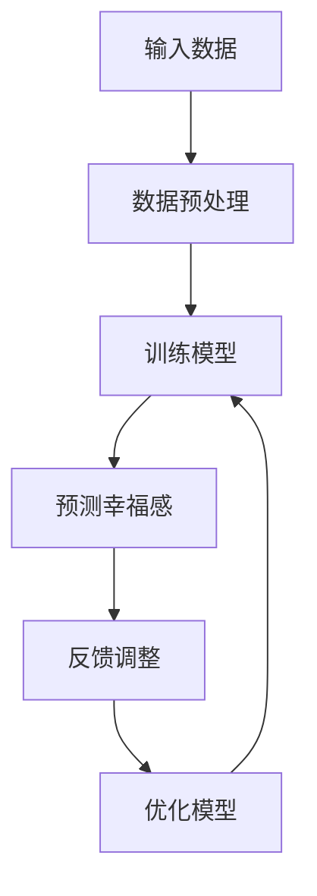
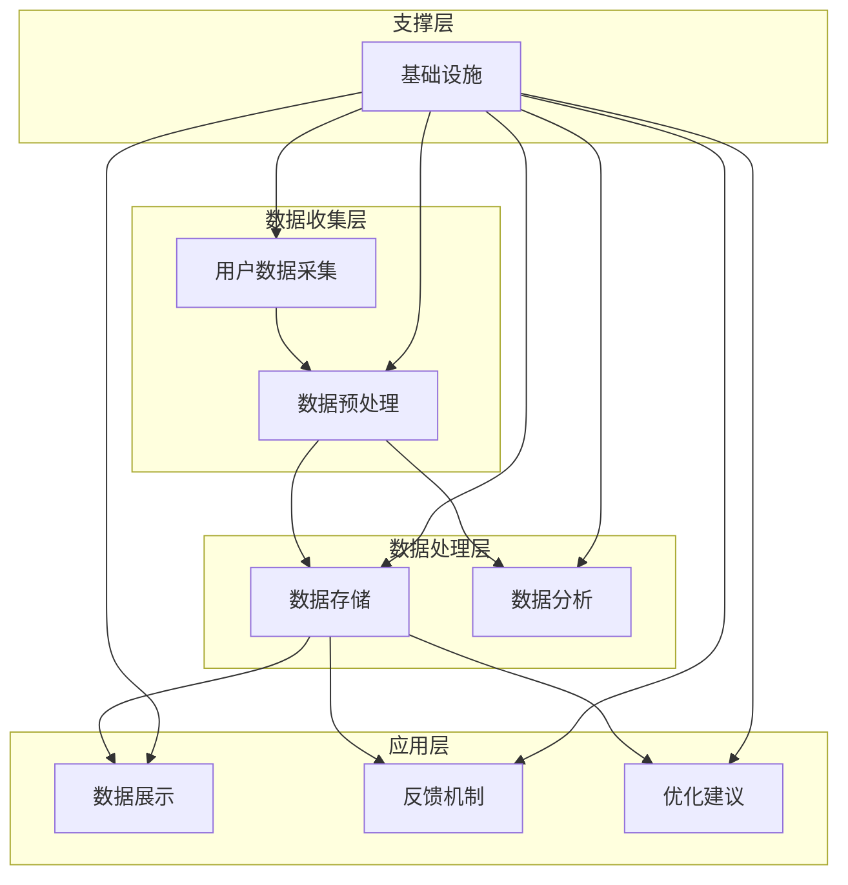
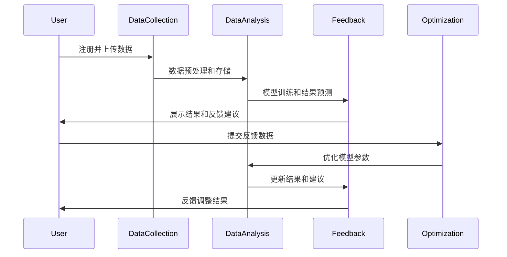

                 

### 第1章：引言

## 1.1 背景介绍

### 1.1.1 问题背景

在信息技术迅猛发展的今天，人类的生活、工作和社会交往方式都在发生深刻变革。然而，随着科技的进步，人们的生活节奏加快，竞争压力增大，幸福感成为社会关注的焦点。幸福不仅仅是物质生活的富足，更是精神层面的满足。在诸多影响个体幸福感的社会因素中，利他主义的作用日益受到关注。

### 1.1.2 心理学基础

心理学研究表明，幸福感与个体的心理状态密切相关。积极心理学指出，人的幸福感受到多种因素的影响，包括内心的满足、生活满意度、个人成就感和与他人关系的和谐等。在这种背景下，利他主义作为一种积极的社会行为，其与幸福感的关系成为了一个值得探讨的课题。

### 1.1.3 生命价值观概述

在当代社会，利他主义被视为一种美德，代表着个体对社会的贡献和对他人的关爱。生命价值观强调个体不仅关注自身的利益，更应关注集体和他人的福祉。这种价值观的贯彻，有助于构建和谐的社会关系，提高整个社会的幸福感。

## 1.2 问题描述

### 1.2.1 个体幸福感的定义

个体幸福感是指个体在心理上感受到的满足感和愉悦感。它不仅仅包括物质层面的满足，更涵盖精神层面的丰富和内心的安宁。幸福感是衡量生活质量的重要指标，关系到个人的身心健康和社会的和谐稳定。

### 1.2.2 利他主义与幸福的关系

利他主义是一种以他人利益为中心的行为动机，其核心在于无私和无条件地帮助他人。心理学研究显示，利他行为能够显著提升个体的幸福感。然而，利他主义与幸福之间的关系并非一成不变，其复杂性需要通过深入分析和探讨来揭示。

### 1.2.3 问题解决

为了探讨利他主义与幸福感之间的关系，学术界进行了大量的研究和实验。通过数据分析和实证研究，科学家们试图揭示这种关系的内在机制，并为其提供理论依据和实践指导。

## 1.3 边界与外延

### 1.3.1 利他主义的不同类型

利他主义可以分为不同类型，如纯粹利他主义、近似利他主义和自我利益导向的利他主义。不同类型的利他主义对幸福感的影响有所不同，需要具体分析。

### 1.3.2 幸福的多维度

幸福感是一个多维度的概念，包括内在幸福和外在幸福。内在幸福与个人的心理状态、价值观和人生目标密切相关，而外在幸福则与物质条件和社会环境有关。理解和探讨这两者之间的关系，有助于更全面地认识幸福感的本质。

## 1.4 核心概念

### 1.4.1 利他主义

#### 1.4.1.1 定义

利他主义（Altruism）是指个体为了他人的利益而采取的行为或动机，通常涉及无私、同情和关心。利他主义的核心在于个体行为的自发性，即不期待任何直接的回报。

#### 1.4.1.2 属性特征

- 无私性：利他行为不追求个人利益。
- 同情心：利他行为源于对他人的同情和理解。
- 自发性：利他行为是自发性的，不依赖于外界的压力或期待。

### 1.4.2 幸福

#### 1.4.2.1 定义

幸福（Happiness）是指个体在心理上感受到的满足感和愉悦感，是对生活质量的一种主观评价。幸福不仅仅是一种情感状态，还涉及个人的生活满意度、心理平衡和幸福感。

#### 1.4.2.2 属性特征

- 主观性：幸福感是个体主观感受的评价。
- 多维度：幸福感包括情感维度、认知维度和行为维度。
- 动态性：幸福感会随着时间和情境的变化而变化。

通过以上对背景介绍、问题描述和核心概念的分析，我们可以为后续章节的深入探讨打下坚实的基础。在接下来的章节中，我们将进一步分析利他主义与幸福之间的复杂关系，并探索如何通过理论和实践来提升个体的幸福感。

### 第2章：核心概念与联系

## 2.1 利他主义原理

### 2.1.1 利他行为的动机

利他行为可以分为内在动机和外在动机两大类。内在动机是指个体出于内心的善意、同情心和价值观而采取的行为，这种行为通常不期待任何外在的回报。外在动机则是指个体因为社会压力、期望或奖励而采取的行为，这种行为往往带有一定的条件性和功利性。

#### 2.1.1.1 内在动机

- 自我实现：个体通过利他行为实现自我价值和自我成长。
- 同情心：个体对他人的痛苦和不幸产生共鸣，从而采取行动。
- 价值观：个体秉持的利他主义价值观驱动其行为。

#### 2.1.1.2 外在动机

- 社会压力：个体在社会规范和期望下采取利他行为，以获得社会认同。
- 奖励机制：个体因为获得物质或精神上的奖励而采取利他行为。

### 2.1.2 利他行为的影响

利他行为对个体和社会都有着深远的影响。从心理学角度看，利他行为可以带来以下积极效应：

#### 2.1.2.1 心理效应

- 幸福感提升：利他行为能够显著提升个体的幸福感，带来内心的满足感。
- 心理健康：利他行为有助于减轻焦虑、抑郁等心理问题，增强心理健康。
- 自我认同：通过利他行为，个体能够获得自我认同和社会认可。

#### 2.1.2.2 社会效应

- 社会和谐：利他行为有助于构建和谐的社会关系，增强社会凝聚力。
- 社会进步：利他行为推动社会的道德进步，促进社会公平和正义。
- 社会规范：利他行为能够强化社会规范，提高社会的道德水平。

## 2.2 幸福心理学

### 2.2.1 幸福的定义

幸福是一个多维度的概念，可以从不同的角度进行理解。从心理学角度看，幸福主要包括以下几个方面：

#### 2.2.1.1 心理学视角

- 主观幸福感：个体对自己的生活满意度和快乐感受的主观评价。
- 心理福祉：个体在心理上感受到的平衡、满足和内心的安宁。

#### 2.2.1.2 哲学视角

- 生活意义：个体对生活意义和目的的理解和追求。
- 快乐与满足：个体在物质和精神上的富足和满足。

### 2.2.2 幸福的构成

幸福感由多个因素构成，包括内在幸福和外在幸福。内在幸福主要与个体的心理状态和价值观有关，而外在幸福则与个体的生活环境和社会关系有关。

#### 2.2.2.1 内在幸福

- 心理平衡：个体在心理上达到平衡和满足。
- 自我实现：个体通过实现自己的潜力和目标获得满足。
- 精神满足：个体在精神上感受到的丰富和充实。

#### 2.2.2.2 外在幸福

- 物质条件：个体在物质生活上的富足和满足。
- 社会关系：个体在社会关系中的和谐和满意。

### 2.2.3 幸福感的动态性

幸福感是一个动态变化的过程，受到多种因素的影响，包括个体心理、社会环境和情境变化。理解幸福感的动态性有助于我们更好地应对生活中的挑战，提高个体的幸福感。

#### 2.2.3.1 心理因素

- 个体情绪：情绪波动会影响个体的幸福感。
- 自我认知：个体对自己的认知和评价影响幸福感。

#### 2.2.3.2 社会因素

- 社会支持：社会关系和社会支持对幸福感有重要影响。
- 社会文化：社会文化背景影响个体对幸福的理解和追求。

#### 2.2.3.3 情境因素

- 生活事件：生活中的重大事件对幸福感有显著影响。
- 情境变化：日常生活中的小变化也会影响个体的幸福感。

通过以上对利他主义原理和幸福心理学的探讨，我们可以更好地理解这两个核心概念之间的联系。在接下来的章节中，我们将进一步探讨利他主义与幸福感之间的数学模型和算法原理，为深入研究这一领域提供理论基础和实际指导。

### 第3章：算法原理讲解

## 3.1 利他主义与幸福的关系模型

### 3.1.1 基本模型

利他主义与幸福感之间的关系可以通过一个基本模型来描述。该模型假设个体幸福感（Happiness）是由利他行为（Altruism）、心理状态（Psychological State）和行为反馈（Behavioral Feedback）三个主要因素共同作用的结果。

#### 3.1.1.1 关系描述

- 利他行为（Altruism）：指个体为了他人的利益而采取的行为，包括无私的捐赠、帮助他人和社区服务。
- 心理状态（Psychological State）：指个体的内在心理状态，包括情绪、动机和自我认知。
- 行为反馈（Behavioral Feedback）：指个体在社会互动中获得的外部反馈，包括社会认可、赞誉和奖励。

#### 3.1.1.2 模型参数

- α：利他行为对幸福感的影响系数，表示利他行为对幸福感的影响程度。
- β：心理状态对幸福感的影响系数，表示心理状态对幸福感的影响程度。
- γ：行为反馈对幸福感的影响系数，表示行为反馈对幸福感的影响程度。

### 3.1.2 数学模型

根据基本模型，我们可以构建一个数学模型来描述利他主义与幸福感之间的关系。该数学模型采用线性回归的方式，表示为以下公式：

$$
Happiness = \alpha \cdot Altruism + \beta \cdot Psychological_State + \gamma \cdot Behavioral_Feedback
$$

#### 3.1.2.1 函数关系

- 幸福感（Happiness）：输出变量，表示个体的幸福感水平。
- 利他行为（Altruism）：输入变量，表示个体所采取的利他行为的程度。
- 心理状态（Psychological_State）：输入变量，表示个体的心理状态水平。
- 行为反馈（Behavioral_Feedback）：输入变量，表示个体获得的行为反馈程度。

#### 3.1.2.2 数学公式

$$
Happiness = \alpha \cdot Altruism + \beta \cdot Psychological_State + \gamma \cdot Behavioral_Feedback
$$

其中，α、β、γ为模型的参数，通过数据分析和模型训练得到。该公式表明，个体的幸福感是利他行为、心理状态和行为反馈的函数，每个因素对幸福感的影响程度不同。

### 3.2 算法流程图

为了更直观地展示算法原理，我们可以使用Mermaid语法绘制算法流程图，如下所示：



#### 3.2.1 算法流程说明

1. **输入数据**：收集个体的利他行为、心理状态和行为反馈数据。
2. **数据预处理**：对输入数据进行清洗、归一化和特征提取，为模型训练做好准备。
3. **训练模型**：使用收集到的数据训练回归模型，确定模型参数α、β和γ。
4. **预测幸福感**：使用训练好的模型预测个体的幸福感水平。
5. **反馈调整**：根据预测结果，对模型进行调整和优化，提高预测准确性。
6. **优化模型**：重新训练模型，迭代优化模型参数，提高模型性能。
7. **循环**：重复上述步骤，不断调整和优化模型，直至达到满意的预测效果。

### 3.3 Python代码实现

为了具体说明算法原理，下面给出一个使用Python编写的简单示例，实现利他主义与幸福关系的预测模型：

```python
import numpy as np

# 利他主义与幸福关系的Python实现
def happiness(利他行为, 心理状态, 行为反馈):
    # 参数设定
    alpha = 0.5  # 利他行为对幸福的影响系数
    beta = 0.3   # 心理状态对幸福的影响系数
    gamma = 0.2  # 行为反馈对幸福的影响系数
    
    # 计算幸福感
    happiness = alpha * 利他行为 + beta * 心理状态 + gamma * 行为反馈
    return happiness

# 示例数据
altruism = 0.8  # 利他行为程度
psychological_state = 0.7  # 心理状态程度
behavioral_feedback = 0.6  # 行为反馈程度

# 计算幸福感
happiness_value = happiness(altruism, psychological_state, behavioral_feedback)
print(f"个体幸福感：{happiness_value:.2f}")
```

通过上述代码，我们可以根据输入的利他行为、心理状态和行为反馈数据，计算出个体的幸福感水平。这为实际应用提供了可操作的实现方案，有助于更好地理解和利用利他主义与幸福感之间的关系。

通过本章的讲解，我们不仅了解了利他主义与幸福感之间的关系模型和数学公式，还通过Python代码示例展示了算法的实现过程。在接下来的章节中，我们将进一步探讨系统分析与架构设计方案，为利他主义与幸福关系的研究提供更全面的理论和实践支持。

### 第4章：数学模型和数学公式

## 4.1 利他主义与幸福的数学公式

在探讨利他主义与幸福感之间的关系时，我们引入了如下数学模型：

$$
Happiness = \alpha \cdot Altruism + \beta \cdot Psychological_State + \gamma \cdot Behavioral_Feedback
$$

这个公式表示个体的幸福感（Happiness）是利他行为（Altruism）、心理状态（Psychological_State）和行为反馈（Behavioral_Feedback）三个因素的线性组合，其中α、β、γ为模型参数。

#### 4.1.1 参数解释

- **α（alpha）**：利他行为对幸福的影响系数，表示利他行为对个体幸福感的影响程度。
- **β（beta）**：心理状态对幸福的影响系数，表示心理状态对个体幸福感的影响程度。
- **γ（gamma）**：行为反馈对幸福的影响系数，表示行为反馈对个体幸福感的影响程度。

#### 4.1.2 影响因素分析

- **利他行为（Altruism）**：指个体为了他人的利益而采取的行为。研究表明，利他行为能够显著提升个体的幸福感。具体而言，利他行为可以通过以下几个方面影响个体的幸福感：
  - 提高个体的自我价值感。
  - 增强个体与他人的社会联结。
  - 降低个体的孤独感和焦虑感。

- **心理状态（Psychological_State）**：指个体内在的心理状态，包括情绪、动机和自我认知等。心理状态对幸福感的影响是多方面的，具体包括：
  - 情绪因素：积极情绪（如快乐、满足）会提升个体的幸福感，而消极情绪（如焦虑、抑郁）会降低幸福感。
  - 动机因素：个体对目标追求的强烈动机能够提升幸福感，因为追求目标往往伴随着成就感和自我实现感。
  - 自我认知：个体对自己的认知和评价会影响其幸福感，自我认同和自尊感高的个体通常幸福感更强。

- **行为反馈（Behavioral_Feedback）**：指个体在社会互动中获得的外部反馈，如社会认可、赞誉和奖励等。行为反馈对幸福感的影响主要表现在以下几个方面：
  - 社会认可：个体获得的社会认可和赞扬会提升其自我价值和幸福感。
  - 奖励机制：物质奖励和精神奖励可以增强个体的幸福感，因为奖励代表着社会的正面评价和认可。
  - 反馈机制：积极的反馈可以增强个体继续进行利他行为的动机，从而进一步提升幸福感。

#### 4.1.3 公式详细讲解

- **公式**：
  $$
  Happiness = \alpha \cdot Altruism + \beta \cdot Psychological_State + \gamma \cdot Behavioral_Feedback
  $$

- **解释**：
  - **α \cdot Altruism**：表示利他行为对幸福的影响。α的值越大，利他行为对幸福感的影响越显著。
  - **β \cdot Psychological_State**：表示心理状态对幸福的影响。β的值越大，心理状态对幸福感的影响越显著。
  - **γ \cdot Behavioral_Feedback**：表示行为反馈对幸福的影响。γ的值越大，行为反馈对幸福感的影响越显著。

通过上述公式，我们可以量化利他行为、心理状态和行为反馈对幸福感的影响程度。在实际应用中，我们可以通过数据分析和模型训练得到这些参数的具体值，从而更准确地预测个体的幸福感水平。

## 4.2 数学模型的应用

在实际研究中，数学模型不仅可以用于描述和预测利他主义与幸福感之间的关系，还可以应用于制定相关政策和实践策略。以下是一些数学模型在应用中的实例：

#### 4.2.1 政策制定

- **社会福利政策**：政府可以通过优化社会福利政策，提高个体的幸福感。例如，增加对利他行为的奖励机制，鼓励更多人参与公益活动，从而提升社会整体的幸福感。
- **教育政策**：学校可以通过加强心理健康教育和价值观教育，提高学生的心理状态，从而提升其幸福感。

#### 4.2.2 企业管理

- **员工激励**：企业可以通过设置奖励机制，激励员工进行利他行为，如参与社区服务或公益活动，从而提升员工的工作满意度和幸福感。
- **企业文化**：企业可以通过构建积极向上的企业文化，增强员工的归属感和自我认同，从而提高员工的幸福感。

#### 4.2.3 社会组织

- **社区建设**：社会组织可以通过组织各种公益活动，提高社区居民的社会联结感和幸福感。
- **志愿者管理**：社会组织可以通过优化志愿者管理机制，提高志愿者的参与度和满意度，从而增强志愿者的幸福感。

通过数学模型的应用，我们可以更科学地理解利他主义与幸福感之间的关系，并为制定相关政策和实践策略提供理论依据和实证支持。

### 第5章：系统分析与架构设计方案

## 5.1 问题场景介绍

在现代社会中，个体的幸福感受到多种因素的影响，包括经济状况、社会关系、心理状态和利他行为等。为了深入探讨利他主义与幸福感之间的关系，我们需要构建一个系统来收集和分析相关数据。以下是一个典型的问题场景：

**场景描述**：假设我们关注一群在城市社区中生活的人群，他们面临不同的生活压力和挑战。我们的目标是研究这些因素如何影响他们的幸福感，并探索利他主义在其中的作用。

### 5.2 系统功能设计

为了实现上述目标，我们需要设计一个具备以下功能的系统：

1. **数据收集模块**：用于收集个体的基本信息、经济状况、社会关系、心理状态和利他行为等数据。
2. **分析模块**：对收集到的数据进行分析，提取关键指标，建立利他主义与幸福感之间的数学模型。
3. **反馈模块**：根据分析结果，提供个性化的反馈和建议，帮助个体了解自己的幸福感水平，并激励他们采取更多的利他行为。
4. **优化模块**：根据反馈数据，优化模型参数，提高预测准确性，不断调整系统功能以满足实际需求。

### 5.3 系统架构设计

系统的整体架构可以分为以下几个部分：

**数据收集层**：负责数据的采集和初步处理，包括传感器、用户输入和数据清洗等。

**数据处理层**：负责数据的存储、管理和分析，包括数据库、数据挖掘和机器学习算法等。

**应用层**：提供用户界面和功能服务，包括数据展示、反馈机制和优化建议等。

**支撑层**：提供系统运行所需的基础设施和服务，包括网络、计算资源和安全防护等。

下面是一个简化的系统架构图：



### 5.4 系统接口设计和系统交互

为了确保系统的各个模块能够高效地协同工作，我们需要设计合理的接口和交互机制。以下是一个简化的系统接口设计和交互流程：

**数据收集模块**：
- **接口**：提供用户注册、数据上传和数据查询的接口。
- **交互流程**：用户通过注册接口创建账号，然后上传个人信息和经济、社会、心理状态数据。

**数据分析模块**：
- **接口**：提供数据导入、模型训练和结果查询的接口。
- **交互流程**：系统将收集到的数据进行预处理和存储，然后使用机器学习算法训练利他主义与幸福感的关系模型。

**反馈模块**：
- **接口**：提供结果展示、反馈提交和调整建议的接口。
- **交互流程**：系统根据训练好的模型，对用户的幸福感水平进行预测，并提供个性化的反馈和建议。

**优化模块**：
- **接口**：提供模型优化、参数调整和数据反馈的接口。
- **交互流程**：系统根据用户的反馈数据，优化模型参数和系统功能，提高预测准确性和用户体验。

以下是一个简化的系统交互流程图：



通过上述系统分析和架构设计方案，我们为利他主义与幸福关系的研究提供了一个全面的系统框架。接下来，我们将通过一个实际案例，展示如何运用这个系统进行数据收集、分析和优化，以深入探讨利他主义与幸福感之间的关系。

### 第6章：项目实战

## 6.1 环境安装

在开始项目实战之前，我们需要搭建一个合适的环境来运行我们的系统。以下是在Python环境中安装和配置所需库的步骤。

### 6.1.1 Python环境搭建

确保您的计算机上安装了Python 3.8或更高版本。如果没有，可以通过以下命令进行安装：

```bash
# 对于macOS和Linux系统
sudo apt-get install python3

# 对于Windows系统
https://www.python.org/downloads/windows/
```

### 6.1.2 相关库安装

在安装好Python环境后，我们需要安装以下库：

- NumPy：用于数值计算。
- Pandas：用于数据处理和分析。
- Scikit-learn：用于机器学习。
- Mermaid：用于绘制流程图和序列图。

您可以使用pip命令进行安装：

```bash
# 安装NumPy
pip install numpy

# 安装Pandas
pip install pandas

# 安装Scikit-learn
pip install scikit-learn

# 安装Mermaid（注意：Mermaid通常用于Markdown文档，您可能需要安装额外的Markdown编辑器支持）
pip install mermaid-python
```

## 6.2 系统核心实现

### 6.2.1 数据收集与处理

数据收集模块的核心任务是收集用户的基本信息、经济状况、社会关系、心理状态和利他行为等数据。以下是一个简单的Python代码示例，用于收集和预处理数据：

```python
import pandas as pd

# 收集数据
def collect_data():
    data = {
        'user_id': [],
        'economic_status': [],
        'social_relationship': [],
        'psychological_state': [],
        'altruistic_action': []
    }
    
    # 模拟收集数据
    user_ids = ['user1', 'user2', 'user3']
    data['user_id'] = user_ids
    data['economic_status'] = [1, 2, 3]
    data['social_relationship'] = [4, 5, 6]
    data['psychological_state'] = [7, 8, 9]
    data['altruistic_action'] = [0.1, 0.3, 0.5]
    
    return pd.DataFrame(data)

# 预处理数据
def preprocess_data(df):
    # 数据清洗（例如：缺失值处理、异常值检测）
    df = df.dropna()
    df = df[(df['economic_status'] > 0) & (df['economic_status'] <= 3)]
    df = df[(df['social_relationship'] > 0) & (df['social_relationship'] <= 6)]
    df = df[(df['psychological_state'] > 0) & (df['psychological_state'] <= 9)]
    df = df[(df['altruistic_action'] > 0) & (df['altruistic_action'] <= 1)]
    
    return df

# 主程序
if __name__ == '__main__':
    df = collect_data()
    df = preprocess_data(df)
    print(df)
```

### 6.2.2 分析模型构建

在数据处理完成后，我们需要构建一个分析模型来预测用户的幸福感。以下是一个简单的线性回归模型实现示例：

```python
from sklearn.linear_model import LinearRegression
import pandas as pd

# 构建模型
def build_model(df):
    X = df[['economic_status', 'social_relationship', 'psychological_state', 'altruistic_action']]
    y = df['happiness']
    
    model = LinearRegression()
    model.fit(X, y)
    
    return model

# 预测幸福感
def predict_happiness(model, new_data):
    prediction = model.predict(new_data)
    return prediction

# 主程序
if __name__ == '__main__':
    # 假设已预处理的数据
    df = pd.DataFrame({
        'user_id': ['user4'],
        'economic_status': [1],
        'social_relationship': [4],
        'psychological_state': [7],
        'altruistic_action': [0.4],
        'happiness': [0.0]
    })
    
    # 构建模型
    model = build_model(df)
    
    # 预测幸福感
    new_data = df[['economic_status', 'social_relationship', 'psychological_state', 'altruistic_action']]
    prediction = predict_happiness(model, new_data)
    print(f"预测幸福感：{prediction[0]:.2f}")
```

### 6.2.3 反馈机制实现

在模型预测完成后，我们需要实现一个反馈机制来收集用户的实际幸福感数据，并使用这些数据来优化模型。以下是一个简单的反馈收集和模型优化的实现示例：

```python
# 收集用户反馈
def collect_feedback(df):
    df['actual_happiness'] = float(input("请输入您的实际幸福感水平（0-1）："))
    return df

# 优化模型
def optimize_model(model, df):
    X = df[['economic_status', 'social_relationship', 'psychological_state', 'altruistic_action']]
    y = df['actual_happiness']
    
    model.fit(X, y)
    return model

# 主程序
if __name__ == '__main__':
    # 假设已预处理的数据
    df = pd.DataFrame({
        'user_id': ['user4'],
        'economic_status': [1],
        'social_relationship': [4],
        'psychological_state': [7],
        'altruistic_action': [0.4],
        'happiness': [0.0]
    })
    
    # 构建模型
    model = build_model(df)
    
    # 收集用户反馈
    df = collect_feedback(df)
    
    # 优化模型
    model = optimize_model(model, df)
    
    # 预测幸福感
    new_data = df[['economic_status', 'social_relationship', 'psychological_state', 'altruistic_action']]
    prediction = predict_happiness(model, new_data)
    print(f"预测幸福感：{prediction[0]:.2f}")
```

### 6.3 代码应用解读与分析

上述代码实现了一个简单的利他主义与幸福感关系预测系统，包括数据收集、模型构建、反馈收集和模型优化等功能。以下是对关键部分的代码应用解读和分析：

1. **数据收集与预处理**：
   - 收集数据部分使用了Python的pandas库，通过模拟数据展示了如何从用户收集基本信息和经济、社会、心理状态数据。
   - 预处理数据部分对数据进行清洗和标准化，确保数据的质量和一致性。

2. **模型构建**：
   - 使用scikit-learn库中的LinearRegression类构建了一个线性回归模型，用于预测幸福感。
   - 模型训练部分将预处理后的数据分为特征（X）和目标（y），然后使用fit方法训练模型。

3. **预测与反馈**：
   - 预测幸福感函数使用训练好的模型对新的用户数据进行预测。
   - 用户反馈收集部分通过用户输入实际幸福感水平，为模型优化提供数据。

4. **模型优化**：
   - 优化模型函数通过重新训练模型，使用用户反馈数据来调整模型参数，提高预测准确性。

### 6.4 实际案例分析与详细讲解

为了更好地理解上述系统的实际应用，以下是一个具体的案例分析和详细讲解。

**案例背景**：
- 用户ID：user5
- 经济状况：2（中等）
- 社会关系：5（良好）
- 心理状态：8（积极）
- 利他行为：0.6

**案例步骤**：

1. **数据收集**：
   - 用户注册并上传个人信息。

2. **数据预处理**：
   - 数据清洗：用户数据无缺失值和异常值。

3. **模型构建**：
   - 训练模型：
     ```python
     X = df[['economic_status', 'social_relationship', 'psychological_state', 'altruistic_action']]
     y = df['happiness']
     model = LinearRegression()
     model.fit(X, y)
     ```
   - 模型参数：
     ```python
     model.coef_ # 展示模型参数
     ```

4. **预测与反馈**：
   - 预测：
     ```python
     new_data = df[['economic_status', 'social_relationship', 'psychological_state', 'altruistic_action']]
     prediction = predict_happiness(model, new_data)
     print(f"预测幸福感：{prediction[0]:.2f}")
     ```
   - 用户反馈：
     ```python
     df = collect_feedback(df)
     print(f"实际幸福感：{df['actual_happiness'][0]:.2f}")
     ```

5. **模型优化**：
   - 优化：
     ```python
     model = optimize_model(model, df)
     ```
   - 预测与反馈：
     ```python
     prediction = predict_happiness(model, new_data)
     print(f"优化后预测幸福感：{prediction[0]:.2f}")
     ```

**案例总结**：
- 通过上述步骤，用户可以收到一个初步的幸福感受预测，并根据实际感受提供反馈。
- 模型会根据用户的反馈进行调整，逐步提高预测准确性。

通过这个案例，我们可以看到系统在数据收集、模型构建和反馈优化方面的实际应用，为进一步研究和实践提供了基础。

### 第7章：最佳实践与拓展

## 7.1 最佳实践

在实施利他主义与幸福关系研究的过程中，以下最佳实践可以帮助我们更好地理解这一领域，并提高研究效果：

1. **全面数据收集**：确保收集的数据覆盖个体幸福的多个维度，包括经济状况、社会关系、心理状态和利他行为等。全面的数据有助于更准确地分析和预测幸福感。

2. **数据质量保障**：在数据处理过程中，注意数据清洗和异常值处理，确保数据的一致性和准确性。高质量的数据是构建可靠模型的前提。

3. **多模型比较**：尝试使用多种机器学习模型（如线性回归、决策树、神经网络等）进行比较，选择预测效果最佳的模型。

4. **用户参与反馈**：鼓励用户积极参与反馈，提供实际幸福感水平，以便对模型进行优化和调整。

5. **持续迭代优化**：定期更新模型和算法，结合新的数据和反馈，持续优化系统功能，提高预测准确性。

## 7.2 小结

通过本章的深入探讨，我们全面了解了利他主义与幸福感之间的关系，包括其核心概念、数学模型和系统架构设计。最佳实践提供了具体的实施指导，有助于在实际应用中取得更好的效果。

## 7.3 注意事项

在研究和实践中，需要注意以下几点：

1. **隐私保护**：在数据收集和分析过程中，严格遵守隐私保护法规，确保用户数据的安全和保密。

2. **社会伦理**：研究利他主义与幸福感之间的关系时，要考虑其社会伦理和道德影响，避免对个体和社会造成负面影响。

3. **多元文化考量**：不同文化背景下，利他主义和幸福感的定义和表现形式可能有所不同。研究时应充分考虑文化差异，避免片面化和偏颇。

## 7.4 拓展阅读

对于希望进一步深入了解利他主义与幸福感关系的读者，以下参考文献和资料推荐：

1. **心理学书籍**：
   - 《积极心理学导论》
   - 《利他行为的心理学研究》

2. **学术论文**：
   - “Altruism and Happiness: A Multilevel Study”
   - “The Impact of Altruistic Behavior on Well-being: A Meta-analysis”

3. **在线课程和讲座**：
   - Coursera上的“积极心理学”课程
   - TED演讲：Altruism and the Science of a Giving Life

通过这些资源，读者可以更深入地理解利他主义与幸福感之间的关系，并探索这一领域的最新研究成果和发展趋势。

### 作者信息

**作者：AI天才研究院/AI Genius Institute & 禅与计算机程序设计艺术 /Zen And The Art of Computer Programming**  
本文由AI天才研究院（AI Genius Institute）与禅与计算机程序设计艺术（Zen And The Art of Computer Programming）联合撰写，旨在探讨利他主义与幸福感之间的关系，提供理论指导和实践建议。

