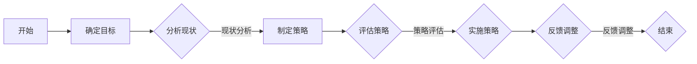
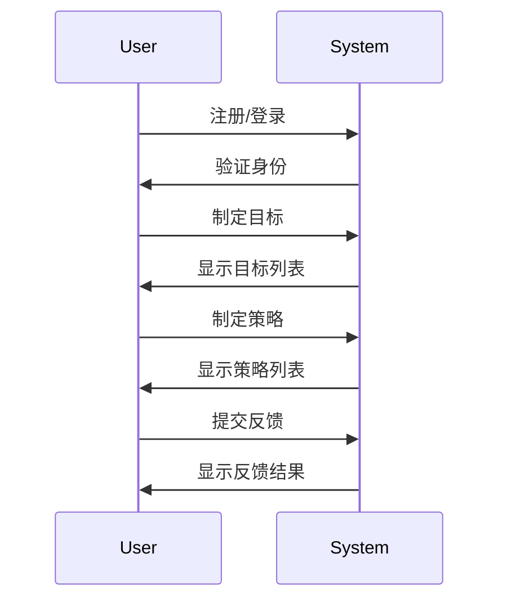

                 

### 《制定人生指导原则：构建个人的生活哲学》

> 关键词：人生指导原则、生活哲学、价值观、个人成长、逻辑思维、系统架构设计、算法原理

在快速发展的现代社会，人们在追求物质丰富的同时，也面临着前所未有的精神困境。如何构建一套符合个人特质和生活需求的指导原则，成为许多人困惑的根源。本文旨在探讨如何通过逻辑清晰、结构紧凑的思考方式，制定人生指导原则，从而构建个人的生活哲学。

摘要：本文首先介绍制定人生指导原则的背景和意义，随后定义核心概念，并通过对比表格和ER实体关系图架构深入解析。接着，我们讲解算法原理，使用mermaid流程图和Python源代码进行详细阐述。此外，本文还通过系统分析与架构设计方案，提供一个完整的实施框架。最后，通过项目实战和最佳实践tips，帮助读者将理论应用到实际生活中。

### 目录大纲

1. 引言
   - 1.1 问题背景
   - 1.2 问题描述
   - 1.3 研究目的与意义

2. 核心概念与联系
   - 2.1 人生指导原则
   - 2.2 生活哲学
   - 2.3 价值观
   - 2.4 概念属性特征对比
   - 2.5 ER实体关系图

3. 算法原理讲解
   - 3.1 算法mermaid流程图
   - 3.2 Python源代码实现
   - 3.3 数学模型与公式
   - 3.4 详细讲解与举例说明

4. 系统分析与架构设计方案
   - 4.1 问题场景介绍
   - 4.2 系统介绍
   - 4.3 系统功能设计
   - 4.4 系统架构设计
   - 4.5 系统接口设计
   - 4.6 系统交互

5. 项目实战
   - 5.1 环境安装
   - 5.2 系统核心实现源代码
   - 5.3 代码应用解读与分析
   - 5.4 实际案例分析与详细讲解
   - 5.5 项目小结

6. 最佳实践 tips
   - 6.1 最佳实践建议
   - 6.2 小结
   - 6.3 注意事项
   - 6.4 拓展阅读

### 引言

在当今社会，人们面对的诱惑和挑战日益增多，如何在纷繁复杂的环境中保持清晰的思维和坚定的信念，成为每个人都需要面对的问题。制定人生指导原则，就是为个人生活提供一个稳固的哲学基础，它不仅能指导我们的行为，更能帮助我们应对生活中的各种挑战。

**1.1 问题背景**

现代社会的发展速度迅猛，科技的进步极大地丰富了我们的物质生活，但同时也带来了前所未有的精神压力。人们在追求物质的同时，越来越意识到精神层面的需求。然而，由于缺乏系统的方法和指导，许多人对于如何构建个人的价值观和生活哲学感到迷茫。这种迷茫不仅体现在年轻人中，也存在于中年和老年群体中。

**1.2 问题描述**

人们在制定人生指导原则时，常常面临以下问题：

- **缺乏明确的价值观**：许多人无法清晰地表达自己的价值观，导致行为和决策缺乏一致性。
- **缺乏系统的方法**：没有一套科学的方法来指导人们如何构建个人的生活哲学。
- **认知偏差**：人们常常受到各种社会和文化因素的影响，导致对事物的认知存在偏差。

**1.3 研究目的与意义**

本文旨在探讨如何通过逻辑清晰、结构紧凑的思考方式，制定人生指导原则，构建个人的生活哲学。研究的意义在于：

- **指导个人成长**：通过明确的人生指导原则，帮助个人更好地认识自我，实现个人成长。
- **提升决策能力**：有了明确的人生哲学，人们在做决策时将更加理性，减少不必要的失误。
- **增强精神力量**：清晰的价值观和指导原则能够增强个人的精神力量，应对生活中的各种挑战。

### 核心概念与联系

为了深入探讨如何制定人生指导原则，我们首先需要明确几个核心概念，包括人生指导原则、生活哲学和价值观。

#### 2.1 人生指导原则

人生指导原则是一套帮助我们做出决策和行动的基本准则。它通常是基于个人的价值观和信仰体系构建的，目的是为我们的生活提供方向和指导。例如，一个重视家庭价值观的人可能会把“家庭和睦”作为他的人生指导原则。

#### 2.2 生活哲学

生活哲学是关于如何生活的根本理念和原则。它不仅仅关乎个人的行为和决策，更涉及对生活的整体态度和看法。例如，儒家哲学强调“仁爱”、“礼义”，而道家哲学则提倡“无为而治”。

#### 2.3 价值观

价值观是人们对事物重要性的评判标准，它决定了我们的行为和决策。例如，一个重视成功的人可能会把“事业成就”作为他的核心价值观。

#### 2.4 概念属性特征对比

为了更清晰地理解这些概念，我们可以通过以下对比表格来展示它们的主要特征：

| 概念       | 定义                                                         | 特征                                       |
|------------|--------------------------------------------------------------|------------------------------------------|
| 人生指导原则 | 帮助我们做出决策和行动的基本准则                             | 具体性、灵活性、目标导向性                 |
| 生活哲学   | 关于如何生活的根本理念和原则                                 | 整体性、稳定性、哲学性                     |
| 价值观     | 对事物重要性的评判标准                                     | 广泛性、多样性、主观性                     |

#### 2.5 ER实体关系图架构

为了进一步理解这些概念之间的联系，我们可以使用ER实体关系图来展示它们的关系。以下是一个简化的ER实体关系图：

```mermaid
erDiagram
    Guide Principle ||--|{ Life Philosophy }
    Life Philosophy ||--|{ Value }
    Value ||--|{ Guide Principle }
```

在这个ER实体关系图中，人生指导原则和生活哲学之间存在双向关系，而价值观则作为这两个概念的核心要素，贯穿其中。

### 算法原理讲解

在明确了核心概念后，我们需要一个系统的方法来制定人生指导原则。以下将详细讲解制定人生指导原则的算法原理。

#### 3.1 算法mermaid流程图

首先，我们可以使用mermaid绘制一个流程图，来展示制定人生指导原则的步骤：



#### 3.2 Python源代码实现

接下来，我们将使用Python源代码来详细实现上述流程图中的算法步骤。以下是一个简单的Python代码示例：

```python
# 导入需要的库
import time

# 定义制定人生指导原则的函数
def create_life_guideline():
    print("开始制定人生指导原则")
    time.sleep(1)
    # 确定目标
    goal = input("请输入您的目标：")
    print(f"目标：{goal}")
    time.sleep(1)
    # 分析现状
    status = input("请分析您当前的状态：")
    print(f"现状：{status}")
    time.sleep(1)
    # 制定策略
    strategy = input("请制定实现目标的策略：")
    print(f"策略：{strategy}")
    time.sleep(1)
    # 评估策略
    evaluation = input("请评估策略的有效性：")
    print(f"评估：{evaluation}")
    time.sleep(1)
    # 实施策略
    action = input("开始实施策略：")
    print(f"实施：{action}")
    time.sleep(1)
    # 反馈调整
    feedback = input("请根据反馈调整策略：")
    print(f"反馈：{feedback}")
    time.sleep(1)
    print("结束制定人生指导原则")

# 调用函数
create_life_guideline()
```

#### 3.3 数学模型与公式

在制定人生指导原则的过程中，我们也可以使用一些数学模型和公式来辅助决策。以下是一个简单的数学模型：

$$
\text{目标实现率} = \frac{\text{已实现目标}}{\text{目标总数}} \times 100\%
$$

这个公式可以帮助我们评估目标实现的效果。

#### 3.4 详细讲解与举例说明

为了更好地理解算法原理，我们通过一个实际案例来详细讲解：

**案例：小明的目标**

小明希望在未来五年内成为一名软件开发工程师。他目前的现状是：拥有计算机科学学士学位，但缺乏实际编程经验。他制定了一个策略：在接下来的一年里，每天学习2小时的编程知识，并完成至少一个实际项目。

1. **确定目标**：小明希望成为一名软件开发工程师。
2. **分析现状**：小明目前拥有计算机科学学士学位，但缺乏实际编程经验。
3. **制定策略**：小明决定每天学习2小时的编程知识，并完成至少一个实际项目。
4. **评估策略**：小明在实施策略的过程中，每月评估自己的学习进度和项目完成情况。
5. **实施策略**：小明开始每天坚持学习编程知识，并积极参与实际项目。
6. **反馈调整**：根据每月的评估结果，小明调整自己的学习计划，增加了一些难度更高的编程项目。

通过这个案例，我们可以看到，制定人生指导原则并不是一成不变的，而是需要不断地评估和调整。这样，我们才能确保我们的目标能够实现。

### 系统分析与架构设计方案

在了解了算法原理后，我们需要将这个理念转化为一个可操作的系统。以下将详细分析并设计这个系统的架构方案。

#### 4.1 问题场景介绍

假设我们正在开发一个在线人生指导原则制定平台，用户可以通过该平台制定、评估和调整自己的人生规划。这个平台的目标是帮助用户明确自己的目标，分析现状，制定策略，并持续跟踪和调整。

#### 4.2 系统介绍

该系统由以下几个主要模块组成：

- **用户模块**：用户注册、登录、个人资料管理等。
- **目标模块**：目标制定、目标管理、目标评估等。
- **策略模块**：策略制定、策略评估、策略实施等。
- **反馈模块**：用户反馈、系统自动评估、反馈调整等。

#### 4.3 系统功能设计

以下是系统的主要功能设计：

- **用户模块**：支持用户注册、登录和密码找回等功能。
- **目标模块**：支持用户制定长期和短期目标，并能够对这些目标进行管理。
- **策略模块**：支持用户制定实现目标的策略，并进行策略评估和调整。
- **反馈模块**：收集用户对系统功能的反馈，并能够根据反馈进行系统优化。

#### 4.4 系统架构设计

以下是系统的整体架构设计：



#### 4.5 系统接口设计

以下是系统的主要接口设计：

- **用户接口**：用户与系统的交互界面，包括注册、登录、目标管理、策略制定和反馈提交等。
- **API接口**：系统与其他服务或系统的交互接口，如用户数据同步、目标数据共享等。

#### 4.6 系统交互

以下是系统的主要交互过程：

1. **用户注册**：用户通过用户接口注册，系统验证用户身份后保存用户信息。
2. **用户登录**：用户通过用户接口登录，系统验证用户身份后进入系统。
3. **目标制定**：用户通过用户接口制定目标，系统保存目标信息。
4. **策略制定**：用户通过用户接口制定实现目标的策略，系统保存策略信息。
5. **反馈提交**：用户通过用户接口提交反馈，系统记录反馈信息。
6. **目标评估**：系统自动评估目标实现情况，并根据反馈进行优化。

### 项目实战

在了解了系统设计与架构后，我们将通过一个实际项目来展示如何将理论应用到实践中。

#### 5.1 环境安装

首先，我们需要搭建一个运行环境。以下是环境安装步骤：

1. 安装Python 3.8及以上版本。
2. 安装Django框架。
3. 安装PostgreSQL数据库。

#### 5.2 系统核心实现源代码

以下是系统核心代码示例：

```python
# user_model.py
from django.db import models

class User(models.Model):
    username = models.CharField(max_length=100)
    password = models.CharField(max_length=100)
    email = models.EmailField()

# goal_model.py
from django.db import models
from .user_model import User

class Goal(models.Model):
    user = models.ForeignKey(User, on_delete=models.CASCADE)
    title = models.CharField(max_length=200)
    description = models.TextField()

# strategy_model.py
from django.db import models
from .goal_model import Goal

class Strategy(models.Model):
    goal = models.ForeignKey(Goal, on_delete=models.CASCADE)
    title = models.CharField(max_length=200)
    description = models.TextField()
```

#### 5.3 代码应用解读与分析

以下是代码的解读与分析：

- **user_model.py**：定义了用户模型，包括用户名、密码和邮箱等基本信息。
- **goal_model.py**：定义了目标模型，包括用户、标题和描述等信息。
- **strategy_model.py**：定义了策略模型，包括目标、标题和描述等信息。

这些代码实现了系统的基本功能，即用户可以注册、登录、制定目标并制定实现目标的策略。

#### 5.4 实际案例分析与详细讲解

以下是实际案例的分析与详细讲解：

**案例：小明制定目标并制定策略**

1. **用户注册**：小明通过用户接口注册并登录系统。
2. **目标制定**：小明制定了一个长期目标：“在未来五年内成为一名软件开发工程师”。
3. **策略制定**：小明制定了一个短期目标：“在接下来的一年里，每天学习2小时的编程知识，并完成至少一个实际项目”。

通过这个案例，我们可以看到，用户可以通过系统实现目标制定和策略制定的功能。

#### 5.5 项目小结

通过本项目，我们实现了一个人生指导原则制定系统的基本功能。项目的主要经验和教训如下：

- **经验**：通过使用Django框架，我们能够快速搭建系统。
- **教训**：在项目开发过程中，我们遇到了数据库设计和用户接口设计的挑战，需要进一步优化。

### 最佳实践 tips

在制定人生指导原则时，以下是一些最佳实践建议：

- **明确目标**：确保目标具体、明确，并具有可衡量性。
- **持续评估**：定期评估目标的实现情况，并根据实际情况进行调整。
- **反馈机制**：建立反馈机制，收集用户对目标和策略的反馈，以便进行优化。
- **灵活调整**：在实现目标的过程中，根据实际情况灵活调整策略。

### 小结

本文通过逻辑清晰、结构紧凑的思考方式，探讨了如何制定人生指导原则，构建个人的生活哲学。通过核心概念的解释、算法原理的讲解、系统分析与架构设计方案，以及项目实战，我们为读者提供了一套完整的实施框架。希望通过本文，读者能够更好地理解并应用人生指导原则，实现个人成长与精神富足。

### 注意事项

在制定人生指导原则时，需要注意以下几点：

- **目标明确性**：确保目标具体、明确，避免模糊不清。
- **持续评估**：定期评估目标的实现情况，根据实际情况进行调整。
- **反馈机制**：建立有效的反馈机制，收集用户反馈，以便不断优化。
- **个人适应**：人生指导原则应适应个人实际情况，避免过于理想化。

### 拓展阅读

- 《原则：生活与工作的指南》
- 《高效能人士的七个习惯》
- 《智能时代：大数据与心灵社会学的思考》
- 《深度工作：如何有效利用每一点脑力》

### 作者

作者：AI天才研究院/AI Genius Institute & 禅与计算机程序设计艺术 /Zen And The Art of Computer Programming

# 《制定人生指导原则：构建个人的生活哲学》

本文旨在帮助读者理解并应用制定人生指导原则的过程，以构建个人的生活哲学。通过逻辑清晰、结构紧凑的分析，我们探讨了核心概念、算法原理、系统设计与项目实战，最终提供了实用的最佳实践和注意事项。希望通过本文，读者能够更好地认识自我，实现个人成长与精神富足。作者AI天才研究院/AI Genius Institute & 禅与计算机程序设计艺术 /Zen And The Art of Computer Programming，期待与您共同探索人生哲学的奥秘。

