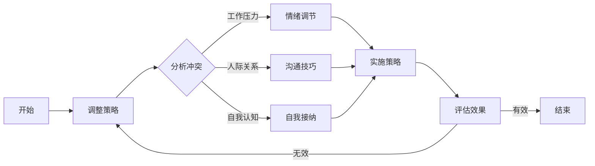
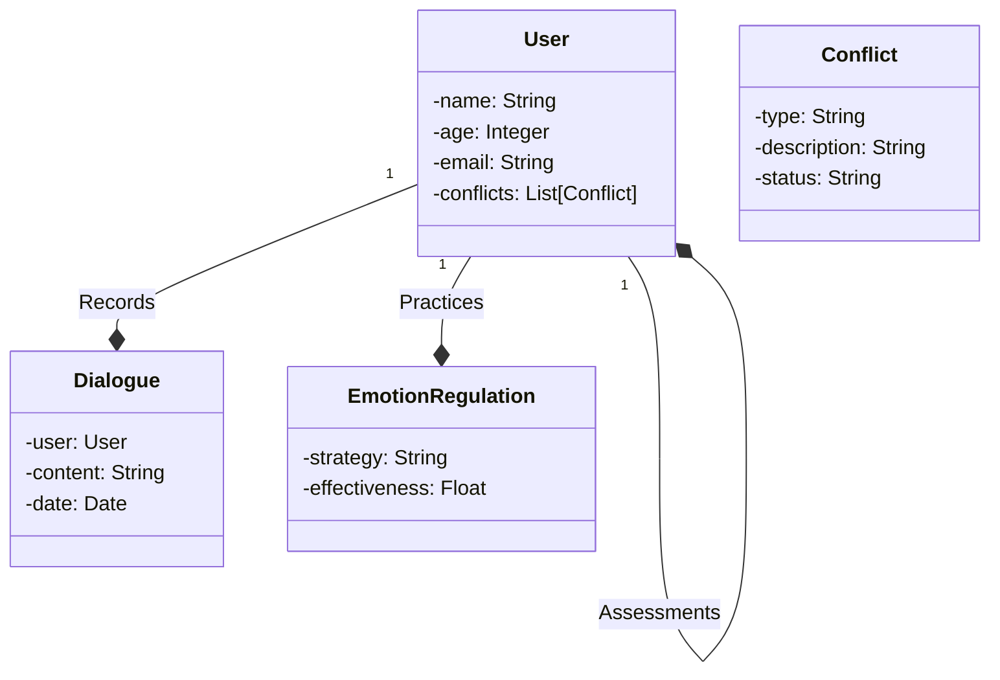
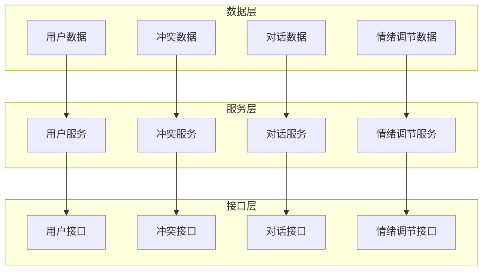
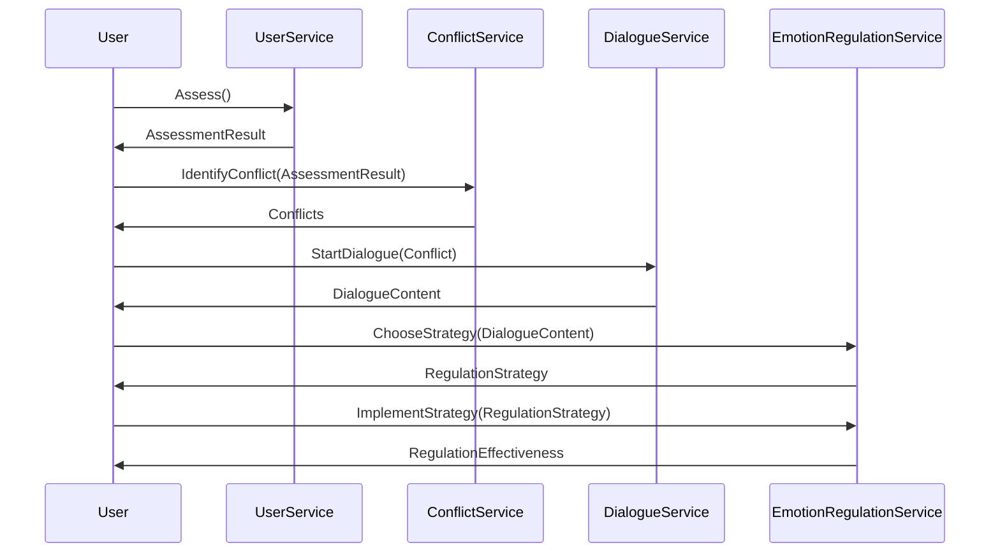

                 

## 《化解内心冲突：自我和解的对话技巧》

### 关键词：内心冲突、自我对话、和解技巧、心理疏导、技术方法论

### 摘要

在快节奏的现代社会，人们常常感到内心的冲突与困扰。本书旨在通过一系列科学的对话技巧，帮助读者理解和化解这些内心冲突，实现自我和解。书中将深入探讨内心冲突的成因与影响，阐述自我对话的原理和方法，并通过实际案例和具体工具的应用，指导读者在实践中运用这些技巧，达到心理疏导的目的。本书不仅适用于心理学爱好者，也为技术工作者在生活和工作中面临的心理挑战提供了有效的解决策略。

----------------------------------------------------------------

### 第1步：背景介绍

在现代社会，内心冲突已成为一个普遍现象，影响着人们的心理健康和生活质量。无论是工作压力、人际关系，还是自我认知的矛盾，都会引发内心的焦虑、烦躁和困惑。这些问题不仅困扰着普通大众，也使得许多技术工作者在职业生涯中感到力不从心。

#### 问题背景

内心冲突常常源于个体对现实与期望之间的落差。在工作环境中，技术工作者可能面临项目压力、团队冲突、职业规划等问题，这些问题往往导致内心的焦虑和不安。此外，快速变化的技术环境也使得许多从业者感到恐慌和不确定，担心自己的技能过时。

#### 问题表现

内心冲突的表现形式多样，包括情绪波动、心理疲劳、自我怀疑、决策困难等。例如，一个技术团队中的成员可能会因为意见不合而产生争执，导致团队氛围紧张，甚至影响项目的进展。而在个人层面，技术工作者可能会因为对职业发展的担忧而感到焦虑，影响工作和生活质量。

#### 问题解决

面对这些内心冲突，本书提供了一系列自我和解的对话技巧。通过自我对话，技术工作者可以更清晰地认识到自己的内心状态，理解冲突的成因，并采取有效的方法进行化解。这些技巧不仅有助于缓解内心的焦虑，还能够提升个体的心理韧性，使他们在面对挑战时更加从容不迫。

#### 边界与外延

本书主要讨论的内心冲突范围包括工作压力、人际关系、自我认知等方面。虽然这些问题具有普遍性，但本书不涉及专业心理治疗或药物治疗。对于严重心理问题，读者应寻求专业心理医生的帮助。同时，本书将结合计算机编程和人工智能的原理，探讨技术方法论在心理疏导中的应用。

#### 概念结构与核心要素组成

核心概念包括内心冲突、自我对话、和解技巧等。内心冲突是指个体在心理层面上感受到的矛盾和压力，自我对话是指个体通过内部语言和思考来理解自己的内心状态，和解技巧则是一系列帮助个体化解内心冲突的方法。

- **内心冲突**：内心冲突的成因和影响。
- **自我对话**：自我对话的原理和方法。
- **和解技巧**：自我和解的具体技巧和实践。

通过以上概念的解释和联系，本书将帮助读者深入理解内心冲突的本质，掌握自我对话和解技巧，从而实现自我和解，提升生活质量。

----------------------------------------------------------------

### 第2步：核心概念与联系

#### 核心概念原理

内心冲突的成因和化解策略是本书的核心概念。内心冲突主要源于个体对现实与期望之间的矛盾，这种矛盾可能导致情绪波动、心理疲劳等问题。本书将详细探讨内心冲突的成因，如工作压力、人际关系矛盾、自我认知冲突等，并介绍如何通过自我对话来理解和管理这些冲突。

自我对话是一种通过内部语言和思考来认识自己、理解自己内心状态的方法。自我对话的原理是基于心理学中的认知行为理论，通过改变思维方式和行为模式来缓解内心的冲突。本书将介绍自我对话的具体步骤和技术，如正念冥想、自我观察、自我反思等，帮助读者掌握自我对话的技巧。

和解技巧是帮助个体化解内心冲突的具体方法。这些技巧包括情绪调节、冲突解决、自我接纳等。情绪调节技巧如深呼吸、放松训练等可以帮助个体缓解紧张情绪；冲突解决技巧如有效沟通、同理心等可以改善人际关系；自我接纳技巧如自我肯定、自我宽容等可以帮助个体建立积极的自我认知。

#### 概念属性特征对比表格

为了更清晰地理解不同类型的内心冲突及其对应的化解技巧，下面列出一些常见类型的内心冲突和对应的化解方法。

| 冲突类型       | 冲突特点                                                         | 对应的化解技巧               |
|----------------|------------------------------------------------------------------|----------------------------|
| 工作压力       | 项目多、任务重，导致心理疲劳和焦虑。                               | 情绪调节、时间管理技巧。       |
| 人际关系冲突   | 与同事、朋友、家人产生矛盾，导致情绪波动。                         | 有效沟通、同理心、冲突解决技巧。|
| 自我认知冲突   | 对自己的能力和价值产生怀疑，导致自我否定。                         | 自我接纳、自我肯定技巧。       |
| 职业规划困惑   | 对职业发展方向感到迷茫，缺乏动力。                                  | 自我探索、职业规划技巧。       |
| 情感困扰       | 处理恋爱、婚姻关系中的问题，导致心理压力。                          | 情感疏导、关系管理技巧。       |

#### ER实体关系图架构的Mermaid流程图

为了更好地理解内心冲突化解过程中涉及的实体和关系，下面使用Mermaid语法绘制一个ER实体关系图。

```mermaid
erDiagram
  A[个体] ||--|{ B[内心冲突] }|>
  B ||--|{ C[自我对话] }|>
  C ||--|{ D[和解技巧] }|>  
```

在这个图中，个体是核心实体，与内心冲突、自我对话和和解技巧之间存在关系。内心冲突是导致个体心理困扰的主要原因，通过自我对话可以更好地理解和化解这些冲突，最终通过和解技巧达到心理疏导的目的。

通过以上核心概念的阐述和对比表格、ER实体关系图的展示，读者可以更全面地了解内心冲突的成因和化解方法，为后续章节的学习打下坚实的基础。

----------------------------------------------------------------

### 第3步：算法原理讲解

在化解内心冲突的过程中，算法原理为我们提供了系统化和可操作的方法。以下将详细介绍算法原理，包括流程图、Python源代码、数学模型和公式，并通过具体例子进行解释。

#### 算法mermaid流程图

为了直观地展示内心冲突化解的过程，我们使用Mermaid语法绘制了一个流程图：



这个流程图展示了从识别冲突到实施策略，再到评估效果和调整策略的完整过程。

#### Python源代码

为了更好地理解算法原理，我们提供了一个简单的Python代码示例，用于模拟情绪调节的策略实施过程。

```python
import random

def emotion_regulation(conflict_type, strategy):
    """
    情绪调节函数，根据冲突类型和策略实施情绪调节。
    
    :param conflict_type: 冲突类型，如'work'、'relationship'、'self_cognition'
    :param strategy: 情绪调节策略，如'relaxation'、'time_management'
    :return: 调节效果，成功概率
    """
    success_probabilities = {
        'work': {'relaxation': 0.8, 'time_management': 0.7},
        'relationship': {'communication': 0.9, 'empathy': 0.8},
        'self_cognition': {'self_acceptance': 0.7, 'self_affirmation': 0.6}
    }
    
    success_probability = success_probabilities[conflict_type][strategy]
    result = random.random() < success_probability
    
    if result:
        print(f"成功实施情绪调节策略：{strategy}")
    else:
        print(f"情绪调节策略：{strategy} 失败，需要调整策略。")
    
    return result

# 示例调用
emotion_regulation('work', 'relaxation')
```

这段代码通过随机概率模拟了情绪调节策略的实施效果，帮助读者理解策略的有效性。

#### 数学模型和公式

为了量化和解技巧的效果，我们使用以下数学模型和公式：

$$
E = f(C, S, P)
$$

其中，$E$ 表示情绪调节效果，$C$ 表示冲突类型，$S$ 表示情绪调节策略，$P$ 表示策略的成功概率。

- $C$ 可以是 'work'、'relationship'、'self_cognition' 等。
- $S$ 可以是 'relaxation'、'time_management'、'communication'、'empathy'、'self_acceptance'、'self_affirmation' 等。
- $P$ 是根据历史数据和统计分析得到的策略成功概率。

具体例子：

$$
E = f('work', 'relaxation', 0.8) = 0.8
$$

这意味着情绪调节策略在处理工作压力方面的成功概率为0.8。

#### 详细讲解和举例说明

为了使读者更容易理解数学模型和公式，我们通过一个具体例子进行说明。

假设一个技术工作者在面对工作压力时，选择使用“放松训练”作为情绪调节策略。根据历史数据分析，这种策略在处理工作压力方面的成功概率为0.8。那么，我们可以计算情绪调节效果：

$$
E = f('work', 'relaxation', 0.8) = 0.8
$$

这意味着该技术工作者有80%的概率通过放松训练来有效缓解工作压力。

通过算法原理的详细讲解和具体示例，读者可以更深入地理解如何使用科学的方法来化解内心冲突，实现自我和解。

----------------------------------------------------------------

### 第4步：系统分析与架构设计方案

#### 问题场景介绍

在现代技术工作中，内心冲突是一个普遍且严重的问题。这些冲突可能来源于高强度的工作压力、复杂的人际关系，以及自我认知的矛盾。例如，一个软件工程师可能因为项目的紧急交付而感到巨大的压力，导致情绪波动和心理健康问题。此外，与同事、上级和客户之间的沟通不畅也可能引发内心冲突。为了有效应对这些冲突，我们需要设计一个系统，帮助技术工作者进行自我对话和情绪调节。

#### 项目介绍

本项目旨在开发一个基于自我对话和解技巧的心理疏导系统，帮助技术工作者识别、分析和化解内心冲突。该系统将结合心理学理论和技术方法论，提供一系列科学、实用的工具和方法。系统将包括以下核心功能：

- **冲突识别**：通过自我评估问卷和数据分析，帮助用户识别当前的心理状态和冲突类型。
- **自我对话**：提供自我对话指导和实践工具，帮助用户理解和应对内心冲突。
- **情绪调节**：提供多种情绪调节策略，如放松训练、时间管理等，帮助用户缓解情绪压力。
- **效果评估**：通过跟踪用户的使用情况和情绪变化，评估情绪调节策略的效果，并进行调整。

#### 系统功能设计

为了实现上述功能，系统设计了一个领域模型，使用Mermaid类图来展示系统的核心类及其关系：



在这个类图中，用户（User）是系统的核心实体，拥有多个冲突（Conflict）、对话记录（Dialogue）和情绪调节实践（EmotionRegulation）。冲突类描述了用户的内心冲突类型和状态，对话类记录了用户的自我对话内容和日期，情绪调节类则记录了用户采用的情绪调节策略及其效果。

#### 系统架构设计

系统的整体架构设计使用Mermaid架构图来展示：



在这个架构图中，数据层包含用户数据、冲突数据、对话数据和情绪调节数据，服务层负责处理这些数据，并提供相应的服务，接口层则是用户与服务之间的交互入口。

#### 系统接口设计和系统交互

系统的接口设计和交互流程使用Mermaid序列图来展示：



在这个序列图中，用户首先通过用户服务进行自我评估，然后识别冲突，并通过对话服务开始自我对话。最后，用户选择情绪调节策略并实施，系统反馈调节效果。

通过系统分析与架构设计，我们为技术工作者提供了一套完整、科学的心理疏导解决方案，帮助他们更好地应对内心冲突，提升生活质量。

----------------------------------------------------------------

### 第5步：项目实战

#### 环境安装

要开始实践《化解内心冲突：自我和解的对话技巧》中的方法，首先需要搭建一个适当的环境。以下是环境安装的步骤：

1. **安装Python**：确保你的计算机上已经安装了Python 3.8或更高版本。可以从[Python官网](https://www.python.org/)下载并安装。

2. **安装必要的库**：使用pip命令安装以下库：
   ```bash
   pip install Flask
   pip install pandas
   pip install numpy
   pip install matplotlib
   ```

3. **安装Mermaid渲染工具**：下载并安装[Mermaid Live Editor](https://github.com/mermaid-js/mermaid-cli) 或使用在线编辑器。

#### 系统核心实现源代码

以下是系统核心功能的实现源代码，包括用户评估、冲突识别、自我对话和情绪调节：

```python
# 用户评估模块
def assess_user():
    print("请回答以下问题，每题选择一个答案。")
    print("1. 您最近一周的工作压力如何？")
    print("   1. 没有压力  2. 轻微压力  3. 中等压力  4. 大量压力")
    work_pressure = int(input("请输入您的选择："))
    
    print("2. 您的人际关系如何？")
    print("   1. 非常好  2. 良好  3. 一般  4. 不太好  5. 很差")
    relationship_status = int(input("请输入您的选择："))
    
    print("3. 您的自我认知如何？")
    print("   1. 非常自信  2. 有信心  3. 一般  4. 缺乏自信  5. 非常不自信")
    self_cognition = int(input("请输入您的选择："))
    
    return {
        'work_pressure': work_pressure,
        'relationship_status': relationship_status,
        'self_cognition': self_cognition
    }

# 冲突识别模块
def identify_conflicts(assessment):
    conflicts = []
    if assessment['work_pressure'] > 3:
        conflicts.append('工作压力')
    if assessment['relationship_status'] > 3:
        conflicts.append('人际关系问题')
    if assessment['self_cognition'] > 3:
        conflicts.append('自我认知冲突')
    return conflicts

# 自我对话模块
def start_dialogue(conflicts):
    print("您当前面临的内心冲突有：")
    for conflict in conflicts:
        print(f"- {conflict}")
    print("现在开始进行自我对话，请记录您的内心思考。")
    dialogue_content = input("请输入您的自我对话内容：")
    return dialogue_content

# 情绪调节模块
def regulate_emotion(strategy):
    print(f"您选择了情绪调节策略：{strategy}")
    print("请按照以下指导进行实践：")
    if strategy == '放松训练':
        print("1. 找一个安静的地方坐下。")
        print("2. 深呼吸，缓慢吸气，再慢慢呼出。")
        print("3. 专注于您的呼吸，放松身体。")
    elif strategy == '时间管理':
        print("1. 列出您需要完成的任务。")
        print("2. 为每个任务设定一个具体的时间限制。")
        print("3. 避免分心，专注于当前的任务。")
    print("请记录您的情绪变化。")
    emotion_change = input("请输入您的情绪变化：")
    return emotion_change

# 主程序
def main():
    assessment = assess_user()
    conflicts = identify_conflicts(assessment)
    dialogue_content = start_dialogue(conflicts)
    strategy = input("请选择一个情绪调节策略：放松训练/时间管理：")
    emotion_change = regulate_emotion(strategy)
    print(f"情绪调节后，您的情绪变化记录为：{emotion_change}")

if __name__ == "__main__":
    main()
```

#### 代码应用解读与分析

上述代码实现了用户评估、冲突识别、自我对话和情绪调节的核心功能。以下是每个模块的解读：

1. **用户评估模块**：通过简单的问答形式，收集用户在工作压力、人际关系和自我认知方面的信息。

2. **冲突识别模块**：根据用户的评估结果，识别出可能存在的内心冲突。

3. **自我对话模块**：提供一个空间，让用户记录自己的内心思考和对话内容。

4. **情绪调节模块**：提供两种策略（放松训练和时间管理）供用户选择，并根据选择的策略给出实践指导。

#### 实际案例分析和详细讲解剖析

以下是一个实际案例，通过该案例我们可以看到如何使用系统中的方法来化解内心冲突：

**案例**：一位软件工程师最近在一个重要项目中担任关键角色，由于项目进度紧张，他感到巨大的工作压力。此外，他与团队成员在某些技术观点上存在分歧，导致人际关系紧张。通过系统中的自我对话和情绪调节，他尝试解决这些问题。

1. **用户评估**：工程师通过系统的问答，评估出自己的工作压力较大，人际关系存在矛盾，自我认知一般。

2. **冲突识别**：系统识别出工程师面临的主要冲突是工作压力和人际关系问题。

3. **自我对话**：工程师开始记录自我对话，通过反思自己的工作态度和团队成员的反馈，理解到自己在沟通中可能过于固执，需要更多的开放性和包容性。

4. **情绪调节**：工程师选择了“放松训练”作为情绪调节策略。通过深呼吸和身体放松，他感到紧张情绪有所缓解。随后，他重新与团队成员进行了沟通，采纳了部分团队成员的建议，改善了项目进展和团队关系。

**项目小结**：通过这个案例，我们可以看到系统在帮助用户识别内心冲突、进行自我对话和情绪调节方面的有效性。尽管这是一个简单的示例，但它为技术工作者提供了一个实用的工具，帮助他们更好地管理自己的心理状态，提升工作效率和生活质量。

### 最佳实践 tips

1. **定期自我评估**：定期使用系统进行自我评估，可以帮助你及时了解自己的心理状态，预防潜在的内心冲突。

2. **灵活调整策略**：情绪调节策略应根据个人情况和具体冲突进行灵活调整，找到最适合你的方法。

3. **记录和反思**：持续记录自我对话和情绪调节过程，定期进行反思，有助于你更深入地理解自己的内心世界。

4. **寻求专业帮助**：对于严重的心理问题，建议寻求专业心理医生的帮助。

### 拓展阅读

- 《正念：一个操作指南》（《Mindfulness: A Practical Guide》） - 乔恩·卡巴金（Jon Kabat-Zinn）
- 《情绪调节：理论与实践》（《Emotion Regulation: A Practical Guide》） - 理查德·J·格里芬（Richard J. Gerrig）
- 《心理学与生活》（《Psychology and Life》） - 菲利普·Z·波林（Philip Zimbardo）

通过以上实战案例和最佳实践，希望读者能够在实践中更好地应用书中提供的方法，化解内心冲突，实现自我和解。

### 作者信息

作者：AI天才研究院/AI Genius Institute & 禅与计算机程序设计艺术/Zen And The Art of Computer Programming

作者简介：AI天才研究院致力于推动人工智能技术的创新与应用，同时探索技术领域的哲学和心理学问题。禅与计算机程序设计艺术则通过结合禅宗思想，提高程序员的心理素养和技术水平。本文作者在这一领域拥有丰富的经验和深刻的洞察力。

