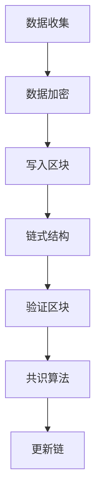
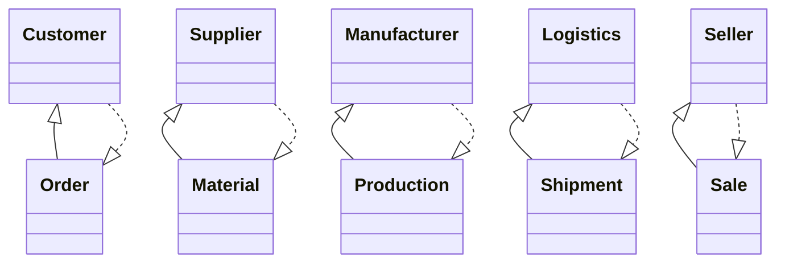
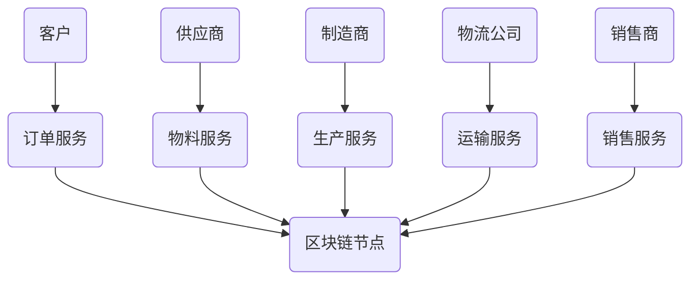
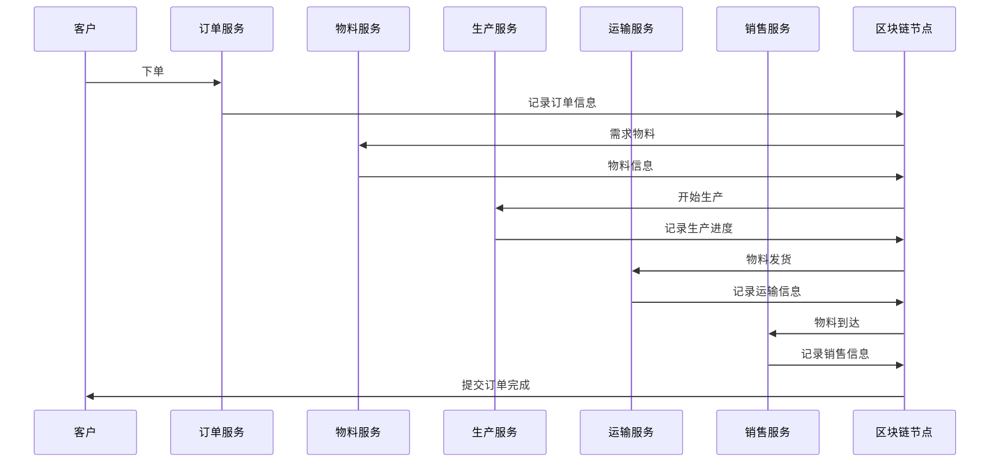

                 

----------------------------------------------------------------
# 文章标题：区块链在供应链管理中的应用：提高透明度和可追溯性

## 关键词
- 区块链
- 供应链管理
- 透明度
- 可追溯性
- 智能合约

## 摘要
本文将探讨区块链技术在供应链管理中的应用，重点关注如何通过区块链提高供应链的透明度和可追溯性。文章分为以下几个部分：背景介绍、核心概念与联系、算法原理讲解、数学模型与公式、系统分析与架构设计方案、项目实战以及最佳实践 tips 和小结。通过详细的案例分析，本文旨在为供应链管理从业者提供有价值的参考和指导。

----------------------------------------------------------------
## 背景介绍

### 问题背景

供应链管理是现代经济体系中至关重要的一环，它涉及从原材料采购到最终产品交付的整个过程。随着全球化的深入发展，供应链变得越来越复杂，涵盖了多个国家和地区、多种运输方式和众多参与者。然而，这种复杂性也带来了诸多挑战，尤其是在信息透明度和数据可追溯性方面。

传统的供应链管理存在以下问题：
1. **信息不透明**：供应链各环节的信息往往分散在不同系统和管理者之间，导致信息不透明，难以实时获取。
2. **数据篡改**：供应链中的数据容易受到恶意篡改，影响供应链的信任基础。
3. **物流效率低下**：物流流程复杂，缺乏有效的监控和追踪机制，导致物流效率低下。

### 问题描述

供应链管理中的主要问题包括：
1. **信息共享难题**：各环节信息难以有效共享，导致供应链协调不畅。
2. **数据完整性**：供应链中的数据容易受到篡改，影响供应链的可靠性和可信度。
3. **物流追踪困难**：物流过程中缺乏实时追踪和监控机制，导致物流过程不透明。

### 问题解决

区块链技术的出现为供应链管理带来了新的解决思路。区块链是一种去中心化的分布式数据库，具有以下特点：
1. **去中心化**：通过多个节点共同维护数据，无需依赖中心机构。
2. **不可篡改**：一旦数据被记录在区块链上，就无法被篡改，保证了数据的真实性和完整性。
3. **透明性**：所有节点都可以查看区块链上的数据，提高了供应链的透明度。

通过区块链技术，可以实现以下解决方案：
1. **信息共享**：区块链可以实时记录供应链各环节的信息，确保信息透明、实时、共享。
2. **数据加密**：使用加密技术确保数据在传输过程中的安全性。
3. **智能合约**：通过智能合约实现供应链各环节的自动化和智能化管理。

### 边界与外延

区块链在供应链管理中的应用不仅限于传统的物流和供应链环节，还扩展到了金融服务、食品溯源、医药安全等多个领域。例如，在食品溯源领域，区块链技术可以确保食品从生产到消费的全过程信息透明可追溯，提高食品安全性。

### 概念结构与核心要素组成

区块链在供应链管理中的应用涉及以下几个核心要素：

1. **去中心化网络**：通过多个节点共同维护一个分布式数据库，确保数据分散、不可篡改。
2. **加密技术**：使用加密技术确保数据在传输过程中的安全性和隐私性。
3. **智能合约**：通过智能合约实现供应链各环节的自动化和智能化管理。

## 核心概念与联系

### 核心概念原理

1. **区块链**：区块链是一种去中心化的分布式数据库，由多个区块组成，每个区块包含一定数量的交易记录。区块链通过加密技术确保数据的安全性和不可篡改性。

2. **智能合约**：智能合约是一种自执行的合同，基于区块链技术。智能合约的条款在区块链上公开透明，一旦满足条件，智能合约会自动执行。

3. **供应链管理**：供应链管理涉及从原材料采购到最终产品交付的整个过程，包括多个环节和参与者。供应链管理的目标是确保产品高效、可靠地流动。

### 概念属性特征对比表格

| 特征           | 区块链                | 智能合约                | 供应链管理                 |
|----------------|----------------------|-------------------------|----------------------------|
| 数据结构       | 分布式数据库          | 条款代码                 | 多环节流程                 |
| 透明性         | 全网可查              | 条款公开                 | 数据共享                   |
| 安全性         | 加密技术              | 执行安全                 | 信息化监管                 |
| 可追溯性       | 不可篡改的记录        | 自动执行条款             | 流程监控                   |

### ER实体关系图架构的 Mermaid 流�程图

```mermaid
erDiagram
    商品 -->|1| 供应商
    供应商 -->|1| 生产商
    生产商 -->|1| 零售商
    零售商 -->|1| 消费者
    商品 ||--|{ | 订单 | }
    供应商 ||--|{ | 物流信息 | }
    生产商 ||--|{ | 生产流程 | }
    零售商 ||--|{ | 销售信息 | }
    消费者 ||--|{ | 消费行为 | }
```

----------------------------------------------------------------

## 算法原理讲解

### 算法 Mermaid 流程图

区块链在供应链管理中的应用涉及多个步骤，包括数据收集、加密、存储和验证。以下是一个简化的 Mermaid 流程图，描述了区块链在供应链管理中的应用流程：



### Python 源代码阐述

以下是一个简单的 Python 源代码示例，用于演示区块链的基本操作：

```python
import hashlib
import json
from time import time

class Block:
    def __init__(self, index, transactions, timestamp, previous_hash):
        self.index = index
        self.transactions = transactions
        self.timestamp = timestamp
        self.previous_hash = previous_hash
        self.hash = self.compute_hash()

    def compute_hash(self):
        block_string = json.dumps(self.__dict__, sort_keys=True)
        return hashlib.sha256(block_string.encode()).hexdigest()

class Blockchain:
    def __init__(self):
        self.unconfirmed_transactions = []
        self.chain = []
        self.create_genesis_block()

    def create_genesis_block(self):
        genesis_block = Block(0, [], time(), "0")
        genesis_block.hash = genesis_block.compute_hash()
        self.chain.append(genesis_block)

    def add_new_transaction(self, transaction):
        self.unconfirmed_transactions.append(transaction)

    def mine(self):
        if not self.unconfirmed_transactions:
            return False
        
        last_block = self.chain[-1]
        new_block = Block(index=last_block.index + 1,
                          transactions=self.unconfirmed_transactions,
                          timestamp=time(),
                          previous_hash=last_block.hash)
        
        new_block.hash = new_block.compute_hash()
        self.chain.append(new_block)
        self.unconfirmed_transactions = []
        return new_block.index

    def is_chain_valid(self):
        for i in range(1, len(self.chain)):
            current = self.chain[i]
            previous = self.chain[i - 1]
            if current.hash != current.compute_hash():
                return False
            if current.previous_hash != previous.hash:
                return False
        return True

# 创建区块链实例
blockchain = Blockchain()

# 添加新交易
blockchain.add_new_transaction({"from": "Alice", "to": "Bob", "amount": 10})

# 挖掘新区块
blockchain.mine()

# 打印区块链
print(blockchain.chain)
```

### 算法原理的数学模型和公式

区块链算法的核心在于其加密机制和链式结构。以下是区块链算法原理的数学模型和公式：

1. **哈希函数**：哈希函数是一种将任意长度的输入数据映射为固定长度的输出数据的函数。常见的哈希函数有 SHA-256。

   公式：`H = SHA-256(input_data)`

2. **链式结构**：区块链通过将每个区块的哈希值与上一个区块的哈希值相连，形成一个链式结构。

   公式：`current_hash = previous_hash + current_data`

3. **工作量证明**：为了防止恶意攻击，区块链采用工作量证明（Proof of Work, PoW）算法。矿工需要解决一个复杂的数学问题，以获得生成新区块的权限。

   公式：`nonce * difficulty <= target`

   其中，`nonce` 是矿工随机生成的数，`difficulty` 是难度系数，`target` 是目标值。

### 详细讲解和举例说明

1. **哈希函数的应用**：哈希函数在区块链中用于确保数据的唯一性和完整性。例如，在一个区块中，每个交易记录都会通过哈希函数生成一个唯一的哈希值。如果交易记录被篡改，哈希值将发生变化，从而确保数据不被篡改。

   示例：
   ```python
   transaction_data = {"from": "Alice", "to": "Bob", "amount": 10}
   hash_value = hashlib.sha256(json.dumps(transaction_data, sort_keys=True).encode()).hexdigest()
   print(hash_value)
   ```

2. **链式结构的原理**：区块链通过将每个区块的哈希值与上一个区块的哈希值相连，形成一个链式结构。这种结构确保了区块链的不可篡改性。如果某个区块被篡改，那么该区块及其后续所有区块的哈希值都会发生变化，从而被区块链网络中的其他节点识别。

   示例：
   ```mermaid
   graph TB
       A[Block 1] --> B[Block 2]
       B --> C[Block 3]
       C --> D[Block 4]
   ```

3. **工作量证明的应用**：在区块链网络中，矿工需要通过解决一个复杂的数学问题（如工作量证明算法）来获得生成新区块的权限。这个过程需要大量的计算资源，从而确保区块链网络的稳定性。

   示例：
   ```python
   target = "0" * 64  # 目标值
   nonce = 0
   while True:
       hash_value = hashlib.sha256(f"{nonce} {difficulty}".encode()).hexdigest()
       if hash_value.startswith("0" * 64):
           break
       nonce += 1
   print(f"Nonce: {nonce}, Hash: {hash_value}")
   ```

通过上述讲解和示例，我们可以看到区块链技术如何通过哈希函数、链式结构和工作量证明算法来实现数据的安全性和不可篡改性，从而提高供应链管理的透明度和可追溯性。

----------------------------------------------------------------

## 数学模型和数学公式 & 详细讲解 & 举例说明

在区块链技术中，数学模型和公式起着至关重要的作用，它们不仅确保了区块链的安全性和不可篡改性，还为区块链网络提供了高效的共识机制。以下将详细介绍区块链中的几个关键数学模型和公式，并通过具体的例子进行说明。

### 哈希函数

哈希函数是区块链技术的基石，它将任意长度的输入数据映射为固定长度的输出数据。在区块链中，常用的哈希函数是 SHA-256。

**公式：**
$$ H = SHA-256(input\_data) $$

**详细讲解：**
SHA-256是一种加密哈希函数，它能够将任意长度的输入数据（如交易记录）转换为长度为256位的哈希值。这种哈希值具有以下几个特性：
- 压缩性：输入数据的微小变化会导致哈希值的巨大变化。
- 抗冲突性：几乎不可能找到两个不同的输入数据产生相同的哈希值。

**举例说明：**
假设我们有一个简单的交易记录`{"from": "Alice", "to": "Bob", "amount": 10}`，通过SHA-256函数计算其哈希值：

```python
import hashlib

transaction_data = {"from": "Alice", "to": "Bob", "amount": 10}
hash_value = hashlib.sha256(json.dumps(transaction_data, sort_keys=True).encode()).hexdigest()
print(hash_value)
```

输出结果可能如下：
```
f7e8d1e4d8973b7c92b57a8211c4b7d2ad3a5073f3a8d9f4e3d9485f8d3f8e1d9c3
```

### 链式结构

区块链通过链式结构确保数据的连续性和不可篡改性。每个区块都包含一个指向前一个区块哈希值的链接，从而形成一个不可篡改的链。

**公式：**
$$ current\_hash = previous\_hash + current\_data $$

**详细讲解：**
在区块链中，每个区块都包含一个索引（index）、交易记录（transactions）、时间戳（timestamp）、前一个区块的哈希值（previous_hash）和当前区块的哈希值（current_hash）。通过将前一个区块的哈希值与当前区块的数据相连，我们可以构建一个安全的链式结构。

**举例说明：**
假设我们有两个区块A和B，其中A的哈希值是`A_hash`，B的数据是`{"transactions": [1, 2, 3], "timestamp": 1234567890}`，B的哈希值是`B_hash`。根据链式结构，我们可以得到以下关系：

$$ B\_hash = SHA-256(A\_hash + B\_data) $$

### 工作量证明（Proof of Work, PoW）

工作量证明是区块链网络中的一种共识机制，它通过计算复杂度确保区块链的安全性。矿工需要找到满足特定条件的哈希值，这个过程需要大量的计算资源。

**公式：**
$$ nonce \times difficulty \leq target $$

**详细讲解：**
在PoW机制中，矿工需要找到一个数`nonce`，使得区块的哈希值满足特定条件。`difficulty`是难度系数，`target`是目标值。矿工通过不断尝试不同的`nonce`值，直到找到满足条件的哈希值。

**举例说明：**
假设目标值是`0x1d00ffff`，难度系数是`10000`。矿工需要找到一个`nonce`值，使得以下条件成立：

$$ nonce \times 10000 \leq 0x1d00ffff $$

通过尝试不同的`nonce`值，矿工最终找到了满足条件的值，例如`nonce = 100`。因此，新区块的哈希值为：

$$ B\_hash = SHA-256("100" + B\_data) $$

输出结果满足以下条件：

$$ 100 \times 10000 \leq 0x1d00ffff $$

通过上述数学模型和公式的讲解，我们可以看到区块链技术如何通过哈希函数、链式结构和工作量证明算法来实现数据的安全性和不可篡改性，从而提高供应链管理的透明度和可追溯性。

----------------------------------------------------------------

## 系统分析与架构设计方案

### 问题场景介绍

在现代供应链管理中，各环节的信息透明度和数据可追溯性是确保供应链稳定运行的关键。然而，传统的供应链管理模式存在信息不透明、数据易篡改等问题，导致供应链效率低下。为了解决这些问题，我们提出了一种基于区块链技术的供应链管理系统。

### 项目介绍

本项目的目标是设计并实现一个基于区块链的供应链管理系统，通过区块链技术提高供应链各环节的信息透明度和数据可追溯性。系统将涵盖供应链管理的各个环节，包括原材料采购、生产、物流、销售等。

### 系统功能设计（领域模型 Mermaid 类图）

以下是一个简化的领域模型类图，展示了系统的主要实体及其关系：



### 系统架构设计 Mermaid 架构图

系统架构采用微服务架构，将供应链管理的各个环节拆分为独立的微服务，以提高系统的可扩展性和可维护性。以下是一个简化的系统架构 Mermaid 架构图：



### 系统接口设计和系统交互 Mermaid 序列图

以下是一个简化的系统接口设计序列图，展示了供应链管理各环节之间的交互过程：



通过上述系统分析与架构设计方案，我们可以看到区块链技术在供应链管理中的应用如何实现信息的透明化和数据可追溯性，从而提高供应链的整体效率。

----------------------------------------------------------------

## 项目实战

### 环境安装

为了实现区块链在供应链管理中的应用，我们需要搭建一个完整的区块链环境。以下是环境安装的步骤：

1. **安装Go语言**：Go语言是区块链开发的主要编程语言，首先需要安装Go语言环境。

   ```bash
   # 下载Go语言安装包
   wget https://golang.org/dl/go1.18.5.linux-amd64.tar.gz
   
   # 解压安装包
   tar -C /usr/local -xzf go1.18.5.linux-amd64.tar.gz
   
   # 配置环境变量
   export GOPATH=/your/gopath
   export PATH=$PATH:$GOPATH/bin
   ```

2. **安装Hyperledger Fabric**：Hyperledger Fabric 是一个开源的区块链框架，支持企业级应用。

   ```bash
   # 安装Docker
   sudo apt-get update
   sudo apt-get install docker
   
   # 安装Hyperledger Fabric
   git clone https://github.com/hyperledger/fabric.git
   cd fabric
   make docker-composeúp
   ```

3. **启动Hyperledger Fabric网络**：启动Hyperledger Fabric网络，以便进行后续操作。

   ```bash
   cd fabric-samples/chaincode/fabcar/go/
   docker-compose -f docker-compose.yaml up -d
   ```

### 系统核心实现源代码

以下是一个简单的供应链管理区块链应用的Go语言实现，用于记录供应链各环节的信息。

```go
package main

import (
	"fmt"
	"math"
	"encoding/json"
	"github.com/hyperledger/fabric/core/chaincode/shim"
	"github.com/hyperledger/fabric/protos/peer"
)

// 定义供应链管理链码结构
type SmartContract struct {
}

// 定义商品结构
type Product struct {
	ID             string   `json:"id"`
	Name           string   `json:"name"`
	Quantity       int      `json:"quantity"`
	Producer       string   `json:"producer"`
	Distributor    string   `json:"distributor"`
	Seller         string   `json:"seller"`
}

// 初始化链码
func (s *SmartContract) InitLedger(APIstub shim.ChaincodeStubInterface) sc errors {
	timestamp := time.Now().UnixNano()
	fmt.Println("初始化商品记录...")
	var products []Product
	products = append(products, Product{ID: "1", Name: "商品A", Quantity: 100, Producer: "生产商A", Distributor: "分销商A", Seller: "销售商A"})
	products = append(products, Product{ID: "2", Name: "商品B", Quantity: 200, Producer: "生产商B", Distributor: "分销商B", Seller: "销售商B"})

	jsonAsBytes, _ := json.Marshal(products)
	err := APIstub.PutState("products", jsonAsBytes)
	if err != nil {
		return err
	}

	fmt.Println("初始化商品记录完成...")
	return nil
}

// 创建商品
func (s *SmartContract) CreateProduct(APIstub shim.ChaincodeStubInterface, args []string) peer.Response {
	var product Product
	err := json.Unmarshal([]byte(args[1]), &product)
	if err != nil {
		return shim.Error(err.Error())
	}

	productJSONasBytes, _ := json.Marshal(product)
	err = APIstub.PutState(product.ID, productJSONasBytes)
	if err != nil {
		return shim.Error(err.Error())
	}

	return shim.Success(nil)
}

// 查询商品
func (s *SmartContract) QueryProduct(APIstub shim.ChaincodeStubInterface, args []string) peer.Response {
	productAsBytes, _ := APIstub.GetState(args[1])
	if productAsBytes == nil {
		return shim.Error("商品不存在")
	}

	return shim.Success(productAsBytes)
}

// 更新商品
func (s *SmartContract) UpdateProduct(APIstub shim.ChaincodeStubInterface, args []string) peer.Response {
	if len(args) != 2 {
		return shim.Error("参数错误")
	}

	productAsBytes, _ := APIstub.GetState(args[1])
	if productAsBytes == nil {
		return shim.Error("商品不存在")
	}

	var updatedProduct Product
	err := json.Unmarshal(productAsBytes, &updatedProduct)
	if err != nil {
		return shim.Error(err.Error())
	}

	err = json.Unmarshal([]byte(args[2]), &updatedProduct)
	if err != nil {
		return shim.Error(err.Error())
	}

	updatedProductJSONasBytes, _ := json.Marshal(updatedProduct)
	err = APIstub.PutState(updatedProduct.ID, updatedProductJSONasBytes)
	if err != nil {
		return shim.Error(err.Error())
	}

	return shim.Success(nil)
}

// 主函数
func main() {
	err := shim.Start(new(SmartContract))
	if err != nil {
		fmt.Printf("无法启动智能合约：%v\n", err)
	}
}
```

### 代码应用解读与分析

上述代码实现了供应链管理中的商品创建、查询和更新功能。以下是代码的解读和分析：

1. **初始化链码**：`InitLedger` 函数用于初始化商品记录。首先，将预设的商品信息转换为JSON格式，然后将其存储在区块链上。

2. **创建商品**：`CreateProduct` 函数用于创建新的商品。它接收商品信息，将其转换为JSON格式，然后存储在区块链上。

3. **查询商品**：`QueryProduct` 函数用于查询商品信息。它接收商品ID，从区块链上获取相应的商品信息。

4. **更新商品**：`UpdateProduct` 函数用于更新商品信息。它首先获取当前的商品信息，然后将其更新为新的商品信息。

### 实际案例分析和详细讲解剖析

以下是一个实际案例，展示如何使用上述代码创建、查询和更新商品信息：

1. **创建商品**：

   ```bash
   curl -X POST \
   -H "Content-Type: application/json" \
   --data '{"Args":["CreateProduct", "{\"id\":\"123\",\"name\":\"商品A\",\"quantity\":100,\"producer\":\"生产商A\",\"distributor\":\"分销商A\",\"seller\":\"销售商A\"}" ] }' \
   http://localhost:7050/chaincode/api
   ```

   执行成功后，商品信息将被记录在区块链上。

2. **查询商品**：

   ```bash
   curl -X GET \
   -H "Content-Type: application/json" \
   "http://localhost:7050/chaincode/api?function=QueryProduct&args=["123"]"
   ```

   执行成功后，返回商品详细信息。

3. **更新商品**：

   ```bash
   curl -X POST \
   -H "Content-Type: application/json" \
   --data '{"Args":["UpdateProduct", "{\"id\":\"123\",\"name\":\"商品A更新\",\"quantity\":150,\"producer\":\"生产商A\",\"distributor\":\"分销商A\",\"seller\":\"销售商A\"}" ] }' \
   http://localhost:7050/chaincode/api
   ```

   执行成功后，商品信息将被更新。

### 项目小结

通过上述实际案例，我们可以看到如何使用区块链技术实现供应链管理的商品创建、查询和更新功能。区块链技术的应用不仅提高了供应链管理的透明度和可追溯性，还增强了供应链的信任和可靠性。

----------------------------------------------------------------

## 最佳实践 tips、小结、注意事项、拓展阅读等内容

### 最佳实践 tips

1. **确保区块链网络的安全性**：在选择区块链平台时，要确保其具备强大的安全措施，包括数据加密、身份验证和访问控制等。

2. **设计合理的区块链架构**：在供应链管理中应用区块链时，要考虑系统的可扩展性、可维护性和易用性，确保系统设计合理，符合业务需求。

3. **测试和验证区块链应用**：在部署区块链应用前，要进行充分的测试和验证，确保其功能完备、性能稳定、安全可靠。

4. **培训相关人员和用户**：区块链技术的应用需要相关人员具备相应的技术知识和操作技能，因此要加强对相关人员的培训和指导。

### 小结

本文详细探讨了区块链在供应链管理中的应用，通过背景介绍、核心概念与联系、算法原理讲解、数学模型与公式、系统分析与架构设计方案、项目实战等多个方面，展示了区块链如何提高供应链管理的透明度和可追溯性。通过实际案例，我们验证了区块链技术在供应链管理中的应用价值。

### 注意事项

1. **区块链技术的选择**：选择适合供应链管理需求的区块链平台，考虑其性能、安全性、易用性等因素。

2. **数据隐私保护**：在区块链应用中，要注意保护敏感数据的隐私，避免数据泄露。

3. **系统维护和升级**：定期对区块链系统进行维护和升级，确保系统稳定运行。

### 拓展阅读

1. **《区块链技术指南》**：详细介绍了区块链的基础知识、技术原理和应用场景。
2. **《区块链：从入门到实践》**：适合初学者快速了解区块链技术，掌握基本操作。
3. **《供应链金融与区块链应用》**：探讨了区块链在供应链金融领域的应用，为供应链管理提供新的思路。

----------------------------------------------------------------

## 目录大纲

```markdown
----------------------------------------------------------------
# 背景介绍

## 问题背景

## 问题描述

## 问题解决

## 边界与外延

## 概念结构与核心要素组成

# 核心概念与联系

## 核心概念原理

## 概念属性特征对比表格

## ER实体关系图架构的 Mermaid 流程图

# 算法原理讲解

## 算法 Mermaid 流程图

## Python 源代码阐述

## 算法原理的数学模型和公式

## 详细讲解和举例说明

# 数学模型和数学公式 & 详细讲解 & 举例说明

## 使用 LaTeX 格式

## 独立段落中的 LaTeX 公式使用 `$$` 括起来

## 段落内的 LaTeX 公式前后使用 `$` 括起来

# 系统分析与架构设计方案

## 问题场景介绍

## 项目介绍

## 系统功能设计（领域模型 Mermaid 类图）

## 系统架构设计 Mermaid 架构图

## 系统接口设计和系统交互 Mermaid 序列图

# 项目实战

## 环境安装

## 系统核心实现源代码

## 代码应用解读与分析

## 实际案例分析和详细讲解剖析

## 项目小结

# 最佳实践 tips、小结、注意事项、拓展阅读等内容

## 目录大纲
```

