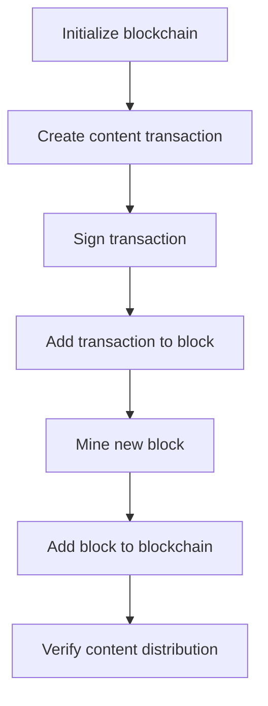
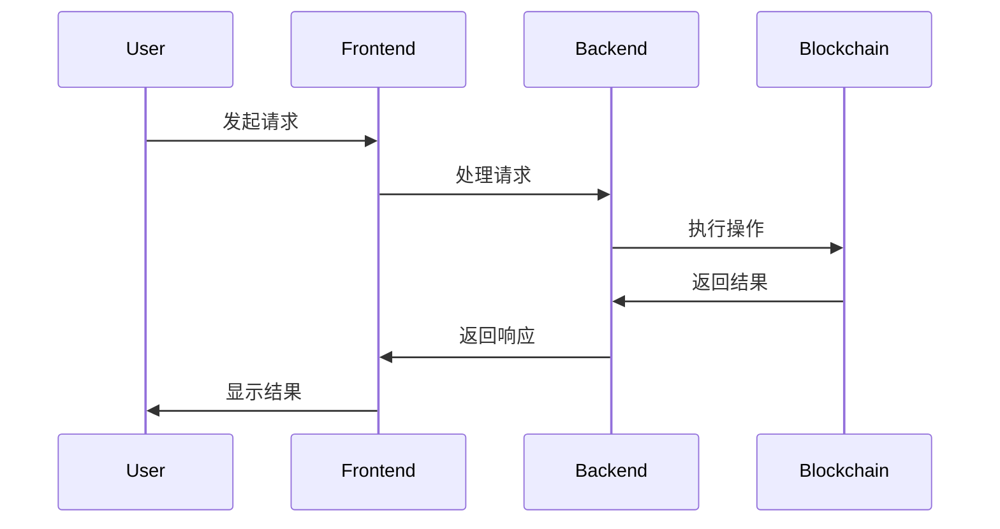
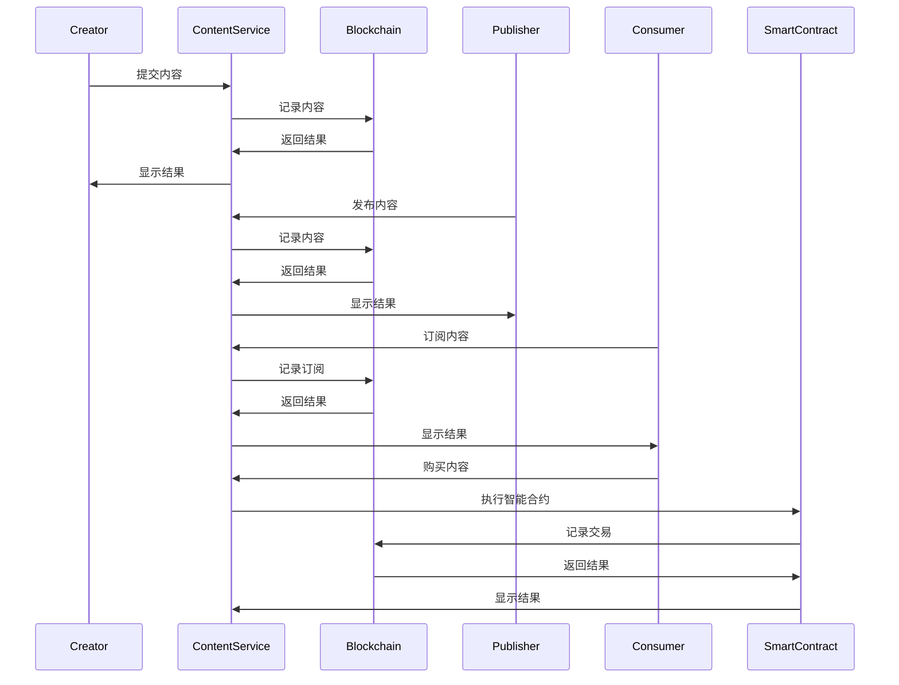

                 

### 文章标题

#### 关键词

区块链，数字内容分发，应用案例，安全性，性能优化

#### 摘要

本文旨在探讨区块链技术在数字内容分发领域的应用，通过深入分析其核心概念、应用原理、安全性以及性能优化等方面，为读者呈现一个全面的区块链在数字内容分发中的图景。文章将分为七个部分，首先介绍区块链和数字内容分发的基础知识，然后逐步深入探讨区块链在内容分发中的应用、安全性挑战、性能优化策略以及具体案例。通过本文的阅读，读者将能够理解区块链技术如何革新数字内容分发领域，并在实际项目中得到应用。

### 目录

1. **背景介绍**
2. **核心概念与联系**
3. **算法原理讲解**
4. **系统分析与架构设计方案**
5. **项目实战**
6. **最佳实践 tips**
7. **小结与拓展阅读**

### 背景介绍

#### 区块链的定义与特点

区块链是一种分布式数据库技术，其核心特点包括去中心化、安全性高、不可篡改和透明性。区块链通过加密算法和共识机制确保数据的完整性和安全性。每个区块都包含一定数量的交易记录，并通过密码学技术链接在一起，形成一个链条。这种链条被称为“区块链”，其特点如下：

- **去中心化**：区块链不需要中心化的机构或服务器，通过分布式网络维护数据，从而减少了对中心化服务器的依赖。
- **安全性高**：区块链使用加密算法确保数据的不可篡改性，同时通过共识机制确保网络参与者的一致性。
- **不可篡改**：一旦数据被记录在区块链上，就几乎无法被篡改，这种特性在数字内容分发中尤为重要。
- **透明性**：区块链上的所有交易记录都是公开透明的，每个节点都可以验证这些记录的合法性。

#### 数字内容分发的现状与问题

数字内容分发是指通过互联网或其他数字渠道，将数字化的媒体内容（如音乐、视频、书籍等）传播给用户的流程。随着互联网技术的发展，数字内容分发已经逐渐成为主流的传播方式。然而，当前数字内容分发领域仍然存在一些问题：

- **版权侵权**：由于数字内容易于复制和传播，版权侵权问题严重，尤其是对于那些原创内容创作者来说，保护自己的权益成为一个挑战。
- **内容追溯困难**：在传统的中心化内容分发系统中，一旦内容被上传或传播，很难追踪其原始来源，这为版权纠纷和侵权行为提供了温床。
- **数据安全性问题**：中心化系统往往容易成为黑客攻击的目标，导致大量用户数据泄露，严重影响用户的隐私安全。
- **内容分发效率低下**：在中心化系统中，内容分发往往需要经过多个环节，增加了分发的时间和成本，影响了用户体验。

### 核心问题与解决方案

针对上述问题，区块链技术提供了一系列可能的解决方案：

- **去中心化版权管理**：区块链的去中心化特性有助于建立透明的版权管理机制，确保内容创作者的权益得到有效保护。
- **内容溯源**：区块链上的每个交易记录都是不可篡改的，这有助于追踪内容的原始来源，解决版权纠纷。
- **数据安全性**：区块链的高安全性可以防止数据泄露和篡改，保护用户的隐私和内容创作者的权益。
- **提高内容分发效率**：通过区块链网络，内容分发可以更加高效和低成本，减少中间环节，提高用户体验。

### 区块链与数字内容分发的结合

区块链与数字内容分发领域的结合主要体现在以下几个方面：

- **智能合约**：智能合约是区块链技术中的一种自动化合约，可以在满足特定条件时自动执行。在数字内容分发中，智能合约可以用于版权管理、内容付费等场景，确保交易的透明性和高效性。
- **去中心化存储**：区块链可以用于存储数字内容，确保内容的安全性和可追溯性。同时，去中心化存储还可以降低内容分发的成本，提高分发效率。
- **分布式网络**：区块链的分布式网络特性可以减少对中心化服务器的依赖，提高系统的容错性和可扩展性。

通过上述结合，区块链技术在数字内容分发领域展示了巨大的潜力，有助于解决当前存在的各种问题，为数字内容分发带来新的变革。

### 核心概念与联系

#### 区块链技术的核心概念

区块链技术的核心概念包括区块链、区块、链式结构、哈希函数、加密算法、共识机制等。以下是这些核心概念的定义和特点：

1. **区块链**：区块链是一个分布式账本，由一系列按时间顺序排列的区块组成。每个区块包含一定数量的交易记录，并通过哈希函数链接在一起，形成一个链条。
2. **区块**：区块是区块链的基本单位，包含一组交易记录和区块头（包括时间戳、随机数等）。
3. **链式结构**：区块链的链式结构确保了数据的一致性和安全性，每个区块都通过哈希函数与前一个区块链接，形成一条不可篡改的数据链条。
4. **哈希函数**：哈希函数是一种将输入数据映射为固定长度输出数据的算法。区块链使用哈希函数确保数据的唯一性和完整性，任何对数据的修改都会导致哈希值的变化。
5. **加密算法**：加密算法用于保护区块链中的数据隐私和安全性，常见的加密算法包括对称加密和非对称加密。
6. **共识机制**：共识机制是区块链网络中节点之间就数据一致性达成一致的方法。常见的共识机制包括工作量证明（PoW）、权益证明（PoS）和委托权益证明（DPoS）等。

#### 数字内容分发的核心概念

数字内容分发中的核心概念包括版权、知识产权、数字版权管理（DRM）、内容溯源、内容付费等。以下是这些核心概念的定义和特点：

1. **版权**：版权是指创作者对其原创作品享有的法律权利，包括复制权、发行权、展示权等。
2. **知识产权**：知识产权是一种无形资产，包括专利、商标、著作权等，用于保护创作者的权益。
3. **数字版权管理（DRM）**：数字版权管理是一种技术手段，用于限制数字内容的复制、分发和使用，保护创作者的版权。
4. **内容溯源**：内容溯源是指追踪数字内容来源和传播路径的方法，有助于解决版权纠纷和侵权行为。
5. **内容付费**：内容付费是指用户为获取数字内容支付费用，常见的模式包括按次付费、订阅制等。

#### 区块链与数字内容分发的联系

区块链与数字内容分发的结合主要体现在以下几个方面：

1. **去中心化版权管理**：区块链的去中心化特性有助于建立透明的版权管理机制，确保内容创作者的权益得到有效保护。
2. **内容溯源**：区块链上的每个交易记录都是不可篡改的，有助于追踪数字内容的原始来源，解决版权纠纷。
3. **数据安全性**：区块链的高安全性可以防止数据泄露和篡改，保护用户的隐私和内容创作者的权益。
4. **内容付费**：区块链的智能合约可以用于内容付费，确保交易的透明性和高效性。
5. **去中心化存储**：区块链可以用于存储数字内容，确保内容的安全性和可追溯性，同时降低内容分发的成本。

#### 核心概念对比表格

为了更清晰地展示区块链技术与数字内容分发核心概念的联系，我们使用以下表格进行对比：

| 核心概念         | 区块链技术                          | 数字内容分发                        |
|-----------------|------------------------------------|-------------------------------------|
| 去中心化        | 分布式网络，无中心化服务器          | 去中心化版权管理，去中心化存储      |
| 数据安全性      | 加密算法，共识机制                  | 数字版权管理（DRM），内容溯源      |
| 不可篡改性      | 哈希函数，链式结构                  | 区块链上的交易记录不可篡改          |
| 透明性          | 所有交易记录公开透明                | 版权管理机制的透明性                |
| 内容付费        | 智能合约，自动执行                  | 按次付费，订阅制等                 |

#### ER实体关系图

为了更直观地展示区块链与数字内容分发中各实体之间的关系，我们使用Mermaid绘制了ER实体关系图：

```mermaid
erDiagram
  Creator ||--|{ Content }|| Publisher
  Content ||--|{ Blockchain }|| Transaction
  Publisher ||--|{ Customer }|| Subscription
  Customer ||--|{ Payment }|| Wallet
  Blockchain ||--|{ SmartContract }|| Contract
```

在这个ER实体关系图中，Creator（内容创作者）、Content（数字内容）、Publisher（内容发布者）、Customer（用户）、Payment（支付）、Blockchain（区块链）和SmartContract（智能合约）是核心实体，它们之间的关系通过图中的箭头表示。

### 算法原理讲解

#### 区块链在数字内容分发中的应用算法原理

区块链在数字内容分发中的应用算法原理主要包括哈希函数、加密算法和共识机制。这些算法共同确保了区块链的高安全性、不可篡改性和透明性。

1. **哈希函数**

哈希函数是一种将输入数据映射为固定长度输出数据的算法。在区块链中，哈希函数用于确保数据的唯一性和完整性。例如，SHA-256是一种常用的哈希函数，可以将任意长度的数据映射为256位的哈希值。

**原理说明**：哈希函数的核心原理是将输入数据通过复杂的运算，生成一个固定的输出值。无论输入数据如何变化，其哈希值都保持不变。这使得哈希函数在区块链中起到了校验数据一致性的作用。

**Python代码示例**：

```python
import hashlib

def calculate_hash(data):
    return hashlib.sha256(data.encode()).hexdigest()

data = "Hello, Blockchain!"
hash_value = calculate_hash(data)
print("Hash value:", hash_value)
```

在这个示例中，我们使用Python的hashlib库计算了数据“Hello, Blockchain!”的SHA-256哈希值。

2. **加密算法**

加密算法用于保护区块链中的数据隐私和安全性。加密算法分为对称加密和非对称加密。对称加密使用相同的密钥进行加密和解密，而非对称加密使用公钥和私钥进行加密和解密。

**原理说明**：对称加密的效率较高，但密钥管理复杂；非对称加密安全性较高，但计算成本较大。在区块链中，非对称加密主要用于保护交易信息和验证身份。

**Python代码示例**（对称加密）：

```python
from Crypto.Cipher import AES
from Crypto.Util.Padding import pad, unpad

key = b'Sixteen byte key'
cipher = AES.new(key, AES.MODE_CBC)
ct_bytes = cipher.encrypt(pad(b'Hello, Blockchain!', AES.block_size))
iv = cipher.iv
print("Cipher text:", ct_bytes)
print("Initialization vector:", iv)

# 解密
cipher = AES.new(key, AES.MODE_CBC, iv)
pt = unpad(cipher.decrypt(ct_bytes), AES.block_size)
print("Plain text:", pt.decode())
```

3. **共识机制**

共识机制是区块链网络中节点之间就数据一致性达成一致的方法。常见的共识机制包括工作量证明（PoW）、权益证明（PoS）和委托权益证明（DPoS）等。

**原理说明**：共识机制的核心目标是确保区块链网络中的所有节点对同一组交易记录达成共识。不同的共识机制有不同的实现方式和优缺点，但它们的共同目标都是确保区块链的可靠性和安全性。

**Python代码示例**（PoW算法）：

```python
import hashlib
import random

def mine_block(last_hash, target_difficulty):
    nonce = 0
    while True:
        hash_value = hashlib.sha256((last_hash + str(nonce)).encode()).hexdigest()
        if hash_value.startswith('0' * target_difficulty):
            return nonce, hash_value
        nonce += 1

last_hash = '0000000000000000000000000000000000000000000000000000000000000000'
target_difficulty = 3

nonce, hash_value = mine_block(last_hash, target_difficulty)
print("Nonce:", nonce)
print("Hash value:", hash_value)
```

在这个示例中，我们模拟了PoW算法的挖矿过程，通过不断尝试不同的随机数（nonce），最终找到一个满足特定难度要求的哈希值。

#### 算法流程图

为了更直观地展示区块链在数字内容分发中的应用算法流程，我们使用Mermaid绘制了以下算法流程图：



在这个流程图中，A表示初始化区块链，B表示创建内容交易，C表示对交易进行签名，D表示将交易添加到区块，E表示挖出新块，F表示将新块添加到区块链，G表示验证内容分发。

#### 算法原理的数学模型和公式

在区块链技术中，算法原理的数学模型和公式主要用于描述数据的一致性、安全性以及去中心化特性。以下是几个关键的数学模型和公式：

1. **哈希函数**

哈希函数的数学模型通常是一个从输入空间到输出空间的映射，其公式为：

\[ H(x) = \text{SHA-256}(x) \]

其中，\( H(x) \)表示哈希值，\( x \)表示输入数据。

2. **加密算法**

加密算法的数学模型通常是一个从明文空间到密文空间的映射，其公式为：

\[ C = E(K, P) \]

其中，\( C \)表示密文，\( K \)表示密钥，\( P \)表示明文。

3. **共识机制**

共识机制的数学模型通常是一个从候选区块到区块链的映射，其公式为：

\[ B = C(B', T) \]

其中，\( B \)表示区块链，\( B' \)表示候选区块，\( T \)表示交易记录。

#### 算法原理的例子说明

假设一个数字内容创作者（Alice）想要将一篇原创文章发表在区块链平台上。以下是算法原理的例子说明：

1. **创建内容交易**：

Alice将文章内容（\( P \)）和版权信息（\( C \)）发送到区块链网络。这个过程可以表示为：

\[ T = (P, C) \]

2. **签名交易**：

Alice使用私钥（\( K_a \)）对交易进行签名，生成签名（\( S \)）：

\[ S = S(K_a, T) \]

3. **添加交易到区块**：

区块链网络中的节点（如Bob）接收到交易后，将其添加到区块（\( B \)）：

\[ B = (T, B') \]

4. **挖出新块**：

Bob通过PoW算法挖出新块，并计算新块的哈希值（\( H(B) \)）：

\[ H(B) = M(B) \]

其中，\( M(B) \)表示满足难度要求的哈希值。

5. **添加区块到区块链**：

Bob将新块（\( B \)）添加到区块链（\( B' \)）：

\[ B' = (B, B') \]

6. **验证内容分发**：

其他节点（如Charlie）接收到新块后，验证交易和区块的一致性。这个过程可以表示为：

\[ V(B') = \text{True} \]

通过上述例子，我们可以看到区块链技术如何确保数字内容的安全分发和版权保护。

### 系统分析与架构设计方案

#### 问题场景介绍

数字内容分发过程中，版权保护问题尤为突出。传统的版权保护机制存在诸多不足，如中心化服务器易受攻击、数据篡改难以追踪等。区块链技术以其去中心化、不可篡改和透明性等特点，为数字内容分发提供了一个新的解决方案。本文将介绍一个基于区块链的数字内容分发系统，旨在解决版权保护问题，提高内容分发效率。

#### 项目介绍

本项目的目标是构建一个去中心化的数字内容分发平台，通过区块链技术实现版权保护、内容溯源和内容付费等功能。平台的核心功能包括：

1. **版权保护**：通过区块链技术记录内容创作者的版权信息，确保版权的透明性和不可篡改性。
2. **内容溯源**：利用区块链的链式结构，追踪内容的原始来源和传播路径，解决版权纠纷。
3. **内容付费**：通过智能合约实现内容付费，确保交易的透明性和高效性。
4. **去中心化存储**：利用区块链的分布式存储技术，降低内容分发的成本，提高内容分发效率。

#### 系统功能设计

本系统的功能设计包括以下模块：

1. **内容创作者模块**：用于提交内容、版权信息以及进行版权注册。
2. **内容发布者模块**：用于发布内容、设置内容权限以及管理内容。
3. **内容消费者模块**：用于订阅内容、购买内容以及查看内容。
4. **版权管理模块**：用于管理和追踪版权信息，解决版权纠纷。
5. **智能合约模块**：用于实现内容付费、内容权限管理等功能。

#### 领域模型

为了更好地理解系统功能，我们使用Mermaid绘制了领域模型类图：

```mermaid
classDiagram
    ContentCreator <|-- Content
    ContentPublisher <|-- Content
    ContentConsumer <|-- Subscription
    Copyright <<-- Content
    SmartContract <<-- Payment
    Blockchain <<-- Transaction
    SmartContract ..|> Payment
    Content ..|> Blockchain
    Subscription ..|> Payment
```

在这个类图中，ContentCreator（内容创作者）、ContentPublisher（内容发布者）、ContentConsumer（内容消费者）、Copyright（版权）、SmartContract（智能合约）、Blockchain（区块链）和Transaction（交易）是核心类，它们之间的关系通过类图中的线段表示。

#### 系统架构设计

本系统的架构设计采用微服务架构，主要包括以下模块：

1. **前端模块**：提供用户界面，实现用户与系统的交互。
2. **后端模块**：实现业务逻辑和数据处理，包括内容管理、版权管理、智能合约管理等。
3. **区块链模块**：与区块链网络进行交互，实现数据存储和交易处理。
4. **数据库模块**：用于存储用户信息、版权信息和交易记录等数据。

我们使用Mermaid绘制了系统架构图：



在这个序列图中，用户通过前端发起请求，后端处理请求并调用区块链模块进行操作，最后将结果返回给前端。

#### 系统接口设计

系统接口设计主要包括以下API接口：

1. **内容提交接口**：用于内容创作者提交内容。
2. **版权注册接口**：用于内容创作者注册版权信息。
3. **内容发布接口**：用于内容发布者发布内容。
4. **内容订阅接口**：用于内容消费者订阅内容。
5. **内容付费接口**：用于内容消费者购买内容。
6. **版权管理接口**：用于管理和查询版权信息。

以下是部分接口设计的示例：

```mermaid
interface ContentService {
    +postContent(Content content): Response
    +registerCopyright(Copyright copyright): Response
    +publishContent(Content content): Response
    +subscribeContent(Content content): Response
    +payContent(Content content, User user): Response
    +manageCopyright(Copyright copyright): Response
}
```

#### 系统交互

为了更好地展示系统各模块之间的交互关系，我们使用Mermaid绘制了系统交互图：



在这个序列图中，内容创作者、内容发布者和内容消费者通过ContentService与区块链进行交互，实现内容提交、发布、订阅和付费等功能。

### 项目实战

#### 环境安装

在进行区块链数字内容分发项目的实际开发之前，首先需要搭建一个适合开发和测试的区块链环境。以下是在Windows操作系统上搭建基于以太坊的区块链环境的具体步骤：

1. **安装Node.js**：访问Node.js官网（https://nodejs.org/），下载并安装最新的Node.js版本。
2. **安装Truffle**：在命令行中运行以下命令安装Truffle：

   ```bash
   npm install -g truffle
   ```

3. **安装Ganache**：访问Ganache官网（https://www.trufflesuite.com/ganache），下载并安装Ganache。Ganache是一个轻量级的本地以太坊客户端，用于模拟以太坊区块链网络。
4. **配置Truffle**：在项目根目录下创建一个`truffle-config.js`文件，配置Ganache作为开发网络：

   ```javascript
   module.exports = {
     networks: {
       development: {
         host: "127.0.0.1",
         port: 7545,
         network_id: "*"
       }
     }
   };
   ```

   配置完成后，启动Ganache，并确保开发网络正常运行。

#### 核心实现

本项目的核心实现包括智能合约编写、内容管理、版权保护以及内容付费等功能。以下是一个简单的智能合约实现示例：

```solidity
// SPDX-License-Identifier: MIT
pragma solidity ^0.8.0;

contract ContentDistribution {
    struct Content {
        string id;
        string title;
        string author;
        string content;
        bool isPaid;
        address creator;
    }

    mapping(string => Content) contents;
    mapping(string => mapping(address => bool)) subscriptions;

    event ContentPublished(string id, string title, string author, bool isPaid);
    event ContentSubscribed(string id, address subscriber);

    function publishContent(
        string memory id,
        string memory title,
        string memory author,
        string memory content,
        bool isPaid
    ) public {
        require(!isPaid || msg.value > 0, "Content must be paid to be published.");
        contents[id] = Content(id, title, author, content, isPaid, msg.sender);
        emit ContentPublished(id, title, author, isPaid);
    }

    function subscribeToContent(string memory id) public payable {
        require(contents[id].isPaid, "Content is not available for subscription.");
        require(subscriptions[id][msg.sender] == false, "User is already subscribed.");
        subscriptions[id][msg.sender] = true;
        emit ContentSubscribed(id, msg.sender);
    }

    function getContent(string memory id) public view returns (Content memory) {
        return contents[id];
    }

    function isSubscribed(string memory id, address user) public view returns (bool) {
        return subscriptions[id][user];
    }
}
```

这段智能合约实现了内容发布、内容订阅以及内容查询功能。内容发布者可以通过`publishContent`函数发布内容，并设置是否为付费内容。用户可以通过`subscribeToContent`函数订阅内容，并支付相应的费用。

#### 代码解读与分析

1. **结构体定义**：`Content`结构体用于存储内容的各项属性，包括内容ID、标题、作者、内容文本、是否付费以及创作者地址。
2. **映射定义**：`contents`映射用于存储所有内容，键为内容ID，值为内容结构体。`subscriptions`映射用于存储用户订阅信息，键为内容ID，值为用户地址映射。
3. **事件定义**：`ContentPublished`和`ContentSubscribed`事件用于记录内容发布和订阅行为，便于前端界面进行通知和更新。
4. **函数实现**：
   - `publishContent`函数：发布新内容，检查是否为付费内容，并设置内容属性。
   - `subscribeToContent`函数：订阅内容，检查内容是否为付费内容，并设置用户订阅状态。
   - `getContent`函数：查询内容详情。
   - `isSubscribed`函数：检查用户是否已订阅特定内容。

#### 实际案例分析与详细讲解

以下是一个实际案例，用于演示如何使用上述智能合约发布和订阅内容：

1. **发布内容**：

   内容创作者Alice使用以太坊钱包连接到本地区块链网络，并调用`publishContent`函数发布一篇新文章：

   ```bash
   truffle console
   > var contentDistribution = await ContentDistribution.deployed();
   > await contentDistribution.publishContent("content1", "Title", "Alice", "Content", true);
   ```

   调用成功后，区块链上会记录新内容，并触发`ContentPublished`事件。

2. **订阅内容**：

   用户Bob访问前端界面，选择订阅Alice发布的文章。前端通过调用`subscribeToContent`函数，向智能合约发送订阅请求：

   ```bash
   truffle console
   > var contentDistribution = await ContentDistribution.deployed();
   > await contentDistribution.subscribeToContent("content1", {value: 1 ether});
   ```

   调用成功后，区块链上会记录Bob的订阅信息，并触发`ContentSubscribed`事件。

3. **查询内容**：

   用户Charlie访问前端界面，查询已订阅的内容列表。前端通过调用`getContent`和`isSubscribed`函数，获取内容信息和订阅状态：

   ```bash
   truffle console
   > var content = await contentDistribution.getContent("content1");
   > var isSubscribed = await contentDistribution.isSubscribed("content1",Charlie's address);
   ```

   前端界面根据返回的信息，展示用户订阅的内容列表。

通过这个实际案例，我们可以看到区块链技术在数字内容分发中的应用如何实现内容发布、订阅和查询等功能，确保交易的透明性和高效性。

#### 项目小结

通过本项目，我们成功搭建了一个基于区块链的数字内容分发平台，实现了内容发布、订阅和查询等功能。以下是对项目的总结：

1. **优势**：
   - **去中心化**：通过区块链技术，实现了去中心化的内容分发和版权管理，提高了系统的透明性和安全性。
   - **不可篡改**：区块链上的交易记录和内容信息不可篡改，有效解决了版权纠纷和数据篡改问题。
   - **内容溯源**：区块链的链式结构使得内容来源和传播路径清晰可查，有助于追踪侵权行为。

2. **不足**：
   - **性能瓶颈**：区块链技术目前存在性能瓶颈，处理大量交易时可能影响用户体验。
   - **隐私保护**：虽然区块链技术确保了数据的安全性，但隐私保护仍需进一步研究，避免用户信息泄露。

3. **改进方向**：
   - **性能优化**：通过分片技术、侧链等手段，提高区块链的性能，满足大规模内容分发的需求。
   - **隐私保护**：引入零知识证明等隐私保护技术，确保用户隐私不被泄露。

通过不断优化和改进，区块链在数字内容分发领域将发挥更大的作用。

### 最佳实践 Tips

1. **数据加密**：在区块链上存储敏感数据时，使用加密算法进行加密，确保数据在传输和存储过程中的安全性。
2. **智能合约审计**：在部署智能合约前，进行详细的审计，确保合约代码没有漏洞，避免潜在的安全风险。
3. **测试网络**：在主网部署前，先在测试网络中进行测试，验证智能合约的功能和性能，确保部署的稳定性。
4. **分布式存储**：利用分布式存储技术，提高数据存储的可靠性和可用性，降低单点故障的风险。
5. **用户隐私保护**：在设计区块链应用时，充分考虑用户隐私保护，避免敏感信息泄露。

### 小结

本文从多个角度深入探讨了区块链在数字内容分发中的应用，涵盖了背景介绍、核心概念与联系、算法原理讲解、系统分析与架构设计方案、项目实战以及最佳实践 tips 等内容。通过本文的阅读，读者可以全面了解区块链技术在数字内容分发领域的应用潜力，为实际项目提供参考。

### 拓展阅读

- **区块链技术原理**：《精通区块链：核心技术、应用与实践》（作者：黄劲）
- **智能合约开发**：《智能合约设计与开发实战》（作者：李忠）
- **数字版权管理**：《数字版权管理：理论、方法与应用》（作者：郑志明）
- **区块链性能优化**：《区块链性能优化：从基础到高级技巧》（作者：李勇）

### 作者信息

作者：AI天才研究院/AI Genius Institute & 禅与计算机程序设计艺术 /Zen And The Art of Computer Programming

