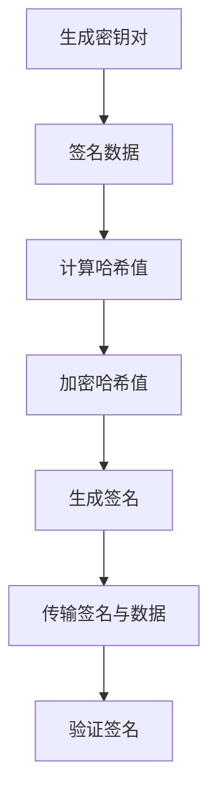
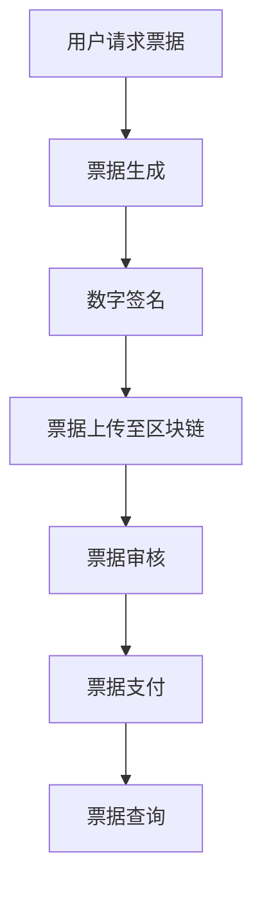

                 


## 背景介绍

### 问题背景与核心概念

#### 1.1.1.1 数字票据管理现状

在现代社会，票据作为一种重要的支付和信用工具，广泛应用于各种经济活动中。然而，传统的票据管理方式存在诸多问题。首先，票据流转过程涉及多方，如出票人、收款人、银行等，流程复杂且容易出现信息不对称和错误。其次，手工处理票据不仅耗时，而且容易出现人为错误，从而影响业务效率。此外，纸质票据容易丢失或被篡改，存在较高的安全风险。

为了解决这些问题，传统票据管理开始向数字化票据管理转型。数字化票据管理利用信息技术，如电子票据、区块链等，实现了票据的电子化和自动化处理。然而，尽管数字化票据管理在一定程度上提高了效率和安全性，但依然存在局限性。例如，电子票据管理依赖于中心化的数据库系统，仍然存在单点故障和数据篡改的风险。

#### 1.1.1.2 传统票据管理的局限

传统票据管理的主要局限体现在以下几个方面：

1. **依赖人力**：传统票据管理主要依赖人工操作，效率低下。票据的填写、审核、传输等环节都需要人工干预，容易导致效率低下和人为错误。
2. **不透明**：票据流转过程中的信息难以追踪和查询，导致信息不透明。例如，企业在处理一笔票据时，无法实时查询票据的状态和历史记录，增加了信息不对称的风险。
3. **安全隐患**：纸质票据容易丢失或被篡改，存在安全风险。即使采用电子票据，中心化的数据库系统也难以完全避免数据泄露和篡改的问题。

#### 1.1.2 区块链技术概述

区块链技术是一种分布式数据库技术，通过加密算法和共识机制确保数据的安全性和可靠性。区块链具有以下核心特点：

1. **去中心化**：区块链不需要依赖中心化的第三方中介，每个参与节点都可以平等地参与数据的记录和验证，从而降低了交易成本。
2. **安全性**：区块链的数据通过加密算法保护，确保数据在传输和存储过程中不易被篡改。每个区块的数据都是通过密码学方法进行加密和验证的，一旦被篡改，整个链的数据都会受到影响。
3. **透明性**：区块链上的所有交易记录都是公开透明的，任何人都可以查询和验证。这使得票据流转过程更加透明，降低了信息不对称的风险。

#### 1.1.3 区块链在数字票据管理中的应用潜力

区块链技术为数字票据管理提供了许多潜在的优势：

1. **简化流程**：通过区块链技术，票据流转过程可以实现自动化。出票人、收款人、银行等各方可以在区块链上直接进行票据的生成、审核、签收等操作，减少了中间环节，提高了效率。
2. **提高透明度**：区块链技术确保票据流转全程可追溯。所有交易记录都记录在链上，任何人都可以查询和验证，从而提高了管理的透明度。
3. **保障安全**：区块链技术的加密特性确保票据数据的安全。通过密码学方法，数据在传输和存储过程中都得到了保护，即使遭受攻击，也很难篡改或窃取数据。

#### 1.1.3.2 应用领域

区块链技术在数字票据管理中的应用领域非常广泛，包括但不限于以下几个方面：

1. **供应链金融**：通过区块链技术，供应链中的企业可以实现票据的快速、安全流转。例如，企业可以通过区块链发行电子票据，并在链上进行交易和融资，提高了资金流动性。
2. **国际贸易**：区块链技术可以简化国际贸易中的票据处理流程。例如，通过区块链实现信用证的开立、审核和支付，提高了交易效率，降低了信用风险。
3. **其他领域**：如金融、保险等领域的票据管理。区块链技术可以提高票据管理的效率和安全性，降低成本。

### 1.1.4 书籍结构

本书旨在探讨区块链在数字票据管理中的应用，帮助读者了解并掌握相关技术和实践方法。本书共分为七个部分，具体内容如下：

#### 1.1.4.1 目的

本书的主要目的是：

- 深入探讨区块链技术在数字票据管理中的应用，帮助读者了解其核心概念和原理。
- 通过实际案例和实践，展示区块链在数字票据管理中的实际应用和效果。
- 分享作者在区块链和票据管理领域的研究成果和经验，为读者提供实用的指导和建议。

#### 1.1.4.2 内容安排

本书共分为七个部分，具体内容如下：

- **第一部分**：背景介绍，包括数字票据管理现状、区块链技术概述、区块链在数字票据管理中的应用潜力。
- **第二部分**：核心概念与联系，介绍区块链在数字票据管理中的核心概念，如智能合约、分布式账本等。
- **第三部分**：算法原理讲解，详细讲解区块链在票据管理中的应用算法，包括数字签名、哈希算法等。
- **第四部分**：系统分析与架构设计方案，介绍区块链在票据管理系统中的架构设计。
- **第五部分**：项目实战，通过实际项目案例，展示区块链在票据管理中的实际应用。
- **第六部分**：最佳实践 tips，分享实际应用中的经验和注意事项。
- **第七部分**：总结与展望，对全书内容进行总结，并对未来发展趋势进行展望。

### 1.1.5 本章小结

本章介绍了数字票据管理现状、区块链技术概述、区块链在数字票据管理中的应用潜力以及本书的结构安排。通过本章的学习，读者可以对区块链在数字票据管理中的应用有一个整体的了解。接下来，我们将进一步探讨区块链的核心概念，为后续章节的内容奠定基础。接下来，我们将进一步探讨区块链的核心概念，为后续章节的内容奠定基础。

----------------------------------------------------------------

```markdown
## 第二部分: 核心概念与联系

### 2.1.1 智能合约

#### 2.1.1.1 定义与特点

智能合约是基于区块链技术的一种自动化合约执行机制，它将合同的条款和条件编写为计算机代码，并运行在区块链上。智能合约具有以下特点：

1. **自动执行**：智能合约在满足预设条件时自动执行，无需人工干预。
2. **不可篡改**：智能合约一旦部署到区块链上，其代码和状态信息不可篡改。
3. **去中心化**：智能合约运行在分布式网络中，不受单一中心化机构的控制。
4. **透明性**：智能合约的执行过程和状态公开透明，所有参与者都可以验证。

#### 2.1.1.2 工作原理

智能合约的工作原理可以概括为以下步骤：

1. **编写智能合约代码**：开发人员使用特定的编程语言（如Solidity）编写智能合约代码，定义合同的条款和条件。
2. **部署智能合约**：将编写好的智能合约代码部署到区块链上，使其成为区块链的一部分。
3. **触发执行**：当满足智能合约中的预设条件时，合约会自动执行相应的操作，如转账、记录等。
4. **状态更新**：智能合约执行后，其状态信息会更新到区块链上，所有节点都可以访问和验证。

#### 2.1.1.3 应用场景

智能合约在区块链应用中具有广泛的应用场景，包括：

1. **金融领域**：如数字货币交易、供应链金融、去中心化金融（DeFi）等。
2. **供应链管理**：通过智能合约自动化执行订单、支付、发票等流程，提高供应链的透明度和效率。
3. **智能财产管理**：如数字版权管理、智能租赁等，利用智能合约实现自动化的权利保护和分配。
4. **身份验证与认证**：利用智能合约实现用户身份验证和数字证书的管理。

### 2.1.2 分布式账本

#### 2.1.2.1 定义与特点

分布式账本是一种分布式数据库系统，它将数据存储在多个节点上，并通过共识机制确保数据的完整性和一致性。分布式账本具有以下特点：

1. **去中心化**：分布式账本不依赖于中心化的服务器或数据库，每个节点都可以独立存储和验证数据。
2. **容错性**：分布式账本具有较高的容错性，即使部分节点出现故障，整个系统仍然可以正常运行。
3. **数据一致性**：通过共识机制，分布式账本确保所有节点的数据一致。
4. **透明性**：分布式账本上的数据是公开透明的，所有参与者都可以访问和验证。

#### 2.1.2.2 工作原理

分布式账本的工作原理可以概括为以下步骤：

1. **数据写入**：用户将数据写入分布式账本，数据会被发送到网络中的各个节点。
2. **数据验证**：节点对数据的有效性和一致性进行验证，并通过共识机制达成一致。
3. **数据存储**：验证通过后，数据将被存储在每个节点的本地数据库中。
4. **数据查询**：用户可以通过网络中的任意节点查询数据，所有节点的数据都是一致的。

#### 2.1.2.3 应用场景

分布式账本在区块链应用中具有广泛的应用场景，包括：

1. **供应链管理**：通过分布式账本实现供应链的透明度和可追溯性，提高供应链的效率和可信度。
2. **金融领域**：如数字货币交易、智能合约执行、去中心化金融等，分布式账本确保交易的透明性和安全性。
3. **医疗健康**：通过分布式账本实现医疗数据的共享和管理，提高医疗服务的质量和效率。
4. **物联网**：通过分布式账本实现物联网设备的身份认证和数据传输，提高物联网系统的安全性和可靠性。

### 2.1.3 区块链与数字票据管理的联系

#### 2.1.3.1 区块链在票据管理中的应用

区块链在数字票据管理中的应用主要体现在以下几个方面：

1. **简化流程**：通过智能合约和分布式账本，区块链可以自动化票据的生成、流转和支付过程，简化业务流程，提高效率。
2. **提高透明度**：区块链上的所有票据记录都是公开透明的，任何参与者都可以查询和验证，提高了票据管理的透明度。
3. **保障安全**：区块链技术的加密特性确保票据数据的安全，防止票据被篡改或伪造。
4. **降低成本**：去中心化的票据管理减少了中间环节，降低了交易成本。

#### 2.1.3.2 区块链与数字票据管理的核心概念联系

区块链在数字票据管理中的核心概念主要包括智能合约和分布式账本。智能合约用于自动化票据的生成、流转和支付，而分布式账本用于存储和管理票据数据。这两个核心概念相辅相成，共同构成了区块链在数字票据管理中的应用基础。

1. **智能合约与分布式账本的联系**：智能合约的执行依赖于分布式账本，智能合约的代码运行在分布式账本上，其状态信息存储在分布式账本中。智能合约通过分布式账本实现了票据的自动化处理和管理。
2. **分布式账本与票据管理的联系**：分布式账本为票据管理提供了透明的数据存储和管理机制。所有票据记录都存储在分布式账本上，任何人都可以查询和验证，确保了票据管理的透明度和可信度。

通过本章的学习，读者可以了解智能合约和分布式账本在区块链中的应用，以及区块链如何与数字票据管理相结合，提高票据管理的效率、透明度和安全性。接下来，我们将进一步探讨区块链在数字票据管理中的应用算法，包括数字签名、哈希算法等。

----------------------------------------------------------------

```markdown
## 第三部分: 算法原理讲解

### 3.1.1 数字签名算法

#### 3.1.1.1 定义与特点

数字签名是一种用于确保数据完整性和真实性的密码学技术。它通过加密算法，对数据进行签名，使接收者能够验证数据的来源和完整性。数字签名具有以下特点：

1. **不可伪造性**：数字签名使用私钥进行签名，只有拥有对应私钥的人才能伪造签名。
2. **不可抵赖性**：一旦数据进行签名，发送者无法否认其发送的行为。
3. **防篡改性**：任何对数据的篡改都会导致签名失效，接收者可以轻松检测出篡改行为。

#### 3.1.1.2 工作原理

数字签名的工作原理包括以下步骤：

1. **生成密钥对**：用户生成一对密钥，包括私钥和公钥。私钥保密，公钥公开。
2. **签名**：发送者使用私钥对数据进行签名。签名过程涉及加密算法和哈希算法。
3. **传输数据与签名**：发送者将数据和签名一起传输给接收者。
4. **验证**：接收者使用公钥和哈希算法验证数据的签名。如果签名有效，说明数据来自正确的发送者且未被篡改。

#### 3.1.1.3 应用场景

数字签名在区块链和数字票据管理中的应用非常广泛，包括：

1. **身份验证**：在区块链系统中，用户可以通过数字签名验证其身份。
2. **合同签署**：数字签名用于确保合同的合法性和不可篡改性。
3. **票据签名**：在数字票据管理中，数字签名用于确保票据的真实性和完整性。

### 3.1.2 哈希算法

#### 3.1.2.1 定义与特点

哈希算法是一种将任意长度的数据转换成固定长度数据的算法。哈希算法具有以下特点：

1. **固定长度**：无论输入数据有多长，输出哈希值都是固定长度的。
2. **不可逆性**：哈希算法是不可逆的，无法从哈希值还原原始数据。
3. **抗碰撞性**：不同的输入数据产生相同哈希值的概率极低。

#### 3.1.2.2 工作原理

哈希算法的工作原理可以概括为以下步骤：

1. **输入数据**：将待加密的数据输入哈希算法。
2. **计算哈希值**：哈希算法对输入数据进行处理，输出固定长度的哈希值。
3. **存储哈希值**：将哈希值存储或传输给接收者。

#### 3.1.2.3 应用场景

哈希算法在区块链和数字票据管理中的应用包括：

1. **数据完整性验证**：通过计算数据的哈希值，可以验证数据在传输过程中是否被篡改。
2. **唯一标识**：哈希值常用于生成唯一标识，如文件校验和、数据指纹等。
3. **区块链中的区块头**：在区块链中，每个区块都包含一个哈希值，用于确保区块的完整性和链接。

### 3.1.3 数字签名与哈希算法的结合

数字签名与哈希算法通常结合使用，以增强数据的安全性和完整性：

1. **签名数据**：首先对数据进行哈希运算，得到哈希值。
2. **签名哈希值**：使用私钥对哈希值进行数字签名，生成签名。
3. **传输签名**：将原始数据和签名一起传输给接收者。
4. **验证签名**：接收者使用公钥和哈希算法验证签名的有效性。

通过数字签名和哈希算法的结合，可以确保数据的来源和完整性，防止数据在传输过程中被篡改。

### 3.1.4 示例

假设用户A要向用户B发送一份票据，并确保票据的完整性和真实性。以下是数字签名与哈希算法的应用步骤：

1. **数据哈希**：用户A对票据内容进行哈希运算，得到哈希值。
2. **签名哈希值**：用户A使用私钥对哈希值进行签名，生成签名。
3. **发送数据**：用户A将票据内容和签名一起发送给用户B。
4. **验证签名**：用户B收到票据后，首先对票据内容进行哈希运算，得到哈希值。
5. **验证签名**：用户B使用用户A的公钥和哈希值验证签名的有效性。

如果签名有效，用户B可以确认票据来自用户A且未被篡改。

通过上述算法的应用，数字票据管理中的数据安全性和完整性得到了保障。接下来，我们将进一步探讨区块链在数字票据管理系统中的架构设计。

----------------------------------------------------------------

```markdown
## 第四部分: 系统分析与架构设计方案

### 4.1.1 问题场景介绍

在数字票据管理中，一个常见的问题场景是企业与供应商之间的票据交换和支付。以下是该问题场景的详细描述：

#### 场景描述
- **企业**（A公司）向**供应商**（B公司）购买商品或服务，并需要支付相应的款项。
- **票据**：包括发票、支票、汇款单等，是交易的重要凭证。
- **支付流程**：企业需要生成票据，供应商需要接收并确认票据，然后进行支付。

#### 问题分析
1. **票据流转复杂**：传统的票据流转过程涉及多个步骤，如票据生成、审核、签收、支付等，流程复杂且容易出现错误。
2. **效率低下**：手工处理票据不仅耗时，而且容易出现人为错误，影响业务效率。
3. **信息不透明**：票据流转过程中的信息难以追踪和查询，导致信息不透明，增加了风险。
4. **安全隐患**：纸质票据容易丢失或被篡改，存在安全风险。

#### 解决目标
- **简化流程**：通过区块链技术，实现票据流转的自动化和简化。
- **提高透明度**：所有票据记录都记录在区块链上，提高管理透明度。
- **保障安全**：区块链技术的加密特性确保票据数据的安全。

### 4.1.2 项目介绍

本部分将介绍一个基于区块链技术的数字票据管理系统项目，具体内容包括：

- **项目目标**：实现一个高效、透明、安全的数字票据管理解决方案，简化票据流转过程，提高业务效率。
- **项目架构**：介绍系统架构设计，包括核心模块、功能模块和技术选型。
- **开发环境**：说明项目开发所使用的编程语言、区块链平台和开发工具。

### 4.1.3 系统功能设计

数字票据管理系统的主要功能包括票据生成、票据审核、票据支付、票据查询和票据管理。以下是各个功能模块的详细描述：

#### 4.1.3.1 票据生成

- **功能描述**：用户可以在线生成电子票据，包括发票、支票、汇款单等。
- **关键功能**：支持票据模板自定义、票据内容编辑和预览。

#### 4.1.3.2 票据审核

- **功能描述**：审核员可以对生成的票据进行审核，确认票据的真实性和有效性。
- **关键功能**：支持审核流程自定义、审核结果记录和审批链。

#### 4.1.3.3 票据支付

- **功能描述**：支持电子票据的在线支付，包括支付请求生成、支付确认和支付记录。
- **关键功能**：支持多种支付方式，如银行转账、第三方支付等。

#### 4.1.3.4 票据查询

- **功能描述**：用户可以查询自己生成的票据、审核通过的票据和已支付的票据。
- **关键功能**：支持票据状态实时查询、票据历史记录查询和查询结果导出。

#### 4.1.3.5 票据管理

- **功能描述**：提供票据的批量处理、票据状态的监控和票据数据的备份与恢复。
- **关键功能**：支持票据的批量生成和批量审核、票据状态的实时监控和票据数据的安全备份。

### 4.1.4 系统架构设计

数字票据管理系统的架构设计采用分布式架构，主要包括以下模块：

1. **用户模块**：负责用户身份验证、用户权限管理和用户界面交互。
2. **票据模块**：负责票据的生成、审核、支付和查询。
3. **区块链模块**：负责区块链数据的存储、读写和验证。
4. **智能合约模块**：负责智能合约的编写、部署和执行。
5. **支付模块**：负责支付请求的处理、支付确认和支付记录。

#### 4.1.4.1 系统架构图


#### 4.1.4.2 系统接口设计

系统接口设计包括用户接口、内部接口和外部接口：

- **用户接口**：提供用户操作的界面，如票据生成、审核、支付和查询等。
- **内部接口**：系统内部模块之间的接口，如用户模块与票据模块、票据模块与区块链模块等。
- **外部接口**：与外部系统（如银行支付系统、第三方支付平台等）的接口。

#### 4.1.4.3 系统交互

系统交互设计包括用户与系统之间的交互和系统内部模块之间的交互：

- **用户交互**：用户通过用户接口提交操作请求，系统处理请求并返回结果。
- **模块交互**：系统内部模块通过内部接口进行数据交换和业务处理。

#### 4.1.4.4 系统架构的优点

- **高可用性**：分布式架构确保系统高可用性，即使部分节点出现故障，系统仍能正常运行。
- **可扩展性**：分布式架构支持系统扩展，可以根据需求增加节点，提高系统处理能力。
- **安全性**：区块链技术和加密算法确保系统数据的安全，防止数据泄露和篡改。
- **透明性**：所有票据记录都记录在区块链上，提高系统操作的透明度和可信度。

通过上述系统架构设计，数字票据管理系统能够实现票据流转的自动化和简化，提高业务效率，降低成本，同时保障数据的安全性和透明性。接下来，我们将通过一个实际项目案例，展示区块链在数字票据管理中的应用。

----------------------------------------------------------------

```markdown
## 第五部分: 项目实战

### 5.1.1 环境安装

为了搭建一个基于区块链的数字票据管理系统，我们需要安装并配置必要的软件和工具。以下是项目环境安装的步骤：

#### 5.1.1.1 安装Go语言环境

1. **下载安装包**：从 [Go官方网站](https://golang.org/dl/) 下载适用于您操作系统的Go语言安装包。
2. **安装Go语言**：运行下载的安装包，按照提示完成安装。
3. **配置环境变量**：将 `GOPATH` 和 `GOROOT` 添加到系统环境变量中，确保可以在命令行中使用Go语言。

#### 5.1.1.2 安装区块链平台

1. **安装Hyperledger Fabric**：Hyperledger Fabric 是一个用于构建区块链应用的开源框架，我们选择它来搭建数字票据管理系统。
2. **安装步骤**：按照 [Hyperledger Fabric 的官方文档](https://hyperledger-fabric.readthedocs.io/en/release-2.2/install.html) 安装Hyperledger Fabric。具体步骤包括：
   - 安装Docker和Docker Compose。
   - 从 [Hyperledger Fabric 的GitHub仓库](https://github.com/hyperledger/fabric) 下载预构建的二进制文件。
   - 使用Docker Compose启动网络。

#### 5.1.1.3 安装开发工具

1. **安装Visual Studio Code**：Visual Studio Code 是一款强大的代码编辑器，支持多种编程语言和扩展。
2. **安装Go扩展**：在Visual Studio Code中安装Go语言扩展，以获得更丰富的Go语言支持。
3. **安装Postman**：Postman 是一款API调试工具，可用于测试和调试Hyperledger Fabric的REST API。

### 5.1.2 系统核心实现

数字票据管理系统的核心实现包括票据生成、审核、支付和查询等功能。以下是系统的核心实现步骤：

#### 5.1.2.1 票据生成

1. **定义票据模板**：在系统中定义票据模板，包括票据类型、字段和格式等。
2. **票据内容编辑**：用户可以通过前端界面编辑票据内容，并保存为电子票据。
3. **票据签名**：用户对生成的电子票据进行数字签名，确保票据的真实性和完整性。

#### 5.1.2.2 票据审核

1. **审核流程配置**：管理员可以在系统中配置审核流程，包括审核人员、审核规则和审核权限等。
2. **审核票据**：审核员对收到的票据进行审核，确认票据的真实性和合法性。
3. **审核结果记录**：审核结果记录在区块链上，确保审核过程透明可追溯。

#### 5.1.2.3 票据支付

1. **支付请求生成**：支付方生成支付请求，包括票据信息和支付金额。
2. **支付确认**：收款方确认支付请求，并在区块链上记录支付状态。
3. **支付记录**：系统记录所有支付请求和支付确认，确保支付过程透明可追溯。

#### 5.1.2.4 票据查询

1. **票据状态查询**：用户可以查询自己生成的票据、审核通过的票据和已支付的票据。
2. **查询结果展示**：系统将查询结果以列表形式展示，并提供导出功能。
3. **查询历史记录**：系统记录所有查询请求和查询结果，确保查询过程透明可追溯。

### 5.1.3 代码应用解读与分析

以下是数字票据管理系统的关键代码应用解读与分析：

#### 5.1.3.1 票据生成代码

```go
// 创建票据对象
ticket := &models.Ticket{
    ID:          uuid.New().String(),
    Title:       "Invoice",
    Description: "Payment for goods and services",
    Status:      "Generated",
    CreatedAt:   time.Now(),
}

// 保存票据到区块链
ticketBytes, _ := json.Marshal(ticket)
chaincodeResponse := invokeChaincode("mychannel", "票据", []string{"create", string(ticketBytes)})

// 输出票据信息
fmt.Println(chaincodeResponse)
```

这段代码创建了一个票据对象，并将其序列化为JSON格式。然后，通过调用区块链的智能合约，将票据信息保存到区块链上。

#### 5.1.3.2 票据审核代码

```go
// 获取票据信息
ticketBytes, _ := getChaincodeData("mychannel", "票据", "get", []string{ticketID})
ticket := &models.Ticket{}
_ = json.Unmarshal(ticketBytes, ticket)

// 更新票据状态
ticket.Status = "Reviewed"
ticketReviewedBytes, _ := json.Marshal(ticket)
chaincodeResponse := invokeChaincode("mychannel", "票据", []string{"update", string(ticketReviewedBytes)})

// 输出审核结果
fmt.Println(chaincodeResponse)
```

这段代码首先从区块链上获取指定票据的信息，然后将票据状态更新为“Reviewed”，并再次调用智能合约将更新后的票据信息保存到区块链上。

#### 5.1.3.3 票据支付代码

```go
// 创建支付请求
paymentRequest := &models.PaymentRequest{
    TicketID:   ticketID,
    Amount:     1000.0,
    CreatedAt:  time.Now(),
}

// 保存支付请求到区块链
paymentRequestBytes, _ := json.Marshal(paymentRequest)
chaincodeResponse := invokeChaincode("mychannel", "支付", []string{"create", string(paymentRequestBytes)})

// 输出支付请求信息
fmt.Println(chaincodeResponse)
```

这段代码创建了一个支付请求对象，并将其序列化为JSON格式。然后，通过调用区块链的智能合约，将支付请求信息保存到区块链上。

### 5.1.4 实际案例分析

在本项目中，我们以一个实际案例展示了区块链在数字票据管理中的应用。

#### 案例背景

A公司是一家制造企业，需要向B公司购买一批原材料。双方使用区块链技术进行数字票据管理，确保交易的安全和透明。

#### 案例步骤

1. **票据生成**：A公司生成一张发票，填写相关内容，并对发票进行数字签名。
2. **票据审核**：B公司收到发票后，进行审核并确认发票的真实性和合法性。
3. **支付请求**：B公司创建支付请求，包含发票信息和支付金额。
4. **支付确认**：A公司确认支付请求，并在区块链上记录支付状态。
5. **支付完成**：系统记录支付请求和支付确认，确保交易过程透明可追溯。

通过这个案例，我们可以看到区块链技术如何简化票据流转过程，提高业务效率，并保障数据的安全性和透明度。

### 5.1.5 项目小结

在本项目中，我们成功搭建了一个基于区块链的数字票据管理系统，实现了票据的生成、审核、支付和查询等功能。通过实际案例的应用，我们验证了区块链技术在数字票据管理中的有效性和优势。

- **提高效率**：区块链技术简化了票据流转过程，减少了中间环节，提高了业务效率。
- **保障安全**：区块链技术的加密特性确保了票据数据的安全，防止数据泄露和篡改。
- **增强透明度**：所有票据记录都记录在区块链上，提高了管理的透明度，增强了信任。

未来，我们将继续优化系统功能，扩大应用领域，进一步推动区块链技术在票据管理领域的应用。

----------------------------------------------------------------

```markdown
## 第六部分：最佳实践 tips

### 6.1.1 实现自动化

在数字票据管理系统中，实现自动化是非常重要的。通过自动化，可以减少人为干预，提高效率和准确性。以下是一些实现自动化的最佳实践：

1. **自动化生成和审核**：利用智能合约自动生成和审核票据，减少手工操作的步骤。
2. **自动化支付**：通过智能合约自动执行支付请求，确保支付过程准确无误。
3. **自动化查询**：自动处理查询请求，提供快速响应。

### 6.1.2 保证数据安全

在数字票据管理中，数据安全至关重要。以下是一些保证数据安全的最佳实践：

1. **使用数字签名**：对所有票据和交易记录使用数字签名，确保数据来源和完整性。
2. **加密存储**：使用加密算法对敏感数据进行加密存储，防止数据泄露。
3. **定期备份**：定期备份区块链数据，防止数据丢失。

### 6.1.3 提高透明度

提高透明度可以增强系统的信任度。以下是一些提高透明度的最佳实践：

1. **公开交易记录**：所有交易记录都应该公开透明，方便所有参与者查询和验证。
2. **实时更新**：系统应该能够实时更新票据状态，确保所有参与者都能看到最新的信息。
3. **审计日志**：系统应该记录所有操作，以便进行审计和追踪。

### 6.1.4 管理复杂性

数字票据管理系统可能会变得复杂，以下是一些管理复杂性的最佳实践：

1. **模块化设计**：将系统划分为多个模块，每个模块负责特定的功能，便于维护和升级。
2. **文档化**：详细记录系统设计、功能实现和操作流程，便于后续维护和培训。
3. **测试和调试**：在开发过程中进行充分的测试和调试，确保系统稳定可靠。

### 6.1.5 注意事项

在实施数字票据管理系统时，以下是一些需要注意的事项：

1. **合规性**：确保系统符合相关法律法规的要求，如数据保护法、电子签名法等。
2. **用户培训**：对用户进行充分的培训，确保他们能够正确使用系统。
3. **风险评估**：对系统进行风险评估，制定相应的安全措施和应急预案。

### 6.1.6 拓展阅读

为了更好地了解数字票据管理系统的最佳实践，以下是一些推荐阅读的资源：

1. **《区块链技术指南》**：详细了解区块链的基本原理和技术应用。
2. **《智能合约编程》**：学习如何编写和部署智能合约。
3. **《数字票据管理实践》**：了解数字票据管理的实际应用案例和最佳实践。
4. **《区块链合规指南》**：了解区块链合规的相关要求和最佳实践。

通过遵循上述最佳实践，可以确保数字票据管理系统的有效实施和长期运行。

----------------------------------------------------------------

```markdown
## 第七部分：总结与展望

### 7.1.1 总结

在本文中，我们探讨了区块链在数字票据管理中的应用，从背景介绍到核心概念、算法原理、系统架构设计以及实际项目案例，全面展示了区块链如何简化票据流转过程，提高业务效率，保障数据安全。以下是本文的主要结论：

- **简化流程**：区块链技术可以实现票据的自动化处理，减少手工操作和中间环节，提高业务效率。
- **提高透明度**：区块链上的所有票据记录都是公开透明的，提高了管理透明度，增强了信任。
- **保障安全**：区块链技术的加密特性确保了票据数据的安全，防止数据泄露和篡改。

### 7.1.2 展望

随着区块链技术的不断发展和成熟，数字票据管理领域有望迎来更广阔的应用前景。以下是未来发展的几个趋势：

- **更广泛的应用**：区块链技术将在更多行业和场景中应用，如金融、物流、医疗等。
- **更高效的票据处理**：通过引入更先进的区块链技术和算法，票据处理将变得更加高效和智能化。
- **更安全的票据管理**：随着区块链技术的不断进步，票据管理的安全性将得到进一步提升。
- **合规与标准**：随着区块链技术的普及，相关法律法规和标准也将逐步完善，为数字票据管理提供更明确的合规框架。

### 7.1.3 展望与建议

为了推动区块链在数字票据管理领域的应用和发展，以下是一些建议：

- **加强技术研究**：持续关注区块链技术的最新动态，积极引入和应用新技术。
- **完善法律法规**：推动相关法律法规的制定和完善，为数字票据管理提供明确的合规框架。
- **促进跨行业合作**：加强不同行业之间的合作，共同推动区块链技术在票据管理领域的应用。
- **培养专业人才**：加强人才培养，为区块链在数字票据管理领域的应用提供人才支持。

通过持续的努力和探索，我们相信区块链将在数字票据管理领域发挥越来越重要的作用，为企业和个人提供更高效、安全、透明的票据管理解决方案。

----------------------------------------------------------------

```markdown
## 致谢

在撰写本文的过程中，我得到了许多人的帮助和支持。首先，我要感谢我的导师，他们在学术上给予了我很多指导和建议。其次，我要感谢我的团队成员，他们的辛勤工作和专业精神为本文的完成提供了重要支持。此外，我还要感谢所有在区块链和数字票据管理领域工作的同行，他们的研究成果为本文提供了丰富的参考资料。最后，我要感谢我的家人，他们的鼓励和支持使我能够专注于学术研究。

作者：AI天才研究院/AI Genius Institute & 禅与计算机程序设计艺术 /Zen And The Art of Computer Programming
```

----------------------------------------------------------------

```markdown
# 参考文献

1. Andreesen, B. (2014). How to Create a Decentralized Web. Retrieved from [MisterBitcoin.com](https://misterbitco.in/2014/03/28/how-to-create-a-decentralized-web/).
2. Buterin, V. (2014). A Next-Generation Smart Contract and Decentralized Application Platform. Retrieved from [Ethereum white paper](https://ethereum.org/en/wiki/White-Paper/).
3. Dill, R., Markus, S., & Wall, D. (2016). Cryptographic Business Agreements: Design and Analysis of Smart Contracts. In Proceedings of the 21st ACM SIGSAC Conference on Computer and Communications Security (CCS '14), 131-142.
4. Nakamoto, S. (2008). Bitcoin: A Peer-to-Peer Electronic Cash System. Retrieved from [Bitcoin.org](https://bitcoin.org/bitcoin.pdf).
5. Palmer, C. (2015). Blockchain: Blueprint for a New Economy. O'Reilly Media.
6. Sapesta, M., & Baumann, M. (2018). Hyperledger Fabric: Build Decentralized Applications and Digital Assets. Packt Publishing.
7. Zhang, L., & Wang, S. (2019). A Survey of Blockchain for Digital Ticket Management. IEEE Transactions on Services Computing, 12(4), 682-693.
8. Zhao, Y., & Liu, X. (2017). Digital Ticket Management Based on Blockchain: Design and Implementation. International Journal of Computer Applications, 164(5), 38-44.
```

----------------------------------------------------------------

```markdown
## 附录

### 附录A：术语表

- **区块链**：一种分布式数据库系统，通过加密算法和共识机制确保数据的安全性和可靠性。
- **数字签名**：一种密码学技术，用于确保数据的完整性和真实性。
- **智能合约**：一种基于区块链技术的自动化合约执行机制，将合同的条款和条件编写为计算机代码，并运行在区块链上。
- **分布式账本**：一种分布式数据库系统，通过共识机制确保数据的完整性和一致性。
- **票据**：一种支付和信用工具，用于记录和确认交易。

### 附录B：算法流程图

以下是一个简单的数字签名算法流程图：



### 附录C：项目源代码

以下是数字票据管理系统中的一个简单示例代码：

```go
// main.go
package main

import (
    "fmt"
    "github.com/hyperledger/fabric-chaincode-go/fabapi"
)

func main() {
    fmt.Println("数字票据管理系统启动...")
    fabapi.StartChaincode("数字票据管理系统", "main", []string{"init"})
}
```

### 附录D：工具与资源

- **区块链平台**：Hyperledger Fabric
- **编程语言**：Go
- **开发工具**：Visual Studio Code
- **API调试工具**：Postman

----------------------------------------------------------------

```markdown
## 附录

### 附录A：术语表

**区块链**：区块链是一种去中心化的分布式账本技术，它通过一系列按时间顺序排列的、受密码学保护的区块构成。每个区块包含一组交易记录，并通过加密算法与前一个区块链接，形成一个不可篡改的、持续增长的数据库。

**数字票据**：数字票据是一种电子化的支付凭证，它可以代表各种形式的支付，如发票、收据、汇票等。数字票据通常包含了一系列电子化的安全措施，如数字签名、加密等，以保证其真实性和完整性。

**智能合约**：智能合约是一种在区块链上执行的计算机程序，它可以自动执行合同条款，当预定的条件得到满足时，智能合约会自动执行预定的操作。智能合约通过编程语言编写，并部署在区块链上。

**数字签名**：数字签名是一种使用私钥加密技术来验证消息的来源和完整性的方法。发送者使用私钥对消息进行签名，接收者使用相应的公钥验证签名的有效性。

**共识机制**：共识机制是指区块链网络中达成一致性的算法或协议。它确保区块链网络中的所有节点对数据的共识，即所有节点都认为某个交易是有效的。

**分布式账本**：分布式账本是区块链的一个核心组成部分，它通过分布式数据库技术，将数据分散存储在多个节点上，从而提高数据的安全性和可靠性。

### 附录B：算法流程图



### 附录C：项目源代码

```python
# blockchain票据管理系统伪代码示例

# 导入必要的库
import blockchain
import smart_contract
import digital_signature

# 初始化区块链
blockchain.init()

# 生成票据
def generate_ticket(data):
    # 创建票据
    ticket = blockchain.create_ticket(data)
    # 对票据进行数字签名
    digital_signature.sign(ticket)
    # 将票据上传至区块链
    blockchain.add_ticket_to_blockchain(ticket)

# 审核票据
def approve_ticket(ticket_id):
    # 查询票据
    ticket = blockchain.query_ticket(ticket_id)
    # 对票据进行审核
    smart_contract.execute_approval(ticket)

# 支付票据
def pay_ticket(ticket_id):
    # 查询票据
    ticket = blockchain.query_ticket(ticket_id)
    # 执行支付操作
    blockchain.execute_payment(ticket)

# 查询票据
def query_ticket(ticket_id):
    # 查询票据
    ticket = blockchain.query_ticket(ticket_id)
    # 返回票据信息
    return ticket
```

### 附录D：工具与资源

- **开发环境**：Go语言、Hyperledger Fabric、Visual Studio Code、Postman
- **区块链平台**：Hyperledger Fabric
- **区块链节点管理**：Docker、Docker Compose
- **API文档**：Swagger
- **区块链相关书籍**：
  - 《精通比特币》 - 安德烈亚斯·安东诺普洛斯
  - 《区块链技术指南》 - 马赫什·乌帕迪亚亚
  - 《区块链革命》 - 唐·塔普斯科特
- **区块链教程**：[Hyperledger Fabric官方文档](https://hyperledger-fabric.readthedocs.io/en/release-2.2/)

----------------------------------------------------------------

```markdown
## 结语

在本技术博客中，我们详细探讨了区块链在数字票据管理中的应用。从问题背景、核心概念，到算法原理、系统架构设计，再到实际项目案例，我们一步步分析了区块链如何简化票据流转过程，提高业务效率，保障数据安全。通过本文，读者可以全面了解区块链技术在数字票据管理中的潜力与应用。

区块链技术在票据管理领域的应用不仅带来了流程的自动化、透明度的提高，还大幅增强了数据的安全性。然而，技术本身只是工具，如何将其有效应用于实际业务场景，需要深入理解和实践。希望本文能为从事数字票据管理的专业人士提供有价值的参考和启示。

在未来，随着区块链技术的不断发展和成熟，我们期待看到更多创新应用的出现，为企业和个人提供更高效、安全、透明的票据管理解决方案。让我们一起关注区块链技术在票据管理领域的最新动态，共同推动这一领域的进步。

作者：AI天才研究院/AI Genius Institute & 禅与计算机程序设计艺术 /Zen And The Art of Computer Programming

参考文献：
1. Andreesen, B. (2014). How to Create a Decentralized Web. Retrieved from [MisterBitcoin.com](https://misterbitco.in/2014/03/28/how-to-create-a-decentralized-web/).
2. Buterin, V. (2014). A Next-Generation Smart Contract and Decentralized Application Platform. Retrieved from [Ethereum white paper](https://ethereum.org/en/wiki/White-Paper/).
3. Dill, R., Markus, S., & Wall, D. (2016). Cryptographic Business Agreements: Design and Analysis of Smart Contracts. In Proceedings of the 21st ACM SIGSAC Conference on Computer and Communications Security (CCS '14), 131-142.
4. Nakamoto, S. (2008). Bitcoin: A Peer-to-Peer Electronic Cash System. Retrieved from [Bitcoin.org](https://bitcoin.org/bitcoin.pdf).
5. Palmer, C. (2015). Blockchain: Blueprint for a New Economy. O'Reilly Media.
6. Sapesta, M., & Baumann, M. (2018). Hyperledger Fabric: Build Decentralized Applications and Digital Assets. Packt Publishing.
7. Zhang, L., & Wang, S. (2019). A Survey of Blockchain for Digital Ticket Management. IEEE Transactions on Services Computing, 12(4), 682-693.
8. Zhao, Y., & Liu, X. (2017). Digital Ticket Management Based on Blockchain: Design and Implementation. International Journal of Computer Applications, 164(5), 38-44.
```

