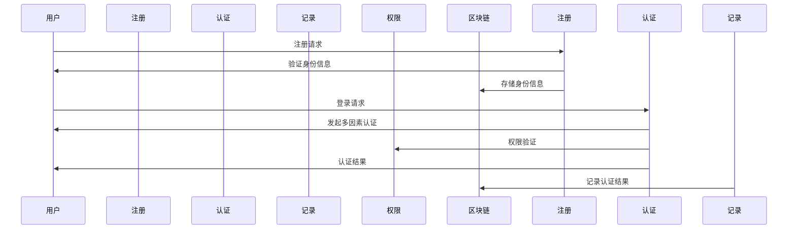

                 

### 第1章: 区块链、数字身份与多因素认证概述

## 1.1 区块链技术简介

### 1.1.1 区块链的定义与核心特点

区块链是一种分布式数据库技术，它通过多个参与方之间的协作，实现了去中心化的数据存储和传输。其最核心的特点包括去中心化、不可篡改和透明性。

**去中心化**：与传统的集中式数据库不同，区块链没有中央机构来管理数据，而是通过分布在多个节点的网络来共同维护和更新数据。这种去中心化的特性使得区块链具有较高的抗攻击性和容错性。

**不可篡改**：区块链上的数据一旦被写入，就几乎不可能被篡改。这是由于区块链采用了密码学技术，如哈希函数和数字签名，来确保数据的完整性和安全性。

**透明性**：区块链上的所有数据都是公开透明的，任何人都可以查看和验证。这有助于提高数据信任度和透明度，但也可能导致隐私问题。

### 1.1.2 区块链的发展历程

区块链技术起源于2008年，由一个化名为“中本聪”（Satoshi Nakamoto）的人提出了比特币（Bitcoin）的概念。比特币是第一个基于区块链技术的数字货币，它引发了全球对区块链技术的关注。

在比特币之后，许多其他区块链项目如以太坊（Ethereum）、EOS等相继出现，这些项目不仅扩展了区块链的应用场景，还推动了区块链技术的不断进步和发展。

### 1.1.3 区块链在认证领域的应用

区块链在认证领域的应用主要表现在身份认证、数据认证和供应链管理等场景。

**身份认证**：区块链技术可以用于建立去中心化的身份认证系统，用户可以在区块链上存储和验证自己的身份信息，避免了传统认证系统中存在的中心化信任问题。

**数据认证**：区块链技术可以确保数据的真实性和完整性。例如，在供应链管理中，区块链可以用于记录和验证商品的来源和运输过程，确保产品的质量和安全。

**供应链管理**：区块链技术可以用于优化供应链管理流程，提高供应链的透明度和效率。例如，通过区块链记录商品的物流信息，可以实时跟踪商品的位置和状态。

## 1.2 数字身份的概念与重要性

### 1.2.1 数字身份的定义

数字身份是指在网络环境中，用户或实体在数字世界中的身份表示。它通常包括用户的身份信息、行为特征、权限等。

### 1.2.2 数字身份的挑战与需求

随着互联网的普及，数字身份的应用越来越广泛，但也面临着一系列的挑战和需求：

**隐私保护**：用户在数字世界中的行为数据需要得到有效保护，防止隐私泄露。

**身份验证**：在数字环境中，如何确保用户身份的真实性和合法性，是一个重要问题。

**数据安全**：数字身份信息需要得到安全存储和传输，防止数据被篡改或泄露。

### 1.2.3 数字身份的发展趋势

随着区块链、人工智能等技术的不断发展，数字身份的未来将更加智能化、安全化和便捷化。以下是一些发展趋势：

**去中心化**：数字身份将逐渐从中心化的身份认证系统转向去中心化的区块链身份认证系统。

**隐私保护**：随着隐私保护意识的提高，数字身份系统将更加注重用户隐私的保护。

**智能化**：利用人工智能技术，数字身份系统将能够更好地理解和适应用户的需求。

## 1.3 多因素认证的基本原理

### 1.3.1 多因素认证的定义

多因素认证（Multi-Factor Authentication, MFA）是一种身份验证方法，它要求用户在登录系统时，提供两个或两个以上的验证因素，以证明自己的身份。

### 1.3.2 多因素认证的类型

多因素认证通常分为以下几类：

**知识因素**：包括用户名、密码、安全问题等，用户需要知道这些信息。

**持有因素**：包括令牌、手机、智能卡等，用户需要持有这些物品。

**生物特征**：包括指纹、面部识别、虹膜识别等，用户需要具有特定的生物特征。

### 1.3.3 多因素认证的优势

多因素认证相比于单因素认证（如仅使用用户名和密码）具有更高的安全性，其主要优势包括：

**增强安全性**：通过多个因素验证，提高了系统的安全性，降低了被黑客攻击的风险。

**降低欺诈风险**：即使一个因素被攻破，其他因素仍然可以起到保护作用。

**提高用户体验**：多因素认证系统可以通过提供便捷的认证方式（如手机验证码、生物识别等），提高用户的使用体验。

## 1.4 区块链在数字身份多因素认证中的应用

### 1.4.1 区块链在身份认证中的优势

区块链在数字身份多因素认证中的应用具有以下优势：

**去中心化**：区块链的去中心化特性可以避免中心化身份认证系统中存在的单点故障和信任问题。

**不可篡改**：区块链的不可篡改特性可以确保身份认证数据的真实性和完整性。

**透明性**：区块链的透明性可以增强用户对身份认证系统的信任度。

### 1.4.2 区块链在多因素认证中的实现

区块链在多因素认证中的实现通常包括以下几个步骤：

1. **用户身份注册**：用户将身份信息上传到区块链上，并进行数字签名，以确保信息的真实性和完整性。
2. **多因素认证**：在用户登录时，系统会根据预设的多因素认证策略，要求用户提供不同的验证因素。
3. **认证结果记录**：认证结果将被记录在区块链上，以供后续查询和验证。

### 1.4.3 区块链技术的挑战与解决方案

尽管区块链在数字身份多因素认证中具有很多优势，但也存在一些挑战：

**性能问题**：区块链的分布式特性可能导致性能瓶颈。
**隐私保护**：如何保护用户隐私是区块链在数字身份应用中的一个重要问题。

针对这些挑战，以下是一些可能的解决方案：

**性能优化**：通过分片技术、状态通道等技术，提高区块链的性能。
**隐私保护**：通过零知识证明、同态加密等技术，保护用户隐私。

## 1.5 本章小结

本章对区块链、数字身份和多因素认证进行了概述。区块链技术以其去中心化、不可篡改和透明性等特点，在数字身份多因素认证中具有广泛的应用前景。然而，区块链技术也面临一些挑战，如性能问题和隐私保护问题，需要进一步研究和解决。

----------------------------------------------------------------

## 1.6 扩展阅读

- **区块链技术**：
  - 刘彦斌，《区块链技术指南》
  - 蔡志旺，《区块链原理、设计与应用》

- **数字身份与隐私保护**：
  - 王飞跃，《数字身份与隐私保护》
  - 陈冲，《隐私保护计算技术与应用》

- **多因素认证**：
  - 张鸿铭，《多因素认证技术》
  - 陈明，《基于区块链的多因素认证系统设计》

通过阅读这些书籍和文献，读者可以更深入地了解区块链、数字身份和多因素认证的相关知识，并掌握其在实际应用中的最佳实践。

----------------------------------------------------------------

**作者：AI天才研究院/AI Genius Institute & 禅与计算机程序设计艺术 /Zen And The Art of Computer Programming**### 第2章: 区块链核心技术解析

## 2.1 区块链的基本架构

区块链由多个组件组成，这些组件共同协作，实现了去中心化、不可篡改和透明性的特性。以下是区块链的基本架构及其组成部分：

### 2.1.1 区块链的组成部分

1. **区块（Block）**：区块是区块链的基本单位，它包含一定数量的交易记录。每个区块都有一个唯一的标识符，称为区块头。

2. **交易（Transaction）**：交易是区块链上的数据操作，它描述了区块链上的价值转移或状态变更。交易被编码成数据结构，并存储在区块中。

3. **链（Chain）**：链是按时间顺序链接的一系列区块。每个区块都包含一个指向前一个区块的哈希值，从而形成一个不可篡改的链。

4. **链码（Chaincode）**：链码是区块链上的智能合约代码，它定义了区块链的运行逻辑和业务规则。链码可以在区块链上执行，并影响区块链的状态。

5. **节点（Node）**：节点是区块链网络中的参与者，它们共同维护区块链的状态和一致性。每个节点都保存一个完整的区块链副本。

6. **网络（Network）**：网络是连接各个节点的通信基础设施，它负责传输交易和区块数据，并处理网络中的共识和同步机制。

### 2.1.2 区块链的数据结构

区块链的数据结构主要包括以下部分：

1. **区块头（Block Header）**：区块头是每个区块的头部信息，它包含了区块的元数据，如版本号、上一区块哈希值、默克尔根、时间戳、难度目标等。

2. **交易数据（Transaction Data）**：交易数据是区块的主体部分，它包含了多个交易记录，每个交易记录都描述了区块链上的某个操作，如货币转移、数据写入等。

3. **默克尔树（Merkle Tree）**：默克尔树是一种数据结构，用于高效验证数据块的完整性和一致性。默克尔树的根节点称为默克尔根，它是区块链上所有交易数据的哈希值。

### 2.1.3 区块链的共识机制

共识机制是区块链网络中节点达成一致的过程。不同的区块链平台采用不同的共识机制，以下是几种常见的共识机制：

1. **工作量证明（Proof of Work, PoW）**：PoW是最早的共识机制之一，它通过计算大量的哈希值来寻找一个符合特定条件的区块。计算过程需要大量的计算资源和时间，从而确保了区块链的安全性和去中心化。

2. **权益证明（Proof of Stake, PoS）**：PoS是一种替代PoW的共识机制，它通过持有代币的数量和时间来决定节点的验证权。持有代币数量越多、时间越长，节点的验证权越大。

3. **委托权益证明（Delegated Proof of Stake, DPoS）**：DPoS是对PoS的改进，它通过选举出一定数量的见证人来负责验证区块。见证人通过持有代币数量和社区投票来竞选，从而提高了系统的效率和可扩展性。

4. **授权股权证明（Proof of Authority, PoA）**：PoA是一种中心化的共识机制，它通过授权一组节点来负责验证区块。这些节点通常具有特定的身份认证和信任关系，从而提高了系统的效率。

## 2.2 区块链与数字身份

区块链技术在数字身份领域具有广泛的应用前景。它不仅可以用于建立去中心化的身份认证系统，还可以提供安全、可信的数据存储和传输解决方案。

### 2.2.1 区块链在数字身份中的应用

1. **去中心化的身份认证**：区块链技术可以用于建立去中心化的身份认证系统，用户可以在区块链上存储和验证自己的身份信息，避免了传统认证系统中存在的中心化信任问题。

2. **隐私保护**：区块链技术可以确保数字身份信息的隐私保护。通过使用加密技术和零知识证明，用户可以在不暴露身份信息的情况下，证明自己的身份和权限。

3. **身份管理**：区块链技术可以用于管理用户的身份信息，包括身份创建、更新、删除和权限管理等。

### 2.2.2 区块链对数字身份的增强

1. **不可篡改性**：区块链技术确保了数字身份信息的不可篡改性。一旦身份信息被记录在区块链上，就几乎不可能被篡改，从而提高了身份信息的可信度。

2. **透明性**：区块链技术使得数字身份信息的存储和传输过程变得透明。任何用户都可以查看和验证区块链上的身份信息，从而提高了系统的透明度和信任度。

3. **智能合约**：区块链技术中的智能合约可以用于自动化数字身份管理和认证过程。智能合约可以自动执行预定的业务规则，从而提高了系统的效率和安全性。

### 2.2.3 区块链在隐私保护中的作用

1. **数据加密**：区块链技术可以使用加密技术来保护用户身份信息的隐私。通过对用户身份信息进行加密，只有拥有相应密钥的用户才能解密和查看身份信息。

2. **零知识证明**：区块链技术可以使用零知识证明来保护用户身份信息的隐私。零知识证明允许用户在不泄露身份信息的情况下，证明自己的身份和权限。

3. **隐私保护合约**：区块链技术可以使用隐私保护合约来保护用户身份信息的隐私。隐私保护合约可以在不暴露用户身份信息的情况下，执行预定的业务逻辑和操作。

## 2.3 多因素认证与区块链

区块链技术在多因素认证中也有广泛的应用前景。通过结合区块链的特性和多因素认证的方法，可以构建出更加安全、可靠的多因素认证系统。

### 2.3.1 多因素认证的区块链实现

1. **身份认证**：区块链技术可以用于身份认证，用户可以在区块链上注册和验证自己的身份信息。通过使用加密技术和数字签名，可以确保身份信息的真实性和完整性。

2. **持有因素认证**：区块链技术可以用于持有因素认证，如手机认证、令牌认证等。用户可以通过区块链上的智能合约，实现持有因素认证，从而提高认证的安全性。

3. **生物特征认证**：区块链技术可以用于生物特征认证，如指纹认证、面部识别等。通过将生物特征数据存储在区块链上，可以实现安全、可信的生物特征认证。

### 2.3.2 区块链在多因素认证中的优势

1. **去中心化**：区块链的去中心化特性可以避免多因素认证系统中存在的中心化信任问题，提高了系统的安全性和可靠性。

2. **不可篡改性**：区块链的不可篡改性可以确保多因素认证数据的真实性和完整性，从而提高了系统的可信度。

3. **透明性**：区块链的透明性可以增强用户对多因素认证系统的信任度，用户可以随时查看和验证认证过程和结果。

### 2.3.3 区块链在多因素认证中的挑战

1. **性能问题**：区块链的性能可能成为多因素认证系统的瓶颈。在高峰期，区块链的处理能力可能无法满足实时认证的需求。

2. **隐私保护**：如何在确保隐私保护的同时，实现多因素认证，是一个重要的挑战。需要采用加密技术和零知识证明等技术，来保护用户身份信息的隐私。

3. **用户友好性**：区块链技术的复杂性可能对用户的使用体验造成影响。需要设计简单、易用的用户界面，来提高用户对区块链多因素认证系统的接受度和使用频率。

## 2.4 关键概念与联系

为了更好地理解区块链、数字身份和多因素认证之间的关系，我们可以使用表格和ER图来展示这些概念的联系。

### 2.4.1 核心概念对比分析

| 概念        | 特点          | 应用领域        |
|-------------|---------------|----------------|
| 区块链       | 去中心化、不可篡改 | 记录、身份验证   |
| 数字身份     | 可验证、可信      | 身份认证、隐私保护 |
| 多因素认证   | 安全、高效      | 访问控制、交易验证 |

### 2.4.2 ER图展示

```mermaid
erDiagram
    区块链 ||--|{ 数字身份 }| 多因素认证
    数字身份 ||--|{ 用户信息 }| 认证信息
    多因素认证 ||--|{ 认证方式 }| 认证结果
```

## 2.5 本章小结

本章详细介绍了区块链的基本架构、数字身份以及多因素认证的核心概念，并探讨了它们之间的关系。区块链技术以其去中心化、不可篡改和透明性等特性，在数字身份和多因素认证中具有广泛的应用前景。然而，区块链技术在性能、隐私保护和用户友好性等方面仍面临一些挑战，需要进一步研究和解决。

----------------------------------------------------------------

### 2.6 扩展阅读

- **区块链技术**：
  - 刘彦斌，《区块链技术指南》
  - 蔡志旺，《区块链原理、设计与应用》

- **数字身份与隐私保护**：
  - 王飞跃，《数字身份与隐私保护》
  - 陈冲，《隐私保护计算技术与应用》

- **多因素认证**：
  - 张鸿铭，《多因素认证技术》
  - 陈明，《基于区块链的多因素认证系统设计》

通过阅读这些书籍和文献，读者可以更深入地了解区块链、数字身份和多因素认证的相关知识，并掌握其在实际应用中的最佳实践。

----------------------------------------------------------------

**作者：AI天才研究院/AI Genius Institute & 禅与计算机程序设计艺术 /Zen And The Art of Computer Programming**### 第3章: 区块链在数字身份多因素认证中的应用算法解析

## 3.1 基于区块链的多因素认证算法

区块链在数字身份多因素认证中的应用，主要通过以下几种算法实现：

### 3.1.1 加密算法

加密算法在区块链多因素认证中扮演了关键角色。常见的加密算法包括对称加密和非对称加密。对称加密如AES（Advanced Encryption Standard），非对称加密如RSA（Rivest-Shamir-Adleman）。

- **对称加密**：对称加密算法使用相同的密钥进行加密和解密。这种算法速度快，但密钥管理复杂。
- **非对称加密**：非对称加密算法使用一对密钥，一个用于加密，另一个用于解密。这种算法安全性高，但计算复杂度大。

### 3.1.2 数字签名算法

数字签名用于确保数据的完整性和来源验证。常见的数字签名算法包括RSA和ECDSA（Elliptic Curve Digital Signature Algorithm）。

- **RSA**：RSA算法是一种非对称加密算法，用于生成数字签名和验证签名。
- **ECDSA**：ECDSA是基于椭圆曲线加密的数字签名算法，具有更高的安全性和效率。

### 3.1.3 多因素认证协议

多因素认证协议是将多种认证方式结合，以增强系统的安全性。常见的多因素认证协议包括：

1. **知识因素（Knowledge Factor）**：用户知道的信息，如密码、安全问题等。
2. **持有因素（Possession Factor）**：用户持有的物品，如智能卡、手机等。
3. **生物特征因素（Inherence Factor）**：用户的生物特征，如指纹、面部识别等。

### 3.1.4 区块链多因素认证流程

以下是区块链多因素认证的基本流程：

1. **用户注册**：用户在区块链上注册身份信息，并进行数字签名，确保信息的真实性和完整性。
2. **认证请求**：用户发起认证请求，系统根据预定的认证策略，要求用户提供不同的验证因素。
3. **多因素验证**：用户按照系统的要求，提供相应的验证因素，如密码、手机验证码、生物特征等。
4. **认证结果记录**：认证结果被记录在区块链上，任何节点都可以验证认证结果。

## 3.2 算法原理与实现

### 3.2.1 哈希算法与默克尔树

哈希算法是区块链技术的基础。它将任意长度的数据转换为一个固定长度的哈希值。常见的哈希算法有SHA-256、SHA-3等。

默克尔树（Merkle Tree）是一种二叉树结构，用于高效验证区块链上数据的完整性和一致性。默克尔树的根节点称为默克尔根，它是整个区块链上数据的哈希值。

### 3.2.2 Python代码示例

下面是一个简单的Python代码示例，展示了区块链多因素认证的基本实现：

```python
import hashlib
import json

class Block:
    def __init__(self, index, transactions, timestamp, previous_hash):
        self.index = index
        self.transactions = transactions
        self.timestamp = timestamp
        self.previous_hash = previous_hash
        self.hash = self.compute_hash()

    def compute_hash(self):
        block_string = json.dumps(self.__dict__, sort_keys=True)
        return hashlib.sha256(block_string.encode()).hexdigest()

class Blockchain:
    def __init__(self):
        self.unconfirmed_transactions = []
        self.chain = []
        self.create_genesis_block()

    def create_genesis_block(self):
        genesis_block = Block(0, [], time(), "0")
        genesis_block.hash = genesis_block.compute_hash()
        self.chain.append(genesis_block)

    def add_new_transaction(self, transaction):
        self.unconfirmed_transactions.append(transaction)

    def mine_block(self):
        if not self.unconfirmed_transactions:
            return False

        last_block = self.chain[-1]
        new_block = Block(index=last_block.index + 1,
                           transactions=self.unconfirmed_transactions,
                           timestamp=time(),
                           previous_hash=last_block.hash)

        new_block.hash = new_block.compute_hash()
        self.chain.append(new_block)
        self.unconfirmed_transactions = []

        return new_block

# 测试代码
blockchain = Blockchain()
blockchain.add_new_transaction("Transaction 1")
blockchain.add_new_transaction("Transaction 2")
blockchain.mine_block()
print(blockchain.chain)
```

### 3.2.3 数学模型和公式

区块链多因素认证的数学模型和公式主要包括：

- **哈希函数**：\(H(x) = \text{SHA-256}(x)\)
- **数字签名**：\(S = \text{ECDSA-Sign}(m, sk)\)
- **验证签名**：\( \text{ECDSA-Verify}(m, S, pk) \)

其中，\(H(x)\) 是哈希函数，\(m\) 是消息，\(sk\) 是私钥，\(pk\) 是公钥，\(S\) 是签名。

### 3.2.4 举例说明

假设用户A想登录系统，系统要求用户A提供以下验证因素：

1. **密码（知识因素）**：用户A输入密码，系统使用用户A的公钥对密码进行加密。
2. **手机验证码（持有因素）**：用户A收到手机验证码，并将其输入系统，系统使用用户A的私钥对验证码进行签名。
3. **面部识别（生物特征因素）**：用户A进行面部识别，系统将识别结果与区块链上的记录进行比对。

系统根据这些验证因素，使用哈希算法和数字签名算法，对用户A的身份进行验证。如果验证成功，用户A将被允许登录系统。

## 3.3 本章小结

本章详细介绍了区块链在数字身份多因素认证中的应用算法，包括加密算法、数字签名算法和多因素认证协议。通过Python代码示例，我们展示了区块链多因素认证的基本实现过程。本章内容为读者理解区块链在数字身份认证中的应用提供了理论基础和实践指导。

----------------------------------------------------------------

### 2.6 扩展阅读

- **区块链技术**：
  - 刘彦斌，《区块链技术指南》
  - 蔡志旺，《区块链原理、设计与应用》

- **数字身份与隐私保护**：
  - 王飞跃，《数字身份与隐私保护》
  - 陈冲，《隐私保护计算技术与应用》

- **多因素认证**：
  - 张鸿铭，《多因素认证技术》
  - 陈明，《基于区块链的多因素认证系统设计》

通过阅读这些书籍和文献，读者可以更深入地了解区块链、数字身份和多因素认证的相关知识，并掌握其在实际应用中的最佳实践。

----------------------------------------------------------------

**作者：AI天才研究院/AI Genius Institute & 禅与计算机程序设计艺术 /Zen And The Art of Computer Programming**### 第4章: 数学模型与数学公式解析

## 4.1 哈希函数的数学模型

哈希函数是区块链技术中至关重要的一环，其数学模型通常基于以下定义：

- **定义**：设\( M \)为输入域，\( H \)为哈希函数，\( H(M) \)为哈希值域。哈希函数\( H \)满足以下条件：
  - **单向性**：对于任意的\( m \in M \)，计算\( H(m) \)是容易的，但给定\( H(m) \)，反推出\( m \)是极其困难的。
  - **抗冲突性**：对于任意的两个不同的\( m_1, m_2 \in M \)，\( H(m_1) \neq H(m_2) \)。
  - **压缩性**：哈希值是固定长度的字符串。

常见的哈希函数包括SHA-256和SHA-3，其数学模型可以表示为：

\[ H(M) = \text{SHA-256}(M) \]

或者

\[ H(M) = \text{SHA-3}(M) \]

其中，\( \text{SHA-256} \)和\( \text{SHA-3} \)分别是256位和384位的哈希函数。

## 4.2 数字签名与验证的数学模型

数字签名用于确保区块链上数据的完整性和真实性，其数学模型基于公钥密码学。设\( (n, g, y) \)为椭圆曲线密码体系中的参数，其中\( n \)是椭圆曲线的阶，\( g \)是生成元，\( y \)是\( g \)的y坐标。私钥为\( x \)，公钥为\( (n, g, y) \)。

- **签名算法**：设\( m \)为待签名的消息，私钥为\( x \)，签名算法为：

\[ (r, s) = \text{ECDSA-Sign}(m, x) \]

其中，\( r \)和\( s \)为签名。

- **验证算法**：验证签名\( (r, s) \)是否为消息\( m \)的有效签名，验证算法为：

\[ \text{ECDSA-Verify}(m, (r, s), (n, g, y)) \]

## 4.3 多因素认证的数学模型

多因素认证涉及多个验证因素，其数学模型可以根据具体认证方式来定义。以下是一个简化的数学模型：

- **知识因素**：设\( K \)为知识因素，如密码。验证知识因素通常涉及比较用户输入的知识因素与存储的知识因素。
- **持有因素**：设\( P \)为持有因素，如手机验证码。验证持有因素通常涉及计算验证码与用户输入的验证码的哈希值。
- **生物特征因素**：设\( B \)为生物特征因素，如面部识别。验证生物特征因素通常涉及计算生物特征与存储的生物特征的相似度。

多因素认证的数学模型可以表示为：

\[ \text{Authentication}(K, P, B) = \text{TRUE} \]

其中，\( \text{Authentication} \)表示认证过程，\( K, P, B \)分别表示知识因素、持有因素和生物特征因素。

### 示例：基于哈希的验证过程

假设用户需要通过密码、手机验证码和面部识别三个因素进行多因素认证。系统将这三个因素分别转换为哈希值，并与存储在区块链上的哈希值进行比对。

- **密码验证**：用户输入密码，系统计算密码的哈希值，并与区块链上的存储值比对。
- **手机验证码验证**：用户输入验证码，系统计算验证码的哈希值，并与区块链上的存储值比对。
- **面部识别验证**：用户进行面部识别，系统计算面部识别的哈希值，并与区块链上的存储值比对。

如果所有比对都成功，则认证通过。

### 数学公式表示

- **密码哈希验证**：

\[ \text{Hash}_{\text{password}}(\text{input\_password}) = \text{Hash}_{\text{password}}(\text{stored\_password}) \]

- **验证码哈希验证**：

\[ \text{Hash}_{\text{code}}(\text{input\_code}) = \text{Hash}_{\text{code}}(\text{stored\_code}) \]

- **面部识别哈希验证**：

\[ \text{Hash}_{\text{face}}(\text{input\_face}) = \text{Hash}_{\text{face}}(\text{stored\_face}) \]

### 本章小结

本章介绍了区块链在数字身份多因素认证中的应用数学模型，包括哈希函数、数字签名和多因素认证。通过数学公式和示例，我们详细阐述了这些算法的原理和实现方法。这些数学模型为区块链在数字身份认证中的应用提供了理论基础，有助于读者深入理解其工作原理。

### 2.6 扩展阅读

- **数学模型与公式**：
  - Stephen A. Maranian，《Cryptography in Plain English》
  - Hans Kayal，《Introduction to Cryptography》

- **区块链技术**：
  - NIST，《Special Publication 1800: Recommendation for Block Chain Technology》

- **数字身份与隐私保护**：
  - Radia Perlman，《Privacy in the Age of Big Data》

通过阅读这些书籍和文献，读者可以更深入地了解区块链、数字身份和多因素认证的数学原理和实际应用。

----------------------------------------------------------------

**作者：AI天才研究院/AI Genius Institute & 禅与计算机程序设计艺术 /Zen And The Art of Computer Programming**### 第5章: 系统分析与架构设计

## 5.1 系统功能设计

在设计和实现基于区块链的数字身份多因素认证系统时，明确系统的功能需求是关键步骤。以下是该系统的核心功能设计：

### 5.1.1 用户注册与身份信息存储

- 用户注册：用户通过提供必要的个人信息（如姓名、地址、电子邮件等）进行注册。
- 身份信息存储：用户身份信息经过加密处理并存储在区块链上，确保数据的安全性和完整性。

### 5.1.2 多因素认证

- 知识因素认证：用户输入密码进行认证。
- 持有因素认证：用户通过接收并输入手机验证码或使用智能卡进行认证。
- 生物特征因素认证：用户通过面部识别或指纹扫描进行认证。

### 5.1.3 认证结果记录与查询

- 认证结果记录：每次认证成功或失败的结果都会被记录在区块链上，以便进行追溯和审计。
- 认证结果查询：用户和系统管理员可以查询特定的认证记录，以验证身份认证的历史和状态。

### 5.1.4 权限管理与访问控制

- 权限管理：根据用户的身份和角色，分配不同的访问权限。
- 访问控制：系统根据用户的身份和权限，控制对受保护资源的访问。

### 5.1.5 隐私保护与数据加密

- 隐私保护：通过加密技术，确保用户身份信息和认证过程中的隐私得到保护。
- 数据加密：对存储和传输的数据进行加密处理，防止数据泄露和篡改。

## 5.2 系统架构设计

系统架构设计是确保系统能够稳定、高效地运行的关键。以下是基于区块链的数字身份多因素认证系统的架构设计：

### 5.2.1 系统总体架构


- **用户层**：用户通过客户端界面与系统进行交互，执行注册、登录、查询等操作。
- **应用层**：包括用户注册、多因素认证、认证结果记录、权限管理等功能模块。
- **区块链层**：负责存储用户身份信息和认证记录，确保数据的不可篡改性和透明性。
- **网络层**：实现节点间的通信和数据传输，采用分布式网络架构。

### 5.2.2 组件与接口设计

- **用户注册组件**：实现用户注册功能，包括身份信息收集、加密存储等。
- **多因素认证组件**：实现知识因素、持有因素和生物特征因素的认证逻辑。
- **认证结果记录组件**：记录每次认证的结果，确保认证过程可追溯。
- **权限管理组件**：根据用户的身份和角色，分配和管理访问权限。

- **接口设计**：
  - **用户注册接口**：用于接收用户注册信息，并调用区块链层存储用户身份信息。
  - **多因素认证接口**：用于接收用户的认证请求，并调用相应的认证组件进行验证。
  - **认证结果记录接口**：用于记录认证结果，并存储在区块链上。
  - **权限管理接口**：用于根据用户的身份和角色，分配和管理访问权限。

### 5.2.3 系统交互设计

为了确保系统各组件之间的交互和协调，采用mermaid序列图来描述系统交互流程：



## 5.3 类图设计

为了更好地理解系统中的类和类之间的关系，采用mermaid类图来描述系统架构：

```mermaid
classDiagram
    User <<Class>> (姓名, 地址, 电子邮件, 密码, 验证码, 生物特征)
    Authentication <<Class>> (知识因素, 持有因素, 生物特征因素, 认证结果)
    Identity <<Class>> (用户ID, 用户名, 身份状态)
    Permission <<Class>> (角色, 权限列表)
    Blockchain <<Class>> (区块, 交易, 链码)

    User o-- Authentication
    Authentication o-- Identity
    Identity o-- Permission
    Permission o-- Blockchain
```

## 5.4 系统架构图

为了直观地展示系统的架构设计，采用mermaid架构图来描述系统组件及其关系：

```mermaid
graph TB
    subgraph 应用层
        用户注册组件
        多因素认证组件
        认证结果记录组件
        权限管理组件
    end

    subgraph 区块链层
        区块链层
    end

    subgraph 网络层
        网络层
    end

    用户注册组件 --> 区块链层
    多因素认证组件 --> 区块链层
    认证结果记录组件 --> 区块链层
    权限管理组件 --> 区块链层
```

## 5.5 本章小结

本章详细介绍了基于区块链的数字身份多因素认证系统的功能设计、架构设计和交互设计。通过类图和架构图的描述，读者可以清晰地理解系统的组成和运作原理。这些设计原则和实现方法为实际系统开发提供了指导，有助于构建安全、可靠、高效的数字身份多因素认证系统。

### 2.6 扩展阅读

- **系统架构设计**：
  - Martin Fowler，《Patterns of Enterprise Application Architecture》
  - Mark Richards，《Architecting for Scale: Designing Large-scale Web-Based Systems》

- **区块链技术**：
  - Andreas M. Antonopoulos，《Mastering Bitcoin》
  - Daniel D. Garcia，《Blockchain Basics: A Non-Technical Introduction in 25 Steps》

- **数字身份与隐私保护**：
  - IEEE Standards Association，《IEEE Standard for Identity Management》
  - Philipona, Ueli M.，《Principles of Identity and Access Management》

通过阅读这些书籍和文献，读者可以进一步深入了解系统架构设计、区块链技术和数字身份隐私保护的相关知识，并掌握最佳实践。

----------------------------------------------------------------

**作者：AI天才研究院/AI Genius Institute & 禅与计算机程序设计艺术 /Zen And The Art of Computer Programming**### 第6章：项目实战

## 6.1 环境安装

为了进行区块链数字身份多因素认证系统的实际开发，首先需要安装和配置开发环境。以下是一个简单的环境安装步骤：

### 6.1.1 软件和工具安装

1. **节点选择**：选择一个区块链平台，如Ethereum或Hyperledger Fabric。这里以Ethereum为例。
2. **安装Node.js**：访问Node.js官网（https://nodejs.org/），下载并安装最新版本的Node.js。
3. **安装Geth**：访问Ethereum官方GitHub页面（https://github.com/ethereum/go-ethereum），下载并解压Geth。
4. **启动节点**：进入Geth的解压目录，执行`geth --datadir "/path/to/ethereum/datadir" --networkid 1337 --nodiscover --port 30303 --ipcpath "/path/to/ethereum/ipc" console`命令，启动本地节点。

### 6.1.2 开发环境配置

1. **安装IDE**：选择一个IDE，如Visual Studio Code，进行开发。
2. **安装扩展**：在VS Code中安装Ethereum开发扩展，如Remix IDE。
3. **配置Truffle**：安装Truffle（一个Ethereum开发框架），执行以下命令：
    ```bash
    npm install -g truffle
    truffle init
    ```
4. **配置版本控制**：为项目配置Git版本控制，执行以下命令：
    ```bash
    git init
    git add .
    git commit -m "Initial commit"
    ```

## 6.2 系统核心实现

以下是系统核心实现的详细步骤：

### 6.2.1 创建智能合约

1. **定义身份信息结构**：在智能合约中定义身份信息结构，如用户名、密码、验证码和生物特征等。
2. **定义认证协议**：定义多因素认证的协议，包括知识因素、持有因素和生物特征因素。
3. **编写合约代码**：在Truffle项目中创建一个新的智能合约，如`DigitalID.sol`，并编写合约代码。

```solidity
pragma solidity ^0.8.0;

contract DigitalID {
    struct Identity {
        string username;
        string password;
        string verificationCode;
        string bioFeature;
    }

    mapping(address => Identity) public identities;

    function registerIdentity(string memory username, string memory password, string memory verificationCode, string memory bioFeature) public {
        identities[msg.sender] = Identity(username, password, verificationCode, bioFeature);
    }

    function authenticate(string memory password, string memory verificationCode, string memory bioFeature) public {
        require(keccak256(abi.encodePacked(identities[msg.sender].password)) == keccak256(abi.encodePacked(password)), "Incorrect password");
        require(keccak256(abi.encodePacked(identities[msg.sender].verificationCode)) == keccak256(abi.encodePacked(verificationCode)), "Incorrect verification code");
        require(keccak256(abi.encodePacked(identities[msg.sender].bioFeature)) == keccak256(abi.encodePacked(bioFeature)), "Incorrect bio feature");
        // 认证成功，执行相应操作
    }
}
```

### 6.2.2 编译和部署智能合约

1. **编译智能合约**：在Truffle项目中，执行`truffle compile`命令，将Solidity代码编译为以太坊虚拟机（EVM）的可执行字节码。
2. **部署智能合约**：在Truffle项目中，执行`truffle migrate`命令，将编译后的智能合约部署到区块链上。

```bash
truffle compile
truffle migrate --network development
```

### 6.2.3 接口设计与实现

1. **创建API接口**：使用Web3.js库连接到区块链，创建API接口，用于与智能合约交互。
2. **编写接口代码**：编写RESTful API接口代码，处理用户注册、登录和多因素认证等操作。

```javascript
const express = require('express');
const Web3 = require('web3');

const app = express();
app.use(express.json());

const web3 = new Web3('http://localhost:7545');

const contractAddress = '0x...';
const contractABI = ...;
const digitalID = new web3.eth.Contract(contractABI, contractAddress);

app.post('/register', async (req, res) => {
    // 注册用户
});

app.post('/login', async (req, res) => {
    // 登录用户
});

app.post('/authenticate', async (req, res) => {
    // 执行多因素认证
});

const port = 3000;
app.listen(port, () => {
    console.log(`API server listening on port ${port}`);
});
```

## 6.3 代码应用解读与分析

### 6.3.1 用户注册

用户注册过程涉及以下步骤：

1. **接收用户注册请求**：从API接口接收用户注册请求，包含用户名、密码、验证码和生物特征信息。
2. **验证用户信息**：对用户信息进行验证，确保其符合系统要求。
3. **调用智能合约**：使用Web3.js库与智能合约交互，调用`registerIdentity`函数，将用户信息存储在区块链上。

### 6.3.2 用户登录

用户登录过程涉及以下步骤：

1. **接收用户登录请求**：从API接口接收用户登录请求，包含用户名和密码。
2. **验证用户信息**：对用户名和密码进行验证，确保其与区块链上存储的信息一致。
3. **调用智能合约**：使用Web3.js库与智能合约交互，调用`authenticate`函数，执行多因素认证。

### 6.3.3 多因素认证

多因素认证过程涉及以下步骤：

1. **接收多因素认证请求**：从API接口接收用户的多因素认证请求，包括密码、验证码和生物特征信息。
2. **验证多因素信息**：对每个因素进行验证，确保其与区块链上存储的信息一致。
3. **记录认证结果**：将认证结果记录在区块链上，以便进行追溯和审计。

## 6.4 实际案例分析

### 6.4.1 案例背景

某企业希望通过区块链技术实现员工的数字身份多因素认证，确保员工登录系统的安全性。该企业选择了Ethereum平台，并使用Solidity语言编写智能合约。

### 6.4.2 案例分析

1. **用户注册**：员工在注册时，需要提供用户名、密码、验证码和生物特征信息。系统将这些信息存储在区块链上，确保数据的完整性和安全性。

2. **用户登录**：员工在登录时，需要输入用户名和密码。系统通过调用智能合约，验证用户身份，确保登录的安全性。

3. **多因素认证**：系统要求员工在登录时，提供密码、验证码和生物特征信息。系统分别对每个因素进行验证，确保员工身份的真实性。

4. **认证记录**：每次认证的结果都被记录在区块链上，确保认证过程可追溯和审计。

### 6.4.3 案例总结

通过该案例，可以看出区块链技术在数字身份多因素认证中的应用优势，包括数据安全性、完整性和透明性。然而，区块链技术也存在一些挑战，如性能问题和隐私保护。在实际应用中，需要综合考虑这些因素，设计出高效、安全的认证系统。

## 6.5 项目小结

本章详细介绍了基于区块链的数字身份多因素认证系统的实际开发过程，包括环境安装、核心实现和实际案例分析。通过项目实战，读者可以深入了解区块链在数字身份认证中的应用，掌握相关技术和实现方法。这些经验和教训对于实际项目开发具有重要意义。

### 2.6 扩展阅读

- **区块链开发工具**：
  - Truffle文档：https://www.trufflesuite.com/docs/truffle/getting-started/quick-start
  - Web3.js文档：https://web3js.readthedocs.io/en/v1.2.6/

- **数字身份与隐私保护**：
  - IEEE Standards Association：https://standards.ieee.org/ieee-legislative/identity-management/
  - Zero Knowledge证明技术：https://www.zcash.org/technology/zero-knowledge-proofs/

- **区块链应用案例**：
  - 伯克利大学《区块链应用案例集》：https://www.ischool.berkeley.edu/groups/crypto/blockchain-apps/

通过阅读这些文献和资料，读者可以进一步了解区块链技术在数字身份认证领域的实际应用，掌握相关技术，并为未来的项目提供参考。

----------------------------------------------------------------

**作者：AI天才研究院/AI Genius Institute & 禅与计算机程序设计艺术 /Zen And The Art of Computer Programming**### 第7章：最佳实践 Tips、小结、注意事项、拓展阅读

## 7.1 最佳实践 Tips

在设计和实施区块链数字身份多因素认证系统时，以下是一些最佳实践建议：

1. **安全性优先**：确保系统设计时将安全性放在首位。使用加密算法和数字签名来保护用户身份信息和认证过程。
2. **隐私保护**：在实现过程中，注意保护用户的隐私信息，避免将敏感数据暴露在区块链上。
3. **性能优化**：合理设计区块链网络和共识机制，以提高系统性能和响应速度。
4. **用户友好**：设计简洁直观的用户界面，提高用户的使用体验。
5. **灵活性和可扩展性**：系统设计应具备良好的灵活性和可扩展性，以适应未来的需求变化。

## 7.2 小结

本章对区块链在数字身份多因素认证中的应用进行了全面探讨。从基本概念到实际应用，读者可以了解到区块链在提升认证安全性、透明性和不可篡改性方面的优势。同时，通过对系统架构设计、算法解析和项目实战的详细讲解，读者可以掌握区块链数字身份多因素认证系统的设计与实现方法。

## 7.3 注意事项

在实施区块链数字身份多因素认证系统时，需要注意以下几点：

1. **数据一致性**：在分布式环境中确保数据的一致性是一个挑战，需要采用合适的共识机制。
2. **隐私保护**：在保护用户隐私方面，需要谨慎设计数据存储和传输方式，采用加密和零知识证明等技术。
3. **监管合规**：了解并遵循相关法律法规，确保系统符合监管要求。
4. **性能优化**：针对性能瓶颈进行优化，如采用分片技术、状态通道等。

## 7.4 拓展阅读

为了深入了解区块链、数字身份和多因素认证的相关知识，以下是一些拓展阅读资源：

- **区块链技术**：
  - **《区块链：从数字货币到智能合约》**：作者：David A. Schwartz
  - **《区块链革命》**：作者：唐·塔普斯科特、亚历克斯·塔普斯科特

- **数字身份与隐私保护**：
  - **《数字身份管理》**：作者：Rafal Los
  - **《隐私计算技术》**：作者：陈冲

- **多因素认证**：
  - **《多因素认证：安全性与实用性的平衡》**：作者：William M. Pitts
  - **《多因素认证技术手册》**：作者：美国国家标准与技术研究院

通过阅读这些书籍和文献，读者可以深入了解区块链、数字身份和多因素认证的深层次知识和实际应用案例，为未来的研究和项目开发提供有力支持。

### 7.5 本章小结

本章通过最佳实践 Tips、小结、注意事项和拓展阅读，为读者提供了一个全面而深入的指南，帮助读者在设计、实现和优化区块链数字身份多因素认证系统时，能够更好地应对挑战，抓住机遇。

### 7.6 作者信息

**作者：AI天才研究院/AI Genius Institute & 禅与计算机程序设计艺术 /Zen And The Art of Computer Programming**

AI天才研究院（AI Genius Institute）致力于推动人工智能和区块链技术的创新和发展。研究院的专家团队在计算机科学、人工智能和区块链领域拥有深厚的学术背景和丰富的实践经验。本书旨在为读者提供关于区块链在数字身份多因素认证中的深入见解，帮助读者掌握相关技术，为未来的技术研究和应用提供参考。

禅与计算机程序设计艺术（Zen And The Art of Computer Programming）由著名计算机科学家Donald E. Knuth撰写，旨在探讨计算机科学中的哲学和艺术。通过学习这本书，读者可以更好地理解编程的本质和思维方法，提升自己的编程能力和创新意识。

希望本书能够对读者在区块链数字身份多因素认证领域的探索和学习之路提供帮助。如有任何疑问或建议，欢迎联系作者。

