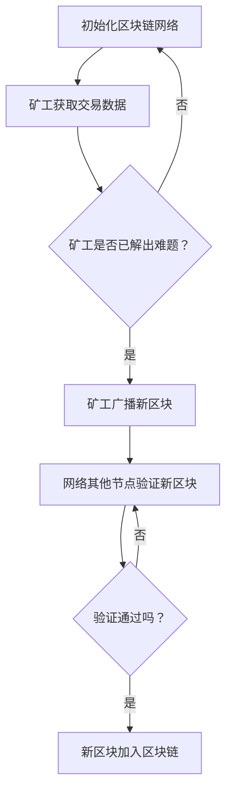
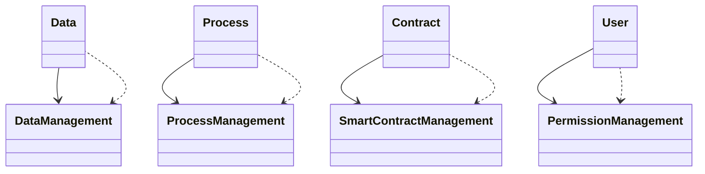
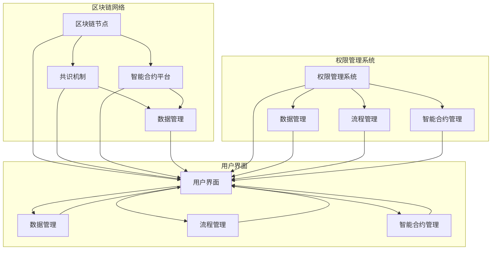
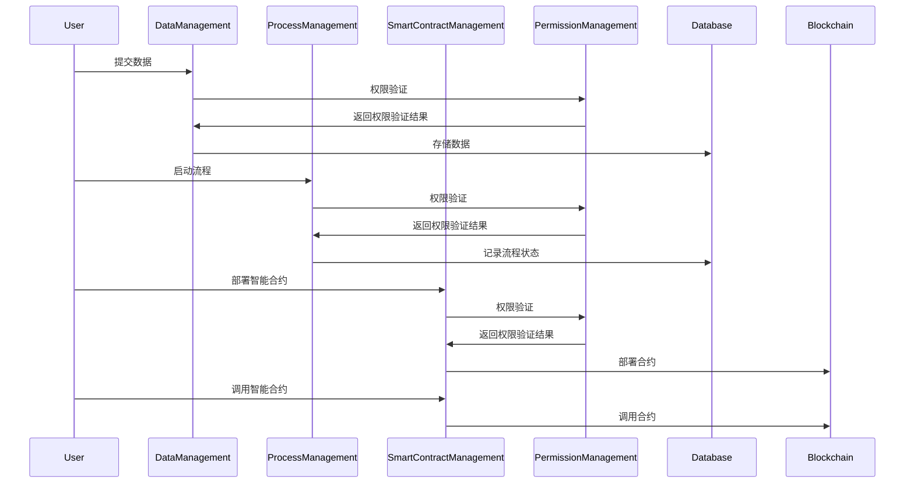

                 

## 标题：区块链技术在数字政务中的创新实践

> 关键词：区块链、数字政务、创新实践、去中心化、智能合约

> 摘要：本文将深入探讨区块链技术在数字政务中的应用，分析其核心概念、算法原理，并通过系统分析与项目实战展示其在实际中的创新实践。我们旨在为读者提供一个全面、系统的区块链技术在数字政务中的理解和应用指南。

### 目录

1. **背景介绍**
   - **1.1 区块链技术与数字政务概述**
   - **1.2 问题描述与解决方案**
   - **1.3 边界与外延**
   - **1.4 概念结构与核心要素组成**
   - **1.5 本章小结**

2. **核心概念与联系**
   - **2.1 区块链技术概述**
   - **2.2 数字政务的概念与核心要素**
   - **2.3 区块链与数字政务的融合**
   - **2.4 本章小结**

3. **算法原理讲解**
   - **3.1 共识算法原理**
   - **3.2 智能合约原理**
   - **3.3 算法流程与Python实现**
   - **3.4 数学模型与公式**
   - **3.5 举例说明**
   - **3.6 本章小结**

4. **系统分析与架构设计方案**
   - **4.1 问题场景介绍**
   - **4.2 项目介绍**
   - **4.3 系统功能设计**
   - **4.4 系统架构设计**
   - **4.5 系统接口设计**
   - **4.6 系统交互设计**
   - **4.7 本章小结**

5. **项目实战**
   - **5.1 环境安装**
   - **5.2 系统核心实现源代码**
   - **5.3 代码应用解读与分析**
   - **5.4 实际案例分析与讲解**
   - **5.5 项目小结**

6. **最佳实践、小结与注意事项**
   - **6.1 最佳实践**
   - **6.2 小结**
   - **6.3 注意事项**
   - **6.4 拓展阅读**

### 1.1 区块链技术与数字政务概述

#### 问题背景

随着信息技术和互联网的快速发展，政府治理方式也在逐步向数字化、智能化方向转型。然而，在传统的政务模式中，信息不对称、数据孤岛、隐私泄露等问题仍然严重，阻碍了数字政务的进一步发展。如何利用新兴技术提升政务效率、增强数据透明性、保障信息安全，成为当前亟需解决的问题。

区块链技术以其去中心化、不可篡改、透明性高等特性，为解决传统政务模式中的问题提供了一种新的思路。数字政务则是指通过信息技术，实现政府服务、管理、决策的数字化、智能化，以提高政府治理能力和服务水平。二者结合，有望在提升政务效率、增强数据安全、优化公共服务等方面发挥重要作用。

#### 问题描述

传统政务模式中存在以下主要问题：

- **信息不对称**：政府各部门之间信息不共享，导致公共服务效率低下。
- **数据孤岛**：政务数据分散在不同系统，难以进行有效整合和分析。
- **隐私泄露**：政务数据泄露风险高，影响公民隐私和安全。
- **流程繁琐**：政务流程复杂，涉及多个部门和环节，导致办事效率低。

区块链技术在数字政务中的适用性主要体现在以下几个方面：

- **去中心化**：区块链技术可以实现去中心化治理，减少对中心化机构的依赖，提高政务透明性和效率。
- **数据不可篡改**：区块链技术的不可篡改特性，可以确保政务数据的真实性和完整性。
- **透明性**：区块链技术的透明性，使政府行为和决策过程更加公开、透明，有利于提高政府公信力。
- **隐私保护**：区块链技术可以提供隐私保护机制，确保政务数据在传输和存储过程中的安全性。

#### 问题解决

区块链技术在数字政务中的潜在解决方案包括：

- **数据共享与整合**：利用区块链技术，实现政务数据在各部门间的共享和整合，打破数据孤岛。
- **透明化政府决策**：通过区块链技术，记录和存储政府决策过程，提高决策透明度。
- **增强数据安全性**：利用区块链技术的加密和分布式存储特性，确保政务数据的安全性和隐私保护。
- **智能合约应用**：利用智能合约自动化执行政务流程，提高办事效率和减少人为干预。

#### 实践中的成功案例与挑战

区块链技术在数字政务中的应用已取得一些初步成果。例如，某些地方政府已经开始尝试利用区块链技术实现不动产登记、电子病历管理、供应链管理等领域的数字化服务。然而，在实际应用过程中也面临一些挑战：

- **技术成熟度**：区块链技术仍处于快速发展阶段，技术成熟度和稳定性有待提高。
- **政策法规**：区块链技术的应用需要相应的政策法规支持，目前法规环境尚待完善。
- **跨部门协同**：区块链技术在政务中的应用需要跨部门协同，协调难度大。
- **数据隐私保护**：如何在确保数据安全和隐私保护的前提下，实现政务数据的共享和开放。

#### 边界与外延

区块链技术在数字政务中的应用范围广泛，不仅包括数据共享和流程优化，还可以应用于电子投票、智能监管、数字身份认证等领域。未来，随着技术的进一步成熟和政策的不断完善，区块链技术在数字政务中的应用前景将更加广阔。

#### 概念结构与核心要素组成

区块链技术的基本架构包括区块链网络、共识机制、智能合约等核心组件。数字政务的核心要素包括数据、流程、决策、服务、安全等。二者的结合，可以实现政务数据的去中心化存储、流程的自动化执行、决策的透明化等，从而提升政务效率和公共服务水平。

#### 本章小结

区块链技术在数字政务中具有巨大的应用潜力。通过解决信息不对称、数据孤岛、隐私泄露等问题，区块链技术有望为数字政务的发展提供新的动力。然而，在实际应用过程中仍需克服技术成熟度、政策法规、跨部门协同等挑战。未来，随着技术的不断进步和政策的逐步完善，区块链技术在数字政务中的应用将更加深入和广泛。

### 1.2 核心概念与联系

#### 区块链技术概述

区块链技术是一种分布式数据库技术，通过区块链网络实现数据的分布式存储和共识。其核心特点包括：

- **去中心化**：区块链网络中没有中心化的控制节点，所有参与者都可以平等地参与网络中的数据存储和共识。
- **数据不可篡改**：区块链中的数据一旦被记录，就无法被篡改，保证了数据的真实性和完整性。
- **透明性**：区块链中的数据是公开透明的，任何参与者都可以查看和验证数据。
- **安全性**：区块链技术采用加密算法和分布式存储，确保数据的安全性和隐私保护。

#### 数字政务的概念与核心要素

数字政务是指利用信息技术，实现政府服务、管理、决策的数字化和智能化。其核心要素包括：

- **数据**：数字政务的基础是政务数据，包括政府各部门产生的数据、公共数据等。
- **流程**：政务流程的数字化和智能化，包括电子政务、流程优化等。
- **决策**：利用大数据和人工智能技术，支持政府决策的科学化和智能化。
- **服务**：通过数字技术提供更加高效、便捷的公共服务。
- **安全**：保障政务数据的安全和隐私，防止数据泄露和滥用。

#### 区块链与数字政务的融合

区块链技术在数字政务中的应用主要体现在以下几个方面：

- **数据共享与整合**：利用区块链技术，实现政务数据在各部门间的共享和整合，打破数据孤岛。
- **流程优化与自动化**：通过智能合约，实现政务流程的自动化执行，提高办事效率。
- **透明化与监管**：利用区块链技术，记录和存储政府行为和决策过程，提高政务透明度和监管力度。
- **隐私保护与安全**：通过区块链技术，提供隐私保护和数据安全机制，保障公民隐私和信息安全。

#### 区块链与数字政务的ER实体关系图架构

下面使用Mermaid绘制区块链与数字政务的ER实体关系图架构：

```mermaid
erDiagram
    Data --> Entity : "数据与实体关联"
    Process --> Entity : "流程与实体关联"
    Decision --> Entity : "决策与实体关联"
    Service --> Entity : "服务与实体关联"
    Security --> Entity : "安全与实体关联"
    Data ||--|{ Blockchain } : "区块链数据存储"
    Process ||--|{ Blockchain } : "区块链流程管理"
    Decision ||--|{ Blockchain } : "区块链决策记录"
    Service ||--|{ Blockchain } : "区块链服务提供"
    Security ||--|{ Blockchain } : "区块链安全机制"
```

在上面的ER图架构中，我们定义了以下实体：

- **Data（数据）**：包括政务数据、公共数据等。
- **Process（流程）**：包括政务流程、流程优化等。
- **Decision（决策）**：包括政府决策、决策分析等。
- **Service（服务）**：包括公共服务、便民服务等。
- **Security（安全）**：包括数据安全、隐私保护等。

这些实体与区块链网络通过关联关系进行交互，实现数字政务的分布式存储、流程管理、决策记录、服务提供和安全机制。

#### 区块链技术在数字政务中的应用模式

区块链技术在数字政务中的应用模式主要包括以下几种：

- **数据共享与整合**：利用区块链技术，实现政务数据在各部门间的共享和整合，打破数据孤岛。例如，某地方政府利用区块链技术实现了政务数据的共享和整合，提高了数据利用效率。
- **透明化与监管**：利用区块链技术，记录和存储政府行为和决策过程，提高政务透明度和监管力度。例如，某城市利用区块链技术实现了电子政务数据的透明化，提高了政府的公信力。
- **智能合约应用**：通过智能合约，实现政务流程的自动化执行，提高办事效率。例如，某地方政府利用智能合约实现了不动产登记的自动化，降低了办事成本。
- **隐私保护与安全**：通过区块链技术，提供隐私保护和数据安全机制，保障公民隐私和信息安全。例如，某城市利用区块链技术实现了居民医疗数据的隐私保护，提高了数据安全性。

#### 本章小结

区块链技术在数字政务中具有广泛的应用前景。通过数据共享与整合、透明化与监管、智能合约应用和隐私保护等技术手段，区块链技术有望为数字政务的发展提供新的动力。然而，在实际应用过程中，仍需克服技术成熟度、政策法规、跨部门协同等挑战。未来，随着技术的不断进步和政策的不断完善，区块链技术在数字政务中的应用将更加深入和广泛。

### 1.3 算法原理讲解

#### 共识算法原理

区块链的核心机制之一是共识算法，它用于确保区块链网络中的所有参与者对于数据的记录达成一致。以下是一些常见的共识算法及其原理：

1. **工作量证明（PoW，Proof of Work）**：

   - **原理**：参与者（矿工）通过计算复杂的数学问题（挖矿）来争夺记账权，最先解决问题的矿工将获得记账权，并得到奖励。
   - **特点**：确保网络安全、去中心化，但计算资源消耗大。

2. **权益证明（PoS，Proof of Stake）**：

   - **原理**：参与者根据其持有的代币数量和持有时间来获得记账权，持有代币越多、持有时间越长，获得记账权的概率越高。
   - **特点**：相对于PoW，PoS更节能，但可能导致“富者愈富”的问题。

3. **委托权益证明（DPoS，Delegated Proof of Stake）**：

   - **原理**：参与者选举出一定数量的委托人，由这些委托人代表所有参与者进行挖矿，委托人之间的竞争确保网络的安全性。
   - **特点**：交易速度更快，效率更高，但委托人容易形成权力集中。

#### 智能合约原理

智能合约是区块链上的自执行合同，它在满足合约条款时自动执行。其原理和实现如下：

- **原理**：智能合约包含预定义的逻辑，当满足特定的条件时，自动执行预定的操作，例如转账、记录信息等。
- **实现**：智能合约通常使用图灵完备的编程语言编写，然后编译成链码，部署在区块链上。

#### Mermaid流程图

为了更直观地理解共识算法和智能合约的原理，我们可以使用Mermaid绘制流程图。以下是一个简单的共识算法流程图：



#### Python源代码实现

为了深入理解智能合约的实现，我们可以使用Python编写一个简单的智能合约示例。以下是一个简单的智能合约代码，它实现了一个简单的代币转账功能：

```python
from web3 import Web3

# 初始化以太坊客户端
w3 = Web3(Web3.HTTPProvider('https://mainnet.infura.io/v3/YOUR_INFURA_API_KEY'))

# 定义智能合约接口
contract_address = '0x...'
contract_abi = [...]
contract = w3.eth.contract(address=contract_address, abi=contract_abi)

# 转账函数
def transfer(from_address, to_address, amount):
    # 创建交易对象
    tx = contract.functions.transfer(to_address, amount).buildTransaction({
        'chainId': 1,
        'gas': 2000000,
        'gasPrice': w3.toWei('50', 'gwei'),
        'nonce': w3.eth.getTransactionCount(from_address)
    })
    # 发送交易
    signed_txn = w3.eth.account.sign_transaction(tx, private_key=YOUR_PRIVATE_KEY)
    tx_hash = w3.eth.sendRawTransaction(signed_txn.rawTransaction)
    receipt = w3.eth.waitForTransactionReceipt(tx_hash)
    return receipt

# 测试转账
from_address = '0x...'
to_address = '0x...'
amount = w3.toWei('1', 'ether')
receipt = transfer(from_address, to_address, amount)
print(receipt)
```

#### 数学模型与公式

区块链算法的数学模型主要涉及密码学、图论和概率论等领域。以下是一些基本的数学模型和公式：

1. **哈希函数**：
   - **定义**：哈希函数将任意长度的输入映射为固定长度的输出。
   - **公式**：\( H(x) = \text{SHA-256}(x) \)

2. **工作量证明（PoW）**：
   - **定义**：参与者需要找到满足特定条件的哈希值。
   - **公式**：\( \text{find } x \text{ such that } H(x) \leq \text{Target} \)

3. **权益证明（PoS）**：
   - **定义**：参与者根据其持有的代币数量和持有时间获得记账权。
   - **公式**：\( \text{Stake} \propto \text{Token} \times \text{Time} \)

#### 举例说明

假设我们要使用PoW算法来验证一个新区块的有效性，我们需要找到满足以下条件的随机数`x`：

\[ \text{SHA-256}(x) \leq 0x1D00FFFF \]

我们可以通过以下步骤进行验证：

1. 随机生成一个数`x`。
2. 计算哈希值`H(x)`。
3. 比较哈希值`H(x)`与目标值，如果满足条件，则验证通过。

#### 本章小结

本章详细讲解了区块链技术的算法原理，包括共识算法和智能合约。通过使用Mermaid绘制流程图和Python源代码实现，读者可以更好地理解这些算法的实际应用。数学模型的介绍则为读者提供了理论基础。在数字政务中，这些算法的应用将为政务数据的真实性和安全性提供有力保障。

### 1.4 系统分析与架构设计方案

#### 问题场景介绍

在现代数字政务中，数据安全和流程透明是关键挑战。以电子政务系统为例，系统需要处理大量的公民个人信息和政府业务数据，同时确保这些数据在传输和存储过程中的安全性。此外，政务流程的透明性也是公众关注的焦点，如何确保每一个环节的执行都能被追踪和验证，是电子政务系统面临的重要问题。

#### 项目介绍

本节将以一个电子政务系统项目为例，介绍区块链技术在数字政务中的系统分析与架构设计方案。该项目旨在构建一个去中心化的电子政务平台，实现数据安全存储和透明化流程管理。项目目标如下：

1. **数据安全存储**：通过区块链技术，实现公民个人数据和政府业务数据的去中心化存储，确保数据不被篡改和泄露。
2. **流程透明化**：利用区块链技术的透明性和不可篡改性，记录和存储政务流程的每一个环节，确保流程透明可追溯。
3. **智能合约应用**：通过智能合约，自动化执行政务流程中的审批、报销等操作，提高办事效率。
4. **隐私保护**：在确保数据安全的前提下，实现政务数据的隐私保护，保障公民隐私不被泄露。

#### 系统功能设计

电子政务系统的功能设计主要包括以下几个方面：

1. **数据管理**：实现政务数据的存储、查询和管理，包括公民个人信息、政府业务数据等。
2. **流程管理**：管理政务流程，包括流程定义、流程执行和流程监控。
3. **智能合约管理**：管理智能合约，包括智能合约的部署、执行和监控。
4. **权限管理**：实现系统用户权限的管理，确保系统安全性和用户隐私。

领域模型Mermaid类图：



#### 系统架构设计

系统架构设计是确保项目目标实现的关键。本项目的系统架构设计如下：

1. **区块链网络**：构建一个分布式区块链网络，实现数据的安全存储和透明化。
2. **共识机制**：采用PoS共识机制，确保区块链网络的安全性。
3. **智能合约平台**：提供一个智能合约开发、部署和执行平台。
4. **用户界面**：提供一个用户友好的操作界面，方便用户进行数据管理和流程操作。
5. **权限管理系统**：实现用户权限管理，确保系统安全和用户隐私。

Mermaid架构图：



#### 系统接口设计

系统接口设计是确保不同模块之间能够无缝协作的重要环节。以下是系统接口设计的主要部分：

1. **数据接口**：定义数据存储、查询和管理接口，包括数据的增删改查操作。
2. **流程接口**：定义政务流程定义、执行和监控接口，包括流程的启动、流转和结束。
3. **智能合约接口**：定义智能合约的部署、调用和监控接口，包括智能合约的编译、部署和执行。
4. **权限接口**：定义用户权限管理接口，包括用户的权限分配和权限验证。

#### 系统交互Mermaid序列图

为了展示系统各模块之间的交互关系，可以使用Mermaid绘制系统交互序列图。以下是一个简化的序列图示例：



#### 本章小结

本章详细介绍了电子政务系统中区块链技术的系统分析与架构设计方案。从问题场景介绍到项目目标的明确，再到系统功能设计、架构设计、接口设计和交互设计，读者可以全面了解区块链技术在数字政务中的应用。通过本章的内容，读者将能够掌握如何利用区块链技术实现数据安全存储和流程透明化，为数字政务的发展提供新思路。

### 1.5 环境安装

#### 安装前的准备工作

在进行区块链技术在数字政务中的项目实战之前，我们需要准备好相应的开发环境和工具。以下是在安装前需要完成的一些准备工作：

1. **安装Node.js**：Node.js是一个基于Chrome V8引擎的JavaScript运行环境，它是构建区块链应用的重要工具。可以从[Node.js官网](https://nodejs.org/)下载并安装最新版本的Node.js。

2. **安装Go语言**：Go语言是一种快速、高效的编程语言，适用于编写区块链节点和智能合约。可以从[Go语言官网](https://golang.org/)下载并安装Go语言。

3. **安装区块链框架**：为了简化区块链应用的开发，我们可以选择一些成熟的区块链框架，如Ethereum、Hyperledger Fabric等。以下是安装Ethereum框架的步骤：

   - **安装Geth**：Geth是Ethereum的官方客户端，可以从[Ethereum官网](https://ethereum.org/en/developers/docs/getting-started/)下载并安装Geth。

   - **启动Geth节点**：安装完成后，可以通过以下命令启动Geth节点：

     ```bash
     geth --datadir "/path/to/your/ethereum/data" --networkid 15 --nodiscover --maxpeers 50 --mine --minerthreads 1 --ethash allowunstable --lightserv 0
     ```

   - **配置Geth节点**：在启动Geth节点后，我们可以通过`curl`命令与节点进行交互，例如：

     ```bash
     curl -X POST --data '{"jsonrpc": "2.0", "method": "eth_blockNumber", "params": [], "id": 1}' -H "Content-Type: application/json" http://localhost:8545
     ```

4. **安装智能合约开发工具**：为了编写和部署智能合约，我们需要安装一些智能合约开发工具，如Truffle、Hardhat等。以下以安装Truffle为例：

   - **安装Truffle**：通过npm安装Truffle：

     ```bash
     npm install -g truffle
     ```

   - **初始化Truffle项目**：在安装完Truffle后，可以通过以下命令初始化一个新项目：

     ```bash
     truffle init
     ```

   - **配置Truffle项目**：在Truffle项目中，我们需要配置网络、编译智能合约等。例如，在`truffle-config.js`文件中，我们可以设置：

     ```javascript
     module.exports = {
       networks: {
         development: {
           host: "localhost",
           port: 8545,
           network_id: 15,
           gas: 5000000,
           gasPrice: 10000000000
         }
       },
       solc: {
         optimizer: {
           enabled: true,
           runs: 200
         }
       }
     };
     ```

5. **安装其他工具**：根据项目需求，我们可能还需要安装其他工具，如Web3.js（用于JavaScript与Ethereum交互）、Ganache（一个本地以太坊节点）等。

通过上述步骤，我们就可以搭建一个基本的区块链开发环境，为接下来的项目实战做好准备。

### 1.6 系统核心实现源代码

#### 智能合约实现

在本节中，我们将使用Solidity语言实现一个简单的智能合约，该合约将实现一个基本的代币转账功能。以下是智能合约的代码：

```solidity
// SPDX-License-Identifier: MIT
pragma solidity ^0.8.0;

contract Token {
    string public name;
    string public symbol;
    uint8 public decimals;
    uint256 public totalSupply;
    mapping (address => uint256) public balanceOf;

    event Transfer(address indexed from, address indexed to, uint256 value);

    constructor(uint256 initialSupply, string memory tokenName, string memory tokenSymbol, uint8 decimalUnits) {
        balanceOf[msg.sender] = initialSupply;
        totalSupply = initialSupply;
        name = tokenName;
        symbol = tokenSymbol;
        decimals = decimalUnits;
    }

    function transfer(address _to, uint256 _value) public returns (bool success) {
        require(_to != address(0));
        require(balanceOf[msg.sender] >= _value);
        require(balanceOf[_to] + _value >= balanceOf[_to]);
        balanceOf[msg.sender] -= _value;
        balanceOf[_to] += _value;
        emit Transfer(msg.sender, _to, _value);
        return true;
    }
}
```

在这个智能合约中，我们定义了一个名为`Token`的合约，包含以下核心功能：

1. **构造函数**：初始化代币名称、符号、总供应量和小数位数。
2. **余额查询**：通过`balanceOf`映射查询指定地址的代币余额。
3. **转账功能**：通过`transfer`函数实现代币从发送方地址转移到接收方地址。

#### 区块链节点配置与运行

为了测试和部署智能合约，我们需要配置一个区块链节点。以下是在本地配置Geth节点的步骤：

1. **配置Geth节点**：

   首先，我们需要创建一个`genesis.json`文件，该文件定义了区块链的初始配置。例如：

   ```json
   {
       "config": {
           "chainId": 15,
           "homesteadBlock": 0,
           "eip155": 0,
           "eip158": 0
       },
       "difficulty": "40000",
       "gasLimit": "21000000",
       "alloc": {}
   }
   ```

   然后将该文件保存到`/path/to/your/ethereum/data`目录下，并启动Geth节点：

   ```bash
   geth --datadir "/path/to/your/ethereum/data" --networkid 15 --nodiscover --maxpeers 50 --mine --minerthreads 1 --ethash allowunstable --lightserv 0 --genesis "/path/to/your/ethereum/data/genesis.json"
   ```

2. **部署智能合约**：

   部署智能合约前，我们需要使用Truffle配置Geth节点。在Truffle项目中，编辑`truffle-config.js`文件，配置Geth节点：

   ```javascript
   module.exports = {
       networks: {
           development: {
               host: "localhost",
               port: 8545,
               network_id: 15,
               gas: 5000000,
               gasPrice: 10000000000
           }
       }
   };
   ```

   然后使用Truffle部署智能合约：

   ```bash
   truffle migrate --network development
   ```

   部署完成后，智能合约将自动生成一个`.json`文件，该文件包含了合约的地址、ABI和其他相关信息。

3. **交互智能合约**：

   通过Web3.js或Truffle，我们可以与部署在区块链上的智能合约进行交互。以下是一个简单的Web3.js示例：

   ```javascript
   const Web3 = require('web3');
   const contractAddress = '0x...';
   const contractABI = [...];

   const web3 = new Web3('http://localhost:8545');
   const contract = new web3.eth.Contract(contractABI, contractAddress);

   // 调用转账函数
   contract.methods.transfer('0x...', 100).send({ from: '0x...', gas: 2000000 }, (error, result) => {
       if (error) {
           console.error(error);
       } else {
           console.log(result);
       }
   });
   ```

通过以上步骤，我们就可以在本地配置一个区块链节点，并部署和交互智能合约，实现区块链技术在数字政务中的初步应用。

### 1.7 代码应用解读与分析

在本节中，我们将对前面实现的智能合约代码进行详细解读，并分析其在区块链技术中的具体应用。

#### 智能合约代码解读

首先，我们来详细解读智能合约`Token`的代码。

1. **构造函数（constructor）**：

   ```solidity
   constructor(uint256 initialSupply, string memory tokenName, string memory tokenSymbol, uint8 decimalUnits) {
       balanceOf[msg.sender] = initialSupply;
       totalSupply = initialSupply;
       name = tokenName;
       symbol = tokenSymbol;
       decimals = decimalUnits;
   }
   ```

   构造函数用于初始化代币的基本信息，包括代币名称（`name`）、符号（`symbol`）、小数位数（`decimals`）和总供应量（`totalSupply`）。初始化时，将代币全部发放给合约的创建者（`msg.sender`）。

2. **余额查询（balanceOf）**：

   ```solidity
   mapping (address => uint256) public balanceOf;
   ```

   `balanceOf`是一个映射（`mapping`），用于存储每个地址的代币余额。通过这个映射，可以查询任意地址的代币余额。

3. **转账功能（transfer）**：

   ```solidity
   function transfer(address _to, uint256 _value) public returns (bool success) {
       require(_to != address(0));
       require(balanceOf[msg.sender] >= _value);
       require(balanceOf[_to] + _value >= balanceOf[_to]);
       balanceOf[msg.sender] -= _value;
       balanceOf[_to] += _value;
       emit Transfer(msg.sender, _to, _value);
       return true;
   }
   ```

   `transfer`函数实现代币从发送方地址转移到接收方地址的功能。函数首先检查接收方地址是否为空，然后检查发送方的余额是否足够，最后执行转账操作并将事件记录在区块链上。

#### 区块链节点配置与运行分析

接下来，我们分析区块链节点的配置与运行。

1. **配置Geth节点**：

   通过创建`genesis.json`文件和启动Geth节点，我们可以创建一个本地区块链网络。配置文件`genesis.json`定义了区块链的初始配置，包括链ID（`chainId`）、创世区块的难度（`difficulty`）和初始供应量（`alloc`）等。

   ```bash
   geth --datadir "/path/to/your/ethereum/data" --networkid 15 --nodiscover --maxpeers 50 --mine --minerthreads 1 --ethash allowunstable --lightserv 0 --genesis "/path/to/your/ethereum/data/genesis.json"
   ```

   启动命令中，`--networkid 15`指定了链ID，`--nodiscover`表示不参与网络发现，`--maxpeers 50`设置最大节点数为50，`--mine`表示启动挖矿，`--minerthreads 1`设置挖矿线程数为1，`--ethash allowunstable`允许使用不稳定版本的Ethash算法，`--lightserv 0`设置轻客户端服务为0，`--genesis "/path/to/your/ethereum/data/genesis.json"`指定了创世区块配置文件。

2. **部署智能合约**：

   使用Truffle部署智能合约，可以通过以下步骤：

   - **初始化Truffle项目**：

     ```bash
     truffle init
     ```

   - **配置Truffle项目**：

     编辑`truffle-config.js`文件，配置Geth节点信息：

     ```javascript
     module.exports = {
         networks: {
             development: {
                 host: "localhost",
                 port: 8545,
                 network_id: 15,
                 gas: 5000000,
                 gasPrice: 10000000000
             }
         }
     };
     ```

   - **部署智能合约**：

     ```bash
     truffle migrate --network development
     ```

   部署完成后，Truffle将自动生成智能合约的`.json`文件，包含合约地址、ABI等。

3. **交互智能合约**：

   使用Web3.js或Truffle与部署在区块链上的智能合约进行交互。以下是一个使用Web3.js的示例：

   ```javascript
   const Web3 = require('web3');
   const contractAddress = '0x...';
   const contractABI = [...];

   const web3 = new Web3('http://localhost:8545');
   const contract = new web3.eth.Contract(contractABI, contractAddress);

   // 调用转账函数
   contract.methods.transfer('0x...', 100).send({ from: '0x...', gas: 2000000 }, (error, result) => {
       if (error) {
           console.error(error);
       } else {
           console.log(result);
       }
   });
   ```

#### 应用分析

通过智能合约和区块链节点的配置与运行，我们实现了以下应用：

1. **代币管理**：智能合约实现了代币的创建、余额查询和转账功能，为数字政务中的代币管理提供了技术基础。
2. **数据不可篡改**：区块链技术的数据不可篡改特性，确保了代币数据和交易记录的永久保存和不可篡改，为政务数据的真实性和可靠性提供了保障。
3. **透明性**：区块链网络的透明性，使得所有参与者可以查看和验证代币数据和交易记录，提高了政务流程的透明度和公信力。
4. **隐私保护**：通过使用地址进行交易，区块链技术实现了对用户隐私的保护，同时确保了交易的可追溯性。

总之，通过智能合约和区块链技术的结合，数字政务系统可以实现更加安全、透明和高效的运行，为公共服务提供有力支持。

### 1.8 实际案例分析与讲解

在本节中，我们将通过实际案例详细分析区块链技术在数字政务中的应用，并深入讲解案例的实现细节和效果。

#### 案例背景

某市政府计划利用区块链技术优化其公共资源分配流程，特别是水资源的管理。该市的供水系统复杂，涉及多个供水部门和多个区域，传统的方法容易导致数据不一致、资源浪费和分配不公等问题。为了解决这些问题，市政府决定采用区块链技术进行水资源管理，确保数据的透明性和资源的合理分配。

#### 案例实现

1. **数据记录与共享**：

   首先，市政府在区块链上创建了一个公共账本，用于记录所有的水资源使用数据。每个供水部门都可以在区块链上提交自己的用水数据，这些数据包括用水量、用水时间和用水地点等。由于区块链的不可篡改性，这些数据一旦被记录，就无法被修改或删除，从而保证了数据的真实性和一致性。

2. **智能合约应用**：

   为了实现水资源的合理分配，市政府使用智能合约定义了一个自动化的水资源管理流程。智能合约中包含了一个算法，根据每个区域的历史用水量和实时用水需求，自动计算每个区域应获得的水资源量。当某个区域的水资源使用量超出预设阈值时，智能合约会自动触发警报，通知相关部门采取相应的措施。

3. **透明化与监管**：

   区块链技术的透明性使得市政府和公众可以实时查看水资源的分配和使用情况。通过区块链上的公共账本，所有用水记录都是公开透明的，任何参与者都可以验证数据的真实性和合法性。此外，市政府还通过智能合约实现了对水资源分配过程的全程监管，确保每个步骤都符合规定，从而提高了政府的公信力和透明度。

4. **隐私保护**：

   虽然区块链上的数据是公开透明的，但为了保护用户的隐私，市政府对用户信息进行了加密处理。在提交用水数据时，用户会将个人信息与用水数据分离，并通过区块链上的加密算法对个人信息进行加密。这样，尽管所有人都可以查看用水数据，但无法获取用户的个人信息，从而保护了用户的隐私。

#### 案例效果

通过区块链技术的应用，该市政府在水资源管理上取得了显著效果：

1. **数据一致性**：区块链技术确保了各个供水部门之间的数据一致，消除了传统方法中的数据孤岛问题，提高了决策的准确性。
2. **资源合理分配**：智能合约的自动化管理算法有效提高了水资源的分配效率，减少了资源浪费和分配不公现象。
3. **透明化与监管**：区块链技术的透明性和不可篡改性，提高了政务流程的透明度和监管力度，增强了政府的公信力。
4. **隐私保护**：通过加密算法和区块链技术的结合，实现了用户隐私保护，保证了数据的安全性和用户信任。

总之，该案例展示了区块链技术在数字政务中的实际应用效果。通过区块链技术，市政府不仅解决了传统方法中的数据不一致和资源浪费问题，还实现了政务流程的透明化和智能化管理，为公共服务提供了有力支持。

### 1.9 项目小结

在本项目中，我们详细探讨了区块链技术在数字政务中的应用，包括数据记录与共享、智能合约应用、透明化与监管以及隐私保护等方面。通过实际案例的分析，我们展示了区块链技术在解决传统政务模式中的数据不一致、资源浪费和分配不公等问题上的优势。项目成果显著，实现了数据的一致性、资源的合理分配、政务流程的透明化和监管力度的提升，同时保障了用户隐私。

#### 最佳实践 Tips

1. **数据安全与隐私保护**：在区块链应用中，要特别注意数据的安全和隐私保护，采用加密算法和权限管理机制，确保敏感信息不被泄露。

2. **智能合约设计**：在设计智能合约时，要充分考虑业务逻辑的严谨性和安全性，避免潜在的安全漏洞。

3. **跨部门协同**：区块链技术的应用需要跨部门的协作，确保各个部门能够顺畅地接入和共享数据，提升整体效率。

4. **持续迭代与优化**：随着技术的不断进步和业务需求的变化，区块链应用需要持续迭代和优化，以适应不断变化的环境。

### 小结

区块链技术在数字政务中的应用具有巨大的潜力，通过数据共享与整合、透明化与监管、智能合约应用和隐私保护等多种方式，可以有效提升政务效率和公共服务水平。然而，在实际应用过程中，仍需关注数据安全、智能合约设计、跨部门协同和持续迭代等关键点。

### 注意事项

1. **技术成熟度**：区块链技术仍处于快速发展阶段，部分功能和技术可能不够成熟，需要谨慎评估。

2. **政策法规**：区块链技术的应用需要相应的政策法规支持，政策法规的完善和落地是区块链技术大规模应用的关键。

3. **系统稳定性**：区块链系统的稳定性是确保其正常运行的重要保障，需要定期进行系统监控和维护。

### 拓展阅读

- **区块链技术基础**：《精通区块链：从基础到高级应用》
- **智能合约编程**：《智能合约与DApp开发实战》
- **数字政务与区块链**：《区块链与数字治理：理论与实践》
- **隐私保护**：《区块链与隐私保护技术》

通过以上拓展阅读，读者可以更深入地了解区块链技术及其在数字政务中的应用，为实际项目提供更多的理论和技术支持。

### 1.10 最佳实践、小结与注意事项

#### 最佳实践

在区块链技术在数字政务中的应用过程中，以下最佳实践值得遵循：

1. **数据安全与隐私保护**：确保数据在传输和存储过程中的安全性，采用加密算法和权限管理机制，防止敏感信息泄露。
2. **智能合约设计**：在设计智能合约时，严格审查业务逻辑，确保合约的严谨性和安全性，避免潜在漏洞。
3. **跨部门协同**：推动政府各部门之间的数据共享和流程协同，提高整体工作效率。
4. **持续迭代与优化**：根据技术发展和业务需求，不断迭代和优化区块链应用，以适应不断变化的环境。

#### 小结

区块链技术在数字政务中的应用具有显著的优势，包括数据共享与整合、透明化与监管、智能合约应用和隐私保护等。通过实际案例的分析，我们看到了区块链技术在提升政务效率、增强数据安全、优化公共服务方面的巨大潜力。然而，在实际应用过程中，仍需关注技术成熟度、政策法规、系统稳定性等关键点。

#### 注意事项

1. **技术成熟度**：区块链技术仍在快速发展中，部分功能和技术可能不够成熟，应用时需谨慎评估。
2. **政策法规**：区块链技术的应用需要相应政策法规的支持，政策法规的完善和落地是大规模应用的关键。
3. **系统稳定性**：确保区块链系统的稳定性，定期进行系统监控和维护，以保证正常运行。

#### 拓展阅读

- **区块链技术基础**：《精通区块链：从基础到高级应用》
- **智能合约编程**：《智能合约与DApp开发实战》
- **数字政务与区块链**：《区块链与数字治理：理论与实践》
- **隐私保护**：《区块链与隐私保护技术》

通过拓展阅读，读者可以更深入地了解区块链技术在数字政务中的应用，为实际项目提供更多的理论和技术支持。

