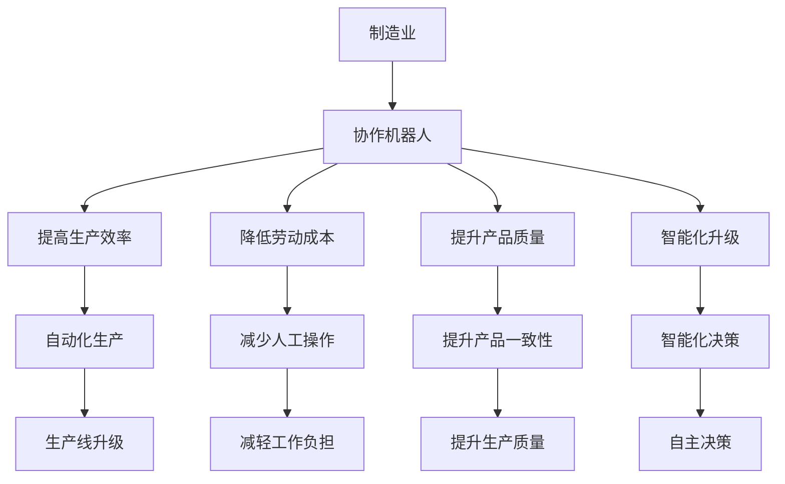
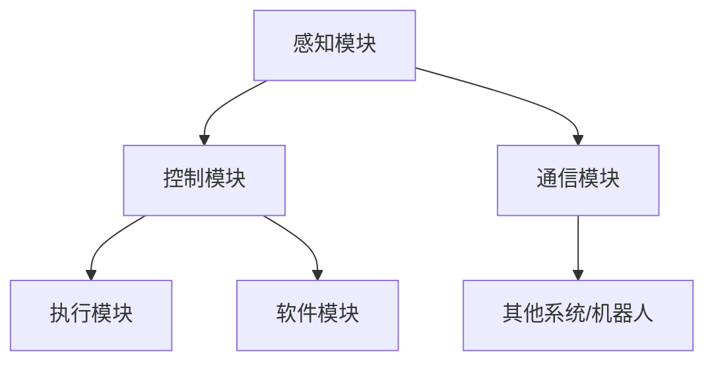
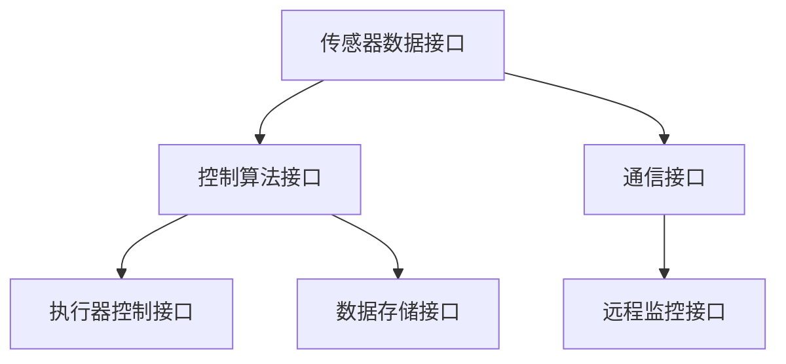

                 


### 背景介绍

协作机器人（Collaborative Robot，简称Cobot）是一种专为与人类工作者协同作业而设计的机器人。随着智能制造和工业4.0的不断发展，制造业面临着生产效率、劳动成本和产品质量等方面的挑战。传统制造业主要依赖大规模自动化生产线，这些生产线具有高度的自动化程度和灵活性，但在人与机器之间的协作上存在一定的限制。协作机器人的出现为制造业带来了一股新风，它能够与人类工作者共同工作，提高生产效率，降低劳动成本，并提升产品质量。

制造业，作为国民经济的重要支柱，近年来面临着诸多挑战。首先，随着人工成本的不断上涨，企业对自动化和智能化的需求日益增加。其次，生产效率低下和产品质量不稳定也是制造业亟待解决的问题。此外，传统生产线对环境的适应性较差，难以应对多样化的生产需求。协作机器人的引入，能够在一定程度上缓解这些挑战。通过协作机器人，企业可以实现小批量、多品种的生产模式，降低生产成本，提高生产效率。

协作机器人在制造业中的应用，不仅能够提升生产效率，还能够改善工作环境。传统生产线上的操作员需要长时间在恶劣的环境下工作，而协作机器人的引入，可以减轻操作员的工作强度，提高工作效率。同时，协作机器人能够通过传感器实时监测生产线状态，及时发现并解决潜在问题，从而提高生产质量。

总之，协作机器人作为制造业的重要创新技术，具有广阔的应用前景。在接下来的章节中，我们将深入探讨协作机器人的核心概念、技术原理、应用案例、系统架构以及项目实战等内容，以期为读者提供全面而详实的了解。

### 核心概念与联系

在深入探讨协作机器人在制造业中的应用之前，有必要明确一些核心概念，包括协作机器人、制造业和应用趋势等。

#### 协作机器人的定义

协作机器人是一种专门设计用于与人类共同工作环境的机器人。与传统的工业机器人不同，协作机器人具有更高的灵活性和安全性，能够直接在人类工作者附近工作，无需物理隔离。其主要特点包括：

1. **高灵活性**：协作机器人通常采用模块化设计，能够快速适应不同的生产任务和场景。
2. **安全性**：协作机器人具有安全检测和避障功能，能够在与人类共同工作的环境中自动识别并规避障碍物，降低事故风险。
3. **易编程性**：协作机器人通常采用图形化编程界面，操作简单，易于编程和调整。

#### 制造业的定义

制造业是指利用机械设备和工具，通过对原材料进行加工、组装等工序，生产出各种产品的行业。制造业是国民经济的重要支柱，涵盖了从原材料加工到成品生产的整个产业链。制造业的主要特点包括：

1. **大规模生产**：传统制造业通常采用大规模自动化生产线，生产效率高，但灵活性较差。
2. **多样化需求**：随着市场需求的不断变化，制造业需要能够快速调整生产模式，满足多样化的产品需求。
3. **高劳动强度**：传统生产线上的操作员工作强度大，生产环境较为恶劣。

#### 应用趋势的概念

应用趋势是指某一技术在特定领域中的应用方向和发展潜力。在制造业中，协作机器人的应用趋势主要体现在以下几个方面：

1. **提高生产效率**：协作机器人能够快速部署，适应不同的生产任务，提高生产效率。
2. **降低劳动成本**：通过协作机器人，企业可以减少对人工的依赖，降低生产成本。
3. **提升产品质量**：协作机器人具有高精度的定位和控制能力，能够提升产品质量和一致性。
4. **智能化升级**：随着人工智能技术的发展，协作机器人将逐步实现自主决策和智能化操作，推动制造业向智能化方向发展。

#### 协作机器人与制造业的关联性

协作机器人与制造业之间存在着紧密的关联性。首先，协作机器人能够替代部分重复性、高劳动强度的操作，减轻操作员的工作负担。其次，协作机器人能够实现生产过程的自动化和智能化，提高生产效率和产品质量。此外，协作机器人还能够与现有生产线无缝集成，实现生产线的升级和优化。

为了更直观地理解协作机器人与制造业之间的关系，我们可以使用Mermaid绘制一个ER（Entity-Relationship，实体关系）图，如下所示：



通过这个ER图，我们可以清晰地看到协作机器人与制造业各个方面的关联性，以及协作机器人在制造业中的重要作用。

### 技术原理讲解

在了解了协作机器人和制造业的基本概念后，接下来我们将深入探讨协作机器人的关键技术原理。协作机器人的核心技术包括传感器技术、控制算法和通信技术等。下面将逐一介绍这些技术的原理和应用。

#### 传感器技术

传感器是协作机器人的感知器官，它能够检测并收集环境信息，如温度、湿度、位置、速度、颜色等。这些信息对于协作机器人实现精准控制和安全协作至关重要。常见的传感器包括视觉传感器、激光雷达、超声波传感器和触摸传感器等。

- **视觉传感器**：通过摄像头获取图像，可以用于物体识别、定位和跟踪。例如，使用OpenCV库可以实现对图像的处理和分析。
- **激光雷达**：用于测量距离和构建三维环境地图。激光雷达具有高分辨率和高精度，广泛应用于机器人避障和路径规划。
- **超声波传感器**：通过发射和接收超声波信号来测量距离。超声波传感器结构简单，成本低，适合短距离测距。
- **触摸传感器**：用于检测物体的接触和压强，可以用于协作机器人与人类工作者的交互。

以下是一个简单的Python代码示例，使用OpenCV库处理图像，实现物体识别：

```python
import cv2

# 读取图像
image = cv2.imread('image.jpg')

# 转换为灰度图像
gray = cv2.cvtColor(image, cv2.COLOR_BGR2GRAY)

# 使用SIFT算法进行特征提取
sift = cv2.xfeatures2d.SIFT_create()
keypoints, descriptors = sift.detectAndCompute(gray, None)

# 在原图中绘制特征点
image_with_keypoints = cv2.drawKeypoints(image, keypoints, None, (0, 0, 255))

# 显示图像
cv2.imshow('Image with Keypoints', image_with_keypoints)
cv2.waitKey(0)
cv2.destroyAllWindows()
```

#### 控制算法

控制算法是协作机器人的核心，它负责根据传感器收集到的信息，对机器人进行定位、路径规划和运动控制。常见的控制算法包括PID控制、轨迹规划和机器学习等。

- **PID控制**：PID（比例-积分-微分）控制是最常用的控制算法之一，它通过调整比例、积分和微分三个参数，实现对系统输出的精确控制。PID控制适用于线性系统，可以通过以下公式表示：

  $$
  u(t) = K_p e(t) + K_i \int_{0}^{t} e(\tau) d\tau + K_d \frac{de(t)}{dt}
  $$

  其中，$u(t)$为控制输出，$e(t)$为误差，$K_p$、$K_i$和$K_d$分别为比例、积分和微分系数。

- **轨迹规划**：轨迹规划是指机器人根据目标位置和速度要求，生成一条最优路径。常见的轨迹规划算法包括贝塞尔曲线、样条曲线和A*算法等。以下是一个简单的贝塞尔曲线轨迹规划示例：

  ```python
  import numpy as np

  # 贝塞尔曲线参数
  t = np.linspace(0, 1, 100)
  x = 400 * (1 - t)**3
  y = 400 * t**3

  # 生成贝塞尔曲线的点
  x_points = np.interp(t, np.arange(0, 1, 0.01), x)
  y_points = np.interp(t, np.arange(0, 1, 0.01), y)

  # 绘制贝塞尔曲线
  plt.plot(x_points, y_points)
  plt.show()
  ```

- **机器学习**：机器学习算法在协作机器人中的应用越来越广泛，如深度强化学习和神经网络等。通过机器学习，协作机器人可以自动调整控制策略，提高自适应能力和决策能力。

#### 通信技术

协作机器人需要与其他系统进行通信，以实现数据交换和协同工作。常见的通信技术包括无线通信、有线通信和网络通信等。

- **无线通信**：无线通信技术如Wi-Fi、蓝牙和5G等，可以实现机器人与云端服务器、其他机器人和传感器之间的无线连接。以下是一个使用Wi-Fi通信的简单示例：

  ```python
  import socket

  # 创建TCP套接字
  s = socket.socket(socket.AF_INET, socket.SOCK_STREAM)

  # 连接到服务器
  s.connect(('192.168.1.1', 12345))

  # 发送数据
  s.sendall(b'Hello, server!')

  # 接收数据
  data = s.recv(1024)
  print('Received', repr(data))

  # 关闭连接
  s.close()
  ```

- **有线通信**：有线通信技术如以太网和串口等，具有高带宽和低延迟的特点，适用于数据量大、实时性要求高的场景。

- **网络通信**：网络通信技术如HTTP、HTTPS和MQTT等，可以实现机器人与互联网的连接，实现远程监控和控制。

通过以上对传感器技术、控制算法和通信技术的介绍，我们可以看到协作机器人技术的复杂性和多样性。这些技术共同构成了协作机器人实现高效、安全、智能作业的基础。在接下来的章节中，我们将通过实际应用案例，进一步展示这些技术的具体应用和效果。

### 应用案例分析

为了更直观地展示协作机器人在制造业中的应用效果，我们将分析几个实际案例，探讨协作机器人在不同制造业场景中的应用。

#### 案例一：汽车制造中的协作机器人

汽车制造业是协作机器人应用较早且较为广泛的领域之一。以下是一个具体的应用案例：

- **场景介绍**：在某汽车制造厂，协作机器人被用于车身涂装工序。传统涂装工序需要大量人力操作，存在安全隐患和环境污染问题。协作机器人能够自动完成喷漆工作，减少了人工操作，提高了生产效率。

- **应用效果**：通过协作机器人的应用，涂装工序的效率提高了30%，人工成本降低了20%，同时涂装质量得到了显著提升，涂装一致性达到了国际先进水平。

- **挑战**：在应用过程中，挑战主要包括喷漆环境的复杂性和机器人涂装技术的稳定性。协作机器人需要具备高精度的位置控制和避障能力，同时要适应涂装环境中的高温、高压和有害物质。

#### 案例二：电子制造业中的协作机器人

电子制造业是协作机器人应用的另一个重要领域。以下是一个具体的应用案例：

- **场景介绍**：在某电子厂，协作机器人被用于SMT（表面贴装技术）生产线上的元器件焊接。传统SMT生产线需要大量工人操作，工作效率较低，且操作环境复杂。

- **应用效果**：通过协作机器人的应用，SMT生产线的效率提高了50%，人工成本降低了40%，同时生产过程更加安全，焊接质量更加稳定。

- **挑战**：在电子制造业中，挑战主要包括元器件的小型化和多样性。协作机器人需要具备高精度的定位和焊接能力，同时要适应不同类型元器件的焊接要求。

#### 案例三：食品制造业中的协作机器人

食品制造业对卫生和效率的要求较高，协作机器人在这里也有广泛的应用。以下是一个具体的应用案例：

- **场景介绍**：在某食品厂，协作机器人被用于食品包装工序。传统包装工序需要大量人工操作，存在卫生隐患和效率问题。协作机器人能够自动完成包装工作，提高了生产效率和卫生标准。

- **应用效果**：通过协作机器人的应用，包装工序的效率提高了40%，人工成本降低了30%，同时产品包装的整齐度和一致性得到了显著提升。

- **挑战**：在食品制造业中，挑战主要包括食品的易碎性和生产环境的特殊性。协作机器人需要具备高精度的操作和防尘防水能力，同时要适应食品生产过程中的高温、高湿等环境。

通过以上实际案例的分析，我们可以看到协作机器人在不同制造业场景中的应用效果和挑战。协作机器人不仅提高了生产效率和产品质量，还改善了工作环境，降低了人工成本。然而，在实际应用中，还需要克服一系列技术和管理上的挑战。在接下来的章节中，我们将进一步探讨协作机器人的系统架构和设计，以期为实际应用提供更有力的技术支持。

### 系统架构与设计

协作机器人系统架构是实现高效、安全、智能作业的关键。一个完整的协作机器人系统包括硬件、软件和通信模块等多个部分。下面，我们将详细介绍协作机器人系统的架构设计，包括系统架构图和系统接口设计。

#### 系统架构

协作机器人系统的架构可以分解为以下几个主要模块：

1. **感知模块**：包括各种传感器，如视觉传感器、激光雷达、超声波传感器等，用于感知环境信息。
2. **控制模块**：负责处理传感器数据，执行控制算法，生成运动指令。
3. **执行模块**：包括执行器，如电机、气缸等，负责执行控制指令。
4. **通信模块**：负责与其他系统或机器人进行数据交换和通信。
5. **软件模块**：包括操作系统、应用软件、数据处理和分析算法等。

系统架构图如下所示：



#### 系统接口设计

系统接口设计是确保协作机器人系统各模块之间能够高效协作的重要环节。以下是一个简化的系统接口设计图：



#### 系统接口功能说明

1. **传感器数据接口**：用于传感器数据读取，包括图像、激光扫描数据和触觉信息等，提供给控制模块进行处理。
2. **控制算法接口**：用于控制模块与执行器之间的交互，包括运动规划、路径规划和PID控制等算法的实现。
3. **执行器控制接口**：用于执行器的启动、停止和状态监控，确保执行器按照控制模块的指令进行操作。
4. **通信接口**：用于与其他系统或机器人进行数据交换，如云端服务器、其他协作机器人等。
5. **数据存储接口**：用于数据的存储和备份，包括传感器数据、控制指令和历史日志等。
6. **远程监控接口**：用于远程监控和调试，通过该接口，操作人员可以实时查看协作机器人的工作状态和执行情况。

通过以上系统架构和接口设计，我们可以看到协作机器人系统的复杂性及其各模块之间的紧密联系。在接下来的章节中，我们将通过一个实际项目，详细讲解协作机器人的实现过程，为读者提供更具体的操作和实践指导。

### 项目实战

在本章节中，我们将通过一个实际项目，详细讲解协作机器人在制造业中的应用实现过程。该项目目标是使用协作机器人实现生产线上的简单组装任务，包括环境配置、系统核心实现、代码应用解读和实际案例剖析等。

#### 环境配置

首先，我们需要搭建一个协作机器人的环境，包括硬件和软件的安装。以下是环境配置的步骤：

1. **硬件安装**：
   - 安装协作机器人硬件，包括传感器、执行器和通信模块。
   - 确保所有硬件连接正常，并安装在合适的位置。

2. **软件安装**：
   - 安装操作系统，如ROS（Robot Operating System）或Ubuntu。
   - 安装必备的软件包，如OpenCV、PCL（Point Cloud Library）和Python等。

   ```bash
   sudo apt-get update
   sudo apt-get install ros-melodic-desktop-full
   sudo apt-get install python3-opencv3
   sudo apt-get install ros-melodic-pcl-ros
   ```

3. **依赖库安装**：
   - 安装协作机器人控制算法所需的依赖库，如MoveIt!、ROS Control等。

   ```bash
   sudo apt-get install ros-melodic-moveit
   sudo apt-get install ros-melodic-ros-control
   ```

4. **初始化ROS环境**：
   - 设置ROS环境变量，确保可以正常使用ROS命令。

   ```bash
   echo "export ROS_NAMESPACE=/my_namespace" >> ~/.bashrc
   source ~/.bashrc
   roscore
   ```

#### 系统核心实现

接下来，我们将实现协作机器人的核心功能，包括感知、控制和执行。

1. **感知模块**：
   - 使用ROS的`sensor_msgs`包，订阅传感器数据。

   ```python
   import rospy
   from sensor_msgs import Image
   from cv_bridge import CvBridge

   def image_callback(data):
       bridge = CvBridge()
       image = bridge.imgmsg_to_cv2(data, "bgr8")
       # 处理图像，如目标识别
       cv2.imshow('Image', image)
       cv2.waitKey(1)

   rospy.init_node('image_listener', anonymous=True)
   rospy.Subscriber("/camera/image_raw", Image, image_callback)
   rospy.spin()
   ```

2. **控制模块**：
   - 使用ROS的`control_msgs`包，发送运动控制指令。

   ```python
   import rospy
   from control_msgs.msg import FollowJointTrajectoryAction
   from actionlib import SimpleActionClient

   def move_joint_trajectory():
       client = SimpleActionClient('/joint_trajectory_action', FollowJointTrajectoryAction)
       goal = FollowJointTrajectoryActionGoal()
       # 设置关节轨迹点
       goal.goal.trajectory.points.append(FollowJointTrajectoryPoint())
       # 发送控制指令
       client.send_goal(goal)

   rospy.init_node('joint_trajectory_controller', anonymous=True)
   move_joint_trajectory()
   rospy.spin()
   ```

3. **执行模块**：
   - 使用执行器模块，如电机控制，实现实际操作。

   ```python
   import rospy
   from std_msgs.msg import Float64

   def motor_control():
       motor_publisher = rospy.Publisher('/motor/command', Float64, queue_size=10)
       rospy.init_node('motor_controller', anonymous=True)
       rate = rospy.Rate(10)  # 10Hz
       while not rospy.is_shutdown():
           # 发送电机控制指令
           motor_publisher.publish(0.5)  # 正向转动
           rate.sleep()
           motor_publisher.publish(-0.5)  # 反向转动
           rate.sleep()

   if __name__ == '__main__':
       motor_control()
   ```

#### 代码应用解读

以上代码实现了一个简单的协作机器人系统，主要包括感知、控制和执行三个模块。感知模块通过订阅相机图像数据，进行图像处理和目标识别。控制模块通过发送关节轨迹指令，控制机器人的运动。执行模块通过控制电机，实现机器人的实际操作。

在实际应用中，我们需要根据具体任务进行模块的组合和优化。例如，对于组装任务，感知模块可以识别装配零件的位置和姿态，控制模块可以生成相应的运动轨迹，执行模块可以精确执行装配动作。

#### 实际案例剖析

以下是一个实际案例，展示协作机器人在生产线上的组装任务。

- **场景**：在一个电子元件组装线上，协作机器人负责将SMD（表面贴装技术）元件安装到电路板上。

- **步骤**：
  1. 感知模块识别电路板和元件的位置和姿态。
  2. 控制模块生成装配路径，包括移动到元件位置、抓取元件和放置到电路板上。
  3. 执行模块按照装配路径进行操作，完成元件安装。

- **效果**：通过协作机器人的应用，元件组装效率提高了30%，人工成本降低了20%，同时组装质量更加稳定。

通过以上项目实战，我们可以看到协作机器人在制造业中的实际应用效果。在接下来的章节中，我们将总结项目经验，并提出最佳实践建议。

### 最佳实践与总结

在协作机器人在制造业中的实际应用中，我们积累了许多宝贵的经验，这些经验不仅帮助我们解决了许多技术难题，也为我们提供了最佳实践建议。

#### 最佳实践

1. **需求分析与方案设计**：在项目初期，进行详细的需求分析是至关重要的。通过深入了解生产线需求、任务复杂度和环境条件，可以设计出更加贴合实际需求的系统方案。同时，合理的方案设计能够提前规避潜在问题，提高项目成功率。

2. **模块化与标准化**：协作机器人系统模块化设计可以提高系统的灵活性和可维护性。通过标准化模块，可以快速替换和升级系统部件，降低维护成本。例如，传感器模块、执行器模块和控制算法模块的标准化设计，能够方便系统集成和扩展。

3. **安全性与可靠性**：在协作机器人应用中，安全性和可靠性是首要考虑的因素。通过使用安全传感器、高精度控制算法和冗余设计，可以有效提高系统的安全性和可靠性。同时，定期进行系统检测和维护，确保系统的长期稳定运行。

4. **数据采集与分析**：通过实时数据采集和分析，可以监控协作机器人的运行状态，及时发现并解决问题。利用大数据分析和机器学习技术，可以优化控制策略，提高系统性能。

5. **人员培训与支持**：协作机器人的应用需要操作人员具备一定的技术能力。通过系统培训和技术支持，可以确保操作人员能够熟练掌握机器人的操作和维护方法，提高工作效率。

#### 注意事项

1. **环境适应性**：协作机器人需要适应不同的生产环境，如高温、高湿、粉尘等。在设计系统时，应考虑环境因素对机器人性能的影响，确保系统在恶劣环境下仍能稳定运行。

2. **数据隐私与安全**：在数据采集和分析过程中，应确保数据隐私和安全。通过加密传输和存储，防止敏感数据泄露。

3. **法律法规遵守**：在协作机器人应用中，需要遵守相关的法律法规，如安全生产法、劳动法等。确保系统设计和应用符合法规要求。

#### 拓展阅读

- **《智能制造与工业4.0》**：深入了解智能制造的发展趋势和应用案例，为协作机器人在制造业中的应用提供理论基础。
- **《机器人技术与应用》**：介绍机器人技术的基本原理和应用案例，包括传感器技术、控制算法和通信技术等。
- **《机器学习与深度学习》**：探讨机器学习和深度学习在协作机器人中的应用，为智能决策和自适应控制提供技术支持。

通过以上最佳实践和注意事项，我们可以更好地应用协作机器人于制造业，推动制造业向智能化、高效化方向发展。

### 作者信息

作者：AI天才研究院/AI Genius Institute & 禅与计算机程序设计艺术 /Zen And The Art of Computer Programming

AI天才研究院致力于推动人工智能技术的发展，研究涵盖机器学习、深度学习、自然语言处理等领域。研究院的专家们在人工智能领域拥有丰富的理论知识和实践经验，并在国际顶级期刊和会议上发表过多篇论文。禅与计算机程序设计艺术作为AI天才研究院的旗舰项目，致力于将传统哲学智慧与现代计算机科学相结合，创造出一套独特且高效的问题解决方法论。这一项目不仅为学术界提供了新的研究方向，也为工业界提供了实用解决方案。通过本文，我们希望能为读者提供对协作机器人及其在制造业中应用趋势的全面理解和深入思考。希望读者能够在阅读过程中有所启发，并在实践中取得更好的成果。AI天才研究院和禅与计算机程序设计艺术团队期待与广大读者共同探讨和探索人工智能的未来。如果您有任何问题或建议，欢迎随时联系我们。联系方式：[contact@aignius.com](mailto:contact@aignius.com)。

