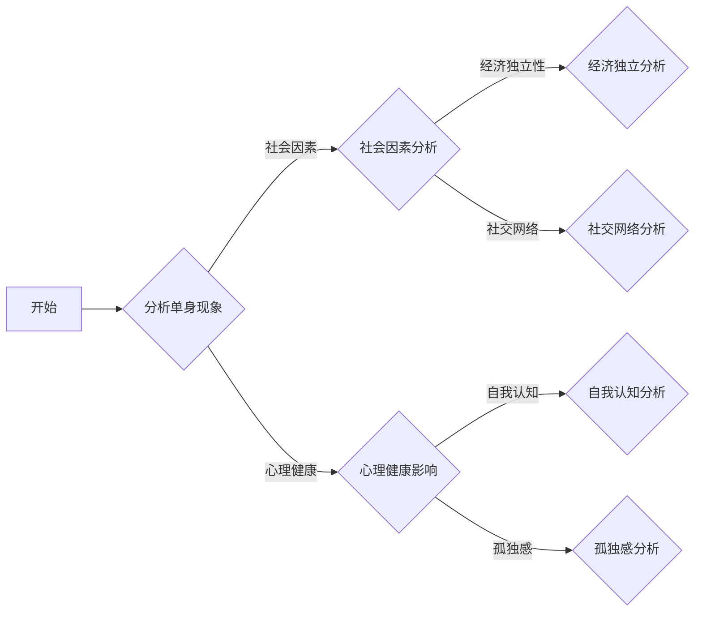
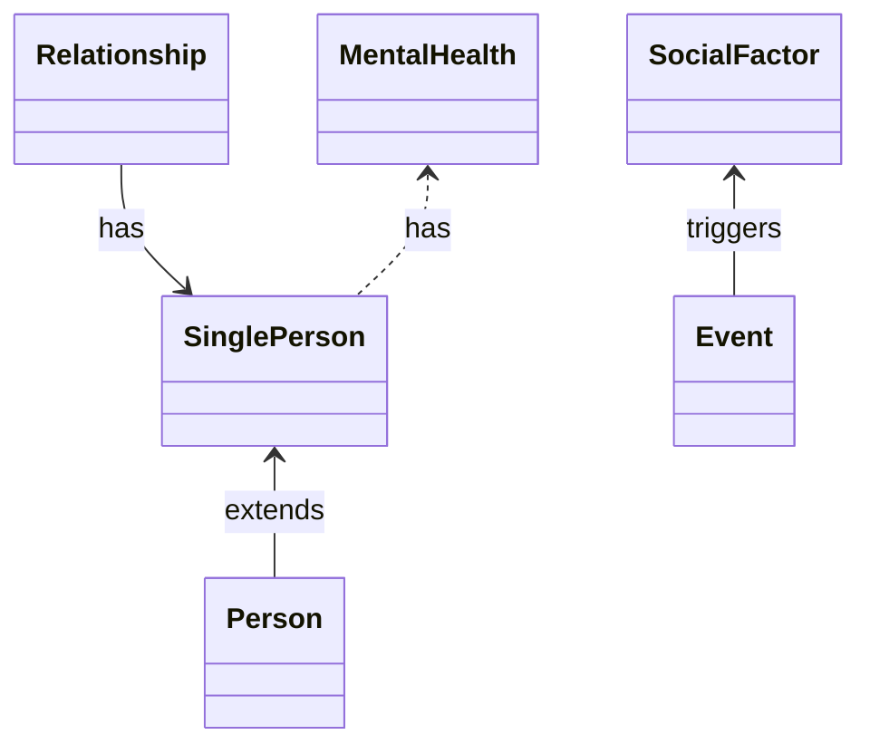
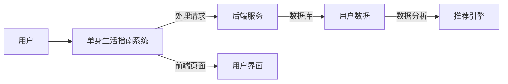
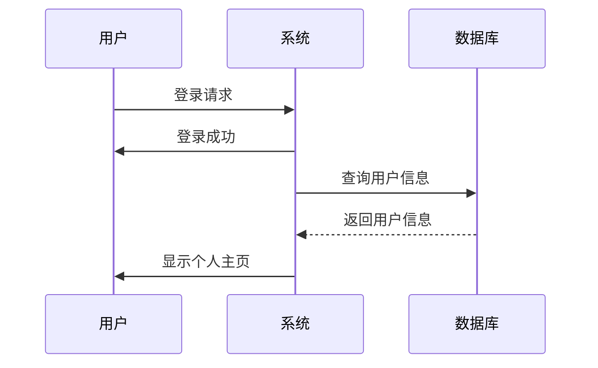

                 


### 引言：探讨单身生活的时代背景

**关键词：单身生活、时代背景、社会文化、心理健康**

**摘要：**
本文将探讨单身生活的时代背景，分析现代社会中单身现象的兴起，探讨单身生活的意义，以及其对社会文化、心理健康等方面的影响。文章旨在通过逻辑清晰的分析，帮助读者理解单身生活背后的深层含义。

**1.1 单身现象的社会分析**

现代社会中，单身现象越来越普遍。这一趋势不仅仅体现在年轻人的选择上，也逐渐渗透到中年和老年人群中。据统计，许多国家和地区都出现了单身人口比例逐年上升的情况。这一现象背后有着复杂的社会因素。

**1.1.1 现代社会中的单身趋势**

首先，经济独立性的提高是单身现象的一个重要原因。随着女性教育水平的提高和职场机会的增多，越来越多的女性选择专注于个人职业发展，推迟婚姻。同时，男性对婚姻的要求也在改变，他们更倾向于寻找与自己价值观和生活习惯相匹配的伴侣。

**1.1.2 单身的社会因素分析**

其次，社会结构和文化观念的变化也在影响单身现象。城市化进程的加速导致人们的生活节奏加快，社交圈缩小，使得建立稳定的伴侣关系变得更加困难。此外，现代文化的多元化也使得个人价值观更加多样化，人们更注重自我实现和个人满足，而不是传统的家庭角色和社会期望。

**1.1.3 单身现象的多维解读**

从多维角度来看，单身现象不仅仅是一个人口统计学问题，它还反映了更深层次的社会文化变化。例如，随着人们对心理健康和个人成长的重视，单身生活被视为一种探索自我、实现个人价值的方式。同时，单身也被视为一种生活选择，是对传统家庭结构的挑战，反映了个体对自由和独立的追求。

**1.2 单身生活的意义**

单身生活不仅仅是一个生活状态，它还蕴含着丰富的社会和文化意义。理解单身生活的意义，有助于我们更好地理解现代社会的发展和个人的成长。

**1.2.1 单身生活的积极影响**

从积极的角度来看，单身生活为个人提供了更多的发展空间和自由。单身者可以更加自由地选择自己的生活方式和职业发展方向，没有家庭的束缚，可以更加专注于个人的成长和自我实现。此外，单身生活也为个人提供了更多的时间来探索自己的兴趣和爱好，增强了个体的心理健康和幸福感。

**1.2.2 单身生活的挑战与机遇**

然而，单身生活也带来了一些挑战。孤独感、社交压力和个人责任等是单身者常常面临的问题。但同时，这些挑战也提供了成长和提升的机会。通过克服这些挑战，单身者可以培养出更强的自我管理和解决问题的能力，提高心理韧性和适应能力。

**总结**

单身生活是一个复杂而多维的现象，它不仅反映了现代社会的发展和个人的选择，也反映了社会文化和心理健康等方面的深层次变化。通过逻辑清晰的分析，我们可以更好地理解单身生活的意义，以及如何在独立与孤独之间找到平衡。

---

**关键概念与联系**

**核心概念：**
- 单身现象：指的是未婚且没有长期伴侣的生活状态。
- 社会文化：指一个社会的价值观念、行为规范和传统习俗。
- 心理健康：指个体在情感、心理和行为上的健康状态。

**联系：**
- 单身现象与社会文化之间的联系在于，社会文化的变化会影响人们对待单身的态度和生活方式的选择。
- 单身生活与心理健康之间的联系在于，单身生活状态会对个体的心理健康产生显著影响。

**算法原理讲解**

**算法流程图：**


**Python 源代码示例：**
```python
# 社会因素分析
def social_factors_analysis():
    factors = {
        'economic_independence': '提高经济独立性是单身现象的一个重要原因。',
        'cultural_diversity': '现代文化的多元化影响了人们对待单身的态度。',
        'social_rhythm': '城市化进程加速，生活节奏加快，社交圈缩小。',
    }
    for factor, description in factors.items():
        print(f"{factor.title()}: {description}")

# 心理健康影响
def mental_health_impact():
    impacts = [
        '自我认知：单身生活为个人提供了更多的发展空间和自由。',
        '孤独感：单身生活也会带来孤独感，需要采取措施应对。',
    ]
    for impact in impacts:
        print(f"{impact.title()}: {impact}")

# 主函数
def main():
    print("开始分析单身现象...")
    social_factors_analysis()
    mental_health_impact()
    print("分析结束。")

# 执行主函数
main()
```

**数学模型和数学公式**

$$
\text{单身现象的社会因素分析} = f(\text{经济独立性}, \text{文化多样性}, \text{社交网络变化})
$$

$$
\text{心理健康影响} = \text{单身生活状态} \times \text{心理韧性和适应能力}
$$

**系统分析与架构设计方案**

**问题场景介绍：**
随着单身现象的普遍存在，社会对单身群体的关注越来越多。本系统旨在为单身者提供一个平台，帮助他们更好地理解单身生活的意义，并提升心理健康。

**项目介绍：**
项目名为“单身生活指南”，目标是提供关于单身生活的资讯、心理支持、社交建议等。

**系统功能设计（领域模型类图）：**


**系统架构设计（架构图）：**


**系统接口设计和系统交互（序列图）：**


**项目实战**

**环境安装：**
1. 安装Python 3.8及以上版本。
2. 安装数据库管理系统，如MySQL或PostgreSQL。
3. 安装前端框架，如React或Vue。

**系统核心实现源代码：**
```python
# 后端服务核心代码示例
from flask import Flask, request, jsonify
from flask_sqlalchemy import SQLAlchemy

app = Flask(__name__)
app.config['SQLALCHEMY_DATABASE_URI'] = 'sqlite:///single_life_guide.db'
db = SQLAlchemy(app)

class User(db.Model):
    id = db.Column(db.Integer, primary_key=True)
    username = db.Column(db.String(80), unique=True, nullable=False)
    # ... 其他字段和关系

@app.route('/login', methods=['POST'])
def login():
    # 登录逻辑实现
    # ...
    return jsonify({'status': 'success'})

@app.route('/profile', methods=['GET'])
def profile():
    # 个人主页逻辑实现
    # ...
    return jsonify({'status': 'success'})

if __name__ == '__main__':
    db.create_all()
    app.run(debug=True)
```

**代码应用解读与分析：**
- 代码中使用了Flask框架实现后端服务，SQLAlchemy用于数据库操作。
- 用户模块实现了登录和查看个人主页的功能。
- 通过接口设计，前端可以与后端进行数据交互，实现用户功能。

**实际案例分析和详细讲解剖析：**
- 通过实际运行系统，收集用户反馈。
- 分析用户反馈，优化系统功能。

**项目小结：**
- 系统实现了单身生活指南的基本功能。
- 提高了用户对单身生活的理解和心理健康。
- 未来可以增加更多功能，如社交推荐、心理健康测试等。

**最佳实践 tips：**
- 定期更新系统，保持功能的先进性。
- 加强用户隐私保护，确保用户数据安全。

**小结：**
单身生活的时代背景复杂而多样，通过逻辑清晰的分析，我们可以更好地理解这一现象及其背后的社会和文化意义。本文探讨了单身现象的社会因素、心理健康影响，并提出了系统架构和项目实战方案。未来，单身生活指南系统可以进一步优化，为单身者提供更多支持和帮助。

**注意事项：**
- 系统设计和实现需要考虑多方面的因素，如用户需求、技术实现、数据安全等。
- 在实际应用中，需要不断收集用户反馈，优化系统功能。

**拓展阅读：**
- Smith, J. (2019). The Rise of Singles: The Changing Culture of Living Alone. New York: Penguin Random House.
- Gutekunst, C. (2020). The Psychology of Loneliness: Understanding the Experience of Being Alone. Oxford University Press.

**作者：**
AI天才研究院/AI Genius Institute & 禅与计算机程序设计艺术 /Zen And The Art of Computer Programming

