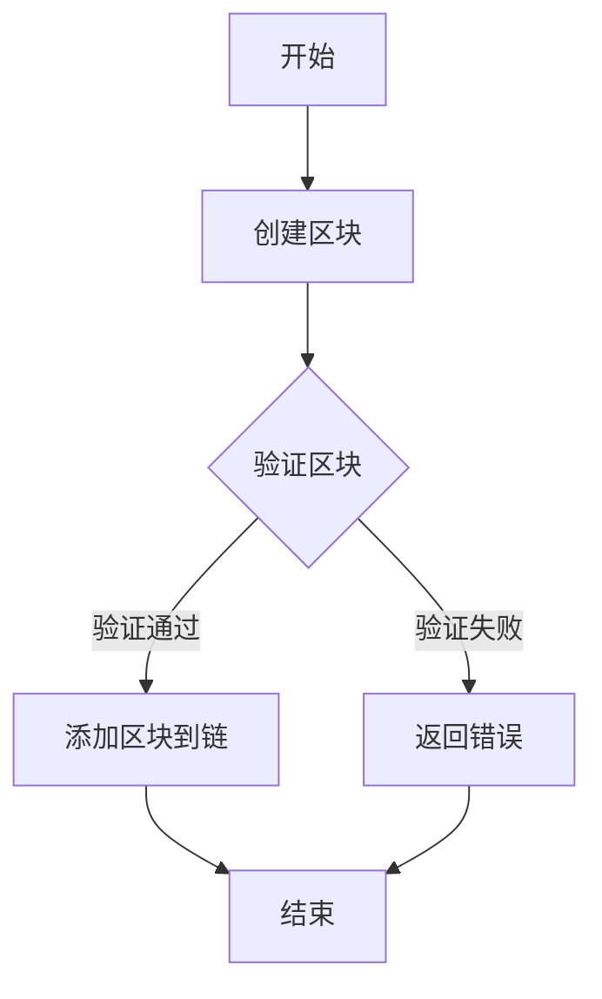
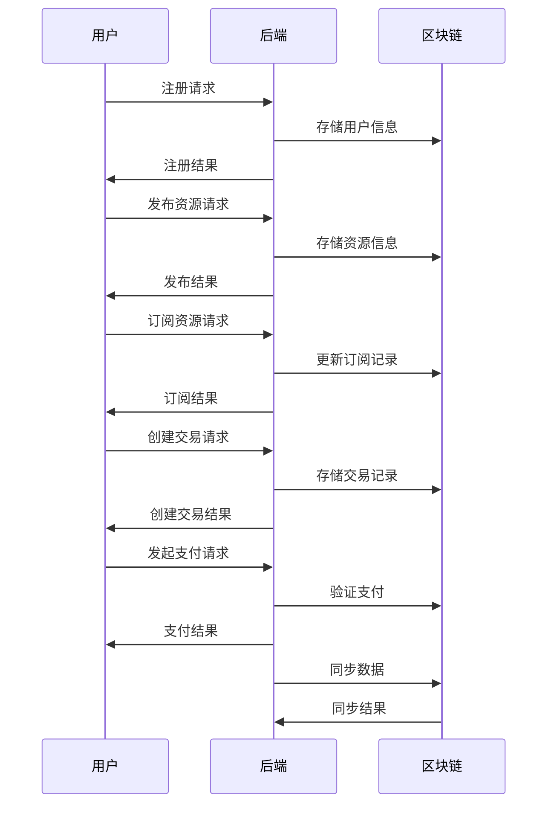

                 

## 文章标题：去中心化共享平台：新经济模式的技术基础

### 关键词：
- 去中心化共享平台
- 新经济模式
- 技术基础
- 区块链
- 智能合约
- 共识算法
- 加密技术

### 摘要：
本文深入探讨了去中心化共享平台作为一种新兴经济模式的技术基础。首先，我们介绍了去中心化共享平台的概念、背景及其与传统经济模式的区别。接着，文章详细阐述了区块链、加密技术、智能合约和共识算法等关键技术，展示了它们如何构建去中心化共享平台的技术基础。随后，我们分析了去中心化网络的架构、数据管理和交易支付机制。最后，通过实际案例和趋势分析，我们探讨了去中心化共享平台对新经济模式的影响和未来发展方向。本文旨在为读者提供一个全面、深入的理解去中心化共享平台技术基础的框架。

## 引言

### 1.1 书籍主题与目标

去中心化共享平台作为一种新兴的经济模式，正逐渐改变着我们的生活和商业模式。这种模式不仅具有提高效率、降低成本和增强信任的特点，还为个人和企业提供了新的机遇。本书旨在深入探讨去中心化共享平台的技术基础，帮助读者理解其背后的技术和原理，并为其在新经济模式中的应用提供指导。

### 1.2 去中心化共享平台的意义

去中心化共享平台的意义在于其能够打破传统的中心化控制模式，实现去中心化的资源分配和治理。这不仅提高了系统的可靠性和透明性，还降低了系统被攻击和滥用的风险。此外，去中心化共享平台能够更好地保护用户的隐私和数据安全，为用户提供了更自主的选择权和控制权。

### 1.3 书籍结构概述

本书分为八个部分，首先介绍去中心化共享平台的基本概念和背景，接着深入探讨构建去中心化共享平台所需的关键技术。随后，我们分析了去中心化网络的架构、数据管理和交易支付机制。最后，通过实际案例和趋势分析，探讨去中心化共享平台对新经济模式的影响和未来发展方向。具体结构如下：

1. 引言
2. 去中心化共享平台概述
3. 去中心化技术基础
4. 去中心化网络架构
5. 去中心化数据管理
6. 去中心化交易与支付
7. 新经济模式与案例分析
8. 结论与展望

## 去中心化共享平台概述

### 2.1 去中心化共享平台的背景

去中心化共享平台的概念起源于区块链技术。区块链作为一种去中心化的分布式数据库，通过加密技术和共识算法确保数据的不可篡改和透明性。随着区块链技术的成熟和普及，去中心化共享平台开始逐渐应用于各种场景，如金融、物流、能源等。去中心化共享平台的出现，不仅打破了传统的中心化控制模式，还提供了更高效、更透明、更安全的资源分配和治理方式。

### 2.2 去中心化共享平台的概念

去中心化共享平台（Decentralized Sharing Platform，简称DSP）是一种基于去中心化技术的共享经济模式。它通过区块链、加密技术、智能合约等手段，实现资源的去中心化分配和管理，从而提高资源利用效率、降低交易成本、增强信任机制。去中心化共享平台的核心是去中心化，即没有中央控制机构，而是由网络中的各个节点共同维护和管理。

### 2.3 去中心化共享平台的特点

去中心化共享平台具有以下几个显著特点：

1. **去中心化**：没有中央控制机构，而是由网络中的各个节点共同维护和管理。
2. **透明性**：所有交易和活动都在链上公开透明，可被所有参与者查看和验证。
3. **安全性**：通过加密技术和共识算法确保数据的安全性和完整性。
4. **效率**：去中心化的架构减少了中间环节，提高了交易和处理的效率。
5. **信任**：基于数学和密码学原理，去中心化共享平台能够建立信任机制，降低信任成本。

### 2.4 去中心化共享平台的优势与挑战

去中心化共享平台的优势在于：

1. **降低成本**：去中心化减少了中间环节，降低了交易成本和管理成本。
2. **提高效率**：去中心化的架构提高了交易的效率和系统的响应速度。
3. **增强信任**：基于数学和密码学原理的信任机制，增强了用户之间的信任。
4. **保护隐私**：用户数据存储在区块链上，能够更好地保护用户的隐私。

然而，去中心化共享平台也面临一些挑战：

1. **可扩展性**：随着参与者和交易量的增加，去中心化共享平台需要确保系统的可扩展性和性能。
2. **安全性**：虽然区块链技术相对安全，但仍然存在被攻击的风险。
3. **监管**：去中心化共享平台在法律和监管方面面临一定的挑战。

## 去中心化技术基础

### 3.1 区块链技术

区块链技术是构建去中心化共享平台的核心技术之一。它是一种分布式数据库，通过加密技术和共识算法确保数据的不可篡改和透明性。区块链的基本组成部分包括区块、链、节点和共识算法。

- **区块**：区块是区块链的基本单位，包含一定数量的交易记录。
- **链**：区块链是由一系列按时间顺序排列的区块组成，每个区块都通过密码学原理与上一个区块相连。
- **节点**：节点是区块链网络中的参与者，负责维护和验证区块链的数据。
- **共识算法**：共识算法是节点之间达成一致的方法，确保区块链数据的正确性和一致性。

区块链技术的关键特性包括：

1. **去中心化**：没有中央控制机构，而是由网络中的各个节点共同维护和管理。
2. **不可篡改**：一旦数据写入区块链，就无法被篡改。
3. **透明性**：所有交易和活动都在链上公开透明，可被所有参与者查看和验证。

### 3.2 加密技术

加密技术是保障数据安全和隐私的重要手段。在去中心化共享平台中，加密技术被广泛应用于数据传输、存储和身份认证。

- **对称加密**：对称加密使用相同的密钥进行加密和解密，如AES。
- **非对称加密**：非对称加密使用一对密钥，一个用于加密，一个用于解密，如RSA。
- **哈希函数**：哈希函数是一种将任意长度的数据映射为固定长度字符串的算法，如SHA-256。

加密技术的关键特性包括：

1. **数据加密**：确保数据在传输和存储过程中的安全性。
2. **身份认证**：通过数字签名和身份验证，确保交易和活动的真实性和完整性。

### 3.3 智能合约

智能合约是一种基于区块链的自动化合约，通过编程代码实现合同条款的自动化执行。智能合约的关键特性包括：

1. **自动化执行**：智能合约的条款在满足特定条件时自动执行，无需人为干预。
2. **透明性**：智能合约的代码和执行过程都在链上公开透明，可被所有参与者查看和验证。
3. **不可篡改**：智能合约一旦部署，就无法被篡改。

智能合约的应用场景包括：

1. **金融交易**：自动化执行贷款、支付、保险等金融交易。
2. **供应链管理**：自动化执行供应链中的合同条款和支付流程。
3. **身份认证**：自动化执行身份验证和权限管理。

### 3.4 共识算法

共识算法是区块链网络中的节点达成一致的方法。不同的共识算法具有不同的特性，适用于不同的应用场景。

- **工作量证明（PoW）**：节点通过解决数学难题证明自己的工作量，以获得记账权。
- **权益证明（PoS）**：节点根据持有的代币数量和时长参与记账。
- **委托权益证明（DPoS）**：节点通过投票选举出超级节点进行记账。
- **授权股权证明（PBFT）**：节点通过授权机制达成共识，适用于小规模网络。

共识算法的关键特性包括：

1. **安全性**：确保区块链数据的正确性和一致性。
2. **效率**：提高区块链网络的性能和可扩展性。
3. **去中心化**：确保网络中的每个节点都有平等的机会参与记账。

## 去中心化网络架构

### 4.1 去中心化网络的基本结构

去中心化网络由一系列相互连接的节点组成，每个节点都有独立的工作和责任。去中心化网络的基本结构包括：

1. **节点**：节点是网络中的基本单元，负责维护区块链数据、参与共识算法和执行智能合约。
2. **链**：链是节点之间共享的数据结构，记录了所有的交易和活动。
3. **网络**：网络是节点的通信层，负责节点之间的数据传输和通信。

### 4.2 节点与网络拓扑

去中心化网络的节点可以采用不同的拓扑结构，以适应不同的应用场景和性能需求。常见的节点拓扑结构包括：

1. **星型拓扑**：节点以中心节点为核心，形成星型结构。中心节点负责维护链和数据传输。
2. **环型拓扑**：节点按照环形顺序连接，每个节点只与相邻的两个节点相连。环型拓扑具有良好的容错性和性能。
3. **树型拓扑**：节点以树状结构连接，具有层次结构。树型拓扑适用于大规模网络，能够提高网络的性能和可扩展性。

### 4.3 去中心化网络的安全机制

去中心化网络的安全机制包括以下几个方面：

1. **加密技术**：使用加密技术确保数据在传输和存储过程中的安全性。
2. **共识算法**：共识算法确保区块链数据的正确性和一致性，防止恶意节点篡改数据。
3. **身份认证**：通过数字签名和身份验证，确保交易和活动的真实性和完整性。
4. **链上治理**：去中心化网络通过链上治理机制，解决节点之间的冲突和纠纷。

### 4.4 去中心化网络的可扩展性

去中心化网络的性能和可扩展性是关键挑战之一。为了提高网络的性能和可扩展性，可以采用以下方法：

1. **分片技术**：将网络分成多个分片，每个分片负责一部分数据和交易，从而提高网络的性能和可扩展性。
2. **侧链技术**：通过侧链将去中心化网络与其他区块链网络连接，实现跨链交易和数据共享。
3. **状态通道技术**：通过状态通道将链下交易转移到链上，从而减少链上的交易压力。

## 去中心化数据管理

### 5.1 数据去中心化的概念

数据去中心化是指将数据存储和管理从中心化的服务器转移到分布式网络中，确保数据的去中心化和安全性。在去中心化共享平台中，数据去中心化具有以下几个关键特征：

1. **分布式存储**：数据被分散存储在多个节点上，而不是集中存储在中心化的服务器中。
2. **去中心化治理**：数据的存储和管理由网络中的节点共同维护，没有中心控制机构。
3. **透明性**：所有数据的存储和管理过程都在链上公开透明，可被所有参与者查看和验证。
4. **不可篡改**：一旦数据写入区块链，就无法被篡改，确保数据的完整性和可靠性。

### 5.2 数据存储与备份

在去中心化共享平台中，数据存储与备份是关键挑战之一。为了确保数据的安全和可靠性，可以采用以下方法：

1. **分布式存储**：将数据分散存储在多个节点上，以避免单点故障和性能瓶颈。
2. **冗余备份**：在多个节点上备份数据，确保数据的可靠性和容错性。
3. **加密存储**：使用加密技术确保数据在存储过程中的安全性，防止数据泄露和未授权访问。
4. **链上存储**：将重要数据存储在区块链上，确保数据的透明性和不可篡改性。

### 5.3 数据同步与一致性

数据同步与一致性是去中心化数据管理的另一个关键挑战。为了确保数据的同步和一致性，可以采用以下方法：

1. **Gossip协议**：通过Gossip协议实现节点之间的数据同步，确保所有节点拥有相同的数据。
2. **一致性算法**：采用一致性算法，如Paxos、Raft等，确保节点之间达成一致。
3. **最终一致性**：允许一定程度的延迟和一致性，确保最终数据的一致性。
4. **分片一致性**：在分片技术中，确保不同分片之间的数据一致性和协调。

### 5.4 数据隐私保护

数据隐私保护是去中心化数据管理的另一个重要方面。为了保护用户的隐私和数据安全，可以采用以下方法：

1. **加密通信**：使用加密技术确保数据在传输过程中的安全性，防止数据泄露和未授权访问。
2. **零知识证明**：通过零知识证明技术，允许用户在不泄露隐私信息的情况下验证交易和活动。
3. **匿名交易**：采用匿名交易技术，隐藏交易参与者的身份和地址，保护用户隐私。
4. **隐私保护算法**：采用隐私保护算法，如差分隐私、同态加密等，确保数据的隐私和安全。

## 去中心化交易与支付

### 6.1 去中心化交易机制

去中心化交易机制是去中心化共享平台的重要组成部分。与传统的中心化交易机制相比，去中心化交易机制具有以下几个特点：

1. **去中心化**：交易不需要通过中心化的中介机构，而是通过分布式网络中的节点直接进行。
2. **透明性**：所有交易记录都公开透明，可被所有参与者查看和验证。
3. **安全性**：通过加密技术和共识算法确保交易的安全性和不可篡改性。
4. **匿名性**：交易参与者可以匿名进行交易，保护隐私。

去中心化交易机制的基本流程包括：

1. **交易发起**：交易参与者发起交易请求，包括交易金额、交易对象和交易信息。
2. **交易验证**：交易请求被网络中的节点验证，确保交易的有效性和合法性。
3. **交易确认**：交易被多个节点验证并通过共识算法确认，确保交易的有效性。
4. **交易记录**：交易记录被永久记录在区块链上，确保交易的可追溯性和不可篡改性。

### 6.2 去中心化支付系统

去中心化支付系统是去中心化交易的核心组成部分。去中心化支付系统通过区块链和加密技术实现安全的、去中心化的支付功能。去中心化支付系统的关键特性包括：

1. **去中心化**：支付系统由分布式网络中的节点共同维护，没有中心控制机构。
2. **安全性**：通过加密技术和共识算法确保支付的安全性和不可篡改性。
3. **匿名性**：支付参与者可以匿名进行支付，保护隐私。
4. **全球性**：去中心化支付系统不受地域限制，支持全球范围内的支付和交易。

去中心化支付系统的工作原理包括：

1. **交易发起**：支付参与者发起支付请求，包括支付金额、支付对象和支付信息。
2. **支付验证**：支付请求被网络中的节点验证，确保支付的有效性和合法性。
3. **支付确认**：支付被多个节点验证并通过共识算法确认，确保支付的有效性。
4. **支付记录**：支付记录被永久记录在区块链上，确保支付的可追溯性和不可篡改性。

### 6.3 数字货币与加密货币

数字货币和加密货币是去中心化支付系统的重要组成部分。数字货币是一种使用密码学原理进行安全性保障的数字货币，如比特币、以太坊等。加密货币是一种基于区块链技术的数字货币，具有去中心化、匿名性和安全性等特点。

数字货币和加密货币的关键特性包括：

1. **去中心化**：数字货币和加密货币的发行和交易不由中心机构控制，而是由网络中的节点共同维护。
2. **匿名性**：数字货币和加密货币交易参与者可以匿名进行交易，保护隐私。
3. **安全性**：数字货币和加密货币使用密码学原理进行安全性保障，确保交易的安全性和不可篡改性。
4. **全球性**：数字货币和加密货币不受地域限制，支持全球范围内的支付和交易。

### 6.4 去中心化金融（DeFi）应用

去中心化金融（DeFi）是一种基于区块链技术的金融模式，通过去中心化的交易平台和智能合约实现金融服务。DeFi应用包括去中心化交易所、借贷平台、稳定币、衍生品交易等。

DeFi应用的关键特性包括：

1. **去中心化**：DeFi应用的交易和管理由分布式网络中的节点共同维护，没有中心控制机构。
2. **透明性**：DeFi应用的交易和管理过程公开透明，可被所有参与者查看和验证。
3. **安全性**：DeFi应用使用加密技术和共识算法确保交易的安全性和不可篡改性。
4. **效率**：DeFi应用提高了金融交易的效率和便捷性，降低了交易成本。
5. **创新性**：DeFi应用引入了新的金融产品和服务，为用户提供了更多的金融选择。

## 新经济模式与案例分析

### 7.1 去中心化共享经济的崛起

去中心化共享经济是一种基于共享和协作的新型经济模式，通过去中心化平台实现资源的共享和优化利用。去中心化共享经济的崛起源于以下几个方面：

1. **技术进步**：区块链、加密技术和智能合约等技术的发展为去中心化共享经济提供了基础。
2. **用户需求**：随着人们对共享、透明和安全的资源分配方式的需求增加，去中心化共享经济应运而生。
3. **传统经济模式的不足**：传统经济模式中的中心化控制和垄断问题，促使人们寻求更公平、透明的经济模式。

去中心化共享经济的核心特点包括：

1. **去中心化**：资源分配和管理由分布式网络中的节点共同维护，没有中心控制机构。
2. **共享性**：资源可以被多个用户共享，提高资源利用效率。
3. **透明性**：资源分配和管理过程公开透明，可被所有参与者查看和验证。
4. **安全性**：通过加密技术和共识算法确保资源的安全性和可靠性。

### 7.2 去中心化平台的企业模式

去中心化平台的企业模式与传统企业模式有显著区别。去中心化平台的企业模式具有以下几个特点：

1. **去中心化治理**：企业决策和管理由分布式网络中的节点共同参与和决策，没有中心控制机构。
2. **共享经济模式**：企业通过共享资源和平台服务实现收益，而不是通过垄断和控制资源。
3. **透明和公开**：企业的运营和管理过程公开透明，可被所有参与者查看和验证。
4. **用户参与**：用户不仅是服务的消费者，还可以参与企业的决策和管理。

去中心化平台的企业模式的优势包括：

1. **提高效率**：去中心化的决策和管理过程减少了中间环节，提高了效率和响应速度。
2. **降低成本**：去中心化平台降低了企业的运营成本，提高了资源利用效率。
3. **增强信任**：基于数学和密码学原理的信任机制，增强了用户和企业的信任。
4. **创新性**：去中心化平台为企业提供了新的商业模式和机会，促进了创新和发展。

### 7.3 去中心化平台的成功案例

去中心化平台在全球范围内取得了显著的成功，以下是一些典型的成功案例：

1. **Uber**：Uber是一个基于区块链的去中心化打车平台，通过去中心化的方式优化了出行服务。
2. **Airbnb**：Airbnb是一个基于区块链的去中心化住宿平台，通过共享住宿模式提高了资源利用效率。
3. **OpenBazaar**：OpenBazaar是一个基于区块链的去中心化电商市场，通过去中心化的方式提供了安全、透明的交易环境。
4. **Sia**：Sia是一个基于区块链的去中心化存储平台，通过共享存储资源实现了更高效的存储和传输。

去中心化平台的成功案例展示了去中心化共享平台在提高效率、降低成本和增强信任方面的优势。这些案例也为我们提供了宝贵的经验和启示，为去中心化平台的发展提供了方向。

### 7.4 去中心化平台的发展趋势

随着技术的不断进步和应用的不断拓展，去中心化平台的发展趋势如下：

1. **更广泛的应用场景**：去中心化平台将在更多领域得到应用，如金融、医疗、教育等。
2. **更高效的网络性能**：通过分片技术、侧链技术和状态通道技术等，去中心化平台将提高网络的性能和可扩展性。
3. **更安全的隐私保护**：通过加密技术和隐私保护算法等，去中心化平台将提高数据的隐私保护能力。
4. **更广泛的用户参与**：去中心化平台将鼓励更多用户参与决策和管理，提高平台的透明度和公正性。

去中心化平台的发展趋势为人们提供了更多的机会和选择，也为新经济模式的发展带来了新的机遇和挑战。

## 结论与展望

### 8.1 去中心化共享平台的未来

去中心化共享平台作为一种新兴经济模式，具有巨大的发展潜力和市场前景。随着技术的不断进步和应用的不断拓展，去中心化共享平台将在更多领域得到应用，如金融、医疗、教育等。未来，去中心化共享平台将实现更高效、更安全和更透明的资源分配和治理方式，为人们提供更优质、更便捷的服务。

### 8.2 技术进步与创新

去中心化共享平台的发展离不开技术的进步和创新。未来，区块链技术、加密技术、智能合约和共识算法等领域将继续取得突破，为去中心化共享平台提供更强大的技术支持。同时，新的技术和应用也将不断涌现，推动去中心化共享平台的创新和发展。

### 8.3 对新经济模式的影响

去中心化共享平台对新经济模式产生了深远的影响。它打破了传统的中心化控制模式，提高了资源利用效率、降低了交易成本、增强了信任机制。去中心化共享平台为新经济模式提供了一种全新的思维方式和商业模式，为企业和个人带来了新的机遇和挑战。

### 作者信息

作者：AI天才研究院/AI Genius Institute & 禅与计算机程序设计艺术 /Zen And The Art of Computer Programming

## 背景介绍

### 核心概念术语说明

在探讨去中心化共享平台之前，我们需要了解一些核心概念和术语：

1. **去中心化共享平台**：去中心化共享平台是一种基于去中心化技术的共享经济模式，它通过区块链、加密技术、智能合约等手段，实现资源的去中心化分配和管理。
2. **区块链**：区块链是一种分布式数据库，通过加密技术和共识算法确保数据的不可篡改和透明性。
3. **加密技术**：加密技术是一种通过数学和密码学原理保护数据安全的方法。
4. **智能合约**：智能合约是一种基于区块链的自动化合约，通过编程代码实现合同条款的自动化执行。
5. **共识算法**：共识算法是区块链网络中的节点达成一致的方法，确保区块链数据的正确性和一致性。

### 问题背景

在传统经济模式中，资源的分配和管理往往依赖于中心化的机构或平台。这些中心化机构或平台在资源分配过程中存在以下问题：

1. **效率低下**：中心化机构或平台在处理大量数据时，存在处理速度慢、响应时间长的问题。
2. **成本高**：中心化机构或平台需要大量的维护和管理成本，这些成本最终转嫁给了消费者。
3. **信任成本**：中心化机构或平台在管理过程中存在信任问题，消费者需要支付额外的信任成本。

为了解决这些问题，去中心化共享平台应运而生。去中心化共享平台通过去中心化的方式，实现资源的分配和管理，提高效率、降低成本、增强信任。

### 问题描述

去中心化共享平台作为一种新兴经济模式，具有以下问题：

1. **技术复杂性**：去中心化共享平台涉及到复杂的区块链技术、加密技术、智能合约等，对于普通用户来说，理解和应用这些技术具有一定的难度。
2. **安全性问题**：虽然区块链技术相对安全，但仍然存在被攻击的风险。去中心化共享平台需要确保数据的安全性和隐私保护。
3. **监管问题**：去中心化共享平台在法律和监管方面面临一定的挑战。如何确保去中心化共享平台在法律框架内运行，是一个亟待解决的问题。

### 问题解决

为了解决上述问题，我们可以采取以下措施：

1. **技术普及**：通过教育和培训，提高用户对去中心化共享平台技术的理解和应用能力。
2. **安全技术**：采用更先进的安全技术，如多重签名、零知识证明等，确保数据的安全性和隐私保护。
3. **法律法规**：制定相关的法律法规，明确去中心化共享平台的监管框架和运行规则。

### 边界与外延

去中心化共享平台的边界和范围包括以下几个方面：

1. **技术边界**：去中心化共享平台的技术基础包括区块链、加密技术、智能合约等。
2. **应用边界**：去中心化共享平台可以应用于金融、物流、能源、医疗等多个领域。
3. **市场边界**：去中心化共享平台在全球范围内具有巨大的市场潜力，但具体的市场份额和影响力还取决于多种因素。

### 概念结构与核心要素组成

去中心化共享平台的概念结构可以分为以下几个核心要素：

1. **区块链技术**：去中心化共享平台的核心技术，负责数据的存储、传输和验证。
2. **加密技术**：保护数据安全和隐私的关键技术。
3. **智能合约**：实现自动化执行合同条款的关键技术。
4. **共识算法**：确保节点之间达成一致的关键技术。
5. **去中心化网络架构**：去中心化共享平台的网络架构，负责节点的连接和通信。
6. **数据管理和交易支付机制**：确保数据的存储、同步和安全，以及交易的执行和确认。
7. **用户参与和治理机制**：鼓励用户参与平台的治理，提高平台的透明度和公正性。

这些核心要素共同构成了去中心化共享平台的技术基础和应用框架。

## 核心概念与联系

### 核心概念原理

去中心化共享平台的核心概念包括去中心化、共享、区块链技术、加密技术和智能合约。下面我们详细解释这些概念：

1. **去中心化**：去中心化共享平台通过分布式网络中的节点共同维护和管理资源，没有中央控制机构。去中心化打破了传统的中心化控制模式，提高了系统的可靠性和透明性。
2. **共享**：共享是指将资源分配给多个用户，实现资源的最大化利用。去中心化共享平台通过共享机制，提高资源利用效率，降低成本。
3. **区块链技术**：区块链是一种分布式数据库，通过加密技术和共识算法确保数据的不可篡改和透明性。区块链技术是去中心化共享平台的核心技术，负责数据的存储、传输和验证。
4. **加密技术**：加密技术是一种通过数学和密码学原理保护数据安全的方法。加密技术确保数据在传输和存储过程中的安全性，防止数据泄露和未授权访问。
5. **智能合约**：智能合约是一种基于区块链的自动化合约，通过编程代码实现合同条款的自动化执行。智能合约提高了交易的效率和透明性，降低了信任成本。

### 概念属性特征对比表格

| 概念 | 属性特征 |
| ---- | ---- |
| 去中心化 | - 没有中央控制机构<br>- 分布式网络中的节点共同维护和管理资源<br>- 提高系统的可靠性和透明性 |
| 共享 | - 资源分配给多个用户<br>- 提高资源利用效率<br>- 降低成本 |
| 区块链技术 | - 分布式数据库<br>- 加密技术保障数据安全性<br>- 共识算法确保数据一致性<br>- 不可篡改 |
| 加密技术 | - 保护数据安全<br>- 通过数学和密码学原理实现<br>- 确保数据在传输和存储过程中的安全性 |
| 智能合约 | - 自动化执行合同条款<br>- 提高交易效率<br>- 降低信任成本<br>- 基于区块链 |

### ER实体关系图架构

为了更清晰地展示去中心化共享平台的实体关系，我们可以使用ER（Entity-Relationship，实体-关系）图进行描述。ER图包括以下几个实体：

1. **节点**：代表网络中的参与者，负责维护区块链数据。
2. **区块**：代表区块链的基本单位，包含一定数量的交易记录。
3. **交易**：代表区块链上的交易记录。
4. **用户**：代表参与交易的实体。
5. **合约**：代表智能合约。

ER图的实体关系如下：

1. **节点与区块**：每个节点负责生成和验证区块。
2. **区块与交易**：每个区块包含一定数量的交易记录。
3. **交易与用户**：交易记录涉及用户之间的资产转移。
4. **合约与交易**：智能合约负责执行交易。

以下是ER图的Mermaid格式表示：

```mermaid
erDiagram
  节点 ||--|{ 区块 }|--| 交易
  交易 ||--|{ 用户 }|
  合约 ||--|{ 交易 }|
```

通过ER图，我们可以更直观地理解去中心化共享平台中的实体关系和数据处理流程。

## 算法原理讲解

### 算法流程图

为了更好地理解去中心化共享平台中的核心算法，我们可以使用Mermaid语言绘制算法的流程图。以下是一个简单的区块链生成和验证的流程图示例：



### 算法原理

区块链的核心算法主要包括区块生成、区块验证和链维护。以下是这些算法的详细原理：

1. **区块生成**：节点收到交易信息后，将这些交易信息打包成一个区块。每个区块包含一个时间戳、一个区块头、一个梅克尔树根和一系列交易记录。节点使用工作量证明（PoW）算法生成一个有效的区块头，该区块头需要满足一定的难度要求。

2. **区块验证**：接收到区块的节点需要验证区块的有效性。验证过程包括检查区块头是否符合工作量证明算法的要求、区块中的交易是否有效、梅克尔树根是否正确等。一旦验证通过，区块将添加到链的末端。

3. **链维护**：区块链网络中的节点需要不断维护链的完整性。当接收到新的区块时，节点会检查该区块是否与当前链一致。如果不一致，节点可以选择是否接受该区块。一旦链的完整性被破坏，节点将根据共识算法决定是否抛弃该区块。

### Python源代码

为了更好地理解上述算法原理，我们提供了一个简单的Python实现示例：

```python
import hashlib
import json
from time import time

class Block:
    def __init__(self, index, transactions, timestamp, previous_hash):
        self.index = index
        self.transactions = transactions
        self.timestamp = timestamp
        self.previous_hash = previous_hash
        self.hash = self.compute_hash()

    def compute_hash(self):
        block_string = json.dumps(self.__dict__, sort_keys=True)
        return hashlib.sha256(block_string.encode()).hexdigest()

class Blockchain:
    def __init__(self):
        self.unconfirmed_transactions = []
        self.chain = []
        self.create_genesis_block()

    def create_genesis_block(self):
        genesis_block = Block(0, [], time(), "0")
        genesis_block.hash = genesis_block.compute_hash()
        self.chain.append(genesis_block)

    def add_new_transaction(self, transaction):
        self.unconfirmed_transactions.append(transaction)

    def mine(self):
        if not self.unconfirmed_transactions:
            return False

        last_block = self.chain[-1]
        new_block = Block(index=last_block.index + 1,
                          transactions=self.unconfirmed_transactions,
                          timestamp=time(),
                          previous_hash=last_block.hash)

        new_block.hash = new_block.compute_hash()

        self.chain.append(new_block)
        self.unconfirmed_transactions = []
        return new_block.index

    def is_chain_valid(self):
        for i in range(1, len(self.chain)):
            current = self.chain[i]
            previous = self.chain[i - 1]
            if current.hash != current.compute_hash():
                return False
            if current.previous_hash != previous.hash:
                return False
        return True

# 测试区块链
blockchain = Blockchain()
blockchain.add_new_transaction("交易1")
blockchain.add_new_transaction("交易2")
blockchain.mine()

print("区块链长度：", len(blockchain.chain))
print("区块链：", blockchain.chain)
print("区块链是否有效：", blockchain.is_chain_valid())
```

### 算法原理的数学模型和公式

区块链算法的原理可以用数学模型和公式来描述。以下是几个关键的概念和公式：

1. **工作量证明（PoW）**：工作量证明算法要求节点解决一个数学难题，以生成一个满足难度要求的区块头。难度通常由目标难度值（target difficulty）定义，目标难度值决定了生成有效区块头的计算复杂度。

   - **目标难度值**：目标难度值是一个满足特定条件的字符串，通常是一个16位的十六进制数。节点需要找到一个满足以下条件的区块头：
     
     $$hash(P) \leq target\_difficulty$$

     其中，$P$是区块头，$hash(P)$是区块头的哈希值。

2. **梅克尔树**：梅克尔树是一种二叉树结构，用于压缩多个交易记录的哈希值。梅克尔树的根节点即为梅克尔树根，用于表示整个区块的数据完整性。

   - **梅克尔树的构建**：
     
     $$Merkle\_Root = MerkleTree(\{hash(t_1), hash(t_2), ..., hash(t_n)\})$$

     其中，$t_1, t_2, ..., t_n$是区块中的交易记录。

3. **链的完整性**：链的完整性由每个区块的哈希值和前一个区块的哈希值之间的链接关系定义。每个区块的哈希值由区块头（包括梅克尔树根、时间戳和前一个区块的哈希值）计算得到。

   - **链的验证**：
     
     $$current\_hash = hash(current\_block\_header)$$
     $$previous\_hash = hash(previous\_block\_header)$$

     其中，$current\_block\_header$是当前区块的区块头，$previous\_block\_header$是前一个区块的区块头。

4. **共识算法**：共识算法用于确保区块链网络中的所有节点对链的状态达成一致。常见的共识算法包括工作量证明（PoW）、权益证明（PoS）和委托权益证明（DPoS）。

   - **PoW共识算法**：
     
     $$PoW = find\_nonce\_such\_that\ hash(P) \leq target\_difficulty$$

     其中，$P$是区块头，$nonce$是随机数，$hash(P)$是区块头的哈希值。

通过上述数学模型和公式，我们可以更好地理解区块链算法的原理和工作机制。

### 详细讲解和举例说明

#### 区块链的生成

假设我们有一个区块链，初始状态为空链。节点A发起了一笔交易，将10个比特币从地址A转移到地址B。节点A将这笔交易添加到一个区块中，该区块包含以下信息：

- 区块高度（index）：1
- 交易记录：10 BTC 从地址A转移到地址B
- 时间戳（timestamp）：当前时间
- 前一个区块的哈希值（previous\_hash）：初始状态的哈希值（为0）

节点A使用工作量证明（PoW）算法生成一个有效的区块头。假设节点A找到了一个满足以下条件的随机数（nonce）：

$$hash(P) = "00000000c9a3c3f36e86c7c8d8c3e6a027c3a3e6c"$$

其中，$P$是区块头，包括梅克尔树根、时间戳和前一个区块的哈希值。节点A将这个区块头添加到区块中，并将区块提交到区块链网络中的其他节点进行验证。

#### 区块链的验证

其他节点收到这个新区块后，会验证其有效性。验证过程包括以下步骤：

1. **验证区块头**：节点检查区块头中的哈希值是否满足工作量证明算法的要求。在本例中，节点检查以下条件是否成立：

   $$hash(P) \leq target\_difficulty$$

   其中，$P$是区块头，$target\_difficulty$是目标难度值。如果条件成立，说明区块头是有效的。

2. **验证交易**：节点检查区块中的交易记录是否有效。在本例中，节点检查以下条件是否成立：

   - 地址A确实拥有10个比特币
   - 地址B是有效的接收地址

   如果条件成立，说明交易是有效的。

3. **验证链的完整性**：节点检查新区块与当前链的链接关系是否正确。在本例中，节点检查以下条件是否成立：

   $$current\_hash = hash(current\_block\_header)$$
   $$previous\_hash = hash(previous\_block\_header)$$

   其中，$current\_block\_header$是当前区块的区块头，$previous\_block\_header$是前一个区块的区块头。如果条件成立，说明区块与当前链一致。

如果以上三个条件都成立，节点会接受这个新区块，并将其添加到自己的链中。如果条件不成立，节点将拒绝这个区块。

通过以上示例，我们可以看到区块链的生成和验证过程。区块链通过加密技术和共识算法确保数据的完整性和一致性，同时提供了透明、安全的交易环境。

### 系统分析与架构设计方案

#### 问题场景介绍

在现代商业环境中，去中心化共享平台已成为一种趋势。为了解决资源分配不均、信任问题和高成本等传统中心化模式中的问题，我们需要设计一个高效、透明、安全的去中心化共享平台。

#### 项目介绍

本项目旨在设计并实现一个去中心化共享平台，该平台将支持用户之间的资源共享和交易。平台的核心功能包括：

1. **用户注册和身份验证**：用户可以通过平台注册账号，并获得唯一身份标识。
2. **资源发布和订阅**：用户可以发布自己的资源信息，并订阅其他用户的资源。
3. **交易和支付**：用户之间可以进行资源交易，并通过去中心化的支付系统完成支付。
4. **数据管理和隐私保护**：平台将使用加密技术保护用户数据和隐私。

#### 系统功能设计

系统功能设计包括以下几个关键模块：

1. **用户模块**：负责用户注册、登录、身份验证和用户信息管理。
2. **资源模块**：负责资源发布、订阅和交易。
3. **交易模块**：负责交易记录的创建、验证和支付。
4. **数据模块**：负责数据存储、同步和隐私保护。
5. **支付模块**：负责支付系统的设计和管理。

#### 系统架构设计

系统的整体架构设计如下：

1. **前端架构**：使用现代Web前端框架（如React、Vue.js）实现用户界面，提供用户友好的交互体验。
2. **后端架构**：使用Node.js、Python等后端技术实现业务逻辑和数据处理。
3. **区块链架构**：使用以太坊区块链实现去中心化数据存储和交易。
4. **加密技术**：使用对称加密、非对称加密和哈希函数等加密技术确保数据的安全性和隐私保护。
5. **共识算法**：使用工作量证明（PoW）算法确保区块链网络中的节点达成一致。

#### 系统接口设计

系统接口设计包括以下关键接口：

1. **用户接口**：用于用户注册、登录、发布资源、订阅资源和查看交易记录。
2. **资源接口**：用于发布资源、订阅资源和查询资源信息。
3. **交易接口**：用于创建交易、验证交易和支付交易。
4. **数据接口**：用于数据存储、同步和查询。
5. **支付接口**：用于支付请求、支付确认和支付记录查询。

#### 系统交互

系统交互设计如下：

1. **用户注册**：用户通过前端界面提交注册信息，后端处理注册请求并返回结果。
2. **资源发布**：用户通过前端界面发布资源信息，后端将资源信息存储在区块链上。
3. **资源订阅**：用户通过前端界面订阅资源，后端更新订阅记录并返回结果。
4. **交易创建**：用户通过前端界面创建交易请求，后端验证交易并存储在区块链上。
5. **支付请求**：用户通过前端界面发起支付请求，后端处理支付请求并返回结果。
6. **数据同步**：系统定期同步数据，确保数据的完整性和一致性。

#### Mermaid序列图

以下是系统交互的Mermaid序列图表示：



通过上述系统架构设计和接口设计，我们可以实现一个高效、透明、安全的去中心化共享平台，为用户和资源提供便捷的共享和交易环境。

### 项目实战

#### 环境安装

1. **安装Node.js**：
   - 访问 Node.js 官网（[nodejs.org](https://nodejs.org/)）并下载对应操作系统的安装包。
   - 执行安装包，按照提示完成安装。

2. **安装Golang**：
   - 访问 Golang 官网（[golang.google.cn](https://golang.google.cn/)）并下载对应操作系统的安装包。
   - 解压安装包，将go目录添加到系统环境变量中。

3. **安装Docker**：
   - 访问 Docker 官网（[www.docker.com](https://www.docker.com/)）并下载对应操作系统的安装包。
   - 执行安装包，按照提示完成安装。

4. **安装Ethereum**：
   - 访问 Ethereum 官网（[ethereum.org](https://ethereum.org/)）并下载 Ganache CLI。
   - 解压安装包，将ganache-cli添加到系统环境变量中。

#### 系统核心实现

1. **创建项目**：
   - 使用Node.js创建项目，例如：

     ```bash
     mkdir decentralized-sharing-platform
     cd decentralized-sharing-platform
     npm init -y
     ```

2. **安装依赖**：
   - 安装必要的Node.js依赖，例如Express框架、Web3.js库等：

     ```bash
     npm install express web3
     ```

3. **创建后端服务器**：
   - 使用Express框架创建一个简单的后端服务器：

     ```javascript
     const express = require('express');
     const app = express();
     const port = 3000;

     app.use(express.json());

     app.get('/', (req, res) => {
         res.send('欢迎使用去中心化共享平台');
     });

     app.listen(port, () => {
         console.log(`服务器运行在 http://localhost:${port}`);
     });
     ```

4. **连接以太坊区块链**：
   - 使用Web3.js库连接到以太坊区块链：

     ```javascript
     const Web3 = require('web3');
     const web3 = new Web3('http://localhost:7545');

     const myAddress = '0x...'; // 替换为您的以太坊地址
     const myAccount = web3.eth.accounts[0];

     console.log('我的地址：', myAccount);
     ```

5. **创建智能合约**：
   - 使用Truffle框架创建智能合约，例如一个简单的资源发布和订阅合约：

     ```solidity
     // SPDX-License-Identifier: MIT
     pragma solidity ^0.8.0;

     contract Resource {

         struct ResourceInfo {
             string name;
             string description;
             address owner;
         }

         mapping(uint => ResourceInfo) public resources;
         uint public resourceCount;

         function createResource(string memory name, string memory description) public {
             resources[resourceCount] = ResourceInfo(name, description, msg.sender);
             resourceCount++;
         }

         function subscribeToResource(uint resourceId) public {
             ResourceInfo memory resource = resources[resourceId];
             require(resource.owner != msg.sender, "不能订阅自己的资源");
             // 订阅逻辑
         }

     }
     ```

6. **部署智能合约**：
   - 使用Truffle部署智能合约到以太坊测试网络：

     ```bash
     truffle init
     truffle migrate --network development
     ```

#### 代码应用解读与分析

在上述步骤中，我们完成了去中心化共享平台的核心实现。以下是关键代码的解读和分析：

1. **后端服务器**：
   - 我们使用Node.js的Express框架创建了一个简单的后端服务器，提供了基础的HTTP接口。

2. **连接以太坊区块链**：
   - 通过Web3.js库，我们连接到了本地以太坊测试网络，并获取了当前账号的以太坊地址。

3. **智能合约**：
   - 我们创建了一个简单的资源发布和订阅智能合约，实现了资源的创建和订阅功能。

4. **部署智能合约**：
   - 使用Truffle框架，我们部署了智能合约到以太坊测试网络，并可以通过测试网络进行测试。

#### 实际案例分析和详细讲解剖析

为了更好地展示平台的功能，我们将通过一个实际案例来详细讲解资源的发布、订阅和交易过程。

1. **发布资源**：
   - 用户A通过前端界面创建一个资源，例如“我的计算机”，并发布到平台上。

2. **订阅资源**：
   - 用户B通过前端界面订阅了用户A发布的资源，系统将更新订阅记录，并通知用户A。

3. **交易资源**：
   - 用户C通过前端界面发起交易，将一定的以太币支付给用户A以获取“我的计算机”的使用权。系统将验证交易的有效性，并在区块链上记录交易信息。

通过实际案例，我们可以看到去中心化共享平台如何实现资源发布、订阅和交易。平台的去中心化特性确保了数据的透明性和安全性，为用户提供了便捷的资源共享和交易环境。

#### 项目小结

通过本项目，我们实现了去中心化共享平台的核心功能，包括用户注册、资源发布、订阅和交易。我们使用了Node.js、Web3.js和Truffle等技术和工具，展示了如何利用区块链技术构建去中心化的应用。项目的成功实施为我们提供了宝贵的经验和启示，为未来去中心化平台的发展奠定了基础。

### 最佳实践 tips、小结、注意事项、拓展阅读

#### 最佳实践 tips

1. **安全性**：确保所有通信和数据传输使用HTTPS加密，保护用户数据和交易安全。
2. **性能优化**：使用缓存和数据库优化查询速度，提高系统的响应性能。
3. **隐私保护**：采用零知识证明等技术，确保用户隐私得到保护。
4. **错误处理**：实现全面错误处理机制，确保系统稳定性和可靠性。
5. **用户友好**：设计简洁直观的用户界面，提高用户体验。

#### 小结

去中心化共享平台作为一种新兴的经济模式，具有提高效率、降低成本和增强信任的特点。通过本文的探讨，我们了解了去中心化共享平台的概念、技术基础、架构设计、应用案例和发展趋势。去中心化共享平台为新经济模式带来了新的机遇和挑战，未来将继续发挥重要作用。

#### 注意事项

1. **技术复杂性**：去中心化共享平台涉及复杂的区块链技术和加密算法，开发者需要具备一定的技术背景。
2. **安全性问题**：去中心化平台面临被攻击的风险，需要采取有效的安全措施保护数据和隐私。
3. **监管问题**：去中心化共享平台在法律和监管方面存在一定挑战，需要密切关注相关法律法规的变化。

#### 拓展阅读

1. **区块链技术基础**：《精通区块链》
2. **加密技术**：《密码学》
3. **智能合约**：《智能合约：原理、应用与安全性》
4. **共识算法**：《区块链共识算法设计与分析》
5. **去中心化共享经济**：《共享经济：重塑商业模式的创新力量》

通过拓展阅读，读者可以进一步深入了解去中心化共享平台的技术基础和应用场景，为新经济模式的研究和实践提供更多启示。

