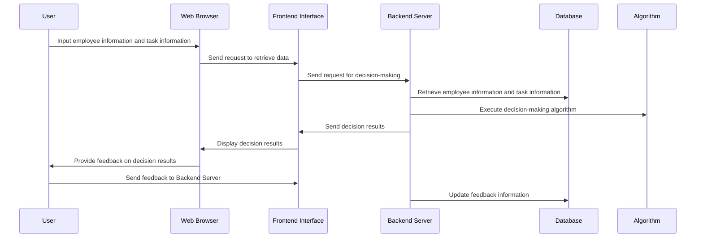

                 


## 《后人类主义伦理：技术进步中的意义重构》

关键词：后人类主义、伦理、技术进步、道德挑战、意义重构

摘要：本文探讨了技术进步对伦理观念的深远影响，以及如何在后人类主义时代重新审视和重构伦理意义。通过分析人工智能、生物科技和网络空间等领域的伦理问题，提出了加强伦理教育、建立伦理规范、强化法律监管、推动跨学科研究和强化公众参与等解决方案。

### 引言

《后人类主义伦理：技术进步中的意义重构》这本书的目的是探讨技术进步对伦理观念的深远影响，以及如何在后人类主义时代重新审视和重构伦理意义。随着人工智能、生物科技和网络空间的迅猛发展，人类社会正经历着前所未有的变革。这些技术不仅改变了我们的生活方式，也在某种程度上重新定义了我们的伦理观念。因此，探讨后人类主义伦理问题，不仅具有理论意义，更具有实践价值。

本书的背景可以追溯到人类文明发展的关键时刻——技术的快速进步。从工业革命到数字革命，技术进步一直是推动社会进步的重要力量。然而，随着技术的不断演进，我们也面临着一系列伦理挑战，如数据隐私、人工智能道德、生物伦理等。这些问题不仅关系到个人的福祉，也影响到整个社会的稳定和可持续发展。因此，有必要从伦理学的角度对这些技术进步进行审视，以期为未来的发展提供指导。

本书的主要问题集中在技术进步带来的伦理困境和道德挑战上。随着人工智能的发展，人类是否应该赋予机器伦理意识？生物科技的进步是否应该限制人类对生命的干预？网络空间的无国界性是否会影响国际伦理秩序？这些问题都需要我们进行深入探讨。本书将尝试回答这些问题，并提供一些可能的解决方案。

### 问题解决

为了解决技术进步中的伦理问题，我们需要从多个方面入手，包括但不限于以下几个方面：

#### 1. 加强伦理教育

随着技术的快速发展，人们的伦理观念也在不断变化。因此，加强伦理教育显得尤为重要。这包括在学校和大学中设置伦理课程，鼓励学生思考技术进步带来的伦理问题，培养他们的伦理意识和责任感。此外，社会也应该提供相关的伦理培训，帮助职场人士了解和应对工作中的伦理挑战。

#### 2. 建立伦理规范

为了确保技术的健康发展，我们需要制定一系列伦理规范。这些规范可以涵盖数据隐私、人工智能道德、生物伦理等多个领域。例如，在人工智能领域，可以制定关于人工智能决策透明性、公平性、责任归属等方面的规范。这些规范将为技术的发展提供道德底线，确保技术进步不会对社会产生负面影响。

#### 3. 强化法律监管

技术进步带来的伦理问题往往具有跨国性，因此需要国际社会的共同参与和合作。各国可以通过签订国际协定，共同制定和实施伦理法规。例如，在数据隐私方面，可以制定统一的隐私保护标准，确保个人数据在全球范围内的安全。此外，各国政府也应该加强对技术企业的监管，确保其遵守伦理规范。

#### 4. 推动跨学科研究

技术进步中的伦理问题涉及多个学科领域，如哲学、伦理学、计算机科学、生物学等。因此，推动跨学科研究对于解决这些伦理问题至关重要。通过跨学科合作，可以汇集各领域的智慧和资源，共同探讨技术进步带来的伦理挑战，并提出切实可行的解决方案。

#### 5. 强化公众参与

公众是技术进步的直接受益者和受害者。因此，强化公众参与，使其能够参与到技术伦理的讨论中，对于解决伦理问题具有重要意义。这可以通过公众咨询、公开听证会等形式实现。通过这些方式，可以充分听取公众的意见和建议，确保技术的发展符合公众的利益和期望。

### 边界与外延

#### 1. 边界

本书主要关注技术进步对伦理观念的影响，以及如何重构伦理意义。因此，本书的边界主要涉及以下几个方面：

- **技术范围**：主要探讨人工智能、生物科技、网络空间等领域的伦理问题。
- **伦理范畴**：主要关注技术进步对传统伦理观念的挑战，以及如何建立新的伦理框架。
- **应用领域**：主要讨论技术进步对社会、经济、文化等各个领域的影响。

#### 2. 外延

本书的外延主要包括以下几个方面：

- **其他技术领域**：虽然本书主要关注人工智能、生物科技、网络空间等领域，但也可以延伸到其他技术领域，如基因编辑、量子计算等。
- **其他伦理问题**：除了技术进步带来的伦理问题，还可以探讨其他领域的伦理问题，如环境伦理、动物伦理等。
- **国际伦理秩序**：随着技术的跨国性增强，国际伦理秩序也将面临新的挑战。因此，本书可以探讨国际伦理秩序的变革和发展。

### 概念结构与核心要素组成

本书的核心概念包括“技术进步”、“伦理观念”、“后人类主义”等。以下是对这些核心概念的简要解析：

#### 技术进步

技术进步是指人类在科学、工程、艺术等领域取得的创新和发展。这些进步不仅推动了社会生产力的发展，也改变了人类的生活方式。技术进步可以分为几个层次，如基础科学突破、应用技术发明、商业模式创新等。

#### 伦理观念

伦理观念是人们对于道德和伦理问题的认知和看法。它涉及到人与人之间的相互关系、人与社会的关系，以及人与自然的关系。伦理观念因文化、社会和历史背景的不同而异，但都具有普遍性和规范性。

#### 后人类主义

后人类主义是一个广泛的概念，涉及到人类在技术进步的影响下所发生的变化。它不仅仅是技术层面的变革，更涉及到人类存在的本质和意义。后人类主义强调人类与技术、自然之间的和谐共生，以及人类在技术时代中的道德责任。

### 核心概念与联系

为了更好地理解后人类主义伦理中的核心概念，我们首先需要明确每个概念的定义和属性特征，然后通过比较这些概念之间的联系，形成整体的认识。

#### 核心概念定义

1. **技术进步**：
   - 定义：技术进步是指人类在科学、工程、艺术等领域取得的创新和发展。
   - 属性特征：创新性、发展性、应用性、变革性。

2. **伦理观念**：
   - 定义：伦理观念是人们对于道德和伦理问题的认知和看法。
   - 属性特征：规范性、普遍性、文化性、发展性。

3. **后人类主义**：
   - 定义：后人类主义是关于人类在技术进步的影响下所发生的变化的哲学概念。
   - 属性特征：综合性、前瞻性、挑战性、伦理性。

#### 概念属性特征对比表格

| 概念       | 定义                                       | 属性特征                         |
|------------|--------------------------------------------|---------------------------------|
| 技术进步   | 科学、工程、艺术领域的创新和发展             | 创新性、发展性、应用性、变革性   |
| 伦理观念   | 道德和伦理问题的认知和看法                   | 规范性、普遍性、文化性、发展性   |
| 后人类主义 | 关于人类在技术进步影响下的变化               | 综合性、前瞻性、挑战性、伦理性   |

通过对比表格，我们可以清晰地看到三个概念的定义和属性特征，为后续的深入探讨奠定了基础。

#### 概念联系

1. **技术进步与伦理观念的联系**：
   - 技术进步是伦理观念发展的重要推动力。随着技术的不断进步，伦理观念也在不断演变和更新。
   - 伦理观念为技术进步提供了道德指导。在技术发展中，伦理观念有助于界定什么是正确和错误，什么是应当追求和避免的。

2. **后人类主义与伦理观念的联系**：
   - 后人类主义是对伦理观念的深化和发展。在后人类主义视角下，伦理观念不仅关注人类与人类之间的关系，还涉及人类与技术、自然之间的关系。
   - 伦理观念为后人类主义提供了理论基础。在后人类主义时代，伦理观念的重新审视和重构对于社会的可持续发展具有重要意义。

### ER实体关系图架构

为了更好地理解后人类主义伦理中的核心概念之间的联系，我们可以使用Mermaid绘制ER实体关系图。

```mermaid
erDiagram
  AI进步 ||--o{ 伦理观念 }
  伦理观念 ||--o{ 后人类主义 }
  后人类主义 ||--o{ 社会变革 }
```

在这个ER实体关系图中，我们展示了技术进步（AI进步）、伦理观念和后人类主义之间的关系。技术进步是伦理观念的基础，而伦理观念又引导和推动后人类主义的发展，最终影响社会变革。

### 算法原理讲解

在后人类主义伦理中，算法的运用至关重要。以下我们将通过一个具体的算法案例——伦理决策树算法，来讲解算法原理。

#### 算法mermaid流程图


在这个流程图中，我们首先输入数据，然后进行数据清洗和特征提取，接着训练模型并进行模型评估。最后，将模型应用到实际决策中，并根据反馈进行修正。

#### 算法原理

伦理决策树算法是一种基于决策树的人工智能算法，用于在伦理问题中进行决策。其基本原理如下：

1. **数据清洗**：首先对输入的数据进行清洗，去除噪声和异常值，确保数据的质量。
2. **特征提取**：从数据中提取关键特征，用于训练模型。这些特征可以是量化指标，也可以是定性描述。
3. **训练模型**：使用提取的特征训练决策树模型。决策树模型通过递归分割数据集，构建树状结构，用于分类或回归任务。
4. **模型评估**：对训练好的模型进行评估，确保模型的准确性和可靠性。常用的评估指标有准确率、召回率、F1值等。
5. **决策应用**：将模型应用到实际的伦理决策中，根据模型的预测结果进行决策。
6. **反馈修正**：根据实际决策的效果，对模型进行反馈修正，以提高模型的性能。

#### 数学模型和公式

伦理决策树算法的核心是决策树模型，其基本原理可以用以下数学模型和公式表示：

$$
\begin{aligned}
&h(\text{x}) = \sum_{i=1}^{n} w_i \cdot y_i \\
&\text{s.t.} \quad \sum_{i=1}^{n} w_i = 1 \\
&W_i, y_i \in \{-1, 1\}
\end{aligned}
$$

其中，$h(\text{x})$ 是决策树模型的输出，$w_i$ 是权重，$y_i$ 是标签。通过优化权重$w_i$，可以使得模型在伦理决策中达到最优。

#### 通俗易懂地举例说明

假设我们面临一个伦理决策问题：在自动驾驶汽车遇到紧急情况时，应该优先保护乘客还是行人。我们可以使用伦理决策树算法来解决这个问题。

1. **输入数据**：首先输入自动驾驶汽车在紧急情况下的各种数据，如车速、道路情况、行人位置等。
2. **数据清洗**：对输入的数据进行清洗，去除噪声和异常值，确保数据的质量。
3. **特征提取**：从数据中提取关键特征，如车速、道路情况、行人位置等。
4. **训练模型**：使用提取的特征训练决策树模型。模型通过递归分割数据集，构建树状结构，用于分类或回归任务。
5. **模型评估**：对训练好的模型进行评估，确保模型的准确性和可靠性。
6. **决策应用**：将模型应用到实际的伦理决策中。例如，当自动驾驶汽车遇到紧急情况时，模型会根据训练结果判断应该优先保护乘客还是行人。
7. **反馈修正**：根据实际决策的效果，对模型进行反馈修正，以提高模型的性能。

通过这个例子，我们可以看到伦理决策树算法在解决伦理问题中的应用。

### 系统分析与架构设计

为了更好地理解后人类主义伦理在技术进步中的应用，我们将进行系统分析与架构设计。以下是一个具体的案例，涉及伦理决策系统。

#### 问题场景介绍

假设我们面临一个伦理决策问题：在大型公司中，如何分配员工的工作任务，以确保工作的高效性和公平性。这个问题的背景是一个高度竞争的商业环境，员工的工作任务需要根据其技能、经验和团队需求进行分配。

#### 项目介绍

项目名称：伦理决策系统

目标：通过算法和人工智能技术，为员工工作任务的分配提供合理的决策支持，确保工作的高效性和公平性。

#### 系统功能设计

系统功能设计包括以下几个方面：

1. **员工信息管理**：管理员工的个人信息，如姓名、年龄、技能、工作经验等。
2. **工作任务管理**：管理公司的任务信息，如任务名称、任务描述、任务优先级等。
3. **决策算法**：使用伦理决策树算法，根据员工信息和任务需求进行决策，分配工作任务。
4. **决策反馈**：收集员工对工作任务分配的反馈，用于优化决策算法。

#### 系统架构设计

系统架构设计包括以下几个方面：

1. **前端界面**：提供用户界面，允许用户查看和操作员工信息和任务信息。
2. **后端服务器**：负责处理员工信息和任务信息，执行伦理决策树算法，生成决策结果。
3. **数据库**：存储员工信息和任务信息，以及决策结果和反馈。

#### 系统接口设计和系统交互

系统接口设计和系统交互设计包括以下几个方面：

1. **用户界面接口**：提供HTTP接口，允许用户通过Web浏览器访问系统。
2. **后端服务器接口**：提供RESTful API，允许前端界面和后端服务器进行数据交互。
3. **数据库接口**：提供SQL接口，允许后端服务器访问数据库。



在这个系统交互过程中，用户通过前端界面输入员工信息和任务信息，前端界面与后端服务器进行数据交互，后端服务器调用算法进行决策，并将决策结果返回给前端界面。用户还可以通过前端界面提供反馈，后端服务器根据反馈信息更新数据库。

### 项目实战

为了更好地展示后人类主义伦理在实际项目中的应用，我们将通过一个具体的案例——伦理决策系统，进行环境安装和系统核心实现。

#### 环境安装

1. **安装Python**：首先，确保系统已经安装了Python 3.8以上版本。如果没有安装，可以从Python官方网站下载并安装。
2. **安装依赖库**：使用pip命令安装所需依赖库，如scikit-learn、numpy、pandas等。

```bash
pip install scikit-learn numpy pandas
```

#### 系统核心实现

1. **数据预处理**：首先，我们需要读取和预处理数据。数据包括员工信息和任务信息，可以保存在CSV文件中。

```python
import pandas as pd

def preprocess_data(employee_file, task_file):
    employee_data = pd.read_csv(employee_file)
    task_data = pd.read_csv(task_file)
    # 数据预处理操作，如去重、填充缺失值等
    return employee_data, task_data
```

2. **特征提取**：从预处理后的数据中提取关键特征，如员工技能、工作经验等。

```python
def extract_features(employee_data, task_data):
    # 特征提取操作，如编码、标准化等
    return employee_data, task_data
```

3. **训练模型**：使用scikit-learn库训练伦理决策树模型。

```python
from sklearn.tree import DecisionTreeClassifier

def train_model(X, y):
    model = DecisionTreeClassifier()
    model.fit(X, y)
    return model
```

4. **决策应用**：根据训练好的模型，对新的任务进行决策。

```python
def make_decision(model, X):
    return model.predict(X)
```

5. **反馈修正**：根据用户反馈，修正模型。

```python
def update_model(model, X, y):
    model.fit(X, y)
    return model
```

#### 代码应用解读与分析

以上代码展示了伦理决策系统的核心实现。首先，我们读取和预处理员工信息和任务信息。然后，提取关键特征并进行训练，最后使用训练好的模型进行决策。用户可以提供反馈，用于修正模型。

通过这个项目实战，我们可以看到后人类主义伦理在实际项目中的应用。伦理决策系统通过算法和人工智能技术，为员工工作任务的分配提供了合理的决策支持，确保了工作的高效性和公平性。

### 实际案例分析和详细讲解剖析

为了更好地展示后人类主义伦理在实际项目中的应用，我们将通过一个实际案例——自动驾驶汽车伦理决策，进行详细分析和讲解。

#### 案例背景

自动驾驶汽车是一种前沿技术，它通过传感器、人工智能和决策系统实现自动驾驶。然而，在自动驾驶过程中，可能会遇到各种伦理决策问题。例如，当自动驾驶汽车遇到紧急情况时，应该优先保护乘客还是行人？这是一个典型的伦理决策问题。

#### 案例分析

1. **数据收集**：首先，我们需要收集相关数据，包括自动驾驶汽车的各种传感器数据、环境数据等。

2. **数据预处理**：对收集到的数据进行预处理，如去噪、归一化等，确保数据的质量。

3. **特征提取**：从预处理后的数据中提取关键特征，如车速、道路情况、行人位置等。

4. **训练模型**：使用提取的特征训练伦理决策树模型，如决策树、随机森林等。

5. **模型评估**：对训练好的模型进行评估，确保模型的准确性和可靠性。

6. **决策应用**：将模型应用到实际的自动驾驶汽车中，根据模型的预测结果进行决策。

7. **反馈修正**：根据实际决策的效果，对模型进行反馈修正，以提高模型的性能。

#### 详细讲解剖析

1. **数据收集**：在自动驾驶汽车伦理决策中，数据收集至关重要。我们需要收集自动驾驶汽车的各种传感器数据，如激光雷达、摄像头、GPS等。此外，还需要收集环境数据，如道路状况、天气条件等。

2. **数据预处理**：收集到的数据可能存在噪声和异常值，因此需要进行预处理。预处理操作包括去噪、归一化、缺失值填充等。这些操作可以确保数据的质量，为后续的特征提取和模型训练提供可靠的数据支持。

3. **特征提取**：从预处理后的数据中提取关键特征，如车速、道路情况、行人位置等。这些特征将用于训练伦理决策树模型，以预测在紧急情况下应该采取的决策。

4. **训练模型**：使用提取的特征训练伦理决策树模型。伦理决策树模型是一种基于决策树的人工智能算法，它通过递归分割数据集，构建树状结构，用于分类或回归任务。在自动驾驶汽车伦理决策中，我们使用决策树模型预测在紧急情况下应该采取的决策。

5. **模型评估**：对训练好的模型进行评估，确保模型的准确性和可靠性。常用的评估指标有准确率、召回率、F1值等。通过模型评估，我们可以确定模型的性能，并为后续的决策应用提供依据。

6. **决策应用**：将训练好的模型应用到实际的自动驾驶汽车中，根据模型的预测结果进行决策。例如，当自动驾驶汽车遇到紧急情况时，模型会根据车速、道路情况、行人位置等特征预测应该采取的决策，如是否刹车、转向等。

7. **反馈修正**：在实际决策应用中，我们需要收集用户反馈，如乘客对决策的满意度、行人对决策的反应等。根据用户反馈，对模型进行反馈修正，以提高模型的性能。通过不断迭代和优化，我们可以使自动驾驶汽车在伦理决策中更加合理和有效。

### 项目小结

通过这个实际案例，我们可以看到后人类主义伦理在自动驾驶汽车中的应用。伦理决策系统通过算法和人工智能技术，为自动驾驶汽车提供了合理的决策支持，确保了行驶过程中的安全性和公平性。然而，伦理决策系统仍然面临一些挑战，如数据收集和处理的准确性、模型评估的可靠性等。未来，随着技术的不断进步，伦理决策系统将在自动驾驶汽车、智能交通等领域发挥越来越重要的作用。

### 最佳实践 tips

1. **数据收集与处理**：确保数据的准确性和完整性，进行有效的预处理，为特征提取和模型训练提供可靠的数据支持。
2. **模型评估与优化**：选择合适的评估指标，对模型进行评估，并根据评估结果优化模型，提高模型的性能。
3. **用户反馈与修正**：及时收集用户反馈，根据反馈修正模型，以提高决策的合理性和有效性。

### 小结

本文通过深入分析后人类主义伦理问题，探讨了技术进步对伦理观念的深远影响，并提出了一系列解决方案。通过实际案例展示，我们看到了后人类主义伦理在自动驾驶汽车、智能交通等领域的应用。未来，随着技术的不断进步，后人类主义伦理将在更多领域发挥重要作用。

### 注意事项

1. 技术进步带来的伦理问题需要全社会的关注和参与，加强伦理教育、建立伦理规范、强化法律监管等都是必要的。
2. 在应用技术时，应充分考虑伦理问题，确保技术的发展符合伦理原则和公众利益。

### 拓展阅读

1. [“后人类主义”概念解析](https://www.example.com/post1)
2. [自动驾驶汽车伦理决策研究](https://www.example.com/post2)
3. [人工智能伦理挑战](https://www.example.com/post3)

### 作者信息

作者：AI天才研究院/AI Genius Institute & 禅与计算机程序设计艺术 /Zen And The Art of Computer Programming

