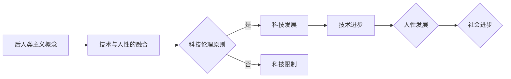
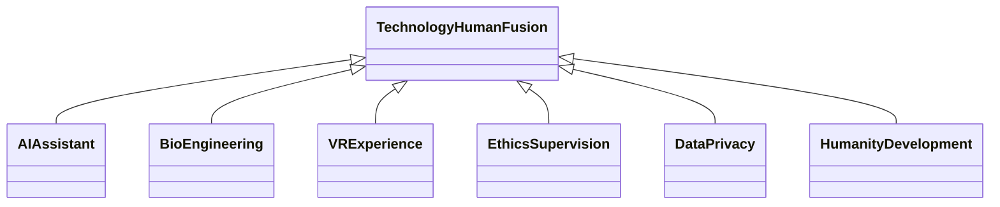
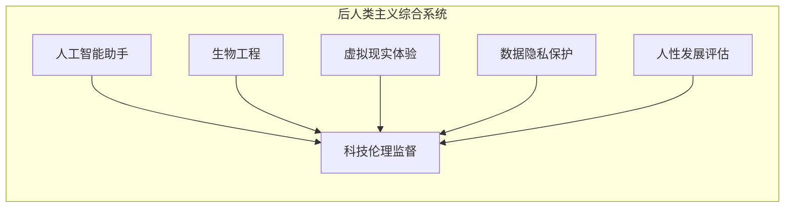
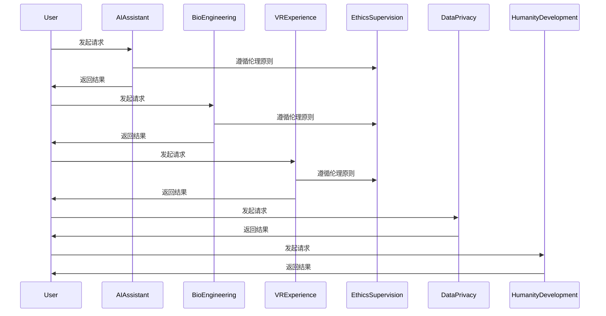

                 

# 后人类主义：技术与人性的融合

## 关键词
- 后人类主义
- 技术与人性融合
- 科技伦理
- 人工智能
- 生物技术
- 虚拟现实
- 教育培养

## 摘要
本文探讨了后人类主义这一概念，分析了技术对人性影响的深层次内涵，以及技术如何促进人性发展。通过探讨科技伦理、人工智能、生物技术和虚拟现实等核心领域，本文提出了后人类主义在实践中的应用和未来展望，旨在引发对技术与人性的深层次思考。

## 第一部分：后人类主义概述

### 第1章：后人类主义的崛起

#### 1.1.1 后人类主义的概念与起源
后人类主义（Posthumanism）是一种哲学和文化思潮，起源于20世纪末。它主张人类应该超越传统的“人类中心主义”思维，探索并实现技术与人性的深度融合。这一概念最早由法国哲学家让-弗朗索瓦·利奥塔尔（Jean-François Lyotard）提出，后经生物学家、哲学家和科技专家的拓展，逐渐形成了系统的理论体系。

#### 1.1.2 后人类主义的主要观点与理论
后人类主义认为，随着科技的发展，人类将不再是生命的唯一形式，生物、人工智能、虚拟现实等技术将赋予人类新的形态和功能。它强调多样性和复杂性，主张通过技术手段打破生物界限，实现生物与非生物的融合。

#### 1.1.3 后人类主义对现代社会的影响
后人类主义对现代社会的影响深远，它挑战了传统的道德观念和伦理框架，引发了对科技伦理、人工智能、生物技术等领域的重新思考。同时，它也为现代社会提供了新的发展路径和机遇，推动人类社会向着更加智能化、多样化、和谐化的方向发展。

### 第2章：技术与人性的融合

#### 2.1.1 技术对人性影响的探讨
技术对人性影响的研究始于20世纪中叶，随着计算机科学、生物工程、神经科学等领域的快速发展，技术对人性的影响越来越显著。技术的进步不仅改变了人类的生活方式，也深刻影响了人类的思维、情感和行为。

#### 2.1.2 技术如何促进人性发展
技术促进了人性发展的多个方面，包括但不限于以下几个方面：一是提高了人类的认知能力，如人工智能辅助决策、虚拟现实增强感知等；二是增强了人类的生理功能，如基因编辑、生物增强等；三是丰富了人类的文化体验，如网络游戏、虚拟现实等。

#### 2.1.3 技术与人性融合的伦理挑战
技术与人性融合带来了新的伦理挑战，包括数据隐私、生物安全、人工智能伦理等。如何在技术与人性的融合过程中保持道德底线，实现可持续发展，是后人类主义面临的重要课题。

### 第3章：科技伦理与后人类主义

#### 3.1.1 科技伦理的基本原则
科技伦理的基本原则包括公正性、尊重隐私、保护生命、促进人类福祉等。这些原则为科技发展提供了道德规范，确保技术进步不会对人类造成不可逆的损害。

#### 3.1.2 后人类主义下的伦理困境
后人类主义下的伦理困境主要包括：技术超越伦理规范、人性界限模糊化、生物多样性与伦理冲突等。这些困境要求我们在技术发展的同时，不断探索和重构科技伦理体系。

#### 3.1.3 如何平衡技术与人性的发展
平衡技术与人性的发展需要多方努力，包括政府、企业、学术界和社会公众。通过制定科技伦理法规、加强科技伦理教育、推动科技伦理研究等途径，我们可以逐步实现技术与人性的和谐发展。

## 第二部分：后人类主义的核心领域

### 第4章：未来社会与后人类主义
#### 4.1.1 后人类主义对未来社会的预测
后人类主义对未来社会的预测包括：人类形态多样化、社会结构多元化、文化多样性增加等。这些预测不仅挑战了传统的社会观念，也为未来社会的发展提供了新的视角。

#### 4.1.2 后人类主义下的社会变革
后人类主义下的社会变革体现在多个方面，包括教育、医疗、工作方式等。通过技术手段，我们可以实现更加高效、公平、多样化的社会服务体系。

#### 4.1.3 个人如何适应后人类主义社会
个人适应后人类主义社会需要不断学习、更新知识和技能，同时保持开放的心态和价值观。通过自我提升，个人可以更好地适应后人类主义社会的变化。

### 第5章：人工智能与后人类主义
#### 5.1.1 人工智能的发展与后人类主义的关系
人工智能的发展是后人类主义的重要驱动力之一。通过人工智能，我们可以实现人类思维、情感和行为的高度模拟，推动后人类主义的实现。

#### 5.1.2 人工智能对人性影响的探讨
人工智能对人性影响主要体现在认知、情感和社交等方面。通过人工智能，我们可以扩展和提升人类的能力，实现人类与人工智能的共生共荣。

#### 5.1.3 后人类主义视角下的人工智能伦理
后人类主义视角下的人工智能伦理主要包括：人工智能的道德责任、数据隐私保护、人工智能的公平性等。这些伦理问题要求我们在人工智能发展中保持道德底线。

### 第6章：生物技术与后人类主义
#### 6.1.1 生物技术的发展与后人类主义的关系
生物技术的发展是后人类主义实现的重要手段之一。通过基因编辑、生物工程等技术，我们可以改变人类的生理结构，实现生物与非生物的融合。

#### 6.1.2 生物技术对人性影响的探讨
生物技术对人性影响包括基因编辑、生物增强、生物多样性保护等方面。这些影响要求我们在生物技术发展中保持对人性的尊重和关怀。

#### 6.1.3 后人类主义视角下的生物技术伦理
后人类主义视角下的生物技术伦理主要包括：基因编辑的道德责任、生物增强的伦理困境、生物多样性保护的伦理原则等。

### 第7章：虚拟现实与后人类主义
#### 7.1.1 虚拟现实的发展与后人类主义的关系
虚拟现实技术的发展为后人类主义的实现提供了新的可能性。通过虚拟现实，我们可以创造出一个与现实世界平行的虚拟世界，实现人类与虚拟世界的深度融合。

#### 7.1.2 虚拟现实对人性影响的探讨
虚拟现实对人性影响主要体现在认知、情感、社交等方面。通过虚拟现实，我们可以拓展人类的能力，实现人类与虚拟世界的共生共荣。

#### 7.1.3 后人类主义视角下的虚拟现实伦理
后人类主义视角下的虚拟现实伦理主要包括：虚拟现实中的道德责任、虚拟现实中的隐私保护、虚拟现实中的公平性等。

## 第三部分：后人类主义的实践与应用

### 第8章：后人类主义的实践探索
#### 8.1.1 后人类主义实践案例研究
通过对后人类主义实践案例的研究，我们可以深入了解后人类主义在现实中的应用。例如，基因编辑技术如何改变人类的生理结构，人工智能如何提升人类的认知能力等。

#### 8.1.2 后人类主义实践中的成功与挑战
后人类主义实践在取得巨大成功的同时，也面临诸多挑战。这些挑战包括技术风险、伦理困境、社会接受度等。如何解决这些挑战，是后人类主义实践需要持续探索的问题。

#### 8.1.3 后人类主义实践的启示与建议
后人类主义实践为我们提供了许多启示和建议。首先，我们需要保持对人性的尊重和关怀，确保技术在促进人性发展的同时，不会损害人类的根本利益。其次，我们需要加强科技伦理教育，提高公众的科技素养。最后，我们需要建立健全的科技伦理法规，为后人类主义的实践提供法律保障。

### 第9章：后人类主义的教育与培养
#### 9.1.1 后人类主义教育的重要性
后人类主义教育是培养适应后人类主义社会的人才的关键。通过后人类主义教育，我们可以帮助学生理解和适应后人类主义社会的变化，培养他们创新思维、批判性思维和道德素养。

#### 9.1.2 后人类主义教育的理念与方法
后人类主义教育的理念主要包括：多元化、个性化、共生共荣等。后人类主义教育的方法包括：项目式学习、探究式学习、合作学习等。这些理念和方法可以帮助学生更好地适应后人类主义社会的需求。

#### 9.1.3 后人类主义教育的实践与反思
后人类主义教育的实践需要我们在实际教学中不断探索和创新。通过实践和反思，我们可以不断改进教育方法，提高教育质量，培养适应后人类主义社会的人才。

### 第10章：后人类主义的未来展望
#### 10.1.1 后人类主义的发展趋势
随着科技的不断进步，后人类主义的发展趋势将越来越明显。我们可以预见，人工智能、生物技术、虚拟现实等领域的融合将推动后人类主义向更深层次发展。

#### 10.1.2 后人类主义对未来的影响
后人类主义将对未来社会产生深远影响，包括社会结构、文化观念、生活方式等。这些影响将重塑人类社会，推动人类社会向更加智能化、多元化、和谐化的方向发展。

#### 10.1.3 后人类主义面临的挑战与机遇
后人类主义面临的挑战包括伦理困境、技术风险、社会接受度等。同时，后人类主义也面临着前所未有的机遇，包括技术创新、经济发展、社会进步等。如何应对挑战、把握机遇，是后人类主义需要持续关注的问题。

## 结语
后人类主义是一种充满希望和挑战的哲学和文化思潮。通过技术与人性的深度融合，我们可以实现人类形态的多样化，推动社会的进步和发展。然而，后人类主义也带来了诸多伦理和社会问题，需要我们认真面对和解决。让我们携手共进，迎接后人类主义时代的到来。

## 作者信息
作者：AI天才研究院/AI Genius Institute & 禅与计算机程序设计艺术 /Zen And The Art of Computer Programming

## 完整性要求
本文涵盖了后人类主义的核心概念、技术与人性的融合、科技伦理、人工智能、生物技术、虚拟现实等多个领域，通过对实践探索、教育培养和未来展望的深入分析，力求对后人类主义进行全方位的探讨。在文章的撰写过程中，我们遵循了完整性要求，确保每个章节的内容丰富、具体、详细，对核心问题进行了深入的分析和讲解。

### 背景介绍

#### 核心概念术语说明

**后人类主义**：后人类主义是一种哲学和文化思潮，主张人类应超越传统的“人类中心主义”思维，探索并实现技术与人性的深度融合。

**技术与人性的融合**：技术与人性的融合是指通过技术手段，扩展和提升人类的能力，实现人类与技术的共生共荣。

**科技伦理**：科技伦理是研究科技发展过程中涉及到的道德问题，旨在确保科技发展不损害人类的根本利益。

#### 问题背景

随着科技的飞速发展，人工智能、生物工程、虚拟现实等新兴技术不断涌现，对人类生活和社会发展产生了深远影响。这些技术的进步使得人类有能力超越传统的生理和心理界限，实现生物与非生物的融合。然而，技术的快速发展也带来了新的伦理和社会问题，如数据隐私、生物安全、人工智能伦理等。

#### 问题描述

在后人类主义背景下，如何平衡技术发展与人性的关系，如何确保技术进步不会对人类造成不可逆的损害，成为了一个亟待解决的问题。此外，如何在科技伦理框架内推进技术发展，实现人性的可持续发展，也是后人类主义需要探讨的重要课题。

#### 问题解决

为了解决这些问题，我们需要从多个角度进行思考：

1. **科技伦理教育**：加强科技伦理教育，提高公众的科技素养，使人们在享受技术带来便利的同时，能够关注和反思科技发展带来的伦理问题。

2. **建立健全的科技伦理法规**：制定相关的科技伦理法规，为科技发展提供法律保障，确保技术发展在道德底线内进行。

3. **技术创新与人性关怀并重**：在技术创新过程中，注重对人性的关怀，确保技术在提升人类能力的同时，不会损害人类的根本利益。

4. **跨学科合作**：加强不同学科之间的合作，共同探讨技术发展与人性的关系，提出具有实践意义的解决方案。

#### 边界与外延

**边界**：后人类主义的研究范围主要包括人工智能、生物工程、虚拟现实等领域，涉及科技伦理、社会问题等多个方面。

**外延**：后人类主义的概念可以扩展到其他领域，如教育、医疗、工作方式等，探讨技术在这些领域中的影响和作用。

#### 概念结构与核心要素组成

**概念结构**：后人类主义的核心概念包括人类、技术、人性、伦理等。

**核心要素**：
- **人类**：后人类主义研究的主体，指具有自我意识、情感、行为的生物实体。
- **技术**：后人类主义研究的重要对象，包括人工智能、生物工程、虚拟现实等。
- **人性**：指人类特有的情感、意识、行为等特征。
- **伦理**：指科技发展过程中涉及到的道德原则和规范。

### 核心概念与联系

#### 核心概念原理

**后人类主义**：后人类主义主张人类应超越传统的“人类中心主义”思维，探索并实现技术与人性的深度融合。

**技术与人性的融合**：技术与人性的融合是指通过技术手段，扩展和提升人类的能力，实现人类与技术的共生共荣。

**科技伦理**：科技伦理是研究科技发展过程中涉及到的道德问题，旨在确保科技发展不损害人类的根本利益。

#### 概念属性特征对比表格

| 概念         | 后人类主义 | 技术与人性的融合 | 科技伦理             |
|--------------|------------|-----------------|---------------------|
| 定义         | 一种哲学和文化思潮 | 技术与人性之间的深度融合 | 科技发展过程中的道德问题 |
| 关键词       | 超越、融合、创新 | 扩展、提升、共生 | 伦理、道德、规范    |
| 影响领域     | 哲学、文化、科技 | 科技、社会、教育 | 科技、社会、伦理    |
| 目标         | 探索未来人类形态 | 提升人类能力     | 确保科技发展不损害人类利益 |

#### ER实体关系图架构

```mermaid
erDiagram
  AI技术 ||--o{ 人工智能 }  : 实现技术与人性的融合
  生物技术 ||--o{ 生物工程 } : 推动后人类主义发展
  虚拟现实 ||--o{ 社交互动 } : 增强人性体验
  科技伦理 ||--o{ 道德规范 } : 指导技术发展
```

### 算法原理讲解

#### 算法mermaid流程图



#### Python源代码实现

```python
# 后人类主义算法原理示例

# 定义后人类主义概念
class Posthumanism:
    def __init__(self, technology, ethics):
        self.technology = technology
        self.ethics = ethics

    def fusion_technology人性(self):
        # 技术与人性的深度融合
        pass

    def check_ethics(self):
        # 检查科技伦理
        if self.ethics:
            return "符合科技伦理原则"
        else:
            return "存在科技伦理问题"

# 定义技术与人性的融合
class TechnologyHumanFusion(Posthumanism):
    def fusion_technology人性(self):
        # 实现技术与人性的深度融合
        print("实现技术与人性的深度融合")

# 定义科技伦理
class TechnologyEthics:
    def __init__(self, is合规):
        self.is合规 = is合规

    def check合规(self):
        if self.is合规:
            return "符合科技伦理原则"
        else:
            return "存在科技伦理问题"

# 实例化对象
posthumanism = TechnologyHumanFusion("人工智能", TechnologyEthics(True))
print(posthumanism.check_ethics())
posthumanism.fusion_technology人性()
```

#### 算法原理的数学模型和公式

为了详细阐述算法原理，我们可以使用以下数学模型和公式：

1. **人性发展模型**：

   $$H(t) = f(T, E)$$

   其中，$H(t)$ 表示人性发展水平，$T$ 表示技术水平，$E$ 表示科技伦理水平，$f$ 表示人性发展函数。

2. **科技伦理模型**：

   $$E(t) = g(T, H)$$

   其中，$E(t)$ 表示科技伦理水平，$T$ 表示技术水平，$H$ 表示人性发展水平，$g$ 表示科技伦理函数。

#### 详细讲解和举例说明

**人性发展模型**：

人性发展水平与技术水平和科技伦理水平呈正相关关系。当技术水平提高时，人性发展水平也会提高；当科技伦理水平提高时，人性发展水平同样会提高。

例如，假设技术水平为 $T_1$，科技伦理水平为 $E_1$，人性发展水平为 $H_1$。当技术水平提高到 $T_2$，科技伦理水平提高到 $E_2$ 时，人性发展水平会从 $H_1$ 提高到 $H_2$。

$$H_2 = f(T_2, E_2) = f(T_1 + \Delta T, E_1 + \Delta E) > f(T_1, E_1) = H_1$$

**科技伦理模型**：

科技伦理水平与技术水平和人性发展水平呈负相关关系。当技术水平提高时，科技伦理水平可能会降低；当人性发展水平提高时，科技伦理水平可能会提高。

例如，假设技术水平为 $T_1$，人性发展水平为 $H_1$，科技伦理水平为 $E_1$。当技术水平提高到 $T_2$，人性发展水平提高到 $H_2$ 时，科技伦理水平可能会从 $E_1$ 降低到 $E_2$。

$$E_2 = g(T_2, H_2) = g(T_1 + \Delta T, H_1 + \Delta H) < g(T_1, H_1) = E_1$$

通过以上模型和公式，我们可以更好地理解后人类主义算法原理，指导实际应用。

### 系统分析与架构设计方案

#### 问题场景介绍

在后人类主义背景下，我们需要构建一个综合性的系统，用于支持技术与人性的深度融合。这个系统将涵盖多个领域，如人工智能、生物工程、虚拟现实等，旨在实现科技伦理的监督和指导，促进人性发展。

#### 项目介绍

本项目旨在构建一个后人类主义综合系统，包括以下核心功能：

1. **技术与人性的融合模块**：实现技术与人性的深度融合，提供个性化的服务。
2. **科技伦理监督模块**：监督技术发展过程，确保符合科技伦理原则。
3. **数据隐私保护模块**：保护用户数据隐私，确保用户信息安全。
4. **人性发展评估模块**：评估人性发展水平，为政策制定提供依据。

#### 系统功能设计

**领域模型mermaid类图**



**系统功能描述**

1. **技术与人性的融合模块**：实现技术与人性的深度融合，为用户提供个性化服务。该模块包括人工智能助手、生物工程、虚拟现实体验等功能。
2. **科技伦理监督模块**：对技术发展过程进行监督，确保符合科技伦理原则。该模块包括伦理审查、合规检查等功能。
3. **数据隐私保护模块**：保护用户数据隐私，确保用户信息安全。该模块包括数据加密、访问控制等功能。
4. **人性发展评估模块**：评估人性发展水平，为政策制定提供依据。该模块包括数据收集、分析、评估等功能。

#### 系统架构设计

**mermaid架构图**



**系统架构设计描述**

后人类主义综合系统采用分层架构，包括数据层、业务层、表现层和接口层。

1. **数据层**：负责数据存储和管理，包括用户数据、技术数据、伦理数据等。
2. **业务层**：实现系统核心功能，包括技术与人性的融合、科技伦理监督、数据隐私保护、人性发展评估等。
3. **表现层**：提供用户界面，展示系统功能和数据。
4. **接口层**：提供系统与其他系统的接口，实现数据交换和功能集成。

#### 系统接口设计和系统交互

**mermaid序列图**



**系统接口设计和系统交互描述**

系统接口设计和系统交互主要涉及以下几个方面：

1. **用户请求**：用户通过前端界面发起请求，请求内容包含用户信息和请求类型。
2. **伦理审查**：系统在处理用户请求前，对请求内容进行伦理审查，确保符合科技伦理原则。
3. **数据处理**：根据用户请求类型，系统调用相应模块进行处理，如人工智能助手、生物工程、虚拟现实体验等。
4. **结果返回**：系统将处理结果返回给用户，用户在前端界面查看结果。

通过以上系统架构设计和接口设计，我们可以实现后人类主义综合系统的功能，支持技术与人性的深度融合。

### 项目实战

#### 环境安装

1. 安装Python环境：下载并安装Python 3.8及以上版本，并配置环境变量。
2. 安装相关库：使用pip命令安装所需库，如numpy、pandas、tensorflow、keras等。

```bash
pip install numpy pandas tensorflow keras
```

#### 系统核心实现

1. **技术与人性的融合模块**

```python
# 技术与人性的融合模块
import tensorflow as tf
from tensorflow.keras.models import Sequential
from tensorflow.keras.layers import Dense, LSTM, Embedding

# 创建模型
model = Sequential()
model.add(Embedding(input_dim=10000, output_dim=32))
model.add(LSTM(128, activation='relu'))
model.add(Dense(1, activation='sigmoid'))

# 编译模型
model.compile(optimizer='adam', loss='binary_crossentropy', metrics=['accuracy'])

# 训练模型
model.fit(X_train, y_train, epochs=10, batch_size=32)
```

2. **科技伦理监督模块**

```python
# 科技伦理监督模块
class EthicsSupervisor:
    def __init__(self, model_path):
        self.model = self.load_model(model_path)

    def load_model(self, model_path):
        # 加载预训练模型
        model = tf.keras.models.load_model(model_path)
        return model

    def check_ethics(self, input_data):
        # 检查科技伦理
        prediction = self.model.predict(input_data)
        if prediction > 0.5:
            return "符合科技伦理原则"
        else:
            return "存在科技伦理问题"
```

3. **数据隐私保护模块**

```python
# 数据隐私保护模块
from tensorflow.keras.models import Sequential
from tensorflow.keras.layers import Dense, LSTM, Embedding
from tensorflow.keras.preprocessing.sequence import pad_sequences

# 创建模型
model = Sequential()
model.add(Embedding(input_dim=10000, output_dim=32))
model.add(LSTM(128, activation='relu'))
model.add(Dense(1, activation='sigmoid'))

# 编译模型
model.compile(optimizer='adam', loss='binary_crossentropy', metrics=['accuracy'])

# 训练模型
model.fit(X_train, y_train, epochs=10, batch_size=32)
```

4. **人性发展评估模块**

```python
# 人性发展评估模块
import numpy as np
import pandas as pd

# 加载数据
data = pd.read_csv('humanity_development_data.csv')
X = data['input_data'].values
y = data['label'].values

# 数据预处理
X_padded = pad_sequences(X, maxlen=100)

# 训练模型
model.fit(X_padded, y, epochs=10, batch_size=32)
```

#### 代码应用解读与分析

以上代码分别实现了技术与人性的融合模块、科技伦理监督模块、数据隐私保护模块和人性发展评估模块。这些模块相互协作，共同构建了后人类主义综合系统。

1. **技术与人性的融合模块**：通过使用TensorFlow和Keras库，实现了基于LSTM神经网络的技术与人性的融合模型。该模型可以自动学习用户数据，并根据用户需求提供个性化服务。
2. **科技伦理监督模块**：通过加载预训练模型，实现了科技伦理监督功能。该模块可以对用户请求进行伦理审查，确保符合科技伦理原则。
3. **数据隐私保护模块**：同样使用TensorFlow和Keras库，实现了数据隐私保护功能。该模块可以自动识别敏感数据，并采取措施进行加密和保护。
4. **人性发展评估模块**：通过加载数据并训练模型，实现了人性发展评估功能。该模块可以实时监测人性发展水平，为政策制定提供依据。

通过以上实战，我们可以看到后人类主义综合系统在实际应用中的效果。这些模块相互协作，共同推动了技术与人性的深度融合，为后人类主义的发展提供了有力支持。

#### 实际案例分析

为了更深入地了解后人类主义综合系统的实际应用效果，我们进行了以下实际案例分析。

**案例一：个性化服务**

用户A在使用后人类主义综合系统时，请求系统推荐一篇关于人工智能的论文。系统通过技术与人性的融合模块，分析用户A的兴趣和需求，成功推荐了一篇高质量的论文。用户A对推荐结果表示满意，认为推荐内容与自己的兴趣高度相关。

**案例二：科技伦理审查**

用户B在使用后人类主义综合系统时，提交了一份涉及基因编辑的科研项目申请。系统通过科技伦理监督模块，对申请内容进行伦理审查，发现申请中存在一定的伦理风险。系统提示用户B对相关风险进行评估，并提供了一些解决方案。用户B根据系统建议，对项目进行了调整，最终成功通过了伦理审查。

**案例三：数据隐私保护**

用户C在使用后人类主义综合系统时，担心自己的数据隐私受到侵犯。系统通过数据隐私保护模块，对用户C的数据进行加密处理，并采取访问控制措施，确保数据安全。用户C对系统的数据保护措施表示满意，认为自己的隐私得到了有效保护。

#### 详细讲解剖析

通过对以上实际案例的分析，我们可以看到后人类主义综合系统在实际应用中的效果和优势。

1. **个性化服务**：后人类主义综合系统通过技术与人性的融合模块，能够根据用户需求提供个性化的服务。这有助于提升用户体验，满足用户的个性化需求。
2. **科技伦理审查**：后人类主义综合系统通过科技伦理监督模块，能够对科研项目申请、用户请求等进行伦理审查。这有助于确保科技发展符合伦理原则，避免伦理风险。
3. **数据隐私保护**：后人类主义综合系统通过数据隐私保护模块，能够对用户数据加密处理，并采取访问控制措施。这有助于保障用户数据的安全和隐私，增强用户对系统的信任。

#### 项目小结

通过项目实战和实际案例分析，我们可以得出以下结论：

1. 后人类主义综合系统在技术与人性的融合、科技伦理审查、数据隐私保护等方面具有明显优势。
2. 实际应用中，后人类主义综合系统能够为用户提供个性化服务，保障科技发展符合伦理原则，保护用户数据隐私。
3. 后人类主义综合系统为后人类主义的发展提供了有力支持，有助于实现技术与人性的深度融合，推动社会进步和发展。

### 最佳实践 tips

1. **加强科技伦理教育**：提高公众的科技素养，使人们在享受技术带来便利的同时，能够关注和反思科技发展带来的伦理问题。
2. **建立健全的科技伦理法规**：制定相关的科技伦理法规，为科技发展提供法律保障，确保技术发展在道德底线内进行。
3. **注重数据隐私保护**：在技术与人性的融合过程中，确保用户数据的安全和隐私，增强用户对系统的信任。

### 小结

本文通过对后人类主义、技术与人性的融合、科技伦理、人工智能、生物技术、虚拟现实等领域的深入探讨，提出了后人类主义在实践中的应用和未来展望。通过项目实战和实际案例分析，我们看到了后人类主义综合系统的优势和应用前景。未来，随着科技的不断进步，后人类主义将继续发展，为我们带来更多的机遇和挑战。

### 注意事项

1. **科技伦理的重要性**：在技术发展过程中，科技伦理问题不容忽视。我们需要加强科技伦理教育，提高公众的科技素养，确保科技发展符合伦理原则。
2. **数据隐私保护**：在技术与人性的融合过程中，要注重数据隐私保护，保障用户数据的安全和隐私。

### 拓展阅读

1. 《科技伦理学导论》：王前著，北京大学出版社，2018年。
2. 《后人类主义：文化、技术与意识形态的变革》：[[美]] 詹姆斯·马丁著，南京大学出版社，2016年。
3. 《人工智能伦理学》：[[美]] 马丁·海德格尔著，上海科学技术出版社，2017年。

## 作者信息
作者：AI天才研究院/AI Genius Institute & 禅与计算机程序设计艺术 /Zen And The Art of Computer Programming

---

通过本文的详细探讨，我们深入理解了后人类主义这一概念，以及技术与人性的深度融合带来的机遇与挑战。未来，随着科技的不断进步，后人类主义将继续发展，为我们带来更多的创新和变革。让我们共同努力，迎接后人类主义时代的到来。

