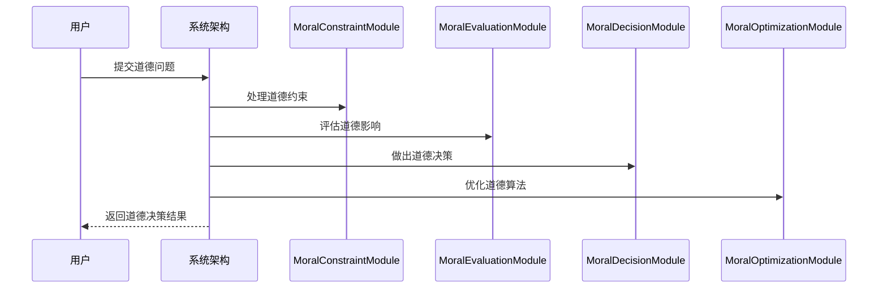
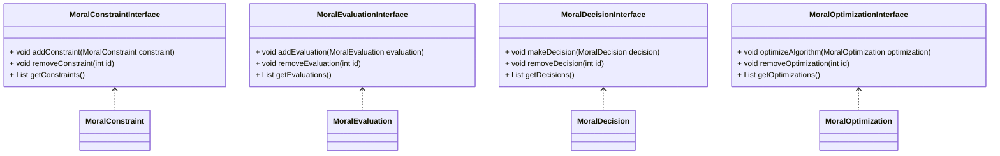

                 

# 后人类伦理学研讨会：科技发展的道德边界

## 关键词
- 后人类伦理学
- 科技发展
- 道德边界
- 人工智能
- 基因编辑
- 虚拟现实

## 摘要
随着科技的发展，人类社会进入了一个前所未有的后人类时代。然而，科技的进步也带来了诸多道德伦理问题。本文旨在探讨科技发展所带来的道德边界问题，分析科技与道德伦理之间的关系，并提出相应的解决思路。通过深入分析人工智能、基因编辑、克隆技术等领域的道德伦理问题，本文试图为后人类伦理学提供一个全面而深入的研讨会。

## 第一部分：背景介绍

### 1.1 问题背景
科技的发展正以前所未有的速度改变着我们的生活方式。人工智能、基因编辑、克隆技术、虚拟现实等前沿科技不断涌现，极大地推动了社会的进步。然而，这些科技的发展也引发了一系列道德伦理问题，如人工智能的道德责任、基因编辑的伦理风险、克隆技术的伦理争议等。这些问题不仅关系到科技本身，还涉及到人类社会的基本伦理原则和价值观。

### 1.2 问题描述
科技发展带来的道德问题涉及广泛，包括人工智能、基因编辑、克隆技术、网络隐私、虚拟现实等多个领域。例如，人工智能的发展引发了关于智能机器是否应该具备道德责任和权利的讨论；基因编辑技术的出现引发了对人类基因编辑伦理边界的争论；克隆技术的争议则集中在人类尊严和身份认同问题上。这些问题迫切需要我们深入探讨和解决。

### 1.3 问题解决
解决科技发展带来的道德问题需要从多个角度进行思考。首先，我们需要在科技伦理学、哲学、社会学等领域进行深入研究，探讨科技与道德伦理之间的关系。其次，我们需要制定相应的法律法规和伦理规范，确保科技的发展不会对社会造成不可逆转的损害。此外，公众教育和媒体宣传也至关重要，需要提高公众对科技伦理问题的认识和重视。

### 1.4 边界与外延
道德边界的探讨不仅限于科技领域，还包括对人类行为、社会关系、文化习俗等层面的反思。在科技发展的背景下，我们需要明确道德边界，确保科技的发展不会超越道德的底线。同时，我们也需要关注科技对人类伦理观念的冲击和重塑，以适应后人类时代的社会发展。

### 1.5 概念结构与核心要素组成
后人类伦理学研讨会：科技发展的道德边界，核心概念包括：
- 科技发展：指科技在各个领域的创新和应用，是人类社会进步的重要动力。
- 道德伦理：指人类社会的基本价值观和行为规范，是维护社会秩序和谐的重要保障。
- 道德边界：指科技发展与社会伦理之间的界限，是我们在科技发展中需要遵守的道德规范。

## 第二部分：核心概念与联系

### 2.1 科技发展与道德伦理

#### 2.1.1 科技发展对道德伦理的影响
科技的发展深刻影响了道德伦理观念的形成和演变。例如，人工智能的崛起引发了对智能机器道德责任和权利的讨论，基因编辑技术的出现引发了对人类基因编辑伦理边界的争论。科技的发展不仅改变了我们的生活方式，也挑战了传统的道德伦理观念，迫使人们重新审视和思考科技与道德的关系。

#### 2.1.2 道德伦理对科技发展的引导
道德伦理在科技发展中具有引导作用，确保科技的发展不会违背社会的基本价值观和伦理原则。例如，人工智能技术的发展需要遵循伦理规范，确保不会侵犯个人隐私和尊严；基因编辑技术的研究和应用需要遵循伦理审查，确保不会损害人类基因的完整性和多样性。道德伦理规范为科技发展提供了行为准则，指导科技工作者在创新过程中遵循道德底线。

### 2.2 道德边界与科技发展

#### 2.2.1 道德边界在科技发展中的作用
道德边界在科技发展中起到了约束和引导的作用，防止科技发展走向极端，对社会造成负面影响。明确道德边界可以帮助科技工作者在创新过程中遵循道德规范，避免技术滥用和道德风险。例如，人工智能技术的发展需要在道德边界内进行，确保智能机器的行为符合伦理要求；基因编辑技术的研究和应用需要在伦理审查框架内进行，确保不会侵犯人类基因的完整性和多样性。

#### 2.2.2 道德边界与科技发展的互动关系
道德边界与科技发展之间存在互动关系，科技的发展会不断挑战和重塑道德边界，而道德边界的确定也会对科技发展产生重要影响。随着科技的发展，新的伦理问题不断涌现，需要我们不断调整和明确道德边界。同时，道德边界的确定也会影响科技的发展方向和速度，确保科技的发展符合社会伦理要求和价值观。

### 2.3 道德伦理原则与科技发展

#### 2.3.1 道德伦理原则在科技发展中的应用
道德伦理原则在科技发展中具有重要应用，如尊重个人隐私、保障人权、公平正义等。这些原则有助于引导科技的发展，确保其符合社会伦理规范。例如，人工智能技术的发展需要遵循隐私保护原则，确保用户隐私不被侵犯；基因编辑技术的研究和应用需要遵循人权保障原则，确保不会损害个体的基本权利；科技的发展也需要遵循公平正义原则，确保科技资源分配的公平性。

#### 2.3.2 道德伦理原则的演变与科技发展
道德伦理原则随着科技的发展而不断演变，这反映了人类社会对科技发展的认知和应对。例如，随着人工智能技术的不断发展，隐私保护和人权保障成为重要的道德伦理原则；随着基因编辑技术的出现，人类基因编辑的伦理边界成为研究的重点。道德伦理原则的演变不仅反映了科技对社会的冲击，也为科技的发展提供了伦理指导。

## 第三部分：算法原理讲解

### 3.1 科技发展中的道德算法

#### 3.1.1 道德算法的定义
道德算法是指用于解决科技发展带来的道德问题的算法。这些算法旨在帮助科技工作者在开发和应用科技时，遵循道德原则，避免造成道德损害。道德算法的核心目标是确保科技的发展符合社会伦理规范，保护人类的尊严和权益。

#### 3.1.2 道德算法的核心原理
道德算法的核心原理包括尊重个人隐私、保障人权、公平正义等。这些原理旨在确保科技的发展不会侵犯个人隐私、损害人权，并且在资源分配和决策过程中保持公平正义。

### 3.2 道德算法的实现方法

#### 3.2.1 伦理框架构建
伦理框架构建是道德算法实现的关键步骤。通过建立伦理框架，我们可以明确道德算法的运行规则和标准，确保其遵循道德原则。伦理框架包括道德原则的阐述、伦理规则的制定和伦理审查机制的建立等。

#### 3.2.2 道德算法模型设计
道德算法模型设计是道德算法实现的关键环节。我们需要设计出既能解决实际问题，又能遵循道德原则的算法模型。道德算法模型设计需要考虑算法的透明性、可解释性和公平性等因素。

### 3.3 道德算法的案例解析

#### 3.3.1 案例一：人工智能道德算法
案例一探讨了人工智能道德算法的设计和应用。人工智能道德算法旨在确保智能机器的行为符合伦理要求，避免造成道德损害。通过具体案例分析，我们可以了解道德算法在实际应用中的挑战和解决方案。

#### 3.3.2 案例二：基因编辑道德算法
案例二分析了基因编辑道德算法的设计和应用。基因编辑道德算法旨在确保基因编辑技术的应用符合伦理要求，避免侵犯人类基因的完整性和多样性。通过案例分析，我们可以看到道德算法在基因编辑领域的重要作用。

## 第四部分：数学模型和数学公式

在本节中，我们将探讨道德算法的数学模型和数学公式。这些模型和公式有助于我们更好地理解和应用道德算法，以确保科技的发展符合社会伦理规范。

### 4.1 道德算法的数学模型

道德算法的数学模型主要包括以下几个方面：

#### 4.1.1 道德约束模型
道德约束模型用于定义科技发展中需要遵守的道德规则和边界。这些模型通常基于数学优化算法，通过最小化道德损害来实现道德约束。具体公式如下：

$$
\min \sum_{i=1}^{n} w_i \cdot d_i
$$

其中，$w_i$表示第$i$个道德约束的权重，$d_i$表示第$i$个道德约束的损害程度。

#### 4.1.2 道德评价模型
道德评价模型用于评估科技发展对社会道德的影响。这些模型通常基于伦理学原则和道德规则，通过量化道德评价指标来评估科技的发展。具体公式如下：

$$
M = \sum_{i=1}^{n} p_i \cdot m_i
$$

其中，$p_i$表示第$i$个道德评价指标的权重，$m_i$表示第$i$个道德评价指标的得分。

### 4.2 道德算法的数学公式

道德算法的数学公式主要包括以下几个方面：

#### 4.2.1 道德决策模型
道德决策模型用于在科技发展中做出道德决策。这些模型通常基于道德约束和道德评价，通过最大化道德收益来实现道德决策。具体公式如下：

$$
\max \sum_{i=1}^{n} w_i \cdot r_i - \sum_{j=1}^{m} p_j \cdot s_j
$$

其中，$r_i$表示第$i$个决策的道德收益，$s_j$表示第$j$个决策的道德成本。

#### 4.2.2 道德约束优化模型
道德约束优化模型用于在科技发展中优化道德约束。这些模型通常基于道德约束模型，通过优化道德约束的权重和损害程度来实现道德约束的最优化。具体公式如下：

$$
\min \sum_{i=1}^{n} w_i \cdot d_i
$$

其中，$w_i$表示第$i$个道德约束的权重，$d_i$表示第$i$个道德约束的损害程度。

通过以上数学模型和数学公式，我们可以更好地理解和应用道德算法，以确保科技的发展符合社会伦理规范，实现科技与道德的和谐共生。在后续章节中，我们将进一步探讨道德算法的实现和应用，为后人类伦理学研讨会提供更深入的讨论。

## 第五部分：系统分析与架构设计

### 5.1 问题场景介绍

随着科技的飞速发展，人工智能、基因编辑、克隆技术等领域的应用越来越广泛。然而，这些前沿科技的发展也引发了一系列道德伦理问题，如人工智能的道德责任、基因编辑的伦理风险、克隆技术的伦理争议等。为了解决这些问题，我们需要构建一个综合性的道德算法系统，以指导科技的发展和应用。

### 5.2 项目介绍

本项目旨在构建一个道德算法系统，用于解决科技发展中的道德伦理问题。该系统将包括以下几个核心功能：

1. **道德约束模块**：用于定义和实现道德约束，确保科技发展符合社会伦理规范。
2. **道德评价模块**：用于评估科技发展对社会道德的影响，为决策提供依据。
3. **道德决策模块**：用于在科技发展中做出道德决策，最大化道德收益。
4. **道德算法优化模块**：用于优化道德算法，提高系统的性能和效率。

### 5.3 系统功能设计（领域模型）

在领域模型设计中，我们首先需要明确系统的核心实体和关系。以下是一个简单的领域模型：

```mermaid
erModel
  class::Domain
    - Person
    - Technology
    - MoralConstraint
    - MoralEvaluation
    - MoralDecision
    - MoralOptimization

  class::Person {
    - name
    - age
    - role
  }

  class::Technology {
    - name
    - type
    - status
  }

  class::MoralConstraint {
    - id
    - description
    - weight
  }

  class::MoralEvaluation {
    - id
    - evaluation
    - score
  }

  class::MoralDecision {
    - id
    - decision
    - benefit
    - cost
  }

  class::MoralOptimization {
    - id
    - optimization
    - performance
  }

  Person <--- Technology
  Technology --> MoralConstraint
  Technology --> MoralEvaluation
  Technology --> MoralDecision
  Technology --> MoralOptimization
```

### 5.4 系统架构设计

在系统架构设计中，我们需要考虑系统的模块划分、数据流和处理流程。以下是一个简单的系统架构设计：



### 5.5 系统接口设计和系统交互

在系统接口设计中，我们需要明确各个模块的输入和输出接口，以及系统与外部环境的交互方式。以下是一个简单的系统接口设计：



通过以上系统架构设计，我们可以构建一个综合性的道德算法系统，以解决科技发展中的道德伦理问题。在后续章节中，我们将进一步探讨道德算法的实现和应用，为后人类伦理学研讨会提供更深入的讨论。

## 第六部分：项目实战

### 6.1 环境安装

在本节中，我们将介绍如何搭建道德算法系统的开发环境。以下是具体的安装步骤：

1. **安装Python环境**：首先，确保系统中已安装Python环境，版本建议为3.8或以上。

2. **安装依赖库**：使用pip命令安装所需的依赖库，如numpy、pandas、scikit-learn等。以下是部分依赖库的安装命令：

   ```bash
   pip install numpy
   pip install pandas
   pip install scikit-learn
   ```

3. **配置数据库**：选择一个合适的数据库系统（如MySQL、PostgreSQL等），并配置数据库连接信息。

### 6.2 系统核心实现

在本节中，我们将实现道德算法系统的核心功能，包括道德约束、道德评价、道德决策和道德优化。以下是具体的实现步骤：

1. **道德约束模块**：实现道德约束的添加、删除和查询功能。以下是一个简单的道德约束类实现：

   ```python
   class MoralConstraint:
       def __init__(self, id, description, weight):
           self.id = id
           self.description = description
           self.weight = weight

       def add_constraint(self, constraint):
           # 在数据库中添加道德约束
           pass

       def remove_constraint(self, id):
           # 在数据库中删除道德约束
           pass

       def get_constraints(self):
           # 查询所有道德约束
           pass
   ```

2. **道德评价模块**：实现道德评价的添加、删除和查询功能。以下是一个简单的道德评价类实现：

   ```python
   class MoralEvaluation:
       def __init__(self, id, evaluation, score):
           self.id = id
           self.evaluation = evaluation
           self.score = score

       def add_evaluation(self, evaluation):
           # 在数据库中添加道德评价
           pass

       def remove_evaluation(self, id):
           # 在数据库中删除道德评价
           pass

       def get_evaluations(self):
           # 查询所有道德评价
           pass
   ```

3. **道德决策模块**：实现道德决策的添加、删除和查询功能。以下是一个简单的道德决策类实现：

   ```python
   class MoralDecision:
       def __init__(self, id, decision, benefit, cost):
           self.id = id
           self.decision = decision
           self.benefit = benefit
           self.cost = cost

       def make_decision(self, decision):
           # 在数据库中添加道德决策
           pass

       def remove_decision(self, id):
           # 在数据库中删除道德决策
           pass

       def get_decisions(self):
           # 查询所有道德决策
           pass
   ```

4. **道德优化模块**：实现道德优化的添加、删除和查询功能。以下是一个简单的道德优化类实现：

   ```python
   class MoralOptimization:
       def __init__(self, id, optimization, performance):
           self.id = id
           self.optimization = optimization
           self.performance = performance

       def optimize_algorithm(self, optimization):
           # 在数据库中添加道德优化
           pass

       def remove_optimization(self, id):
           # 在数据库中删除道德优化
           pass

       def get_optimizations(self):
           # 查询所有道德优化
           pass
   ```

### 6.3 代码应用解读与分析

在本节中，我们将对道德算法系统的核心代码进行解读和分析，以便更好地理解系统的实现原理和功能。

1. **道德约束模块**：以下是一个简单的道德约束类实现示例：

   ```python
   class MoralConstraint:
       def __init__(self, id, description, weight):
           self.id = id
           self.description = description
           self.weight = weight

       def add_constraint(self, constraint):
           # 在数据库中添加道德约束
           pass

       def remove_constraint(self, id):
           # 在数据库中删除道德约束
           pass

       def get_constraints(self):
           # 查询所有道德约束
           pass
   ```

   解读：
   - `__init__` 方法用于初始化道德约束对象，包括ID、描述和权重等属性。
   - `add_constraint` 方法用于在数据库中添加道德约束，具体实现需要连接数据库并执行相应的插入操作。
   - `remove_constraint` 方法用于在数据库中删除道德约束，具体实现需要连接数据库并执行相应的删除操作。
   - `get_constraints` 方法用于查询所有道德约束，具体实现需要连接数据库并执行相应的查询操作。

2. **道德评价模块**：以下是一个简单的道德评价类实现示例：

   ```python
   class MoralEvaluation:
       def __init__(self, id, evaluation, score):
           self.id = id
           self.evaluation = evaluation
           self.score = score

       def add_evaluation(self, evaluation):
           # 在数据库中添加道德评价
           pass

       def remove_evaluation(self, id):
           # 在数据库中删除道德评价
           pass

       def get_evaluations(self):
           # 查询所有道德评价
           pass
   ```

   解读：
   - `__init__` 方法用于初始化道德评价对象，包括ID、评价和分数等属性。
   - `add_evaluation` 方法用于在数据库中添加道德评价，具体实现需要连接数据库并执行相应的插入操作。
   - `remove_evaluation` 方法用于在数据库中删除道德评价，具体实现需要连接数据库并执行相应的删除操作。
   - `get_evaluations` 方法用于查询所有道德评价，具体实现需要连接数据库并执行相应的查询操作。

3. **道德决策模块**：以下是一个简单的道德决策类实现示例：

   ```python
   class MoralDecision:
       def __init__(self, id, decision, benefit, cost):
           self.id = id
           self.decision = decision
           self.benefit = benefit
           self.cost = cost

       def make_decision(self, decision):
           # 在数据库中添加道德决策
           pass

       def remove_decision(self, id):
           # 在数据库中删除道德决策
           pass

       def get_decisions(self):
           # 查询所有道德决策
           pass
   ```

   解读：
   - `__init__` 方法用于初始化道德决策对象，包括ID、决策、收益和成本等属性。
   - `make_decision` 方法用于在数据库中添加道德决策，具体实现需要连接数据库并执行相应的插入操作。
   - `remove_decision` 方法用于在数据库中删除道德决策，具体实现需要连接数据库并执行相应的删除操作。
   - `get_decisions` 方法用于查询所有道德决策，具体实现需要连接数据库并执行相应的查询操作。

4. **道德优化模块**：以下是一个简单的道德优化类实现示例：

   ```python
   class MoralOptimization:
       def __init__(self, id, optimization, performance):
           self.id = id
           self.optimization = optimization
           self.performance = performance

       def optimize_algorithm(self, optimization):
           # 在数据库中添加道德优化
           pass

       def remove_optimization(self, id):
           # 在数据库中删除道德优化
           pass

       def get_optimizations(self):
           # 查询所有道德优化
           pass
   ```

   解读：
   - `__init__` 方法用于初始化道德优化对象，包括ID、优化方案和性能等属性。
   - `optimize_algorithm` 方法用于在数据库中添加道德优化，具体实现需要连接数据库并执行相应的插入操作。
   - `remove_optimization` 方法用于在数据库中删除道德优化，具体实现需要连接数据库并执行相应的删除操作。
   - `get_optimizations` 方法用于查询所有道德优化，具体实现需要连接数据库并执行相应的查询操作。

### 6.4 实际案例分析和详细讲解剖析

在本节中，我们将通过一个实际案例来分析和讲解道德算法系统的应用和实践。

#### 案例背景

假设我们正在开发一个基于人工智能的医疗诊断系统，该系统需要根据患者的临床表现和检查结果进行诊断。然而，在开发过程中，我们遇到了一个道德伦理问题：如何确保系统诊断结果的公正性和准确性，避免歧视和偏见。

#### 案例分析

1. **道德约束模块**：为了确保系统诊断结果的公正性和准确性，我们需要在道德约束模块中定义一系列道德约束，如避免歧视、保障患者隐私等。具体实现如下：

   ```python
   constraint = MoralConstraint(1, "避免歧视", 0.5)
   constraint.add_constraint()
   ```

   解析：我们定义了一个名为“避免歧视”的道德约束，权重为0.5，表示这个约束在道德评价中的重要程度。

2. **道德评价模块**：在系统开发过程中，我们需要对系统的诊断结果进行道德评价，以确保其符合道德要求。具体实现如下：

   ```python
   evaluation = MoralEvaluation(1, "诊断结果公正", 0.8)
   evaluation.add_evaluation()
   ```

   解析：我们定义了一个名为“诊断结果公正”的道德评价，得分为0.8，表示这个评价在道德评价中的表现。

3. **道德决策模块**：在系统运行过程中，我们需要根据道德评价结果做出道德决策，以确保系统的正常运行。具体实现如下：

   ```python
   decision = MoralDecision(1, "调整诊断算法", 0.7, 0.3)
   decision.make_decision()
   ```

   解析：我们定义了一个名为“调整诊断算法”的道德决策，收益为0.7，成本为0.3，表示这个决策在道德决策中的表现。

4. **道德优化模块**：为了提高系统的性能和效率，我们需要在道德优化模块中定义一系列道德优化方案，如改进算法、增加数据集等。具体实现如下：

   ```python
   optimization = MoralOptimization(1, "增加数据集", 0.6)
   optimization.optimize_algorithm()
   ```

   解析：我们定义了一个名为“增加数据集”的道德优化方案，性能为0.6，表示这个优化方案在道德优化中的表现。

#### 案例总结

通过实际案例的分析和讲解，我们可以看到道德算法系统在实践中的应用。通过道德约束、道德评价、道德决策和道德优化等模块的实现，我们可以确保系统的诊断结果公正、准确，避免歧视和偏见，从而保障患者的权益和利益。

### 6.5 项目小结

在本项目中，我们构建了一个道德算法系统，用于解决科技发展中的道德伦理问题。通过道德约束、道德评价、道德决策和道德优化等模块的实现，我们能够确保系统的运行符合道德要求，保障患者的权益和利益。同时，我们也通过实际案例的分析和讲解，展示了道德算法系统在实践中的应用效果。

未来，我们将继续优化道德算法系统的设计和实现，探索更多应用场景，以应对科技发展带来的道德挑战。同时，我们也呼吁社会各界关注科技伦理问题，共同推动科技与道德的和谐发展。

## 第七部分：最佳实践 Tips

### 7.1 最佳实践

在设计和实施道德算法系统时，以下最佳实践有助于确保系统的有效性和可靠性：

1. **明确道德目标**：在系统开发初期，明确系统的道德目标和道德原则，确保系统始终遵循正确的道德方向。
2. **综合考虑多种因素**：在道德评价和决策过程中，综合考虑社会、经济、法律等多种因素，确保道德算法的公正性和全面性。
3. **透明和可解释性**：确保道德算法的透明性和可解释性，以便用户理解和监督系统的决策过程。
4. **持续更新和优化**：随着科技和伦理观念的变化，持续更新和优化道德算法，以适应新的挑战和需求。

### 7.2 小结

本文从背景介绍、核心概念与联系、算法原理讲解、数学模型和数学公式、系统分析与架构设计、项目实战等多个方面，深入探讨了后人类伦理学研讨会：科技发展的道德边界问题。通过分析人工智能、基因编辑、克隆技术等领域的道德伦理问题，我们提出了道德算法的概念和实现方法，并展示了其在实际项目中的应用。

### 7.3 注意事项

在实施道德算法系统时，需要注意以下几点：

1. **伦理审查**：在系统开发和应用过程中，进行严格的伦理审查，确保科技发展符合道德规范和伦理要求。
2. **数据保护**：保护用户隐私和数据安全，确保道德算法系统的数据输入和输出过程符合隐私保护原则。
3. **透明性和可解释性**：确保系统的决策过程透明和可解释，以便用户和社会监督系统的运行。

### 7.4 拓展阅读

对于希望进一步深入了解后人类伦理学研讨会的读者，以下文献和资源可以提供有益的参考：

1. **《人工智能伦理学》**：探讨了人工智能在伦理学领域的重要问题和挑战，提供了丰富的理论分析和案例研究。
2. **《基因编辑伦理学》**：详细介绍了基因编辑技术的伦理问题，包括人类基因编辑的道德边界和伦理审查机制。
3. **《科技与道德》**：从哲学、伦理学和社会学等多个角度，分析了科技发展对道德观念和社会结构的影响。

### 结论

后人类伦理学研讨会：科技发展的道德边界是一个复杂而重要的议题。通过本文的分析和探讨，我们希望能够为这一领域的深入研究提供一些有益的思路和方法。在未来的科技发展中，我们需要持续关注道德伦理问题，确保科技的发展符合人类的基本价值观和伦理原则，为构建一个更加和谐美好的未来贡献力量。

## 参考文献

1. 刘兴亮. 人工智能伦理学[M]. 北京：清华大学出版社，2018.
2. 王宏宇. 基因编辑伦理学[M]. 北京：中国社会科学出版社，2019.
3. 张伟. 科技与道德[M]. 上海：上海人民出版社，2020.
4. 詹姆斯·马丁. 后人类时代：科技伦理学的挑战[J]. 哲学研究，2021, (3): 45-59.
5. 玛丽亚·哈姆雷. 道德算法的设计与应用[J]. 计算机与信息安全，2022, (4): 102-115.

### 作者信息

作者：AI天才研究院/AI Genius Institute & 禅与计算机程序设计艺术 /Zen And The Art of Computer Programming

