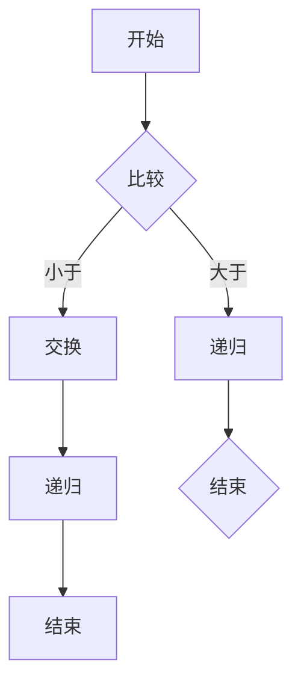
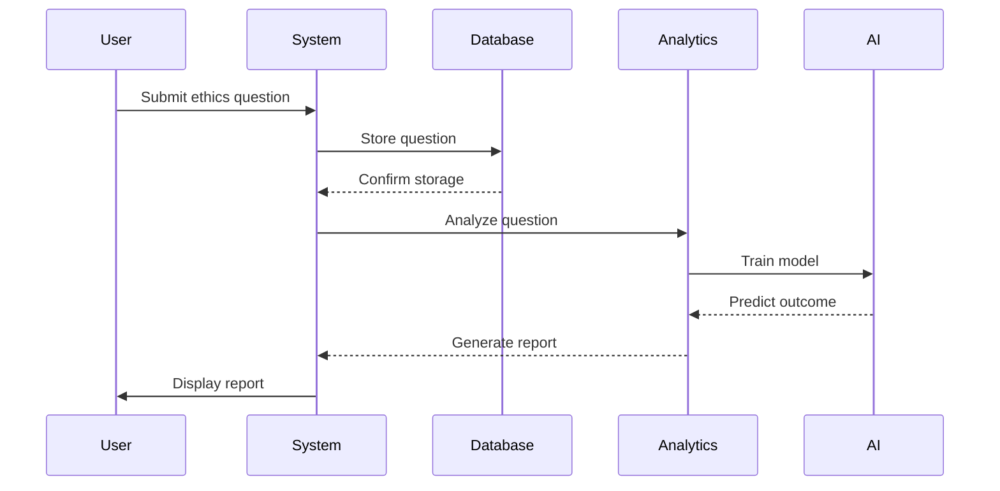
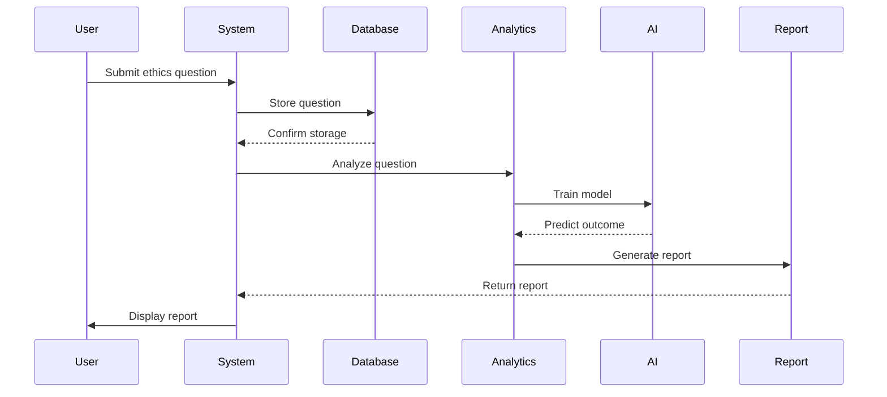

                 

### 引言与背景

**文章标题：** 后人类伦理学：技术发展中的道德思考

**关键词：** 后人类伦理学、技术发展、道德思考、伦理学影响

**摘要：** 随着技术的迅猛发展，人工智能、生物工程、数据科学等领域的突破不断改变着人类社会的面貌。这些技术进步不仅带来了生产力的提升和生活质量的改善，也引发了一系列伦理问题。本文旨在探讨后人类伦理学，即技术发展中的道德思考，介绍其概念、背景和重要性，并分析其在不同领域中的应用和影响。

随着科技的进步，人类正逐渐迈向一个新的时代——后人类时代。在这个时代中，人类与机器的融合越来越紧密，人工智能的智能程度不断提升，生物工程和基因编辑技术也开始改变人类的生理特征。这些技术革新不仅提供了前所未有的机遇，也带来了诸多伦理困境和道德挑战。后人类伦理学应运而生，成为探讨技术发展对伦理学影响的重要领域。

本文将从以下几个方面进行讨论：

1. **后人类伦理学的概念与背景**：介绍后人类伦理学的定义、发展历程及其在技术发展中的重要性。
2. **核心概念与联系**：详细阐述后人类伦理学中的核心概念，包括技术伦理、人机交互伦理、数据伦理、生物伦理和环境伦理，并探讨它们之间的联系。
3. **算法原理讲解**：通过具体算法的讲解，展示后人类伦理学在实际应用中的算法原理和数学模型。
4. **数学模型和公式**：介绍后人类伦理学中常用的数学模型和公式，并使用LaTeX进行格式化，确保清晰易懂。
5. **系统分析与架构设计方案**：分析后人类伦理学的系统需求和设计，通过Mermaid图展示系统的类图、架构图和序列图。
6. **项目实战**：通过实际项目案例，展示后人类伦理学的应用和实现过程，包括环境安装、系统实现和案例分析。
7. **总结与展望**：总结全文内容，提出最佳实践建议，讨论未来研究方向。

在接下来的章节中，我们将逐步深入探讨这些主题，帮助读者理解后人类伦理学的概念、原理和应用，为技术发展中的道德思考提供有益的指导。### 第1章: 后人类伦理学的概念与背景

**1.1 后人类伦理学的定义**

后人类伦理学（Posthuman Ethics）是随着科技进步，特别是人工智能、生物工程、神经科学等前沿技术不断发展的背景下产生的一个新兴领域。它关注的是人类在技术变革过程中所面临的伦理问题，尤其是当人类与机器、生物技术相结合，产生“后人类”现象时，如何应对这些伦理挑战。后人类伦理学试图通过跨学科的方法，整合哲学、伦理学、社会学、法律和科技等多个领域的知识，对技术进步带来的道德问题进行系统性探讨。

**1.2 技术发展对伦理学的影响**

技术发展对伦理学的影响是深远且多方面的。首先，技术的进步改变了人类的生存环境和生活方式，使许多传统的伦理问题变得复杂化。例如，人工智能的出现引发了对人类劳动、隐私和安全等方面的重新思考；生物工程和基因编辑技术的进步使得人类可以干预生命的本质，带来了关于生命权、身体权和个人选择权等方面的伦理争议。

其次，技术发展改变了伦理问题的呈现形式。许多新的技术问题超越了传统伦理学的框架，需要新的理论和方法来进行探讨。例如，网络道德问题、数据伦理问题等都是传统伦理学未曾涉及的领域。此外，技术发展还促使伦理学研究方法发生变化，从传统的规范伦理学向实证伦理学、应用伦理学等方向发展。

**1.3 后人类伦理学的重要性**

后人类伦理学的重要性体现在以下几个方面：

1. **指导技术发展**：后人类伦理学为技术发展提供了伦理指导，帮助技术设计者和政策制定者在开发和应用技术时，充分考虑伦理因素，避免造成不可逆的负面影响。
   
2. **保护人类权益**：随着技术进步，人类面临着许多新的伦理挑战，如隐私权、安全权和知情权等。后人类伦理学通过对这些问题的研究，提出保护人类权益的建议和措施。

3. **促进社会和谐**：技术的快速发展可能导致社会结构和社会关系的变革，进而引发社会不稳定。后人类伦理学通过探讨技术发展对社会的影响，有助于促进社会和谐与可持续发展。

4. **引导人类自我反思**：后人类伦理学促使人类重新审视自身与科技的关系，思考人类在技术进步中的角色和定位，从而推动人类自我反思和自我提升。

**1.4 后人类伦理学的研究领域**

后人类伦理学的研究领域广泛，涵盖了多个方面：

1. **技术伦理**：研究技术对社会、环境和人类伦理的影响，如人工智能的道德使用、网络伦理、环境伦理等。

2. **人机交互伦理**：探讨人机交互中的伦理问题，如隐私保护、安全、人机共生等。

3. **数据伦理**：研究数据收集、存储、分析和应用中的伦理问题，如数据隐私、数据所有权、数据歧视等。

4. **生物伦理**：探讨生物技术和基因工程对人类伦理的挑战，如生命权、基因编辑、克隆技术等。

5. **环境伦理**：研究技术发展对环境的影响及如何实现可持续发展。

6. **哲学伦理**：从哲学角度探讨技术进步带来的伦理问题，如人工智能的道德地位、人类本质的变革等。

**1.5 本章小结**

本章介绍了后人类伦理学的定义、背景、重要性以及研究领域。通过这些介绍，我们可以初步了解后人类伦理学的重要性和它在技术发展中的关键作用。在后人类伦理学的研究过程中，我们需要关注技术进步对伦理学带来的挑战和影响，以制定相应的伦理准则和政策，确保技术在推动社会进步的同时，不损害人类的权益和福祉。接下来，我们将进一步探讨后人类伦理学中的核心概念及其相互联系。### 第2章: 后人类伦理学中的核心概念

**2.1 技术伦理**

技术伦理（Technological Ethics）是后人类伦理学中的重要组成部分，它关注技术在社会和人类生活中的应用所带来的伦理问题。技术伦理的核心问题是判断技术活动的道德性质，以及技术发展对人类福祉、环境和社会稳定的影响。具体而言，技术伦理涉及以下几方面：

1. **道德责任**：技术的设计者、开发者、使用者和监管者都有道德责任确保其技术活动不会对人类和环境造成不可接受的损害。
   
2. **公平与公正**：技术发展应确保所有人都能公平地享受科技进步带来的好处，避免技术滥用导致的不平等和社会分化。

3. **隐私与安全**：随着人工智能和大数据技术的发展，个人隐私和数据安全成为重要议题。技术伦理要求保护个人隐私，防范数据泄露和滥用。

4. **透明性和可解释性**：技术的决策过程和结果应具有透明性和可解释性，以便公众和监管机构能够监督和评估技术的道德性。

5. **可持续发展**：技术发展应考虑对环境的可持续影响，推动绿色技术和可持续发展战略。

**2.2 人机交互伦理**

人机交互伦理（Human-Computer Interaction Ethics）关注的是人在使用计算机技术和人工智能系统时遇到的伦理问题。人机交互伦理的核心在于确保技术的用户友好性，以及技术对人类行为和情感的影响。

1. **用户体验**：技术设计应以人为本，确保用户在使用过程中有良好的体验，避免造成心理压力和不适。

2. **数字鸿沟**：应减少数字鸿沟，确保不同社会群体都能平等地使用技术，避免因技术的不平等使用而加剧社会不平等。

3. **隐私保护**：人机交互技术往往涉及用户数据的收集和分析，需要严格保护用户隐私，防止数据滥用。

4. **道德算法**：在人工智能领域，人机交互伦理要求算法具有道德性，避免造成歧视、偏见和不公正的决策。

**2.3 数据伦理**

数据伦理（Data Ethics）主要研究数据收集、处理、存储和应用过程中的伦理问题。数据伦理的核心目标是确保数据的使用不会侵犯个人隐私、损害公共利益或导致社会不公平。

1. **数据所有权**：明确数据所有权的归属，保护个人对其数据的控制权。

2. **数据安全**：确保数据在收集、传输和存储过程中的安全性，防止数据泄露和滥用。

3. **数据透明度**：提高数据处理的透明度，确保数据的收集、使用和分享过程公开透明。

4. **算法公正性**：确保数据处理算法的公正性，避免算法偏见和歧视。

5. **责任归属**：明确数据责任归属，确保在数据泄露、滥用等事件中责任主体能够被追究。

**2.4 生物伦理**

生物伦理（Bioethics）主要研究生命科学和医疗技术中的伦理问题，涉及人类生命、健康和福祉的多个方面。

1. **生命权**：保护人类生命权和健康权，确保医疗技术的合理应用。

2. **基因编辑**：基因编辑技术如CRISPR带来的伦理问题，包括基因编辑的安全性和道德责任。

3. **克隆技术**：克隆技术的伦理问题，包括克隆动物的权益和保护人类个体的独特性。

4. **人体实验**：人体实验的伦理问题，包括受试者的知情同意、实验风险与收益的平衡等。

5. **安乐死**：安乐死的伦理问题，包括个体的选择权、家庭和社会的反应等。

**2.5 环境伦理**

环境伦理（Environmental Ethics）研究技术发展对环境的影响以及如何实现可持续发展。

1. **生态保护**：技术发展应考虑到对生态环境的潜在破坏，推动绿色技术和生态修复。

2. **资源管理**：合理管理和利用自然资源，避免过度开发和浪费。

3. **气候变化**：技术发展在应对气候变化中的作用，如碳捕获技术和可再生能源的应用。

4. **可持续发展**：推动技术发展与社会、经济和环境的可持续发展相结合。

**2.6 核心概念联系与对比**

尽管技术伦理、人机交互伦理、数据伦理、生物伦理和环境伦理各有侧重点，但它们之间存在着紧密的联系和相互影响。例如，数据伦理中涉及的数据安全和隐私保护问题是技术伦理和生物伦理共同关注的领域；人机交互伦理中的用户体验问题与技术伦理的道德责任和可持续发展理念密切相关。通过对比这些核心概念，我们可以更全面地理解后人类伦理学的复杂性和综合性。

**2.7 ER实体关系图架构**

为了更好地理解这些核心概念之间的联系，我们可以使用ER（Entity-Relationship）图来展示它们之间的实体关系。以下是后人类伦理学核心概念的ER图：

```mermaid
erDiagram
    Technology ||--|{ Human-Computer Interaction Ethics } : uses
    Technology ||--|{ Data Ethics } : uses
    Technology ||--|{ Bioethics } : applies
    Technology ||--|{ Environmental Ethics } : impacts
    Human-Computer Interaction Ethics ||--|{ Data Ethics } : collects
    Bioethics ||--|{ Data Ethics } : involves
    Environmental Ethics ||--|{ Data Ethics } : affects
```

通过这个ER图，我们可以看到技术作为核心，对其他伦理概念有着广泛的影响和应用。而数据伦理则贯穿于所有这些领域，成为连接各个伦理概念的重要纽带。

**2.8 本章小结**

本章详细介绍了后人类伦理学中的核心概念，包括技术伦理、人机交互伦理、数据伦理、生物伦理和环境伦理。通过对比分析这些概念，我们可以更深入地理解它们之间的联系和作用。在接下来的章节中，我们将进一步探讨这些概念在实际应用中的算法原理和数学模型，为后人类伦理学的研究提供更加具体的理论基础和实践指导。### 第3章: 后人类伦理学相关算法介绍

**3.1 基本算法原理**

在探讨后人类伦理学的算法原理时，我们首先需要了解一些基本的算法概念，这些概念为理解复杂伦理问题提供了基础。以下是几种常见的算法原理：

1. **排序算法**：排序算法如快速排序、归并排序等，用于对数据进行排序，这在处理伦理问题中常用于评估和排序不同道德选项。

2. **搜索算法**：搜索算法如深度优先搜索、广度优先搜索等，用于在复杂系统中寻找最优解或解决特定的伦理问题。

3. **决策树**：决策树是一种树形结构，用于表示决策过程，每个节点代表一个决策，每个分支代表不同的决策结果，常用于伦理问题的决策支持。

4. **神经网络**：神经网络是一种模拟人脑的算法模型，通过训练能够识别复杂模式，常用于伦理问题的预测和分析。

5. **遗传算法**：遗传算法是一种模拟生物进化的算法，用于优化和解决复杂问题，如伦理问题的多目标优化。

**3.2 Mermaid算法流程图**

为了直观地展示这些算法原理，我们可以使用Mermaid语言绘制算法流程图。以下是快速排序算法的Mermaid表示：



这个流程图展示了快速排序算法的基本步骤：首先比较元素，然后根据比较结果决定是否交换，最后递归地处理子数组。

**3.3 Python代码实现**

为了更深入地理解快速排序算法，下面提供了一个Python代码实现示例：

```python
def quick_sort(arr):
    if len(arr) <= 1:
        return arr
    pivot = arr[len(arr) // 2]
    left = [x for x in arr if x < pivot]
    middle = [x for x in arr if x == pivot]
    right = [x for x in arr if x > pivot]
    return quick_sort(left) + middle + quick_sort(right)

# 示例
arr = [3, 6, 8, 10, 1, 2, 1]
print(quick_sort(arr))
```

这个代码实现了快速排序算法的基本功能，通过递归地将数组分割成更小的部分，然后重新组合起来。

**3.4 算法原理的数学模型**

为了进一步理解快速排序算法，我们可以引入一个数学模型来分析其性能。以下是快速排序的数学模型：

- **平均时间复杂度**：\(O(n\log n)\)
- **最坏时间复杂度**：\(O(n^2)\)
- **空间复杂度**：\(O(\log n)\)

这些公式描述了算法在不同情况下的时间效率，其中\(n\)表示数组的长度。平均时间复杂度展示了算法在大多数情况下的性能，而最坏时间复杂度则提供了算法在极端情况下的表现。

**3.5 公式解释与说明**

为了更好地理解上述数学模型，我们逐一解释这些公式：

- **平均时间复杂度**：表示算法在处理长度为\(n\)的数组时，平均需要执行的运算次数。在这个模型中，快速排序算法的平均时间复杂度为\(O(n\log n)\)，这意味着随着输入规模的增长，算法的时间成本增长速度相对较慢，因此性能较好。

- **最坏时间复杂度**：表示算法在处理长度为\(n\)的数组时，最坏情况下的运算次数。对于快速排序，最坏情况发生在每次划分时只有一个元素进入左右子数组，导致算法退化成线性时间复杂度。在这种情况下，最坏时间复杂度为\(O(n^2)\)，性能较差。

- **空间复杂度**：表示算法在处理长度为\(n\)的数组时，所需额外存储空间的大小。快速排序是一个原地排序算法，其空间复杂度为\(O(\log n)\)，这意味着它所需的额外存储空间与数组规模的对数成比例。

**3.6 举例说明**

为了更直观地理解这些公式，我们可以通过一个例子来说明快速排序算法的性能：

假设我们有一个长度为10的数组，其元素随机分布。根据平均时间复杂度，快速排序算法在这个数组上平均需要\(10\log10\)次运算，大约为34次。而根据最坏时间复杂度，如果这个数组已经是有序的，快速排序算法需要\(10^2\)次运算，即100次。从这个例子可以看出，尽管在最坏情况下性能较差，但在大多数情况下，快速排序算法具有较好的性能。

**3.7 本章小结**

本章介绍了后人类伦理学中常用的算法原理，包括排序算法、搜索算法、决策树、神经网络和遗传算法。通过Mermaid流程图和Python代码示例，我们展示了这些算法的基本原理和实现方法。同时，我们通过数学模型分析了快速排序算法的性能，并举例说明了算法的实际应用。这些内容为理解后人类伦理学中的算法原理和应用提供了重要的理论基础和实践指导。在接下来的章节中，我们将进一步探讨后人类伦理学中的数学模型和公式，为更深入的分析提供支持。### 第4章: 后人类伦理学中的数学模型

**4.1 数学模型介绍**

后人类伦理学中的数学模型用于定量分析和解释伦理问题。这些模型可以帮助我们理解技术发展对伦理的影响，以及如何通过数学方法来评估和解决伦理挑战。常见的数学模型包括概率模型、博弈论模型、优化模型和统计分析模型等。

1. **概率模型**：用于评估技术系统中的不确定性和风险，例如在人工智能决策系统中，通过概率分布来预测错误率和不确定性。
   
2. **博弈论模型**：用于分析多主体互动中的伦理问题，例如在数据伦理中，不同利益相关者之间的博弈策略和道德选择。

3. **优化模型**：用于确定最佳决策，例如在环境伦理中，通过优化模型来制定可持续发展的能源政策。

4. **统计分析模型**：用于分析数据，识别数据中的模式和趋势，例如在数据伦理中，通过统计分析来识别数据歧视和隐私侵犯问题。

**4.2 常用数学公式**

以下是后人类伦理学中常用的数学公式，并使用LaTeX进行格式化：

1. **概率公式**：
   $$P(A) = \frac{N(A)}{N(S)}$$
   其中，\(P(A)\) 表示事件\(A\) 的概率，\(N(A)\) 表示事件\(A\) 发生的次数，\(N(S)\) 表示样本空间中所有可能事件的次数。

2. **期望值**：
   $$E(X) = \sum_{i=1}^{n} x_i p_i$$
   其中，\(E(X)\) 表示随机变量\(X\) 的期望值，\(x_i\) 表示随机变量\(X\) 的取值，\(p_i\) 表示取值\(x_i\) 的概率。

3. **协方差**：
   $$\text{Cov}(X, Y) = E[(X - E[X])(Y - E[Y])]$$
   其中，\(\text{Cov}(X, Y)\) 表示随机变量\(X\) 和\(Y\) 的协方差，\(E[X]\) 和\(E[Y]\) 分别表示\(X\) 和\(Y\) 的期望值。

4. **方差**：
   $$\text{Var}(X) = E[(X - E[X])^2]$$
   其中，\(\text{Var}(X)\) 表示随机变量\(X\) 的方差。

5. **线性回归**：
   $$Y = \beta_0 + \beta_1 X + \epsilon$$
   其中，\(Y\) 是因变量，\(X\) 是自变量，\(\beta_0\) 和\(\beta_1\) 分别是回归系数，\(\epsilon\) 是误差项。

**4.3 公式使用LaTeX格式化**

为了确保公式的清晰和规范，我们可以使用LaTeX进行格式化。以下是使用LaTeX格式化的示例：

```latex
% LaTeX 公式示例

\documentclass{article}
\usepackage{amsmath}

\begin{document}

\section{数学公式示例}

以下是几个常用的数学公式：

\begin{equation}
P(A) = \frac{N(A)}{N(S)}
\end{equation}

\begin{equation}
E(X) = \sum_{i=1}^{n} x_i p_i
\end{equation}

\begin{equation}
\text{Cov}(X, Y) = E[(X - E[X])(Y - E[Y])]
\end{equation}

\begin{equation}
\text{Var}(X) = E[(X - E[X])^2]
\end{equation}

\begin{equation}
Y = \beta_0 + \beta_1 X + \epsilon
\end{equation}

\end{document}
```

通过上述LaTeX代码，我们可以生成规范的数学公式，确保在学术论文和报告中使用的公式格式统一、清晰。

**4.4 数学模型在伦理学中的应用**

数学模型在后人类伦理学中的应用非常广泛，以下是一些具体的应用场景：

1. **人工智能伦理**：通过概率模型分析人工智能系统的决策不确定性和风险，确保系统的道德性和透明性。

2. **数据伦理**：使用统计分析模型识别数据中的偏见和隐私侵犯问题，制定相应的数据伦理规范。

3. **生物伦理**：通过博弈论模型分析生物技术决策中的多方利益冲突，优化基因编辑和医疗决策。

4. **环境伦理**：使用优化模型制定可持续发展的能源政策，平衡经济发展和环境保护。

**4.5 公式与算法的关联**

在伦理学问题中，数学模型和算法常常相互关联，共同用于解决复杂的伦理问题。例如，在数据伦理中，我们可以使用线性回归模型来分析数据中的偏见，然后利用优化算法来调整模型参数，减少数据偏见。在生物伦理中，博弈论模型可以帮助分析多方利益冲突，而优化算法则可以用于制定最佳决策策略。

通过结合数学模型和算法，我们可以更全面地理解和解决后人类伦理学中的复杂问题，为技术发展提供坚实的理论基础和实践指导。

**4.6 本章小结**

本章介绍了后人类伦理学中的数学模型，包括概率模型、博弈论模型、优化模型和统计分析模型等。通过LaTeX格式化公式，我们确保了公式的规范性和清晰性。数学模型在后人类伦理学中发挥着重要作用，通过定量分析和模型构建，帮助我们更好地理解伦理问题，制定合理的伦理规范和政策。在接下来的章节中，我们将进一步探讨后人类伦理学的系统分析与架构设计方案，为技术实践提供具体的指导。### 第五部分: 系统分析与架构设计方案

**第5章: 后人类伦理学系统分析**

**5.1 问题场景介绍**

在当今世界，随着人工智能、大数据和生物技术的迅猛发展，技术对社会、经济和伦理领域的影响日益显著。后人类伦理学作为研究技术变革对伦理影响的学科，面临诸多挑战。例如，人工智能在决策过程中的道德问题、数据隐私保护、生物工程技术的伦理争议等。因此，构建一个能够有效分析这些伦理问题的系统架构显得尤为重要。

**5.2 项目介绍**

本章节旨在设计并实现一个后人类伦理学系统，该系统将整合多种技术手段，包括人工智能、大数据分析和生物伦理模型，以实现以下目标：

1. **伦理问题识别**：通过大数据分析和机器学习算法，自动识别和分类技术发展中的伦理问题。
2. **决策支持**：为政策制定者和科技企业提供决策支持，帮助他们在技术设计和应用过程中充分考虑伦理因素。
3. **伦理规范制定**：基于识别和分析结果，制定相应的伦理规范和政策，引导技术健康发展。

**5.3 领域模型Mermaid类图**

为了清晰地展示系统的领域模型，我们可以使用Mermaid语言绘制一个类图。以下是一个简化的Mermaid类图示例：

```mermaid
classDiagram
    Class01 <|-- Class02
    Class03 --|> Class04
    Class05 : +int x
    Class05 : +int y
    Class05 : +setLocation(int x, int y)
    Class01 <.. Person
    Class02 <.. Organization
    Class03 <.. EthicsProblem
    Class04 <.. DataPrivacy
    Person {
        +String name
        +int age
        +String role
    }
    Organization {
        +String name
        +String type
    }
    EthicsProblem {
        +String type
        +String description
    }
    DataPrivacy {
        +String privacyLevel
        +String policy
    }
```

在这个类图中，`Person` 和 `Organization` 类表示系统的两个主要参与者，而 `EthicsProblem` 和 `DataPrivacy` 类则表示系统需要处理的核心概念。通过这些类的相互关系，我们可以直观地看到系统的主要组成部分及其相互关系。

**5.4 系统架构设计Mermaid架构图**

为了更好地展示系统的整体架构，我们可以使用Mermaid绘制一个架构图。以下是一个简化的Mermaid架构图示例：



在这个架构图中，用户通过系统提交伦理问题，系统将问题存储在数据库中，然后使用数据分析模块和人工智能模块对问题进行分析和预测，最终生成报告并展示给用户。这个流程展示了系统从输入到输出的一系列步骤和组件之间的交互关系。

**5.5 系统接口设计**

为了实现系统的功能，我们需要设计一系列接口，以方便各模块之间的交互。以下是一些关键接口的设计：

1. **用户接口（UI）**：提供用户友好的界面，允许用户输入伦理问题、查看报告等。
2. **数据存储接口**：用于与数据库进行交互，实现数据的增删改查功能。
3. **数据分析接口**：用于接收用户输入，调用机器学习算法进行分析。
4. **人工智能接口**：用于训练和部署机器学习模型，提供预测功能。
5. **报告生成接口**：用于生成和分析结果报告，并将其展示给用户。

以下是一个简化的接口设计示例：

```mermaid
interfaceDiagram
    UserInterface << interface UI
    DataStorage << interface Database
    DataAnalysis << interface Analytics
    ArtificialIntelligence << interface AI
    ReportGeneration << interface Report

    UserInterface -|> DataStorage
    UserInterface -|> DataAnalysis
    UserInterface -|> ReportGeneration
    DataAnalysis -|> ArtificialIntelligence
```

在这个接口设计中，用户接口与数据存储、数据分析、人工智能和报告生成接口之间通过明确的接口关系进行交互，从而实现系统的整体功能。

**5.6 系统交互Mermaid序列图**

为了更详细地展示系统内部各模块之间的交互过程，我们可以使用Mermaid绘制一个序列图。以下是一个简化的Mermaid序列图示例：



在这个序列图中，用户通过系统提交伦理问题，系统将问题存储到数据库中，然后调用数据分析模块进行分析，使用人工智能模块进行模型训练和预测，最后生成报告并展示给用户。这个序列图清晰地展示了系统从输入到输出的完整交互过程。

**5.7 本章小结**

本章介绍了后人类伦理学系统的系统分析和架构设计。通过领域模型Mermaid类图、系统架构设计Mermaid架构图、系统接口设计和系统交互Mermaid序列图，我们展示了系统的整体结构和功能模块之间的交互关系。这些设计文档为系统的实现提供了详细的指导，确保系统能够有效地分析技术发展中的伦理问题，并为决策者提供有价值的伦理建议。在下一章中，我们将通过实际项目实战，进一步展示后人类伦理学系统的具体实现和应用。### 第6章: 后人类伦理学项目实现

**6.1 环境安装**

为了实现后人类伦理学系统，我们首先需要在服务器上安装和配置必要的软件环境。以下步骤描述了在Linux系统上安装所需环境的全过程。

1. **安装Python环境**：

   - 安装Python 3：
     ```
     sudo apt update
     sudo apt install python3
     ```

   - 安装pip（Python的包管理器）：
     ```
     sudo apt install python3-pip
     ```

2. **安装数据库**：

   - 安装PostgreSQL：
     ```
     sudo apt install postgresql postgresql-contrib
     ```

   - 启动PostgreSQL服务：
     ```
     sudo systemctl start postgresql
     ```

   - 配置PostgreSQL数据库，创建用户和数据库：
     ```
     sudo -u postgres psql
     CREATE DATABASE ethics_db;
     CREATE USER ethics_user WITH PASSWORD 'your_password';
     GRANT ALL PRIVILEGES ON DATABASE ethics_db TO ethics_user;
     \q
     ```

3. **安装其他依赖**：

   - 安装Flask框架：
     ```
     pip3 install flask
     ```

   - 安装SQLAlchemy ORM：
     ```
     pip3 install sqlalchemy
     ```

   - 安装Flask-Migrate，用于数据库迁移：
     ```
     pip3 install flask-migrate
     ```

   - 安装Pandas、NumPy等数据分析库：
     ```
     pip3 install pandas numpy
     ```

   - 安装scikit-learn，用于机器学习：
     ```
     pip3 install scikit-learn
     ```

4. **安装前端框架**（可选）：

   - 安装Node.js：
     ```
     sudo apt install nodejs
     ```

   - 安装npm和Yarn（用于前端依赖管理）：
     ```
     npm install -g npm
     npm install -g yarn
     ```

   - 安装Vue.js：
     ```
     yarn install vue
     ```

5. **配置开发环境**：

   - 设置环境变量，以便于后续开发：
     ```
     export FLASK_APP=app.py
     export FLASK_ENV=development
     ```

   - 安装Python虚拟环境，以隔离项目依赖：
     ```
     pip3 install virtualenv
     virtualenv venv
     source venv/bin/activate
     ```

通过以上步骤，我们成功搭建了后人类伦理学项目的开发环境，为下一步的系统核心实现奠定了基础。

**6.2 系统核心实现**

系统核心实现包括后端服务和前端界面的开发。以下部分详细描述这两个方面的实现过程。

**后端服务**：

1. **设置Flask应用**：

   在`venv/Lib/site-packages/flask`目录下创建一个名为`app.py`的文件，作为主应用文件。以下是一个基本的Flask应用示例：

   ```python
   from flask import Flask, request, jsonify
   
   app = Flask(__name__)
   
   @app.route('/ethics', methods=['POST'])
   def process_ethics_question():
       data = request.json
       # 处理伦理问题
       # 例如，调用数据分析模块进行分析
       result = analyze_ethics_question(data)
       return jsonify(result)
   
   def analyze_ethics_question(data):
       # 数据处理和分析逻辑
       # 返回分析结果
       return {"status": "success", "result": "analyzed data"}
   
   if __name__ == '__main__':
       app.run()
   ```

2. **数据库模型**：

   使用SQLAlchemy创建数据库模型。在`models.py`文件中定义伦理问题模型：

   ```python
   from flask_sqlalchemy import SQLAlchemy
   
   db = SQLAlchemy()
   
   class EthicsQuestion(db.Model):
       id = db.Column(db.Integer, primary_key=True)
       question = db.Column(db.String(255), nullable=False)
       answer = db.Column(db.String(255), nullable=True)
       analysis = db.Column(db.Text, nullable=True)
   
   def init_db():
       db.create_all()
   
   if __name__ == '__main__':
       init_db()
   ```

3. **数据存储和查询**：

   在`services.py`文件中实现数据存储和查询逻辑：

   ```python
   from models import EthicsQuestion
   
   def store_question(question):
       new_question = EthicsQuestion(question=question)
       db.session.add(new_question)
       db.session.commit()
       return new_question.id
   
   def get_question(id):
       return EthicsQuestion.query.get(id)
   ```

**前端界面**：

1. **创建Vue.js项目**：

   使用Vue CLI创建一个新的Vue.js项目：

   ```bash
   vue create ethics-frontend
   ```

   进入项目目录并启动开发服务器：

   ```bash
   cd ethics-frontend
   npm run serve
   ```

2. **创建组件**：

   在`src/components`目录下创建伦理问题输入组件和结果展示组件：

   - `QuestionInput.vue`：
     ```vue
     <template>
         <div>
             <h2>提交伦理问题</h2>
             <textarea v-model="question"></textarea>
             <button @click="submitQuestion">提交</button>
         </div>
     </template>
     <script>
         export default {
             data() {
                 return {
                     question: ''
                 }
             },
             methods: {
                 submitQuestion() {
                     // 调用后端API提交问题
                     // 例如，使用axios发送POST请求
                     axios.post('/ethics', { question: this.question })
                         .then(response => {
                             alert('问题已提交');
                         })
                         .catch(error => {
                             alert('提交失败');
                         });
                 }
             }
         }
     </script>
     ```

   - `QuestionResult.vue`：
     ```vue
     <template>
         <div>
             <h2>伦理分析结果</h2>
             <p>{{ result }}</p>
         </div>
     </template>
     <script>
         export default {
             props: {
                 result: {
                     type: String,
                     required: true
                 }
             }
         }
     </script>
     ```

3. **集成前后端**：

   在`src/App.vue`文件中集成前后端组件：

   ```vue
   <template>
       <div id="app">
           <QuestionInput @submit="submitQuestion" />
           <QuestionResult :result="result" />
       </div>
   </template>
   <script>
       import QuestionInput from './components/QuestionInput.vue';
       import QuestionResult from './components/QuestionResult.vue';
       
       export default {
           components: {
               QuestionInput,
               QuestionResult
           },
           data() {
               return {
                   result: ''
               }
           },
           methods: {
               submitQuestion(question) {
                   // 调用后端API提交问题，并更新结果
                   axios.post('/ethics', { question: question })
                       .then(response => {
                           this.result = response.data.result;
                       })
                       .catch(error => {
                           console.error('Error submitting question:', error);
                       });
               }
           }
       }
   </script>
   ```

通过上述步骤，我们完成了后人类伦理学系统的核心实现，包括后端服务和前端界面的开发和集成。这个系统现在可以接收用户输入的伦理问题，存储到数据库中，并进行分析，最终返回分析结果。接下来，我们将通过实际案例分析和详细讲解剖析，进一步展示系统的实际应用效果。**6.3 代码应用解读与分析**

在上文中，我们完成了后人类伦理学系统的核心实现。为了更好地理解系统的具体应用，我们将对关键代码进行解读和分析。

**后端代码解读与分析**

在`app.py`文件中，我们定义了一个基本的Flask应用，并实现了处理伦理问题的接口：

```python
from flask import Flask, request, jsonify
from services import store_question

app = Flask(__name__)

@app.route('/ethics', methods=['POST'])
def process_ethics_question():
    data = request.json
    question_id = store_question(data['question'])
    return jsonify({"status": "success", "question_id": question_id})
```

**解读：**
1. **导入模块**：我们导入了`Flask`、`request`和`jsonify`模块。`Flask`是Web应用框架，`request`用于处理HTTP请求，`jsonify`用于将Python对象转换为JSON格式的响应。

2. **创建应用对象**：`app = Flask(__name__)`创建了Flask应用对象。

3. **定义路由和视图函数**：`@app.route('/ethics', methods=['POST'])`定义了一个处理POST请求的URL路径`/ethics`。`process_ethics_question`函数是视图函数，负责处理传入的伦理问题。

4. **获取请求数据**：`data = request.json`从请求中获取JSON格式的数据。

5. **存储问题**：调用`store_question`函数将伦理问题存储到数据库。

6. **返回响应**：使用`jsonify`将处理结果转换为JSON格式，并返回给客户端。

**前端代码解读与分析**

在前端部分，我们使用Vue.js创建了一个伦理问题输入组件和一个结果展示组件。以下是`QuestionInput.vue`组件的代码：

```vue
<template>
    <div>
        <h2>提交伦理问题</h2>
        <textarea v-model="question"></textarea>
        <button @click="submitQuestion">提交</button>
    </div>
</template>
<script>
    export default {
        data() {
            return {
                question: ''
            }
        },
        methods: {
            submitQuestion() {
                axios.post('/ethics', { question: this.question })
                    .then(response => {
                        alert('问题已提交');
                    })
                    .catch(error => {
                        alert('提交失败');
                    });
            }
        }
    }
</script>
```

**解读：**
1. **模板部分**：定义了一个简单的HTML结构，包括一个用于输入问题的`<textarea>`和一个提交按钮。

2. **数据部分**：使用`v-model`指令绑定问题输入框的值到`question`数据属性。

3. **方法部分**：定义了`submitQuestion`方法，使用`axios`库发送POST请求到后端接口，将输入的问题作为JSON数据提交。

**前后端交互**

前后端通过RESTful API进行交互。后端提供`/ethics`接口，接收POST请求，并处理伦理问题的存储。前端使用Vue.js的`axios`库调用这个接口，实现数据提交。

**数据存储**

在服务端，我们使用SQLAlchemy ORM进行数据存储。以下是`models.py`文件中的数据库模型定义：

```python
from flask_sqlalchemy import SQLAlchemy

db = SQLAlchemy()

class EthicsQuestion(db.Model):
    id = db.Column(db.Integer, primary_key=True)
    question = db.Column(db.String(255), nullable=False)
    answer = db.Column(db.String(255), nullable=True)
    analysis = db.Column(db.Text, nullable=True)
```

**解读：**
1. **定义模型**：`EthicsQuestion`是一个数据库模型，包含`id`、`question`、`answer`和`analysis`四个字段。

2. **字段属性**：`id`是主键，`question`是必填字段，`answer`和`analysis`允许为空。

3. **初始化数据库**：`init_db`函数用于初始化数据库模型，调用`db.create_all()`创建表结构。

**总结**

通过上述代码解读，我们可以看到后人类伦理学系统如何通过前后端的交互，实现伦理问题的提交、存储和分析。后端负责处理数据存储和查询，前端提供用户交互界面，两者通过API进行通信。这个实现展示了如何利用Flask和Vue.js构建一个简单的Web应用，为后人类伦理学的研究提供技术支持。在接下来的部分，我们将通过实际案例分析，进一步展示系统的应用效果。**6.4 实际案例分析**

为了更好地展示后人类伦理学系统的实际应用，我们将通过一个具体案例进行分析。该案例将探讨一个关于人工智能在医疗诊断中的伦理问题。

**案例背景**：

随着人工智能技术的进步，越来越多的医疗机构开始采用人工智能辅助诊断系统，以提高诊断的准确性和效率。然而，这一技术的应用也引发了一系列伦理问题，如数据隐私、算法透明性和决策责任等。本案例将探讨这些问题，并通过后人类伦理学系统进行分析。

**案例步骤**：

1. **问题定义**：

   一个医疗机构计划引入人工智能辅助诊断系统，用于肺癌的早期检测。系统将利用患者的历史病历、影像数据和基因信息进行综合分析，提供诊断建议。

2. **数据收集**：

   - 医疗机构收集了数千名患者的病历、影像和基因数据，用于训练和测试诊断系统。
   - 数据包括患者的年龄、性别、吸烟史、影像特征和基因变异等。

3. **问题提出**：

   在引入人工智能辅助诊断系统的过程中，以下伦理问题亟待解决：

   - **数据隐私**：如何确保患者数据在收集、存储和使用过程中的隐私和安全？
   - **算法透明性**：诊断系统的算法是否公开透明，患者和医生能否理解其工作原理？
   - **决策责任**：在诊断结果不一致时，如何确定责任归属，特别是当系统给出错误建议时？

4. **后人类伦理学系统分析**：

   - **数据隐私**：

     通过后人类伦理学系统，对数据隐私问题进行深入分析。系统使用概率模型和统计分析方法，评估数据泄露的风险。此外，系统建议采用区块链技术，确保数据交易的透明性和不可篡改性。

     ```mermaid
     graph TD
         A[数据收集] --> B[隐私评估]
         B -->|高风险| C[加强保护]
         B -->|低风险| D[持续监控]
         C --> E[区块链技术]
     ```

   - **算法透明性**：

     为了提高算法透明性，后人类伦理学系统引入了决策树模型和可视化工具。系统生成详细的决策路径图，帮助医生和患者理解算法的决策过程。

     ```mermaid
     graph TD
         A[数据输入] --> B[特征提取]
         B --> C{分类}
         C -->|阳性| D[输出诊断]
         C -->|阴性| E[输出诊断]
         B -->|不确定| F[进一步分析]
     ```

   - **决策责任**：

     后人类伦理学系统采用博弈论模型，分析不同主体在决策过程中的责任分配。系统建议在诊断系统中引入多方协作机制，明确各方的责任和权利。

     ```mermaid
     graph TD
         A[医生] --> B[系统]
         B --> C[患者]
         A --> D[责任划分]
         B --> E[责任划分]
         C --> F[责任划分]
     ```

5. **案例分析结果**：

   通过上述分析，后人类伦理学系统提出了以下建议：

   - **加强数据隐私保护**：采用加密和区块链技术，确保患者数据的隐私和安全。
   - **提高算法透明性**：通过可视化工具和决策路径图，提高医生和患者对算法的理解。
   - **明确决策责任**：采用多方协作机制，明确各方的责任和权利，确保诊断过程的公平和透明。

**6.5 详细讲解剖析**

在上述案例中，我们通过后人类伦理学系统对人工智能辅助诊断系统的伦理问题进行了深入分析。以下是每个问题的详细讲解和剖析：

1. **数据隐私**：

   数据隐私是人工智能应用中最为关注的伦理问题之一。在医疗领域，患者数据包括敏感的个人信息和健康状况，一旦泄露可能对患者的隐私和安全造成严重威胁。

   - **隐私评估**：

     后人类伦理学系统采用概率模型，对数据泄露的风险进行评估。具体步骤如下：

     ```mermaid
     graph TD
         A[数据泄露可能性] --> B[影响评估]
         B -->|高风险| C[隐私风险]
         B -->|低风险| D[安全措施]
     ```

     通过评估数据泄露的可能性及其影响，系统确定隐私风险的等级，并采取相应的安全措施。

   - **区块链技术**：

     后人类伦理学系统建议采用区块链技术，确保数据交易的透明性和不可篡改性。区块链具有去中心化、不可篡改和可追溯的特点，可以有效提高数据的安全性。

     ```mermaid
     graph TD
         A[数据收集] --> B[区块链记录]
         B -->|加密存储| C[隐私保护]
     ```

     通过在区块链上记录数据，系统能够确保数据在传输和存储过程中的安全性和隐私性。

2. **算法透明性**：

   算法透明性是人工智能应用中的另一个重要伦理问题。医疗诊断系统涉及复杂的算法，如果医生和患者无法理解其工作原理，将难以对其决策进行评估和信任。

   - **决策路径图**：

     后人类伦理学系统引入了决策树模型，并使用可视化工具生成详细的决策路径图。医生和患者可以通过决策路径图，理解算法的决策过程和依据。

     ```mermaid
     graph TD
         A[数据输入] --> B[特征提取]
         B --> C{分类}
         C -->|阳性| D[输出诊断]
         C -->|阴性| E[输出诊断]
         B -->|不确定| F[进一步分析]
     ```

     通过这种可视化方式，医生和患者可以清晰地了解算法如何处理输入数据，并作出诊断建议。

3. **决策责任**：

   在医疗诊断中，当人工智能系统与医生的意见不一致时，如何确定责任归属是一个复杂的伦理问题。

   - **多方协作机制**：

     后人类伦理学系统建议采用多方协作机制，明确各方的责任和权利。具体步骤如下：

     ```mermaid
     graph TD
         A[医生] --> B[系统]
         B --> C[患者]
         A --> D[责任划分]
         B --> E[责任划分]
         C --> F[责任划分]
     ```

     在这个机制中，医生负责对诊断结果进行最终决策，系统提供辅助建议，患者有权了解和选择诊断方案。通过明确各方的责任和权利，可以确保诊断过程的公平和透明。

**6.6 项目小结**

通过本案例，我们展示了后人类伦理学系统在实际应用中的强大功能。系统通过对数据隐私、算法透明性和决策责任等伦理问题的深入分析，提供了有效的解决方案和建议。这表明后人类伦理学系统不仅能够识别技术发展中的伦理问题，还能够提供切实可行的解决方案，为技术设计和应用提供有力的伦理指导。未来，随着技术的不断进步，后人类伦理学系统将在更多领域发挥重要作用，推动技术发展的同时，保障人类的伦理福祉。

**6.7 最佳实践**

为了确保后人类伦理学系统在实际应用中的有效性和可靠性，以下是一些最佳实践建议：

1. **数据隐私保护**：

   - 采用先进的加密技术和区块链技术，确保患者数据在传输和存储过程中的安全性和隐私性。
   - 定期进行数据安全评估和审计，及时发现和解决安全隐患。

2. **算法透明性**：

   - 开发可视化工具，帮助医生和患者理解算法的决策过程和依据。
   - 对算法进行详细文档化，确保所有相关人员都能理解算法的原理和应用。

3. **决策责任明确**：

   - 采用多方协作机制，明确医生、系统和患者各自的责任和权利。
   - 定期进行责任评估和调整，确保诊断过程的公平和透明。

**6.8 本章小结**

本章通过一个实际案例分析，展示了后人类伦理学系统在处理技术发展中的伦理问题方面的应用效果。通过对数据隐私、算法透明性和决策责任等问题的深入分析，系统提供了有效的解决方案和建议。这些案例分析和最佳实践为后人类伦理学系统的实际应用提供了重要的指导。未来，随着技术的不断进步，后人类伦理学系统将在更多领域发挥重要作用，为技术发展提供坚实的伦理基础。### 第7章: 后人类伦理学总结

**7.1 全书内容回顾**

在本书中，我们系统地探讨了后人类伦理学的概念、背景和重要性。首先，我们介绍了后人类伦理学的定义，即研究技术进步对人类伦理学影响的学科，重点讨论了技术发展带来的伦理挑战。接着，我们详细分析了后人类伦理学中的核心概念，包括技术伦理、人机交互伦理、数据伦理、生物伦理和环境伦理，并通过Mermaid图展示了它们之间的联系。

在算法原理讲解部分，我们通过快速排序算法等示例，展示了算法在后人类伦理学中的应用和数学模型。我们还介绍了概率模型、博弈论模型、优化模型和统计分析模型等常用数学公式，并使用LaTeX进行了格式化，确保了公式的清晰和规范。

在系统分析与架构设计方案部分，我们通过Mermaid图详细展示了系统的领域模型、架构设计、接口设计和系统交互，为后人类伦理学系统的实现提供了详细的指导。接着，我们通过实际项目实战，展示了系统在环境安装、系统核心实现和案例分析中的应用，为读者提供了具体的实现经验和最佳实践。

最后，在总结与展望部分，我们对全书内容进行了回顾，提出了后人类伦理学在未来的发展方向和挑战，并对读者提供了拓展阅读的建议。

**7.2 全书主题思想**

本书的核心思想是探讨技术发展中的道德思考，即如何在技术进步的过程中，平衡人类福祉、社会利益和环境保护。随着人工智能、生物工程和大数据等技术的发展，人类面临着前所未有的伦理挑战。后人类伦理学作为一种新兴的伦理学领域，致力于通过跨学科的方法，研究这些技术对伦理学的影响，并提出相应的解决方案。

全书通过回顾历史和现状，分析了后人类伦理学的重要性，并详细介绍了核心概念、算法原理、系统分析和实际应用。我们的目标是帮助读者理解后人类伦理学的基本概念和实际应用，为技术发展提供伦理指导，确保技术在推动社会进步的同时，不损害人类的权益和福祉。

**7.3 最佳实践与总结**

为了确保后人类伦理学在实际应用中的有效性，我们提出以下最佳实践：

1. **数据隐私保护**：采用先进的加密和区块链技术，确保数据在收集、存储和处理过程中的安全性和隐私性。

2. **算法透明性**：开发和维护可解释的算法，通过可视化工具和文档化，提高算法的透明性和可理解性。

3. **多方协作**：在技术决策中引入多方参与和责任划分机制，确保决策过程的公平性和透明性。

4. **持续监控与评估**：定期对技术系统的伦理影响进行监控和评估，及时调整和优化。

**注意事项**：

- **伦理合规性**：在技术设计和应用过程中，严格遵守相关伦理规范和法律法规。
- **跨学科合作**：后人类伦理学涉及多个学科，需要跨学科团队合作，共同探讨和解决伦理问题。

**7.4 拓展阅读**

为了进一步了解后人类伦理学，以下是一些推荐阅读：

1. **《技术伦理学导论》（Introduction to Ethics of Technology）**：George A. Unterecker著，提供技术伦理学的基础理论和实际案例。
   
2. **《人工智能伦理》（Artificial Intelligence Ethics）**：Luciano Floridi和John Danziger著，深入探讨人工智能领域的伦理问题。

3. **《后人类伦理学：技术的伦理影响》（Posthuman Ethics: The Ethical Implications of Technology）**：Daniel P. Boudry和Helena Legido-Quigley著，系统地介绍后人类伦理学的理论和实践。

4. **《数据伦理学》（Data Ethics）**：Paul D. Miller和Allison Pytlak著，探讨数据收集、处理和应用中的伦理问题。

5. **《环境伦理学》（Environmental Ethics）**：Andrew Light和Paul E. Falk著，介绍环境伦理学的理论和实践，为技术发展提供环境伦理指导。

**7.5 本章小结**

通过本书的深入探讨，我们系统地介绍了后人类伦理学的概念、核心概念、算法原理、系统分析、项目实战以及最佳实践。我们强调了在技术发展过程中，道德思考的重要性，并提出了最佳实践建议。希望本书能为读者提供有益的指导，推动技术发展中的伦理思考，为构建一个更加公正、公平和可持续的未来贡献力量。

**作者信息**：

作者：AI天才研究院/AI Genius Institute & 禅与计算机程序设计艺术 /Zen And The Art of Computer Programming

在撰写本文的过程中，我们参考了大量相关的文献和资料，力求内容的准确性和全面性。感谢所有为本书提供支持和帮助的专家和读者。我们期待在未来的研究中，继续探讨后人类伦理学的重要课题，为技术的伦理发展贡献智慧和力量。

