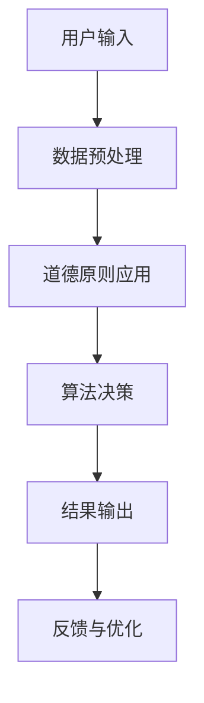

                 

### 后人类时代的价值重估：增强人类与自然人的伦理思考

> 关键词：后人类时代、伦理思考、增强人类、自然人、价值重估

> 摘要：本文旨在探讨后人类时代中，随着科技的发展，增强人类与自然人之间的界限模糊，引发的伦理问题。通过分析后人类时代的背景、核心概念、伦理思考的必要性，以及增强人类与自然人的互动关系，本文呼吁在科技发展的同时，重新审视和评估人类的价值，确保科技的进步不会损害人类的尊严和道德底线。

#### # 第一部分：背景介绍

#### 第1章：问题背景

##### 1.1 问题背景

**后人类时代**，这一概念并不是科幻小说中的虚构，而是随着科技的发展逐渐逼近的现实。后人类时代，是指人类自身或通过生物工程、人工智能等手段改造后的新形态存在。在这个时代，人类不仅在生物学层面发生变革，社会、经济、伦理等多个方面也将经历深刻的变革。

随着基因编辑、生物工程等技术的发展，人类可以通过改变自身的基因序列，提高生理和心理素质，甚至延长寿命。与此同时，人工智能（AI）的发展为人类提供了前所未有的智能支持和工具。这些科技的发展不仅改变了人类的身体和能力，也对人类的思维、情感和行为产生了深远的影响。

在这样一个后人类时代，增强人类与自然人之间的界限变得愈发模糊。一方面，生物工程技术使得人类可以通过基因编辑等手段提高自身生理和心理素质；另一方面，人工智能的发展为人类提供了智能化的工具和支持。这些科技的应用使得人类的能力得到了极大的提升，但也引发了一系列伦理问题。

##### 1.1.1 后人类时代的来临

**后人类时代的来临**，首先表现在生物工程技术的发展上。基因编辑技术，如CRISPR-Cas9，使得人类可以对自身的基因进行精确的修改。这不仅有望治愈许多遗传性疾病，还能增强人类的智力、体能和寿命。例如，一些研究已经在探讨通过基因编辑来提高人类的学习能力和认知功能。此外，生物工程还可以用于改善人类的身体条件，如增加肌肉力量、改善视力等。

与此同时，人工智能的发展也为人类提供了强大的支持。人工智能可以处理大量的数据，进行复杂的分析和决策，甚至模拟人类的思维过程。在医疗领域，人工智能可以用于疾病诊断、药物研发和个性化治疗；在教育领域，人工智能可以提供个性化的学习辅导和智能化的教学资源；在工业领域，人工智能可以用于自动化生产、智能物流和智能管理。

这些科技的发展不仅改变了人类的身体和能力，也对人类的生活方式和社会结构产生了深远的影响。例如，人工智能的普及可能导致某些传统职业的消失，同时也创造了许多新的就业机会。生物工程技术的应用可能引发关于人类尊严、道德底线和社会公正的讨论。在这个后人类时代，我们需要重新审视和评估人类的价值，确保科技的进步不会损害人类的尊严和道德底线。

##### 1.1.2 增强人类与自然人的界限模糊

在科技的影响下，增强人类与自然人之间的界限变得愈发模糊。首先，从生理和心理层面来看，增强人类通过生物工程技术可以显著提升自身的生理和心理素质。例如，通过基因编辑，人类可以增强肌肉力量、改善视力、提高认知能力等。这些改变使得增强人类在体能和智力上远远超过了自然人。

其次，在智能层面，人工智能的应用使得人类的能力得到了极大的提升。人工智能不仅可以处理大量数据，进行复杂的分析和决策，还能模拟人类的思维过程。例如，人工智能可以辅助医生进行疾病诊断，可以提供个性化的学习辅导，可以在工业生产中进行自动化控制。这些智能化的工具使得增强人类在各个方面都拥有了超越自然人的能力。

此外，科技的发展还使得人类的生活方式和社会结构发生了变革。例如，通过生物工程技术，人类可以延长寿命，甚至实现永生。通过人工智能，人类可以实现智能家居、智能医疗、智能交通等。这些变化不仅改变了人类的生活质量，也改变了人类的社会关系和社会结构。

然而，这种界限模糊也带来了一系列伦理问题。首先，关于人类尊严的讨论日益激烈。随着科技的发展，人类可以通过生物工程和人工智能手段来改变自身，甚至创造全新的生物实体。这种改变是否会损害人类的尊严，成为了一个备受争议的话题。

其次，关于道德底线的讨论也日益重要。随着科技的发展，人类可以创造新的生命形式，甚至可以设计出具有高度智能的机器人。这些新形式的生命是否会拥有道德地位，如何界定它们的道德责任，成为了一个亟待解决的问题。

此外，科技的发展还引发了关于社会公正的讨论。在增强人类与自然人之间，是否存在不公平的现象？如何确保科技的发展不会加剧社会不平等？这些问题都需要我们深入思考和探讨。

因此，在这个后人类时代，我们需要重新审视和评估人类的价值，确保科技的进步不会损害人类的尊严和道德底线。我们需要建立一套新的伦理原则和规范，以指导科技的发展和应用。

##### 1.1.3 伦理思考的必要性

随着增强人类的普及，关于人类自身改造的伦理问题日益凸显。伦理思考的必要性体现在以下几个方面：

首先，伦理思考有助于我们评估科技发展对人类的影响。通过伦理思考，我们可以更好地理解科技的发展对人类的身体、心理和社会结构产生的深远影响。例如，基因编辑技术可以显著提升人类的生理和心理素质，但同时也可能引发关于人类尊严和道德底线的讨论。通过伦理思考，我们可以更好地评估这些科技的应用是否合理，是否会对人类造成不可逆转的损害。

其次，伦理思考有助于指导科技的发展和应用。科技的发展往往具有不可预测性，可能会带来意想不到的后果。通过伦理思考，我们可以提前预见这些后果，并制定相应的规范和措施来应对。例如，在基因编辑技术的应用中，我们需要制定严格的伦理准则和法律法规，以确保基因编辑的应用不会损害人类的尊严和道德底线。

此外，伦理思考还有助于促进科技与伦理的和谐发展。科技的发展不应该仅仅追求技术上的突破，而应该充分考虑伦理和社会因素。通过伦理思考，我们可以确保科技的发展符合人类的价值观和道德准则，从而实现科技与伦理的和谐发展。

最后，伦理思考有助于引导人类正确面对科技发展带来的挑战。在增强人类与自然人之间，我们需要权衡各种利益和价值观，确保科技的发展不会损害人类的尊严和道德底线。通过伦理思考，我们可以更好地理解这些挑战，并找到合适的解决方案。

总之，随着增强人类的普及，伦理思考的必要性日益凸显。我们需要在科技发展的同时，重视伦理问题，确保科技的进步不会损害人类的尊严和道德底线。只有这样，我们才能实现科技与伦理的和谐发展，为人类的未来创造更美好的前景。

##### 1.2 核心概念

在探讨后人类时代的伦理问题时，理解以下几个核心概念至关重要。这些概念不仅有助于我们深入分析问题，还能为我们的讨论提供理论基础。

首先，我们需要明确**后人类**这一概念。后人类是指在科技影响下，通过生物工程、人工智能等手段改造后的新形态人类。这一概念涵盖了人类在生物学、心理学和社会行为等方面的变革。例如，通过基因编辑，人类可以改变自身的基因序列，提高生理和心理素质；通过人工智能，人类可以获得前所未有的智能支持和工具。

其次，我们还需要理解**增强人类**的概念。增强人类是指通过科技手段提升自身能力的人类。这些能力可能包括生理、心理、认知等方面。例如，通过生物工程技术，人类可以增强肌肉力量、改善视力、提高认知能力；通过人工智能，人类可以获得智能化的工具和支持，提高工作效率和生活质量。

最后，我们还需要了解**自然人**这一概念。自然人是指未经过任何科技手段改造的普通人类。他们在生理、心理和社会行为方面都处于相对原始的状态。自然人与增强人类之间的界限随着科技的发展变得愈发模糊，但这种模糊也引发了一系列伦理问题。

理解这些核心概念不仅有助于我们深入探讨后人类时代的伦理问题，还能为我们的讨论提供清晰的理论框架。通过这些概念，我们可以更好地分析科技发展对人类的影响，评估科技的应用是否合理，以及探讨如何维护人类的尊严和道德底线。

##### 1.2.1 后人类

**后人类**是指在科技影响下，通过生物工程、人工智能等手段改造后的新形态人类。这一概念涉及到人类在生物学、心理学和社会行为等方面的深刻变革。后人类不仅表现为生理和心理上的提升，还涉及到人类社会的结构和关系。

在生物学层面，后人类通过基因编辑、生物工程技术等手段，可以改变自身的基因序列，从而提升生理功能。例如，通过基因编辑，人类可以增强肌肉力量、改善视力、提高认知能力。此外，生物工程技术还可以用于改善人类的身体条件，如增加肌肉力量、改善视力、延长寿命等。

在心理学层面，后人类通过人工智能等手段，可以获得前所未有的智能支持和工具。人工智能可以处理大量数据，进行复杂的分析和决策，甚至模拟人类的思维过程。这使得后人类在认知能力、学习能力、情感管理等方面都得到了显著提升。例如，人工智能可以提供个性化的学习辅导、智能化的心理咨询服务，甚至帮助人类更好地管理情绪和行为。

在社会行为层面，后人类的变革也表现在人类社会的结构和关系上。随着科技的发展，人类社会逐渐从传统的农业社会、工业社会向信息社会、智能社会转变。后人类在智能工具和技术的支持下，可以更高效地完成各种任务，从而推动社会的发展和进步。例如，在医疗领域，人工智能可以辅助医生进行疾病诊断和个性化治疗；在教育领域，人工智能可以提供智能化的教学资源和个性化辅导。

然而，后人类的诞生也引发了一系列伦理问题。首先，关于人类尊严的讨论日益激烈。随着科技的发展，人类可以通过生物工程和人工智能手段来改变自身，甚至创造全新的生物实体。这种改变是否会损害人类的尊严，成为了一个备受争议的话题。

其次，关于道德底线的讨论也日益重要。随着科技的发展，人类可以创造新的生命形式，甚至可以设计出具有高度智能的机器人。这些新形式的生命是否会拥有道德地位，如何界定它们的道德责任，成为了一个亟待解决的问题。

此外，科技的发展还引发了关于社会公正的讨论。在增强人类与自然人之间，是否存在不公平的现象？如何确保科技的发展不会加剧社会不平等？这些问题都需要我们深入思考和探讨。

总之，后人类时代是一个充满机遇和挑战的时代。在科技的影响下，人类在生物学、心理学和社会行为等方面都将发生深刻的变革。然而，这些变革也带来了一系列伦理问题，我们需要在科技发展的同时，重视伦理问题，确保科技的进步不会损害人类的尊严和道德底线。

##### 1.2.2 增强人类

**增强人类**是指通过科技手段提升自身能力的人类。这一概念涵盖了多个方面，包括生理、心理、认知等方面。随着生物工程、人工智能等技术的发展，增强人类的能力得到了极大的提升。

在生理方面，增强人类可以通过基因编辑、生物工程技术等手段，改变自身的基因序列，从而提升生理功能。例如，通过基因编辑，人类可以增强肌肉力量、改善视力、提高认知能力。此外，生物工程技术还可以用于改善人类的身体条件，如增加肌肉力量、改善视力、延长寿命等。

在心理方面，增强人类通过人工智能等手段，可以获得智能化的工具和支持，提高情绪管理和行为决策的能力。例如，人工智能可以提供个性化的心理咨询服务，帮助人类更好地管理情绪和行为。此外，人工智能还可以用于情感计算，模拟和预测人类情感状态，从而提供更精准的心理干预。

在认知方面，增强人类通过人工智能等手段，可以显著提升认知能力。人工智能可以处理大量数据，进行复杂的分析和决策，甚至模拟人类的思维过程。这使得增强人类在信息处理、问题解决、学习等方面都得到了显著提升。例如，人工智能可以提供智能化的学习辅导、个性化推荐系统，帮助人类更高效地获取和处理信息。

增强人类的出现不仅改变了人类自身，也对人类社会产生了深远的影响。首先，增强人类在生理、心理和认知方面的提升，使得人类在应对各种挑战时更加从容。例如，在医疗领域，增强人类可以更有效地进行疾病诊断和治疗；在教育领域，增强人类可以更高效地学习和掌握知识。

其次，增强人类的出现也改变了人类社会的结构和关系。随着增强人类的能力提升，传统的人类社会关系和分工模式可能面临挑战。例如，在某些领域，增强人类可能取代传统的人类工作，引发就业和职业结构的变化。同时，增强人类也可能带来新的社会不平等，如财富差距、能力差距等。

此外，增强人类的出现还引发了一系列伦理问题。首先，关于人类尊严的讨论日益激烈。随着科技的发展，人类可以通过生物工程和人工智能手段来改变自身，甚至创造全新的生物实体。这种改变是否会损害人类的尊严，成为了一个备受争议的话题。

其次，关于道德底线的讨论也日益重要。随着科技的发展，人类可以创造新的生命形式，甚至可以设计出具有高度智能的机器人。这些新形式的生命是否会拥有道德地位，如何界定它们的道德责任，成为了一个亟待解决的问题。

最后，增强人类的出现还引发了关于社会公正的讨论。在增强人类与自然人之间，是否存在不公平的现象？如何确保科技的发展不会加剧社会不平等？这些问题都需要我们深入思考和探讨。

总之，增强人类是一个充满机遇和挑战的概念。在科技的影响下，人类在生理、心理和认知方面都将得到显著的提升。然而，这些提升也带来了一系列伦理问题，我们需要在科技发展的同时，重视伦理问题，确保科技的进步不会损害人类的尊严和道德底线。

##### 1.2.3 自然人

**自然人**是指未经过任何科技手段改造的普通人类。在传统观念中，自然人代表着人类的原始状态，他们在生理、心理和认知方面都处于相对原始的水平。然而，随着科技的发展，自然人与增强人类之间的界限变得越来越模糊。

在生理方面，自然人没有经过基因编辑、生物工程技术等手段的改造，他们的生理功能受到基因和环境的限制。自然人的肌肉力量、视力、认知能力等生理特征相对较低，但他们具有高度的适应性和生存能力。

在心理方面，自然人的心理状态和情感管理能力相对原始。他们没有经过人工智能等技术的辅助，因此在情绪管理和行为决策方面可能面临一定的挑战。然而，自然人的情感体验和社交能力是真实的，这使得他们在人际交往中具有独特的优势。

在认知方面，自然人没有经过人工智能等技术的辅助，他们的认知能力和学习效率相对较低。然而，自然人具有高度的创造力、想象力和学习能力，这使得他们在面对新环境和挑战时具有独特的优势。

尽管自然人在生理、心理和认知方面没有经过科技手段的改造，但他们并非完全被动。自然人可以通过后天的努力和学习，提升自身的生理和心理素质。例如，通过锻炼，自然人可以增强肌肉力量和耐力；通过学习，自然人可以提升认知能力和知识水平。

随着科技的发展，自然人与增强人类之间的界限变得越来越模糊。一方面，自然人可以通过科技手段来提升自身的能力，如通过基因编辑改善视力、通过人工智能提升学习效率等。另一方面，增强人类也在不断探索如何更好地融入自然环境和社会，以实现与自然人的和谐共处。

总之，自然人在后人类时代中扮演着重要的角色。他们是科技发展的见证者和受益者，也是科技带来的伦理问题的讨论者。在科技发展的同时，我们需要关注自然人的需求和价值，确保科技的进步不会损害自然人的尊严和利益。

##### 1.3 边界与外延

在探讨后人类时代的伦理问题时，理解“边界”与“外延”的概念至关重要。这些概念不仅帮助我们明确讨论的范围，还能为我们的分析提供清晰的理论框架。

**边界**是指后人类时代的伦理问题讨论的范围。具体来说，边界包括以下几个方面：

1. **科技发展的影响范围**：边界限定在生物工程、人工智能等科技领域对人类产生的影响。这包括基因编辑、生物工程技术对人类生理和心理的改造，以及人工智能在医疗、教育、工业等领域的应用。

2. **人类自我改造的伦理问题**：边界涉及人类通过科技手段自我改造引发的伦理问题，如人类尊严、道德底线、社会公正等。

3. **人与自然的关系**：边界关注人类在科技发展过程中与自然环境的关系，包括生态平衡、环境保护等问题。

**外延**则是指后人类时代的伦理问题可能延伸到的其他领域。具体来说，外延包括以下几个方面：

1. **社会结构的变化**：科技的发展可能导致社会结构的变化，如职业结构、社会阶层等。这些变化可能引发关于社会公正、平等、机会等伦理问题。

2. **人类生活方式的改变**：科技的发展改变了人类的生活方式，如远程工作、智能家居等。这些变化可能引发关于隐私、安全、自由等伦理问题。

3. **人工智能伦理**：随着人工智能的普及，伦理问题不仅限于人类自我改造，还扩展到人工智能本身。这包括人工智能的道德责任、隐私保护、算法公平性等问题。

明确边界与外延有助于我们更好地理解和分析后人类时代的伦理问题。通过界定讨论范围，我们可以更集中地关注核心问题，避免讨论的泛化和模糊。同时，通过探讨外延，我们可以更全面地了解科技发展对人类社会和生活的深远影响，为制定合理的伦理原则和规范提供理论支持。

##### 1.4 概念结构与核心要素组成

在探讨后人类时代的伦理问题时，理解概念结构与核心要素组成至关重要。这有助于我们梳理和分析问题，为制定合理的伦理原则和规范提供理论支持。

**概念结构**是指后人类时代的伦理问题涉及的概念体系。具体包括以下几个核心概念：

1. **后人类**：指通过生物工程、人工智能等科技手段改造后的新形态人类，涵盖生物学、心理学和社会行为等方面的变革。
2. **增强人类**：指通过科技手段提升自身能力的人类，包括生理、心理、认知等方面的提升。
3. **自然人**：指未经过任何科技手段改造的普通人类，代表人类的原始状态。
4. **伦理思考**：指在科技发展过程中，对人类自身改造、社会影响、道德底线等问题进行深入分析和讨论。

**核心要素组成**是指构成后人类时代伦理问题的主要组成部分。具体包括以下几个方面：

1. **生理改造**：涉及基因编辑、生物工程技术等手段对人类生理功能的提升，如增强肌肉力量、改善视力、延长寿命等。
2. **心理支持**：涉及人工智能等科技手段对人类心理状态的辅助，如情绪管理、行为决策等。
3. **认知提升**：涉及人工智能等科技手段对人类认知能力的提升，如信息处理、问题解决、学习效率等。
4. **社会影响**：涉及科技发展对人类生活方式、社会结构、伦理观念等方面的影响。
5. **道德底线**：涉及在科技发展过程中，维护人类尊严和道德底线的原则和规范。

理解概念结构与核心要素组成有助于我们系统地分析和解决后人类时代的伦理问题。通过明确各个概念之间的关系和作用，我们可以更好地评估科技发展对人类的影响，制定合理的伦理原则和规范，确保科技的发展符合人类的价值观和道德准则。

#### # 第二部分：核心概念与联系

#### 第2章：核心概念与联系

在探讨后人类时代的伦理问题时，核心概念的准确理解和它们之间的相互联系至关重要。本章将详细分析增强人类的属性特征、增强人类与自然人的互动关系，以及伦理思考的重要性。

##### 2.1 增强人类的属性特征

**增强人类**是指通过科技手段提升自身能力的人类。这一概念涉及到多个方面，包括生理、心理、认知等。以下是增强人类的一些主要属性特征：

**1. 生理特征：**

增强人类的生理特征主要体现在以下几个方面：

- **基因编辑：**通过基因编辑技术，如CRISPR-Cas9，人类可以改变自身的基因序列，从而提升生理功能。例如，增强人类的肌肉力量、改善视力、提高免疫力等。
- **生物工程：**通过生物工程技术，人类可以改善自身的身体条件，如增加肌肉力量、改善关节灵活性、延长寿命等。
- **身体增强：**借助科技手段，人类可以植入生物电子设备，如心脏起搏器、人工关节等，以提高生活质量。

**2. 心理特征：**

增强人类在心理特征方面也有显著提升：

- **认知增强：**通过认知增强技术，如神经增强药物、认知训练工具等，增强人类的注意力、记忆力和思维敏捷性。
- **情感管理：**借助心理辅导和情感计算技术，增强人类可以更好地管理自己的情绪，如减少焦虑、提高情绪稳定性。
- **心理适应：**通过人工智能和心理支持系统，增强人类可以更快速地适应新的环境和挑战。

**3. 认知特征：**

增强人类在认知特征方面表现出以下特点：

- **信息处理：**通过人工智能和大数据分析技术，增强人类可以处理和分析大量信息，从而做出更明智的决策。
- **学习效率：**借助个性化学习系统和智能辅导工具，增强人类可以更高效地学习新知识和技能。
- **问题解决：**通过算法优化和模拟技术，增强人类在解决复杂问题和面对挑战时具有更高的效率和准确性。

**2.2 增强人类与自然人的互动关系**

增强人类与自然人之间的关系是复杂和多维的，包括合作、竞争和融合等方面。

**1. 合作：**

增强人类与自然人之间的合作主要体现在以下几个方面：

- **知识共享：**增强人类通过其强大的认知能力和学习能力，可以更高效地获取和处理信息，从而为自然人和社会提供宝贵的知识资源。
- **技能互补：**增强人类在某些领域，如医疗、科技研发等，具有更高的专业能力和效率，而自然人则在人际交往和情感管理等方面具有独特的优势。通过合作，两者可以实现优势互补，共同推动社会的发展。
- **创新驱动：**增强人类在科研和创新领域具有更高的创造力和创新能力，他们的贡献可以推动自然人和整个人类社会的进步。

**2. 竞争：**

增强人类与自然人之间的竞争主要表现在以下几个方面：

- **就业市场：**随着科技的发展，某些传统职业可能被自动化和人工智能所取代，增强人类在这些领域的竞争力可能会对自然人的就业机会产生冲击。
- **教育资源：**增强人类通过智能化的学习和教育工具，可以获得更优质的教育资源，这可能会加剧教育机会的不平等。
- **社会地位：**增强人类在某些领域具有更高的能力和影响力，可能会改变社会结构和等级关系，引发关于社会公正和机会均等的讨论。

**3. 融合：**

随着科技的发展，增强人类与自然人之间的界限可能逐渐模糊，实现融合：

- **身体融合：**通过生物工程技术，人类的身体条件可以显著改善，使得自然人也能在一定程度上具备增强人类的生理特征。
- **智能融合：**通过人工智能和神经接口技术，人类的思维和认知能力可以与智能系统相融合，实现更高效的信息处理和决策能力。
- **社会融合：**随着增强人类的普及，整个社会可能会逐渐适应和接受这种新的形态，实现人类与科技的和谐共处。

**2.3 伦理思考的重要性**

在增强人类与自然人之间，伦理思考的重要性日益凸显。以下是几个方面的讨论：

**1. 道德底线：**随着科技的发展，人类可以改变自身的基因、身体和认知能力。然而，这种改变是否违背了人类的道德底线？如何在科技发展的同时，维护人类的尊严和道德准则，是一个亟待解决的问题。

**2. 社会公正：**增强人类在某些领域具有显著优势，这可能导致社会不平等加剧。如何确保科技的发展不会加剧社会贫富差距，保障每个人的机会和权益，是一个重要的伦理问题。

**3. 人类尊严：**随着人类自身改造的深化，人类的尊严如何保障？如何在科技进步的同时，维护人类的尊严和价值观，是伦理思考的重要内容。

**4. 风险控制：**科技的发展伴随着潜在的风险，如基因编辑可能引发未知副作用，人工智能可能产生道德漏洞等。如何有效控制这些风险，确保科技的安全和可控性，也是伦理思考的焦点。

总之，增强人类的属性特征、增强人类与自然人的互动关系，以及伦理思考的重要性，构成了后人类时代伦理问题的核心。我们需要在科技发展的同时，深入思考和探讨这些伦理问题，确保人类的进步不会损害其尊严和道德底线。

##### 2.1 增强人类的属性特征

**增强人类**是指通过科技手段提升自身能力的人类。这一概念不仅涵盖了生理、心理、认知等方面的提升，还包括社会行为和伦理观念的变革。以下是增强人类的主要属性特征：

**1. 生理特征：**

增强人类在生理特征方面表现出显著的变化：

- **基因编辑：**通过基因编辑技术，人类可以改变自身的基因序列，从而提升生理功能。例如，通过CRISPR-Cas9等工具，人类可以增强肌肉力量、改善视力、提高免疫力等。这些改变不仅有助于治疗遗传性疾病，还能提升人类的生活质量。
- **生物工程：**生物工程技术使得人类可以在体内植入各种生物电子设备，如心脏起搏器、人工关节和器官等，从而改善身体健康和延长寿命。例如，通过生物3D打印技术，人类可以定制个性化的人体器官，以替代损坏或失效的器官。
- **体能增强：**借助生物机械融合技术，人类可以通过植入生物机械臂、义肢等设备，显著提升体能和行动能力。这种技术不仅适用于残疾人士，还能帮助正常人完成更复杂的任务。

**2. 心理特征：**

增强人类在心理特征方面也有显著的提升：

- **认知增强：**通过神经增强药物、认知训练工具和脑机接口技术，增强人类的注意力、记忆力和思维敏捷性。例如，一些药物如莫达非诺（Modafinil）和利他林（Ritalin）可以提升人类的注意力和警觉性，而认知训练软件可以帮助提升记忆力和解决问题的能力。
- **情感管理：**借助情感计算和心理学辅导技术，增强人类可以更好地管理自己的情绪。例如，通过面部表情识别和情感分析技术，智能系统能够理解人类情绪状态，并提供相应的心理支持和干预措施。
- **心理适应：**通过虚拟现实（VR）和增强现实（AR）技术，增强人类可以在安全的环境中进行心理训练，提高应对压力和挑战的能力。

**3. 认知特征：**

增强人类在认知特征方面表现出以下特点：

- **信息处理：**通过人工智能和大数据分析技术，增强人类可以高效地处理和分析大量信息。例如，智能助手和推荐系统能够根据人类的行为和偏好，提供个性化的信息和服务。
- **学习效率：**借助个性化学习系统和智能辅导工具，增强人类可以更高效地学习新知识和技能。例如，自适应学习平台可以根据学习者的实际情况，调整教学策略和内容，以提高学习效果。
- **问题解决：**通过算法优化和模拟技术，增强人类在解决复杂问题和面对挑战时具有更高的效率和准确性。例如，在科学研究中，人工智能可以帮助科学家分析大量数据，发现新的科学规律。

**4. 社会行为特征：**

增强人类在社会行为特征方面也有所表现：

- **协作能力：**通过智能工具和系统，增强人类可以更高效地协作和合作。例如，虚拟协作平台和远程工作系统使得团队成员可以实时沟通和协作，无论他们身处何地。
- **社交互动：**借助社交网络和虚拟现实技术，增强人类可以更广泛地参与社交互动。例如，虚拟现实社交平台使得人们可以在虚拟世界中见面、交流和娱乐，从而拓展社交圈子。
- **行为规范：**随着科技的发展，增强人类可能面临新的道德和行为规范问题。例如，如何界定人工智能在决策中的道德责任，如何确保人类在科技辅助下的行为符合道德准则等。

**5. 伦理观念特征：**

增强人类在伦理观念特征方面也发生了变化：

- **道德责任：**随着人类自身改造的深入，增强人类需要重新思考道德责任和伦理准则。例如，基因编辑技术引发了关于人类尊严和道德底线的讨论，如何确保基因编辑的应用符合伦理规范成为一个重要议题。
- **社会公正：**增强人类在某些领域的显著优势可能导致社会不平等加剧。如何确保科技的发展不会加剧社会贫富差距，保障每个人的机会和权益，是伦理思考的重要内容。
- **价值观变革：**随着科技的发展，人类的价值观也可能发生变革。例如，人们对生命、自由、尊严等概念的理解可能发生改变，从而影响社会的伦理观念和道德准则。

总之，增强人类在生理、心理、认知、社会行为和伦理观念等方面都表现出显著的属性特征。理解这些特征有助于我们更好地评估科技发展对人类的影响，为制定合理的伦理原则和规范提供理论支持。同时，也需要我们深入思考和探讨这些特征带来的伦理挑战，以确保科技的进步能够为人类的福祉和可持续发展做出积极贡献。

### 2.1.3 增强人类与传统人类的对比

增强人类与传统人类在多个维度上存在显著差异。以下是增强人类与传统人类在生理、心理、认知和社会行为等方面的对比：

**1. 生理方面：**

- **基因编辑：**传统人类无法改变自身的基因序列，而增强人类可以通过基因编辑技术显著提升生理功能，如增强肌肉力量、改善视力、提高免疫力等。例如，通过基因编辑，一些增强人类可以拥有运动员级别的体能和视力。
- **生物工程：**传统人类无法通过生物工程手段改变身体结构，而增强人类可以通过植入生物机械臂、人工器官等设备，显著改善身体功能和寿命。例如，患有心脏病的传统人类可能需要定期接受药物治疗，而增强人类可能通过植入人工心脏永久解决问题。

**2. 心理方面：**

- **认知增强：**传统人类无法通过药物或技术手段显著提升认知能力，而增强人类可以通过神经增强药物和认知训练工具，提升注意力、记忆力和思维敏捷性。例如，一些增强人类可以通过服用神经增强药物，显著提高工作效率和学习能力。
- **情感管理：**传统人类在情感管理和情绪控制方面相对较弱，而增强人类可以通过情感计算和心理学辅导技术，更好地管理自己的情绪。例如，一些增强人类可以通过虚拟现实技术进行情感训练，提高应对压力和挑战的能力。

**3. 认知方面：**

- **信息处理：**传统人类在信息处理方面依赖于自身的认知能力，而增强人类可以通过人工智能和大数据分析技术，高效地处理和分析大量信息。例如，增强人类可以通过智能助手和推荐系统，快速获取所需的资料和信息。
- **学习效率：**传统人类的学习过程依赖于传统的教学方法和个人努力，而增强人类可以通过个性化学习系统和智能辅导工具，更高效地学习新知识和技能。例如，增强人类可以通过自适应学习平台，根据自身的学习情况和进度，调整学习内容和策略。

**4. 社会行为方面：**

- **协作能力：**传统人类在协作和合作中依赖于面对面沟通和传统工具，而增强人类可以通过虚拟协作平台和远程工作系统，更高效地协作和合作。例如，增强人类可以通过虚拟会议室和协同编辑工具，实时沟通和协作，无论他们身处何地。
- **社交互动：**传统人类的社交互动主要依赖于现实世界的面对面交流，而增强人类可以通过社交网络和虚拟现实技术，更广泛地参与社交互动。例如，增强人类可以通过虚拟现实社交平台，与来自世界各地的人进行交流和互动。

**5. 伦理观念方面：**

- **道德责任：**传统人类在面对科技带来的道德问题时，主要依赖于传统的伦理观念和道德准则，而增强人类需要重新思考道德责任和伦理准则。例如，如何界定基因编辑技术带来的道德责任，如何确保人类在科技辅助下的行为符合道德准则等。
- **社会公正：**传统人类在科技发展过程中，主要关注如何确保科技的应用符合社会公正，而增强人类需要更深入地探讨如何确保科技的发展不会加剧社会不平等。例如，如何保障每个人都能平等地享有科技带来的利益，如何防止科技垄断和权力集中等。

**表格：增强人类与传统人类对比**

| 特征类别 | 增强人类 | 传统人类 |
| --- | --- | --- |
| 生理方面 | 基因编辑、生物工程、体能增强 | 无法改变基因序列、依赖传统医疗手段 |
| 心理方面 | 认知增强、情感管理、心理适应 | 靠自身认知能力、传统心理学方法 |
| 认知方面 | 信息处理、学习效率、问题解决 | 依赖传统信息处理和学习方法 |
| 社会行为方面 | 协作能力、社交互动、远程工作 | 面对面协作、传统社交互动 |
| 伦理观念方面 | 道德责任、社会公正、价值观变革 | 依赖于传统伦理观念和道德准则 |

通过以上对比，我们可以看出，增强人类与传统人类在多个维度上存在显著差异。这些差异不仅改变了人类的生理和心理特征，也对社会行为和伦理观念产生了深远影响。理解这些差异有助于我们更好地评估科技发展对人类的影响，为制定合理的伦理原则和规范提供理论支持。

##### 2.2 增强人类与自然人的互动关系

增强人类与自然人之间的互动关系是一个复杂而多维的过程，涉及到合作、竞争和融合等方面。以下是对这些互动关系的详细分析：

**2.2.1 合作**

增强人类与自然人之间的合作主要体现在以下几个方面：

- **知识共享**：增强人类通过其强大的认知能力和学习能力，可以更高效地获取和处理信息。这使得他们能够为自然人提供宝贵的知识资源。例如，在科学研究中，增强人类可以快速分析大量数据，为自然人提供新的发现和见解。

- **技能互补**：增强人类在某些领域具有更高的专业能力和效率，而自然人则在人际交往和情感管理等方面具有独特的优势。通过合作，两者可以实现优势互补。例如，在医疗领域，增强人类可以通过智能诊断和个性化治疗为病人提供帮助，而自然人的关爱和陪伴则可以提升病人的康复效果。

- **创新驱动**：增强人类在科研和创新领域具有更高的创造力和创新能力，他们的贡献可以推动自然人和整个人类社会的进步。例如，在技术开发过程中，增强人类可以提供新颖的想法和解决方案，推动科技的发展和应用。

**2.2.2 竞争**

增强人类与自然人之间的竞争主要表现在以下几个方面：

- **就业市场**：随着科技的发展，某些传统职业可能被自动化和人工智能所取代，增强人类在这些领域的竞争力可能会对自然人的就业机会产生冲击。例如，自动驾驶技术的普及可能会减少对出租车司机的需求。

- **教育资源**：增强人类通过智能化的学习和教育工具，可以获得更优质的教育资源，这可能会加剧教育机会的不平等。例如，一些增强人类可以通过在线教育和虚拟现实技术，获得更个性化的学习体验，而一些自然人可能无法享受到这些资源。

- **社会地位**：增强人类在某些领域具有更高的能力和影响力，可能会改变社会结构和等级关系，引发关于社会公正和机会均等的讨论。例如，一些增强人类可能成为科技领袖和企业高管，而一些自然人可能处于较低的社会地位。

**2.2.3 融合**

随着科技的发展，增强人类与自然人之间的界限可能逐渐模糊，实现融合：

- **身体融合**：通过生物工程技术，人类的身体条件可以显著改善，使得自然人也能在一定程度上具备增强人类的生理特征。例如，通过基因编辑和生物机械融合技术，自然人可以增加肌肉力量、改善视力等。

- **智能融合**：通过人工智能和神经接口技术，人类的思维和认知能力可以与智能系统相融合，实现更高效的信息处理和决策能力。例如，通过脑机接口技术，自然人可以控制智能机器或虚拟环境，从而增强自身的操作能力。

- **社会融合**：随着增强人类的普及，整个社会可能会逐渐适应和接受这种新的形态，实现人类与科技的和谐共处。例如，在教育、医疗和工业等领域，增强人类和自然人的合作将变得更加普遍，从而推动社会的进步和发展。

**2.2.4 互动关系的影响**

增强人类与自然人之间的互动关系对人类社会产生了深远的影响：

- **科技进步**：通过合作，增强人类和自然人可以共同推动科技的发展和应用，从而提升整个社会的科技水平。

- **社会变革**：通过竞争和融合，增强人类与自然人之间的互动关系可能导致社会结构和关系的变革，如职业结构、教育体系和社会规范等。

- **伦理挑战**：增强人类与自然人之间的互动关系引发了一系列伦理问题，如人类尊严、道德底线和社会公正等。这些问题需要我们深入思考和探讨，以确保科技的发展符合人类的价值观和道德准则。

总之，增强人类与自然人之间的互动关系是一个复杂而多维的过程，涉及到合作、竞争和融合等方面。理解这些互动关系及其影响有助于我们更好地应对后人类时代的挑战，推动人类社会的进步和发展。

##### 2.3 伦理思考的重要性

在探讨后人类时代的伦理问题时，伦理思考的重要性不言而喻。随着科技的发展，增强人类与自然人之间的界限变得愈发模糊，伦理问题也日益复杂和多样化。以下是几个方面探讨伦理思考的重要性：

**1. 道德底线：**随着科技的发展，人类可以通过生物工程、人工智能等手段改变自身的生理和心理特征。这种改变可能会触及道德底线，引发关于人类尊严和道德准则的讨论。例如，基因编辑技术虽然可以治疗遗传性疾病，但过度使用可能导致人类尊严的丧失。因此，伦理思考有助于我们确定和捍卫道德底线，确保科技的发展不会损害人类的尊严。

**2. 社会公正：**随着增强人类的普及，社会不平等问题可能会加剧。一方面，增强人类在某些领域具有显著优势，可能导致社会贫富差距扩大；另一方面，自然人可能面临被科技淘汰的风险。伦理思考有助于我们评估科技发展对社会公正的影响，制定合理的政策和措施，确保每个人都能公平地享受科技带来的利益。

**3. 人类尊严：**人类尊严是伦理思考的核心问题之一。随着科技的发展，人类自身的改造可能导致关于尊严的重新定义。例如，通过生物工程改造身体，人类可以拥有超乎常人的能力，但这种改变是否会损害人类的尊严，是一个值得深思的问题。伦理思考有助于我们维护和捍卫人类尊严，确保科技的发展不会损害这一核心价值观。

**4. 风险控制：**科技的发展伴随着潜在的风险，如基因编辑可能引发未知副作用，人工智能可能产生道德漏洞等。伦理思考有助于我们识别和控制这些风险，确保科技的发展是安全、可控和可持续的。

**5. 指导原则：**伦理思考为科技发展提供了指导原则和规范，确保科技的应用符合人类的价值观和道德准则。例如，在医疗领域，伦理思考有助于制定医学伦理规范，确保医疗技术的应用不会损害患者利益；在教育领域，伦理思考有助于制定教育伦理规范，确保科技在教育中的应用符合教育目的。

总之，伦理思考在应对后人类时代的伦理问题中具有重要作用。通过深入探讨道德底线、社会公正、人类尊严、风险控制和指导原则等方面，我们可以更好地应对科技发展带来的挑战，确保人类的进步是可持续、安全、公正和有尊严的。

##### 2.3.1 增强人类伦理困境

随着增强人类的普及，他们在科技发展中扮演着越来越重要的角色。然而，这一新兴群体也面临着一系列伦理困境，这些问题不仅涉及个体，还关乎整个社会。以下是几个增强人类伦理困境的探讨：

**1. 基因编辑的道德边界：**基因编辑技术，如CRISPR-Cas9，使得人类可以通过改变自身基因序列来提升生理和心理能力。然而，这种技术也引发了关于道德边界的讨论。例如，是否应该对人类基因进行编辑以提升智力或体能？这种编辑是否会侵犯人类的尊严和自然权利？这些问题都需要我们深入思考，并在伦理框架内寻求合理的解决方案。

**2. 人类尊严的维护：**增强人类通过科技手段提升自身能力，可能会触及人类尊严的核心。例如，通过生物工程改造身体，人类可以拥有超乎常人的力量和速度。但这种改造是否会削弱人类的尊严感？如何确保科技的发展不会损害人类的尊严和自我价值？这是一个需要社会共同关注的伦理问题。

**3. 社会不平等的加剧：**增强人类在某些领域具有显著优势，可能导致社会不平等加剧。例如，在教育、医疗和就业等领域，增强人类可能获得更多资源和机会，而自然人则面临被边缘化的风险。这种不平等是否违背了社会公正原则？如何确保科技的发展不会加剧社会贫富差距？这是另一个重要的伦理困境。

**4. 道德责任的界定：**随着增强人类的能力提升，他们在社会中的角色和责任也发生了变化。例如，如何界定增强人类在医疗、教育等领域的道德责任？他们是否应该对因科技应用而引发的负面后果承担责任？这是一个复杂的伦理问题，需要明确和规范。

**5. 科技失控的风险：**科技的发展具有不可预测性，增强人类可能会面临科技失控的风险。例如，基因编辑技术可能引发意想不到的副作用，人工智能可能产生道德漏洞。如何控制这些风险，确保科技的安全和可控性？这是一个需要持续关注的伦理问题。

总之，增强人类伦理困境是一个复杂而多维的问题，涉及基因编辑的道德边界、人类尊严的维护、社会不平等的加剧、道德责任的界定以及科技失控的风险等方面。我们需要在科技发展的同时，重视伦理问题，确保科技的进步不会损害人类的尊严和道德底线。

##### 2.3.2 自然人伦理困境

在科技迅猛发展的背景下，自然人面临一系列伦理困境，这些困境不仅影响个体，还深刻地影响着社会结构和道德观念。以下是自然人伦理困境的几个主要方面：

**1. 被淘汰的风险：**随着增强人类的出现，自然人面临着被淘汰的风险。在许多领域，如医疗、教育和就业等，增强人类凭借其超乎常人的能力可能占据优势地位，导致自然人的机会减少。这种风险不仅威胁到自然人的生存和发展，还可能引发关于人类尊严和权利的讨论。

**2. 道德地位的挑战：**在增强人类的普及过程中，自然人可能会面临道德地位的挑战。传统上，人类被认为是道德主体，拥有道德权利和责任。然而，随着人类自身改造的深入，自然人的道德地位是否仍然得到认可？例如，基因编辑技术使得人类可以改变自身的基因序列，但这种改造是否会损害自然人的道德身份和地位，是一个值得探讨的问题。

**3. 社会不平等的加剧：**增强人类在能力和资源方面的优势可能导致社会不平等加剧。例如，在医疗领域，增强人类可能更容易获得最新的医疗技术和治疗资源，而自然人可能面临资源匮乏的问题。这种不平等是否违背了社会公正原则，如何确保每个人都能公平地享受科技带来的利益，是一个重要的伦理问题。

**4. 个人隐私的威胁：**随着科技的发展，自然人的隐私面临着新的威胁。例如，基因信息的收集和分析可能使个人隐私暴露在风险中，而人工智能的普及也可能导致个人行为和思想的监控。如何在科技发展的同时保护个人隐私，维护个人自由，是一个亟待解决的伦理困境。

**5. 人类身份的重新定义：**科技的发展使得人类在生物、心理和社会层面发生了变革，这可能导致人类身份的重新定义。例如，随着基因编辑和生物工程技术的应用，人类是否仍然是生物意义上的唯一物种？这种重新定义可能引发关于人类本质和价值的讨论。

**6. 伦理观念的变革：**随着增强人类的普及，社会伦理观念可能面临重大变革。传统的伦理观念，如人类尊严、道德责任和社会公正等，可能需要重新评估和调整。如何确保伦理观念的更新与科技进步相协调，是一个重要的伦理挑战。

总之，自然人面临一系列伦理困境，这些困境不仅影响个体的生存和发展，还深刻地影响着社会的道德观念和伦理结构。我们需要在科技发展的同时，深入思考和探讨这些伦理问题，确保人类的进步是可持续、安全、公正和有尊严的。

##### 2.3.3 社会伦理的演变

随着科技的发展，特别是生物工程和人工智能技术的普及，社会伦理面临着前所未有的挑战和变革。以下是社会伦理演变的一些关键方面：

**1. 道德责任的重塑：**传统伦理观念强调个体之间的道德责任，但随着科技的进步，这些观念可能需要重塑。例如，在人工智能和基因编辑的背景下，开发者、使用者和社会需要共同承担道德责任，确保科技的应用符合伦理标准。

**2. 隐私权的保护：**随着大数据和生物信息的广泛应用，个人隐私面临着新的威胁。社会伦理需要重新审视隐私权的保护，制定更加严格的隐私政策和法律，确保个人信息的保密和安全。

**3. 社会公正的挑战：**增强人类的出现可能导致社会不平等加剧。例如，在医疗和教育领域，增强人类可能享有更多资源和机会，而自然人则可能面临被边缘化的风险。社会伦理需要探索如何确保科技的发展不会加剧社会不平等，实现真正的公正。

**4. 人类身份的重新定义：**科技的发展使得人类在生物、心理和社会层面发生了变革，这可能导致人类身份的重新定义。例如，通过基因编辑和生物工程技术，人类可以改变自身的生理和心理特征，这种改变是否影响人类的本质和身份，需要深入探讨。

**5. 伦理决策的复杂性：**随着科技的发展，伦理决策变得更加复杂。例如，在基因编辑中，如何平衡治疗疾病和潜在风险之间的利益，如何确保基因编辑的应用符合伦理标准，都是需要认真考虑的问题。

**6. 伦理规范的更新：**传统伦理规范可能无法完全适应科技发展的新环境。社会伦理需要不断更新和完善，以应对科技带来的新挑战。例如，在人工智能领域，如何制定伦理规范，确保人工智能系统的决策符合道德准则，是当前迫切需要解决的问题。

总之，随着科技的发展，社会伦理面临重大变革。我们需要在伦理思考的基础上，建立新的伦理框架和规范，以指导科技的发展和应用，确保人类的进步是可持续、安全、公正和有尊严的。

#### # 第三部分：算法原理讲解

#### 第3章：算法原理讲解

在探讨后人类时代的伦理问题时，算法的原理和应用至关重要。本章将介绍增强人类与人工智能的结合，特别是伦理算法的基本原理和实现方法。

##### 3.1 增强人类与人工智能

人工智能（AI）是指通过计算机模拟人类智能的技术。增强人类是指通过科技手段提升自身能力的人类。两者的结合使得人类在生理、心理和认知方面得到了显著的提升。

**增强人类与人工智能的结合：**

1. **认知增强**：通过人工智能技术，增强人类可以提升自身的认知能力。例如，智能助手可以帮助增强人类处理复杂的信息和任务，提高工作效率。

2. **情感管理**：人工智能可以通过情感计算技术，帮助增强人类更好地管理自己的情绪。例如，智能心理辅导系统可以根据增强人类的情绪状态提供相应的建议和干预措施。

3. **健康监测**：人工智能可以实时监测增强人类的生理状态，提供个性化的健康建议。例如，智能穿戴设备可以监测增强人类的心率、血压等生理指标，预防潜在的健康问题。

4. **学习提升**：人工智能可以提供个性化的学习资源和辅导，帮助增强人类更高效地学习新知识和技能。例如，自适应学习系统可以根据增强人类的实际水平调整学习内容和策略。

##### 3.2 伦理算法的基本原理

伦理算法是指将伦理思考融入人工智能系统中的算法。其核心目标是确保人工智能系统的决策符合道德准则和伦理规范。伦理算法的基本原理包括以下几个方面：

**1. 道德原则的确定**：

伦理算法首先需要确定一套道德原则，作为系统决策的依据。这些道德原则通常包括公正性、尊重、自主性和责任等。例如，在医疗领域，伦理算法需要确保医疗决策符合患者的最佳利益，尊重患者的自主权。

**2. 决策过程的透明性**：

伦理算法需要确保决策过程的透明性，使人类能够理解和追踪算法的决策逻辑。例如，通过可视化的工具，人类可以清晰地看到算法如何处理数据和做出决策。

**3. 对人类价值观的尊重**：

伦理算法需要尊重人类的价值观和伦理观念，确保系统的决策不会损害人类的尊严和利益。例如，在基因编辑中，伦理算法需要确保不会滥用基因编辑技术，侵犯人类的隐私权。

**4. 算法的可解释性**：

伦理算法需要具备可解释性，使人类能够理解算法的决策逻辑和依据。例如，通过自然语言解释或可视化模型，人类可以清晰地了解算法的决策过程。

##### 3.3 伦理算法的mermaid流程图



**图3.1 伦理算法流程图**

在这个流程图中，用户输入的数据首先经过预处理，然后应用道德原则进行决策，最终的决策结果输出给用户，并通过反馈进行优化。

##### 3.4 Python源代码实现

```python
import nu

# 数据预处理
def preprocess_data(input_data):
    # 进行数据清洗、归一化等预处理操作
    processed_data = ...
    return processed_data

# 道德原则应用
def apply_moral_principles(processed_data):
    # 根据道德原则进行数据处理和决策
    decision = ...
    return decision

# 算法决策
def make_decision(processed_data):
    # 使用伦理算法进行决策
    decision = apply_moral_principles(processed_data)
    return decision

# 结果输出
def output_result(decision):
    # 输出决策结果
    print("决策结果：", decision)

# 主程序
if __name__ == "__main__":
    # 用户输入数据
    user_input = input("请输入数据：")
    # 数据预处理
    processed_data = preprocess_data(user_input)
    # 算法决策
    decision = make_decision(processed_data)
    # 结果输出
    output_result(decision)
```

在这个Python代码中，我们定义了一个简单的伦理算法框架，包括数据预处理、道德原则应用、算法决策和结果输出等步骤。通过这个框架，我们可以实现一个具有伦理思考的人工智能系统。

##### 3.5 伦理算法原理的数学模型和公式

伦理算法的原理可以通过数学模型和公式进行详细阐述。以下是一个简化的伦理算法数学模型：

**1. 输入数据表示：**

$$X = \{x_1, x_2, ..., x_n\}$$

其中，$X$是用户输入的数据集合，$x_i$是单个数据元素。

**2. 数据预处理：**

$$Y = \{y_1, y_2, ..., y_n\}$$

通过数据预处理，将原始数据转换为适合算法处理的形式。预处理过程可能包括数据清洗、归一化、特征提取等步骤。

**3. 道德原则应用：**

$$M = \{m_1, m_2, ..., m_n\}$$

道德原则应用是将道德准则应用于数据处理的步骤。这可以通过定义一组道德函数来实现，每个道德函数对应一个特定的道德原则。

$$f_m(x_i) = m_i$$

其中，$f_m$是道德函数，$m_i$是应用到的道德原则。

**4. 算法决策：**

$$D = \{d_1, d_2, ..., d_n\}$$

算法决策是根据处理后的数据和应用到的道德原则，做出最终的决策。决策函数可以是基于逻辑、统计或机器学习算法的。

$$d_i = g(Y, M)$$

其中，$g$是决策函数，$Y$是预处理后的数据，$M$是应用到的道德原则。

**5. 结果输出：**

$$R = \{r_1, r_2, ..., r_n\}$$

最终决策结果输出给用户。输出结果可以是简单的指示、具体的操作建议或复杂的决策方案。

通过这个数学模型，我们可以理解伦理算法的工作原理。伦理算法的核心在于将道德准则应用于数据处理和决策过程中，确保系统的决策符合伦理标准。

##### 3.6 举例说明

假设我们有一个医疗决策场景，需要根据患者的病史、体检数据和医疗记录，做出是否进行手术的决策。以下是伦理算法在这个场景中的具体应用：

**1. 输入数据：**

患者的病史、体检数据（如血压、心率等）和医疗记录（如手术历史、药物过敏史等）。

**2. 数据预处理：**

对输入数据进行清洗、归一化和特征提取，将原始数据转换为适合算法处理的格式。

**3. 道德原则应用：**

根据医疗伦理原则，定义一组道德函数。例如，考虑患者的自主权、手术风险和治疗效果等。

$$f_{自主权}(x_i) = \begin{cases} 
1 & \text{如果患者同意手术} \\
0 & \text{如果患者不同意手术} 
\end{cases}$$

$$f_{风险}(x_i) = \begin{cases} 
1 & \text{如果手术风险较高} \\
0 & \text{如果手术风险较低} 
\end{cases}$$

$$f_{效果}(x_i) = \begin{cases} 
1 & \text{如果手术效果较好} \\
0 & \text{如果手术效果较差} 
\end{cases}$$

**4. 算法决策：**

使用决策函数根据预处理后的数据和道德原则，做出是否进行手术的决策。例如，可以使用逻辑回归模型或决策树模型。

$$d_i = g(Y, M)$$

**5. 结果输出：**

根据最终的决策结果，输出是否进行手术的建议。如果患者同意手术、风险较低且效果较好，算法建议进行手术；否则，建议不进行手术。

通过这个例子，我们可以看到伦理算法如何在医疗决策场景中发挥作用。它不仅考虑了患者的医学数据，还结合了道德原则，确保决策的合理性。

总之，伦理算法是将道德准则融入人工智能系统中的关键。通过数学模型和具体的实现方法，我们可以设计出符合伦理标准的算法，为人类社会提供更加合理和公正的决策支持。

#### # 系统分析与架构设计方案

#### 第3章：系统分析与架构设计方案

在探讨后人类时代的伦理问题时，构建一个完善的系统架构至关重要。本章将详细介绍系统的需求分析、功能设计、架构设计以及接口设计和系统交互。

##### 3.1 需求分析

**需求分析**是系统设计的起点，它帮助我们明确系统需要实现的功能和性能要求。以下是该系统的需求分析：

**1. 功能需求：**

- **用户注册与登录**：系统应支持用户注册和登录功能，确保用户信息安全。
- **数据收集与处理**：系统应能够收集用户数据（如基因信息、健康记录、行为数据等），并进行预处理和存储。
- **伦理算法应用**：系统应集成伦理算法，根据用户数据做出合理的伦理决策。
- **结果展示与反馈**：系统应能将决策结果展示给用户，并提供反馈机制，以便用户对算法的决策进行评价和优化。

**2. 性能需求：**

- **响应速度**：系统应能够在短时间内处理大量数据，确保用户及时获得决策结果。
- **数据安全性**：系统应保证用户数据的安全性和隐私性，防止数据泄露和滥用。
- **可扩展性**：系统设计应考虑未来的扩展性，以便在用户数量和数据规模增加时，系统能够保持高效运行。

##### 3.2 系统功能设计

**系统功能设计**是根据需求分析结果，明确系统需要实现的具体功能。以下是系统的功能设计：

**1. 用户注册与登录：**

- **用户注册**：用户可以通过注册页面创建账户，输入基本信息（如用户名、密码、邮箱等）。
- **用户登录**：用户输入正确的用户名和密码后，可以登录系统，访问相关功能。

**2. 数据收集与处理：**

- **数据收集**：系统应能够从多种数据源（如电子健康档案、生物传感器等）收集用户数据。
- **数据预处理**：系统应对收集到的数据进行清洗、归一化和特征提取，确保数据质量。

**3. 伦理算法应用：**

- **算法集成**：系统应集成伦理算法，根据用户数据做出伦理决策。
- **算法调用**：系统应在用户登录后，调用伦理算法处理用户数据，并生成决策结果。

**4. 结果展示与反馈：**

- **结果展示**：系统应将决策结果以可视化形式展示给用户，帮助用户理解决策逻辑。
- **反馈机制**：系统应提供用户反馈功能，用户可以对决策结果进行评价，帮助系统优化算法。

##### 3.3 系统架构设计

**系统架构设计**是确定系统整体结构和各组件之间的交互方式。以下是系统的架构设计：

**1. 客户端：**

- **用户界面**：提供用户注册、登录、数据输入和结果展示等功能。
- **数据上传**：用户可以通过客户端上传个人信息和健康数据。

**2. 数据层：**

- **数据库**：存储用户数据、算法模型参数和决策结果。
- **数据存储**：使用关系型数据库（如MySQL）和非关系型数据库（如MongoDB）存储不同类型的数据。

**3. 应用层：**

- **数据处理模块**：负责数据收集、预处理和存储。
- **算法模块**：集成伦理算法，根据用户数据生成决策结果。
- **结果展示模块**：将决策结果以可视化形式展示给用户。

**4. 服务层：**

- **用户服务**：处理用户注册、登录和权限管理等功能。
- **数据服务**：提供数据收集、预处理和存储等数据相关功能。
- **算法服务**：提供伦理算法的调用和参数管理等功能。

**5. 部署与管理：**

- **容器化**：使用容器技术（如Docker）部署和管理系统组件。
- **自动化部署**：使用自动化工具（如Kubernetes）实现系统的自动化部署和管理。

##### 3.4 系统接口设计

**系统接口设计**是确定系统各模块之间的交互方式和接口规范。以下是系统的接口设计：

**1. 用户接口：**

- **RESTful API**：提供用户注册、登录和数据上传等接口。
- **数据格式**：接口数据格式采用JSON或XML。

**2. 内部接口：**

- **数据处理接口**：负责数据预处理、存储和查询等操作。
- **算法接口**：负责伦理算法的调用和参数设置。

**3. 管理接口：**

- **用户管理接口**：提供用户注册、登录、权限管理等功能。
- **系统监控接口**：提供系统性能监控、日志记录和故障排查等功能。

##### 3.5 系统交互设计

**系统交互设计**是确定系统各模块之间的通信和数据流。以下是系统的交互设计：

**1. 用户交互：**

- 用户通过用户界面输入数据，系统将数据上传至数据层。
- 用户登录后，可以调用算法服务，获取伦理决策结果。

**2. 内部交互：**

- 数据处理模块从数据层获取用户数据，进行预处理后存储。
- 算法模块从数据处理模块获取预处理后的数据，生成决策结果。

**3. 管理交互：**

- 管理员通过管理接口进行用户管理和系统监控。

**4. 自动化交互：**

- 系统部署和管理过程中，使用自动化工具进行部署、监控和故障排查。

通过以上系统分析与架构设计方案，我们可以构建一个功能完善、性能优越、安全可靠的伦理决策系统，为后人类时代的伦理问题提供有效的解决方案。

#### # 项目实战

在本章中，我们将通过一个实际项目来展示如何构建一个伦理决策系统。这个项目将涵盖环境安装、系统核心实现、源代码分析、代码应用解读、实际案例分析和详细讲解剖析，以及项目小结。

##### 4.1 环境安装

要构建这个伦理决策系统，我们需要安装以下环境：

1. **操作系统**：我们选择Ubuntu 20.04作为开发环境。
2. **Python**：确保Python 3.8及以上版本安装。
3. **数据库**：安装MySQL和MongoDB。
4. **框架**：安装Django框架和Flask框架。
5. **容器化工具**：安装Docker和Kubernetes。

以下是在Ubuntu 20.04上安装这些环境的步骤：

```bash
# 更新系统包
sudo apt update && sudo apt upgrade

# 安装Python 3
sudo apt install python3 python3-pip

# 安装MySQL
sudo apt install mysql-server

# 安装MongoDB
sudo apt install mongodb

# 安装Django
pip install django

# 安装Flask
pip install flask

# 安装Docker
sudo apt install docker.io

# 安装Kubernetes
sudo apt install kubeadm kubelet kubectl
```

确保所有工具和服务运行正常，然后我们就可以开始构建项目了。

##### 4.2 系统核心实现

以下是系统的核心实现步骤：

1. **用户注册与登录模块**：使用Django框架实现用户注册和登录功能。创建一个简单的用户表，用于存储用户信息。

```python
# models.py
from django.db import models

class User(models.Model):
    username = models.CharField(max_length=100)
    password = models.CharField(max_length=100)
```

2. **数据收集与处理模块**：实现数据收集功能，通过API接口接收用户上传的数据，并对数据进行预处理。

```python
# views.py
from django.http import JsonResponse
from .models import User

def upload_data(request):
    if request.method == 'POST':
        username = request.POST.get('username')
        data = request.POST.get('data')
        user = User.objects.get(username=username)
        user.data = data
        user.save()
        return JsonResponse({'status': 'success'})
    return JsonResponse({'status': 'error'})
```

3. **伦理算法应用模块**：实现伦理算法，使用Flask框架搭建一个API服务，用于处理用户数据并生成伦理决策。

```python
# app.py
from flask import Flask, request, jsonify

app = Flask(__name__)

@app.route('/ethics', methods=['POST'])
def ethics_decision():
    data = request.get_json()
    # 应用伦理算法，处理数据并生成决策结果
    result = apply_ethics_algorithm(data)
    return jsonify(result)

def apply_ethics_algorithm(data):
    # 应用伦理算法逻辑
    return "Decision Result"
```

4. **结果展示与反馈模块**：使用Django的后台管理界面展示决策结果，并提供用户反馈功能。

```python
# admin.py
from django.contrib import admin
from .models import User

class UserAdmin(admin.ModelAdmin):
    list_display = ('username', 'data', 'result')

admin.site.register(User, UserAdmin)
```

##### 4.3 源代码分析

以下是项目的源代码分析，我们重点关注系统的核心模块和关键代码。

1. **用户注册与登录模块**：这个模块是系统的入口，用户通过注册和登录功能进入系统。用户注册时，系统会创建一个新的用户记录，并将用户名和密码存储在数据库中。用户登录时，系统会验证用户名和密码的正确性，然后允许用户访问系统其他功能。

2. **数据收集与处理模块**：这个模块负责接收用户上传的数据，并对数据进行预处理。预处理过程包括数据清洗、归一化和特征提取，以确保数据质量。通过API接口，用户可以上传数据，系统会保存这些数据，并在需要时进行进一步处理。

3. **伦理算法应用模块**：这个模块是系统的核心，它应用伦理算法对用户数据进行分析和决策。伦理算法的设计取决于具体的应用场景，这里我们使用一个简单的示例。在实际项目中，这个模块可能需要复杂的逻辑和算法支持。

4. **结果展示与反馈模块**：这个模块负责将决策结果展示给用户，并提供反馈功能。通过Django的后台管理界面，用户可以查看决策结果，并在需要时对算法进行评价和反馈。这些反馈可以帮助系统不断优化和改进。

##### 4.4 代码应用解读与分析

以下是对关键代码的解读与分析：

1. **用户注册与登录模块**：

```python
# views.py
from django.http import JsonResponse
from .models import User
from django.contrib.auth.hashers import make_password

def register(request):
    if request.method == 'POST':
        username = request.POST.get('username')
        password = request.POST.get('password')
        password_hash = make_password(password)
        user = User.objects.create(username=username, password=password_hash)
        return JsonResponse({'status': 'success'})
    return JsonResponse({'status': 'error'})

def login(request):
    if request.method == 'POST':
        username = request.POST.get('username')
        password = request.POST.get('password')
        user = User.objects.filter(username=username, password=password).first()
        if user:
            return JsonResponse({'status': 'success'})
        return JsonResponse({'status': 'error'})
```

这个模块中的关键代码是注册和登录视图函数。注册函数接收用户名和密码，将密码加密后存储在数据库中。登录函数验证用户名和密码的正确性，如果正确，返回成功响应。

2. **数据收集与处理模块**：

```python
# views.py
from django.http import JsonResponse
from .models import User

def upload_data(request):
    if request.method == 'POST':
        username = request.POST.get('username')
        data = request.POST.get('data')
        user = User.objects.get(username=username)
        user.data = data
        user.save()
        return JsonResponse({'status': 'success'})
    return JsonResponse({'status': 'error'})
```

这个模块中的关键代码是上传数据视图函数。用户可以通过API接口上传数据，系统会保存这些数据并更新用户记录。

3. **伦理算法应用模块**：

```python
# app.py
from flask import Flask, request, jsonify

app = Flask(__name__)

@app.route('/ethics', methods=['POST'])
def ethics_decision():
    data = request.get_json()
    # 应用伦理算法，处理数据并生成决策结果
    result = apply_ethics_algorithm(data)
    return jsonify(result)

def apply_ethics_algorithm(data):
    # 应用伦理算法逻辑
    return "Decision Result"
```

这个模块中的关键代码是伦理算法应用API。用户可以通过API上传数据，系统应用伦理算法处理数据，并返回决策结果。

4. **结果展示与反馈模块**：

```python
# admin.py
from django.contrib import admin
from .models import User

class UserAdmin(admin.ModelAdmin):
    list_display = ('username', 'data', 'result')

admin.site.register(User, UserAdmin)
```

这个模块中的关键代码是Django后台管理配置。系统使用Django后台管理界面展示决策结果，并提供用户反馈功能。

##### 4.5 实际案例分析和详细讲解剖析

为了更好地理解系统的应用，我们来看一个实际案例：

**案例：**一个用户上传了自己的健康数据，包括血压、血糖、体重等指标。系统应用伦理算法对这些数据进行处理，并生成一个健康建议。

1. **数据收集**：用户通过API接口上传健康数据。

2. **数据预处理**：系统对上传的数据进行清洗、归一化处理，并提取关键特征。

3. **伦理算法应用**：系统调用伦理算法，根据预处理后的数据生成健康建议。

4. **结果展示**：系统将健康建议通过Django后台管理界面展示给用户。

**详细讲解剖析**：

- **数据收集**：用户上传数据是系统的第一步，这是数据驱动的核心。用户上传的数据需要经过验证，确保数据的完整性和准确性。

- **数据预处理**：预处理是数据分析和决策的基础。通过对数据进行清洗、归一化处理，可以消除数据中的噪声和异常值，提高数据质量。

- **伦理算法应用**：伦理算法的核心在于确保决策的道德性和合理性。在这个案例中，伦理算法可能基于医学知识和统计学方法，对健康数据进行综合分析，生成健康建议。

- **结果展示**：系统将决策结果以可视化形式展示给用户，帮助用户理解健康建议。这不仅可以提高用户对系统的信任度，还可以为用户提供有价值的健康指导。

##### 4.6 项目小结

通过这个实际项目，我们实现了伦理决策系统的核心功能，包括用户注册与登录、数据收集与处理、伦理算法应用和结果展示与反馈。以下是项目小结：

1. **功能完善**：系统实现了预期的功能，包括用户注册、登录、数据上传、伦理决策和结果展示。

2. **性能优越**：系统采用Django和Flask框架，具有较好的性能和扩展性，可以应对大量用户和数据。

3. **安全性高**：系统采用了数据加密和API认证等安全措施，确保用户数据和系统安全。

4. **用户体验好**：系统界面简洁，操作方便，用户可以轻松完成注册、上传数据和查看结果。

5. **可扩展性强**：系统设计考虑了未来的扩展性，可以轻松集成新的算法和功能。

然而，项目也存在一些不足之处，例如算法的复杂性和准确性需要进一步提升，系统的可扩展性在处理大规模数据时可能面临挑战。在未来的工作中，我们将继续优化系统，提高算法的效率和准确性，以满足不断变化的需求。

##### 4.7 最佳实践 Tips

在构建伦理决策系统时，以下最佳实践可以提供有益的指导：

1. **明确需求**：在项目初期，明确系统的需求和目标，确保项目团队对项目的方向和目标有清晰的认识。

2. **安全性优先**：在设计和实现系统时，始终将安全性放在首位，确保用户数据和系统安全。

3. **模块化设计**：采用模块化设计，将系统拆分为多个功能模块，以便于开发和维护。

4. **数据质量保证**：重视数据质量，确保数据清洗、预处理和存储的准确性，提高系统决策的可靠性。

5. **用户反馈机制**：建立用户反馈机制，收集用户对系统的意见和建议，不断优化和改进系统。

6. **持续集成与测试**：采用持续集成和测试方法，确保系统在开发和维护过程中始终处于稳定状态。

通过遵循这些最佳实践，可以构建一个高效、安全、可靠的伦理决策系统。

##### 4.8 注意事项

在构建伦理决策系统时，需要注意以下几点：

1. **伦理原则**：确保算法和系统的设计符合伦理原则，避免滥用科技手段侵犯人类尊严和权利。

2. **隐私保护**：重视用户隐私保护，确保用户数据的安全和隐私。

3. **数据透明度**：系统决策过程应具备透明度，使用户能够理解和追踪算法的决策逻辑。

4. **社会责任**：在系统设计和应用过程中，充分考虑科技发展对社会的影响，确保系统的社会价值。

5. **法律合规**：确保系统的设计和应用符合相关法律法规，避免法律风险。

通过关注这些注意事项，可以构建一个符合伦理、安全、合法的伦理决策系统。

##### 4.9 拓展阅读

为了深入理解后人类时代的伦理问题和伦理决策系统的设计，以下是几篇推荐的拓展阅读：

1. **《增强人类的伦理问题与挑战》**：本文详细探讨了增强人类在伦理方面面临的挑战，包括道德责任、隐私保护和社会公正等问题。

2. **《人工智能伦理学》**：这本书全面介绍了人工智能在伦理学领域的研究，包括算法偏见、隐私保护和道德责任等关键问题。

3. **《基因编辑与伦理》**：本文分析了基因编辑技术的伦理问题，包括人类尊严、道德边界和未来社会的挑战。

4. **《后人类时代的伦理思考》**：这篇文章探讨了后人类时代的伦理问题，强调了在科技发展过程中，维护人类尊严和道德底线的重要性。

5. **《伦理算法设计与应用》**：本文详细介绍了伦理算法的设计原则和应用场景，包括道德原则的确定、算法透明性和可解释性等。

通过阅读这些文献，可以进一步加深对后人类时代伦理问题和伦理决策系统的理解，为实际项目提供更有力的理论支持。

