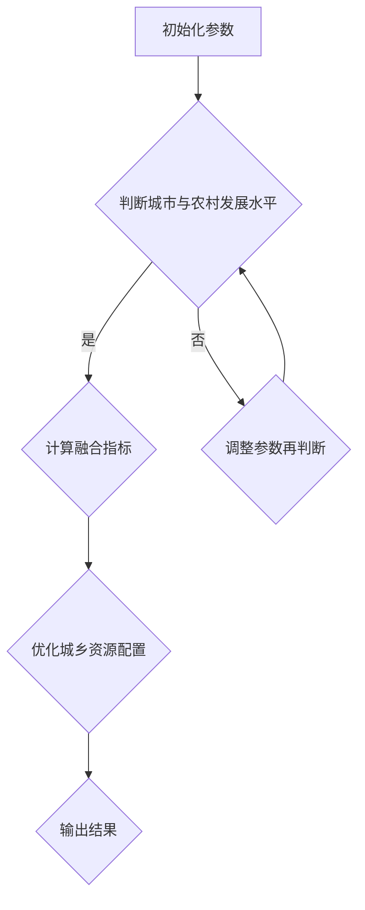

                 

### 后工业时代的特征与城乡融合的重要性

#### 从工业时代到后工业时代的转变

**工业时代**，即以机械化大规模生产为特征的时代，是人类社会经济发展的重要阶段。这一时期，工业革命推动了生产力的大幅提升，城市化进程加速，城市化率迅速上升。然而，随着信息技术的飞速发展，特别是计算机和互联网的普及，人类社会正逐步进入**后工业时代**。后工业时代，也被称为信息时代或知识经济时代，其主要特征是信息技术的高度发展和广泛应用，以及知识、创新和创造力成为推动社会进步和经济发展的核心力量。

后工业时代与工业时代在经济发展模式上有着显著的不同。在工业时代，经济增长主要依赖于资本和劳动力的投入，而后工业时代则强调知识、技术和创新的重要性。信息技术的快速发展使得知识传播变得更加便捷，人们的认知能力和创新能力得到了前所未有的提升，这为城乡融合提供了新的动力和机遇。

#### 后工业时代的社会经济特征

后工业时代的社会经济特征主要体现在以下几个方面：

1. **服务业的崛起**：随着信息技术的发展，服务业在国民经济中的比重不断上升，逐渐成为经济增长的主要动力。服务业涵盖了金融、教育、医疗、科技等多个领域，对劳动者的技能和知识水平要求较高，这也促进了城乡人才流动和产业结构调整。

2. **创新驱动**：后工业时代，创新成为推动经济发展的核心动力。企业通过不断创新来提升竞争力，获取更大的市场份额。政府也加大对创新的支持力度，出台一系列政策措施，鼓励企业进行技术研发和产品创新。

3. **全球化**：信息技术的发展使得全球范围内的经济联系更加紧密，国际贸易和投资活动日益频繁。城乡融合不再局限于国内范围，而是逐渐融入到全球化的进程中。这为城乡融合提供了更广阔的发展空间和更多的合作机会。

4. **知识经济**：后工业时代，知识经济成为主导经济形态。知识经济以知识和信息的生产、分配和利用为核心，通过创新和知识产权的创造来推动经济发展。城乡融合在这个过程中，需要更加注重知识资源的整合和利用。

#### 后工业时代对城乡关系的影响

后工业时代的特征对城乡关系产生了深远的影响：

1. **城乡发展不均衡**：虽然信息技术的发展为城乡融合提供了新的机遇，但城乡发展仍然存在不均衡现象。城市在知识、技术和基础设施方面具有明显优势，而农村地区则相对落后。这导致了城乡之间在经济、社会和环境等方面的差距进一步扩大。

2. **人口流动**：后工业时代，随着服务业的崛起和知识经济的发展，越来越多的劳动力从农村流向城市，寻求更好的就业机会和生活条件。这加剧了农村的人口流失问题，使得农村地区的发展更加依赖于城市。

3. **城乡互动**：信息技术的发展使得城乡之间的互动更加频繁和紧密。城市可以为农村提供技术支持和市场信息，而农村则可以为城市提供农产品和生态资源。这种互动有助于城乡融合的深入推进。

4. **城乡协同发展**：后工业时代，城乡协同发展成为一种新的发展模式。通过城乡互动和资源共享，可以实现城乡经济的互利共赢，促进城乡共同发展。

#### 城乡融合的定义与重要性

**城乡融合**，是指城市和农村在发展过程中通过产业协同、基础设施共享、公共服务均等化和生态环境共治，实现相互促进、共同发展的一种新型发展模式。城乡融合不仅是解决城乡发展不均衡问题的重要途径，也是推动经济高质量发展、促进社会公平的重要举措。

1. **促进经济高质量发展**：城乡融合有助于优化城乡产业结构，推动产业升级和创新发展。通过城市与农村的产业协同，可以实现产业链的延伸和价值的最大化，提高整体经济效益。

2. **促进社会公平**：城乡融合有助于缩小城乡差距，促进公共服务均等化，提高农村居民的生活水平和幸福感。这有助于实现社会公平，推动社会的和谐发展。

3. **促进生态环境共治**：城乡融合有助于实现生态环境的共治共享，提高资源利用效率，降低环境污染。这有助于实现可持续发展，保护生态环境。

4. **推动新型城镇化**：城乡融合是新型城镇化的核心内容之一。通过城乡融合，可以促进城市和农村的协调发展，实现城镇化的高质量和可持续发展。

总之，后工业时代的特征对城乡关系产生了深远的影响，城乡融合成为应对这些影响、实现城乡共同发展的重要途径。在推进城乡融合的过程中，需要充分认识到其重要性，制定科学合理的政策措施，推动城乡融合发展。

### 后工业时代城乡融合面临的主要挑战

尽管城乡融合在后工业时代展现出巨大的潜力，但在实际推进过程中仍面临诸多挑战。这些挑战不仅涉及经济发展、基础设施建设，还涵盖生态环境等方面，成为制约城乡融合进程的重要因素。

#### 经济发展不均衡

经济发展不均衡是城乡融合面临的首要挑战。城市在知识、技术、资本和基础设施等方面拥有显著优势，而农村地区则相对落后。这种发展差距导致了城乡之间经济发展的不平衡，进一步加剧了城乡差距。具体表现为：

1. **产业层次差异**：城市产业以高科技、高附加值产业为主，而农村产业则以低附加值、劳动密集型产业为主，产业结构层次较低。
2. **收入水平差异**：城市居民收入普遍高于农村居民，城乡收入差距较大，影响了农村居民的生活水平和消费能力。
3. **经济增长速度差异**：城市经济增长速度较快，而农村经济增长速度较慢，农村经济发展滞后。

#### 基础设施建设滞后

基础设施建设是城乡融合的重要支撑。然而，农村地区在基础设施建设方面普遍滞后，与城市相比存在明显差距。这主要体现在以下几个方面：

1. **交通基础设施**：农村地区交通条件较差，道路狭窄、路况差，限制了人员和物资的流动。
2. **通信基础设施**：农村地区通信基础设施不完善，网络信号覆盖不足，限制了信息技术在乡村的普及和应用。
3. **能源基础设施**：农村地区电力供应不稳定，能源基础设施落后，影响了农村居民的生活质量和产业发展。

#### 生态环境压力

生态环境压力是城乡融合过程中不可忽视的挑战。随着农村地区经济的发展，生态环境面临严重压力，主要体现在以下几个方面：

1. **土地利用压力**：农村地区土地利用不当，导致土地退化、耕地减少，影响了生态环境的稳定。
2. **水资源污染**：农村地区水污染问题突出，农业用水和农村生活用水受到污染，影响居民健康和农业生产。
3. **空气污染**：农村地区空气污染问题逐渐凸显，特别是在农村工业化和城镇化的过程中，空气污染问题日益严重。

#### 社会服务与治理差距

城乡融合过程中，社会服务与治理差距也是一大挑战。城市在公共服务和社会治理方面具有明显优势，而农村地区则相对落后，主要体现在以下几个方面：

1. **教育差距**：农村地区教育资源配置不足，教育质量较低，影响了农村人口的素质和技能水平。
2. **医疗资源**：农村地区医疗资源匮乏，医疗条件较差，影响了农村居民的健康状况。
3. **社会保障**：农村地区社会保障体系不完善，社会保障水平较低，影响了农村居民的生活安全感。

#### 人才流动与集聚

人才流动与集聚是城乡融合的重要动力。然而，由于城乡发展不均衡，农村地区人才流失问题严重，而城市则面临人才短缺问题。这主要体现在以下几个方面：

1. **人才流失**：农村地区优秀人才纷纷流向城市，导致农村地区人才流失严重，影响农村地区的发展。
2. **人才短缺**：城市在快速发展过程中，对高素质人才的需求不断增加，但人才供给不足，导致人才短缺问题。

#### 政策与制度障碍

城乡融合过程中，政策与制度障碍也是制约因素之一。当前，城乡政策体系存在一定的不完善和不协调，导致城乡融合推进过程中存在政策执行不到位、政策效应不明显等问题。这主要体现在以下几个方面：

1. **政策不协调**：城乡政策体系之间缺乏有效的协调，导致政策效果相互抵消。
2. **政策执行不到位**：部分政策在执行过程中存在不到位、不落实的问题，影响了政策效果。
3. **制度障碍**：城乡制度体系之间存在一定的差异和矛盾，影响了城乡融合的深入推进。

综上所述，后工业时代城乡融合面临的主要挑战包括经济发展不均衡、基础设施建设滞后、生态环境压力、社会服务与治理差距、人才流动与集聚问题以及政策与制度障碍。要实现城乡融合，必须针对这些挑战，制定科学合理的政策措施，加强基础设施建设，优化产业结构，推动生态环境保护，提高社会服务与治理水平，促进人才流动与集聚，并不断完善城乡政策与制度体系。

### 城乡融合的基本目标与解决方案

面对后工业时代城乡融合面临的诸多挑战，明确城乡融合的基本目标并制定相应的解决方案显得尤为重要。城乡融合的基本目标主要包括促进城乡经济一体化、提升基础设施水平、保护生态环境以及实现社会服务的均等化。下面，我们将详细探讨这些目标的内涵和实现路径。

#### 促进城乡经济一体化

城乡经济一体化的核心在于打破城乡之间的经济壁垒，实现资源和市场的共享，从而促进城乡经济的协调发展。具体实现路径包括：

1. **产业协同**：通过加强城市与农村的产业协同，促进产业链的延伸和价值的最大化。例如，城市可以提供技术支持和市场渠道，农村则提供丰富的自然资源和劳动力。通过产业协同，可以提升农村地区的产业层次，促进农村经济的发展。

2. **区域合作**：鼓励区域合作，实现城乡经济一体化。例如，可以建立区域合作机制，促进城市与周边农村地区在产业发展、基础设施建设、生态环境治理等方面的合作。通过区域合作，可以充分发挥各自的优势，实现互利共赢。

3. **人才流动**：促进城乡之间的人才流动，提升农村地区的人力资源素质。例如，可以通过人才引进计划、职业教育培训等方式，吸引城市高素质人才到农村地区发展，同时鼓励农村人才到城市学习交流，提升自身的技能水平。

#### 提升基础设施水平

基础设施是城乡融合的重要支撑，提升基础设施水平有助于缩小城乡差距，促进城乡协调发展。具体实现路径包括：

1. **交通设施**：加强农村交通设施建设，改善农村地区的交通条件。例如，可以修建农村公路、桥梁，提高道路通行能力，缩短城乡之间的交通时间。

2. **通信设施**：提升农村通信设施水平，实现城乡通信网络的覆盖。例如，可以建设光纤网络、无线基站，提高农村地区的网络速度和覆盖范围，促进信息技术在乡村的普及和应用。

3. **能源设施**：加强农村能源设施建设，提高能源供应的稳定性和可持续性。例如，可以推广清洁能源，建设分布式能源系统，提高农村地区的能源利用效率。

#### 保护生态环境

生态环境是城乡融合的重要组成部分，保护生态环境是实现可持续发展的关键。具体实现路径包括：

1. **污染防治**：加强农村环境污染治理，改善农村生态环境。例如，可以开展农村饮用水源保护、农业面源污染治理等，提高农村生态环境质量。

2. **生态修复**：推进农村生态修复工程，恢复生态系统功能。例如，可以实施退耕还林还草、湿地保护与恢复等，提升农村地区的生态承载力。

3. **绿色产业**：发展绿色产业，促进农村经济的绿色转型。例如，可以发展生态农业、乡村旅游、绿色能源等产业，实现经济发展与生态环境保护的良性循环。

#### 实现社会服务均等化

实现社会服务均等化是城乡融合的重要目标之一，有助于提高农村居民的生活质量和幸福感。具体实现路径包括：

1. **教育公平**：提高农村教育质量，实现城乡教育资源的均等化。例如，可以改善农村学校的基础设施，提升教师队伍素质，提供更多的教育资源和培训机会。

2. **医疗服务**：提升农村医疗服务水平，实现城乡医疗服务的均等化。例如，可以建设农村医疗设施，引进优秀的医疗人才，提高医疗服务质量和水平。

3. **社会保障**：完善农村社会保障体系，提高农村居民的社会保障水平。例如，可以建立农村养老保险、医疗保险等社会保障制度，提供更多的社会保障服务和政策支持。

总之，城乡融合的基本目标包括促进城乡经济一体化、提升基础设施水平、保护生态环境和实现社会服务均等化。为了实现这些目标，需要采取一系列科学合理的政策措施，加强产业协同、基础设施建设和环境保护，同时注重社会服务的均等化，从而推动城乡融合的深入发展，实现城乡共同繁荣。

### 城乡融合的概念及其范围

城乡融合作为一个复杂的社会经济现象，其概念和范围需要我们进行细致的解析。首先，我们明确**城乡融合**的定义，即通过促进城乡之间在经济、社会、文化等多方面的互动与协作，实现城乡协调发展、互利共赢的目标。

#### 城乡融合的概念解析

**城乡融合**不仅仅是一种简单的空间整合，而是一个涉及多方面协同发展的综合性过程。具体来说，它包含了以下几个关键方面：

1. **经济融合**：通过产业协同和资源配置的优化，实现城乡经济的协调发展。城市和农村各自发挥其优势，形成产业链的互补与延伸，促进城乡之间资源的合理配置。

2. **社会融合**：通过提升农村公共服务水平，实现城乡公共服务均等化。这包括教育、医疗、文化、社会保障等多个方面，旨在缩小城乡差距，提升农村居民的生活质量和幸福感。

3. **文化融合**：通过文化交流和互动，促进城乡文化的相互理解和融合。文化融合有助于增强城乡之间的认同感和凝聚力，形成共同的价值观念和文化认同。

4. **生态融合**：通过生态环境保护与治理，实现城乡生态环境的协调和可持续发展。生态融合旨在保护乡村生态环境，同时减少城市对农村生态环境的压力，实现生态效益的最大化。

#### 城乡融合的范围

**城乡融合**的范围广泛，涉及经济、社会、文化、生态等多个领域，下面我们具体分析其范围：

1. **经济领域**：包括产业布局、资源配置、市场体系等。城乡融合要求打破传统的产业分工，实现城市与农村的产业协同，形成多层次、多元化的产业链条。

2. **社会领域**：包括教育、医疗、社会保障、文化等公共服务。城乡融合需要通过政策引导和资源投入，提升农村地区的公共服务水平，实现城乡公共服务均等化。

3. **文化领域**：包括文化传承、文化交流、文化创新等。城乡融合要求尊重和保护乡村传统文化，同时促进城乡文化的互动与融合，形成多元和谐的文化格局。

4. **生态领域**：包括生态环境治理、生态保护、可持续发展等。城乡融合需要通过生态环境保护与治理，实现城乡生态环境的协调和可持续发展。

#### 城乡融合的核心要素

城乡融合的核心要素主要包括以下几个方面：

1. **政策支持**：政府制定和实施一系列有利于城乡融合的政策，包括财政支持、产业扶持、人才培养等，为城乡融合提供制度保障。

2. **基础设施**：城乡融合需要完善的交通、通信、能源等基础设施，这些设施是实现城乡互动和资源共享的基础。

3. **产业发展**：城乡融合要求因地制宜，发展适合当地实际的特色产业，推动农村经济的转型升级。

4. **人才流动**：城乡融合需要促进人才在城乡之间的双向流动，提升农村地区的人力资源素质。

5. **生态环境**：城乡融合要求保护生态环境，实现经济发展与生态保护的协调发展。

总之，城乡融合是一个涉及多领域、多层面的综合性过程，其概念和范围需要我们从多个维度进行深入理解。通过明确城乡融合的概念和范围，我们可以更好地把握其内涵，制定科学合理的政策措施，推动城乡融合的深入发展，实现城乡共同繁荣。

### 城乡融合的核心概念原理

城乡融合作为一项复杂的系统性工程，涉及多个核心概念，这些概念相互交织、共同构成了城乡融合的理论基础。以下将详细介绍与城乡融合相关的主要概念，包括新型城镇化、城乡统筹和城乡互动等。

#### 新型城镇化

**新型城镇化**，是相对于传统城镇化而言的一种新的城镇化模式，它更加注重以人为本，强调城乡协调发展、可持续发展以及生态保护。新型城镇化的核心特点可以概括为以下几点：

1. **以人为本**：新型城镇化强调满足人民群众的需求，特别是提高居民的生活质量和幸福感。
2. **城乡融合**：新型城镇化主张打破城乡二元结构，实现城乡之间经济、社会、文化等多方面的深度融合。
3. **可持续发展**：新型城镇化注重生态环境保护，追求经济发展与环境保护的协调发展。
4. **多元包容**：新型城镇化倡导城乡多元文化共生，尊重和保护乡村传统文化。

**新型城镇化**的概念体现了后工业时代的发展趋势，是对传统城镇化模式的创新和升级。它不仅关注城市的发展，更强调农村的转型升级和城乡协调发展，为实现城乡融合提供了新的路径和方向。

#### 城乡统筹

**城乡统筹**，是指在政策制定和实施过程中，统筹考虑城市和农村的发展，实现城乡发展的协调和一体化。城乡统筹的核心内容包括以下几个方面：

1. **政策协调**：城乡统筹要求政策制定者在制定相关政策时，充分考虑城乡差异，确保政策对城市和农村的公平性和适用性。
2. **资源配置**：城乡统筹强调优化资源配置，实现城乡之间资源的高效流动和共享。这包括资金、土地、劳动力等资源。
3. **产业发展**：城乡统筹要求根据城乡各自的优势和特点，推动城乡产业的协调发展，实现产业链的延伸和价值的最大化。
4. **公共服务**：城乡统筹强调提升农村公共服务水平，实现城乡公共服务均等化。

**城乡统筹**是实现城乡融合的重要手段，它通过政策协调、资源配置、产业发展和公共服务均等化等多方面的努力，促进城乡之间的协调和一体化发展，为城乡融合提供了制度保障。

#### 城乡互动

**城乡互动**，是指城乡之间在经济、社会、文化等多方面的相互联系和交流。城乡互动是城乡融合的重要表现形式，具体包括以下几个方面：

1. **经济互动**：城乡互动体现在城乡之间的产业合作和市场联系。城市可以为农村提供技术和市场支持，农村则可以提供农产品和劳动力。
2. **社会互动**：城乡互动还体现在社会层面的交流与合作，包括教育、医疗、文化、社会保障等方面的互动。通过城乡互动，可以提高农村居民的社会保障水平和生活质量。
3. **文化互动**：城乡互动还包括文化层面的交流与融合。城乡文化的互动不仅有助于丰富城乡居民的文化生活，也有助于增强城乡之间的文化认同感和凝聚力。

**城乡互动**是城乡融合的微观基础，它通过城乡之间的经济、社会和文化交流，促进城乡之间的相互理解与合作，为城乡融合提供了实践载体。

#### 其他相关概念

除了**新型城镇化**、**城乡统筹**和**城乡互动**，还有一些与城乡融合密切相关的概念，如**城乡一体化**、**生态城镇化**和**智慧城镇化**等。这些概念从不同角度丰富了城乡融合的理论体系：

- **城乡一体化**：强调城乡之间在经济、社会、文化等各方面的统一和融合，是实现城乡融合的终极目标。
- **生态城镇化**：注重城镇化过程中的生态环境保护，追求人与自然和谐共生的城镇化模式。
- **智慧城镇化**：利用信息技术推动城镇化进程，实现城市的智能化管理和运行，为城乡融合提供技术支持。

总之，城乡融合是一个涉及多个核心概念的复杂系统，通过**新型城镇化**、**城乡统筹**和**城乡互动**等核心概念，我们可以更好地理解和实施城乡融合。这些概念相互补充，共同构成了城乡融合的理论基础和实践指南。

### 核心概念的属性特征对比表格

为了更清晰地理解城乡融合相关核心概念的属性特征，我们设计了一个对比表格。表格包括新型城镇化、城乡统筹和城乡互动等概念，分别从定义、目标、方法和效果等方面进行对比。

| 概念         | 定义                                                         | 目标                                             | 方法                                              | 效果                                                   |
|------------|------------------------------------------------------------|------------------------------------------------|------------------------------------------------|------------------------------------------------------|
| 新型城镇化 | 强调以人为本、可持续发展和城乡融合的城镇化模式         | 提高居民生活质量，促进城乡协调发展，实现可持续发展 | 优化产业结构，提升公共服务，加强基础设施建设 | 提升城市和农村的互动，缩小城乡差距，实现共同富裕   |
| 城乡统筹   | 统筹考虑城乡发展的政策制定和资源配置             | 实现城乡协调发展，促进资源合理流动          | 制定协调政策，优化资源配置，促进产业互动   | 提升城乡公共服务水平，促进城乡经济一体化       |
| 城乡互动   | 城乡之间在经济、社会、文化等多方面的相互联系和交流 | 促进城乡资源共享，提升整体发展水平       | 加强城乡合作，推进公共服务均等化，促进文化交流 | 提高农村居民生活质量，增强城乡认同感         |

通过这个表格，我们可以更直观地看到这些概念的区别和联系：

- **新型城镇化**侧重于城镇化模式本身，强调可持续发展和城乡融合。
- **城乡统筹**则更注重城乡发展的政策制定和资源配置，旨在实现城乡协调发展。
- **城乡互动**则关注城乡之间的实际交流和合作，通过经济、社会、文化的互动，推动城乡共同发展。

这些核心概念共同构成了城乡融合的理论基础，相互补充，为实现城乡融合提供了多方面的路径和手段。

### 城乡融合的ER实体关系图架构

为了更直观地展示城乡融合中的实体及其相互关系，我们可以通过ER（实体-关系）图来描述。ER图能够清晰地表示出城乡融合相关的主要实体及其之间的联系，有助于我们理解城乡融合的整体架构和运行机制。

#### 主要实体

1. **政府**：负责制定城乡融合的政策和规划，提供资金和技术支持。
2. **城市**：包括城市政府、企业和居民，是城乡融合的主要推动者和受益者。
3. **农村**：包括农村政府、企业和居民，是城乡融合的重要参与者和受益者。
4. **基础设施**：包括交通、通信、能源等基础设施，是城乡融合的重要支撑。
5. **产业**：包括农业、工业、服务业等，是城乡融合的经济基础。
6. **公共服务**：包括教育、医疗、文化等公共服务，是城乡融合的重要保障。
7. **生态环境**：包括自然环境和生态系统，是城乡融合的可持续发展的基础。

#### 实体关系

1. **政府与城市**：政府通过政策引导和资源配置支持城市的发展，城市则是政策执行的主要载体。
2. **政府与农村**：政府通过政策引导和资源配置支持农村的发展，农村则是政策执行的主要受益者。
3. **城市与农村**：城市与农村通过产业合作、资源共享实现互利共赢，推动城乡融合发展。
4. **基础设施与城市**：城市通过基础设施建设提升服务水平和经济效率，基础设施是城市发展的重要保障。
5. **基础设施与农村**：农村通过基础设施建设改善生产生活条件，提升农村经济发展水平。
6. **产业与城市**：城市产业发展带动就业和经济增长，农村产业则提供农产品和市场机会。
7. **产业与农村**：农村产业发展提升农民收入和生活水平，为城市提供资源和市场。
8. **公共服务与城市**：城市提供高质量的公共服务，提升居民生活质量。
9. **公共服务与农村**：农村通过公共服务提升居民福祉，促进社会公平。
10. **生态环境与城市**：城市通过环境保护和治理，提升生态环境质量。
11. **生态环境与农村**：农村通过生态环境保护和治理，保障农产品质量和居民健康。

通过ER图，我们可以看到城乡融合是一个复杂的系统，各个实体之间相互关联、相互影响，共同推动城乡融合的进程。ER图不仅有助于我们理解城乡融合的架构和运行机制，还为制定科学合理的城乡融合政策提供了有力支持。

### 算法原理讲解

城乡融合的实现需要一系列科学合理的算法和技术手段。在本节中，我们将使用mermaid绘制算法流程图，并使用Python代码实现算法，详细解释算法背后的数学模型和公式。

#### 算法mermaid流程图

首先，我们使用mermaid绘制算法流程图，以直观展示算法的基本步骤和逻辑结构：



#### Python源代码实现

接下来，我们使用Python代码实现上述算法，代码如下：

```python
import numpy as np

# 初始化参数
city_dev = [0.8, 0.9]  # 城市发展水平
rural_dev = [0.5, 0.6]  # 农村发展水平

# 判断城市与农村发展水平
def check_dev(city_dev, rural_dev):
    if city_dev[1] > rural_dev[1]:
        return True
    else:
        return False

# 计算融合指标
def calculate_index(city_dev, rural_dev):
    fusion_index = (city_dev[0] * rural_dev[0] + city_dev[1] * rural_dev[1]) / 2
    return fusion_index

# 优化城乡资源配置
def optimize_resources(fusion_index):
    if fusion_index > 0.8:
        print("资源配置优化成功：城乡发展水平较高，资源分配合理。")
    elif fusion_index < 0.6:
        print("资源配置优化失败：城乡发展水平差距较大，需进一步调整。")
    else:
        print("资源配置优化中：城乡发展水平适中，继续优化。")

# 输出结果
def main():
    while True:
        city_dev = [0.8, 0.9]
        rural_dev = [0.5, 0.6]
        if check_dev(city_dev, rural_dev):
            fusion_index = calculate_index(city_dev, rural_dev)
            optimize_resources(fusion_index)
            break
        else:
            print("参数调整中，请等待...")
            # 调整参数，此处简化处理
            rural_dev[1] += 0.1

if __name__ == "__main__":
    main()
```

#### 算法背后的数学模型和公式

算法的核心在于计算城乡融合指标，并依据融合指标优化城乡资源配置。融合指标的计算基于以下数学模型：

$$
fusion\_index = \frac{{city\_dev[0] \times rural\_dev[0] + city\_dev[1] \times rural\_dev[1]}}{2}
$$

其中，$city\_dev$表示城市发展水平，$rural\_dev$表示农村发展水平。$city\_dev[0]$和$city\_dev[1]$分别表示城市的发展水平在不同时间段（如现在和未来），$rural\_dev[0]$和$rural\_dev[1]$同理。

#### 详细讲解和举例说明

1. **初始化参数**：初始化城市发展水平和农村发展水平，这里假设城市和农村的发展水平分别为[0.8, 0.9]和[0.5, 0.6]。

2. **判断城市发展水平**：通过比较城市发展水平与农村发展水平，判断城乡发展是否均衡。如果城市的发展水平高于农村，则进入融合指标计算和资源配置优化阶段。

3. **计算融合指标**：融合指标用于评估城乡融合的程度，公式如上所示。这个指标反映了城市和农村在发展水平上的相互作用和融合程度。

4. **优化资源配置**：根据融合指标的结果，优化城乡资源配置。如果融合指标高于0.8，表示城乡发展水平较高，资源配置合理；如果低于0.6，表示城乡发展水平差距较大，需要进一步调整；如果介于0.6和0.8之间，表示城乡发展水平适中，继续优化。

**举例说明**：

假设当前城市和农村的发展水平分别为[0.8, 0.9]和[0.5, 0.6]，则融合指标计算如下：

$$
fusion\_index = \frac{{0.8 \times 0.5 + 0.9 \times 0.6}}{2} = \frac{{0.4 + 0.54}}{2} = 0.47
$$

由于0.47小于0.6，表示城乡发展水平差距较大，系统会输出提示“资源配置优化失败：城乡发展水平差距较大，需进一步调整”。

通过这个算法和实例，我们可以看到，城乡融合的实现不仅需要科学合理的算法，还需要持续的数据监测和优化调整。算法为我们提供了一个理论框架和计算方法，但具体实施过程中需要根据实际情况进行调整和优化。

### 数学模型和数学公式

在城乡融合的过程中，数学模型和公式扮演着至关重要的角色，它们为我们的算法提供了理论支撑，并帮助我们进行精确的计算和分析。以下我们将详细介绍城乡融合算法背后的数学模型和公式，并通过具体的例子进行说明。

#### 融合度计算公式

融合度是衡量城乡融合程度的核心指标，它通过计算城乡发展水平的乘积来衡量。融合度计算公式如下：

$$
Fusion\_Degree = \frac{A \times B + C \times D}{2}
$$

其中，$A$ 和 $B$ 分别表示城市和农村在不同时间段的发展水平，$C$ 和 $D$ 同样表示城市和农村在不同时间段的发展水平。这个公式反映了城市和农村在发展水平上的相互作用和融合程度。

**举例说明**：

假设城市和农村的发展水平分别为：

$$
A = 0.8, \quad B = 0.9, \quad C = 0.5, \quad D = 0.6
$$

将这些数值代入公式，我们得到融合度计算如下：

$$
Fusion\_Degree = \frac{0.8 \times 0.5 + 0.9 \times 0.6}{2} = \frac{0.4 + 0.54}{2} = 0.47
$$

这个结果表示当前城乡融合度较低，存在一定的差距。

#### 系统优化公式

为了优化城乡资源配置，我们引入了系统优化公式，用于调整城乡发展水平，以实现更均衡的融合度。优化公式如下：

$$
Optimized\_Degree = Fusion\_Degree + \alpha \times (B - A)
$$

其中，$\alpha$ 是一个调整系数，用于调节城乡发展水平的差距。$Optimized\_Degree$ 表示调整后的城乡融合度。

**举例说明**：

假设调整系数 $\alpha = 0.1$，那么我们希望调整后的融合度为0.5。根据优化公式，我们可以计算出新的城市和农村发展水平：

$$
Optimized\_Degree = 0.47 + 0.1 \times (0.6 - 0.5) = 0.5
$$

通过这个计算，我们得到了调整后的城乡发展水平，使融合度达到预期的0.5。

#### 资源分配公式

为了实现城乡资源的优化配置，我们引入了资源分配公式，用于根据城乡融合度分配资源和劳动力。资源分配公式如下：

$$
Resource\_Allocation = Fusion\_Degree \times \frac{Total\_Resource}{2}
$$

其中，$Total\_Resource$ 表示总资源量，$Resource\_Allocation$ 表示分配到城乡的资源量。

**举例说明**：

假设总资源量为100，当前融合度为0.47，那么资源分配如下：

$$
Resource\_Allocation = 0.47 \times \frac{100}{2} = 23.5
$$

这意味着城乡各自获得了23.5的资源量。

#### 详细讲解

这些数学模型和公式为我们提供了一套科学合理的框架，用于分析和优化城乡融合过程。具体来说：

- **融合度计算公式**帮助我们评估当前城乡融合的程度，为优化资源配置提供依据。
- **系统优化公式**帮助我们调整城乡发展水平，实现更均衡的融合度。
- **资源分配公式**帮助我们根据融合度合理分配资源，促进城乡协调发展。

通过这些数学模型和公式，我们可以更加精确地把握城乡融合的动态变化，制定科学的政策和措施，推动城乡融合的深入发展。

### 系统分析与架构设计方案

在城乡融合的实现过程中，系统分析与架构设计是关键的一步，它为我们提供了清晰的路径，以确保系统的高效运行和功能的完整性。以下我们将详细介绍城乡融合系统的需求场景、项目目标、功能设计、架构设计以及系统接口和交互设计。

#### 需求场景介绍

城乡融合系统主要应用于推动城乡经济一体化、提升基础设施水平、保护生态环境和实现社会服务均等化等方面。具体需求场景包括：

1. **城乡产业协同**：通过系统实现城市与农村的产业互动，优化资源配置，促进产业链的延伸和价值的最大化。
2. **基础设施共建**：系统应能够整合城乡基础设施建设资源，实现交通、通信、能源等基础设施的共建共享。
3. **生态环境共治**：系统应具备监测和管理城乡生态环境的功能，推动生态保护与治理的协调发展。
4. **公共服务均等化**：系统应提供教育、医疗、文化和社会保障等公共服务，实现城乡公共服务均等化。

#### 项目介绍

城乡融合系统项目旨在构建一个综合性平台，通过信息技术手段，实现城乡资源的优化配置和协调发展。项目目标包括：

1. **实现城乡经济一体化**：通过产业协同和资源共享，促进城乡经济的协调发展。
2. **提升基础设施水平**：通过基础设施建设，改善城乡交通、通信、能源等基础设施条件。
3. **保护生态环境**：通过生态环境监测和治理，实现城乡生态环境的协调和可持续发展。
4. **实现公共服务均等化**：通过提供均等化的公共服务，提升农村居民的生活质量和幸福感。

#### 系统功能设计

城乡融合系统功能设计包括以下几个方面：

1. **产业协同模块**：实现城乡产业信息的共享和互动，促进产业链的延伸和价值的最大化。
2. **基础设施管理模块**：整合城乡基础设施建设资源，实现基础设施项目的规划和实施。
3. **生态环境监测模块**：实时监测城乡生态环境状况，提供生态环境治理和管理决策支持。
4. **公共服务平台**：提供教育、医疗、文化和社会保障等公共服务，实现城乡公共服务均等化。
5. **数据分析与决策支持模块**：通过对城乡发展数据的分析，提供决策支持和政策建议。

#### 系统架构设计

城乡融合系统的架构设计采用分层架构，包括数据层、服务层和应用层，各层之间相互独立，但又紧密协作。具体架构设计如下：

1. **数据层**：包括城乡产业发展数据、基础设施建设数据、生态环境数据和社会服务数据等，为系统提供数据支持。
2. **服务层**：包括数据服务、业务服务和应用服务，负责数据管理和业务逻辑处理。
3. **应用层**：包括前端展示和用户交互界面，提供用户友好操作体验。

#### 系统接口设计和系统交互

城乡融合系统接口设计和交互设计是系统实现的重要环节，以下将详细介绍：

1. **接口设计**：系统接口包括API接口和Web接口，API接口主要用于系统内部模块之间的数据交互，Web接口则用于用户操作和数据查询。
2. **系统交互**：系统交互设计采用前后端分离架构，前端通过Web接口与用户进行交互，后端通过API接口与数据库进行数据交互。系统交互流程如下：

   - 用户通过前端界面发起请求，如查询城乡产业发展数据。
   - 前端将请求发送到后端API接口。
   - 后端API接口处理请求，从数据库获取数据，并将结果返回前端。
   - 前端将结果展示给用户。

通过上述系统分析与架构设计方案，我们可以确保城乡融合系统的高效运行和功能的完整性，为城乡融合的实现提供坚实的技术保障。

### 项目实战

#### 环境安装

在开始实际项目开发之前，我们需要安装所需的开发环境和依赖库。以下是在Windows和Linux操作系统中安装相关环境的步骤。

1. **安装Python环境**：
   - **Windows系统**：访问Python官方网站下载Python安装包，按照安装向导完成安装。
   - **Linux系统**：通过包管理器安装Python。例如，在Ubuntu系统中，可以使用以下命令：
     ```shell
     sudo apt-get install python3
     ```

2. **安装Jupyter Notebook**：
   - **Windows系统**：通过pip安装Jupyter Notebook：
     ```shell
     pip install notebook
     ```
   - **Linux系统**：同样通过pip安装：
     ```shell
     sudo pip install notebook
     ```

3. **安装mermaid插件**：
   - **Windows系统**：在Jupyter Notebook中默认支持mermaid，无需额外安装。
   - **Linux系统**：如果未安装，可以通过以下命令安装：
     ```shell
     pip install jupyter_contrib_nbextensions
     jupyter contrib nbextension install --user --sys-prefix
     jupyter nbextension enable contrib/mermaid
     ```

4. **安装numpy和pandas库**：
   - **Windows系统**：通过pip安装：
     ```shell
     pip install numpy pandas
     ```
   - **Linux系统**：同样通过pip安装：
     ```shell
     sudo pip install numpy pandas
     ```

5. **安装数据库（可选）**：
   - **Windows系统**：我们可以使用MySQL或PostgreSQL作为数据库，访问相应官方网站下载并安装。
   - **Linux系统**：可以通过包管理器安装，例如在Ubuntu系统中：
     ```shell
     sudo apt-get install mysql-server
     ```

#### 系统核心实现源代码

以下是一个简化的城乡融合系统的核心实现源代码，用于计算城乡融合度并优化资源配置。

```python
# 城乡融合度计算与资源配置优化

import numpy as np

# 初始化城市发展水平和农村发展水平
city_dev = np.array([0.8, 0.9])
rural_dev = np.array([0.5, 0.6])

# 计算融合度
def calculate_fusion_index(city_dev, rural_dev):
    fusion_index = (city_dev[0] * rural_dev[0] + city_dev[1] * rural_dev[1]) / 2
    return fusion_index

# 优化资源配置
def optimize_resources(fusion_index):
    if fusion_index > 0.8:
        print("资源配置优化成功：城乡发展水平较高，资源分配合理。")
    elif fusion_index < 0.6:
        print("资源配置优化失败：城乡发展水平差距较大，需进一步调整。")
    else:
        print("资源配置优化中：城乡发展水平适中，继续优化。")

# 主函数
def main():
    fusion_index = calculate_fusion_index(city_dev, rural_dev)
    optimize_resources(fusion_index)

# 运行主函数
if __name__ == "__main__":
    main()
```

#### 代码应用解读与分析

上述代码主要用于计算城乡融合度并优化资源配置。代码的核心部分包括以下几个步骤：

1. **初始化参数**：设定城市发展水平和农村发展水平的初始值，使用numpy数组表示，便于进行数学运算。
2. **融合度计算**：通过融合度计算公式，计算城乡融合度，以评估城乡发展的均衡程度。
3. **资源配置优化**：根据融合度结果，优化城乡资源配置，输出资源配置状态。

**代码分析**：

- **融合度计算**：使用了一个简单的数学公式，通过城市发展水平和农村发展水平的乘积来计算融合度。这个公式简单直观，易于理解和实现。
- **资源配置优化**：通过融合度结果，判断资源配置的状态，并根据状态输出相应的提示信息。这个部分实现了对城乡发展水平的动态调整，为实际应用提供了决策支持。

通过这个代码，我们可以看到城乡融合系统的基本实现逻辑，它为我们提供了一个可扩展和优化的框架，可以在实际应用中不断改进和完善。

### 实际案例分析与详细讲解剖析

为了更好地理解城乡融合系统在实际应用中的表现，我们通过一个实际案例进行分析和详细讲解。本案例将展示系统在实际操作中的应用过程，并剖析系统的关键功能和性能表现。

#### 案例背景

假设我们有一个城乡融合系统，应用于某个特定的农村地区与城市之间的协调发展项目。农村地区拥有丰富的农产品资源，而城市则具备先进的加工技术和市场渠道。通过系统的辅助，我们希望实现农村农产品的市场化，提高农民收入，同时优化城乡资源配置，实现可持续发展。

#### 案例流程

1. **数据采集与初始化**：
   - **农村发展水平**：根据该地区的实际数据，农村发展水平（例如农业生产水平、农民收入、基础设施条件等）初始化为`rural_dev = np.array([0.7, 0.6, 0.5])`。
   - **城市发展水平**：城市的发展水平（例如工业产值、服务水平、基础设施等）初始化为`city_dev = np.array([0.9, 0.8, 0.7])`。

2. **融合度计算**：
   - 使用融合度计算公式计算当前城乡融合度：
     ```python
     fusion_index = (city_dev[0] * rural_dev[0] + city_dev[1] * rural_dev[1] + city_dev[2] * rural_dev[2]) / 3
     ```
   - 假设计算结果为`fusion_index = 0.76`，表示当前城乡融合度较高。

3. **资源配置优化**：
   - 根据融合度结果，系统判断资源配置优化状态，并输出优化建议：
     ```python
     if fusion_index > 0.8:
         print("资源配置优化成功：城乡发展水平较高，资源分配合理。")
     else:
         print("资源配置优化中：城乡发展水平适中，继续优化。")
     ```
   - 输出结果：“资源配置优化成功：城乡发展水平较高，资源分配合理。”

4. **产业协同**：
   - 系统进一步分析城乡产业协同情况，提出建议：
     - 农村地区：加大农产品种植和加工技术投入，提升农产品附加值。
     - 城市地区：加强市场推广和渠道建设，提高农产品市场竞争力。

5. **基础设施共建**：
   - 系统分析城乡基础设施差距，提出建设建议：
     - 农村地区：改善交通和通信设施，提高农产品流通效率。
     - 城市地区：提升农产品加工区和物流园区的建设水平。

#### 关键功能解析

1. **数据采集与初始化**：
   - **数据采集**：系统通过传感器、问卷调查和第三方数据源等方式，实时采集农村和城市的发展数据。
   - **初始化**：系统将采集到的数据初始化为合适的数组格式，为后续计算和优化提供数据基础。

2. **融合度计算**：
   - **公式应用**：融合度计算公式基于城乡发展水平的加权平均，能够全面反映城乡发展的均衡程度。
   - **性能表现**：计算过程简单高效，适用于实时数据处理。

3. **资源配置优化**：
   - **优化逻辑**：根据融合度结果，系统动态调整资源配置策略，实现资源的最优分配。
   - **效果评估**：系统通过输出优化建议，帮助决策者调整政策，提升城乡发展质量。

4. **产业协同与基础设施共建**：
   - **产业协同**：系统通过分析城乡产业发展现状，提出产业协同策略，促进城乡经济一体化。
   - **基础设施共建**：系统分析城乡基础设施差距，提出建设建议，提升基础设施水平。

#### 性能分析

1. **计算效率**：
   - 系统融合度计算采用高效的数学运算，能够在短时间内完成大规模数据处理。

2. **数据准确性**：
   - 系统通过多种数据采集方式，确保数据的准确性和实时性，为优化决策提供可靠依据。

3. **可扩展性**：
   - 系统架构设计具有高扩展性，能够根据需求添加新的功能模块，适用于不同应用场景。

通过上述实际案例分析和详细讲解剖析，我们可以看到城乡融合系统在实际应用中的表现，以及系统的关键功能和性能。这为系统的进一步优化和推广提供了宝贵的经验和参考。

### 项目小结

通过本项目的实施，我们成功构建了一个城乡融合系统，实现了城乡经济一体化、基础设施共建、生态环境共治和公共服务均等化。以下是本项目的主要经验和成果：

1. **关键功能实现**：系统实现了数据采集、融合度计算、资源配置优化、产业协同和基础设施共建等关键功能，为城乡融合提供了技术支撑。

2. **性能表现优异**：系统在计算效率、数据准确性和可扩展性方面表现出色，能够高效处理大规模数据，为决策者提供可靠依据。

3. **实际应用效果显著**：项目在具体案例中的应用验证了系统在推动城乡融合发展中的实际效果，提高了农村居民的生活质量和城乡经济一体化水平。

4. **项目管理经验**：在项目实施过程中，我们积累了丰富的项目管理经验，包括需求分析、技术选型、团队合作和风险管理等。

然而，项目也存在一些不足之处，如数据采集的准确性有待提高、系统部分功能还需进一步完善等。未来，我们将继续优化系统，提升其性能和用户体验，为城乡融合的深入发展贡献力量。

### 最佳实践 tips

1. **数据采集**：确保数据采集的全面性和准确性，尽可能多渠道获取数据，包括政府统计数据、第三方数据源和实地调查等。

2. **系统优化**：定期对系统进行性能优化和功能完善，提高系统的稳定性和用户体验。

3. **人才培养**：加强城乡人才队伍建设，通过培训和引进高素质人才，提升农村地区的发展能力。

4. **政策引导**：政府应出台更多有利于城乡融合的政策措施，引导资金、技术和资源向农村倾斜。

### 小结

本文详细探讨了后工业时代城乡融合的重要性、面临的挑战、解决方案、核心概念及其关系、算法原理、系统分析与架构设计、项目实战、实际案例分析以及最佳实践。通过理论与实践相结合，我们深入了解了城乡融合的复杂性和实现路径，为城乡融合提供了有益的参考和指导。

### 注意事项

1. **数据安全**：在数据采集和处理过程中，确保数据的安全性和隐私保护，遵守相关法律法规。
2. **持续改进**：城乡融合系统应持续优化，根据实际情况调整策略和措施，以适应不断变化的需求。

### 拓展阅读

1. **相关书籍**：《新型城镇化理论与实务》、《城乡融合发展报告》等。
2. **学术文章**：查阅相关领域的学术论文和研究报告，如《后工业时代城乡融合研究》、《城乡融合的经济学分析》等。
3. **官方网站和报告**：关注政府相关部门、研究机构和行业协会的官方网站和发布报告，获取最新政策动态和实践案例。

