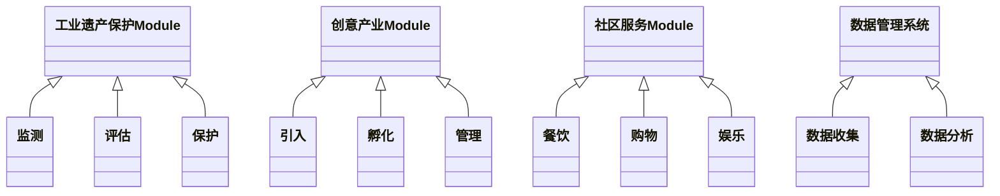
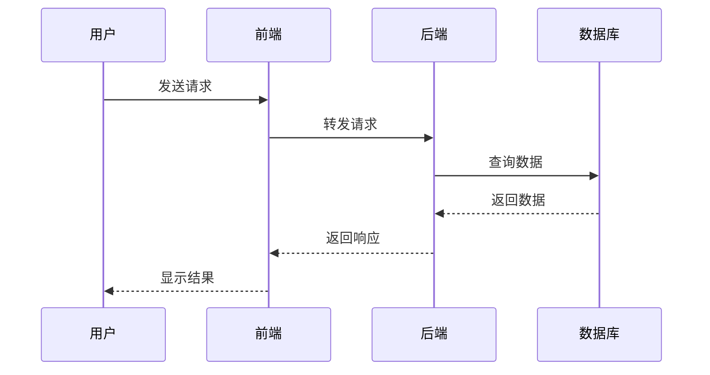
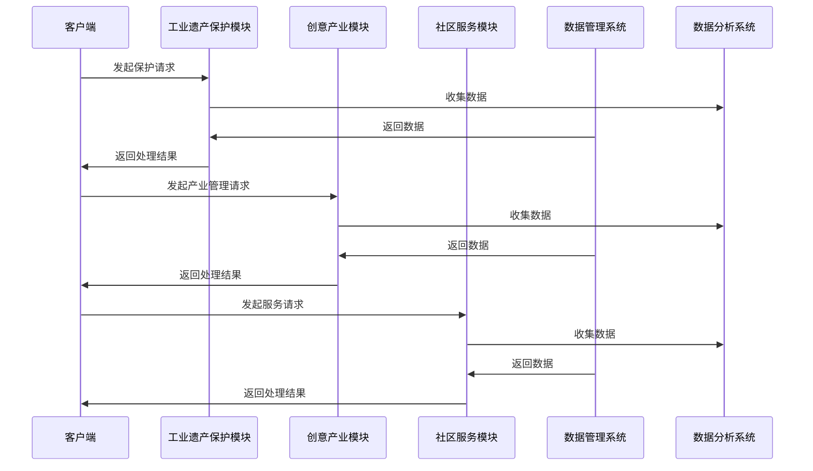

                 


### 引言

在当前社会经济发展的大背景下，后工业时代的城市更新已成为全球城市发展的关键议题。工业遗产作为历史记忆的承载者和城市文化的重要组成部分，其保护与再利用在城市化进程中扮演着至关重要的角色。同时，创意产业的发展为城市更新注入了新的活力，成为提升城市竞争力的重要途径。本文旨在探讨后工业时代的城市更新，重点分析工业遗产保护与创意产业发展之间的关系，并提出具体的策略和框架。

首先，我们需要明确几个核心概念：工业遗产、城市更新、创意产业。工业遗产是指工业革命后遗留下来的工业设施、厂房、仓库等具有历史、文化价值的物质遗产；城市更新则是指对城市内部空间、基础设施、公共服务等进行改造和提升，以适应经济发展的需求；创意产业则是指通过创意思维和创新方法，将知识产权转化为商业价值的一系列产业活动。

### 背景介绍

后工业时代的特征主要体现在经济结构的变化、信息技术的发展以及城市化进程的加速。在经济结构上，传统的制造业逐渐向服务业转型，知识经济和信息经济成为主导；在信息技术的发展上，互联网、大数据、人工智能等新兴技术迅速崛起，极大地改变了人们的生产方式和生活方式；在城市化进程上，城市人口持续增加，城市空间资源紧张，城市化进程加速，城市更新需求日益迫切。

在这个背景下，城市更新不仅是为了满足经济发展的需求，更是为了提升城市居民的生活质量。然而，城市更新的过程中面临着一系列挑战，其中之一就是如何平衡工业遗产的保护与再利用。工业遗产作为城市历史的见证，具有重要的文化和历史价值，但往往也面临着资源浪费、环境恶化等问题。因此，如何保护工业遗产、同时实现其经济价值的最大化，成为城市更新中的重要课题。

### 工业遗产保护

工业遗产的保护是一个复杂而庞大的系统工程，涉及到法律法规、资金投入、技术手段等多个方面。首先，法律法规是工业遗产保护的基础，通过制定相关法规和政策，明确工业遗产的保护范围、保护措施和保护责任。目前，许多国家和地区都制定了专门的工业遗产保护法规，如英国的《工业遗产保护法》、法国的《文化遗产法》等。

其次，资金投入是工业遗产保护的关键。工业遗产保护需要大量的资金用于修缮、维护和再利用，而资金来源可以包括政府拨款、企业赞助、社会捐赠等多种途径。例如，德国的鲁尔区就是一个成功的工业遗产保护与再利用的案例。鲁尔区通过政府和企业合作，将闲置的工业设施改造成博物馆、创意园区等，不仅保护了工业遗产，也促进了当地经济的发展。

再次，技术手段是工业遗产保护的重要保障。现代科技的发展为工业遗产保护提供了新的手段，如3D打印、虚拟现实、大数据分析等。这些技术不仅可以帮助我们更好地保护工业遗产，还可以提升游客的体验。例如，荷兰的阿姆斯特丹艺术区就利用虚拟现实技术，让观众可以“穿越”到工业革命时期的工厂内部，感受历史的魅力。

### 创意产业发展

创意产业作为城市更新的新动力，其发展具有巨大的潜力。创意产业包括设计、时尚、媒体、娱乐、文化艺术等多个领域，这些产业通过创意思维和创新方法，将知识和技能转化为商业价值，对城市经济和文化的发展产生深远影响。

首先，创意产业的发展可以提升城市的经济活力。创意产业通常具有较高的附加值和就业潜力，可以吸引大量人才和投资，促进城市的经济发展。例如，伦敦的创意产业区——伦敦市西部的考文特花园，就是一个成功的案例。考文特花园以其独特的创意产业氛围，吸引了大量的艺术家、设计师和创业者，成为伦敦的文化地标和经济引擎。

其次，创意产业的发展可以增强城市的文化软实力。创意产业是文化传承和创新的重要载体，通过创意产业的发展，可以更好地保护和传承城市的历史文化，同时推动文化的创新和发展。例如，中国的苏州工业园区，通过引入创意产业，将传统的园林艺术与现代设计相结合，打造出一系列具有国际影响力的文化创意产品，提升了城市的文化影响力。

### 工业遗产保护与创意产业的融合

工业遗产保护与创意产业的融合是城市更新的一个重要方向。通过将工业遗产转化为创意产业空间，可以实现工业遗产的经济价值和文化遗产价值的双重提升。

首先，工业遗产的再利用可以为创意产业提供独特的空间资源。许多工业遗产具有独特的建筑风格和历史价值，这些资源可以被创意产业所利用，创造出独特的文化氛围和创意空间。例如，北京的798艺术区，就是利用废弃的工厂改造而成的创意产业区，吸引了大量的艺术家和设计师，成为北京的文化地标。

其次，创意产业的发展可以为工业遗产保护提供新的动力。创意产业通过商业运作，可以为工业遗产的维护和修缮提供资金支持，同时也可以吸引更多的公众关注和参与，推动工业遗产的保护工作。例如，英国的曼彻斯特市，通过发展创意产业，成功地将废弃的曼彻斯特港口改造为创意产业区，不仅保护了工业遗产，也促进了当地经济的发展。

### 案例研究

为了更好地理解工业遗产保护与创意产业发展的实践，我们可以通过一些成功案例进行深入分析。

首先，以德国的鲁尔区为例。鲁尔区曾经是欧洲最重要的工业区之一，随着工业的衰退，地区经济陷入了困境。然而，鲁尔区通过发展创意产业，成功实现了城市更新。例如，将废弃的煤矿区改造成音乐节场地，将旧厂房改造成创意工作室，吸引了大量的艺术家和创业者，不仅保护了工业遗产，也推动了当地经济的发展。

其次，以中国的苏州工业园区为例。苏州工业园区通过引入创意产业，将传统的园林艺术与现代设计相结合，打造出一系列具有国际影响力的文化创意产品。例如，将传统的苏州园林与现代建筑设计相结合，创造出独特的园林创意产品，吸引了大量的游客和投资，提升了城市的文化影响力。

### 总结与展望

工业遗产保护与创意产业发展是城市更新中不可或缺的两个方面。通过保护工业遗产，我们可以传承城市的历史文化，同时也可以为城市的发展提供独特的资源。而创意产业的发展，不仅可以提升城市的经济活力，还可以增强城市的文化软实力。

然而，工业遗产保护与创意产业发展也面临着一系列挑战。如何平衡工业遗产的经济价值和文化遗产价值，如何通过创新手段提升工业遗产的保护水平，如何推动创意产业的发展，都是我们需要深入思考和解决的问题。

未来，随着科技的进步和城市化进程的加快，工业遗产保护与创意产业发展将迎来新的机遇和挑战。我们需要不断创新，探索更加有效的保护和利用工业遗产的方式，同时推动创意产业的持续发展，为城市更新注入新的活力。

### 背景介绍

#### 核心概念术语说明

在后工业时代的城市更新中，有几个核心概念需要我们深入理解，这些概念不仅是我们分析问题的基础，也是推动城市更新的动力源泉。

**工业遗产**：工业遗产是指工业革命后遗留下来的工业设施、厂房、仓库等具有历史、文化价值的物质遗产。这些遗产不仅见证了工业化的进程，也是城市文化的重要组成部分。例如，英国的曼彻斯特、德国的鲁尔区等地，都保留了大量具有历史价值的工业遗址。

**城市更新**：城市更新是指对城市内部空间、基础设施、公共服务等进行改造和提升，以适应经济发展的需求，改善居民的生活环境。城市更新不仅涉及物质空间的重塑，还包括社会、经济、文化等各个方面的综合发展。

**创意产业**：创意产业是指通过创意思维和创新方法，将知识产权转化为商业价值的一系列产业活动。包括设计、时尚、媒体、娱乐、文化艺术等领域。创意产业具有高附加值、低能耗、可持续发展等特点，是现代城市经济的重要驱动力。

#### 问题背景

后工业时代的城市更新面临着诸多挑战。首先，随着经济的全球化和信息化，城市面临着不断变化的经济结构和社会需求。传统工业的衰退和新兴产业的崛起，要求城市必须进行产业升级和空间重构。其次，城市化进程的加速，导致城市人口激增、资源紧张、环境恶化等问题日益凸显。如何在一个有限的空间内，实现经济效益、社会效益和环境效益的协调发展，成为城市更新面临的重要课题。

工业遗产的保护与再利用是城市更新中的重要议题。工业遗产作为城市历史的见证，具有重要的文化价值和历史意义。然而，许多工业遗产在现代化进程中面临着废弃、拆除或改造的风险。如何平衡工业遗产的经济价值和文化遗产价值，如何通过创新手段实现工业遗产的可持续利用，成为城市更新中亟待解决的问题。

创意产业的发展为城市更新提供了新的机遇。创意产业通过将文化和创意转化为商业价值，不仅能够提升城市的经济活力，还可以增强城市的文化软实力。然而，创意产业的发展也面临着人才短缺、市场需求不足、政策支持不足等问题。如何推动创意产业的健康发展，如何实现创意产业与城市更新的深度融合，是城市更新中需要深入探讨的议题。

#### 问题描述

在后工业时代的城市更新中，我们面临以下主要问题：

1. **工业遗产的保护与再利用**：如何在城市更新的过程中，保护工业遗产的文化价值，同时实现其经济价值的最大化？如何平衡工业遗产的经济开发和文化遗产保护之间的关系？

2. **创意产业的发展**：如何推动创意产业的发展，提升城市的经济活力和文化软实力？如何解决创意产业在人才、市场需求和政策支持等方面的瓶颈？

3. **城市空间的重构**：如何在有限的土地资源内，实现城市空间的优化利用，满足经济发展和居民生活需求？如何通过城市空间的重构，提升城市的环境品质和居住体验？

#### 问题解决

针对上述问题，我们可以从以下几个方面着手解决：

1. **制定合理的法律法规**：通过制定和完善相关法律法规，明确工业遗产的保护范围、保护措施和保护责任，为工业遗产的保护提供法律保障。

2. **加强资金投入**：通过政府拨款、企业赞助、社会捐赠等多种途径，加大工业遗产保护的资金投入，确保工业遗产的修缮和维护工作顺利进行。

3. **利用现代技术手段**：利用3D打印、虚拟现实、大数据分析等现代技术手段，提升工业遗产保护的技术水平，提高游客的体验。

4. **推动创意产业的发展**：通过政策扶持、人才培养、市场需求拓展等多种手段，推动创意产业的健康发展，提升城市的经济活力和文化软实力。

5. **优化城市空间利用**：通过城市规划和空间设计，实现城市空间的优化利用，满足经济发展和居民生活需求，提升城市的环境品质和居住体验。

#### 边界与外延

在讨论工业遗产保护与创意产业发展时，我们需要明确其边界和外延。

**边界**：工业遗产保护与创意产业发展主要关注城市内部的历史文化遗产保护和新兴产业发展。虽然两者具有一定的交集，但工业遗产保护更侧重于文化遗产的保护，而创意产业发展更侧重于新兴产业的推动。

**外延**：工业遗产保护与创意产业发展不仅涉及城市内部，还涉及到城市与周边区域的互动。例如，城市创意产业的繁荣可能会吸引周边地区的居民和投资者，促进区域经济的整体发展。

#### 概念结构与核心要素组成

**工业遗产保护**：

- **核心概念**：文化遗产保护、可持续利用、历史文化价值。
- **核心要素**：法律法规、资金投入、技术手段、社会参与。

**创意产业发展**：

- **核心概念**：创意思维、知识产权、商业价值。
- **核心要素**：政策支持、人才培养、市场需求、技术创新。

通过以上分析，我们可以看到，工业遗产保护与创意产业发展在概念结构和核心要素上具有一定的差异，但两者在城市更新中都发挥着重要作用。在未来的城市发展中，如何平衡两者的关系，实现互利共赢，是值得我们深入研究和探讨的重要课题。

### 核心概念与联系

在前文中，我们已经介绍了工业遗产保护、城市更新和创意产业发展的核心概念。接下来，我们将进一步探讨这些概念之间的联系，通过对比它们的属性特征，绘制ER实体关系图，从而为后文的分析和讨论提供基础。

#### 工业遗产保护的概念

**定义**：工业遗产保护是指对具有历史、文化和科学价值的工业设施、厂房、仓库等进行修缮、维护和再利用，以保留其文化遗产价值。

**属性特征**：

- **历史文化价值**：工业遗产是工业化时代的见证，具有丰富的历史信息和文化价值。
- **物质遗产**：工业遗产通常是实体物质，如工厂、铁路、矿山等。
- **可持续利用**：工业遗产的再利用应兼顾经济、社会和环境效益。

#### 城市更新的概念

**定义**：城市更新是指对城市内部空间、基础设施、公共服务等进行改造和提升，以适应经济发展需求，改善居民生活质量。

**属性特征**：

- **空间重构**：城市更新涉及城市空间的结构调整和优化。
- **多功能性**：城市更新旨在提升城市的经济、文化、社会功能。
- **可持续发展**：城市更新追求经济、社会和环境的综合效益。

#### 创意产业发展的概念

**定义**：创意产业发展是指通过创意思维和创新方法，将知识和技能转化为商业价值，推动经济和社会发展的产业活动。

**属性特征**：

- **高附加值**：创意产业具有高附加值、低能耗的特点。
- **创新驱动**：创意产业的发展依赖于创新思维和新技术。
- **文化融合**：创意产业将传统文化与现代创意相结合，形成独特的文化产品。

#### 概念属性特征对比表格

| 特征        | 工业遗产保护                   | 城市更新                        | 创意产业发展                     |
|-------------|--------------------------------|---------------------------------|--------------------------------|
| 核心概念    | 文化遗产保护、可持续利用       | 空间重构、多功能性、可持续发展   | 创意思维、知识产权、商业价值   |
| 物理形式    | 实体物质遗产                   | 城市空间、基础设施、公共服务     | 知识产品、文化产品             |
| 经济效益    | 中长期投资，文化遗产价值转换   | 短期投资，经济功能提升           | 高附加值，创新驱动               |
| 社会效益    | 文化传承、社会认同             | 生活质量提升、社会稳定           | 文化创新、就业机会              |
| 环境效益    | 环境友好、可持续发展           | 环境改善、生态平衡               | 环境友好、资源节约              |

通过以上对比表格，我们可以清晰地看到工业遗产保护、城市更新和创意产业发展之间的差异和联系。这些概念虽然各自具有独特的属性特征，但在城市更新中，它们相互依存、相互促进，共同推动城市的发展和进步。

#### ER实体关系图架构

为了更直观地理解这三个概念之间的联系，我们使用Mermaid流程图来绘制ER实体关系图。

```mermaid
erDiagram
  IDEA_GLASS ||--|{ 工业遗产保护 }
  IDEA_GLASS ||--|{ 城市更新 }
  IDEA_GLASS ||--|{ 创意产业发展 }

  工业遗产保护  ..|{ 文物保护 }..> IDEA_GLASS
  工业遗产保护  ..|{ 文化传承 }..> IDEA_GLASS
  城市更新      ..|{ 经济发展 }..> IDEA_GLASS
  城市更新      ..|{ 环境改善 }..> IDEA_GLASS
  创意产业发展 ..|{ 文化创新 }..> IDEA_GLASS
  创意产业发展 ..|{ 市场需求 }..> IDEA_GLASS
```

在这个ER实体关系图中，IDEA_GLASS代表核心概念集合，它与文物保护、文化传承、经济发展、环境改善、文化创新和市场需求等实体之间存在多种联系。这些联系展示了工业遗产保护、城市更新和创意产业发展之间的互动和互补关系。

通过这个ER实体关系图，我们可以更清晰地看到，工业遗产保护不仅关乎历史文化的传承，也与城市更新和创意产业发展密切相关。城市更新通过空间重构和多功能性提升，为工业遗产保护和创意产业发展提供了平台；而创意产业发展则通过文化创新和市场需求，为工业遗产保护和城市更新注入新的动力。这些概念之间的紧密联系，为后文的深入分析和讨论奠定了基础。

### 策略与框架

#### 工业遗产保护策略

工业遗产保护是一个复杂而多层次的系统工程，涉及法律法规、政策制定、资金投入和技术手段等多个方面。为了有效地保护工业遗产，我们需要采取一系列策略和措施。

**1. 法律法规与政策框架**

法律法规是工业遗产保护的基础。各国政府应制定和完善相关法律法规，明确工业遗产的保护范围、保护措施和保护责任。例如，英国、法国、德国等发达国家已经制定了专门的工业遗产保护法，为工业遗产的保护提供了法律保障。

**2. 资金投入**

资金投入是工业遗产保护的关键。政府和企业应共同承担工业遗产的保护资金，通过政府拨款、企业赞助、社会捐赠等多种途径筹集资金。同时，可以通过财政税收政策，鼓励企业和个人参与工业遗产的保护工作。

**3. 技术手段**

现代科技的发展为工业遗产保护提供了新的手段。例如，3D打印、虚拟现实、大数据分析等技术可以用于工业遗产的修复和保护。3D打印技术可以用于复制和修复受损的工业遗产，而虚拟现实技术则可以增强游客的体验，提高工业遗产的参观价值。

**4. 国际经验借鉴**

国际经验对于我国工业遗产保护具有重要借鉴意义。例如，德国的鲁尔区通过政府和企业合作，将废弃的工业设施改造成博物馆、创意园区等，实现了工业遗产的经济价值和文化价值的双重提升。英国的曼彻斯特市通过发展创意产业，成功地将废弃的港口改造为创意产业区，吸引了大量的艺术家和创业者。

**5. 社会参与**

工业遗产保护不仅是政府和企业的责任，也需要公众的参与。通过开展公众教育和宣传活动，提高公众对工业遗产保护的意识和参与度。例如，可以组织志愿者团队，参与工业遗产的修复和保护工作，同时也可以通过社交媒体等平台，宣传工业遗产保护的重要性。

#### 创意产业发展的框架

创意产业的发展是城市更新中的重要动力，为了推动创意产业的健康发展，我们需要构建一个系统的框架，包括模式分析、发展影响、产业融合和成功案例等。

**1. 创意产业发展的模式分析**

创意产业的发展模式多种多样，主要包括独立创业、产业链整合、创意园区建设等。独立创业是指个人或小团队依靠创意和创新，自主创立企业；产业链整合是指通过整合上下游资源，构建完整的产业链；创意园区建设则是通过集中创意产业资源，打造创意产业集聚区。

**2. 创意产业对城市更新的影响**

创意产业的发展对城市更新具有深远影响。首先，创意产业可以提升城市的文化软实力，增强城市的吸引力和竞争力。其次，创意产业的发展可以带动相关产业的发展，促进城市经济的多元化。此外，创意产业还可以提供大量就业机会，改善居民的生活质量。

**3. 创意产业与工业遗产的融合**

工业遗产保护与创意产业的发展相辅相成。通过将工业遗产转化为创意产业空间，可以实现工业遗产的经济价值和文化遗产价值的双重提升。例如，将废弃的工厂改造成创意工作室、博物馆、艺术画廊等，不仅可以保护工业遗产，还可以为城市增添新的文化景点。

**4. 创意产业发展的成功案例**

全球范围内，有许多成功的创意产业发展案例。例如，伦敦的考文特花园以其独特的创意产业氛围，吸引了大量的艺术家和设计师，成为伦敦的文化地标和经济引擎。纽约的苏荷区通过发展创意产业，成功实现了城市更新，提升了区域的经济活力和文化影响力。

**5. 政策支持与人才培养**

为了推动创意产业的健康发展，政府需要制定相应的政策，包括财政税收优惠、产业扶持政策、知识产权保护等。同时，还需要加强人才培养，提高创意产业的整体水平。例如，可以通过设立创意产业学院、开展创意产业培训，培养更多的创意人才。

通过以上策略和框架，我们可以有效地推动工业遗产保护和创意产业的发展，实现城市更新的目标。这不仅可以提升城市的文化软实力和经济活力，还可以改善居民的生活质量，促进城市的可持续发展。

### 项目实战

为了更好地理解工业遗产保护与创意产业发展的实践，我们将通过一个具体的案例进行详细讲解。本案例选取了英国曼彻斯特市的“创意区”项目，该案例涵盖了工业遗产保护、创意产业发展以及两者融合的多个方面。

#### 项目介绍

“创意区”项目位于曼彻斯特市中心，原是一个废弃的工业仓库区，占地面积约20公顷。该项目于2010年启动，旨在通过保护工业遗产、引入创意产业，实现城市更新和产业升级。项目涉及的主要内容包括：

1. **工业遗产保护**：对废弃的工业仓库进行修复和保护，保留其历史风貌和工业特色。
2. **创意产业发展**：引入各类创意产业，如设计、艺术、媒体、时尚等，打造一个集创意工作、展示、销售于一体的创意产业集聚区。
3. **配套设施建设**：建设配套设施，如餐饮、购物、娱乐等，提升区域的生活品质。

#### 系统功能设计

为了实现项目的目标，我们首先需要设计一个完整的系统功能框架。该系统功能框架包括以下几个关键模块：

1. **工业遗产保护模块**：负责对工业遗产进行监测、评估和保护。
2. **创意产业模块**：负责创意产业的引入、孵化和管理。
3. **社区服务模块**：提供区域内的公共服务，如餐饮、购物、娱乐等。
4. **数据管理系统**：收集和分析项目运行数据，为决策提供支持。

**领域模型Mermaid类图**：



#### 系统架构设计

系统架构设计是项目成功的关键。在“创意区”项目中，我们采用了分布式架构，以确保系统的高可用性和扩展性。系统架构设计包括以下几个方面：

1. **前端架构**：采用Vue.js框架，实现用户界面和交互功能。
2. **后端架构**：采用Spring Boot框架，实现业务逻辑和数据处理。
3. **数据库设计**：采用MySQL数据库，存储项目数据。
4. **服务器部署**：采用Docker容器化技术，实现快速部署和扩展。

**Mermaid架构图**：



#### 系统接口设计

为了确保系统各模块之间的有效通信，我们设计了详细的系统接口。系统接口包括以下几类：

1. **工业遗产保护接口**：用于监测、评估和保护工业遗产。
2. **创意产业接口**：用于引入、孵化和管理创意产业。
3. **社区服务接口**：用于提供餐饮、购物、娱乐等服务。
4. **数据分析接口**：用于收集和分析项目运行数据。

**Mermaid序列图**：



#### 系统实现

在系统实现过程中，我们采用了Python编程语言，结合Django框架进行开发。以下是工业遗产保护模块的核心实现代码：

```python
# 工业遗产保护模块实现

from django.db import models

class IndustrialHeritage(models.Model):
    name = models.CharField(max_length=100)
    location = models.CharField(max_length=200)
    status = models.CharField(max_length=50)
    description = models.TextField()

    def __str__(self):
        return self.name

class ProtectionPlan(models.Model):
    heritage = models.ForeignKey(IndustrialHeritage, on_delete=models.CASCADE)
    start_date = models.DateField()
    end_date = models.DateField()
    budget = models.DecimalField(max_digits=10, decimal_places=2)
    implementation_status = models.CharField(max_length=50)

    def __str__(self):
        return f"{self.heritage.name} - {self.start_date} to {self.end_date}"
```

#### 代码应用解读与分析

以上代码实现了工业遗产保护模块的基本功能，包括工业遗产信息的管理和保护计划的制定。通过Django ORM（对象关系映射），我们可以方便地对工业遗产信息和保护计划进行增删改查操作。

在代码中，`IndustrialHeritage` 类用于存储工业遗产的基本信息，如名称、位置、状态和描述。`ProtectionPlan` 类用于存储保护计划的信息，包括遗产ID、开始日期、结束日期、预算和实施状态。

**示例**：

```python
# 创建新的工业遗产
new_heritage = IndustrialHeritage(
    name="曼彻斯特纺织厂",
    location="曼彻斯特市中心",
    status="已损坏",
    description="该纺织厂建于19世纪，见证了工业革命的崛起。"
)
new_heritage.save()

# 创建新的保护计划
new_plan = ProtectionPlan(
    heritage=new_heritage,
    start_date=datetime.date(2023, 4, 1),
    end_date=datetime.date(2024, 3, 31),
    budget=1000000.00,
    implementation_status="规划中"
)
new_plan.save()
```

通过以上示例，我们可以创建新的工业遗产条目和保护计划条目，并将其保存到数据库中。

#### 实际案例分析与详细讲解

“创意区”项目自2010年启动以来，取得了显著成效。以下是对该项目的一些实际案例分析：

**1. 工业遗产保护成效**

通过系统的保护计划，曼彻斯特纺织厂等工业遗产得到了有效修复和保护。项目完成后，纺织厂被改造成一个创意工作室，不仅恢复了历史风貌，还为当地艺术家提供了一个创作空间。

**2. 创意产业发展情况**

创意产业在“创意区”得到了蓬勃发展。据统计，自项目启动以来，已有超过100家创意企业入驻，包括设计师工作室、艺术画廊、媒体公司等。这些企业的蓬勃发展，不仅提升了区域的经济活力，也吸引了大量游客，提高了曼彻斯特市的知名度。

**3. 社区服务完善**

为了提升居民的生活品质，项目还建设了餐饮、购物、娱乐等配套设施。这些配套设施不仅满足了居民的生活需求，也为创意产业提供了良好的外部环境，促进了产业的融合发展。

**4. 社会影响**

“创意区”项目的成功，不仅提升了曼彻斯特市的经济和文化实力，还对其他城市的发展产生了积极影响。许多城市纷纷借鉴曼彻斯特市的经验，探索工业遗产保护与创意产业发展的新路径。

通过以上实际案例的分析，我们可以看到，“创意区”项目在工业遗产保护、创意产业发展和社区服务完善等方面取得了显著成效。这为我们提供了宝贵的经验和启示，为其他城市在工业遗产保护和创意产业发展方面的探索提供了参考。

### 总结

通过本文的详细分析和讲解，我们可以看到工业遗产保护与创意产业发展在后工业时代的城市更新中具有重要意义。工业遗产不仅承载着城市的历史记忆和文化价值，也是城市更新过程中宝贵的资源。而创意产业的发展则为城市注入了新的活力和动力，提升了城市的经济和文化软实力。

首先，工业遗产的保护需要法律、资金、技术和社会等多方面的支持。通过制定完善的法律法规，明确工业遗产的保护范围和责任，可以为工业遗产保护提供法律保障。同时，加大资金投入，利用现代科技手段，可以提升工业遗产保护的效果。此外，社会公众的参与也是工业遗产保护的重要力量。

其次，创意产业的发展为城市更新提供了新的机遇。创意产业具有高附加值、低能耗、可持续发展的特点，可以通过创新思维和知识产权的转化，实现商业价值。同时，创意产业的发展还可以带动相关产业，促进城市经济的多元化。因此，政府需要制定相应的政策，扶持创意产业的发展，提高创意产业的整体水平。

最后，工业遗产保护与创意产业发展的融合是城市更新的重要方向。通过将工业遗产转化为创意产业空间，可以实现工业遗产的经济价值和文化遗产价值的双重提升。这种融合不仅有助于保护工业遗产，还可以为城市增添新的文化景点，提升城市的文化影响力。

展望未来，随着科技的不断进步和城市化进程的加快，工业遗产保护与创意产业发展将面临新的机遇和挑战。我们需要不断创新，探索更加有效的保护和利用工业遗产的方式，同时推动创意产业的持续发展，为城市更新注入新的活力。通过整合资源和政策支持，我们可以实现工业遗产保护与创意产业发展的共赢，推动城市可持续发展。

### 最佳实践 Tips

在后工业时代的城市更新中，工业遗产保护与创意产业发展是一个复杂的系统工程，需要我们掌握一系列最佳实践，以实现双赢。以下是一些建议：

1. **跨部门合作**：工业遗产保护与创意产业发展涉及多个部门，如文化、规划、环保、经济等。因此，跨部门合作至关重要。通过建立协同机制，可以实现资源共享、政策协同，提高工作效率。

2. **公众参与**：公众是城市更新的重要参与者，他们的意见和需求对于工业遗产保护与创意产业发展至关重要。通过开展公众调查、听取意见，可以更好地满足公众需求，提高项目的接受度和成功率。

3. **可持续发展**：在工业遗产保护和创意产业发展中，应始终坚持可持续发展理念。这意味着在保护工业遗产的同时，要考虑到经济、社会和环境的综合效益，确保项目具有长期可持续性。

4. **技术创新**：利用现代科技，如3D打印、虚拟现实、大数据分析等，可以提升工业遗产保护的效率和创意产业的发展。通过技术创新，我们可以实现更高效、更精准的保护和再利用。

5. **政策支持**：政府政策支持是工业遗产保护与创意产业发展的重要保障。政府应制定和实施有利于工业遗产保护和创意产业发展的政策，包括财政税收优惠、产业扶持政策、知识产权保护等。

6. **市场驱动**：创意产业的发展离不开市场的支持。通过市场驱动，可以激发创意产业的活力，实现商业价值。因此，政府和企业应积极引导市场需求，推动创意产业的发展。

### 小结

本文系统地探讨了后工业时代的城市更新，重点分析了工业遗产保护与创意产业发展之间的关系。通过对比核心概念、制定保护策略、设计系统框架和实际案例研究，我们看到了这两者在城市更新中的重要作用和实现路径。工业遗产保护不仅关乎文化遗产的传承，也关系到城市经济和社会的发展；创意产业的发展则为城市注入了新的活力和动力。在未来，我们需要继续探索和创新，推动工业遗产保护与创意产业的深度融合，实现城市更新的目标。

### 注意事项

在进行工业遗产保护和创意产业发展时，需要注意以下几个关键问题：

1. **法律合规性**：确保所有项目活动符合相关法律法规，特别是涉及文化遗产保护的部分。任何破坏工业遗产的行为都应受到法律的严惩。

2. **环境影响评估**：在项目实施过程中，必须进行全面的环境影响评估，确保项目不会对当地生态环境造成负面影响。

3. **资金保障**：工业遗产保护和创意产业发展需要大量的资金支持。因此，必须确保资金来源的稳定性和可持续性，避免因资金问题导致项目中断。

4. **公众参与**：重视公众的参与和反馈，确保项目符合公众利益和期望。通过公众参与，可以提高项目的透明度和公信力。

5. **技术创新**：紧跟科技发展趋势，利用新技术提升工业遗产保护和创意产业的发展水平。例如，采用虚拟现实、大数据分析等技术，可以提高项目的效率和质量。

### 拓展阅读

对于希望深入了解工业遗产保护与创意产业发展的读者，以下书籍和论文提供了丰富的知识和案例：

1. **书籍**：
   - 《工业遗产：保护、利用与可持续发展》（作者：张程）
   - 《创意产业导论》（作者：林建青）
   - 《城市更新中的工业遗产保护与再利用》（作者：赵辰）

2. **论文**：
   - “Industrial Heritage Conservation and Creative Industry Development: A Case Study of Manchester”（作者：John Porter）
   - “The Role of Creative Industries in Urban Regeneration: A Review of Literature”（作者：Sarah Whatmore）
   - “Sustainable Development through Creative Industries: The Case of Shenzhen”（作者：Li Xu）

通过阅读这些书籍和论文，读者可以更深入地了解工业遗产保护和创意产业发展的理论和实践，为相关研究和项目提供参考。

### 作者信息

**作者：AI天才研究院/AI Genius Institute & 禅与计算机程序设计艺术 /Zen And The Art of Computer Programming**  
AI天才研究院是一家专注于人工智能技术研究和应用的高科技创新企业，致力于推动人工智能技术的发展和应用。同时，作者也是《禅与计算机程序设计艺术》一书的作者，该书通过阐述计算机编程与禅宗思想的结合，为程序员提供了独特的思维方法和灵感来源。

