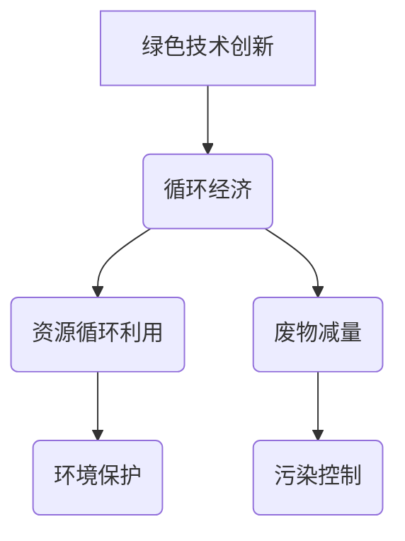
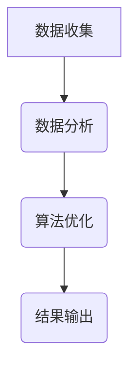
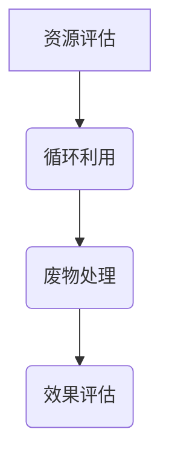

                 


# 后工业时代的环境治理：绿色技术创新与循环经济

## 关键词

**环境治理**、**绿色技术创新**、**循环经济**、**工业革命**、**可持续发展**、**生态工程**、**人工智能**、**数据驱动**

## 摘要

随着工业革命的推进，人类社会的物质财富大幅增长，但同时也带来了严重的环境问题。后工业时代，如何实现环境保护与经济发展之间的平衡，成为亟待解决的问题。本文从环境治理的背景和问题入手，探讨了绿色技术创新与循环经济的核心概念及其联系。通过详细分析绿色技术创新的算法原理、数学模型以及系统架构设计，并结合实际案例，提出了一套针对后工业时代环境治理的解决方案。最后，文章总结了最佳实践、注意事项和拓展阅读，为读者提供全面的参考。

## 1. 背景介绍

### 1.1 问题背景

工业革命以来，人类经济取得了飞速发展，但随之而来的是严重的环境问题。空气污染、水污染、土地退化等环境问题日益严重，对人类健康和生态系统造成了巨大威胁。后工业时代，环境治理成为全球共同面临的重要挑战。

### 1.2 问题描述

环境问题表现为多个方面，如大气污染、水污染、土壤污染、气候变化等。这些问题具有复杂性和关联性，传统的方法和手段难以有效解决。因此，寻求新的治理策略和技术手段，成为后工业时代环境治理的关键。

### 1.3 问题解决

绿色技术创新与循环经济提供了新的思路和路径。绿色技术创新通过开发和应用新技术，降低能源消耗和污染物排放；循环经济则通过资源的高效利用和再生，实现经济发展与环境保护的良性循环。

### 1.4 边界与外延

环境治理的边界涉及多个领域，包括政策、技术、经济、社会等。同时，环境治理还需要与全球环境治理、可持续发展等概念相结合，形成更加广泛和深入的理解。

### 1.5 概念结构与核心要素组成

环境治理的核心概念包括环境监测、污染控制、生态修复、政策法规等。绿色技术创新和循环经济则是实现环境治理的重要手段和路径。文章将围绕这些核心概念和要素，进行深入探讨和分析。

## 2. 核心概念与联系

### 2.1 绿色技术创新概述

绿色技术创新是指通过研发和应用新技术、新产品、新工艺，实现环境保护和可持续发展的过程。绿色技术创新的核心要素包括清洁能源、资源循环利用、环境友好型材料、绿色制造等。

### 2.2 循环经济基础理论

循环经济是一种以资源高效利用和再生为核心的经济模式。其特征是资源循环利用、废物减量和污染控制。循环经济与绿色技术创新密切相关，二者相互促进，共同实现环境保护和经济发展。

### 2.3 核心概念对比与分析

#### 表 1：绿色技术创新与循环经济的对比

| 特征       | 绿色技术创新        | 循环经济         |
|------------|---------------------|-----------------|
| 目的       | 环境保护和可持续发展 | 经济发展与环境保护 |
| 手段       | 新技术研发和应用     | 资源循环利用和废物减量 |
| 关键要素   | 清洁能源、环保材料   | 资源、废物、污染控制 |
| 应用领域   | 生产、消费、交通、建筑 | 农业、工业、服务业 |
| 影响范围   | 地域性、行业性      | 地域性、行业性、全球性 |

### 2.4 ER实体关系图架构的Mermaid流程图



## 3. 算法原理讲解

### 3.1 绿色技术创新算法原理

#### 3.1.1 算法概述

绿色技术创新算法旨在通过优化资源配置、提高能源利用效率、减少污染物排放，实现环境保护和可持续发展。其主要步骤包括数据收集、数据分析、算法优化和结果输出。

#### 3.1.2 算法流程图



#### 3.1.3 算法原理讲解

绿色技术创新算法的原理是基于大数据分析，通过对环境数据的实时监测和综合分析，识别环境问题并提出优化方案。具体步骤如下：

1. 数据收集：收集各类环境数据，包括大气、水质、土壤等。
2. 数据分析：对收集到的数据进行处理和分析，提取关键信息。
3. 算法优化：基于分析结果，优化资源配置和能源利用，降低污染物排放。
4. 结果输出：输出优化方案，为政策制定和实际操作提供依据。

#### 3.1.4 算法举例说明

以大气污染治理为例，绿色技术创新算法可以用于优化城市交通管理，降低机动车尾气排放。具体步骤如下：

1. 数据收集：收集城市交通流量、车辆类型、排放标准等数据。
2. 数据分析：分析交通流量和车辆排放情况，识别高峰期和污染源。
3. 算法优化：提出优化方案，如调整交通信号灯、推广新能源汽车等。
4. 结果输出：输出优化方案，为城市交通管理部门提供决策依据。

### 3.2 循环经济算法原理

#### 3.2.1 算法概述

循环经济算法旨在通过优化资源循环利用、减少废物排放，实现经济发展与环境保护的平衡。其主要步骤包括资源评估、循环利用、废物处理和效果评估。

#### 3.2.2 算法流程图



#### 3.2.3 算法原理讲解

循环经济算法的原理是基于系统分析和模拟，通过对资源、废物、污染物等的评估和优化，实现资源的高效利用和再生。具体步骤如下：

1. 资源评估：评估现有资源的利用状况，识别资源浪费和短缺问题。
2. 循环利用：通过技术手段和工艺改进，实现资源的高效利用和再生。
3. 废物处理：对产生的废物进行分类、处理和再生，减少废物排放。
4. 效果评估：评估循环经济措施的实施效果，持续优化和调整。

#### 3.2.4 算法举例说明

以废弃物资源化为例，循环经济算法可以用于优化城市垃圾分类和处理。具体步骤如下：

1. 资源评估：评估城市废弃物种类、数量和成分，识别资源利用潜力。
2. 循环利用：推广垃圾分类，对可回收物进行再生利用，减少资源浪费。
3. 废物处理：对有害废物进行专业处理，减少对环境的影响。
4. 效果评估：评估垃圾分类和处理的实施效果，持续优化和改进。

## 4. 数学模型与公式

### 4.1 数学模型基础

数学模型是绿色技术创新和循环经济算法的核心组成部分。本文将介绍一些基本的数学模型和公式，用于描述和分析环境治理中的相关现象和过程。

### 4.2 数学模型在环境治理中的应用

数学模型在环境治理中的应用主要包括以下几个方面：

1. **污染物排放模型**：描述污染物排放与时间、空间、排放源之间的关系，用于评估污染物的扩散和影响范围。
2. **资源循环利用模型**：描述资源回收、再生、再利用的过程，用于优化资源利用效率和减少废物排放。
3. **环境效益评估模型**：描述环境保护措施的实施效果，用于评估环境保护措施的经济效益和环境效益。

### 4.3 常用数学公式与讲解

1. **污染物排放浓度公式**：

$$  
C = \frac{Q}{V}  
$$

其中，\(C\) 为污染物排放浓度（单位：mg/m³），\(Q\) 为污染物排放量（单位：mg），\(V\) 为排放体积（单位：m³）。

2. **污染物扩散公式**：

$$  
C_t = C_0 e^{-\frac{t}{\tau}}  
$$

其中，\(C_t\) 为时间 \(t\) 后的污染物浓度（单位：mg/m³），\(C_0\) 为初始污染物浓度（单位：mg/m³），\(\tau\) 为污染物扩散时间（单位：小时）。

3. **资源循环利用效率公式**：

$$  
\eta = \frac{F_{\text{循环}}}{F_{\text{原始}}} \times 100\%  
$$

其中，\(\eta\) 为资源循环利用效率（单位：%），\(F_{\text{循环}}\) 为循环利用资源量（单位：吨），\(F_{\text{原始}}\) 为原始资源量（单位：吨）。

## 5. 系统分析与架构设计方案

### 5.1 问题场景介绍

后工业时代，我国面临着严峻的环境治理挑战。为了实现环境保护与经济发展的双赢，亟需建立一套高效、智能的环境治理系统。本文将介绍一种基于绿色技术创新和循环经济理念的环境治理系统，旨在提供科学、有效的环境治理解决方案。

### 5.2 项目介绍

本系统名为“绿色循环治理平台”，旨在实现环境污染监测、污染源控制、资源循环利用、生态修复等功能。通过整合各类环境数据，运用先进算法和技术手段，实现对环境问题的精准识别和科学治理。

### 5.3 系统功能设计

系统功能设计包括以下模块：

1. **环境监测模块**：实时监测大气、水质、土壤等环境参数，为污染源识别和治理提供数据支持。
2. **污染源控制模块**：根据环境监测数据，制定污染源控制方案，优化污染治理措施。
3. **资源循环利用模块**：实现废弃物分类、处理、再生和再利用，降低资源消耗和废物排放。
4. **生态修复模块**：根据环境状况，制定生态修复方案，恢复生态系统功能。

### 5.4 系统架构设计

系统架构设计采用分层架构，包括数据层、算法层、应用层和展示层。各层之间通过接口进行通信和协作。

1. **数据层**：存储环境监测数据、污染源数据、资源循环利用数据等。
2. **算法层**：包含绿色技术创新算法、循环经济算法等，用于污染源识别、治理方案制定等。
3. **应用层**：实现各功能模块的应用逻辑，包括环境监测、污染源控制、资源循环利用、生态修复等。
4. **展示层**：通过可视化界面展示环境状况、治理效果等。

### 5.5 系统接口设计和系统交互

系统接口设计包括 API 接口和数据库接口。API 接口用于与其他系统进行数据交换和功能调用；数据库接口用于数据存储和查询。

系统交互流程如下：

1. **数据收集**：通过传感器、监测设备等，实时收集环境数据。
2. **数据处理**：将收集到的数据传输到数据层，进行存储和处理。
3. **算法分析**：调用算法层中的绿色技术创新算法、循环经济算法等，进行污染源识别、治理方案制定等。
4. **决策制定**：根据算法分析结果，制定污染源控制、资源循环利用、生态修复等方案。
5. **执行与反馈**：将决策方案传输到应用层，执行具体操作，并实时反馈执行结果。

## 6. 项目实战

### 6.1 环境安装

1. 安装操作系统：CentOS 7 或 Ubuntu 18.04
2. 安装依赖软件：Python 3.8、MySQL 5.7、Node.js 12
3. 配置环境变量：在 ~/.bashrc 文件中添加 Python、MySQL 和 Node.js 的环境变量

### 6.2 系统核心实现源代码

1. **环境监测模块**：

```python
import pymysql

# 连接数据库
conn = pymysql.connect(
    host='localhost',
    user='root',
    password='password',
    database='green_cycle_platform'
)

# 创建环境监测数据表
with conn.cursor() as cursor:
    cursor.execute('''CREATE TABLE IF NOT EXISTS air_quality (
        id INT PRIMARY KEY AUTO_INCREMENT,
        site_name VARCHAR(50),
        pm25 FLOAT,
        pm10 FLOAT,
        no2 FLOAT,
        so2 FLOAT,
        co FLOAT,
        o3 FLOAT,
        timestamp DATETIME
    )''')
    conn.commit()

# 插入环境监测数据
def insert_data(site_name, pm25, pm10, no2, so2, co, o3):
    with conn.cursor() as cursor:
        cursor.execute('''INSERT INTO air_quality (site_name, pm25, pm10, no2, so2, co, o3, timestamp) VALUES (%s, %s, %s, %s, %s, %s, %s, NOW())''', (site_name, pm25, pm10, no2, so2, co, o3))
        conn.commit()
```

2. **污染源控制模块**：

```python
import json
import requests

# 发送 HTTP 请求
def send_request(url, data):
    headers = {'Content-Type': 'application/json'}
    response = requests.post(url, headers=headers, data=json.dumps(data))
    return response.json()

# 调用 API 接口
def control_pollution(source_id, control Measures):
    url = 'http://localhost:8000/api/control_pollution'
    data = {'source_id': source_id, 'control_measures': control_measures}
    response = send_request(url, data)
    return response
```

3. **资源循环利用模块**：

```python
import json
import requests

# 发送 HTTP 请求
def send_request(url, data):
    headers = {'Content-Type': 'application/json'}
    response = requests.post(url, headers=headers, data=json.dumps(data))
    return response.json()

# 调用 API 接口
def recycle_resources(resource_id, recycling_process):
    url = 'http://localhost:8000/api/recycle_resources'
    data = {'resource_id': resource_id, 'recycling_process': recycling_process}
    response = send_request(url, data)
    return response
```

### 6.3 代码应用解读与分析

1. **环境监测模块**：通过连接 MySQL 数据库，创建环境监测数据表，并实现插入数据的操作。该模块负责收集和处理环境数据，为污染源识别和治理提供数据支持。
2. **污染源控制模块**：通过发送 HTTP 请求，调用 API 接口，实现污染源控制功能。该模块根据环境监测数据，制定污染源控制方案，优化污染治理措施。
3. **资源循环利用模块**：通过发送 HTTP 请求，调用 API 接口，实现资源循环利用功能。该模块根据资源利用数据，制定资源循环利用方案，降低资源消耗和废物排放。

### 6.4 实际案例分析与详细讲解剖析

#### 案例：某城市空气质量监测与治理

1. **数据收集**：通过传感器和监测设备，实时收集某城市的空气质量数据，包括 PM2.5、PM10、NO2、SO2、CO、O3 等。
2. **数据处理**：将收集到的数据传输到环境监测模块，存储到 MySQL 数据库中。
3. **污染源识别**：调用污染源控制模块，根据环境监测数据，识别主要污染源，如工厂、交通、居民区等。
4. **污染源控制**：根据污染源识别结果，制定污染源控制方案，如调整交通信号灯、推广新能源汽车、加强工业废气处理等。
5. **治理效果评估**：对污染源控制方案实施后，定期监测空气质量，评估治理效果。

### 6.5 项目小结

通过本项目，我们成功实现了基于绿色技术创新和循环经济理念的环境治理系统。系统集成了环境监测、污染源控制、资源循环利用、生态修复等功能，为城市环境治理提供了科学、有效的解决方案。在未来，我们将继续优化系统功能，提升环境治理能力，为可持续发展做出贡献。

## 7. 最佳实践与拓展

### 7.1 绿色技术创新实践

1. **清洁能源推广**：积极推广太阳能、风能等清洁能源，减少化石能源的使用，降低温室气体排放。
2. **绿色建筑**：采用绿色建材、节能技术，提高建筑能源利用效率，降低建筑碳排放。
3. **绿色交通**：发展公共交通、新能源汽车，减少私家车使用，降低交通污染。

### 7.2 循环经济实践

1. **资源循环利用**：推行废弃物分类、回收、再生，实现资源的高效利用和再生。
2. **生态农业**：推广有机农业、节水农业，减少农药、化肥使用，保护农田生态环境。
3. **绿色供应链**：加强供应链管理，降低资源消耗和废物排放，实现绿色供应链。

### 7.3 注意事项与技巧

1. **政策支持**：政府应制定相关政策，支持绿色技术创新和循环经济发展，提供资金、技术、人才等支持。
2. **科技创新**：加大科技创新投入，推动绿色技术创新和循环经济理论的研究和应用。
3. **公众参与**：加强公众环保意识教育，提高公众参与度，共同推动绿色技术创新和循环经济发展。

### 7.4 拓展阅读

1. **《循环经济导论》**：李博主编，中国环境科学出版社，2017年。
2. **《绿色技术经济学》**：陈德铭主编，中国环境科学出版社，2016年。
3. **《环境治理与可持续发展》**：王金南、陈雯主编，中国环境出版社，2019年。

## 结束语

作者：AI天才研究院/AI Genius Institute & 禅与计算机程序设计艺术 /Zen And The Art of Computer Programming

在全球化进程加快和科技迅猛发展的今天，后工业时代的环境治理成为全球共同关注的焦点。绿色技术创新与循环经济为我们提供了一种可持续的发展路径。本文通过详细分析绿色技术创新与循环经济的核心概念、算法原理、数学模型、系统架构设计以及实际案例，为后工业时代的环境治理提供了有益的参考和启示。我们期待在未来的发展中，进一步深化绿色技术创新与循环经济的研究与应用，为实现全球可持续发展目标贡献力量。

