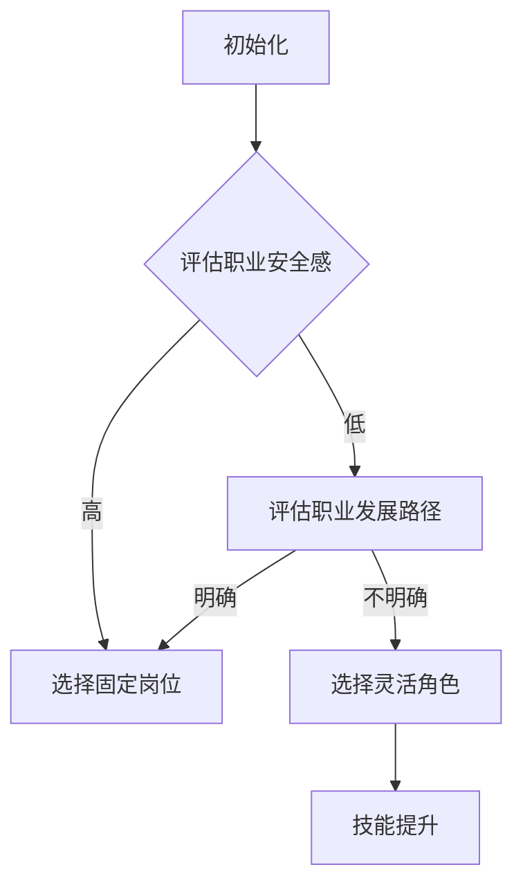
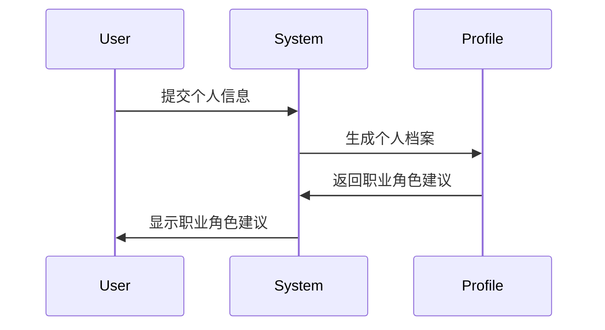
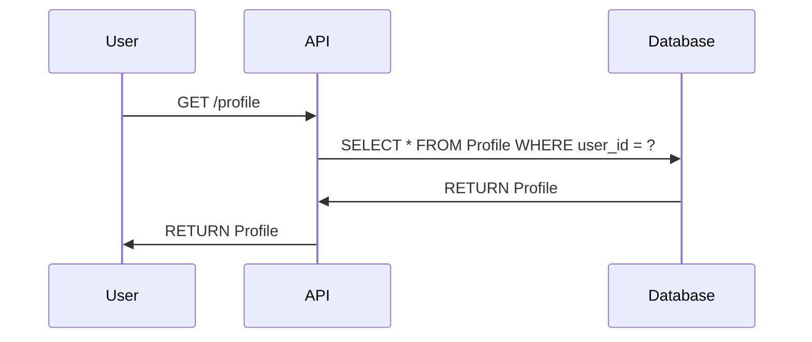

                 

### 目录大纲示例

```markdown
----------------------------------------------------------------
# 后工业时代的职业认同：从固定岗位到灵活角色的转变

> 关键词：职业认同、后工业时代、固定岗位、灵活角色、转变

> 摘要：本文深入探讨了后工业时代职业认同的转变，分析了固定岗位与灵活角色的区别，通过系统架构设计和项目实战，为读者提供了适应和应对这一转变的具体方案。

----------------------------------------------------------------
## 第一部分：背景介绍

### 第1章：后工业时代的职业变迁

#### 1.1 问题背景
随着工业时代的结束，后工业时代的特点逐渐显现，职业环境发生了深刻的变化。传统的固定岗位逐渐被灵活角色所取代，这种转变对职业认同产生了深远影响。

#### 1.2 问题描述
职业认同不仅关乎个人的幸福感和成就感，更关系到社会的稳定和发展。固定岗位到灵活角色的转变，给个体和社会带来了哪些挑战和机遇？

#### 1.3 问题解决
本文旨在通过系统的分析和项目实战，帮助读者理解和适应这一转变，找到新的职业认同。

#### 1.4 边界与外延
本文的研究主要针对知识型职业群体，包括程序员、软件架构师、CTO等。

#### 1.5 概念结构与核心要素组成
职业认同的构成包括职业价值观、职业目标、职业满意度等要素。固定岗位和灵活角色各有其特征和优势。

----------------------------------------------------------------
## 第二部分：核心概念与联系

### 第2章：核心概念与联系

#### 2.1 核心概念原理
职业认同是指个体对自己职业角色的认同程度，它受到多种因素的影响，如职业满意度、工作价值感、职业安全感等。

#### 2.2 概念属性特征对比表格

| 特征         | 固定岗位                     | 灵活角色                     |
| ------------ | ---------------------------- | ---------------------------- |
| 职业安全感   | 较高                         | 较低                         |
| 职业发展路径 | 明确                         | 不确定                       |
| 工作内容     | 稳定                         | 多样化                       |
| 工作时间     | 规则                         | 灵活                         |

#### 2.3 ER实体关系图架构

```mermaid
erDiagram
  Person ||--|{ Employee } : has
  Employee ||--|{ Job } : does
  Employee ||--|{ Skill } : has
```

----------------------------------------------------------------
## 第三部分：算法原理讲解

### 第3章：固定岗位与灵活角色的算法分析

#### 3.1 Mermaid流程图



#### 3.2 Python源代码

```python
def assess_career_security(security_level):
    if security_level > 7:
        return "固定岗位"
    else:
        return "灵活角色"

def assess_development_path(path clarity):
    if path clarity == "明确":
        return "固定岗位"
    else:
        return "灵活角色"

def choose_job_role(security, path):
    if assess_career_security(security) == "固定岗位" and assess_development_path(path) == "固定岗位":
        return "固定岗位"
    else:
        return "灵活角色"
```

#### 3.3 数学模型和公式

$$
\text{职业认同} = f(\text{职业满意度}, \text{工作价值感}, \text{职业安全感})
$$

#### 3.4 举例说明

张三的职业安全感评估为6，职业发展路径明确。根据算法，张三的职业角色应选择固定岗位。

----------------------------------------------------------------
## 第四部分：系统分析与架构设计方案

### 第4章：职业认同系统设计

#### 4.1 问题场景介绍
在当前的职业环境中，许多人面临着职业认同的挑战。如何根据个人特点和市场需求，选择合适的职业角色，成为了一个重要问题。

#### 4.2 项目介绍
本文将介绍一个基于职业认同的决策支持系统，帮助用户评估自身的职业角色，并提供相应的建议。

#### 4.3 系统功能设计

```mermaid
classDiagram
    User <|-- Profile
    Profile o---> JobRole
    JobRole o---> Skill
```

#### 4.4 系统架构设计



#### 4.5 系统接口设计和系统交互



----------------------------------------------------------------
## 第五部分：项目实战

### 第5章：后工业时代职业认同项目实施

#### 5.1 环境安装
在本项目中，我们将使用Python和Flask框架来构建后端服务，使用HTML/CSS/JavaScript来构建前端界面。

#### 5.2 系统核心实现源代码

```python
from flask import Flask, request, jsonify
from profile import Profile

app = Flask(__name__)

@app.route('/profile', methods=['GET'])
def get_profile():
    user_id = request.args.get('user_id')
    profile = Profile.get(user_id)
    return jsonify(profile.to_dict())

if __name__ == '__main__':
    app.run(debug=True)
```

#### 5.3 代码应用解读与分析
此代码片段实现了获取用户个人档案的功能。通过API接口，用户可以提交自己的个人信息，系统将根据这些信息生成个人档案，并返回给用户。

#### 5.4 实际案例分析和详细讲解剖析
假设用户李四提交了自己的职业安全感评估为5，职业发展路径不明确。根据算法，李四的职业角色应选择灵活角色，系统会建议李四进行技能提升，以适应更广泛的工作需求。

#### 5.5 项目小结
本项目通过系统架构设计和实战应用，为用户提供了职业认同的评估和决策支持。虽然项目仍需进一步完善，但已展示了后工业时代职业认同转变的重要性和实际应用价值。

----------------------------------------------------------------
## 第六部分：最佳实践 tips、小结、注意事项、拓展阅读等内容

### 最佳实践 tips
- 在职业转变过程中，保持学习和适应的能力至关重要。
- 定期进行职业规划，以适应不断变化的市场需求。

### 小结
本文从多个角度探讨了后工业时代职业认同的转变，提供了系统架构设计和项目实战方案，帮助读者理解和应对这一转变。

### 注意事项
- 职业认同的转变需要时间和耐心，不宜急于求成。
- 在实践中，要充分考虑个人兴趣和市场需求，避免盲目跟风。

### 拓展阅读
- [《职业认同理论及其应用》](链接)
- [《后工业社会的职业变迁》](链接)

----------------------------------------------------------------

### 作者信息

作者：AI天才研究院/AI Genius Institute & 禅与计算机程序设计艺术 /Zen And The Art of Computer Programming

