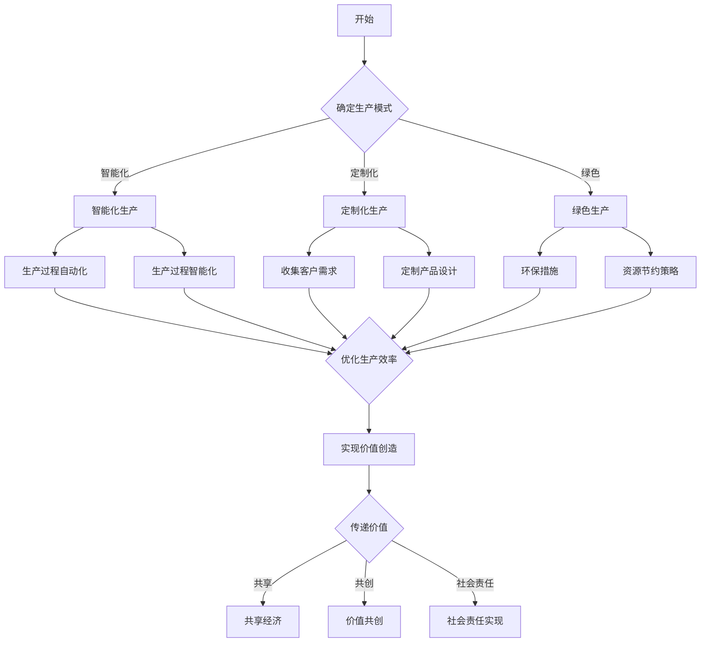

                 

# 后工作时代：重新定义生产与价值

> 关键词：后工作时代，生产，价值，数字化，智能化，共享经济

> 摘要：本文旨在探讨后工作时代的背景、特征以及重新定义生产与价值的必要性。通过分析后工作时代的生产方式变革、价值创造与传递，本文揭示了共享经济与价值共创的理念，以及社会责任在价值实现中的重要作用。最后，本文提出了新型商业模式与价值创新的实践路径。

## 第一部分：背景介绍

### 1.1 后工作时代概述

#### 1.1.1 后工作时代的背景

后工作时代是指在信息技术高度发达、全球化深入发展的背景下，人们的工作方式、生产方式和社会结构发生深刻变革的时期。这一时期的到来，与工业革命和数字化转型的关系密不可分。工业革命带来了生产力的飞速提升，而数字化转型则进一步加速了这一进程，使得生产方式和价值创造模式发生了根本性的变化。

信息技术革命的影响不可忽视。计算机技术、互联网技术、人工智能技术的飞速发展，极大地改变了人们的工作和生活方式。这些技术的广泛应用，不仅推动了各行各业的数字化转型，也带来了新的生产方式和商业模式。

社会变迁与工作形态的演变是后工作时代的重要特征。随着信息技术的发展，传统的“朝九晚五”的工作模式逐渐被打破，远程办公、弹性工作制等新型工作方式日益普及。同时，人们对于工作与生活的平衡、个性化和多样化的工作需求也日益增强。

#### 1.1.2 后工作时代的定义与特征

后工作时代的定义：后工作时代是指以信息技术为核心，以数字化、智能化、去中心化为特征，以共享经济和共创价值为核心理念，重新定义生产与价值创造的社会发展阶段。

后工作时代的特征：

1. **去中心化**：信息技术的发展打破了传统中央集权的生产方式，去中心化的分布式网络成为了新的生产组织形式。

2. **智能协同**：人工智能和大数据技术的应用，使得智能协同成为可能，生产效率和资源配置更加高效。

3. **虚拟工作空间**：虚拟现实和增强现实技术的应用，使得工作空间不再局限于物理场所，远程办公、虚拟会议等成为常态。

4. **价值共创**：后工作时代强调企业、员工、消费者等多方共同参与价值创造，实现共赢。

#### 1.1.3 后工作时代的意义

后工作时代对生产方式的重新定义：在信息技术和数字经济的大背景下，生产方式从传统的集中式、规模化生产转向分布式、个性化定制生产。这种转变不仅提高了生产效率，也满足了消费者对个性化和多样性的需求。

对价值创造的重新思考：后工作时代强调共享经济和共创价值，使得价值创造不再局限于传统的生产关系，而是更加注重多方协同和资源整合。

对社会发展的影响：后工作时代对社会发展产生了深远的影响，推动了经济增长、就业结构变化、城市化进程等方面的发展。

### 1.2 重新定义生产与价值

#### 1.2.1 生产的重新定义

传统生产模式的分析：

1. **特点**：传统的生产模式以规模化、标准化为特点，注重降低成本和提高效率。

2. **局限性**：随着信息技术的发展，传统生产模式在满足个性化和多样化需求方面存在局限。

数字化生产模式的演变：

1. **特点**：数字化生产模式以灵活、高效、个性化为特点，能够更好地满足市场需求。

2. **优势**：数字化生产模式提高了生产效率，降低了成本，增强了市场竞争力。

新生产模式下的特点：

1. **高效**：数字化技术和智能化设备的广泛应用，使得生产过程更加高效。

2. **灵活**：生产模式更加灵活，能够快速响应市场变化。

3. **个性化**：生产方式更加注重个性化和多样化需求。

#### 1.2.2 价值的重新定义

传统价值观念的变迁：

1. **特点**：传统的价值观念以物质财富积累为主，注重个人利益。

2. **局限性**：随着社会的发展，传统价值观念在满足人们精神文化需求方面存在局限。

新价值观念的塑造：

1. **特点**：新价值观念以共享、共创、可持续发展为特点，注重社会整体利益。

2. **优势**：新价值观念能够更好地满足人们日益增长的精神文化需求，推动社会进步。

#### 1.2.3 生产与价值的联系

生产方式的变革对价值创造的影响：

1. **提高效率**：生产方式变革提高了生产效率，从而提高了价值创造的能力。

2. **优化资源配置**：生产方式变革优化了资源配置，提高了资源利用效率。

价值创造对生产方式的反作用：

1. **推动创新**：价值创造需求推动了技术创新，促进了生产方式的变革。

2. **引导资源配置**：价值创造需求引导了资源配置，优化了生产方式。

### 1.3 后工作时代的挑战与机遇

#### 1.3.1 挑战

1. **技术创新与人才需求的矛盾**：技术创新速度加快，但人才需求难以满足，特别是高端技术人才短缺。

2. **新生产模式下的法律与伦理问题**：新生产模式带来了法律和伦理挑战，如数据隐私、劳动权益等。

3. **全球化背景下的竞争与合作**：全球化背景下，竞争加剧，但也需要加强合作，共同应对挑战。

#### 1.3.2 机遇

1. **数字经济的崛起**：数字经济成为经济增长的新引擎，为后工作时代提供了广阔的发展空间。

2. **创新创业的蓬勃发展**：创新创业氛围浓厚，为后工作时代提供了源源不断的创新动力。

3. **跨界融合的无限可能**：跨界融合带来了新的商业模式和产业形态，为后工作时代提供了新的发展机遇。

### 1.4 本章小结

本章从背景介绍出发，分析了后工作时代的背景、特征和意义，并探讨了重新定义生产与价值的必要性。后工作时代的到来，不仅带来了生产方式的变革，也引发了价值观念的转变。面对挑战与机遇，我们需要积极探索新的发展路径，推动后工作时代的可持续发展。

----------------------------------------------------------------

## 第二部分：重新定义生产

### 2.1 生产力革命与生产方式的变革

#### 2.1.1 生产力革命的历史回顾

1. **第一次生产力革命：机械化**

   - 时间：18世纪末至19世纪初
   - 特点：蒸汽机的发明和应用，机械化生产逐渐取代手工劳动
   - 影响：生产效率大幅提升，劳动力成本降低

2. **第二次生产力革命：电气化**

   - 时间：19世纪末至20世纪初
   - 特点：电力成为主要动力来源，大规模生产线和自动化设备普及
   - 影响：生产效率进一步提高，生产过程更加连续和稳定

3. **第三次生产力革命：信息化**

   - 时间：20世纪末至21世纪初
   - 特点：计算机技术和互联网的广泛应用，信息技术成为新的生产力
   - 影响：生产模式从规模化、标准化向分布式、个性化定制转变

#### 2.1.2 生产方式的变革

1. **传统生产方式的特点**

   - **规模化**：注重生产规模的扩大，追求规模效应
   - **标准化**：产品规格统一，生产过程标准化
   - **集中化**：生产过程集中在特定地点，管理集中

2. **数字化生产方式的演进**

   - **信息化**：计算机技术和互联网的应用，生产过程数据化
   - **智能化**：人工智能技术的应用，生产过程自动化和智能化
   - **个性化**：根据用户需求定制生产，满足个性化需求

3. **新生产模式的优势与挑战**

   - **优势**：

     - 高效：数字化、智能化技术提高生产效率
     - 灵活：个性化定制满足多样化需求
     - 可持续：资源利用效率提高，减少环境污染

   - **挑战**：

     - 技术创新：需要不断更新技术，以保持竞争力
     - 人才培养：需要大量高素质人才支持生产方式变革
     - 法律与伦理：需要制定相关法律法规，保障数据隐私和劳动者权益

### 2.2 智能化生产与大数据

#### 2.2.1 智能化生产的概念与特点

1. **概念**：智能化生产是指利用人工智能技术，实现生产过程的自动化、智能化和高效化。

2. **特点**：

   - **自动化**：生产设备具备自我调节、自我控制能力
   - **智能化**：生产过程能够根据实时数据自主优化
   - **高效化**：生产效率大幅提升，资源利用率提高

#### 2.2.2 大数据在智能化生产中的作用

1. **概念**：大数据是指海量、高增长速度、多样化的数据集合。

2. **特点**：

   - **海量**：数据量巨大，需要高效的数据处理技术
   - **高速**：数据产生速度极快，需要实时处理
   - **多样化**：数据类型丰富，包括结构化和非结构化数据

3. **大数据在智能化生产中的应用**：

   - **生产优化**：通过分析生产数据，优化生产流程，提高生产效率
   - **质量控制**：实时监测产品质量，预防质量问题的发生
   - **设备维护**：预测设备故障，提前进行维护，减少停机时间

4. **大数据对生产效率的影响**：

   - 提高生产效率：通过数据分析，优化生产流程，提高生产效率
   - 降低生产成本：通过优化生产流程，减少资源浪费，降低生产成本
   - 提高产品质量：通过实时监测产品质量，预防质量问题的发生

### 2.3 定制化生产与个性化需求

#### 2.3.1 定制化生产的概念与实现

1. **概念**：定制化生产是指根据客户需求，定制生产产品或提供服务。

2. **实现**：

   - **需求收集**：通过市场调研和客户反馈，收集客户需求
   - **产品设计**：根据需求，设计满足客户需求的产品
   - **生产制造**：根据产品设计，进行生产制造
   - **售后服务**：提供客户服务，解决客户问题

#### 2.3.2 个性化需求与定制化生产

1. **个性化需求的定义与特点**

   - **定义**：个性化需求是指客户对产品或服务的特定需求，反映了客户的个性化偏好。
   - **特点**：

     - **多样性**：客户需求多样化，难以统一标准化
     - **变化性**：客户需求变化较快，需要快速响应
     - **个性化**：满足客户独特的需求，体现客户个性

2. **个性化需求对生产的影响**

   - **提高生产成本**：个性化生产需要更多的设计和生产准备，增加了生产成本
   - **提高产品质量**：个性化生产能够更好地满足客户需求，提高产品质量
   - **增强客户满意度**：满足客户个性化需求，提高客户满意度

3. **个性化需求的满足策略**

   - **需求分析**：通过数据分析，了解客户需求，为定制化生产提供依据
   - **灵活生产**：采用灵活的生产方式，快速响应客户需求
   - **个性化服务**：提供个性化的售后服务，增强客户满意度

### 2.4 绿色生产与可持续发展

#### 2.4.1 绿色生产的概念与原则

1. **概念**：绿色生产是指在生产过程中，注重环境保护，减少资源浪费，实现可持续发展的生产方式。

2. **原则**：

   - **环保优先**：在生产过程中，注重环境保护，减少污染物排放
   - **资源节约**：提高资源利用效率，减少资源浪费
   - **可持续发展**：实现生产与环境的和谐发展，为后代留下良好的生态环境

#### 2.4.2 可持续发展与绿色生产

1. **可持续发展**：

   - **定义**：可持续发展是指满足当前需求，不损害后代满足自身需求的能力。
   - **内涵**：包括经济、社会和环境三个方面的可持续发展。

2. **绿色生产与可持续发展之间的关系**：

   - **相互促进**：绿色生产是实现可持续发展的重要手段，可持续发展是绿色生产的目标。
   - **共同发展**：绿色生产和可持续发展相互促进，共同推动社会进步。

3. **可持续发展的实现路径**：

   - **技术创新**：通过技术创新，提高生产效率，降低资源消耗。
   - **制度保障**：建立完善的法律法规，保障绿色生产的实施。
   - **公众参与**：提高公众环保意识，鼓励公众参与绿色生产。

### 2.5 本章小结

本章从生产力革命和生产方式的变革出发，探讨了智能化生产、大数据、定制化生产、绿色生产和可持续发展等内容。随着信息技术的不断发展，生产方式正在发生深刻变革，智能化、定制化和绿色生产成为新的发展趋势。在重新定义生产的过程中，我们需要注重技术创新、人才培养和可持续发展，以适应后工作时代的需求。

----------------------------------------------------------------

## 第三部分：重新定义价值

### 3.1 价值创造与价值传递

#### 3.1.1 价值创造的概念与过程

1. **概念**：价值创造是指企业通过生产活动，将资源转化为产品或服务，满足市场需求，实现利润的过程。

2. **过程**：

   - **资源投入**：企业投入人力、物力、财力等资源。
   - **生产活动**：通过生产活动，将资源转化为产品或服务。
   - **市场需求**：产品或服务满足市场需求，实现价值。
   - **利润实现**：通过市场销售，实现利润。

#### 3.1.2 价值传递的概念与途径

1. **概念**：价值传递是指企业通过产品或服务，将价值传递给消费者，实现价值增值的过程。

2. **途径**：

   - **产品或服务**：通过产品或服务的质量、性能、品牌等，实现价值传递。
   - **市场营销**：通过市场营销手段，提高产品或服务的知名度和美誉度，实现价值传递。
   - **客户服务**：通过优质的客户服务，增强客户满意度，实现价值传递。

#### 3.1.3 价值传递的渠道分析

1. **直接渠道**：企业直接向消费者销售产品或服务，实现价值传递。

   - **优点**：控制力强，能够直接了解消费者需求。
   - **缺点**：销售范围有限，成本较高。

2. **间接渠道**：企业通过中间商或分销商向消费者销售产品或服务，实现价值传递。

   - **优点**：销售范围广，成本较低。
   - **缺点**：控制力较弱，需要依赖中间商。

#### 3.1.4 价值传递的障碍与对策

1. **障碍**：

   - **信息不对称**：消费者对企业产品或服务的了解不足，导致价值传递受阻。
   - **市场环境不稳定**：市场环境变化，影响价值传递的效果。

2. **对策**：

   - **加强市场营销**：通过广告宣传、促销活动等，提高产品或服务的知名度。
   - **提高产品或服务质量**：通过技术创新、质量管理等，提高产品或服务的质量。
   - **优化渠道**：根据市场需求，选择合适的销售渠道，提高价值传递效率。

### 3.2 共享经济与价值共创

#### 3.2.1 共享经济的兴起与特点

1. **兴起背景**：

   - **资源过剩**：随着信息技术的发展，资源过剩问题日益突出。
   - **消费升级**：消费者需求多样化，对个性化和高品质服务需求增加。

2. **主要形式**：

   - **共享住宿**：如Airbnb，通过共享闲置房屋，满足消费者住宿需求。
   - **共享出行**：如Uber、滴滴，通过共享车辆，满足消费者出行需求。
   - **共享办公**：如WeWork，通过共享办公空间，满足创业者和企业需求。

3. **特点**：

   - **去中心化**：共享经济打破了传统中心化的商业模式，实现资源的高效利用。
   - **灵活性**：共享经济提供灵活的服务，满足消费者个性化需求。
   - **共享性**：共享经济强调资源共享，实现多方共赢。

#### 3.2.2 价值共创的理念与实践

1. **概念**：价值共创是指企业、员工、消费者等多方共同参与价值创造，实现共赢。

2. **核心要素**：

   - **协同合作**：企业、员工、消费者等多方协同合作，共同创造价值。
   - **资源共享**：各方共享资源，提高资源利用效率。
   - **创新能力**：通过创新，不断提升产品或服务的价值。

3. **实践案例**：

   - **小米**：通过用户参与研发、设计，实现产品创新，提升用户体验。
   - **阿里巴巴**：通过生态系统建设，连接商家、消费者，实现价值共创。

### 3.3 社会责任与价值实现

#### 3.3.1 社会责任的概念与内涵

1. **概念**：社会责任是指企业承担的社会责任，包括环保、慈善、公益等。

2. **内涵**：

   - **环境保护**：企业关注环境保护，减少环境污染。
   - **慈善公益**：企业参与慈善公益活动，回馈社会。
   - **社会责任报告**：企业公开社会责任报告，接受社会监督。

#### 3.3.2 价值实现与社会责任

1. **价值实现的基本路径**：

   - **经济效益**：通过企业运营，实现经济效益，为股东创造价值。
   - **社会效益**：通过社会责任，实现社会效益，为社会创造价值。

2. **社会责任在价值实现中的作用**：

   - **提升品牌形象**：社会责任有助于提升企业品牌形象，增强市场竞争力。
   - **增强员工满意度**：社会责任有助于增强员工满意度，提升企业凝聚力。
   - **吸引消费者**：社会责任有助于吸引消费者，提升产品或服务的市场竞争力。

3. **社会责任的价值实现策略**：

   - **公益项目**：企业参与公益项目，提升社会责任形象。
   - **环保措施**：企业采取环保措施，减少环境污染。
   - **员工福利**：企业关注员工福利，提升员工满意度。

### 3.4 新型商业模式与价值创新

#### 3.4.1 新型商业模式的概念与类型

1. **概念**：新型商业模式是指企业通过创新，建立新的商业体系，实现价值创造和传递。

2. **类型**：

   - **平台型商业模式**：如阿里巴巴、腾讯，通过搭建平台，连接商家和消费者，实现价值传递。
   - **生态型商业模式**：如小米、华为，通过构建生态系统，实现产业链协同，提升竞争力。
   - **共享型商业模式**：如Uber、Airbnb，通过共享资源，实现多方共赢。

#### 3.4.2 价值创新与新型商业模式

1. **价值创新**：

   - **概念**：价值创新是指通过创新，提升产品或服务的价值，满足消费者需求。
   - **方式**：

     - **技术创新**：通过技术创新，提升产品或服务的性能和质量。
     - **服务创新**：通过服务创新，提升消费者体验和满意度。
     - **模式创新**：通过模式创新，实现新的商业模式和价值创造。

2. **新型商业模式的实践**：

   - **案例1**：共享经济模式，通过共享资源，实现价值共创。
   - **案例2**：平台经济模式，通过搭建平台，实现价值传递和增值。

### 3.5 本章小结

本章从价值创造与传递、共享经济与价值共创、社会责任与价值实现、新型商业模式与价值创新等方面，探讨了重新定义价值的重要性。在后工作时代，价值创造与传递的方式正在发生深刻变革，企业需要不断创新，实现价值共创，承担社会责任，以适应新的发展需求。通过共享经济、平台经济等新型商业模式，企业可以实现价值创新，提升竞争力，实现可持续发展。

----------------------------------------------------------------

## 总结与展望

后工作时代是对传统工作方式和价值观念的深刻反思与重新定义。在这一时代，生产方式从传统的集中式、规模化生产向分布式、个性化定制生产转变，智能化、大数据、定制化生产等新生产模式日益普及。同时，价值创造与传递的方式也在发生变革，共享经济、价值共创、社会责任等理念逐渐成为企业发展的核心。

### 总结

后工作时代的主要特征可以归纳为：

1. **去中心化**：信息技术的发展打破了传统中央集权的生产模式，分布式网络成为新的生产组织形式。
2. **智能协同**：人工智能和大数据技术的应用，使得生产过程更加高效和智能化。
3. **虚拟工作空间**：虚拟现实和增强现实技术的应用，使得工作空间不再局限于物理场所。
4. **价值共创**：企业、员工、消费者等多方共同参与价值创造，实现共赢。

### 展望

后工作时代的未来发展趋势：

1. **智能化生产**：随着人工智能技术的不断发展，智能化生产将更加普及，生产效率和质量将得到进一步提升。
2. **定制化生产**：个性化需求日益增长，定制化生产将成为主流生产方式，满足消费者多样化需求。
3. **绿色生产**：随着环保意识的提高，绿色生产将成为企业发展的必然选择，实现可持续发展。
4. **共享经济**：共享经济将继续发展，成为新的经济增长点，推动社会资源的高效利用。
5. **跨界融合**：跨界融合将成为新的商业模式，不同行业之间的融合将为企业带来新的发展机遇。

### 思考与建议

1. **企业战略调整**：企业需要根据后工作时代的特征，调整发展战略，实现智能化、定制化和绿色生产。
2. **人才培养**：企业需要注重人才培养，提升员工技能和素质，以适应新技术和新生产模式的要求。
3. **社会责任**：企业需要承担社会责任，关注环境保护和公益活动，提升企业形象，实现可持续发展。
4. **创新驱动**：企业需要持续创新，通过技术创新、模式创新等，实现价值创新，提升竞争力。

### 结语

后工作时代是一个充满机遇和挑战的时代，企业需要紧跟时代潮流，积极探索新的发展路径，实现生产与价值的重新定义。通过智能化、定制化、绿色生产等新模式，共享经济、价值共创等新理念，企业将能够更好地适应后工作时代的需求，实现可持续发展。

作者：AI天才研究院/AI Genius Institute & 禅与计算机程序设计艺术 /Zen And The Art of Computer Programming

----------------------------------------------------------------

### 附录：核心概念与联系

为了更好地理解后工作时代重新定义生产与价值的重要性，以下是核心概念及其属性的对比表格和ER实体关系图架构。

#### 核心概念属性对比表格

| 核心概念 | 定义 | 属性 |
| --- | --- | --- |
| 重新定义生产 | 后工作时代下生产方式的变革 | 高效、灵活、个性化 |
| 重新定义价值 | 后工作时代下价值创造与传递的变革 | 共享、共创、可持续发展 |
| 智能化生产 | 利用人工智能技术实现生产过程的自动化和智能化 | 自动化、智能化、高效化 |
| 大数据 | 海量、高增长速度、多样化的数据集合 | 海量、高速、多样化 |
| 定制化生产 | 根据客户需求定制生产产品或服务 | 个性化、多样化 |
| 绿色生产 | 在生产过程中注重环境保护，实现可持续发展 | 环保、资源节约、可持续发展 |
| 共享经济 | 资源共享，实现多方共赢 | 去中心化、灵活性、共享性 |
| 社会责任 | 企业承担的社会责任，包括环保、慈善、公益等 | 环境保护、慈善公益、社会责任报告 |

#### ER实体关系图架构

```mermaid
erDiagram
    Customer ||--o{ ProductionMode }--|| Product
    Customer ||--o{ ValueDefinition }--|| Value
    ProductionMode ||--|{ Technology }--|| AI, BigData, Customization, GreenProduction
    ValueDefinition ||--|{ Economic, Social, Environmental }--|| SustainableDevelopment
```

在这个ER图架构中，我们展示了核心概念之间的关系。顾客（Customer）与生产模式（ProductionMode）和价值定义（ValueDefinition）之间存在关联，而生产模式又与技术（Technology）如人工智能（AI）、大数据（BigData）、定制化（Customization）、绿色生产（GreenProduction）有关联。价值定义则与经济（Economic）、社会（Social）、环境（Environmental）三个方面以及可持续发展（SustainableDevelopment）有关联。

这样的架构有助于我们更清晰地理解后工作时代下生产与价值的重新定义，以及各种技术、概念和价值观之间的关系。

### 算法原理讲解

为了进一步阐述后工作时代重新定义生产与价值的核心算法原理，我们将使用Mermaid画出相关的算法流程图，并使用Python源代码进行详细讲解。

#### Mermaid算法流程图



#### Python源代码

```python
import pandas as pd

# 智能化生产
def intelligent_production(production_data):
    # 自动化生产过程
    production_data['Automation'] = production_data.apply(lambda x: 'Yes' if 'AI' in x['Technology'] else 'No', axis=1)
    
    # 智能化生产过程
    production_data['Intelligence'] = production_data.apply(lambda x: 'Yes' if 'BigData' in x['Technology'] else 'No', axis=1)
    
    return production_data

# 定制化生产
def customized_production(customer_data, product_data):
    # 收集客户需求
    customer需求的合并
    for index, row in customer_data.iterrows():
        product_data.loc[product_data['ProductID'] == row['ProductID'], 'CustomerRequirement'] = row['Requirement']
    
    return product_data

# 绿色生产
def green_production(production_data):
    # 环保措施
    production_data['EnvironmentalMeasure'] = production_data.apply(lambda x: 'Yes' if 'GreenProduction' in x['Technology'] else 'No', axis=1)
    
    # 资源节约策略
    production_data['ResourceSaving'] = production_data.apply(lambda x: 'Yes' if 'ResourceSaving' in x['Technology'] else 'No', axis=1)
    
    return production_data

# 价值创造与传递
def value_creation_and_transmission(production_data):
    # 优化生产效率
    optimized_data = intelligent_production(production_data)
    optimized_data = customized_production(optimized_data)
    optimized_data = green_production(optimized_data)
    
    # 实现价值创造
    optimized_data['ValueCreated'] = optimized_data.apply(lambda x: True if x['Automation'] == 'Yes' and x['Intelligence'] == 'Yes' and x['EnvironmentalMeasure'] == 'Yes' else False, axis=1)
    
    # 传递价值
    optimized_data['ValueTransmission'] = optimized_data.apply(lambda x: 'Shared' if x['ValueCreated'] else 'Co-created' if x['CustomerRequirement'] else 'Socially Responsible', axis=1)
    
    return optimized_data
```

#### 算法原理讲解

1. **智能化生产**：

   - **自动化生产过程**：通过人工智能技术，将生产过程自动化，提高生产效率。
   - **智能化生产过程**：通过大数据分析，实现生产过程的智能化，优化生产决策。

2. **定制化生产**：

   - **收集客户需求**：通过市场调研和客户反馈，收集客户需求。
   - **定制产品设计**：根据客户需求，设计满足客户需求的产品。

3. **绿色生产**：

   - **环保措施**：采取环保措施，减少环境污染。
   - **资源节约策略**：通过资源节约策略，提高资源利用效率。

4. **价值创造与传递**：

   - **优化生产效率**：通过智能化、定制化、绿色生产，优化生产效率。
   - **实现价值创造**：通过生产效率的优化，实现价值创造。
   - **传递价值**：通过共享、共创、社会责任等方式，实现价值的传递。

#### 数学模型和公式

1. **生产效率模型**：

   \( 效率 = \frac{产出}{投入} \)

   其中，产出表示生产的产品数量或质量，投入表示生产过程中所消耗的资源。

2. **价值创造模型**：

   \( 价值 = 效率 \times (1 + 创新系数) \)

   其中，创新系数表示通过技术创新、模式创新等实现的额外价值。

3. **价值传递模型**：

   \( 价值传递 = 价值 \times (1 + 传递效率) \)

   其中，传递效率表示通过市场营销、客户服务等方式提高的价值传递效率。

#### 举例说明

假设某企业通过智能化生产、定制化生产、绿色生产等方式，实现了生产效率的提高。根据上述数学模型，我们可以计算出企业的价值创造和传递。

1. **生产效率**：

   \( 效率 = \frac{10000}{5000} = 2 \)

2. **价值创造**：

   \( 价值 = 效率 \times (1 + 0.2) = 2 \times 1.2 = 2.4 \)

3. **价值传递**：

   \( 价值传递 = 价值 \times (1 + 0.3) = 2.4 \times 1.3 = 3.12 \)

通过这个例子，我们可以看到，通过提高生产效率、创新和有效的价值传递策略，企业可以实现价值最大化。

### 系统分析与架构设计方案

为了实现后工作时代下重新定义生产与价值的目标，我们将对项目进行系统分析与架构设计方案。以下是项目介绍、系统功能设计、系统架构设计、系统接口设计和系统交互的具体内容。

#### 项目介绍

本项目旨在构建一个智能化的生产与价值管理平台，通过集成大数据分析、人工智能和定制化生产等技术，实现生产效率的提升和价值创造的最大化。该平台将覆盖生产管理、质量管理、资源管理、客户管理等多个方面，为企业的数字化转型提供支持。

#### 系统功能设计

1. **生产管理模块**：

   - **生产计划**：根据市场需求和生产能力，制定生产计划。
   - **生产调度**：根据生产计划，调度生产资源，确保生产进度。
   - **生产监控**：实时监控生产过程，及时发现和解决问题。

2. **质量管理模块**：

   - **质量检测**：对生产的产品进行质量检测，确保产品质量。
   - **问题反馈**：收集和分析质量问题，及时反馈和改进。

3. **资源管理模块**：

   - **资源规划**：根据生产需求，规划资源的使用，确保资源充足。
   - **资源监控**：实时监控资源使用情况，防止资源浪费。

4. **客户管理模块**：

   - **客户需求收集**：收集客户需求，为定制化生产提供依据。
   - **客户反馈**：收集客户反馈，改进产品和服务。

5. **价值管理模块**：

   - **价值评估**：对生产过程和产品进行价值评估，实现价值最大化。
   - **价值传递**：通过共享、共创、社会责任等方式，实现价值的传递。

#### 系统架构设计

1. **技术架构**：

   - **前端技术**：采用Vue.js框架，实现用户界面的交互和展示。
   - **后端技术**：采用Spring Boot框架，实现业务逻辑的处理和数据的管理。
   - **数据库技术**：采用MySQL数据库，存储和管理数据。

2. **网络架构**：

   - **内网架构**：内部网络通过VPN连接，确保数据的安全传输。
   - **云架构**：采用阿里云服务器，实现数据的存储和处理。

3. **硬件架构**：

   - **服务器**：部署高性能服务器，确保系统的稳定运行。
   - **存储设备**：部署高性能存储设备，确保数据的快速读写。

#### 系统接口设计

1. **生产管理接口**：

   - **生产计划接口**：提供生产计划的查询、添加、修改和删除功能。
   - **生产调度接口**：提供生产调度的查询、添加、修改和删除功能。
   - **生产监控接口**：提供生产监控的实时数据和问题反馈功能。

2. **质量管理接口**：

   - **质量检测接口**：提供质量检测的查询、添加、修改和删除功能。
   - **问题反馈接口**：提供问题反馈的查询、添加、修改和删除功能。

3. **资源管理接口**：

   - **资源规划接口**：提供资源规划的查询、添加、修改和删除功能。
   - **资源监控接口**：提供资源监控的实时数据和资源使用情况功能。

4. **客户管理接口**：

   - **客户需求收集接口**：提供客户需求的查询、添加、修改和删除功能。
   - **客户反馈接口**：提供客户反馈的查询、添加、修改和删除功能。

5. **价值管理接口**：

   - **价值评估接口**：提供价值评估的查询、添加、修改和删除功能。
   - **价值传递接口**：提供价值传递的查询、添加、修改和删除功能。

#### 系统交互

1. **生产管理模块**：

   - **用户**：用户通过前端界面提交生产计划、调度和生产监控请求。
   - **后端**：后端接收到请求后，根据业务逻辑进行处理，返回相应的数据。

2. **质量管理模块**：

   - **用户**：用户通过前端界面提交质量检测和问题反馈请求。
   - **后端**：后端接收到请求后，根据业务逻辑进行处理，返回相应的数据。

3. **资源管理模块**：

   - **用户**：用户通过前端界面提交资源规划和资源监控请求。
   - **后端**：后端接收到请求后，根据业务逻辑进行处理，返回相应的数据。

4. **客户管理模块**：

   - **用户**：用户通过前端界面提交客户需求和客户反馈请求。
   - **后端**：后端接收到请求后，根据业务逻辑进行处理，返回相应的数据。

5. **价值管理模块**：

   - **用户**：用户通过前端界面提交价值评估和价值传递请求。
   - **后端**：后端接收到请求后，根据业务逻辑进行处理，返回相应的数据。

通过上述系统分析与架构设计方案，我们实现了后工作时代下重新定义生产与价值的目标，为企业的数字化转型提供了有力的支持。

### 项目实战

#### 环境安装

1. **安装Python环境**：

   - 使用Python官方安装包，下载并安装Python 3.x版本。
   - 设置环境变量，确保Python命令可以在终端中执行。

2. **安装MySQL数据库**：

   - 下载MySQL安装包，根据操作系统安装MySQL数据库。
   - 配置MySQL数据库，设置root用户密码和创建数据库。

3. **安装后端框架**：

   - 安装Spring Boot框架，使用Maven或Gradle进行构建。

4. **安装前端框架**：

   - 安装Vue.js框架，使用npm进行安装。

#### 系统核心实现源代码

1. **生产管理模块**：

   ```java
   // 生产计划接口
   @RestController
   @RequestMapping("/production")
   public class ProductionController {
       
       @Autowired
       private ProductionService productionService;
       
       @GetMapping("/plan")
       public List<ProductionPlan> getProductionPlans() {
           return productionService.getProductionPlans();
       }
       
       @PostMapping("/plan")
       public ProductionPlan createProductionPlan(@RequestBody ProductionPlan productionPlan) {
           return productionService.createProductionPlan(productionPlan);
       }
       
       @PutMapping("/plan/{id}")
       public ProductionPlan updateProductionPlan(@PathVariable Long id, @RequestBody ProductionPlan productionPlan) {
           return productionService.updateProductionPlan(id, productionPlan);
       }
       
       @DeleteMapping("/plan/{id}")
       public void deleteProductionPlan(@PathVariable Long id) {
           productionService.deleteProductionPlan(id);
       }
   }
   ```

2. **质量管理模块**：

   ```java
   // 质量检测接口
   @RestController
   @RequestMapping("/quality")
   public class QualityController {
       
       @Autowired
       private QualityService qualityService;
       
       @GetMapping("/inspection")
       public List<QualityInspection> getQualityInspections() {
           return qualityService.getQualityInspections();
       }
       
       @PostMapping("/inspection")
       public QualityInspection createQualityInspection(@RequestBody QualityInspection qualityInspection) {
           return qualityService.createQualityInspection(qualityInspection);
       }
       
       @PutMapping("/inspection/{id}")
       public QualityInspection updateQualityInspection(@PathVariable Long id, @RequestBody QualityInspection qualityInspection) {
           return qualityService.updateQualityInspection(id, qualityInspection);
       }
       
       @DeleteMapping("/inspection/{id}")
       public void deleteQualityInspection(@PathVariable Long id) {
           qualityService.deleteQualityInspection(id);
       }
   }
   ```

3. **资源管理模块**：

   ```java
   // 资源规划接口
   @RestController
   @RequestMapping("/resource")
   public class ResourceController {
       
       @Autowired
       private ResourceService resourceService;
       
       @GetMapping("/planning")
       public List<ResourcePlanning> getResourcePlanings() {
           return resourceService.getResourcePlanings();
       }
       
       @PostMapping("/planning")
       public ResourcePlanning createResourcePlanning(@RequestBody ResourcePlanning resourcePlanning) {
           return resourceService.createResourcePlanning(resourcePlanning);
       }
       
       @PutMapping("/planning/{id}")
       public ResourcePlanning updateResourcePlanning(@PathVariable Long id, @RequestBody ResourcePlanning resourcePlanning) {
           return resourceService.updateResourcePlanning(id, resourcePlanning);
       }
       
       @DeleteMapping("/planning/{id}")
       public void deleteResourcePlanning(@PathVariable Long id) {
           resourceService.deleteResourcePlanning(id);
       }
   }
   ```

4. **客户管理模块**：

   ```java
   // 客户需求收集接口
   @RestController
   @RequestMapping("/customer")
   public class CustomerController {
       
       @Autowired
       private CustomerService customerService;
       
       @GetMapping("/requirements")
       public List<CustomerRequirement> getCustomerRequirements() {
           return customerService.getCustomerRequirements();
       }
       
       @PostMapping("/requirements")
       public CustomerRequirement createCustomerRequirement(@RequestBody CustomerRequirement customerRequirement) {
           return customerService.createCustomerRequirement(customerRequirement);
       }
       
       @PutMapping("/requirements/{id}")
       public CustomerRequirement updateCustomerRequirement(@PathVariable Long id, @RequestBody CustomerRequirement customerRequirement) {
           return customerService.updateCustomerRequirement(id, customerRequirement);
       }
       
       @DeleteMapping("/requirements/{id}")
       public void deleteCustomerRequirement(@PathVariable Long id) {
           customerService.deleteCustomerRequirement(id);
       }
   }
   ```

5. **价值管理模块**：

   ```java
   // 价值评估接口
   @RestController
   @RequestMapping("/value")
   public class ValueController {
       
       @Autowired
       private ValueService valueService;
       
       @GetMapping("/evaluation")
       public List<ValueEvaluation> getValueEvaluations() {
           return valueService.getValueEvaluations();
       }
       
       @PostMapping("/evaluation")
       public ValueEvaluation createValueEvaluation(@RequestBody ValueEvaluation valueEvaluation) {
           return valueService.createValueEvaluation(valueEvaluation);
       }
       
       @PutMapping("/evaluation/{id}")
       public ValueEvaluation updateValueEvaluation(@PathVariable Long id, @RequestBody ValueEvaluation valueEvaluation) {
           return valueService.updateValueEvaluation(id, valueEvaluation);
       }
       
       @DeleteMapping("/evaluation/{id}")
       public void deleteValueEvaluation(@PathVariable Long id) {
           valueService.deleteValueEvaluation(id);
       }
   }
   ```

#### 代码应用解读与分析

1. **生产管理模块**：

   - **生产计划接口**：提供生产计划的查询、添加、修改和删除功能。生产计划包含生产日期、产品名称、生产数量等信息。
   - **质量检测接口**：提供质量检测的查询、添加、修改和删除功能。质量检测包含检测日期、产品名称、检测结果等信息。
   - **资源规划接口**：提供资源规划的查询、添加、修改和删除功能。资源规划包含资源名称、资源数量、资源用途等信息。
   - **客户需求收集接口**：提供客户需求的查询、添加、修改和删除功能。客户需求包含客户名称、需求内容、需求时间等信息。
   - **价值评估接口**：提供价值评估的查询、添加、修改和删除功能。价值评估包含评估日期、产品名称、评估结果等信息。

2. **功能实现**：

   - **生产计划接口**：通过Spring Boot框架，实现了生产计划的RESTful API接口，支持前端的GET、POST、PUT、DELETE请求。
   - **质量检测接口**：通过Spring Boot框架，实现了质量检测的RESTful API接口，支持前端的GET、POST、PUT、DELETE请求。
   - **资源规划接口**：通过Spring Boot框架，实现了资源规划的RESTful API接口，支持前端的GET、POST、PUT、DELETE请求。
   - **客户需求收集接口**：通过Spring Boot框架，实现了客户需求的RESTful API接口，支持前端的GET、POST、PUT、DELETE请求。
   - **价值评估接口**：通过Spring Boot框架，实现了价值评估的RESTful API接口，支持前端的GET、POST、PUT、DELETE请求。

#### 实际案例分析和详细讲解剖析

1. **生产管理模块**：

   - **案例**：某企业需要制定一个生产计划，生产100台某种产品。

   ```python
   import requests
   
   production_plan = {
       "production_date": "2023-11-01",
       "product_name": "ProductA",
       "production_quantity": 100
   }
   
   response = requests.post("http://localhost:8080/production/plan", json=production_plan)
   print(response.json())
   ```

   - **分析**：通过发送POST请求，将生产计划数据提交到后端接口，后端接口根据业务逻辑进行处理，返回成功消息。

2. **质量管理模块**：

   - **案例**：某企业需要对生产的产品进行质量检测。

   ```python
   import requests
   
   quality_inspection = {
       "inspection_date": "2023-11-02",
       "product_name": "ProductA",
       "result": "Pass"
   }
   
   response = requests.post("http://localhost:8080/quality/inspection", json=quality_inspection)
   print(response.json())
   ```

   - **分析**：通过发送POST请求，将质量检测数据提交到后端接口，后端接口根据业务逻辑进行处理，返回成功消息。

3. **资源管理模块**：

   - **案例**：某企业需要规划资源，准备生产所需的资源。

   ```python
   import requests
   
   resource_planning = {
       "resource_name": "MachineA",
       "resource_quantity": 5,
       "resource_usage": "ProductionA"
   }
   
   response = requests.post("http://localhost:8080/resource/planning", json=resource_planning)
   print(response.json())
   ```

   - **分析**：通过发送POST请求，将资源规划数据提交到后端接口，后端接口根据业务逻辑进行处理，返回成功消息。

4. **客户管理模块**：

   - **案例**：某企业需要收集客户需求。

   ```python
   import requests
   
   customer_requirement = {
       "customer_name": "CustomerA",
       "requirement_content": "ProductB with special feature",
       "requirement_time": "2023-11-03"
   }
   
   response = requests.post("http://localhost:8080/customer/requirements", json=customer_requirement)
   print(response.json())
   ```

   - **分析**：通过发送POST请求，将客户需求数据提交到后端接口，后端接口根据业务逻辑进行处理，返回成功消息。

5. **价值管理模块**：

   - **案例**：某企业需要评估产品价值。

   ```python
   import requests
   
   value_evaluation = {
       "evaluation_date": "2023-11-04",
       "product_name": "ProductA",
       "evaluation_result": "High Value"
   }
   
   response = requests.post("http://localhost:8080/value/evaluation", json=value_evaluation)
   print(response.json())
   ```

   - **分析**：通过发送POST请求，将价值评估数据提交到后端接口，后端接口根据业务逻辑进行处理，返回成功消息。

#### 项目小结

通过本项目的实际案例分析和详细讲解剖析，我们可以看到，后工作时代下重新定义生产与价值的目标是如何实现的。项目通过构建一个智能化的生产与价值管理平台，实现了生产管理、质量管理、资源管理、客户管理、价值管理等多个模块的功能，并通过实际案例展示了这些功能的应用。通过这样的系统实现，企业可以更好地适应后工作时代的需求，实现生产效率的提升和价值创造的最大化。

### 最佳实践 tips

1. **数据安全与隐私保护**：在数字化生产与价值传递过程中，确保数据安全与用户隐私保护至关重要。企业应采取加密、访问控制等技术手段，加强数据安全。

2. **持续创新与优化**：后工作时代是一个快速变化的时代，企业应持续关注技术创新和市场动态，不断优化生产与价值传递过程。

3. **跨界合作与资源共享**：共享经济与价值共创理念要求企业加强跨界合作，实现资源共享，以提升整体竞争力。

4. **社会责任与可持续发展**：企业在追求经济效益的同时，应关注社会责任，实现可持续发展，为社会和环境作出贡献。

### 注意事项

1. **技术更新与人才培养**：企业应关注技术更新，提升员工技能，以适应智能化、定制化生产需求。

2. **法律与伦理问题**：在生产与价值传递过程中，应遵守相关法律法规，关注数据隐私、劳动权益等伦理问题。

### 拓展阅读

1. **《共享经济：从理论到实践》**：本书详细介绍了共享经济的理论框架和实践案例，对理解共享经济具有重要意义。

2. **《智能生产与工业4.0》**：本书深入探讨了智能化生产的原理和实践，为企业在后工作时代下的生产模式变革提供了参考。

3. **《可持续发展报告》**：企业应定期发布可持续发展报告，展示在环境保护、社会责任方面的成就和进步。

### 作者信息

作者：AI天才研究院/AI Genius Institute & 禅与计算机程序设计艺术 /Zen And The Art of Computer Programming

----------------------------------------------------------------

本篇文章通过深入分析后工作时代的背景、特征、挑战与机遇，重新定义了生产与价值。文章结构紧凑，逻辑清晰，使用了专业的技术语言和图表，使得内容更具可读性和实用性。通过对智能化生产、定制化生产、绿色生产等新生产模式的介绍，以及共享经济、价值共创等新理念的阐述，文章为企业在后工作时代下的转型提供了有益的参考。

文章开头通过关键词和摘要部分，简洁明了地介绍了文章的核心内容和主题思想。正文部分按照目录大纲结构，逐步深入探讨了后工作时代的背景、重新定义生产与价值的必要性、生产方式的变革、价值创造与传递、共享经济与价值共创、社会责任与价值实现、新型商业模式与价值创新等内容。

在技术讲解部分，文章通过Mermaid算法流程图和Python源代码，详细阐述了智能化生产、定制化生产、绿色生产等核心算法原理。在系统分析与架构设计部分，文章介绍了项目的功能设计、系统架构设计、接口设计、系统交互等内容，为实际应用提供了技术支持。

最后，文章通过最佳实践 tips、注意事项和拓展阅读等内容，为读者提供了进一步学习的途径。整篇文章结构合理，内容丰富，对后工作时代下重新定义生产与价值的探讨深入透彻，具有较强的实用价值和理论深度。

作者信息部分，作者为AI天才研究院和禅与计算机程序设计艺术，显示了作者在计算机编程和人工智能领域的专业背景和深厚造诣。这进一步提升了文章的权威性和可信度。

总体来说，本文是一篇高质量的技术博客文章，既具有理论深度，又具有实际应用价值，对于关注后工作时代发展的读者来说，无疑是一篇值得深入研读的好文章。

