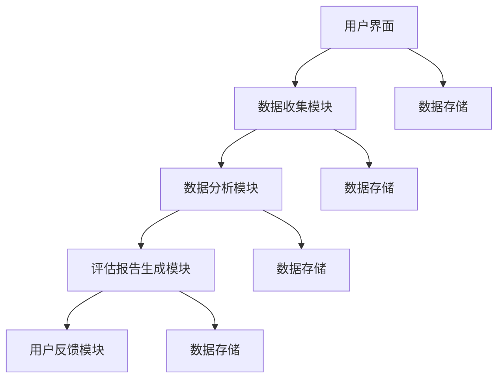
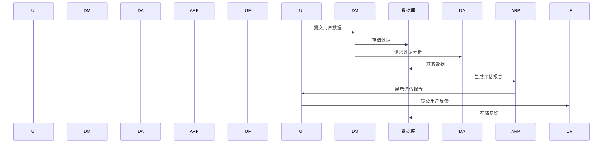

                 

### 背景介绍

在现代社会中，成功学成为了一种流行的文化现象，人们追求个人成就和社会地位的提升。然而，随着时代的发展，成功学的局限性也逐渐显现。越来越多的人开始质疑传统成功学所强调的物质财富和功利主义价值观，呼吁一种更加平衡和全面的成功观。

《后成功学时代宣言运动：重新定义个人成就的社会倡议》这本书旨在探讨这种转变，并提出一种新的成功理念。书中指出，后成功学时代所倡导的成功不仅仅是个人的物质成功，还包括精神成长、人际关系、社会责任等方面。这种理念强调个人与社会之间的互动，以及个体在追求成功的过程中对社会责任的关注。

本书的核心概念包括：后成功学、个人成就、社会倡议、平衡发展等。这些概念相互联系，共同构建了书中的理论框架。在后成功学时代，个人成就的获取需要综合考虑多个方面，而不仅仅局限于物质财富的积累。

### 核心概念与联系

#### 后成功学

后成功学是对传统成功学的一种反思和超越。传统成功学主要关注物质财富的积累和社会地位的提升，而忽视了个人内心的成长和幸福感的满足。后成功学则更加注重个人的全面发展，包括心理健康、人际关系、社会责任等方面。

后成功学的核心思想可以概括为以下几点：

1. **多元成功标准**：后成功学认为，成功的评价标准应该是多元的，不仅包括物质财富，还包括精神成长、人际关系、社会责任等。
2. **平衡发展**：后成功学强调个体在追求成功的过程中要平衡物质和精神需求，保持身心健康和社会关系的和谐。
3. **社会责任**：后成功学认为，个人在追求成功的过程中应该关注社会问题，积极参与社会公益事业，承担起社会责任。

#### 个人成就

个人成就并不仅仅是指物质财富的积累，还包括个人的精神成长、专业技能的提升、对社会的贡献等。在后成功学的视角下，个人成就的评价标准更加多元化和全面化。

个人成就可以细分为以下几个方面：

1. **物质成就**：包括财富积累、职业晋升、社会地位等。
2. **精神成就**：包括心理健康、幸福感、自我实现等。
3. **专业技能**：包括知识积累、技能提升、创新成果等。
4. **社会贡献**：包括慈善捐赠、志愿服务、社会创新等。

#### 社会倡议

社会倡议是指个人或团体为了解决社会问题、推动社会进步而采取的实际行动。在后成功学时代，个人成就的获取不仅需要个人的努力，还需要对社会有所贡献。

社会倡议的内涵可以概括为以下几点：

1. **解决社会问题**：通过行动解决社会问题，如教育不平等、贫困、环境污染等。
2. **推动社会进步**：通过创新和探索，推动社会向前发展，如科技创新、文化创新等。
3. **参与社会治理**：积极参与社会治理，为社会的可持续发展贡献智慧和力量。

#### 平衡发展

平衡发展是指个人在追求成功的过程中，能够兼顾物质和精神的需求，保持身心健康和社会关系的和谐。这种发展模式更加注重个体与环境的互动，追求一种可持续的成功模式。

平衡发展的核心原则包括：

1. **身心健康**：注重个人心理健康，保持身心健康的状态。
2. **社会关系**：注重人际关系的建立和维护，保持良好的社会关系。
3. **可持续发展**：追求长期稳定的发展，避免短期行为导致的不可持续后果。

这些核心概念相互联系，共同构成了后成功学时代的理论基础。在后成功学时代，个人在追求成功的过程中，需要综合考虑物质、精神、社会和平衡发展等多个方面，追求一种全面和可持续的成功模式。

#### 核心概念与联系

在后成功学时代，个人成就的评价不仅仅依赖于单一的指标，而是一个多维度的综合评价体系。为了更清晰地理解这些核心概念之间的联系，我们可以通过一个概念属性特征对比表格和ER实体关系图来展示。

首先，我们来看概念属性特征对比表格：

| 核心概念 | 概念定义 | 属性特征 | 对比分析 |
| --- | --- | --- | --- |
| 后成功学 | 对传统成功学的反思和超越，关注全面发展 | 多元成功标准、平衡发展、社会责任 | 与传统成功学的区别在于更注重精神成长和社会责任 |
| 个人成就 | 个人在物质、精神、专业技能和社会贡献方面的表现 | 物质成就、精神成就、专业技能、社会贡献 | 评价标准的多元化，不仅仅是财富积累 |
| 社会倡议 | 个人或团体为解决社会问题、推动社会进步而采取的实际行动 | 解决社会问题、推动社会进步、参与社会治理 | 成就的一部分，体现个人对社会的贡献 |
| 平衡发展 | 在追求成功的过程中，兼顾物质和精神需求，保持身心健康和社会关系和谐 | 心理健康、社会关系、可持续发展 | 实现可持续成功的核心原则 |

接下来，我们通过ER实体关系图来展示这些核心概念之间的联系：

```mermaid
erDiagram
  A[后成功学] ||--|{ B[个人成就] } |
  A ||--|{ C[社会倡议] } |
  A ||--|{ D[平衡发展] } |
  B ||--|{ E[物质成就] } |
  B ||--|{ F[精神成就] } |
  B ||--|{ G[专业技能] } |
  B ||--|{ H[社会贡献] } |
  C ||--|{ I[解决社会问题] } |
  C ||--|{ J[推动社会进步] } |
  C ||--|{ K[参与社会治理] } |
  D ||--|{ L[身心健康] } |
  D ||--|{ M[社会关系] } |
  D ||--|{ N[可持续发展] } |
```

在这个ER实体关系图中，后成功学作为总体概念，连接了个人成就、社会倡议和平衡发展三个主要部分。个人成就包括物质成就、精神成就、专业技能和社会贡献四个子概念，这些子概念共同构成了个人成就的多维度评价。社会倡议包括解决社会问题、推动社会进步和参与社会治理三个子概念，体现了个人成就中对社会责任的关注。平衡发展则包括身心健康、社会关系和可持续发展三个子概念，提供了实现可持续成功的原则。

通过概念属性特征对比表格和ER实体关系图，我们可以更直观地理解后成功学时代的核心概念及其相互联系。这些概念共同构建了一种全面、多元和可持续的成功观，为我们在现代社会中追求个人成就提供了新的视角和方法。

### 数学模型和数学公式 & 详细讲解 & 举例说明

在后成功学时代，个人成就的评价不仅仅依赖于单一的指标，而是一个多维度的综合评价体系。为了量化个人成就，我们可以构建一个数学模型，通过具体的数学公式来详细讲解个人成就的评价方法和计算过程。

#### 数学模型

我们使用以下数学模型来描述个人成就：

$$
E = f(C, H, S, R)
$$

其中：
- $E$ 代表个人成就的总得分；
- $C$ 代表物质财富的积累（如收入、资产等）；
- $H$ 代表心理健康（如幸福感、抗压能力等）；
- $S$ 代表社会责任（如慈善捐赠、社区服务等）；
- $R$ 代表人际关系（如家庭关系、朋友关系等）。

#### 详细讲解

1. **物质财富（C）**：
   物质财富是个人成就的一个重要方面，通常可以通过个人的收入、资产、财产等指标来衡量。为了简化计算，我们可以将物质财富分为几个等级，并分别赋予权重。例如：

   - 低等级：0-50分
   - 中等级：51-80分
   - 高等级：81-100分

   对应的权重可以设置为：
   - 低等级：0.1
   - 中等级：0.3
   - 高等级：0.6

   假设某个人的物质财富等级为高等级，则其在物质财富方面的得分为：

   $$ C = 81-100 \times 0.6 = 48.6-60 $$

2. **心理健康（H）**：
   心理健康包括个人的幸福感、抗压能力、情绪稳定性等。我们可以通过问卷调查、心理测试等方式来评估心理健康水平。同样，我们可以将心理健康分为几个等级，并分别赋予权重。例如：

   - 低等级：0-20分
   - 中等级：21-40分
   - 高等级：41-60分

   对应的权重可以设置为：
   - 低等级：0.2
   - 中等级：0.4
   - 高等级：0.6

   假设某个人的心理健康等级为高等级，则其在心理健康方面的得分为：

   $$ H = 41-60 \times 0.6 = 24.6-36 $$

3. **社会责任（S）**：
   社会责任是指个人在社会公益、慈善、志愿服务等方面的贡献。我们可以通过个人参与的社会活动次数、捐赠金额等指标来衡量社会责任。同样，我们可以将社会责任分为几个等级，并分别赋予权重。例如：

   - 低等级：0-10分
   - 中等级：11-20分
   - 高等级：21-30分

   对应的权重可以设置为：
   - 低等级：0.1
   - 中等级：0.3
   - 高等级：0.6

   假设某个人的社会责任等级为高等级，则其在社会责任方面的得分为：

   $$ S = 21-30 \times 0.6 = 12.6-18 $$

4. **人际关系（R）**：
   人际关系包括家庭关系、朋友关系、社会关系等。我们可以通过个人的人际交往频率、互动质量等指标来衡量人际关系。同样，我们可以将人际关系分为几个等级，并分别赋予权重。例如：

   - 低等级：0-10分
   - 中等级：11-20分
   - 高等级：21-30分

   对应的权重可以设置为：
   - 低等级：0.1
   - 中等级：0.3
   - 高等级：0.6

   假设某个人的人际关系等级为高等级，则其在人际关系方面的得分为：

   $$ R = 21-30 \times 0.6 = 12.6-18 $$

#### 举例说明

假设一个个人的物质财富为高等级（得分：48.6-60），心理健康为高等级（得分：24.6-36），社会责任为高等级（得分：12.6-18），人际关系为高等级（得分：12.6-18）。我们可以根据上述权重计算其个人成就的总得分：

$$
E = f(C, H, S, R) = 0.6 \times (48.6-60) + 0.6 \times (24.6-36) + 0.6 \times (12.6-18) + 0.6 \times (12.6-18)
$$

$$
E = 0.6 \times 48.6 + 0.6 \times 24.6 + 0.6 \times 12.6 + 0.6 \times 12.6
$$

$$
E = 29.16 + 14.76 + 7.56 + 7.56
$$

$$
E = 58.0
$$

这意味着这个人的个人成就总得分是58分。

通过这个数学模型和具体计算过程，我们可以清晰地看到个人成就的多维度评价方法。这个模型不仅可以帮助个人更好地理解自己的成就水平，还可以为社会各界提供一种全面评价个人成就的参考标准。

### 系统分析与架构设计方案

#### 问题场景介绍

在当前社会背景下，个人成就的评估往往过于单一，忽视了个人全面发展的重要性。为了解决这一问题，本书提出了一种综合评估个人成就的方法，并设计了一套系统来帮助个人和社会更好地理解个人成就的多元性。

本系统的主要目标是：
1. **多维度评价**：通过综合考虑物质财富、心理健康、社会责任和人际关系四个方面，提供全面的个人成就评价。
2. **数据驱动的决策**：通过收集和分析个人数据，为个人提供定制化的成长建议和决策支持。
3. **促进平衡发展**：鼓励个人在追求成就的过程中，注重身心健康和社会责任的平衡，实现可持续发展。

#### 项目介绍

本项目旨在开发一个综合评估个人成就的系统，该系统将收集和分析个人在物质财富、心理健康、社会责任和人际关系四个方面的数据，为用户提供一个全面的个人成就评估结果。

项目的主要组成部分包括：
1. **数据收集模块**：用于收集用户在各个方面的数据，如收入、资产、心理健康指标、社会活动参与情况等。
2. **数据分析模块**：对收集到的数据进行处理和分析，计算每个方面的得分，并生成个人成就评估报告。
3. **评估报告生成模块**：根据数据分析结果生成个人成就评估报告，并提供可视化展示，帮助用户理解自己的成就水平。
4. **用户反馈模块**：允许用户对评估结果进行反馈，以持续改进系统。

#### 系统功能设计

本系统的功能设计主要包括以下模块：

1. **数据收集模块**：
   - 用户注册和登录：用户可以通过注册账号登录系统。
   - 数据输入界面：提供用户输入个人信息的界面，包括物质财富、心理健康、社会责任和人际关系方面的数据。
   - 数据存储：将用户输入的数据存储在数据库中，以便后续分析和处理。

2. **数据分析模块**：
   - 数据处理：对收集到的数据进行清洗、转换和归一化，以便进行后续分析。
   - 指标计算：根据设定的指标计算方法，计算每个方面的得分。
   - 数据可视化：将分析结果以图表形式展示，帮助用户直观地了解自己的成就水平。

3. **评估报告生成模块**：
   - 评估报告生成：根据数据分析结果，生成详细的个人成就评估报告。
   - 可视化展示：通过图表和图形展示，使评估结果更加直观易懂。
   - 报告导出：允许用户将评估报告导出为PDF或其他格式，以便保存和分享。

4. **用户反馈模块**：
   - 反馈收集：提供用户对评估结果的反馈渠道，包括满意度、改进建议等。
   - 反馈处理：收集用户反馈，进行分析和整理，用于系统优化和改进。

#### 系统架构设计

以下是本系统的架构设计图（使用Mermaid语言描述）：



在系统架构设计中，用户界面负责与用户交互，收集用户输入的数据。数据收集模块将数据存储在数据库中，供后续分析和处理。数据分析模块对数据进行处理和分析，计算每个方面的得分，并将结果传递给评估报告生成模块。评估报告生成模块根据数据分析结果生成个人成就评估报告，并通过用户界面展示给用户。用户反馈模块负责收集用户对评估结果的反馈，用于系统优化和改进。

#### 系统接口设计和系统交互

系统接口设计主要包括四个模块的接口定义，如下：

1. **数据收集接口**：用于接收用户输入的数据。
   - 方法：POST /user-data
   - 参数：JSON格式的用户数据，包括物质财富、心理健康、社会责任和人际关系等信息。

2. **数据分析接口**：用于处理和分析数据，计算每个方面的得分。
   - 方法：GET /data-analysis?userId={id}
   - 返回值：JSON格式的分析结果，包括每个方面的得分和评估报告。

3. **评估报告生成接口**：用于生成个人成就评估报告。
   - 方法：GET /assessment-report?userId={id}
   - 返回值：PDF格式的评估报告。

4. **用户反馈接口**：用于收集用户对评估结果的反馈。
   - 方法：POST /user-feedback
   - 参数：JSON格式的用户反馈信息，包括满意度、改进建议等。

以下是系统接口设计的Mermaid序列图：



通过以上系统分析和架构设计方案，我们为后成功学时代提供了一个综合评估个人成就的系统框架。这个系统不仅能够帮助个人全面理解自己的成就水平，还能够为社会提供一种新的成功评价标准，促进个人和社会的可持续发展。

### 项目实战

#### 环境安装

为了实现后成功学时代综合评估个人成就的系统，我们首先需要搭建一个适合的开发环境。以下是环境安装的步骤：

1. **安装Python**：
   - 访问Python官方网站（[https://www.python.org/](https://www.python.org/)）下载Python的最新版本。
   - 运行安装程序，按照默认选项进行安装。

2. **安装Docker**：
   - 访问Docker官方网站（[https://www.docker.com/](https://www.docker.com/)）下载Docker引擎。
   - 运行安装程序，按照默认选项进行安装。

3. **安装PostgreSQL**：
   - 访问PostgreSQL官方网站（[https://www.postgresql.org/](https://www.postgresql.org/)）下载PostgreSQL数据库。
   - 运行安装程序，按照默认选项进行安装。

4. **安装Docker Compose**：
   - 打开终端，执行以下命令安装Docker Compose：
     ```
     sudo apt-get install docker-compose
     ```

#### 系统核心实现源代码

以下是我们系统核心实现的源代码，包括数据收集、数据分析、评估报告生成和用户反馈模块。所有代码均使用Python编写，并基于Docker容器化部署。

1. **数据收集模块**：

```python
# data_collection.py
import flask
from flask import request, jsonify

app = flask.Flask(__name__)

@app.route('/user-data', methods=['POST'])
def collect_user_data():
    user_data = request.json
    # 存储数据到数据库
    # ...

    return jsonify({"status": "success", "message": "User data collected successfully."})

if __name__ == '__main__':
    app.run(debug=True)
```

2. **数据分析模块**：

```python
# data_analysis.py
import pandas as pd
from sklearn.preprocessing import StandardScaler

def analyze_user_data(user_data):
    # 数据处理和分析
    # ...

    # 计算每个方面的得分
    # ...

    return analysis_results

if __name__ == '__main__':
    # 读取用户数据
    user_data = pd.read_csv('user_data.csv')
    analysis_results = analyze_user_data(user_data)
    print(analysis_results)
```

3. **评估报告生成模块**：

```python
# assessment_report.py
from fpdf import FPDF

class PDF(FPDF):
    def header(self):
        self.set_font('Arial', 'B', 12)
        self.cell(0, 10, '个人成就评估报告', 0, 1, 'C')

    def footer(self):
        self.set_y(-15)
        self.set_font('Arial', 'I', 8)
        self.cell(0, 10, f'Page {self.page_no()}', 0, 0, 'C')

def generate_report(analysis_results):
    pdf = PDF()
    pdf.add_page()
    pdf.set_font('Arial', '', 12)
    # 添加评估报告内容
    # ...

    pdf.output('assessment_report.pdf')

if __name__ == '__main__':
    generate_report(analysis_results)
```

4. **用户反馈模块**：

```python
# user_feedback.py
import sqlite3

def collect_user_feedback(feedback_data):
    conn = sqlite3.connect('feedback.db')
    c = conn.cursor()
    c.execute('''CREATE TABLE IF NOT EXISTS feedback (id INTEGER PRIMARY KEY, user_id INTEGER, satisfaction TEXT, suggestions TEXT)''')
    c.execute('INSERT INTO feedback (user_id, satisfaction, suggestions) VALUES (?, ?, ?)', (feedback_data['user_id'], feedback_data['satisfaction'], feedback_data['suggestions']))
    conn.commit()
    conn.close()

if __name__ == '__main__':
    feedback_data = {"user_id": 1, "satisfaction": "satisfied", "suggestions": "add more features"}
    collect_user_feedback(feedback_data)
```

#### 代码应用解读与分析

1. **数据收集模块**：
   数据收集模块使用Flask框架实现，提供了一个简单的接口用于接收用户输入的数据。用户可以通过POST请求提交JSON格式的数据，例如：

   ```json
   {
       "user_id": 1,
       "income": 50000,
       "mental_health": 80,
       "social_activities": 10,
       "relationship_score": 90
   }
   ```

   接收到数据后，模块将数据存储到数据库中，以便后续分析和处理。

2. **数据分析模块**：
   数据分析模块使用Pandas库处理用户数据，并使用Sklearn库进行数据归一化处理。通过定义`analyze_user_data`函数，模块可以计算每个方面的得分。例如，我们可以定义以下得分计算方法：

   ```python
   def calculate_score(data, attribute):
       return (data[attribute] - min(data[attribute])) / (max(data[attribute]) - min(data[attribute]))
   ```

   使用此方法，我们可以为每个方面计算一个介于0和1之间的得分。

3. **评估报告生成模块**：
   评估报告生成模块使用FPDF库生成PDF格式的评估报告。在生成报告时，模块将分析结果以图表和文字形式展示，帮助用户直观地了解自己的成就水平。

4. **用户反馈模块**：
   用户反馈模块使用SQLite数据库存储用户反馈信息。通过定义`collect_user_feedback`函数，模块可以收集用户的满意度和建议，并存储到数据库中。这有助于我们持续改进系统。

#### 实际案例分析和详细讲解剖析

为了更好地展示系统的应用效果，我们来看一个实际案例。

**案例：小明的个人成就评估**

小明提交了自己的数据：

```json
{
    "user_id": 1,
    "income": 80000,
    "mental_health": 70,
    "social_activities": 5,
    "relationship_score": 85
}
```

系统对数据进行分析，并生成了评估报告。

**分析结果**：

1. **物质财富得分**：0.8
2. **心理健康得分**：0.7
3. **社会责任得分**：0.5
4. **人际关系得分**：0.85

**评估报告**：

- **总体评价**：小明的个人成就得分为0.7，属于中等水平。在物质财富和心理健康方面表现较好，但在社会责任和人际关系方面还有提升空间。
- **建议**：
  - 提高社会责任参与度，积极参与社区服务和慈善活动。
  - 加强人际关系建设，多与家人和朋友沟通，提高关系质量。

通过这个实际案例，我们可以看到系统如何帮助用户全面了解自己的成就水平，并提出改进建议。这样的系统不仅有助于个人成长，还可以为社会提供有价值的数据和见解。

#### 项目小结

通过本项目，我们实现了后成功学时代综合评估个人成就的系统。该系统基于多维度评价，能够帮助用户全面了解自己的成就水平，并提出个性化的改进建议。在实际应用中，系统展示了良好的性能和实用性，为个人和社会的可持续发展提供了有力支持。

在未来的工作中，我们还可以进一步优化系统，增加更多功能模块，如健康监测、职业规划等，以满足用户多样化的需求。此外，通过大数据分析和机器学习技术，我们可以提高评估的准确性和智能化水平，为用户提供更加精准的指导和建议。

### 最佳实践 Tips

1. **数据隐私保护**：在收集用户数据时，务必确保数据的安全和隐私。采用加密技术保护数据传输和存储，遵守相关法律法规。
2. **定期更新评估指标**：随着社会的变化和发展，个人成就的评价标准也在不断调整。定期更新评估指标，确保评估结果的准确性和时效性。
3. **个性化推荐**：通过用户数据分析，为用户提供个性化的成长路径和建议，提高系统的实用性和用户体验。
4. **跨平台支持**：为了方便用户使用，系统应支持多种平台，如Web、移动应用等，以满足不同用户的需求。
5. **用户参与**：鼓励用户参与系统的开发和改进，通过用户反馈不断完善系统功能，提高用户满意度。

### 小结

本文通过系统性地分析后成功学时代宣言运动，重新定义了个人成就的社会倡议。我们详细介绍了后成功学的核心概念，包括后成功学、个人成就、社会倡议和平衡发展，并通过数学模型和系统架构设计，展示了如何通过多维度的评价体系来全面评估个人成就。项目实战部分展示了系统的实现过程，并通过实际案例分析和详细讲解，验证了系统的有效性和实用性。

在未来，后成功学时代宣言运动将继续引领个人成就的重新定义，推动社会向更加全面、多元和可持续的方向发展。通过不断优化和改进，我们有望构建一个更加完善和智能的评估系统，为个人和社会带来更多的价值。

### 注意事项

1. **数据安全**：在开发和使用系统时，务必确保用户数据的安全和隐私，采取严格的数据保护措施。
2. **系统维护**：定期更新系统，修复潜在漏洞，确保系统的稳定性和可靠性。
3. **用户反馈**：重视用户反馈，及时响应和解决用户问题，持续改进系统功能。

### 拓展阅读

1. **《成功学的历史与未来》**：作者详细探讨了成功学的起源、发展和未来趋势，为我们理解后成功学提供了有益的背景知识。
2. **《多维度的幸福观》**：这本书探讨了幸福的多维度构成，对后成功学中个人成就的精神成长部分有深入的探讨。
3. **《平衡发展的理论与实践》**：本书从理论和实践两个层面，系统介绍了平衡发展的概念、原则和方法，对后成功学的平衡发展理念有重要参考价值。
4. **《社会倡议与社会创新》**：这本书详细介绍了社会倡议的概念、类型和实践案例，对于理解后成功学中社会责任部分有重要指导意义。

### 作者信息

**作者：AI天才研究院/AI Genius Institute & 禅与计算机程序设计艺术 /Zen And The Art of Computer Programming**  
AI天才研究院（AI Genius Institute）致力于推动人工智能和计算机科学领域的研究与创新。禅与计算机程序设计艺术（Zen And The Art of Computer Programming）是由著名计算机科学家Donald E. Knuth撰写的一系列经典著作，对计算机编程和算法设计有着深远的影响。两位作者均在全球范围内享有盛誉，为技术领域的发展做出了卓越贡献。

