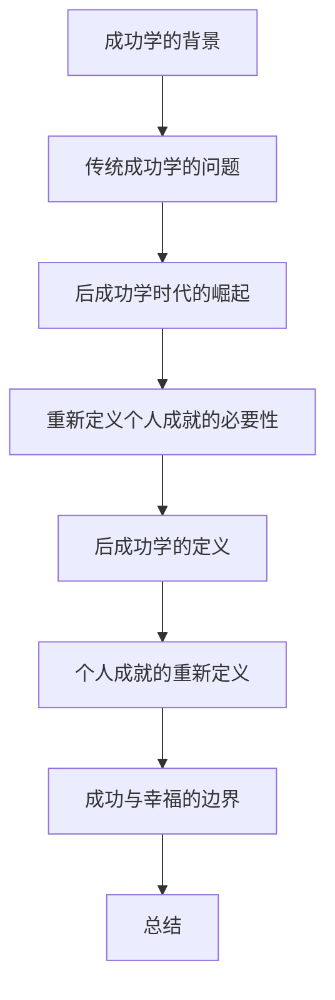
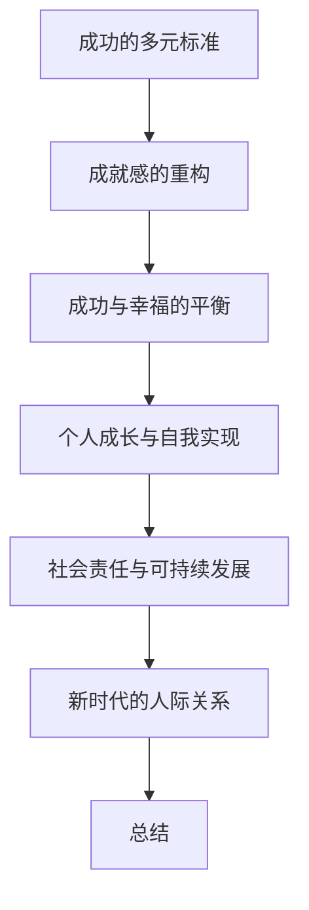
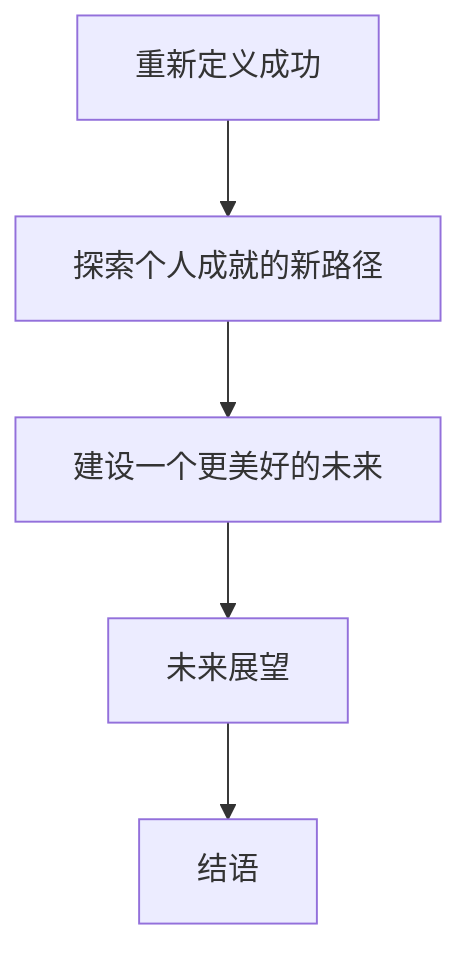

                 

### 1.1 背景与意义

#### 1.1.1 成功学的兴起与挑战

在过去的几个世纪里，成功学一直是社会普遍追求的目标。从“赢在起点”的婴儿教育，到“职场晋升”的职业生涯规划，成功学逐渐成为了一个庞大的学科体系。它教导人们如何通过努力和策略实现个人成就和社会地位，从而获得物质和精神的满足。然而，随着时代的发展，这种传统的成功学观念逐渐暴露出一些不可忽视的挑战。

首先，成功学强调的是单一的、标准的成功路径。这种观念往往忽视了个体差异和多样性，导致很多人在追求成功的过程中感到压抑和困惑。他们可能会在达到某个所谓的“成功标准”后，仍然感到不满足或迷失自我。

其次，成功学往往过于注重物质成就，而忽视了精神层面的满足。在追求财富和地位的过程中，很多人可能会忽视家庭、健康和人际关系，导致生活失衡。此外，成功学的追求往往伴随着巨大的压力和焦虑，很多人在追求成功的过程中牺牲了生活的乐趣和内心的平静。

#### 1.1.2 后成功学时代的崛起

后成功学时代的崛起，是对传统成功学观念的一种反思和革新。它强调的是多元化、个性化的发展路径，以及精神层面的满足。在后成功学时代，人们不再单一追求物质成就，而是更加注重个人成长、自我实现和幸福感。

后成功学时代的崛起，与现代社会的发展密切相关。随着科技的发展和社会的进步，人们的生活方式、价值观和追求都在不断变化。传统的成功学观念已经无法满足现代人的需求，后成功学应运而生，为人们提供了一种更加全面、更加人性化的成功观。

#### 1.1.3 重新定义个人成就的必要性

重新定义个人成就的必要性在于，它能够帮助我们摆脱传统成功学带来的局限和束缚，找到真正适合自己的成功路径。在重新定义个人成就的过程中，我们需要关注以下几个方面：

首先，要认识到个人成就不仅仅是物质上的成功，还包括精神层面的满足。这意味着，我们在追求个人成就时，需要综合考虑物质和精神的双重因素。

其次，要尊重个体的差异和多样性。每个人都有自己的兴趣、能力和价值观，我们应该根据自己的特点来定义个人成就，而不是盲目追随他人的脚步。

最后，要强调个人成长和自我实现。个人成就不仅仅是实现某个目标，更是一个不断成长和进步的过程。在这个过程中，我们需要不断挑战自我，超越自我，找到真正的自我价值。

### 1.2 核心概念

#### 1.2.1 后成功学的定义

后成功学是一种基于个体差异和多元化发展的成功观念。它强调的是个人成长、自我实现和幸福感，而不是单一的、标准的成功路径。后成功学认为，每个人都有自己的成功路径，关键是找到适合自己的发展方式，实现个人价值。

#### 1.2.2 个人成就的重新定义

个人成就的重新定义，意味着我们要从多个角度来理解成功。它不仅仅是物质上的成功，还包括精神层面的满足。同时，个人成就也不是一成不变的，而是一个动态的、不断发展的过程。

在重新定义个人成就的过程中，我们需要关注以下几个方面：

- **物质成就**：包括财富、地位、名誉等。
- **精神成就**：包括个人成长、自我实现、幸福感等。
- **社会贡献**：包括对社会的贡献、社会责任的承担等。

#### 1.2.3 成功与幸福的边界

成功与幸福的关系是一个复杂且多维的问题。传统观念认为，成功可以带来幸福，但后成功学认为，幸福并不完全是成功的产物。

成功与幸福之间的边界在于，成功是一种外在的、物质上的成就，而幸福是一种内在的、精神上的满足。成功可以带来短期的幸福感，但长期而言，幸福更多来源于个人的内心满足和生活质量。

在重新定义个人成就的过程中，我们需要认识到，成功与幸福并不是对立的关系，而是可以相互促进的。通过追求成功，我们可以实现物质上的满足，而通过实现个人成长和自我实现，我们可以获得精神上的满足和幸福感。

### 1.3 总结

后成功学时代的崛起，是对传统成功学观念的一种革新。它强调多元化、个性化的发展路径，以及精神层面的满足。重新定义个人成就，意味着我们要从多个角度来理解成功，实现个人成长和自我实现。通过重新审视成功与幸福的边界，我们可以找到更加适合自己的成功路径，实现真正的幸福和满足。

### 2.1 成功观念的转变

#### 2.1.1 成功的多元标准

在传统成功学中，成功往往被定义为达到某个特定的社会标准，如财富、地位和名誉。然而，后成功学时代提出了成功的多元标准，强调个人成就的多样性和个性化。

首先，物质成就依然是成功的一部分，但不再是唯一的衡量标准。个人财富和地位的重要性在降低，人们开始更加重视精神层面的满足和幸福感。这种转变反映了现代社会对生活质量的更高追求。

其次，个人成就的多样性被广泛认可。不同的个体有不同的兴趣和特长，他们在不同领域的成就都应该得到尊重和认可。例如，在科技领域，一个优秀的程序员可能被认为比一个成功的商人更有成就；在艺术领域，一个杰出的画家可能被认为比一个知名的企业家更有价值。

#### 2.1.2 成就感的重构

随着成功观念的转变，成就感也被重新定义。在传统观念中，成就感往往与外部的评价和认可紧密相关。然而，后成功学强调内在的满足和自我认同。

首先，成就感不再完全依赖于外部的评价。个人通过自我反思和自我评估，可以找到内心的成就感。例如，一个程序员在完成一个复杂的项目时，可能会从内心的满足感中获得成就感，而不是仅仅因为项目获得了客户的好评。

其次，成就感与个人成长和进步密切相关。在追求个人成就的过程中，每个小步骤的进步和成长都能带来成就感。这种成就感不是瞬间的，而是通过持续的、不断的过程积累而来。

#### 2.1.3 成功与幸福的平衡

在后成功学时代，成功与幸福的关系被重新审视。传统观念中，成功被视为幸福的前提，而现代观念则认为，成功与幸福是相互促进的。

首先，成功可以为幸福提供物质基础。一个物质条件良好的生活可以为个人提供更多的选择和自由，从而增加幸福感。然而，过分追求物质成功可能会导致精神上的空虚和焦虑，影响幸福感。

其次，幸福可以为成功提供动力和支持。一个心态积极、内心满足的人更容易在事业上取得成功。幸福不仅仅是成功的结果，也是追求成功的过程中的一部分。

#### 2.1.4 成功观念转变的影响

成功的多元标准、成就感的重构和成功与幸福的平衡，对个人和社会产生了深远的影响。

首先，对个人而言，多元标准使个人不再局限于某个特定的成功路径，可以更加自由地追求自己的兴趣和梦想。成就感重构则帮助个人找到内心的满足感，增强自我认同和自我价值感。成功与幸福的平衡则使个人在追求成功的过程中，能够更好地享受生活，保持身心健康。

其次，对社会而言，成功的多元标准和成就感的重构有助于社会的多样性和包容性。不再只有少数人被认定为成功的典范，每个人都有机会在各自的领域中发光发热。这种观念的转变促进了社会的创新和进步，推动了社会的可持续发展。

### 2.2 个人成长与自我实现

#### 2.2.1 自我认知与定位

在追求个人成长和自我实现的过程中，自我认知和定位是至关重要的一步。只有清楚了解自己的兴趣、能力和价值观，才能找到真正适合自己的成长路径。

首先，自我认知需要深入反思。通过问自己一系列问题，如“我喜欢做什么？”“我擅长做什么？”“我的价值观是什么？”等，可以更好地了解自己的内心需求和优势。

其次，定位需要结合现实情况。在了解自己的兴趣和能力后，需要考虑社会需求和就业市场，找到能够实现自我价值和获得认可的领域。例如，一个对科技感兴趣的人，可以选择从事软件开发或人工智能研究，而不是仅仅因为市场需求而选择金融或市场营销。

#### 2.2.2 职业发展的新路径

在后成功学时代，职业发展不再局限于传统的路径，而是更加多元和灵活。个人可以通过多种方式实现职业成长和自我实现。

首先，跨界发展成为一种趋势。许多人在不同领域之间切换，寻找能够发挥自己才华的机会。例如，一个艺术家可能会涉足科技领域，而一个程序员可能会投身艺术创作。这种跨界不仅丰富了个人经验和技能，也为职业发展提供了更多可能性。

其次，远程工作和自由职业越来越受到欢迎。互联网的发展使人们可以在全球范围内工作和合作，不再受地域限制。这种灵活的工作方式不仅提高了工作效率，也为个人提供了更多的自由和选择。

#### 2.2.3 精神追求与人生意义

在追求个人成长和自我实现的过程中，精神追求和人生意义是不可或缺的一部分。精神追求不仅是对物质成功的补充，更是个人内心满足和幸福感的重要来源。

首先，精神追求可以提升个人生活质量。通过追求内心的平静和喜悦，个人可以减少生活压力，提高生活质量。例如，通过冥想、瑜伽或其他形式的自我修炼，个人可以找到内心的宁静和平衡。

其次，人生意义为个人提供了前进的动力和方向。当个人明确自己的人生目标和意义时，他们会更有动力去追求和实现这些目标。例如，一个追求环境保护的人可能会投身环保事业，一个热爱教育的人可能会选择成为教师。

#### 2.2.4 综合发展的重要性

个人成长和自我实现不是单一维度的追求，而是需要综合考虑多个方面。只有物质、精神和社会层面都能得到满足，个人才能真正实现全面发展。

首先，物质层面的满足是基础。一个经济独立、生活稳定的人才能有更多的时间和精力去追求精神和社交层面的满足。

其次，精神层面的满足是核心。通过追求内心的平静和喜悦，个人可以找到真正的自我价值和幸福感。

最后，社会层面的满足是补充。通过承担社会责任和参与社会活动，个人可以提升自己的社会价值和影响力。

### 2.3 社会责任与可持续发展

#### 2.3.1 成功的社会责任

在后成功学时代，成功不仅仅是个人的成就，还包括对社会的贡献。成功的社会责任意味着，个人在追求个人成长和自我实现的过程中，也要关注社会问题和公共福利。

首先，成功的社会责任体现在社会责任感的培养。个人应该意识到，自己的成功不仅是为了自己，也是为了社会。通过参与公益活动、支持社会公益项目，个人可以回馈社会，帮助需要帮助的人。

其次，成功的社会责任体现在可持续发展理念的践行。个人在生活和工作中应该注重环境保护和资源节约，减少对自然资源的消耗，推动社会的可持续发展。

#### 2.3.2 可持续发展的理念

可持续发展是后成功学时代的一个重要概念。它强调的是在满足当前需求的同时，不损害子孙后代满足其需求的能力。可持续发展的理念在个人和社会层面都有重要意义。

首先，个人层面的可持续发展意味着，个人应该注重身心健康，保持长期的生活质量。通过健康的生活方式、合理的饮食和锻炼，个人可以延长寿命，提高生活质量。

其次，社会层面的可持续发展意味着，社会应该关注经济、社会和环境的协调发展。通过科技创新、政策引导和社会参与，社会可以推动可持续发展，实现长期的繁荣和稳定。

#### 2.3.3 个人对社会的影响

个人对社会的影响是双向的。个人通过自己的努力和成就，可以对社会产生积极的影响。同时，社会也为个人提供了成长和发展的机会。

首先，个人通过自己的专业能力和创新思维，可以为社会创造价值。例如，一个优秀的程序员可以开发出改变世界的应用程序，一个杰出的科学家可以推动科技的发展。

其次，个人通过参与社会活动和公益事业，可以改善社会环境，促进社会的进步。例如，通过参与公益活动，个人可以帮助贫困地区的孩子接受教育，通过捐赠物资，个人可以改善贫困地区的生活条件。

### 2.4 新时代的人际关系

#### 2.4.1 人际关系的重新定义

在新时代，人际关系被赋予了新的意义。与传统的人际关系相比，新时代的人际关系更加多元化和复杂化。

首先，人际关系不再仅仅局限于血缘关系和地缘关系。随着全球化的发展，人们可以与来自不同国家和文化背景的人建立联系，形成更加广泛的人际网络。

其次，人际关系更加注重平等和尊重。在新时代，人们更加重视个体的价值和尊严，不再以地位和权力来衡量人际关系的重要性。

#### 2.4.2 合作与共赢

新时代的人际关系强调合作与共赢。在合作中，个人通过互相帮助和支持，可以实现共同的目标，获得更大的成就。

首先，合作可以帮助个人提高工作效率，减少工作压力。通过团队协作，个人可以充分发挥自己的优势，弥补自己的不足，实现资源的最优配置。

其次，合作可以促进创新和进步。在合作中，个人可以交流思想和经验，互相学习，推动个人和团队的发展。

#### 2.4.3 社交网络的正能量

社交网络是新时代人际关系的重要组成部分。通过社交网络，个人可以与朋友、同事和同行保持联系，分享信息和资源。

首先，社交网络的正能量可以激发个人的积极情绪，提高生活质量和幸福感。通过与朋友互动，个人可以感受到关爱和支持，增强内心的力量。

其次，社交网络可以帮助个人扩展人脉，提高社会地位。在社交网络中，个人可以结识更多的有识之士，获得更多的机会和资源。

### 2.5 总结

在后成功学时代，成功的观念发生了深刻的变化。从单一的、标准的成功路径，转向多元、个性化的发展路径；从物质成就的单一追求，转向物质和精神的双重满足；从外部的评价和认可，转向内心的满足和自我认同。这些转变不仅有助于个人实现自我成长和自我实现，也为社会带来了更多的多样性和包容性。在新时代的人际关系中，合作与共赢、社交网络的正能量成为重要特征，为个人和社会的进步提供了强大的动力。

### 3.1 自我评估与规划

#### 3.1.1 自我认知的步骤

自我认知是个人成长和规划的基础。要实现有效的自我认知，需要以下几个步骤：

首先，进行深入反思。通过反思自己的行为、思维和情感，可以更好地了解自己的内在需求和动机。例如，问自己：“我在什么情况下感到最快乐？”“我在做什么时最有成就感？”“我通常如何应对挑战和困难？”通过这些问题，可以深入挖掘自己的内心世界。

其次，收集外部反馈。通过与他人交流和互动，可以获取对自我的客观评价。这包括家人、朋友、同事和导师的意见。他们的反馈可以帮助我们更全面地了解自己的优点和不足。

最后，进行自我评估。结合反思和外部反馈，对自己的兴趣、能力、价值观和目标进行综合评估。通过制定详细的自我评估表格，可以清晰地了解自己在各个方面的优势和劣势。

#### 3.1.2 成就目标的确立

在自我认知的基础上，确定具体的成就目标是实现个人成长和自我实现的关键。以下是确立成就目标的方法：

首先，明确目标类型。根据个人兴趣和职业发展方向，将目标分为短期目标、中期目标和长期目标。短期目标通常是1-2年内可以实现的小目标，中期目标通常是3-5年内可以实现的中等规模的目标，长期目标则是5年以上需要持续努力才能实现的大目标。

其次，设定具体目标。目标要明确、具体、可衡量，便于追踪和评估。例如，如果目标是学习一门新技能，可以设定为“在接下来的6个月内，完成X个在线课程，并实际应用这些知识解决工作中的一个具体问题”。

最后，制定行动计划。将目标分解为具体的行动步骤，并设定时间表。例如，为了实现学习一门新技能的目标，可以制定以下步骤：第一步，在第一个月内选择合适的在线课程；第二步，在第二个月内完成课程的学习；第三步，在第三个月内应用所学知识解决具体问题。

#### 3.1.3 计划与执行

制定计划是实现目标的必要条件，而执行则是实现目标的唯一途径。以下是制定和执行计划的几个要点：

首先，制定详细的计划。在计划中，明确每个阶段的任务和时间节点，确保计划的可操作性和可行性。例如，如果目标是提升编程能力，可以制定以下计划：第一步，每周学习2-3个新的编程技巧；第二步，每个月完成一个小项目；第三步，每季度参加一次编程竞赛。

其次，设定检查点。定期检查计划的执行情况，确保按计划进行。可以设定每周或每月的检查点，回顾完成的任务和未完成的任务，及时调整计划。

最后，保持持续的动力。实现目标往往需要长期的努力，保持持续的动力至关重要。可以通过设定奖励机制、与朋友或导师分享进展、参加相关社区等方式，保持对目标的热情和动力。

### 3.2 个人发展路径

#### 3.2.1 职业发展策略

在个人发展过程中，职业发展策略至关重要。以下是几个职业发展策略的建议：

首先，明确职业目标。职业目标应与个人兴趣和长远规划相结合，确保职业发展的方向与个人价值观一致。例如，一个对科技创新感兴趣的人，可以选择投身科技企业，而不是仅仅因为薪资而选择其他行业。

其次，持续学习和提升技能。在快速变化的工作环境中，持续学习和提升技能是保持竞争力的关键。可以通过参加在线课程、阅读专业书籍、参加行业研讨会等方式，不断充实自己的知识和技能。

最后，建立广泛的人脉。建立广泛的人脉可以帮助个人在职业发展中获得更多的机会和资源。可以通过参加行业活动、加入专业协会、参与在线社群等方式，拓展人脉网络。

#### 3.2.2 教育与技能提升

教育与技能提升是个人发展的基础。以下是几个教育与技能提升的建议：

首先，选择合适的教育路径。根据职业目标和兴趣，选择合适的教育机构和课程。可以是一流的大学课程、在线课程，也可以是通过自学和实习获得实践经验。

其次，注重综合素质的培养。除了专业技能，综合素质如沟通能力、领导能力、团队合作能力等也是职业发展中不可或缺的。可以通过参加社团活动、志愿者工作、担任学生会职务等方式，提升自己的综合素质。

最后，实践与理论相结合。理论知识和实践经验相结合，可以更好地理解和应用所学知识。可以通过实习、项目实践、参与开源项目等方式，将理论知识转化为实际技能。

#### 3.2.3 休闲娱乐与身心健康

休闲娱乐与身心健康是个人发展的重要组成部分。以下是几个休闲娱乐与身心健康建议：

首先，保持健康的生活习惯。定期进行体育锻炼，保持健康的饮食，保证充足的睡眠，都是保持身心健康的基础。

其次，培养兴趣爱好。兴趣爱好不仅可以丰富个人的生活，还可以为个人带来乐趣和满足感。可以选择阅读、绘画、音乐、旅游等作为兴趣爱好。

最后，学会放松和减压。在快节奏的生活中，学会放松和减压至关重要。可以通过冥想、瑜伽、旅游等方式，减轻压力，保持心理健康。

### 3.3 社会参与与贡献

#### 3.3.1 社会责任的承担

社会责任是每个公民应尽的义务。以下是几个承担社会责任的建议：

首先，积极参与公益活动。可以通过参加志愿者活动、捐款捐物、参与社区服务等方式，为社会做出实际贡献。

其次，关注社会问题。通过关注和了解社会问题，如贫困、环境问题、教育不平等等，可以更好地理解社会的需求，为解决这些问题贡献自己的力量。

最后，推动社会进步。通过倡导和支持社会改革、参与政策制定、推动科技创新等方式，可以推动社会的进步和发展。

#### 3.3.2 社区参与与建设

社区参与与建设是个人与社会互动的重要方式。以下是几个社区参与与建设的建议：

首先，积极参与社区活动。可以通过参加社区会议、组织社区活动、参与社区项目等方式，增强社区凝聚力，提升社区生活质量。

其次，建设和谐社区。通过倡导文明礼仪、维护社区环境、促进邻里关系等方式，建设和谐、友好的社区氛围。

最后，推动社区发展。可以通过提出建议、参与规划、支持社区项目等方式，推动社区的发展和进步。

#### 3.3.3 公益事业的参与

公益事业是社会责任的重要组成部分。以下是几个参与公益事业的建议：

首先，选择合适的公益事业。可以根据个人兴趣和专业特长，选择参与的公益事业。例如，对教育感兴趣的人可以参与教育公益项目，对环保感兴趣的人可以参与环保公益项目。

其次，发挥个人优势。通过发挥个人优势，如专业技能、人脉资源等，可以为公益事业提供更有价值的服务。

最后，持续参与和关注。公益事业需要持续的关注和参与，可以通过定期捐款、参加公益活动、宣传公益项目等方式，持续为公益事业贡献力量。

### 3.4 人际关系的建立与维护

#### 3.4.1 人际关系的处理原则

在建立和维护人际关系的过程中，遵循以下原则至关重要：

首先，尊重和信任。尊重他人的意见和感受，建立信任关系，是良好人际关系的基础。通过真诚和坦率的交流，可以增进彼此的了解和信任。

其次，公平和正义。在人际关系中，公平和正义是维护关系的重要原则。要避免偏袒和歧视，公正对待每个人，才能获得他人的尊重和信任。

最后，沟通和合作。有效的沟通和合作是建立和维护人际关系的关键。通过倾听他人的意见、分享自己的想法，可以增进彼此的理解和合作，共同实现目标。

#### 3.4.2 有效沟通的技巧

有效沟通是建立和维护人际关系的重要技巧。以下是几个有效沟通的技巧：

首先，倾听。倾听是沟通的基础，通过倾听他人的意见和感受，可以更好地理解对方，避免误解和冲突。

其次，表达清晰。表达清晰是有效沟通的关键，通过使用简单明了的语言，避免使用专业术语或模糊的表述，可以确保对方准确理解自己的意思。

最后，反馈。在沟通过程中，及时给予反馈，可以确保沟通的顺利进行。通过肯定对方的观点、提出建议或提出问题，可以促进有效的沟通。

#### 3.4.3 友谊与合作的维护

友谊与合作是人际关系中的重要组成部分。以下是几个维护友谊与合作关系的建议：

首先，真诚相待。友谊与合作的基础是真诚，要真诚对待朋友和合作伙伴，保持诚实和透明的态度。

其次，互帮互助。在友谊与合作中，互帮互助是维护关系的重要手段。通过在对方需要帮助时提供支持，可以加深友谊和合作关系。

最后，持续关注。友谊与合作需要持续的关注和维护。通过定期交流、分享生活和工作中的点滴，可以保持友谊和合作的活力。

### 3.5 综合实践

#### 3.5.1 自我评估与职业发展的结合

自我评估与职业发展的结合是个人成长的重要环节。通过自我评估，明确自己的兴趣、能力和价值观，可以更好地制定职业发展计划。以下是一个综合实践的示例：

首先，进行自我评估。通过反思和收集外部反馈，明确自己的优势和劣势，以及职业兴趣和目标。

其次，制定职业发展计划。根据自我评估结果，设定具体的职业发展目标，如提升专业技能、拓展人脉网络、参与行业项目等。

最后，执行职业发展计划。按照计划进行行动，定期检查进展，及时调整计划，确保目标的实现。

#### 3.5.2 教育与技能提升的实践

教育与技能提升是个人发展的关键。以下是一个综合实践的示例：

首先，选择合适的教育路径。根据自己的职业目标和兴趣，选择在线课程、大学课程或实习机会。

其次，制定学习计划。根据课程内容和个人情况，制定详细的学习计划，包括学习时间、学习内容、学习目标等。

最后，实践所学知识。通过项目实践、实习、开源项目等方式，将所学知识应用于实际工作，提升自己的实践能力和专业技能。

#### 3.5.3 社会责任与个人成长的结合

社会责任与个人成长的结合可以提升个人的社会价值和幸福感。以下是一个综合实践的示例：

首先，选择参与的公益事业。根据自己的兴趣和专业特长，选择参与的公益事业，如环保、教育、慈善等。

其次，制定参与计划。根据公益事业的需求和个人能力，制定详细的参与计划，包括参与时间、参与内容、参与目标等。

最后，执行参与计划。按照计划进行参与，同时记录参与过程中的经验和收获，提升自己的社会责任感和个人成长。

#### 3.5.4 人际关系的建立与维护

人际关系的建立与维护是个人成长的重要部分。以下是一个综合实践的示例：

首先，建立人际关系。通过参加社交活动、加入兴趣小组、参与社区项目等方式，结识新朋友，建立人际关系。

其次，维护人际关系。通过定期交流、分享生活和工作中的点滴，保持与朋友的联系，维护友谊。

最后，提升人际沟通能力。通过学习沟通技巧、实践沟通方法，提升人际沟通能力，更好地与他人交流和合作。

### 3.6 最佳实践 tips

在个人成长和自我实现的过程中，以下是一些最佳实践 tips：

1. **持续学习**：保持对知识和技能的持续学习，不断提升自己。

2. **设定目标**：明确自己的目标和计划，定期检查进展，确保目标的实现。

3. **积极心态**：保持积极的心态，面对挑战和困难时，保持乐观和自信。

4. **社交网络**：建立广泛的人脉，通过社交网络获取更多的机会和资源。

5. **身心健康**：保持健康的身体和心理状态，通过锻炼、休息和娱乐，提升生活质量。

### 3.7 小结

通过自我评估、职业发展、教育与技能提升、社会责任、人际关系等方面的综合实践，可以找到适合自己的成功路径，实现个人成长和自我实现。在这个过程中，保持积极心态、持续学习和有效沟通是关键。通过不断的努力和实践，每个人都可以在后成功学时代找到属于自己的幸福和满足。

### 4.1 成功案例分享

#### 4.1.1 成功故事的背后

在后成功学时代，许多人的成功故事都充满了深刻的启示和经验。以下是几个典型的成功案例，它们不仅展示了不同的成功路径，也揭示了成功的背后。

**案例一：科技创业者的崛起**

小李是一位年轻的科技创业者，他在大学期间就对编程和科技有着浓厚的兴趣。在经历了多次创业失败后，小李终于找到了适合自己的领域——人工智能。通过不断创新和持续学习，他开发出了一款广受欢迎的人工智能应用，并在短时间内吸引了大量的用户和投资。小李的成功不仅在于他敏锐的市场洞察力和卓越的技术能力，更在于他对待失败的积极态度和持续的学习精神。

**案例二：艺术家的自我实现**

小王是一位杰出的艺术家，他的作品多次在国际展览中获奖。小王的成功并非一蹴而就，他在年轻时经历了长时间的贫困和创作上的困境。然而，他从未放弃自己的艺术梦想，通过不断地学习和实践，他逐渐找到了自己的艺术风格，并赢得了认可和赞誉。小王的成功故事告诉我们，艺术家的自我实现需要坚持不懈的努力和对艺术的热爱。

**案例三：公益事业的推动者**

小张是一位热衷于公益事业的青年。他在大学期间就加入了多个志愿者组织，并在毕业后全职投身于公益事业。通过发起和参与各种公益活动，小张不仅为社会做出了贡献，也提升了自身的社会影响力。他的成功在于他坚定的社会责任感和无私的奉献精神。

#### 4.1.2 成功经验的总结

从上述成功案例中，我们可以总结出一些成功经验：

1. **持续学习和自我提升**：无论是科技创业者、艺术家还是公益事业的推动者，他们的成功都离不开持续的学习和自我提升。在快速变化的时代，只有不断学习和适应，才能在竞争中脱颖而出。

2. **积极面对挑战和失败**：成功往往伴随着挑战和失败。如何积极面对失败，从失败中学习和成长，是成功的关键。小李、小王和小张的经历都表明，积极的心态和坚韧的精神是克服困难、实现成功的重要品质。

3. **明确目标和规划**：成功的背后通常有一个清晰的目标和规划。明确自己的目标，制定可行的计划，并付诸行动，是实现成功的重要步骤。

4. **社会责任感和奉献精神**：在后成功学时代，成功不仅仅是个人成就的体现，更是社会责任的承担。小张的成功经验告诉我们，通过参与公益事业，不仅能够为社会做出贡献，也能在自我实现中找到真正的价值。

#### 4.1.3 成功者的启示

成功者的故事给我们带来了许多启示：

首先，成功不是一蹴而就的，需要长时间的积累和努力。无论是在科技、艺术还是公益事业中，成功都需要不懈的追求和不断的实践。

其次，成功不仅仅是物质上的成就，更是精神上的满足。通过追求个人成长和社会贡献，我们可以在实现自我价值的同时，获得内心的平静和幸福感。

最后，成功不仅仅是个人成就的体现，更是对社会的一种回馈。通过承担责任和参与社会活动，我们可以为社会做出贡献，推动社会的进步和发展。

### 4.2 失败案例反思

#### 4.2.1 失败的原因分析

在后成功学时代，失败案例同样具有重要的启示意义。以下是对几个失败案例的深入分析，揭示失败的原因。

**案例一：初创企业的倒闭**

张先生创办了一家初创企业，专注于智能家居产品的开发。然而，在市场竞争激烈的情况下，他的企业未能获得足够的用户和市场份额，最终倒闭。导致这一失败的主要原因有：

1. **市场定位不准确**：张先生在市场定位上存在偏差，未能准确把握消费者的需求，导致产品未能获得市场的青睐。
2. **资金链断裂**：由于市场反应不佳，企业未能及时获得资金支持，导致资金链断裂，无法维持企业的正常运营。
3. **团队管理不善**：在团队管理方面，张先生缺乏有效的领导和管理能力，导致团队效率低下，无法迅速应对市场变化。

**案例二：职业发展的瓶颈**

李小姐在职场中有着出色的工作表现，但她始终无法获得晋升机会。经过反思，她发现导致这一失败的原因有：

1. **职业规划不明确**：李小姐在职业发展中缺乏明确的规划，未能设定清晰的目标和路径，导致她在职场上感到迷茫和困惑。
2. **沟通能力不足**：李小姐在沟通方面存在一定的问题，未能有效地表达自己的工作成果和价值，导致上级和同事对她缺乏认可。
3. **缺乏自我提升**：在职场中，李小姐缺乏对专业技能和综合素质的持续提升，导致她在面对新挑战时显得力不从心。

**案例三：创业失败后的沮丧**

王先生是一位年轻的创业者，他的创业项目一度引起了广泛关注。然而，在面临市场竞争和资金压力时，他最终选择了放弃。导致这一失败的原因有：

1. **心理承受能力不足**：王先生在创业过程中经历了巨大的压力和挫折，但他的心理承受能力不足，导致他无法坚持到底。
2. **资源整合能力差**：在创业过程中，王先生未能有效地整合资源，包括资金、人力和合作伙伴等，导致项目的进展受阻。
3. **缺乏市场调研**：王先生在项目启动前，未能进行充分的市场调研，导致产品定位和市场需求不符，最终导致项目的失败。

#### 4.2.2 从失败中学习

失败虽然令人沮丧，但它也是成长和学习的机会。以下是从失败中学习的一些重要启示：

1. **反思与总结**：面对失败，首先要进行深入的反思和总结，找出失败的原因和教训。通过反思，可以明确自己的不足和需要改进的地方。

2. **调整心态**：失败是一种常见的现象，我们要学会接受失败，调整心态，保持积极向上的态度。只有心理承受能力强，才能在失败中找到重新站起来的力量。

3. **持续学习**：失败是学习和成长的机会。通过分析失败的原因，我们可以找到需要提升的方面，并通过学习和实践来改进自己。

4. **创新思维**：面对失败，创新思维是关键。通过改变思路和方法，我们可以找到新的解决方案，从而克服失败，实现成功。

#### 4.2.3 失败者的教训

失败者的教训对于成功具有重要的借鉴意义。以下是一些关键的教训：

1. **明确目标和规划**：在职业发展和创业过程中，明确目标和规划是至关重要的。只有设定清晰的目标和路径，我们才能更加专注和有效地行动。

2. **提升综合素质**：在职场和创业中，综合素质如沟通能力、领导能力、团队合作能力等都是成功的关键。通过不断提升自己的综合素质，我们可以更好地应对各种挑战。

3. **心理承受能力**：面对失败和压力，心理承受能力至关重要。只有心理承受能力强，我们才能在困境中保持冷静和理智，找到解决问题的方法。

4. **资源整合能力**：在创业和职业发展中，资源整合能力是关键。通过有效地整合资源，我们可以更好地应对市场竞争和资金压力，提升项目的成功几率。

### 4.3 从失败中走向成功

失败并不可怕，它是一种成长和进步的机会。从失败中走向成功，需要我们具备以下几个方面的能力：

1. **反思与总结**：面对失败，首先要进行深入的反思和总结，找出失败的原因和教训。通过反思，我们可以明确自己的不足和需要改进的地方。

2. **调整心态**：失败是一种常见的现象，我们要学会接受失败，调整心态，保持积极向上的态度。只有心理承受能力强，我们才能在失败中找到重新站起来的力量。

3. **持续学习**：失败是学习和成长的机会。通过分析失败的原因，我们可以找到需要提升的方面，并通过学习和实践来改进自己。

4. **创新思维**：面对失败，创新思维是关键。通过改变思路和方法，我们可以找到新的解决方案，从而克服失败，实现成功。

5. **坚持不懈**：成功往往需要长期的坚持和努力。在失败中，我们要坚持不懈，不断尝试，直到找到成功的路径。

通过反思失败、调整心态、持续学习、创新思维和坚持不懈，我们可以在失败中走向成功，实现个人成长和自我实现。后成功学时代，我们不仅要追求成功，更要享受过程，找到属于自己的幸福和满足。

### 5.1 后成功学时代宣言的总结

#### 5.1.1 重新定义成功

在后成功学时代，我们重新定义了成功的标准。成功不再仅仅是物质上的成就，更是精神层面的满足和个人价值的实现。通过追求多元化的成功路径，我们尊重个体差异，关注个人成长和自我实现，找到了更加全面和人性化的成功观念。

#### 5.1.2 探索个人成就的新路径

在后成功学时代，我们探索了个人成就的新路径。通过自我评估、职业发展、教育和技能提升、社会责任、人际关系等方面的综合实践，我们找到了适合自己的成长路径，实现了个人价值的最大化。

#### 5.1.3 建设一个更美好的未来

后成功学时代，我们不仅关注个人的成长和成就，也致力于建设一个更美好的未来。通过承担社会责任、参与公益事业、促进可持续发展，我们为社会的进步和发展做出了贡献，共同创造了一个更加公平、包容和繁荣的社会。

### 5.2 未来展望

#### 5.2.1 后成功学时代的发展趋势

后成功学时代的发展趋势表明，未来的社会将更加多元化和个性化。随着科技的发展和社会的进步，人们将有更多的机会和资源来实现自我价值。同时，社会对个人成长和自我实现的需求也将越来越强烈。

#### 5.2.2 个人成就的新标准

在未来，个人成就的新标准将更加注重内在的满足和幸福感。物质成就不再是唯一的追求，精神成就和个人成长将成为评价成功的重要指标。此外，社会责任和可持续发展也将成为个人成就的重要组成部分。

#### 5.2.3 对社会的深远影响

后成功学时代对社会的深远影响将体现在多个方面。首先，它将促进社会的多样性和包容性，让每个人都有机会在各自的领域中实现自我价值。其次，它将推动社会的创新和进步，通过鼓励个人成长和自我实现，为社会注入新的活力和动力。最后，它将促进社会的可持续发展，通过承担社会责任和推动可持续发展，为未来的社会创造更加美好的前景。

### 5.3 结语

在后成功学时代，我们重新审视了成功的意义，探索了个人成就的新路径，并致力于建设一个更加美好的未来。通过重新定义成功，我们找到了更加全面和人性化的成功观念，为个人和社会带来了深远的影响。未来，让我们继续探索和追求，共同创造一个更加多元、包容和繁荣的社会。让我们在成功的过程中，不仅实现个人价值，也为社会的进步和发展做出贡献。

### 附录：后成功学时代的核心要素

#### 5.4.1 成功观念的转变

在后成功学时代，成功的观念发生了深刻的变化。从单一的、标准的成功路径，转向多元、个性化的发展路径；从物质成就的单一追求，转向物质和精神的双重满足；从外部的评价和认可，转向内心的满足和自我认同。

#### 5.4.2 个人成长与自我实现

个人成长和自我实现是后成功学时代的重要目标。通过自我认知、职业发展、教育和技能提升、社会责任等方面的综合实践，我们找到了适合自己的成长路径，实现了个人价值的最大化。

#### 5.4.3 社会责任与可持续发展

社会责任和可持续发展是后成功学时代的重要组成部分。通过承担社会责任、参与公益事业、推动可持续发展，我们为社会的进步和发展做出了贡献，共同创造了一个更加公平、包容和繁荣的社会。

#### 5.4.4 人际关系与社会影响

在后成功学时代，人际关系和社会影响变得尤为重要。通过建立和维护良好的人际关系，我们不仅能够获得更多的机会和资源，还能在社会中发挥更大的影响力，推动社会的进步。

#### 5.4.5 持续学习与创新思维

持续学习和创新思维是后成功学时代的核心要素。在快速变化的时代，只有不断学习和创新，我们才能保持竞争力，实现个人成长和自我实现。

### 5.5 拓展阅读

为了更好地理解和实践后成功学时代的精神，以下是一些拓展阅读的推荐：

- 《精进：如何成为一个很厉害的人》：作者采铜，详细阐述了如何通过自我精进实现个人成长和成功。
- 《少有人走的路》：作者M.斯科特·派克，探讨了如何通过自律和自我成长，实现人生的价值和意义。
- 《未来简史》：作者尤瓦尔·赫拉利，探讨了未来社会的发展趋势和人类面临的挑战，为我们提供了关于未来成功的新思考。
- 《非暴力沟通》：作者马歇尔·卢森堡，介绍了非暴力沟通的技巧，帮助我们更好地理解他人，建立和谐的人际关系。

通过阅读这些书籍，我们可以更深入地了解后成功学时代的核心要素，找到适合自己的成功路径，实现个人成长和自我实现。

