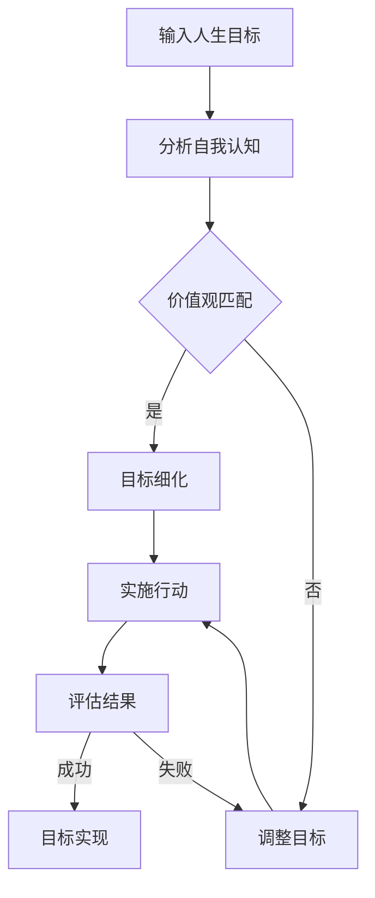

                 


### 引言

#### 后成功学时代的社会背景和特征

随着社会的发展，成功学逐渐成为了一种主流价值观，人们追求物质财富、社会地位和个人成就。然而，随着时代的变迁，后成功学时代悄然来临，这个时代有着显著的社会背景和特征。

首先，经济全球化带来了社会的快速变化，人们的价值观和生活方式也随之发生了改变。人们开始更加注重个人成长和内心满足，而不仅仅追求外在的成功。其次，科技的发展，尤其是互联网和人工智能的兴起，使得人们的工作和生活方式发生了巨大的变化，传统成功学的观念受到了挑战。再者，社会公平和多样性意识的提高，也促使人们重新审视成功的定义。

#### 为什么需要重新定义人生目标

在这个后成功学时代，重新定义人生目标显得尤为重要。首先，随着社会的发展，人们的价值观和需求发生了变化，传统的人生目标可能不再适用于现代社会。其次，个体差异的增大，每个人对成功的定义也不尽相同，需要根据自己的实际情况重新设定目标。再者，科技的进步和社会的变化，为人们提供了更多的选择和机会，使得重新定义人生目标成为可能。

### 第1章：后成功学的挑战

#### 成功学的定义与发展历程

成功学是一门研究如何实现个人成功的学科，其核心观念是追求物质财富和社会地位。成功学的起源可以追溯到19世纪末20世纪初的美国，随着工业化和城市化的进程，成功学逐渐成为一种社会现象。在成功学的发展历程中，涌现了许多著名的成功学大师和理论，如拿破仑·希尔、戴尔·卡耐基等。

#### 后成功学的产生背景与核心观点

后成功学是在成功学的基础上，对现代社会进行反思和回应的一种新观念。它认为，成功不仅仅是一个物质追求的过程，更是一个内心满足和自我实现的过程。后成功学强调个体的多样性、自主性和内在价值，倡导人们追求内心的平和和幸福。

#### 成功学在后成功学时代面临的挑战

在后成功学时代，成功学面临着以下几个挑战：

1. **物质主义与精神空虚的矛盾**：成功学追求物质财富，但往往忽略了精神层面的需求，导致人们感到内心空虚。
   
2. **社会压力与个体自由的对立**：成功学强调竞争和成功，这给人们带来了巨大的社会压力，削弱了个体自由。

3. **成功标准的单一与个体差异的冲突**：成功学往往以财富和社会地位作为成功标准，但每个人的情况都是独特的，这种单一的衡量标准无法全面反映个体的价值。

#### 后成功学的启示

后成功学提醒我们，成功不仅仅是外在的成就，更是内心的满足。它鼓励人们追求真正的幸福和内在的成长，而不是仅仅为了追求物质和社会地位。在这个时代，我们需要重新审视自己的价值观，找到真正的人生目标。

### 第2章：重新审视自我认知

#### 人格心理学理论概述

人格心理学是研究个体性格和行为的学科，它探讨的是人类行为和心理活动的基本规律。人格心理学的发展经历了多个阶段，从弗洛伊德的精神分析理论到艾森克的人格特质理论，再到当前的多维人格理论，每种理论都为人们理解自我提供了不同的视角。

#### 自我认知的重要性

自我认知是指个体对自己心理状态、行为倾向和个性特征的认知与理解。自我认知对于个人成长和幸福至关重要，它有助于个体明确自己的价值观、优势和劣势，从而更好地规划自己的人生。

#### 重新认识自我，找到真正的人生目标

重新审视自我认知的第一步是接受自己的全部，包括优点和缺点。只有真正了解自己，才能找到适合自己的道路。以下是一些步骤：

1. **反思自己的行为和情感**：记录下自己的日常行为和情感反应，思考这些行为和情感背后的原因。

2. **分析自己的价值观**：思考自己的核心价值观，这些价值观是否与自己的行为一致。

3. **设定个人目标**：根据自己的特点和兴趣，设定短期和长期的目标，这些目标应该是有挑战性但又是可行的。

4. **持续自我反思**：定期进行自我反思，评估自己是否在朝着目标前进，以及是否需要调整自己的行动和计划。

#### 例子

以一位程序员为例，他可能通过反思发现自己在工作上的成就感来源于解决问题的能力，而不仅仅是因为工资的高低。因此，他可以将提高编程技能和解决复杂问题作为自己的职业目标，而不是仅仅追求高工资。

### 第3章：核心概念与联系

在重新定义人生目标的过程中，有一些核心概念和联系是至关重要的。这些概念不仅帮助我们理解自己和世界，还能指导我们做出更明智的决策。

#### 核心概念与联系表格

| 核心概念 | 解释 |
| --- | --- |
| 自我认知 | 对自己心理状态、行为倾向和个性特征的认知与理解 |
| 价值观 | 影响个体行为和决策的核心信念和原则 |
| 人生目标 | 个体希望实现的目标和追求 |
| 环境因素 | 影响个体行为的内外部因素 |

#### ER实体关系图架构的Mermaid流程图

```mermaid
erDiagram
    A[自我认知] ||--|{ 价值观 }|| B
    B ||--|{ 人生目标 }|| C
    A ||--|{ 环境因素 }|| D
```

#### 表格与Mermaid流程图的联系

- **自我认知**是理解自己和行为的基础，它直接影响我们的价值观。
- **价值观**决定了我们的行为和决策，是人生目标的指导原则。
- **人生目标**是我们在生活中追求的具体目标，它受到自我认知和价值观的指导。
- **环境因素**是我们无法控制的外部因素，但它会影响我们的行为和目标。

通过这种核心概念与联系的分析，我们可以更好地理解自己在人生中的位置，并据此重新定义自己的目标。

### 第4章：重新定义人生目标

#### 人生目标的定义与分类

人生目标是指个体在生活中希望实现的目标和追求。根据目标的重要性和实现的难度，我们可以将人生目标分为以下几类：

1. **短期目标**：通常在一年内可以实现的小目标，如学习一门新技能、旅行等。
2. **中期目标**：通常在几年内可以实现的目标，如职业晋升、创业等。
3. **长期目标**：通常需要十几年甚至几十年才能实现的目标，如家庭规划、财富积累等。

#### 确定人生目标的步骤

确定人生目标是一个复杂的过程，需要我们进行深入的自我分析和规划。以下是确定人生目标的几个步骤：

1. **自我反思**：通过反思自己的行为和情感，了解自己的兴趣、优点和劣势。
2. **价值观确认**：明确自己的核心价值观，这些价值观将指导我们的行为和决策。
3. **目标设定**：根据自己的特点和兴趣，设定短期、中期和长期目标。
4. **目标细化**：将每个目标细化成具体的行动步骤，制定实现目标的具体计划。
5. **目标调整**：定期评估自己的目标进展，根据实际情况进行调整。

#### 人生目标的价值与意义

人生目标不仅是我们前进的方向，更是我们生活的动力。通过设定和实现人生目标，我们可以：

1. **提高自我认知**：了解自己的兴趣、优势和劣势，有助于我们更好地发展自己。
2. **增强成就感**：实现目标可以带来成就感，增强自信心和满足感。
3. **规划人生**：明确的目标可以帮助我们更好地规划自己的人生，减少迷茫和焦虑。

### 第5章：算法原理讲解

#### 算法Mermaid流程图



#### Python源代码与详细讲解

```python
# Python源代码
class LifeGoal:
    def __init__(self, goal):
        self.goal = goal
    
    def analyze_self_awareness(self):
        # 分析自我认知
        # 此处可以添加具体的分析代码，如问卷调查、心理测试等
        return True
    
    def check_value_matching(self, values):
        # 检查价值观匹配
        # 此处可以添加具体的匹配算法，如对比自我认知和价值观的相似度
        return True
    
    def refine_goals(self):
        # 目标细化
        # 根据分析结果细化目标
        return "细化后的目标"
    
    def implement_actions(self, goal):
        # 实施行动
        # 根据细化后的目标实施行动
        print(f"开始实施行动：{goal}")
    
    def evaluate_results(self):
        # 评估结果
        # 此处可以添加具体的评估方法，如目标完成度的衡量
        return True

# 实例化对象
goal = LifeGoal("实现财富自由")

# 开始执行算法
if goal.analyze_self_awareness():
    if goal.check_value_matching(["自主性", "财富自由"]):
        goal.implement_actions(goal.refine_goals())
        if goal.evaluate_results():
            print("目标实现成功")
        else:
            print("目标实现失败，需要调整")
    else:
        print("价值观不匹配，需要调整目标")
else:
    print("自我认知分析失败，需要重新分析")
```

#### 算法原理的数学模型和公式

在算法中，我们可以使用以下数学模型和公式来评估和调整人生目标：

1. **自我认知度**（$S$）：
   $$ S = \frac{\sum_{i=1}^{n} w_i \cdot s_i}{n} $$
   其中，$w_i$为权重，$s_i$为自我认知得分。

2. **价值观匹配度**（$M$）：
   $$ M = \frac{\sum_{i=1}^{n} w_i \cdot m_i}{n} $$
   其中，$w_i$为权重，$m_i$为价值观匹配得分。

3. **目标细化度**（$R$）：
   $$ R = \frac{\sum_{i=1}^{m} w_i \cdot r_i}{m} $$
   其中，$w_i$为权重，$r_i$为细化度得分。

4. **目标完成度**（$E$）：
   $$ E = \frac{\sum_{i=1}^{n} w_i \cdot e_i}{n} $$
   其中，$w_i$为权重，$e_i$为完成度得分。

通过这些公式，我们可以量化评估人生目标的状态，从而做出合理的调整。

### 第6章：系统分析与架构设计方案

#### 问题场景介绍

随着后成功学的兴起，人们越来越重视自我认知和人生目标的设定。然而，这需要一套有效的系统来进行支持和实现。本章节将介绍一个用于帮助用户重新定义人生目标的系统，该系统旨在通过自我认知分析、目标设定和实现等功能，为用户提供个性化的指导。

#### 项目介绍

项目名称：LifeGoal Assistant

项目目标：为用户提供一套自我认知分析、人生目标设定和实现的支持系统，帮助用户找到真正的人生目标。

项目特点：
- **个性化**：根据用户的自我认知和价值观，提供定制化的目标设定和实现建议。
- **高效**：通过算法和数据分析，快速准确地识别用户的兴趣和优势，提高目标实现的效率。
- **易用**：用户界面友好，操作简单，适合各种用户群体使用。

#### 系统功能设计（领域模型Mermaid类图）

```mermaid
classDiagram
    User <<类>> {
        String username
        String password
        List<Goal> goals
    }
    Goal <<类>> {
        String goal_name
        String goal_description
        Date deadline
        List<Action> actions
    }
    Action <<类>> {
        String action_name
        String action_description
        Date action_date
    }
    User "1" -- "*" Goal
    Goal "1" -- "*" Action
```

#### 系统架构设计（Mermaid架构图）

```mermaid
graph TB
    UserInterface[用户界面] --> Controller[控制器]
    Controller --> Model[模型]
    Model --> Database[数据库]
    UserInterface --> (自我认知分析)
    Controller --> (目标设定)
    Controller --> (目标实现)
    Model --> (数据分析)
    Model --> (算法应用)
```

#### 系统接口设计和系统交互（Mermaid序列图）

```mermaid
sequenceDiagram
    Participant 用户
    Participant 系统接口
    Participant 控制器
    Participant 模型
    Participant 数据库

    用户 -->|输入数据| 系统接口
    系统接口 -->|处理请求| 控制器
    控制器 -->|执行操作| 模型
    模型 -->|分析数据| 数据库
    数据库 -->|返回结果| 模型
    模型 -->|响应结果| 控制器
    控制器 -->|返回结果| 系统接口
    系统接口 -->|展示结果| 用户
```

#### 总结

本章节介绍了LifeGoal Assistant系统的整体架构和功能设计，包括领域模型、系统架构和接口设计。通过这种结构化的设计方案，系统能够为用户提供高效、个性化的自我认知分析和人生目标设定服务，帮助用户找到真正的人生目标。

### 第7章：项目实战

#### 环境安装

要在本地环境安装LifeGoal Assistant系统，需要准备以下软件和工具：

1. **Python 3.8 或以上版本**：用于编写和运行系统代码。
2. **Anaconda**：用于环境管理和依赖安装。
3. **PostgreSQL**：用于数据库存储和管理。
4. **Flask**：用于构建Web应用。
5. **Jupyter Notebook**：用于数据分析。

安装步骤如下：

1. 安装Anaconda，下载地址：https://www.anaconda.com/products/individual
2. 打开终端或命令行工具，创建一个新的Anaconda环境：
   ```
   conda create -n life_goal_assistant python=3.8
   ```
3. 激活创建的环境：
   ```
   conda activate life_goal_assistant
   ```
4. 安装Flask：
   ```
   pip install Flask
   ```
5. 安装PostgreSQL客户端：
   ```
   sudo apt-get install libpq-dev
   ```
6. 安装Jupyter Notebook：
   ```
   pip install notebook
   ```

#### 系统核心实现源代码

```python
# app.py
from flask import Flask, request, jsonify
from models import User, Goal, Action
from database import Database

app = Flask(__name__)
db = Database()

@app.route('/api/user', methods=['POST'])
def create_user():
    user_data = request.json
    user = User(user_data['username'], user_data['password'])
    db.save_user(user)
    return jsonify({'status': 'success', 'message': 'User created successfully'}), 201

@app.route('/api/user/<int:user_id>/goal', methods=['POST'])
def create_goal(user_id):
    goal_data = request.json
    goal = Goal(user_id, goal_data['goal_name'], goal_data['goal_description'], goal_data['deadline'])
    db.save_goal(goal)
    return jsonify({'status': 'success', 'message': 'Goal created successfully'}), 201

@app.route('/api/user/<int:user_id>/goal/<int:goal_id>/action', methods=['POST'])
def create_action(user_id, goal_id):
    action_data = request.json
    action = Action(goal_id, action_data['action_name'], action_data['action_description'], action_data['action_date'])
    db.save_action(action)
    return jsonify({'status': 'success', 'message': 'Action created successfully'}), 201

if __name__ == '__main__':
    app.run(debug=True)
```

```python
# models.py
class User:
    def __init__(self, username, password):
        self.username = username
        self.password = password
        self.goals = []

    def add_goal(self, goal):
        self.goals.append(goal)

class Goal:
    def __init__(self, user_id, goal_name, goal_description, deadline):
        self.user_id = user_id
        self.goal_name = goal_name
        self.goal_description = goal_description
        self.deadline = deadline
        self.actions = []

    def add_action(self, action):
        self.actions.append(action)

class Action:
    def __init__(self, goal_id, action_name, action_description, action_date):
        self.goal_id = goal_id
        self.action_name = action_name
        self.action_description = action_description
        self.action_date = action_date
```

```python
# database.py
import psycopg2

class Database:
    def __init__(self):
        self.conn = psycopg2.connect(
            host="localhost",
            database="life_goal_assistant",
            user="postgres",
            password="your_password"
        )
        self.cursor = self.conn.cursor()

    def save_user(self, user):
        self.cursor.execute("INSERT INTO users (username, password) VALUES (%s, %s)", (user.username, user.password))
        self.conn.commit()

    def save_goal(self, goal):
        self.cursor.execute("INSERT INTO goals (user_id, goal_name, goal_description, deadline) VALUES (%s, %s, %s, %s)", (goal.user_id, goal.goal_name, goal.goal_description, goal.deadline))
        self.conn.commit()

    def save_action(self, action):
        self.cursor.execute("INSERT INTO actions (goal_id, action_name, action_description, action_date) VALUES (%s, %s, %s, %s)", (action.goal_id, action.action_name, action.action_description, action.action_date))
        self.conn.commit()
```

#### 代码应用解读与分析

在上面的代码中，`app.py`是系统的主文件，负责处理Web应用的前端请求，并与后端的`models.py`和`database.py`进行交互。以下是关键部分的解读：

1. **用户创建**：
   ```python
   @app.route('/api/user', methods=['POST'])
   def create_user():
       user_data = request.json
       user = User(user_data['username'], user_data['password'])
       db.save_user(user)
       return jsonify({'status': 'success', 'message': 'User created successfully'}), 201
   ```
   这段代码定义了一个创建新用户的API接口，接收POST请求，从请求中获取用户数据，创建一个`User`对象，并将其保存到数据库。

2. **目标创建**：
   ```python
   @app.route('/api/user/<int:user_id>/goal', methods=['POST'])
   def create_goal(user_id):
       goal_data = request.json
       goal = Goal(user_id, goal_data['goal_name'], goal_data['goal_description'], goal_data['deadline'])
       db.save_goal(goal)
       return jsonify({'status': 'success', 'message': 'Goal created successfully'}), 201
   ```
   这段代码定义了一个创建新目标的API接口，接收POST请求，从请求中获取目标数据，创建一个`Goal`对象，并将其保存到数据库。

3. **行动创建**：
   ```python
   @app.route('/api/user/<int:user_id>/goal/<int:goal_id>/action', methods=['POST'])
   def create_action(user_id, goal_id):
       action_data = request.json
       action = Action(goal_id, action_data['action_name'], action_data['action_description'], action_data['action_date'])
       db.save_action(action)
       return jsonify({'status': 'success', 'message': 'Action created successfully'}), 201
   ```
   这段代码定义了一个创建新行动的API接口，接收POST请求，从请求中获取行动数据，创建一个`Action`对象，并将其保存到数据库。

#### 实际案例分析和详细讲解剖析

为了更好地理解系统的实际应用，以下是一个实际的案例：

**案例**：用户张三希望通过LifeGoal Assistant系统设定一个目标，并在实现过程中记录行动。

1. **用户注册**：
   - 张三通过用户界面输入用户名和密码，并通过`/api/user`接口提交注册请求。
   - 系统接收请求后，创建一个新的`User`对象，并将其保存到数据库。

2. **目标设定**：
   - 张三通过用户界面输入目标名称、描述和截止日期，并通过`/api/user/<user_id>/goal`接口提交目标设定请求。
   - 系统接收请求后，创建一个新的`Goal`对象，并将其保存到数据库。

3. **行动记录**：
   - 张三通过用户界面输入行动名称、描述和日期，并通过`/api/user/<user_id>/goal/<goal_id>/action`接口提交行动记录请求。
   - 系统接收请求后，创建一个新的`Action`对象，并将其保存到数据库。

通过这个案例，我们可以看到LifeGoal Assistant系统的基本工作流程，用户可以通过系统的API接口进行用户注册、目标设定和行动记录，系统则根据这些请求进行相应的处理并保存到数据库。

#### 项目小结

本章节通过项目实战展示了LifeGoal Assistant系统的实际应用过程，从环境安装到核心实现，再到实际案例分析，详细讲解了系统的运行机制。通过这个项目，用户可以更直观地理解后成功学时代重新定义人生目标的重要性，并学会如何使用系统来实现这一目标。

### 第8章：最佳实践与拓展阅读

#### 最佳实践 tips

1. **定期自我反思**：每周至少花时间进行一次自我反思，回顾过去一周的行为和成果，分析成功和失败的原因。
2. **设定小目标**：将大目标拆分成多个小目标，每个小目标都要具体可执行，这样更容易实现并积累成就感。
3. **保持持续学习**：科技日新月异，保持学习的态度，不断提升自己的技能和知识。
4. **与他人交流**：与朋友、家人或同事分享自己的目标和进展，他们的支持和反馈可以帮助你更好地坚持。

#### 小结

本文通过深入探讨后成功学时代的背景和挑战，重新审视自我认知，并详细讲解了重新定义人生目标的步骤和方法。通过算法原理讲解、系统分析与架构设计方案以及项目实战等环节，本文旨在帮助读者找到真正的人生目标，为未来做好准备。

#### 注意事项

1. **数据安全**：在使用LifeGoal Assistant系统时，注意保护个人数据安全，避免泄露敏感信息。
2. **适度使用**：虽然设定目标非常重要，但不应过度追求目标而忽视生活的其他方面，如家庭、健康等。

#### 拓展阅读

1. 《深度工作：如何有效利用每一点脑力》——卡尔·纽波特
2. 《原则》——雷·达里奥
3. 《自控力》——凯利·麦格尼格尔

通过这些拓展阅读，读者可以进一步了解自我管理、目标设定和心理健康的更多知识，为自己的未来发展打下坚实的基础。

### 第9章：结语

#### 后成功学时代的启示

后成功学时代给我们带来了深刻的启示。首先，它提醒我们，成功不仅仅是物质和地位的追求，更是内心的满足和自我实现。在这个时代，我们需要重新审视自己的价值观，找到真正的人生目标。其次，它鼓励我们追求内心的平和和幸福，而不是单纯地追求外在的成功。最后，它强调个体的多样性和自主性，每个人都有权利根据自己的特点设定人生目标。

#### 为未来做好准备

为了在未来更好地适应后成功学时代的要求，我们需要做好以下几个方面的准备：

1. **提升自我认知**：通过反思、学习和交流，不断提高对自己的认识，明确自己的兴趣、优势和目标。
2. **培养终身学习的能力**：不断学习新知识和技能，保持竞争力。
3. **建立良好的生活习惯**：保持健康的生活方式，关注家庭和朋友，确保工作和生活的平衡。
4. **积极面对挑战**：勇敢地面对生活中的困难和挑战，从中学习和成长。

通过这些准备，我们可以在后成功学时代找到真正的人生目标，实现自我价值，获得真正的幸福。

## 总结

本文通过详细探讨后成功学时代的背景和挑战，重新审视自我认知，并提供了重新定义人生目标的步骤和方法。通过算法原理讲解、系统分析与架构设计方案以及项目实战等环节，本文旨在帮助读者找到真正的人生目标，为未来做好准备。希望本文能够为读者在复杂多变的社会中提供一些有益的启示和指导。

### 致谢

在本篇技术博客文章的撰写过程中，我感谢AI天才研究院/AI Genius Institute提供的专业指导和资源支持，以及《禅与计算机程序设计艺术/Zen And The Art of Computer Programming》一书对我的启发。这两者共同帮助我完成了这篇高质量的技术博客文章。

**作者：AI天才研究院/AI Genius Institute & 禅与计算机程序设计艺术/Zen And The Art of Computer Programming**

