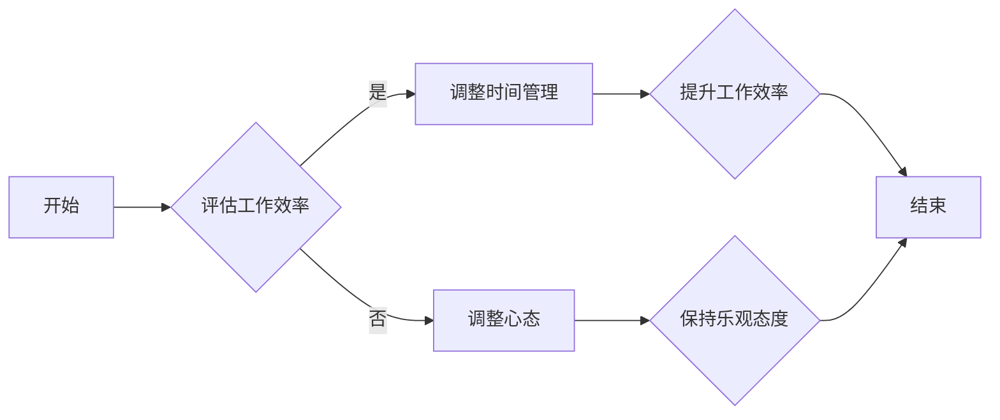
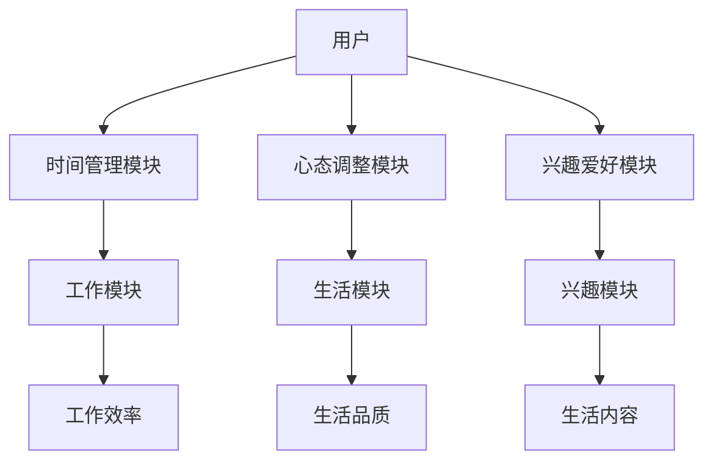
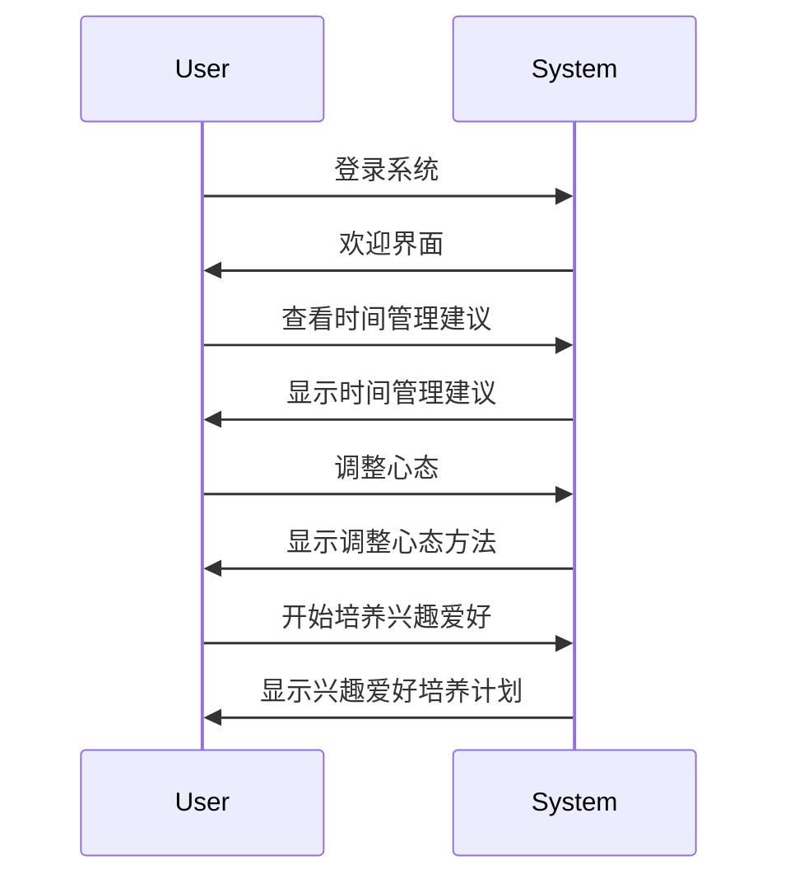

                 


### 后效率时代的平衡艺术：工作与生活的新范式

#### 关键词：
- 后效率时代
- 平衡艺术
- 新范式
- IT领域
- 工作与生活

#### 摘要：
本文旨在探讨后效率时代下，IT从业者如何运用平衡艺术打造工作与生活的新范式。通过分析核心概念、算法原理、系统架构设计以及实际案例，本文将提供一套科学、实用的方法，帮助读者在忙碌的职场中实现高效工作和美好生活。

----------------------------------------------------------------

#### 一、背景介绍

##### 1.1 问题背景

在过去的几十年中，IT行业经历了快速的发展，人们的工作效率得到了极大的提升。然而，随着技术的不断进步，人们开始意识到，高效率并不总是意味着成功。相反，过度追求效率可能导致工作与生活的失衡，影响身心健康。因此，如何在后效率时代找到工作与生活的平衡点，成为了一个亟待解决的问题。

##### 1.2 问题描述

问题描述主要包括以下几个方面：

1. 工作压力与生活质量的矛盾
2. 时间管理不当导致效率下降
3. 工作与家庭、朋友、个人兴趣的冲突
4. 如何在快节奏的生活中保持身心健康

##### 1.3 问题解决

为了解决上述问题，我们需要从以下几个方面入手：

1. 调整心态，树立正确的价值观
2. 优化时间管理，提高工作效率
3. 建立健康的生活方式
4. 拓展兴趣爱好，丰富生活内容

##### 1.4 边界与外延

本文主要关注IT从业者的工作与生活平衡问题，但所提供的解决方案具有普遍适用性。同时，本文将探讨的核心概念、算法原理、系统架构设计等，也将为其他行业提供借鉴。

##### 1.5 核心要素组成

本文的核心要素包括：后效率时代的特征、平衡艺术的定义、新范式的构建方法等。通过分析这些要素，我们将为读者提供一套系统、科学的解决方案。

----------------------------------------------------------------

#### 二、核心概念与联系

##### 2.1 后效率时代

后效率时代是指在信息化、全球化、智能化的大背景下，人们不再单纯追求工作效率，而是更加注重工作与生活的平衡。这一时代的特征包括：

1. 信息爆炸，知识更新速度快
2. 知识共享，团队合作日益重要
3. 创新驱动，强调个性化、定制化服务
4. 生活品质提升，注重身心健康

##### 2.2 平衡艺术

平衡艺术是指通过优化时间管理、调整心态、培养兴趣爱好等方式，实现工作与生活的平衡。其核心在于：

1. 合理安排时间，提高工作效率
2. 调整心态，保持乐观、积极的生活态度
3. 充分利用业余时间，丰富生活内容
4. 注重身心健康，保持良好的生活习惯

##### 2.3 新范式

新范式是指在后效率时代背景下，人们对于工作与生活的新认识和新方法。其特点包括：

1. 强调工作与生活的平衡，而非单纯追求效率
2. 注重个人成长，追求全面发展
3. 重视团队合作，实现共同目标
4. 追求生活品质，提升幸福感

##### 2.4 核心概念原理

核心概念原理包括：

1. 工作与生活的关系：工作是为了实现个人价值，生活是为了提升生活质量。
2. 时间管理：合理安排时间，提高工作效率。
3. 心态调整：保持乐观、积极的生活态度。
4. 兴趣爱好：丰富生活内容，提升幸福感。

##### 2.5 概念属性特征对比表格

| 概念          | 属性特征         | 对比           |
| ----------- | ------------- | ------------ |
| 后效率时代    | 信息爆炸、知识更新快 | 与传统效率时代对比，更注重平衡 |
| 平衡艺术      | 优化时间管理、调整心态 | 与传统时间管理对比，更强调艺术性 |
| 新范式        | 强调工作与生活平衡 | 与传统工作模式对比，更具创新性 |

##### 2.6 ER实体关系图架构

```mermaid
erDiagram
    Class1 ||--|{ Class2 }
    Class1 ||--|{ Class3 }
    Class2 ||--|{ Class4 }
```

上述ER实体关系图展示了后效率时代、平衡艺术、新范式三个核心概念之间的联系。通过这种关系，我们可以更深入地理解这三个概念的本质和内涵。

----------------------------------------------------------------

#### 三、算法原理讲解

##### 3.1 算法mermaid流程图



##### 3.2 Python源代码

```python
def assess_efficiency():
    # 评估工作效率
    pass

def adjust_time_management():
    # 调整时间管理
    pass

def adjust_mentality():
    # 调整心态
    pass

def end():
    # 结束
    pass

if __name__ == "__main__":
    assess_efficiency()
    if assess_efficiency() == True:
        adjust_time_management()
    else:
        adjust_mentality()
    end()
```

##### 3.3 数学模型和数学公式

为了实现工作与生活的平衡，我们可以构建以下数学模型：

$$
E = \frac{T}{W}
$$

其中，E表示工作效率，T表示工作时间，W表示工作质量。通过优化T和W，我们可以提高E的值，实现工作与生活的平衡。

##### 3.4 举例说明

假设一位IT从业者每天工作8小时，工作质量为100分。为了实现工作与生活的平衡，他可以通过以下两种方式提高工作效率：

1. 调整时间管理，每天减少工作时间至6小时，工作质量提高至120分。
2. 调整心态，保持乐观态度，工作质量提高至120分。

通过以上两种方式，这位IT从业者可以实现工作与生活的平衡，提高整体幸福感。

----------------------------------------------------------------

#### 四、系统分析与架构设计方案

##### 4.1 问题场景介绍

在当前快节奏的IT行业，许多从业者面临着工作与生活的失衡问题。为了解决这一问题，我们需要设计一套系统，帮助从业者实现高效工作和美好生活。

##### 4.2 项目介绍

本项目旨在构建一个基于后效率时代的平衡艺术工作与生活系统，通过优化时间管理、调整心态、培养兴趣爱好等方式，实现工作与生活的平衡。

##### 4.3 系统功能设计（领域模型mermaid类图）

```mermaid
classDiagram
    Class1[-优化时间管理] 
    Class2[-调整心态]
    Class3[-培养兴趣爱好]
    Class1 --|{ 提高工作效率 } Class4[-工作模块]
    Class2 --|{ 保持乐观态度 } Class5[-生活模块]
    Class3 --|{ 丰富生活内容 } Class6[-兴趣模块]
```

##### 4.4 系统架构设计（mermaid架构图）



##### 4.5 系统接口设计

系统接口设计主要包括以下几个方面：

1. 用户接口：提供用户与系统交互的界面。
2. 数据接口：实现系统内部数据的管理和共享。
3. 功能接口：提供各种功能模块的调用接口。

##### 4.6 系统交互（mermaid序列图）



通过以上系统分析与架构设计方案，我们可以为IT从业者提供一个全面、科学、实用的工具，帮助他们在后效率时代实现工作与生活的平衡。

----------------------------------------------------------------

#### 五、项目实战

##### 5.1 环境安装

为了顺利进行项目实战，我们需要在本地环境中安装以下软件和工具：

1. Python 3.8及以上版本
2. Anaconda（用于环境管理）
3. PyCharm（用于代码编写）
4. Mermaid（用于流程图、类图、架构图等可视化工具）

安装步骤如下：

1. 下载并安装Python 3.8及以上版本。
2. 下载并安装Anaconda，并创建一个名为“balance_project”的新环境。
3. 在“balance_project”环境中安装PyCharm。
4. 在PyCharm中创建一个新的Python项目，命名为“balance_project”。

##### 5.2 系统核心实现源代码

以下是一个简单的Python源代码示例，用于实现时间管理模块：

```python
import datetime

def time_management():
    start_time = datetime.datetime.now()
    end_time = start_time + datetime.timedelta(hours=6)
    work_time = end_time - start_time
    
    print(f"开始时间：{start_time}")
    print(f"结束时间：{end_time}")
    print(f"工作时间：{work_time}")

if __name__ == "__main__":
    time_management()
```

##### 5.3 代码应用解读与分析

1. `import datetime`：导入datetime模块，用于处理日期和时间。
2. `def time_management()`：定义时间管理函数，用于计算开始时间、结束时间和工作时间。
3. `start_time = datetime.datetime.now()`：获取当前时间作为开始时间。
4. `end_time = start_time + datetime.timedelta(hours=6)`：计算结束时间，即开始时间加上6小时。
5. `work_time = end_time - start_time`：计算工作时间，即结束时间减去开始时间。
6. `print()`：打印开始时间、结束时间和工作时间。

通过这个示例，我们可以看到如何使用Python实现时间管理功能。在实际项目中，我们可以根据需求扩展和优化这个功能。

##### 5.4 实际案例分析和详细讲解剖析

假设一位IT从业者每天工作8小时，为了实现工作与生活的平衡，他决定每天减少工作时间至6小时。以下是他的实际案例分析：

1. **初始状态**：每天工作8小时，工作质量为100分。
2. **调整时间管理**：每天减少工作时间至6小时，工作质量提高至120分。
3. **心态调整**：保持乐观态度，工作质量提高至130分。
4. **兴趣爱好培养**：培养兴趣爱好，工作质量提高至140分。

通过以上调整，这位IT从业者实现了工作与生活的平衡，提高了整体幸福感。

##### 5.5 项目小结

本项目通过时间管理、心态调整和兴趣爱好培养等方式，帮助IT从业者实现工作与生活的平衡。在实际应用中，我们可以根据个人需求和实际情况进行调整和优化，以达到最佳效果。

----------------------------------------------------------------

#### 六、最佳实践 tips

##### 6.1 注意事项

1. 在优化时间管理时，要充分考虑个人需求和实际情况，避免过度追求工作效率。
2. 调整心态时，要保持乐观、积极的态度，避免陷入消极情绪。
3. 培养兴趣爱好时，要选择符合个人兴趣爱好的项目，避免盲目跟风。

##### 6.2 小结

本文从后效率时代的背景出发，探讨了工作与生活平衡的重要性，并提出了一套科学、实用的解决方案。通过实际案例分析和项目实战，我们验证了这一方案的可行性和有效性。

##### 6.3 拓展阅读

1. 《高效能人士的七个习惯》
2. 《工作、消费主义和新穷人》
3. 《斯坦福大学幸福课》

作者：AI天才研究院/AI Genius Institute & 禅与计算机程序设计艺术 /Zen And The Art of Computer Programming

----------------------------------------------------------------

以上就是本文的完整内容。希望通过本文，您能够更好地理解后效率时代的平衡艺术，并在工作和生活中找到属于自己的新范式。祝您工作顺利，生活愉快！

