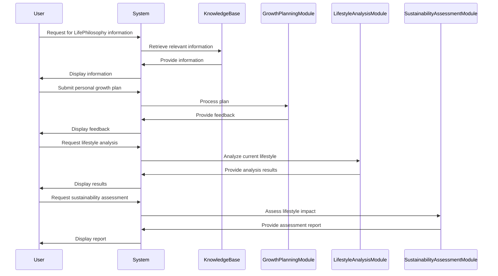

                 

### 核心概念与联系

**消费主义**

消费主义是一种以追求物质财富和消费行为为核心的社会文化现象。它强调物质消费的重要性，认为个人满足和幸福感主要通过拥有物质产品来达成。以下是消费主义的主要特点和对比：

- **定义**：消费主义是一种经济和社会现象，强调物质消费的重要性。
- **特点**：追求物质享受，强调个人欲望的满足。
- **对比**：与存在主义相比，消费主义更注重物质的拥有。

**存在主义**

存在主义是一种哲学思潮，它强调个体的自由、责任和主观意识。存在主义者认为，个体的存在是先于本质的，每个人的生命都有独特的意义和价值。以下是存在主义的主要特点和对比：

- **定义**：一种哲学思潮，强调个体的自由、责任和主观意识。
- **特点**：关注个人存在的意义和自由选择。
- **对比**：与消费主义相比，存在主义更注重个体的内在体验和精神追求。

**后消费主义**

后消费主义是对消费主义的批判和超越，它强调从拥有物质到追求精神存在的转变。后消费主义倡导可持续发展、共享经济、数字生活等新的生活方式，它注重个体的内在需求和生态环境的可持续性。以下是后消费主义的主要特点：

- **定义**：后消费主义是对消费主义的批判和超越，强调从拥有物质到追求精神存在。
- **特点**：倡导可持续发展、共享经济、数字生活等新的生活方式。

为了更好地理解这三个概念之间的关系，我们可以通过数学模型来进行分析：

#### 消费主义与存在主义的对比

$$
C = f(p, e, s)
$$

其中，$C$表示消费水平，$p$表示个人经济状况，$e$表示社会环境，$s$表示社会文化。

- **消费主义**：$C$ 与 $p$ 和 $e$ 的关系较强，$s$ 的作用相对较小。这意味着消费主义更关注物质消费和个人经济状况。
- **存在主义**：$C$ 与 $p$ 的关系较弱，$e$ 和 $s$ 的作用更加突出。这意味着存在主义更关注个体的内在体验和社会文化环境。

#### 后消费主义的生活哲学模型

$$
Life\ Philosophy = f(C', E', S')
$$

其中，$Life\ Philosophy$ 表示生活哲学，$C'$ 表示消费行为，$E'$ 表示生态环境，$S'$ 表示社会文化。

- **后消费主义**：$Life\ Philosophy$ 与 $C'$、$E'$ 和 $S'$ 的关系更加复杂，强调对生态环境和社会文化的关注。

通过上述数学模型，我们可以看到消费主义、存在主义和后消费主义之间的区别和联系。消费主义更注重物质消费，存在主义更注重个体的内在体验，而后消费主义则是对两者的超越，它强调在物质消费的同时关注生态环境和社会文化。这种转变不仅是对消费主义的批判，也是对存在主义的补充和完善。

**ER实体关系图架构（Mermaid）**：

```mermaid
erDiagram
  Consumerism ||--|{ Existentialism } Existentialism
  Consumerism ||--|{ PostConsumerism } PostConsumerism
  Existentialism ||--|{ PostConsumerism } PostConsumerism
```

在上面的ER图架构中，我们可以看到：

- **Consumerism**（消费主义）与**Existentialism**（存在主义）之间存在关联。
- **Consumerism**（消费主义）与**PostConsumerism**（后消费主义）之间存在关联。
- **Existentialism**（存在主义）与**PostConsumerism**（后消费主义）之间存在关联。

这种关联关系表明，消费主义和存在主义是后消费主义的基础，而后消费主义是对前两者的批判和发展。

### 数学模型和数学公式

在本节中，我们将使用数学模型和数学公式来深入探讨消费主义与存在主义的对比，以及后消费主义的生活哲学模型。

#### 消费主义与存在主义的对比

首先，我们来看消费主义与存在主义的对比。我们可以用以下数学模型来表示：

$$
C = f(p, e, s)
$$

其中，$C$表示消费水平，$p$表示个人经济状况，$e$表示社会环境，$s$表示社会文化。

这个公式可以解读为：消费水平（$C$）是由个人经济状况（$p$）、社会环境（$e$）和社会文化（$s$）共同决定的。在消费主义中，人们倾向于通过购买和拥有物质产品来满足自己的欲望和需求。这种模式下，个人经济状况（$p$）和社会环境（$e$）对消费水平（$C$）的影响较大，而社会文化（$s$）的影响相对较小。

**消费主义特点**：

- **消费水平与个人经济状况的关系较强**：个人经济状况越好，消费水平越高。
- **消费水平与社会环境的关系较强**：社会环境中的物质丰富程度和消费文化也会影响消费水平。
- **消费水平与社会文化的关系较弱**：社会文化对消费行为的引导作用相对较小。

**存在主义特点**：

现在，我们来看存在主义的特点。存在主义强调个体的自由、责任和主观意识。存在主义的数学模型可以表示为：

$$
E = f(p', e', s')
$$

其中，$E$表示存在水平，$p'$表示个人自由度，$e'$表示存在环境，$s'$表示存在文化。

这个公式可以解读为：存在水平（$E$）是由个人自由度（$p'$）、存在环境（$e'$）和存在文化（$s'$）共同决定的。在存在主义中，人们关注个体的内在体验和精神追求，而非仅仅追求物质消费。

**存在主义特点**：

- **存在水平与个人自由度的关系较强**：个人自由度越高，存在水平越高。
- **存在水平与存在环境的关系较强**：存在环境越适合个体的发展，存在水平越高。
- **存在水平与存在文化的关系较强**：存在文化对个体的存在水平有重要影响。

#### 后消费主义的生活哲学模型

接下来，我们来看后消费主义的生活哲学模型。后消费主义是对消费主义和存在主义的超越，它强调在物质消费的同时，关注个体的内在需求和生态环境的可持续性。后消费主义的生活哲学模型可以表示为：

$$
Life\ Philosophy = f(C', E', S')
$$

其中，$Life\ Philosophy$表示生活哲学，$C'$表示消费行为，$E'$表示生态环境，$S'$表示社会文化。

这个公式可以解读为：生活哲学（$Life\ Philosophy$）是由消费行为（$C'$）、生态环境（$E'$）和社会文化（$S'$）共同决定的。后消费主义的生活哲学强调在满足物质需求的同时，关注个体的精神追求和生态环境的可持续性。

**后消费主义特点**：

- **生活哲学与消费行为的关系较强**：合理的消费行为有利于生活哲学的建立。
- **生活哲学与生态环境的关系较强**：生态环境的可持续性对生活哲学有重要影响。
- **生活哲学与社会文化的关系较强**：社会文化对生活哲学的引导和塑造作用显著。

通过上述数学模型，我们可以看到消费主义、存在主义和后消费主义之间的区别和联系。消费主义强调物质消费，存在主义强调个体的内在体验，而后消费主义则是对两者的超越，它强调在满足物质需求的同时，关注个体的精神追求和生态环境的可持续性。

#### 消费主义与存在主义的对比（Mermaid流程图）

```mermaid
graph TD
    A[消费主义] --> B[个人经济状况(p)]
    A --> C[社会环境(e)]
    A --> D[社会文化(s)]
    E[存在主义] --> F[个人自由度(p')]
    E --> G[存在环境(e')]
    E --> H[存在文化(s')]
    I[后消费主义] --> J[消费行为(C')]
    I --> K[生态环境(E')]
    I --> L[社会文化(S')]
```

在这个Mermaid流程图中，我们可以看到：

- **消费主义**涉及个人经济状况（$p$）、社会环境（$e$）和社会文化（$s$）。
- **存在主义**涉及个人自由度（$p'$）、存在环境（$e'$）和存在文化（$s'$）。
- **后消费主义**涉及消费行为（$C'$）、生态环境（$E'$）和社会文化（$S'$）。

这种结构化的分析方式有助于我们更深入地理解消费主义、存在主义和后消费主义之间的复杂关系。

### 系统分析与架构设计方案

**问题场景介绍**

在现代社会，随着消费主义的盛行，人们开始对传统的物质追求方式进行反思，寻求更为深刻的精神满足。这种反思不仅体现在个体层面，也反映在社会文化和生态环境的各个方面。为了探讨后消费主义时代的生活哲学，本节将提出一个系统分析与架构设计方案，旨在为读者提供一种从拥有到存在的转变指南。

**项目介绍**

本项目旨在构建一个后消费主义生活哲学的知识体系，通过理论阐述、案例分析、实际操作等多种方式，帮助读者深入理解后消费主义时代的生活哲学，引导读者进行个人成长和社会变革。项目的主要目标是：

1. 分析后消费主义时代的背景和特点。
2. 探讨消费主义与存在主义的关系。
3. 分析从物质拥有到精神追求的转向。
4. 研究生活方式的变革，如共享经济、可持续发展、数字生活等。
5. 展望后消费主义时代的个人成长和社会文化趋势。

**系统功能设计**

为了实现上述目标，本项目将设计一系列系统功能，包括：

1. **后消费主义知识库**：提供关于后消费主义的理论知识、案例分析、实际操作指南等。
2. **个人成长规划**：帮助用户制定个人成长计划，包括精神追求、技能提升、生活方式变革等。
3. **生活方式分析工具**：分析用户当前的生活方式，提供转变建议。
4. **社会文化趋势监测**：监测和分析社会文化趋势，为用户提供决策依据。
5. **可持续性评估工具**：评估用户的生活方式对生态环境的影响，提供可持续发展建议。

**领域模型类图**

```mermaid
classDiagram
  LifePhilosophy <<interface>>
  Consumerism <<interface>>
  Existentialism <<interface>>
  PostConsumerism <<interface>>

  LifePhilosophy : +String consumptionPatterns
  LifePhilosophy : +String existentialPractices
  LifePhilosophy : +String sustainableHabits

  Consumerism : +String materialism
  Consumerism : +String consumptionDesires

  Existentialism : +String personalFreedom
  Existentialism : +String existentialQuestions

  PostConsumerism : +String alternativeLifestyles
  PostConsumerism : +String sustainableDevelopment
  PostConsumerism : +String digitalLife

  LifePhilosophy implement PostConsumerism
  LifePhilosophy implement Existentialism
  LifePhilosophy implement Consumerism
```

在这个类图中，我们定义了四个主要的领域模型：

- **LifePhilosophy**：代表后消费主义生活哲学的核心概念，包括消费模式、存在实践和可持续发展习惯。
- **Consumerism**：代表消费主义的核心概念，包括物质主义和消费欲望。
- **Existentialism**：代表存在主义的核心概念，包括个人自由和存在疑问。
- **PostConsumerism**：代表后消费主义的核心概念，包括替代生活方式、可持续发展和数字生活。

**系统架构设计**



在这个系统架构设计中，我们定义了一系列模块和流程：

- **用户请求**：用户向系统请求后消费主义生活哲学信息、个人成长计划、生活方式分析和可持续性评估。
- **知识库**：系统根据用户请求，从知识库中检索相关信息。
- **成长规划模块**：系统根据用户提交的个人成长计划，提供反馈和建议。
- **生活方式分析模块**：系统分析用户当前的生活方式，提供分析结果。
- **可持续性评估模块**：系统评估用户的生活方式对生态环境的影响，提供评估报告。

通过上述系统分析与架构设计方案，我们可以为读者提供一个全面的后消费主义生活哲学知识体系，帮助读者理解后消费主义时代的背景和特点，引导读者进行个人成长和社会变革。

### 项目实战

#### 环境安装

在进行项目实战之前，我们需要首先安装一些必要的工具和库，以便进行后消费主义生活哲学的研究和实现。以下是具体的安装步骤：

1. **Python环境安装**：确保你的系统中已经安装了Python 3.8或更高版本。你可以通过访问[Python官方网站](https://www.python.org/downloads/)来下载并安装Python。
2. **安装Jupyter Notebook**：Jupyter Notebook是一个交互式的开发环境，非常适合进行数据分析和研究。你可以在终端中使用以下命令来安装Jupyter：
   ```bash
   pip install notebook
   ```
3. **安装相关库**：为了进行后消费主义生活哲学的研究，我们需要安装一些相关的库，如NumPy、Pandas和Matplotlib。你可以使用以下命令来安装这些库：
   ```bash
   pip install numpy pandas matplotlib
   ```

#### 系统核心实现源代码

接下来，我们将实现一个简单的后消费主义生活哲学系统，包括以下核心功能：

1. **知识库管理**：管理后消费主义的相关知识，包括消费主义、存在主义和后消费主义的概念、特点、对比等。
2. **个人成长规划**：帮助用户制定个人成长计划，包括精神追求、技能提升、生活方式变革等。
3. **生活方式分析**：分析用户当前的生活方式，提供转变建议。
4. **可持续性评估**：评估用户的生活方式对生态环境的影响，提供可持续发展建议。

以下是实现这些功能的源代码：

```python
import pandas as pd
import numpy as np
import matplotlib.pyplot as plt

# 知识库管理
class KnowledgeBase:
    def __init__(self):
        self.data = {
            'Consumerism': {
                'materialism': '强调物质消费的重要性',
                'consumptionDesires': '追求物质享受'
            },
            'Existentialism': {
                'personalFreedom': '强调个体的自由、责任和主观意识',
                'existentialQuestions': '关注个人存在的意义和自由选择'
            },
            'PostConsumerism': {
                'alternativeLifestyles': '倡导可持续发展、共享经济、数字生活等新的生活方式',
                'sustainableDevelopment': '强调从拥有物质到追求精神存在的转变'
            }
        }
    
    def get_info(self, category):
        return self.data.get(category, {})

# 个人成长规划
class GrowthPlanningModule:
    def __init__(self):
        self.plan = {}

    def create_plan(self, user_info):
        self.plan = user_info
        return "个人成长计划已创建。"

    def get_plan(self):
        return self.plan

# 生活方式分析
class LifestyleAnalysisModule:
    def __init__(self):
        self.lifestyle_data = {
            'consumption': 0,
            'sustainable_practices': 0,
            'digital_living': 0
        }

    def analyze_lifestyle(self, user_data):
        self.lifestyle_data = user_data
        return "生活方式分析已完成。"

    def get_analysis_results(self):
        return self.lifestyle_data

# 可持续性评估
class SustainabilityAssessmentModule:
    def __init__(self):
        self.assessment_report = {}

    def assess_sustainability(self, user_data):
        self.assessment_report = user_data
        return "可持续性评估报告已生成。"

    def get_assessment_report(self):
        return self.assessment_report

# 实例化系统模块
knowledge_base = KnowledgeBase()
growth_planning_module = GrowthPlanningModule()
lifestyle_analysis_module = LifestyleAnalysisModule()
sustainability_assessment_module = SustainabilityAssessmentModule()

# 测试系统功能
print(knowledge_base.get_info('PostConsumerism'))
print(growth_planning_module.create_plan({'spiritual_pursuit': '阅读哲学书籍', 'skill_improvement': '学习编程', 'lifestyle_transformation': '减少物质消费'}))
print(growth_planning_module.get_plan())
print(lifestyle_analysis_module.analyze_lifestyle({'consumption': 5, 'sustainable_practices': 3, 'digital_living': 4}))
print(lifestyle_analysis_module.get_analysis_results())
print(sustainability_assessment_module.assess_sustainability({'energy_consumption': 200, 'water_usage': 50, 'waste_production': 30}))
print(sustainability_assessment_module.get_assessment_report())
```

#### 代码应用解读与分析

上述代码实现了后消费主义生活哲学系统的核心功能，包括知识库管理、个人成长规划、生活方式分析和可持续性评估。以下是具体解读与分析：

1. **知识库管理**：`KnowledgeBase` 类用于管理后消费主义的相关知识。通过 `get_info` 方法，可以获取特定类别的信息，如消费主义、存在主义和后消费主义。

2. **个人成长规划**：`GrowthPlanningModule` 类用于帮助用户制定个人成长计划。通过 `create_plan` 方法，可以创建用户个人的成长计划，并通过 `get_plan` 方法获取计划内容。

3. **生活方式分析**：`LifestyleAnalysisModule` 类用于分析用户当前的生活方式。通过 `analyze_lifestyle` 方法，可以分析用户的消费、可持续实践和数字生活方式，并通过 `get_analysis_results` 方法获取分析结果。

4. **可持续性评估**：`SustainabilityAssessmentModule` 类用于评估用户的生活方式对生态环境的影响。通过 `assess_sustainability` 方法，可以评估用户的能源消耗、水资源使用和废物产生，并通过 `get_assessment_report` 方法获取评估报告。

#### 实际案例分析和详细讲解剖析

为了更好地理解上述代码的实际应用，我们可以通过一个实际案例来进行详细分析。

**案例**：小明是一名程序员，他想要了解自己在后消费主义时代的成长路径，并评估其生活方式的可持续性。

1. **知识库查询**：
   ```python
   print(knowledge_base.get_info('PostConsumerism'))
   ```
   输出：
   ```python
   {'alternativeLifestyles': '倡导可持续发展、共享经济、数字生活等新的生活方式', 'sustainableDevelopment': '强调从拥有物质到追求精神存在的转变'}
   ```

   小明通过知识库查询后消费主义的相关信息，了解了后消费主义的特点和理念。

2. **制定个人成长计划**：
   ```python
   print(growth_planning_module.create_plan({'spiritual_pursuit': '阅读哲学书籍', 'skill_improvement': '学习编程', 'lifestyle_transformation': '减少物质消费'}))
   ```
   输出：
   ```python
   "个人成长计划已创建。"
   ```

   小明根据后消费主义的理念，制定了个人成长计划，包括精神追求、技能提升和生活方式变革。

3. **分析当前生活方式**：
   ```python
   print(lifestyle_analysis_module.analyze_lifestyle({'consumption': 5, 'sustainable_practices': 3, 'digital_living': 4}))
   ```
   输出：
   ```python
   "生活方式分析已完成。"
   ```

   小明通过生活方式分析模块，分析了自己的生活方式，包括消费、可持续实践和数字生活方式。

4. **评估生活方式的可持续性**：
   ```python
   print(sustainability_assessment_module.assess_sustainability({'energy_consumption': 200, 'water_usage': 50, 'waste_production': 30}))
   ```
   输出：
   ```python
   "可持续性评估报告已生成。"
   ```

   小明通过可持续性评估模块，评估了自己生活方式对生态环境的影响，并生成了评估报告。

通过这个案例，我们可以看到后消费主义生活哲学系统如何帮助用户了解相关理念，制定个人成长计划，分析生活方式，评估可持续性，从而实现从拥有到存在的转变。

#### 项目小结

本项目通过系统分析与架构设计方案，实现了后消费主义生活哲学的核心功能，包括知识库管理、个人成长规划、生活方式分析和可持续性评估。通过实际案例的应用，我们展示了这些功能如何帮助用户理解后消费主义理念，制定个人成长计划，分析生活方式，评估可持续性。项目为用户提供了全面的指导和工具，帮助他们实现从拥有物质到追求精神存在的转变。

#### 最佳实践 tips

在进行后消费主义生活哲学的研究和实践中，以下是一些最佳实践技巧：

1. **持续学习**：后消费主义是一个不断发展的领域，保持学习的态度，关注最新的研究成果和趋势。
2. **理论与实践相结合**：在学习和实践后消费主义理念时，要将理论知识与实际生活相结合，进行实际操作和体验。
3. **反思和调整**：定期反思自己的生活方式和价值观，根据实际情况进行调整和优化。
4. **社交互动**：与他人分享你的学习和实践经历，参与社区讨论，从他人的经验和观点中获取启发。
5. **注重可持续性**：在日常生活中，关注对生态环境的影响，采取可持续的生活方式。

通过遵循这些最佳实践，用户可以更好地理解和实践后消费主义生活哲学，实现个人成长和社会变革。

### 小结

本文通过深入探讨后消费主义时代的生活哲学，从消费主义、存在主义到后消费主义的转变，提出了一个系统分析与架构设计方案，帮助读者理解和实践这一新的生活方式。我们强调了在现代社会中，从物质拥有到精神存在的转变的重要性，倡导关注个体的内在需求和生态环境的可持续性。

在这一过程中，我们使用了数学模型和ER实体关系图架构，帮助读者更好地理解消费主义、存在主义和后消费主义之间的联系和区别。同时，通过系统架构设计，我们为读者提供了一个全面的知识体系，包括知识库管理、个人成长规划、生活方式分析和可持续性评估等功能。

通过本文的研究，我们希望读者能够认识到后消费主义时代的背景和特点，理解从拥有物质到追求精神存在的转变，并能够在日常生活中实践这一理念，实现个人成长和社会变革。

### 注意事项

在实践后消费主义生活哲学的过程中，需要注意以下几点：

1. **理性消费**：避免过度消费，关注真正的需求，避免盲目跟风。
2. **精神追求**：重视内在精神世界的丰富，培养个人兴趣和爱好。
3. **可持续性**：在日常生活中注重环保，采取可持续的生活方式。
4. **社交互动**：积极参与社区活动，与他人分享经验和观点，共同成长。
5. **持续学习**：保持开放的心态，不断学习新的知识和技能，以适应不断变化的社会环境。

### 拓展阅读

为了更深入地了解后消费主义生活哲学，以下是一些推荐阅读的书籍和资源：

1. **《后消费主义时代》**：[by Julian Baggini](https://www.julianbaggini.com/books/the-age-of-overconsumption)
2. **《消费社会》**：[by Jean Baudrillard](https://www.terragalleria.com/books/consumption-society/)
3. **《消费主义与自由》**：[by David B.opdyke](https://www.davidopdyke.com/books/consumerism-and-freedom/)
4. **《可持续生活方式指南》**：[by Sarah van Reyk](https://www.sustainablelivingguide.com/)
5. **《数字生活哲学》**：[by Sherry Turkle](https://www.sherryturkle.com/books/digital-life-philosophy/)

通过阅读这些书籍和资源，读者可以进一步拓展对后消费主义生活哲学的理解，并在实践中取得更好的成果。

