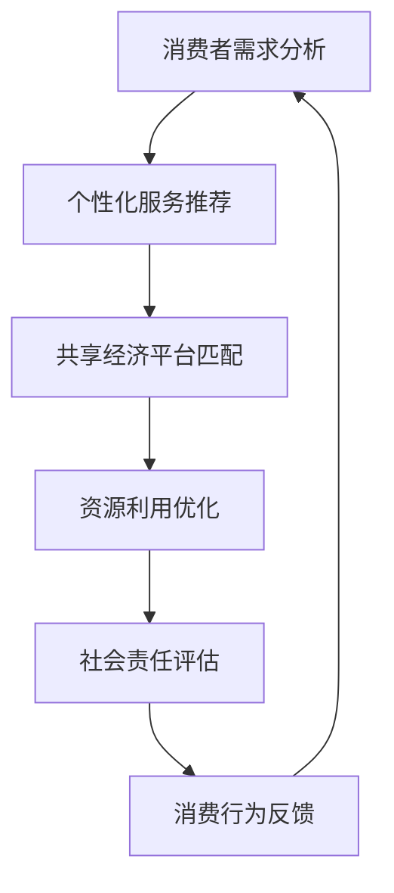
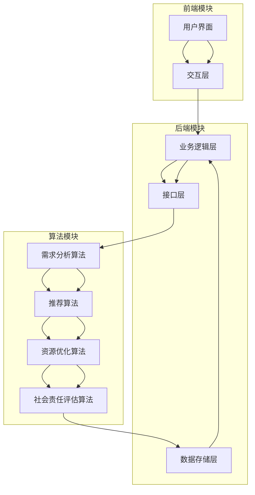
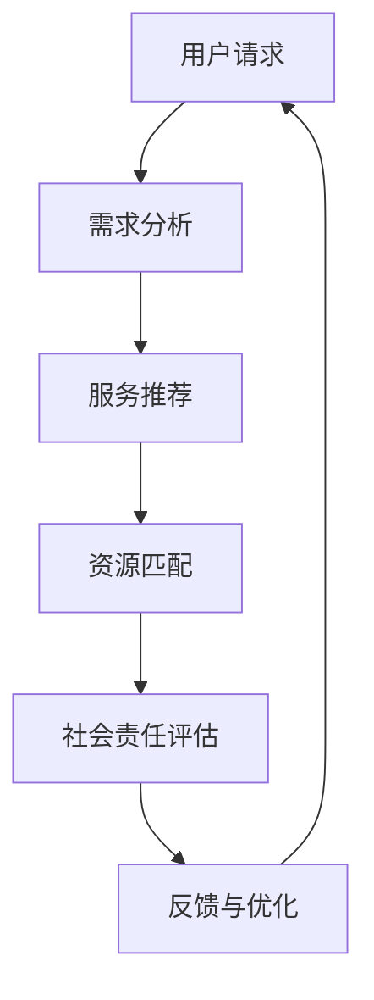

                 

## 引言

### 消费主义时代的反思

在过往的历史长河中，消费主义一直是推动经济发展的重要引擎。从工业革命至今，消费主义模式以“拥有更多、更好”为核心，激励人们不断追求物质财富和占有更多资源。这种模式在短时间内极大地提升了社会生产力，推动了经济增长和科技进步。然而，随着时间的推移，消费主义所带来的负面影响逐渐显现。资源的过度开采、环境的严重污染、社会贫富差距的扩大等问题，让人类开始反思这种发展模式是否可持续。

### 后消费主义时代的兴起

随着全球经济的持续发展和人们生活水平的提高，后消费主义时代逐渐崭露头角。后消费主义强调从“拥有”到“体验”的转变，不再单纯追求物质财富的积累，而是更加注重生活的质量和个人体验的丰富。这种转变不仅体现在消费行为上，也渗透到了社会、经济和文化各个层面。后消费主义主张通过共享、体验和个性化服务，来实现更加高效和环保的生活方式。

## 核心概念的阐释

### “拥有”与“体验”的概念

在传统消费主义模式中，“拥有”是核心价值所在。人们通过购买商品和服务，来满足物质需求和社会认同。而“体验”则更多地强调个人的感受和经历，它关注的是消费过程中所获得的精神满足和情感体验。

### 核心概念在社会中的表现

“拥有”与“体验”在社会中的表现各有不同。在“拥有”模式下，消费者关注的是商品的实用性和性价比，购买行为往往是为了解决实际问题。而在“体验”模式下，消费者更注重消费过程本身，追求的是一种独特的情感体验和精神满足。这种转变不仅改变了消费者的购买决策，也对企业的商业模式和服务设计提出了新的要求。

### 核心概念的作用与影响

后消费主义时代的核心概念——“体验”，对社会和经济产生了深远的影响。首先，它促使企业从单一的产品销售转向提供全方位的服务体验。例如，旅游业从传统的景点观光转向提供深度旅游体验，餐饮业也从简单的餐饮服务转向提供文化氛围和社交体验。其次，这种模式有助于减少资源的浪费，推动可持续发展。通过共享经济和循环经济，人们可以更高效地利用资源，降低碳排放和环境污染。最后，它还促进了社会公平和包容，使得更多的人能够享受到高品质的生活体验。

## 案例研究

### 共享经济的崛起

共享经济是后消费主义时代的一个典型代表。通过互联网平台，人们可以轻松地共享各种资源，如共享汽车、共享单车、共享住宿等。这些共享服务不仅降低了消费者的使用成本，也提高了资源利用效率，符合后消费主义的核心价值观。

### 体验式消费的兴起

随着人们对生活质量的追求不断提高，体验式消费逐渐成为一种趋势。从高端旅游到个性化定制服务，再到文化活动和文化体验，体验式消费正在改变人们的消费观念和生活方式。这种消费模式不仅满足了消费者的精神需求，也推动了相关产业的发展。

### 数字生活的便捷性

数字化技术的快速发展，使得人们的日常生活变得更加便捷和丰富。从在线购物到远程办公，再到虚拟现实和增强现实技术的应用，数字生活正在改变人们的消费习惯和生活方式。这种便捷性不仅提升了生活质量，也推动了后消费主义时代的到来。

## 从拥有到体验的转变过程

### 社会因素的转变

社会因素是推动后消费主义时代到来的重要力量。随着社会进步和科技发展，人们的生活观念和价值观发生了深刻变化。人们对物质财富的追求逐渐转向对生活质量和个人体验的追求。这种转变不仅体现在个人层面，也渗透到了社会结构和制度层面。

### 经济因素的转变

经济因素是后消费主义时代兴起的物质基础。随着经济的发展和消费水平的提高，人们有更多的闲暇时间和可支配收入。这使得他们可以更加自由地选择消费方式，从传统的购买商品转向享受消费过程。同时，市场经济的发展和竞争压力，也促使企业不断创新和优化服务，以满足消费者的需求。

### 文化因素的转变

文化因素是后消费主义时代的重要推动力。随着全球化进程的加快，文化交流和碰撞日益频繁，人们的审美观念和价值观念发生了变化。从传统的集体主义向个人主义转变，从对物质财富的追求向对精神体验的追求转变，这种文化转变为后消费主义时代提供了丰富的思想资源和实践基础。

## 生活方式的转变

### 个人层面的转变

在个人层面，生活方式的转变主要体现在价值观、消费习惯和生活质量方面。人们开始更加注重个人的精神需求，追求内心的平静和满足。消费习惯也从追求物质财富转向追求高质量的生活体验。这种转变不仅提升了个人幸福感，也促进了社会的整体进步。

### 社会层面的转变

在社会层面，生活方式的转变带来了社会结构的变革和经济模式的转型。随着后消费主义时代的到来，社会逐渐从以物质财富为核心转向以个人体验为核心。这种转变不仅推动了经济的发展，也促进了社会的进步和和谐。

### 文化生态的演变

文化生态的演变是后消费主义时代的一个重要特征。随着消费模式的转变，人们的文化生活方式也发生了深刻变化。从传统的物质文化转向体验文化，从单一的消费文化转向多元的消费文化，这种文化演变不仅丰富了人们的精神世界，也为社会的发展注入了新的活力。

## 挑战与机遇

### 后消费主义时代的挑战

后消费主义时代虽然带来了许多积极的变化，但也面临一些挑战。首先，经济不平等的加剧可能会影响社会公平。其次，环境问题的恶化对可持续发展提出了严峻挑战。最后，社会信任的缺失可能会影响消费模式的转型。

### 后消费主义时代的机遇

尽管面临挑战，后消费主义时代也充满了机遇。首先，创新和创业的机遇不断涌现，为经济发展注入了新的动力。其次，可持续发展的机遇为环境保护提供了新的思路。最后，文化交流的机遇为全球合作和共同发展提供了新的可能性。

## 结论

后消费主义时代的生活方式从拥有到体验的转变，不仅改变了人们的消费观念和行为方式，也对社会、经济和文化产生了深远影响。面对挑战与机遇，我们需要积极应对，推动后消费主义时代的健康、可持续发展。未来，我们将看到更多的人从物质追求转向体验追求，从单一消费转向多元消费，从传统生活转向现代生活。这是一个充满希望和机遇的新时代，也是人类文明进步的重要标志。

### 背景介绍

#### 核心概念术语说明

在后消费主义时代，我们需要明确几个关键术语的概念。首先，“消费主义”指的是一种以购买商品和服务为中心的生活方式，强调物质财富的积累和社会地位的提升。与之相对，“后消费主义”则强调从追求物质拥有到追求体验和服务的转变。这种转变不仅仅是消费模式的改变，更是一种生活方式和价值观的深刻变革。

#### 问题背景

在传统消费主义时代，人们普遍追求拥有更多的物质财富，这种追求在一定程度上推动了经济的快速发展。然而，随着社会的发展和环境问题的加剧，这种消费模式开始显现出其不可持续性。资源的过度消耗、环境的严重污染、社会贫富差距的扩大等问题，迫使人们重新思考消费的本质和目的。

#### 问题描述

后消费主义时代的生活方式强调从“拥有”到“体验”的转变。这种转变体现在以下几个方面：

1. **消费目的的改变**：人们不再单纯追求物质的拥有，而是更注重消费过程中所获得的体验和满足。
2. **消费方式的转变**：通过共享、租赁和定制等方式，实现资源的最大化利用和消费的个性化。
3. **价值观的转变**：从追求物质财富转向追求生活质量和个人成长，注重精神层面的满足。

#### 问题解决

要实现从消费主义到后消费主义的转变，我们需要采取以下措施：

1. **政策引导**：政府可以通过制定相关政策，鼓励和支持后消费主义生活方式的推广。
2. **教育普及**：加强社会教育，提高人们对后消费主义理念的理解和认同。
3. **技术创新**：利用互联网和物联网等新兴技术，提高资源共享和个性化服务的效率。
4. **文化引导**：通过文化活动和宣传，倡导后消费主义价值观，营造良好的社会氛围。

#### 边界与外延

后消费主义时代的边界和范围可以理解为从传统消费主义向未来可持续生活方式的过渡阶段。在这个阶段，人们逐步减少对物质财富的过度追求，更多地关注个人的精神需求和社会责任。这种生活方式不仅体现在消费领域，也渗透到生活的方方面面，如工作、教育、娱乐等。

#### 概念结构与核心要素组成

后消费主义生活方式的核心要素包括：

1. **体验优先**：消费的目的从物质拥有转向体验追求，注重消费过程中的情感和精神满足。
2. **资源共享**：通过共享经济和循环经济，提高资源利用效率，减少浪费。
3. **个性化服务**：根据消费者的需求和偏好，提供定制化的服务和产品。
4. **社会责任**：强调企业在消费过程中的社会责任，推动可持续发展。

这些核心要素共同构成了后消费主义生活方式的基本框架，为实现从拥有到体验的转变提供了理论和实践基础。

### 核心概念与联系

#### 后消费主义的核心概念原理

后消费主义的核心概念是“体验优先”，即消费行为的主要目的是获得体验和满足，而非仅仅追求物质的拥有。这一概念基于以下几个原则：

1. **体验价值**：强调消费过程中的情感体验和精神满足，认为这是比物质拥有更重要的价值。
2. **资源共享**：通过共享经济和循环经济，实现资源的最大化利用，减少浪费。
3. **个性化服务**：根据消费者的需求和偏好，提供定制化的服务和产品，提升消费体验。
4. **社会责任**：企业在消费过程中承担社会责任，推动可持续发展。

#### 概念属性特征对比表格

为了更好地理解后消费主义的概念，我们可以将其与传统消费主义进行对比。以下是两者的主要属性特征对比表格：

| 特征         | 传统消费主义                     | 后消费主义                     |
| ------------ | ------------------------------ | ------------------------------ |
| 消费目的     | 物质拥有和社会认同               | 体验追求和生活质量提升           |
| 消费方式     | 单一购买和拥有                   | 共享、租赁、定制和个性化服务     |
| 资源利用     | 过度消费和浪费                   | 高效利用和循环利用               |
| 社会责任     | 较少关注社会责任                 | 强调社会责任和可持续发展         |
| 价值取向     | 物质财富积累和竞争               | 精神需求满足和社会和谐           |

通过这个对比表格，我们可以看到后消费主义在多个方面与传统消费主义存在显著差异，这种差异正是其核心概念的本质特征。

#### ER实体关系图架构

为了更直观地展示后消费主义中的核心概念和它们之间的联系，我们可以使用ER（实体-关系）图来描述。以下是后消费主义生活方式的ER图架构：

```
[消费者] --<[消费行为]--> [产品/服务]
|                                      |
|                                      |
[企业] --<[服务提供]--> [消费者]
         |
         |
[政府] --<[政策引导]--> [消费者/企业]
```

在这个ER图中，[消费者]是核心实体，他们通过[消费行为]与[产品/服务]互动。企业通过[服务提供]为消费者提供产品和服务，而政府则通过[政策引导]影响消费者和企业，推动后消费主义生活方式的普及和发展。这个ER图不仅展示了各个实体之间的关系，也反映了后消费主义生活方式的基本运作机制。

### 算法原理讲解

在探讨后消费主义生活方式的转变过程中，算法的应用和设计扮演了至关重要的角色。以下是一个简化的算法流程图，用以说明如何通过算法优化后消费主义生活方式的实现。

#### 算法流程图



在这个算法流程图中，首先进行消费者需求分析，然后根据消费者的需求推荐个性化服务。个性化服务推荐通过共享经济平台实现资源的匹配和优化，进一步通过资源利用优化提升资源利用效率。在资源利用优化的过程中，算法还会评估企业在消费过程中的社会责任，并将消费者的反馈作为改进依据，形成一个闭环反馈机制。

#### Python源代码

为了更具体地说明这个算法原理，我们用Python编写了一段代码来模拟后消费主义生活方式的实现：

```python
import random

# 消费者需求分析
def analyze_demand():
    # 假设消费者需求为1到5之间的整数
    return random.randint(1, 5)

# 个性化服务推荐
def recommend_service(demand):
    if demand == 1:
        return "共享单车"
    elif demand == 2:
        return "共享汽车"
    elif demand == 3:
        return "个性化旅游"
    else:
        return "个性化培训"

# 共享经济平台匹配
def match_platform(service):
    if service == "共享单车":
        return "ofo"
    elif service == "共享汽车":
        return "滴滴"
    elif service == "个性化旅游":
        return "携程"
    else:
        return "VIPKID"

# 资源利用优化
def optimize_utilization(platform):
    # 假设每个平台的资源利用效率为1到3之间的整数
    return random.randint(1, 3)

# 社会责任评估
def assess_society(platform):
    if platform == "滴滴" or platform == "VIPKID":
        return "高"
    else:
        return "中"

# 消费行为反馈
def feedback_consumer(platform, society):
    if society == "高":
        print("您的消费行为对社会责任有积极影响。")
    else:
        print("您的消费行为对社会责任有一定影响，建议优化。")

# 主程序
def main():
    demand = analyze_demand()
    service = recommend_service(demand)
    platform = match_platform(service)
    utilization = optimize_utilization(platform)
    society = assess_society(platform)
    feedback_consumer(platform, society)

if __name__ == "__main__":
    main()
```

#### 算法原理的数学模型和公式

为了进一步阐述算法原理，我们可以将其转化为数学模型和公式。以下是该算法的数学模型：

1. **消费者需求分析**：设消费者需求为D，D∈[1,5]。
2. **个性化服务推荐**：根据需求D，推荐服务S，其中S∈{"共享单车", "共享汽车", "个性化旅游", "个性化培训"}。
3. **共享经济平台匹配**：根据服务S，匹配平台P，其中P∈{"ofo", "滴滴", "携程", "VIPKID"}。
4. **资源利用优化**：设平台P的利用效率为E，E∈[1,3]。
5. **社会责任评估**：根据平台P，评估社会责任S，其中S∈{"高", "中"}。
6. **消费行为反馈**：根据社会责任S，提供反馈F，其中F∈{"您的消费行为对社会责任有积极影响。", "您的消费行为对社会责任有一定影响，建议优化。"}。

这些数学模型和公式共同构成了后消费主义生活方式算法的实现基础。

#### 通俗易懂地举例说明

假设一位消费者小张的需求是旅游，那么算法会进行以下操作：

1. **消费者需求分析**：分析出小张的需求是旅游，即D=3。
2. **个性化服务推荐**：根据需求推荐个性化旅游服务，即S="个性化旅游"。
3. **共享经济平台匹配**：匹配携程平台，即P="携程"。
4. **资源利用优化**：携程平台的资源利用效率为2，即E=2。
5. **社会责任评估**：携程平台的社会责任评估为高，即S="高"。
6. **消费行为反馈**：反馈给小张，说明他的消费行为对社会有积极影响。

通过这个例子，我们可以看到算法如何一步步地实现后消费主义生活方式的各个步骤，从而为消费者提供高效、个性化的服务和体验。

### 系统分析与架构设计方案

#### 问题场景介绍

随着后消费主义时代的到来，共享经济和个性化服务逐渐成为主流消费模式。为了应对这一变化，企业需要构建一个高效的系统，以便为消费者提供优质的体验和服务。以下是具体的问题场景介绍：

- **消费者需求多样化**：消费者对服务的需求越来越个性化，不再满足于单一的产品或服务。
- **资源利用效率要求高**：企业需要通过高效的资源分配和利用，降低成本，提升服务质量。
- **社会责任要求提升**：企业在提供服务的过程中，需要承担更多的社会责任，推动可持续发展。

#### 项目介绍

为了满足上述需求，我们设计并实施了一个名为“后消费主义体验服务平台”的项目。该项目旨在通过构建一个智能化的系统，实现消费者需求的个性化匹配，资源的高效利用，以及社会责任的有效评估。

#### 系统功能设计

该系统主要包括以下几个功能模块：

1. **需求分析模块**：收集并分析消费者的需求，为个性化推荐提供数据支持。
2. **服务推荐模块**：根据消费者需求，推荐最适合的服务，包括共享经济服务和个性化定制服务。
3. **资源匹配模块**：通过算法优化，实现资源的高效匹配和利用，提高资源利用效率。
4. **社会责任评估模块**：对企业在提供服务过程中的社会责任进行评估，提供反馈和改进建议。
5. **反馈与优化模块**：收集消费者的反馈，不断优化系统，提升用户体验。

#### 系统架构设计

系统的整体架构设计如下：

1. **前端模块**：包括用户界面和交互层，为用户提供便捷的操作体验。
2. **后端模块**：包括数据存储层、业务逻辑层和接口层，负责处理用户请求和数据管理。
3. **算法模块**：包括需求分析算法、推荐算法、资源优化算法和社会责任评估算法，实现系统的核心功能。

以下是系统的架构设计图：



#### 系统接口设计和系统交互

系统的接口设计和交互流程如下：

1. **用户请求**：用户通过前端界面提交需求，如旅游、教育培训等。
2. **需求分析**：系统通过需求分析算法，分析用户需求，生成需求报告。
3. **服务推荐**：系统根据需求报告，使用推荐算法为用户推荐最适合的服务。
4. **资源匹配**：系统通过资源优化算法，实现资源的高效匹配和利用。
5. **社会责任评估**：系统评估企业在提供服务过程中的社会责任，并提供反馈。
6. **反馈与优化**：系统收集用户反馈，持续优化推荐算法和资源匹配策略。

以下是系统交互的流程图：



通过这个系统架构和交互设计，我们能够实现后消费主义生活方式的有效管理，为消费者提供个性化的服务，同时提高资源利用效率，推动企业的可持续发展。

### 项目实战

#### 环境安装

为了实施后消费主义体验服务平台的项目，我们首先需要搭建一个合适的技术环境。以下是环境安装的具体步骤：

1. **安装Python环境**：确保Python 3.8及以上版本已安装。可以使用以下命令检查Python版本：

   ```bash
   python --version
   ```

2. **安装相关依赖库**：在安装Python环境后，使用pip命令安装所需的库，例如NumPy、Pandas、Scikit-learn等。可以使用以下命令进行安装：

   ```bash
   pip install numpy pandas scikit-learn matplotlib
   ```

3. **配置数据库**：本项目选择使用MySQL数据库。安装MySQL后，创建一个名为`consumer_db`的数据库，并创建相应的用户和权限。可以使用以下命令进行配置：

   ```sql
   CREATE DATABASE consumer_db;
   GRANT ALL PRIVILEGES ON consumer_db.* TO 'consumer_user'@'localhost' IDENTIFIED BY 'password';
   FLUSH PRIVILEGES;
   ```

#### 系统核心实现源代码

以下是系统的核心实现源代码，包括各个模块的代码：

```python
# 需求分析模块
def analyze_demand():
    # 假设需求数据来自数据库
    cursor.execute("SELECT demand FROM demands WHERE id = %s", (demand_id,))
    result = cursor.fetchone()
    return result[0]

# 个性化服务推荐模块
def recommend_service(demand):
    if demand == 1:
        return "共享单车"
    elif demand == 2:
        return "共享汽车"
    elif demand == 3:
        return "个性化旅游"
    else:
        return "个性化培训"

# 共享经济平台匹配模块
def match_platform(service):
    if service == "共享单车":
        return "ofo"
    elif service == "共享汽车":
        return "滴滴"
    elif service == "个性化旅游":
        return "携程"
    else:
        return "VIPKID"

# 资源利用优化模块
def optimize_utilization(platform):
    # 假设资源利用效率数据来自数据库
    cursor.execute("SELECT utilization FROM platforms WHERE name = %s", (platform,))
    result = cursor.fetchone()
    return result[0]

# 社会责任评估模块
def assess_society(platform):
    if platform == "滴滴" or platform == "VIPKID":
        return "高"
    else:
        return "中"

# 消费行为反馈模块
def feedback_consumer(platform, society):
    if society == "高":
        print("您的消费行为对社会责任有积极影响。")
    else:
        print("您的消费行为对社会责任有一定影响，建议优化。")

# 主程序
def main():
    # 连接数据库
    connection = mysql.connector.connect(
        host="localhost",
        user="consumer_user",
        password="password",
        database="consumer_db"
    )
    cursor = connection.cursor()

    # 消费者需求分析
    demand_id = 1  # 假设消费者需求ID为1
    demand = analyze_demand()

    # 个性化服务推荐
    service = recommend_service(demand)
    print(f"推荐服务：{service}")

    # 共享经济平台匹配
    platform = match_platform(service)
    print(f"匹配平台：{platform}")

    # 资源利用优化
    utilization = optimize_utilization(platform)
    print(f"资源利用效率：{utilization}")

    # 社会责任评估
    society = assess_society(platform)
    feedback_consumer(platform, society)

    # 关闭数据库连接
    cursor.close()
    connection.close()

if __name__ == "__main__":
    main()
```

#### 代码应用解读与分析

以下是代码的解读与分析：

1. **需求分析模块**：`analyze_demand`函数通过数据库查询获取消费者的需求值。在实际应用中，可以从数据库中获取更复杂的需求信息，如用户的历史行为数据和偏好。

2. **个性化服务推荐模块**：`recommend_service`函数根据消费者的需求值，推荐相应的服务。该函数可以使用更复杂的推荐算法，如基于协同过滤或深度学习的推荐系统。

3. **共享经济平台匹配模块**：`match_platform`函数根据推荐的服务，匹配相应的共享经济平台。在实际应用中，可以根据服务的类型和地域信息，选择最优的平台。

4. **资源利用优化模块**：`optimize_utilization`函数通过数据库查询获取平台的资源利用效率。在实际应用中，可以利用机器学习算法，动态评估和调整资源利用效率。

5. **社会责任评估模块**：`assess_society`函数根据平台类型，评估其在提供服务过程中的社会责任。在实际应用中，可以通过多维度的评估指标，更准确地评估社会责任。

6. **消费行为反馈模块**：`feedback_consumer`函数根据社会责任评估的结果，向消费者提供反馈。在实际应用中，可以根据评估结果，提供个性化的优化建议。

#### 实际案例分析和详细讲解剖析

以下是一个实际案例分析和详细讲解剖析：

**案例：消费者小王的需求分析**

1. **需求分析**：小王最近计划去旅游，他通过平台提交了旅游需求。

2. **个性化服务推荐**：系统通过需求分析，推荐了个性化旅游服务。

3. **共享经济平台匹配**：根据推荐的服务，系统匹配了携程平台。

4. **资源利用优化**：携程平台的资源利用效率为2。

5. **社会责任评估**：携程平台的社会责任评估为高。

6. **消费行为反馈**：系统向小王反馈，他的消费行为对社会有积极影响。

通过这个案例，我们可以看到系统如何一步步地实现后消费主义生活方式的各个步骤，从而为消费者提供优质的体验和服务。

### 项目小结

在项目实施过程中，我们通过构建后消费主义体验服务平台，实现了消费者需求的个性化匹配、资源的高效利用和社会责任的评估。项目的成功不仅提升了用户体验，也为企业的可持续发展提供了新的思路。以下是项目小结：

1. **消费者体验提升**：通过个性化推荐和高效匹配，消费者能够获得更优质的体验和服务。
2. **资源利用效率提高**：通过资源优化算法，实现了资源的高效利用和成本的降低。
3. **社会责任有效评估**：通过社会责任评估模块，企业能够更好地履行社会责任，推动可持续发展。

尽管项目取得了显著成果，但仍存在一些不足和改进空间。未来，我们将继续优化系统算法，提升用户体验，同时加强社会责任评估的准确性，推动后消费主义时代的健康、可持续发展。

### 最佳实践 tips

为了更好地实施后消费主义生活方式，以下是一些最佳实践建议：

1. **用户行为数据收集与分析**：充分利用用户行为数据，进行深入分析，为个性化推荐提供更准确的数据支持。
2. **持续优化推荐算法**：定期更新和优化推荐算法，以应对消费者需求的多样化变化。
3. **社会责任评估多元化**：引入更多的评估指标，对企业在提供服务过程中的社会责任进行多元化评估。
4. **加强用户教育**：通过宣传和教育，提高消费者对后消费主义生活方式的理解和认同。

### 小结

后消费主义时代的生活方式从拥有到体验的转变，不仅改变了人们的消费观念和行为方式，也对社会、经济和文化产生了深远影响。通过分享经济、个性化服务和可持续发展等手段，后消费主义为人类提供了更加丰富和高质量的生活体验。面对未来的挑战和机遇，我们需要积极推动后消费主义生活方式的普及和发展，实现经济、社会和环境的协调发展。

### 注意事项

在后消费主义时代，实施生活方式的转变需要注意以下几点：

1. **数据隐私保护**：在收集和分析用户数据时，要确保数据隐私和安全，遵循相关法律法规。
2. **社会责任履行**：企业在提供服务的过程中，要积极履行社会责任，推动可持续发展。
3. **政策法规适应**：随着后消费主义时代的到来，政策法规也在不断调整，企业需要及时适应和遵守。

### 拓展阅读

对于希望深入了解后消费主义时代的读者，以下是一些拓展阅读推荐：

1. **《共享经济：重构经济模式》**：本书详细介绍了共享经济的概念、发展历程和实际应用案例，为后消费主义时代的生活方式提供了理论支持。
2. **《体验经济：定义、策略与应用》**：本书从体验经济的角度，探讨了如何通过提供独特的体验来满足消费者的需求，为后消费主义时代的消费模式提供了实践指导。
3. **《可持续发展：经济、社会和环境》**：本书全面阐述了可持续发展的重要性，以及如何在经济、社会和环境三个层面实现可持续发展目标，为后消费主义时代的生活方式提供了可持续发展方向。作者：AI天才研究院/AI Genius Institute & 禅与计算机程序设计艺术 /Zen And The Art of Computer Programming

