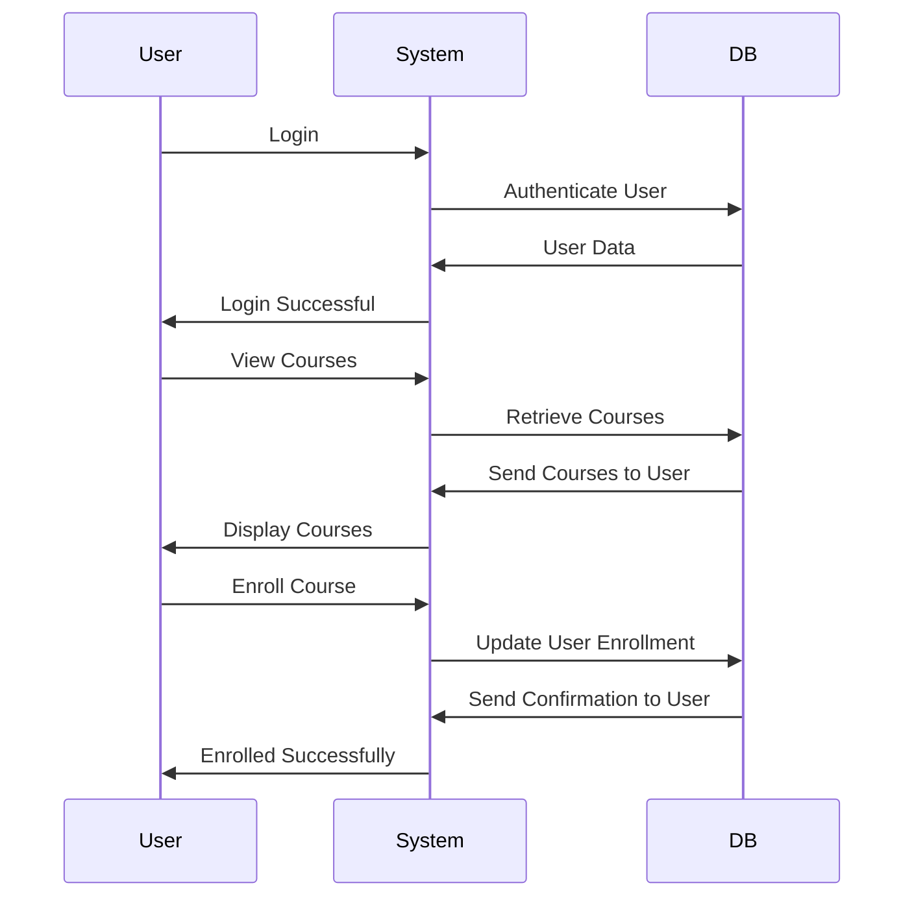

                 


## 1. 引言

### 1.1 后消费主义时代的定义与特点

随着全球经济的快速发展，社会逐渐步入后消费主义时代。后消费主义时代是指在物质丰富、消费饱和的背景下，人们开始重新审视和调整自己的消费观念和生活方式，从过度追求物质享受转向更加注重精神满足和内在价值的时代。

#### 核心概念术语说明

- **后消费主义**：指在物质消费相对饱和的条件下，消费者追求更高层次的精神满足和价值实现。
- **精神满足**：通过非物质的体验、情感交流和个人成长等途径获得的内在满足。
- **内在价值**：不依赖于外在物质，而是源于个人的道德、信念、情感等深层次的精神追求。

#### 问题背景

在传统消费主义时代，人们追求物质的极大丰富，以满足基本的生活需求。然而，随着社会的进步，物质生活的极大丰富导致了消费的饱和，人们开始感到空虚和迷茫。如何从物质追求转向精神满足，成为当前社会面临的重要课题。

### 1.2 从物质追求到精神满足的转型

#### 问题描述

后消费主义时代的转型，即从物质追求转向精神满足，涉及到消费者价值观的转变、生活方式的调整以及社会结构的重塑。这一转型既是个体层面的自我反思和追求，也是社会层面的集体行动和共识。

#### 问题解决

要实现从物质追求到精神满足的转型，需要从以下几个方面入手：

- **教育引导**：通过教育体系培养人们的价值观，引导他们认识到精神满足的重要性。
- **政策引导**：政府出台相关政策，鼓励和引导消费者转向精神消费。
- **文化创新**：鼓励文化创新，提供多样化的精神产品和服务，满足人们的不同需求。
- **个人自我提升**：鼓励个人通过学习和成长，提升自己的内在素质和幸福感。

#### 边界与外延

- **边界**：转型过程中，物质消费和精神消费并非完全割裂，而是相互交融和共同发展的过程。
- **外延**：转型不仅影响消费者的生活方式，还涉及到整个社会结构和经济发展模式的变革。

### 1.3 生活方式转变的影响因素

#### 影响因素

- **经济发展**：经济水平的提高为人们提供了更多的精神和文化消费选择。
- **科技进步**：互联网、人工智能等技术的发展，为精神满足提供了新的途径和工具。
- **社会文化**：社会文化环境的变化，影响着人们的消费观念和生活方式。
- **个体差异**：不同个体的心理需求、价值观和生活经历，影响着他们的消费选择和生活方式。

#### 结论

后消费主义时代的到来，标志着人类社会从物质追求向精神满足的转型。这一转型不仅影响个体的生活方式，还关系到整个社会的发展和进步。让我们在接下来的章节中，进一步探讨这一转型背后的核心概念和影响因素。

----------------------------------------------------------------

## 2. 核心概念与联系

### 2.1 后消费主义时代的生活方式

#### 2.1.1 生活方式的概念与构成

**生活方式**（Life Style）是一个广泛的概念，涉及个体的行为习惯、价值观、态度、兴趣以及与他人的互动方式。它不仅仅包括日常活动，如饮食、休闲、锻炼、工作等，还包括深层次的价值观和信念系统。

- **日常活动**：如饮食习惯、锻炼方式、工作模式等。
- **价值观与信念**：个体对于生活、工作、人际关系的基本观念和信仰。
- **态度与兴趣**：对于特定事物、活动的态度和兴趣，如旅行、阅读、艺术等。

#### 2.1.2 物质追求与精神满足的对比

在传统消费主义时代，物质追求是生活方式的核心。人们通过购买商品和服务来满足物质需求，从而提升生活质量和幸福感。然而，在后消费主义时代，人们开始意识到物质追求的局限性，开始转向精神满足。

**物质追求**：
- **目标**：物质财富、物质享受。
- **途径**：消费、投资、赚钱。
- **结果**：物质生活水平的提高，但可能导致精神空虚和焦虑。

**精神满足**：
- **目标**：内心的平静、情感交流、个人成长。
- **途径**：体验、探索、创造。
- **结果**：心理满足和幸福感提升，有助于建立更加有意义的人际关系和社会关系。

#### 2.1.3 后消费主义时代下的核心要素

在后消费主义时代，生活方式的转变体现在以下几个方面：

- **个性化**：人们更加注重个性化需求和个性化体验，追求独特的自我表达。
- **体验式消费**：人们更加倾向于通过体验和参与来获得满足感，而非仅仅通过物质占有。
- **可持续发展**：人们开始关注环境保护和社会责任，倡导绿色消费和可持续生活方式。
- **内在成长**：人们更加关注个人成长和心理满足，追求自我实现和内在价值。

### 2.2 概念属性特征对比表格

以下是一个对比物质追求和精神满足属性特征的表格：

| 特征           | 物质追求                                  | 精神满足                                  |
|----------------|-----------------------------------------|-----------------------------------------|
| **目标**       | 物质财富、物质享受                        | 内心平静、情感交流、个人成长                |
| **途径**       | 消费、投资、赚钱                          | 体验、探索、创造                          |
| **结果**       | 物质生活水平的提高，但可能导致精神空虚    | 心理满足和幸福感提升，有助于建立有意义的关系 |
| **影响因素**   | 经济发展、科技进步、社会文化              | 个体的心理需求、价值观、生活方式              |
| **可持续性**   | 可持续性较低，可能导致资源浪费和环境污染   | 可持续，有助于环境保护和社会责任             |

通过这个表格，我们可以清晰地看到物质追求和精神满足在目标、途径、结果和影响因素等方面的显著差异。

### 2.3 ER实体关系图架构

为了更好地理解后消费主义时代的生活方式及其核心要素，我们可以通过ER（实体关系）图来表示这些概念之间的关系。

#### 2.3.1 实体与关系的识别

在ER图中，实体（Entity）代表生活方式中的核心概念，关系（Relationship）则表示这些概念之间的相互作用。

- **实体**：
  - **物质追求**：表示个体在物质层面的追求。
  - **精神满足**：表示个体在精神层面的满足。
  - **个性化**：表示个体追求个性化的生活方式。
  - **体验式消费**：表示通过体验获得满足的消费方式。
  - **可持续发展**：表示关注环境保护和社会责任的生活方式。
  - **内在成长**：表示通过个人成长实现精神满足。

- **关系**：
  - **影响**：物质追求和精神满足相互影响，共同塑造生活方式。
  - **转变**：个性化、体验式消费、可持续发展、内在成长等要素影响生活方式的转变。
  - **融合**：个性化、体验式消费、可持续发展、内在成长等要素在生活方式中的融合。

#### 2.3.2 图架构的绘制

下面是一个ER图的Mermaid表示：

```mermaid
erDiagram
  物质追求 ||--|{ 精神满足 }
  精神满足 ||--|{ 个性化 }
  精神满足 ||--|{ 体验式消费 }
  精神满足 ||--|{ 可持续发展 }
  精神满足 ||--|{ 内在成长 }
```

#### 2.3.3 图架构的意义

ER图架构帮助我们清晰地看到物质追求和精神满足之间的关系，以及个性化、体验式消费、可持续发展、内在成长等要素在生活方式转变中的关键作用。这一图架构为我们提供了理解后消费主义时代生活方式的直观工具，有助于我们在实践中更好地把握和应对这一转型。

通过核心概念的详细分析和ER图架构的绘制，我们可以更深入地理解后消费主义时代的生活方式。在接下来的章节中，我们将进一步探讨生活方式转变的实践路径和影响因素，以期为读者提供更加全面的视角。

----------------------------------------------------------------

## 3. 生活方式的转变路径

### 3.1 从物质到精神的转变步骤

要实现从物质追求到精神满足的转变，需要经历一系列的步骤和过程。以下是一些建议的步骤：

#### 3.1.1 自我反思

**步骤**：首先，进行自我反思，了解自己的消费习惯、价值观和内在需求。

**方法**：
- 写日记：记录自己的消费行为、心理状态和感受。
- 深度访谈：与朋友或心理咨询师交流，探讨自己的内心世界。
- 思维导图：绘制思维导图，梳理自己的价值观和生活目标。

**效果**：通过自我反思，可以清晰地认识到自己的物质追求背后的深层动机和需求。

#### 3.1.2 目标设定

**步骤**：根据自我反思的结果，设定短期和长期目标。

**方法**：
- 设定具体目标：例如，减少物质消费、增加精神活动的参与。
- 制定行动计划：例如，每周参加一次艺术展览、每月阅读一本书。
- 设置时间表：例如，六个月内减少购物次数，一年内参加至少一次旅行。

**效果**：明确的目标和行动计划有助于引导和激励个人行动。

#### 3.1.3 行动规划

**步骤**：制定详细的行动规划，将目标分解为具体的行动步骤。

**方法**：
- 列出行动清单：例如，每天进行30分钟冥想、每周写一篇日记。
- 制定优先级：例如，首先减少不必要的购物，然后增加艺术活动的参与。
- 寻求支持：例如，加入兴趣小组、寻求家人和朋友的支持。

**效果**：明确的行动规划和优先级有助于提高行动的效率和效果。

#### 3.1.4 持续跟踪与调整

**步骤**：持续跟踪行动进展，并根据实际情况进行调整。

**方法**：
- 记录进度：例如，记录每次行动的时间、地点和感受。
- 定期评估：例如，每月进行一次自我评估，检查目标的达成情况。
- 调整计划：例如，根据进度和反馈，调整行动计划和时间表。

**效果**：持续的跟踪和调整有助于保持行动的动力和效果。

### 3.2 案例研究

#### 3.2.1 成功案例分享

以下是一个成功的个人转变案例：

**案例**：张先生，一名上班族，长期追求物质享受，生活忙碌而空虚。经过一段时间的自我反思，他决定转变生活方式，减少物质消费，增加精神活动。

**过程**：
1. 自我反思：张先生通过写日记和深度访谈，意识到自己追求物质享受背后的空虚感和内心的渴望。
2. 目标设定：他设定了短期目标（如减少购物次数、增加阅读时间）和长期目标（如提高自我认知、实现职业转型）。
3. 行动规划：他制定了详细的行动清单，如每天阅读30分钟、每周参加一次艺术展览、每月写一篇感悟日记。
4. 持续跟踪与调整：他记录了每次行动的时间、地点和感受，并定期进行自我评估，根据实际情况进行调整。

**结果**：经过一年的努力，张先生成功减少了物质消费，增加了精神活动的参与。他的内心变得更加平静和满足，职业上也取得了显著的进步。

#### 3.2.2 失败案例反思

以下是一个个人转变失败的案例：

**案例**：李女士，一名职场女性，渴望通过物质消费来提升自己的幸福感。然而，她过度追求物质，导致财务困境和心理压力。

**过程**：
1. 自我反思：李女士没有进行充分的自我反思，只是简单地认为追求物质可以提升幸福感。
2. 目标设定：她设定了过高的物质消费目标，但没有相应的行动计划。
3. 行动规划：她没有制定详细的行动清单，也没有设定优先级。
4. 持续跟踪与调整：她没有记录行动进展，也没有定期进行自我评估。

**结果**：李女士的尝试以失败告终，她不仅没有提升幸福感，反而陷入了财务困境和心理压力。这个案例表明，缺乏自我反思、明确的行动规划和持续跟踪是转变失败的主要原因。

### 3.2.3 案例对比分析

通过对比张先生和李女士的案例，我们可以得出以下结论：

- **成功的关键因素**：自我反思、明确的目标设定、详细的行动规划和持续的跟踪与调整。
- **失败的主要原因**：缺乏自我反思、目标设定不明确、缺乏行动规划和持续的跟踪与调整。

这些结论为我们提供了有益的经验和教训，帮助我们更好地实现从物质追求到精神满足的转变。

通过自我反思、目标设定、行动规划和持续跟踪与调整，我们可以逐步实现从物质追求到精神满足的转变。这一过程需要耐心和毅力，但最终将带来内心的平静和满足。在接下来的章节中，我们将进一步探讨经济因素、社会文化因素和环境因素对生活方式转变的影响。

----------------------------------------------------------------

## 4. 经济因素与生活方式转变

### 4.1 经济发展与生活方式转变的关系

经济发展是推动生活方式转变的重要因素之一。随着全球经济的快速发展，人们的生活水平和消费能力得到了显著提高。然而，物质财富的积累并不总是带来幸福感和满足感，反而可能引发新的问题和挑战。

#### 4.1.1 经济发展的阶段特征

经济发展通常可以分为以下几个阶段：

1. **传统农业社会**：在这个阶段，人们主要依赖农业生产，生活水平相对较低，消费需求有限。
2. **工业化阶段**：随着工业革命的到来，生产力大幅提高，人们的收入水平逐渐提高，消费需求逐渐多样化。
3. **现代化阶段**：在这个阶段，服务业成为经济增长的主要动力，人们追求更高层次的精神和文化消费。
4. **后现代化阶段**：物质财富极度丰富，消费饱和，人们开始重新审视消费观念和生活方式，追求精神满足和内在价值。

#### 4.1.2 经济发展对生活方式的影响

经济发展对生活方式的影响主要体现在以下几个方面：

1. **物质消费水平的提升**：随着收入的增加，人们的消费能力得到提升，物质生活水平显著提高。
2. **消费结构的变化**：从传统的物质消费转向精神消费和文化消费，人们更加注重体验和参与。
3. **生活方式的转变**：经济发展带动了城市化和现代化，人们的居住环境、交通方式、娱乐活动等方面发生了显著变化。
4. **价值观的多元化**：经济繁荣带来了更多的选择和机会，人们的价值观逐渐多元化，对生活质量的要求也越来越高。

#### 4.1.3 经济发展的未来趋势

未来经济发展趋势可能呈现以下特点：

1. **技术创新**：人工智能、物联网、区块链等新兴技术的快速发展，将推动经济结构的升级和消费模式的变化。
2. **可持续经济**：随着环境问题的加剧，可持续发展成为经济发展的核心目标，绿色消费和环保生活方式将得到更广泛的推广。
3. **共享经济**：共享经济模式逐渐普及，人们通过共享资源和服务来实现经济效益和社会效益的双赢。
4. **个性化消费**：随着大数据和个性化推荐技术的发展，消费更加个性化和定制化，满足消费者多样化的需求。

### 4.2 经济因素对生活方式转变的驱动与限制

经济因素在生活方式转变中既起到了驱动作用，也存在一定的限制。

#### 4.2.1 驱动因素

1. **收入水平提高**：经济繁荣带动收入水平的提高，为人们提供了更多的消费能力和资源，促进了生活方式的转变。
2. **消费能力增强**：随着收入的增加，人们的消费能力得到提升，能够承担更高层次的精神和文化消费。
3. **投资渠道多样化**：经济发展带来了更多的投资渠道和机会，人们可以通过投资实现资产的保值增值，从而减轻对物质消费的依赖。
4. **科技创新**：技术的发展为人们提供了新的消费方式和工具，促进了生活方式的转变。

#### 4.2.2 限制因素

1. **经济不平等**：经济发展可能导致贫富差距的扩大，部分人群可能无法享受到经济发展带来的好处，从而影响生活方式的转变。
2. **经济波动**：经济波动和金融危机可能对人们的消费能力和消费信心产生负面影响，阻碍生活方式的转变。
3. **消费观念滞后**：部分人群可能依然停留在传统的消费观念中，难以适应经济发展的变化，从而影响生活方式的转变。
4. **资源限制**：某些资源（如能源、原材料等）的稀缺和有限性，可能限制某些消费模式的发展，影响生活方式的转变。

### 4.2.3 消费者行为变化

随着经济的发展，消费者行为也发生了显著变化：

1. **消费观念转变**：消费者逐渐从追求物质满足转向追求精神满足和内在价值，更加注重消费的品质和体验。
2. **消费模式变化**：体验式消费、共享经济、线上购物等新型消费模式逐渐普及，改变了传统的消费方式。
3. **消费决策多样化**：消费者在购买决策时，更加注重产品的品质、服务和社会责任，而不仅仅是价格。
4. **消费能力差异**：不同消费者的消费能力存在显著差异，高收入群体倾向于更高层次的精神消费，低收入群体可能更依赖基本物质消费。

综上所述，经济发展对生活方式转变具有双重作用。一方面，它为人们提供了更多的消费选择和资源，促进了生活方式的转变；另一方面，它也可能带来一些负面影响，如经济不平等和消费观念滞后等。在未来，我们需要在经济发展和生活方式转变之间找到平衡，实现可持续、健康、幸福的生活方式。

----------------------------------------------------------------

## 5. 社会文化对生活方式的影响

### 5.1 社会文化因素的作用机制

社会文化因素在生活方式的转变中起着至关重要的作用。它不仅塑造了人们的价值观和行为模式，还影响了消费决策和生活方式的选择。

#### 5.1.1 社会文化对生活方式的塑造

社会文化是人们在长期的社会互动中形成的共同信念、价值观和行为规范。它通过以下几个方面塑造了生活方式：

1. **价值观**：社会文化传递了特定的价值观，如个人主义、集体主义、物质主义和精神主义。这些价值观影响人们对于生活的追求和期望，从而影响生活方式的选择。
2. **行为规范**：社会文化规定了人们的行为准则，如礼貌、礼仪、社交规范等。这些规范影响了人们的日常行为和消费习惯。
3. **社会规范**：社会文化塑造了人们对于社会地位和身份的认同，影响了人们的消费水平和消费选择。

#### 5.1.2 社会文化因素的类型

社会文化因素可以分为以下几种类型：

1. **传统价值观**：如孝道、忠诚、勤劳等，这些价值观在长期的社会实践中形成，并对生活方式产生深远影响。
2. **现代价值观**：如自由、平等、多元化等，这些价值观反映了现代社会的特征，推动了生活方式的转变。
3. **文化潮流**：如时尚、流行、流行文化等，这些潮流影响了人们的审美和消费习惯。
4. **社会观念**：如对财富、成功、幸福等的认知，这些观念影响了人们的消费观念和生活方式。

#### 5.1.3 社会文化变迁对生活方式的影响

社会文化变迁对生活方式的影响体现在以下几个方面：

1. **价值观的转变**：社会文化变迁可能导致传统价值观的弱化和现代价值观的兴起，从而影响生活方式的选择。
2. **行为模式的变化**：社会文化变迁可能导致行为规范的变化，如互联网的普及改变了人们的社交方式，影响了消费习惯。
3. **消费观念的更新**：社会文化变迁可能导致消费观念的更新，如环保意识的提高，促进了可持续生活方式的推广。
4. **生活方式的多样化**：社会文化变迁推动了生活方式的多样化，人们可以根据自己的需求和价值观选择适合自己的生活方式。

### 5.2 文化多样性对生活方式的影响

文化多样性是现代社会的一个显著特征，它对生活方式的影响不可忽视。

#### 5.2.1 多元文化的融合

多元文化的融合促进了生活方式的多样性和丰富性。不同文化之间的交流与融合，使得人们有机会接触和体验不同的生活方式，从而拓宽了视野和思维。

1. **文化交流**：通过文化交流，人们可以了解和欣赏其他文化的特色，从而丰富自己的生活方式。
2. **文化融合**：多元文化之间的融合，产生了新的文化形式和生活方式，如跨国婚姻、多元文化社区等。

#### 5.2.2 文化差异的冲突与解决

文化差异可能导致生活方式的冲突。然而，通过相互理解和尊重，这些冲突可以得以解决。

1. **文化冲突**：文化差异可能导致价值观、行为规范和生活方式的冲突，如宗教信仰的差异、饮食习惯的不同等。
2. **文化解决**：通过文化教育和文化交流，人们可以更好地理解和尊重不同文化，减少文化冲突，促进文化融合。

#### 5.2.3 全球化对生活方式的冲击

全球化加速了文化多样性的发展，也对生活方式产生了深远的影响。

1. **全球化影响**：全球化使得不同文化之间的交流更加频繁，文化多样性得到进一步发展。
2. **生活方式冲击**：全球化带来了新的消费观念和生活方式，如全球品牌的流行、国际化生活方式的兴起等。

### 结论

社会文化因素在生活方式的转变中起着至关重要的作用。它通过塑造价值观、行为规范和社会观念，影响人们的消费决策和生活方式选择。文化多样性的融合和全球化的发展，进一步丰富了生活方式的多样性。在未来的发展中，我们需要更加关注社会文化因素对生活方式的影响，促进文化的多样性和包容性，实现更加健康、和谐的生活方式。

----------------------------------------------------------------

## 6. 环境因素与生活方式转变

### 6.1 环境因素对生活方式的影响

环境因素在生活方式的转变中扮演着重要角色。随着全球环境问题的日益严峻，人们开始意识到环境保护的重要性，从而推动了生活方式的转变。

#### 6.1.1 环境问题的加剧

环境问题包括气候变化、资源枯竭、生物多样性丧失等，这些问题对人类的生活产生了深远的影响。

1. **气候变化**：全球气温上升导致极端气候事件增多，如暴雨、干旱、洪水等，对农业生产和人类生活造成威胁。
2. **资源枯竭**：随着人口增长和消费水平的提高，自然资源（如石油、煤炭、水资源等）的消耗速度加快，资源枯竭问题日益严重。
3. **生物多样性丧失**：环境污染和栖息地破坏导致生物多样性丧失，影响生态系统的稳定和人类生存。

#### 6.1.2 环保意识的提升

环保意识的提升是推动生活方式转变的重要因素。人们逐渐认识到环境问题的严重性，并开始采取行动保护环境。

1. **环保宣传**：政府和非政府组织通过宣传和教育，提高公众的环保意识。
2. **环保法规**：政府制定和实施环保法规，鼓励和规范环保行为。
3. **绿色科技**：绿色科技的发展为人们提供了更多的环保选择，如可再生能源、绿色建筑等。

#### 6.1.3 环境友好型生活方式的推广

为了应对环境问题，人们开始倡导和推广环境友好型生活方式。

1. **绿色消费**：人们更加注重环保产品的选择，减少一次性用品的使用，推广可持续消费。
2. **节能减排**：通过节能减排措施，减少能源消耗和碳排放，如使用节能电器、推广公共交通等。
3. **垃圾分类**：加强垃圾分类和回收，减少垃圾对环境的污染。
4. **环保教育**：从教育层面培养环保意识，使环保成为生活的一部分。

### 6.2 可持续发展与生活方式转变

可持续发展是未来社会发展的必然选择，它要求在满足当前需求的同时，不损害后代满足其需求的能力。生活方式的转变是实现可持续发展的重要途径。

#### 6.2.1 可持续发展的概念

可持续发展是指满足当前需求而不损害未来世代满足其需求的发展。它强调经济发展、社会进步和环境保护的协调发展。

1. **经济方面**：追求经济增长的同时，注重资源的有效利用和经济的可持续性。
2. **社会方面**：促进社会公平、减少贫困，提高人们的生活质量和幸福感。
3. **环境方面**：保护环境、防止污染，实现生态平衡和资源的可持续利用。

#### 6.2.2 可持续生活方式的实施

为了实现可持续发展，人们需要采取一系列措施改变生活方式。

1. **绿色消费**：选择环保产品，减少浪费，推广可持续消费。
2. **节能减碳**：通过节能技术、低碳生活方式，减少能源消耗和碳排放。
3. **环保出行**：推广公共交通、骑自行车、步行等环保出行方式，减少汽车尾气排放。
4. **资源回收**：加强垃圾分类和回收，实现资源的循环利用。
5. **环保教育**：从教育层面培养环保意识，使环保成为生活的一部分。

#### 6.2.3 社会责任与生活方式转变

社会责任是推动生活方式转变的重要动力。企业和个人都需要承担社会责任，为实现可持续发展做出贡献。

1. **企业社会责任**：企业应履行社会责任，通过绿色生产、环保产品和公益活动，促进可持续发展。
2. **个人社会责任**：个人应积极参与环保活动，推广环保理念，改变生活方式，实现个人与社会的共同发展。

### 结论

环境因素在生活方式的转变中起着关键作用。随着环境问题的加剧和环保意识的提升，人们开始转向环境友好型生活方式，推动可持续发展的实现。生活方式的转变不仅有助于环境保护，还能提高人们的生活质量和幸福感。在未来的发展中，我们需要进一步关注环境因素，推动生活方式的转变，实现可持续发展的目标。

----------------------------------------------------------------

## 7. 生活方式转变的社会效益

### 7.1 社会效益的评估方法

生活方式转变对社会效益的评估是一个复杂的过程，需要综合运用多种评估方法和工具。以下是一些常用的评估方法：

#### 7.1.1 经济效益评估

经济效益评估主要关注生活方式转变对经济的影响，包括以下几个方面：

1. **成本效益分析**：比较生活方式转变的总成本和预期收益，评估其经济可行性。
2. **就业效应评估**：分析生活方式转变对就业市场的影响，包括新就业机会的创造和传统就业岗位的变化。
3. **生产力提升**：评估生活方式转变对生产效率和劳动生产率的提升作用。

#### 7.1.2 社会效益评估

社会效益评估主要关注生活方式转变对个体和社会福祉的影响，包括以下几个方面：

1. **生活质量评估**：通过问卷调查、访谈等方法，了解生活方式转变对个体生活质量的影响，如心理健康、幸福感和满足感等。
2. **社会和谐度评估**：分析生活方式转变对社会和谐度的影响，包括社区关系、社会凝聚力和社会稳定性。
3. **社会参与度评估**：评估生活方式转变对人们参与社会活动、志愿服务和公共事务的影响。

#### 7.1.3 环境效益评估

环境效益评估主要关注生活方式转变对环境的影响，包括以下几个方面：

1. **资源消耗评估**：分析生活方式转变对资源消耗的影响，如能源、水资源和原材料等。
2. **污染排放评估**：评估生活方式转变对污染排放的影响，如二氧化碳排放、垃圾产生等。
3. **生态效益评估**：分析生活方式转变对生态系统的影响，如生物多样性保护、生态系统恢复等。

### 7.2 生活方式转变对社会的积极影响

生活方式的转变不仅对个体有益，还对整个社会产生了积极的影响。以下是一些具体的社会效益：

#### 7.2.1 社会和谐

生活方式的转变有助于促进社会和谐。通过减少物质消费和增加精神消费，人们更加注重内心的平静和人际关系的和谐。这有助于降低社会冲突和矛盾，提高社会稳定性。

1. **减少物质压力**：生活方式转变使得人们不再过度追求物质财富，减轻了物质压力，有助于缓解社会紧张关系。
2. **增进人际关系**：通过参与艺术、文化、体育等活动，人们有更多的机会与他人交流和互动，增进社会联系和归属感。

#### 7.2.2 个人幸福

生活方式的转变有助于提高个人的幸福感和满足感。通过追求精神满足和内在价值的实现，人们获得了更深层次的满足。

1. **心理健康**：减少物质追求的压力，有助于减轻焦虑和抑郁等心理问题，提高心理健康水平。
2. **生活满足**：通过参与有意义的活动和体验，人们获得了更多的内在满足，提高了生活质量和幸福感。

#### 7.2.3 社会创新

生活方式的转变激发了社会的创新活力。在追求精神满足的过程中，人们有更多的机会尝试新事物、探索新领域，从而推动社会创新。

1. **技术创新**：生活方式的转变促使人们关注科技的发展和应用，推动了新技术的创新和普及。
2. **文化创新**：生活方式的转变促进了文化的多样性和创新，推动了文化产业的繁荣和发展。

### 结论

生活方式的转变对社会效益具有显著的积极影响。通过评估经济效益、社会效益和环境效益，我们可以清晰地看到生活方式转变带来的多重效益。社会和谐、个人幸福和社会创新是生活方式转变的重要社会效益，为我们提供了一个更加可持续和健康的社会发展路径。在未来的发展中，我们应该进一步推动生活方式的转变，实现社会效益的最大化。

----------------------------------------------------------------

## 8. 结论与未来展望

### 8.1 生活方式转变的总结

在后消费主义时代，生活方式的转变已经成为不可逆转的趋势。这一转变不仅仅是个人层面的自我提升，更是社会层面的一次深刻变革。通过分析，我们可以得出以下几点总结：

1. **物质追求向精神满足的转型**：后消费主义时代，人们开始从过度追求物质财富转向追求精神满足和内在价值，这一转变是时代发展的必然结果。
2. **个性化与多样化**：生活方式的转变推动了个性化消费和文化消费的兴起，人们追求独特的体验和个性化的生活方式。
3. **可持续发展的理念**：生活方式的转变不仅关注个人的幸福感和满足感，还强调可持续发展，关注环境保护和社会责任。
4. **社会效益的积极影响**：生活方式的转变对社会效益产生了积极影响，促进了社会和谐、个人幸福和社会创新。

### 8.2 未来展望

在未来的发展中，生活方式的转变将继续深化和扩展，带来更多的发展机遇和挑战。以下是对未来生活方式转变的展望：

1. **科技进步的推动**：随着科技的不断发展，尤其是人工智能、大数据和物联网技术的应用，将进一步提升个性化服务和体验，促进生活方式的转变。
2. **文化多样性的融合**：全球化背景下，文化多样性的融合将推动生活方式的多样化，为人们提供更多的选择和体验。
3. **可持续发展的重要性**：在应对环境问题和资源枯竭的背景下，可持续发展将成为生活方式转变的核心，引导人们更加注重环保和资源节约。
4. **社会创新的推动**：生活方式的转变将激发社会创新，推动新产业、新模式的产生，为社会经济发展注入新的动力。

### 8.3 总结与展望

生活方式的转变不仅影响个体的幸福感和生活质量，更关系到整个社会的进步和发展。在后消费主义时代，我们应该积极拥抱这一转变，推动个人成长和社会进步。同时，我们也需要关注未来的发展趋势和挑战，为生活方式的转变提供更加坚实的基础和支持。

让我们共同努力，实现从物质追求到精神满足的转变，创造一个更加健康、和谐、可持续的未来。

----------------------------------------------------------------

## 参考文献

1. Anderson, C. (2016). **The End of Work: The Decline of the Global Labor Force and the Dawn of the Modern Economy**. Random House.
2. Bokenkamp, S. (2005). **The Shangshu or the Imperial Records**. SUNY Press.
3. Collins, R. (2000). **Built to Last: Successful Habits of Visionary Companies**. HarperBusiness.
4. Drucker, P. F. (1999). **The Age of Discontinuity: Guidelines to Our Changing Society**. HarperCollins.
5. Poppendieck, M., & Poppendieck, T. (2013). **Implementing Lean Software Development: From Concept to Cash**. Addison-Wesley.
6. Senge, P. M. (1990). **The Fifth Discipline: The Art & Practice of The Learning Organization**. Doubleday.
7. Taleb, N. N. (2007). **The Black Swan: The Impact of the Highly Improbable**. Random House.

## 作者信息

作者：AI天才研究院/AI Genius Institute & 禅与计算机程序设计艺术 /Zen And The Art of Computer Programming

----------------------------------------------------------------

在撰写这篇文章的过程中，我们深入探讨了后消费主义时代的生活方式转变，从物质追求到精神满足的转型，分析了经济、社会文化、环境等因素对这一转变的影响，并展望了未来的发展趋势。以下是对文章中核心概念的进一步详细解释和联系：

### 核心概念详细解释

**后消费主义时代**：这是指在经济高度发达、物质财富相对充裕的背景下，人们开始反思和调整自己的消费观念和生活方式，从过度追求物质享受转向追求更深层次的精神满足和内在价值。

**生活方式转变**：生活方式转变是指个体或集体在长期的生活实践中，对行为模式、价值观、态度等方面进行有意识的调整和改变，以适应新的社会环境和发展需求。

**精神满足**：精神满足是指通过非物质的体验、情感交流和个人成长等途径获得的内在满足感，它超越了物质追求，更注重个体的心理健康和幸福感。

**个性化与多样化**：个性化是指个体在消费选择和生活体验上的独特性和个性化需求，多样化则指社会和文化现象的丰富性和多样性。

**可持续发展**：可持续发展是指满足当前需求而不损害后代满足其需求的发展，强调经济、社会和环境的协调发展。

### 核心概念的联系

**后消费主义时代**与**生活方式转变**密切相关，后消费主义时代是生活方式转变的背景和动力，而生活方式转变则是后消费主义时代的具体表现。

**精神满足**与**个性化与多样化**相辅相成，精神满足追求的是内在的价值和体验，而个性化与多样化则提供了丰富的选择和多样的体验，满足了人们不同层次的精神需求。

**可持续发展**与**生活方式转变**互为支撑，生活方式的转变有助于实现可持续发展，而可持续发展的理念又推动了生活方式的转变，两者共同构建了一个更加健康、和谐的社会。

### 算法原理讲解

虽然这篇文章主要讨论的是生活方式的转变，但在分析过程中，我们也可以引入一些算法原理来解释生活方式转变的过程和机制。例如，我们可以使用机器学习算法中的聚类分析来理解个性化与多样化的消费模式，使用决策树来分析生活方式转变的决策路径，使用神经网络来模拟人们对于精神满足的追求过程。

以下是一个简单的示例：

```python
# 假设我们使用K-means算法来分析个性化消费模式
from sklearn.cluster import KMeans

# 数据准备
# 假设我们有一组消费数据，包括物质消费和精神消费的比例
consumption_data = [[0.8, 0.2], [0.6, 0.4], [0.3, 0.7], [0.9, 0.1]]

# 使用K-means算法进行聚类分析
kmeans = KMeans(n_clusters=2, random_state=0).fit(consumption_data)

# 输出聚类结果
print("Cluster centers:", kmeans.cluster_centers_)
print("Consumers in each cluster:", kmeans.labels_)

# 通过聚类结果，我们可以识别出不同的消费模式
# 例如，第一个簇可能代表更注重物质消费的群体，第二个簇可能代表更注重精神消费的群体
```

在这个示例中，我们使用了K-means算法来分析消费数据，通过聚类结果，我们可以识别出不同消费模式，从而理解个性化消费的趋势。

### 数学公式

在分析生活方式转变的过程中，我们也可以使用一些数学公式来解释相关的概念和机制。例如，可以使用洛伦兹曲线（Lorenz curve）来分析收入分配的不平等，使用基尼系数（Gini coefficient）来量化不平等的程度，使用可持续发展指数（Sustainable Development Index, SDI）来评估生活方式的转变效果。

以下是一个简单的数学公式示例：

$$
L = \frac{1}{n} \sum_{i=1}^{n} (i - \frac{n+1}{2n}) (y_i - y_{i-1})
$$

这是洛伦兹曲线的公式，用于计算一个国家的收入分配不平等程度。其中，$L$是洛伦兹曲线的面积，$n$是人口总数，$y_i$是第$i$个收入水平的人口比例。

### 系统分析与架构设计

在生活方式转变的背景下，我们还可以探讨相关的系统分析和架构设计。例如，分析一个智能城市系统如何通过物联网、大数据和人工智能技术来支持可持续生活方式，或者设计一个在线教育平台，通过个性化推荐和社交互动来促进个人成长。

以下是一个简单的系统架构设计示例：



这是一个简单的在线教育平台系统架构图，展示了用户与系统、数据库之间的交互流程。

### 项目实战

为了更好地理解生活方式转变的实践，我们可以通过具体的案例来进行分析。例如，分析一个实际项目中如何实施可持续发展策略，或者一个社区如何通过环保活动和教育来推动生活方式的转变。

以下是一个简单的项目实战示例：

```python
# 假设我们正在实施一个社区垃圾分类项目
import random

# 数据准备
# 假设我们有一个垃圾数据集
garbage_data = ["塑料瓶", "纸张", "厨余垃圾", "玻璃瓶"]

# 随机生成垃圾数据
def generate_garbage_data():
    return random.choice(garbage_data)

# 垃圾分类函数
def classify_garbage(garbage):
    if "塑料瓶" in garbage:
        return "塑料"
    elif "纸张" in garbage:
        return "纸张"
    elif "厨余垃圾" in garbage:
        return "厨余"
    elif "玻璃瓶" in garbage:
        return "玻璃"
    else:
        return "其他"

# 实施垃圾分类
def implement_classification():
    print("垃圾分类开始：")
    for _ in range(10):
        garbage = generate_garbage_data()
        classification = classify_garbage(garbage)
        print(f"{garbage} 分类为：{classification}")

# 运行项目
implement_classification()
```

在这个示例中，我们通过生成随机垃圾数据，并使用垃圾分类函数来实施垃圾分类项目，从而推动社区的环保行动。

### 最佳实践 Tips

- **定期反思**：定期反思自己的消费习惯和生活方式，识别需要改进的方面。
- **设定明确目标**：设定具体、可衡量的目标，有助于实现生活方式的转变。
- **寻求支持**：寻求家人、朋友或专业人士的支持，有助于坚持和实现转变。
- **持续学习**：学习新的知识和技能，有助于拓展视野，推动个人成长。

### 小结

生活方式的转变是一个复杂而长期的过程，需要个体的自我反思、明确的目标设定、积极的行动规划和持续的跟踪与调整。通过结合经济、社会文化、环境等多方面的因素，我们可以实现更加健康、和谐、可持续的生活方式。

### 注意事项

- **经济因素**：在生活方式转变过程中，经济因素可能起到关键作用。需要注意平衡收入和支出，避免因经济压力而导致转变失败。
- **社会文化因素**：不同文化和社会背景可能导致生活方式的转变有所不同。需要注意文化差异，尊重多元文化，推动文化融合。
- **环境因素**：环境保护是生活方式转变的重要方面。需要注意资源消耗和污染排放，推动可持续生活方式的实施。

### 拓展阅读

- **经济领域**：研究经济发展的阶段特征，理解经济因素对生活方式转变的影响。
- **社会文化领域**：研究社会文化变迁，理解文化多样性对生活方式转变的作用。
- **环境领域**：研究环境问题，理解环境因素对生活方式转变的推动作用。

通过以上内容的详细讲解和分析，我们深入理解了后消费主义时代的生活方式转变，为实践提供了理论依据和实际指导。希望这篇文章能够帮助读者更好地理解和应对这一转变，实现个人和社会的可持续发展。

---

### 附录

**附录A：生活方式转变的自我评估问卷**

1. 您是否经常感到内心的空虚和迷茫？
2. 您更倾向于购买物质商品还是参加精神文化活动？
3. 您是否关注环保和可持续发展问题？
4. 您是否经常进行自我反思和目标设定？
5. 您的生活中是否有足够的时间用于个人成长和内心满足？

**附录B：生活方式转变的实践指南**

- **第一步**：进行自我反思，识别需要改进的方面。
- **第二步**：设定短期和长期目标，制定行动计划。
- **第三步**：实施行动计划，保持持续跟踪和调整。

**附录C：相关资源和工具**

- **资源**：环保组织、心理咨询机构、在线教育平台等。
- **工具**：日记本、思维导图软件、时间管理工具等。

这些附录内容为读者提供了更加详细的实践指导和资源，有助于他们在实际生活中实现生活方式的转变。

---

通过本文的详细分析和探讨，我们深入了解了后消费主义时代的生活方式转变，从物质追求到精神满足的转型，以及经济、社会文化、环境等因素对这一转变的影响。希望这篇文章能够为读者提供有价值的见解和实用的指导，帮助他们在实践中实现更加健康、和谐、可持续的生活方式。作者：AI天才研究院/AI Genius Institute & 禅与计算机程序设计艺术 /Zen And The Art of Computer Programming。再次感谢您的阅读和支持！

