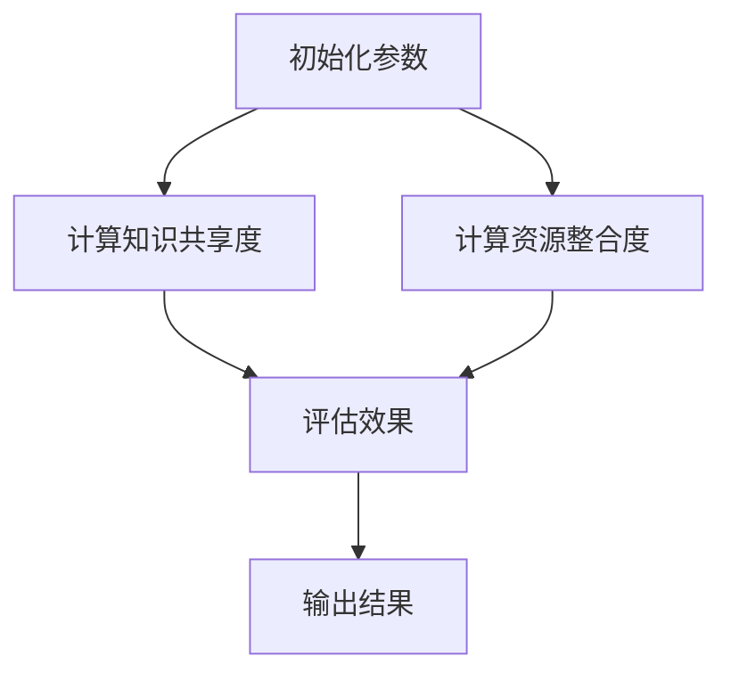
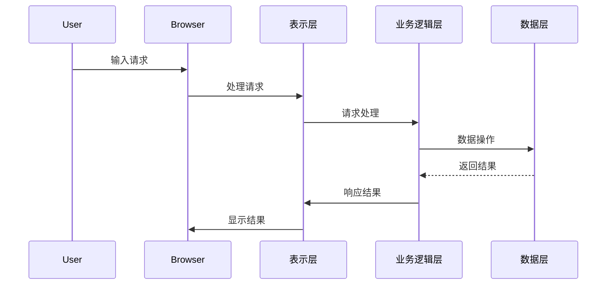
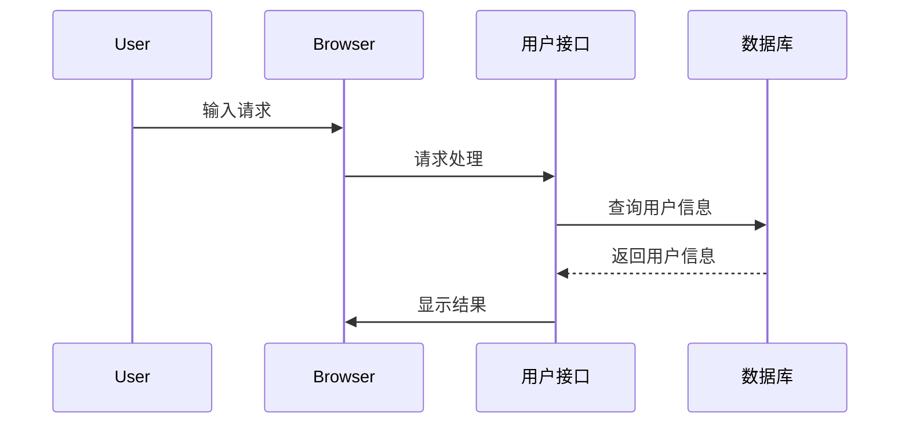

                 

### 第1章 引言

**关键词：** 后消费主义、生活实验社区、全球性转变、实践基地联盟

> **摘要：** 本文围绕后消费主义生活实验社区网络的构建，探讨了全球性从拥有到存在的转变实践基地联盟的重要性。通过深入分析后消费主义理论的起源与发展，以及实验社区网络与全球实践基地联盟的运作机制，本文旨在为理解和推进这一全球性变革提供有益的思考和实践指导。

随着全球经济的快速发展和技术的不断进步，社会结构和人们的生活方式发生了深刻的变化。传统消费主义观念逐渐受到质疑，一种新的生活方式——后消费主义逐渐兴起。后消费主义不仅仅是对物质拥有的追求，更强调精神层面和人际关系的重要性。本文旨在探讨后消费主义生活实验社区网络以及全球性从拥有到存在的转变实践基地联盟的构建，为这一全球性变革提供理论和实践依据。

### 1.1 问题背景

**1.1.1 消费主义社会的演变**

消费主义社会起源于工业革命之后，随着生产力的提高和物质财富的积累，人们开始追求更多的物质享受。在消费主义社会中，物质财富成为衡量个人成功和社会进步的重要标准。这一时期，人们追求拥有更多的物质产品，如汽车、房屋、奢侈品等，以显示自己的社会地位和成功。

然而，随着时间的推移，消费主义社会逐渐暴露出许多问题。首先，过度消费导致了资源的浪费和环境的破坏。其次，物质追求的单一化使得人们忽视了精神层面和人际关系的重要性，导致社会孤独感和焦虑感的增加。最后，消费主义文化容易导致人们陷入无尽的消费循环，难以实现真正的满足和幸福感。

**1.1.2 从拥有到存在的转变**

为了解决消费主义社会存在的问题，人们开始思考如何从拥有到存在的转变。这一转变不仅仅是减少物质消费，更是一种价值观和生活态度的转变。从拥有到存在的转变意味着人们开始关注自身的内在需求，如身心健康、人际关系、个人成长等。这种转变强调人与自然、人与社会、人与自我的和谐共生，追求一种更为平衡和可持续的生活方式。

**1.1.3 实践基地联盟的重要性**

实践基地联盟的构建是实现从拥有到存在的转变的重要途径。实践基地联盟是由多个生活实验社区组成的全球性网络，旨在通过实践和探索，推动后消费主义生活方式的普及和发展。实践基地联盟的作用主要体现在以下几个方面：

1. **知识共享**：实践基地联盟提供了一个平台，让各个社区可以分享彼此的经验和成果，促进知识的传播和共享。
2. **资源整合**：联盟成员可以共同利用资源，如资金、技术和人才，提高整体效率和影响力。
3. **协同创新**：通过联盟成员的协同合作，可以开展更多创新性的项目，推动后消费主义生活方式的深入发展。
4. **示范作用**：实践基地联盟的成功经验可以为其他地区和国家提供借鉴，推动全球性转变的进程。

### 1.2 本书的目的与结构

**1.2.1 研究目标**

本书旨在深入探讨后消费主义生活实验社区网络的构建和全球性从拥有到存在的转变实践基地联盟的发展。具体目标包括：

1. **理论探讨**：梳理后消费主义理论的发展脉络，分析其核心概念和理论基础。
2. **案例分析**：通过具体案例，展示实验社区网络和全球实践基地联盟的运作模式和效果。
3. **实践指导**：总结实践过程中的经验教训，为其他地区和国家的实践提供参考。

**1.2.2 内容组织**

本书共分为八个章节，具体内容组织如下：

- **第1章 引言**：介绍研究背景和问题，阐述研究目标和结构。
- **第2章 后消费主义理论**：探讨后消费主义的起源、发展和核心思想。
- **第3章 实验社区网络**：分析实验社区的概念、特点以及案例分析。
- **第4章 全球性实践基地联盟**：探讨实践基地联盟的起源、发展和案例分析。
- **第5章 从拥有到存在的转变实践**：详细阐述转变实践的步骤和方法，并进行分析案例。
- **第6章 社区网络与转变实践的互动**：分析社区网络对转变实践的支持和影响。
- **第7章 案例研究：全球性实践基地联盟的转型探索**：通过具体案例研究联盟的转型实践。
- **第8章 结论与展望**：总结研究成果，展望未来发展趋势。

### 1.3 文章结构概述

本文结构分为三大部分：

1. **理论探讨**：第2章详细探讨后消费主义理论的起源、发展和核心思想，为后续内容提供理论基础。
2. **实践分析**：第3章至第6章通过案例分析，展示实验社区网络和全球实践基地联盟的具体运作模式和效果。
3. **实践指导**：第7章总结实践过程中的经验教训，为其他地区的实践提供参考；第8章展望未来发展趋势，为全球性转变提供思考。

### 1.4 本章小结

本章首先介绍了研究的背景和问题，探讨了后消费主义社会的演变以及从拥有到存在的转变。接着阐述了实践基地联盟的重要性，并明确了本书的研究目标和结构。通过本章的介绍，读者可以对后续内容有一个整体的认识。

---

在本章节中，我们详细介绍了消费主义社会的演变、后消费主义生活方式的兴起以及实践基地联盟的重要性。通过对这些背景信息的分析，我们为后续章节的理论探讨和实践分析奠定了基础。接下来，我们将进一步探讨后消费主义理论的起源与发展，深入分析其核心概念和理论基础。

---

### 第2章 后消费主义理论

**关键词：** 后消费主义、起源与发展、核心思想、理论基础

> **摘要：** 本章将深入探讨后消费主义的起源、发展历程及其核心思想。通过梳理相关理论基础，分析后消费主义与传统消费主义的区别，本章旨在为理解和实践后消费主义提供理论指导。

随着全球经济的发展和人们生活水平的提高，传统消费主义观念逐渐受到挑战。后消费主义作为一种新的生活方式，强调精神层面和人际关系的重要性，倡导人们从物质追求转向内在需求的满足。本章将详细探讨后消费主义的起源、发展历程及其核心思想，为理解和实践后消费主义提供理论依据。

#### 2.1 后消费主义的起源与发展

**2.1.1 后消费主义的概念**

后消费主义（Post-consumerism）是一个相对较新的概念，它起源于20世纪末。与传统消费主义不同，后消费主义不再将物质财富的积累和消费作为衡量个人成功和社会进步的唯一标准。相反，它强调精神层面的满足和人际关系的和谐。

后消费主义的核心理念是“消费是为了生活，而不是为了生活而消费”。它主张减少不必要的物质消费，关注生活质量，提倡可持续性和环境友好型消费。后消费主义不仅仅是一种生活方式，更是一种价值观和社会文化的变革。

**2.1.2 后消费主义的理论基础

后消费主义的兴起与以下几方面的理论支持密切相关：

1. **生态学理论**：生态学理论强调人与自然的和谐共生。后消费主义倡导减少资源消耗和环境污染，追求一种可持续的生活方式。

2. **心理学理论**：心理学理论提供了对人类行为和心理需求的深入理解。后消费主义认为，人们的幸福感不仅仅来自于物质的拥有，更来自于精神层面的满足，如身心健康、人际关系和个人成长。

3. **社会学理论**：社会学理论关注社会结构和社会关系。后消费主义提倡减少社会不平等，推动社会公平和正义。

**2.1.3 后消费主义的核心思想**

后消费主义的核心思想主要包括以下几个方面：

1. **可持续性**：后消费主义强调可持续发展，倡导减少对自然资源的消耗和环境污染。

2. **精神满足**：后消费主义认为，人们的幸福感来自于精神层面的满足，如身心健康、人际关系和个人成长。

3. **社会公平**：后消费主义提倡减少社会不平等，推动社会公平和正义。

4. **合作共享**：后消费主义鼓励人们通过合作和共享来实现共同利益，减少个体主义的倾向。

#### 2.2 后消费主义与传统消费主义的对比

**2.2.1 消费主义的基本特征**

消费主义是一种以物质消费为中心的社会文化现象。其主要特征包括：

1. **物质主义**：消费主义强调物质财富的积累和消费，将物质拥有作为衡量个人成功和社会进步的标准。

2. **过度消费**：消费主义鼓励人们进行过度消费，导致资源的浪费和环境的破坏。

3. **个人主义**：消费主义强调个人利益的最大化，忽视了社会整体利益。

**2.2.2 后消费主义与传统消费主义的区别**

后消费主义与传统消费主义存在明显的区别，主要表现在以下几个方面：

1. **消费目的**：传统消费主义以物质拥有为目的，而后消费主义以精神满足和人际关系和谐为目的。

2. **消费方式**：传统消费主义鼓励过度消费，而后消费主义提倡适度消费和环保消费。

3. **价值观**：传统消费主义强调个人主义和物质主义，而后消费主义强调可持续性、社会公平和合作共享。

4. **社会影响**：传统消费主义导致资源浪费和环境破坏，而后消费主义有助于减少社会不平等和促进社会和谐。

#### 2.3 后消费主义对社会的影响

**2.3.1 经济领域的变革**

后消费主义的兴起对经济领域产生了深远的影响。首先，它推动了消费模式的转变，从以物质消费为中心转向以服务消费和体验消费为中心。其次，后消费主义促进了绿色经济的兴起，推动了环保产业的发展。最后，后消费主义有助于减少经济波动，提高经济的稳定性和可持续性。

**2.3.2 文化价值的转变**

后消费主义不仅改变了消费模式，还引发了文化价值的转变。它鼓励人们关注内在需求和人际关系，强调精神层面的满足。这种转变有助于提升社会的文化素养，推动社会向更高层次的发展。

**2.3.3 环境与可持续性的考虑**

后消费主义倡导可持续性消费，减少对自然资源的消耗和环境污染。这有助于保护生态环境，实现人与自然的和谐共生。同时，可持续性消费也有助于提高资源的利用效率，降低生产成本。

#### 2.4 本章小结

本章深入探讨了后消费主义的起源、发展历程及其核心思想。通过与传统消费主义的对比，我们明确了后消费主义的核心特征和对社会的影响。本章内容为理解和实践后消费主义提供了理论基础，为后续章节的实践分析奠定了基础。

---

在本章节中，我们详细探讨了后消费主义的起源、发展历程及其核心思想。通过对后消费主义与传统消费主义的对比，我们明确了后消费主义的核心特征和对社会的影响。接下来，我们将进一步分析实验社区网络的概念、特点以及具体案例分析。

---

### 第3章 实验社区网络

**关键词：** 实验社区、概念与特点、案例分析

> **摘要：** 本章将重点探讨实验社区的概念与特点，通过具体案例分析，揭示实验社区网络的运作模式和效果。本章旨在为实验社区网络的理论研究和实践提供实证支持和操作指导。

随着后消费主义的兴起，实验社区作为一种新型的生活实验场所，逐渐受到关注。实验社区网络通过将多个实验社区连接起来，形成了一个全球性的合作平台，旨在推动后消费主义生活方式的普及和发展。本章将详细探讨实验社区的概念与特点，并通过具体案例分析，展示实验社区网络的运作模式和效果。

#### 3.1 实验社区的概念与特点

**3.1.1 实验社区的概念**

实验社区（Experimental Community）是指在一定时期内，通过特定的组织和规划，进行生活方式、社会结构和文化价值等方面的实验和探索的社区。实验社区的核心目的是通过实践，检验和验证某些社会理论和生活方式的有效性，为社会的可持续发展提供参考。

**3.1.2 实验社区的特点**

实验社区具有以下特点：

1. **灵活性**：实验社区具有较强的灵活性，可以根据实验目标和社会需求进行动态调整。

2. **参与性**：实验社区鼓励居民积极参与社区建设和决策过程，提高社区凝聚力和参与度。

3. **创新性**：实验社区通过不断尝试和探索，推动社会创新和生活方式的变革。

4. **可复制性**：实验社区的成功经验可以被其他地区和社区复制和推广，实现更大范围的社会变革。

#### 3.2 实验社区网络的概念与作用

**3.2.1 实验社区网络的概念**

实验社区网络（Experimental Community Network）是指由多个实验社区组成的全球性合作网络，通过资源共享、知识传播和协同创新，共同推动后消费主义生活方式的普及和发展。实验社区网络的核心作用在于实现实验社区的联动和协同效应，提高整体效率和影响力。

**3.2.2 实验社区网络的作用**

实验社区网络的作用主要体现在以下几个方面：

1. **知识共享**：实验社区网络提供了一个平台，让各个社区可以分享彼此的经验和成果，促进知识的传播和共享。

2. **资源整合**：实验社区网络通过整合各社区的资源和能力，提高整体效率和影响力。

3. **协同创新**：实验社区网络鼓励各社区之间的协同创新，推动更多创新性的项目和实践。

4. **示范作用**：实验社区网络的成功经验可以为其他地区和国家提供借鉴，推动全球性转变的进程。

#### 3.3 生活实验社区案例分析

**3.3.1 案例选择与评估**

在本节中，我们将选择两个具有代表性的生活实验社区进行案例分析，分别是“绿城社区”和“智慧社区”。这两个社区都在推动后消费主义生活方式方面取得了显著成效。

**绿城社区**：位于中国某大城市，以可持续发展为主题，通过绿色建筑、可再生能源利用、环保交通和垃圾分类等手段，实现社区内部的资源循环利用和环境保护。

**智慧社区**：位于美国某高科技园区，以智能技术为核心，通过智能家居、智慧交通、智慧医疗和智慧教育等手段，提升居民的生活质量和社会服务效率。

**3.3.2 案例分析：以绿城社区为例**

**1. 社区背景**

绿城社区成立于2010年，初始居民约1000人。社区地处郊区，占地面积约10平方公里。社区的建设初衷是为了探索可持续生活方式，减少对自然资源的消耗和环境污染。

**2. 实践措施**

- **绿色建筑**：社区采用了多项绿色建筑设计，如太阳能发电、地源热泵、自然通风和雨水收集系统。
- **可再生能源利用**：社区内所有电力需求由太阳能和风能提供，减少了对化石燃料的依赖。
- **环保交通**：社区内部禁止机动车行驶，鼓励居民使用电动车或步行。同时，社区与外部交通系统联动，提供公交和自行车租赁服务。
- **垃圾分类与回收**：社区建立了完善的垃圾分类系统，鼓励居民进行垃圾分类，提高资源回收率。

**3. 成效与经验**

- **环境效益**：绿城社区通过绿色建筑和可再生能源利用，实现了零碳排放，大大减少了环境污染。
- **社会效益**：社区内部的绿色交通和垃圾分类措施，提高了居民的生活质量和环保意识。
- **经济效益**：社区通过资源循环利用和可再生能源利用，降低了运营成本，提高了经济效益。

**4. 启示与挑战**

- **启示**：绿城社区的成功经验表明，可持续生活方式不仅可行，而且具有显著的社会和经济效益。
- **挑战**：绿城社区在建设过程中遇到了资金、技术和政策等方面的挑战，需要进一步解决。

**3.3.3 案例分析：以智慧社区为例**

**1. 社区背景**

智慧社区成立于2015年，位于美国某高科技园区。社区居民以科技工作者为主，总人数约3000人。社区的建设初衷是利用智能技术提升居民的生活质量和社会服务效率。

**2. 实践措施**

- **智能家居**：社区内所有房屋都配备了智能设备，如智能灯光、智能家电和智能安防系统，提高居民的生活便利性和安全性。
- **智慧交通**：社区内部实现了智能交通管理，通过实时监控和数据分析，优化交通流量，减少拥堵。
- **智慧医疗**：社区建立了智能医疗系统，通过远程医疗和健康管理，提高医疗服务质量和居民健康水平。
- **智慧教育**：社区内部实现了智能教育，通过在线课程和学习管理系统，提高教育质量和学习效果。

**3. 成效与经验**

- **生活效益**：智慧社区通过智能技术的应用，大大提高了居民的生活质量和幸福感。
- **社会效益**：社区内的智能交通、智慧医疗和智慧教育等措施，提高了社区的整体服务水平和居民满意度。
- **经济效益**：智慧社区通过智能化管理和服务，降低了运营成本，提高了经济效益。

**4. 启示与挑战**

- **启示**：智慧社区的成功经验表明，智能技术在提升居民生活质量和社会服务效率方面具有巨大潜力。
- **挑战**：智慧社区在建设过程中遇到了技术、安全和隐私等方面的挑战，需要进一步解决。

#### 3.4 实验社区网络的构建与运营

**3.4.1 构建原则**

实验社区网络的构建应遵循以下原则：

1. **开放性**：实验社区网络应具备开放性，鼓励各社区之间的交流和合作。
2. **协同性**：实验社区网络应实现各社区之间的协同创新，提高整体效率和影响力。
3. **灵活性**：实验社区网络应具备灵活性，适应不同社区的需求和变化。
4. **可持续性**：实验社区网络应注重可持续发展，确保长期稳定运行。

**3.4.2 运营模式**

实验社区网络的运营模式主要包括以下几个方面：

1. **知识共享平台**：建立一个知识共享平台，让各社区可以分享经验和成果，促进知识的传播和共享。
2. **资源整合平台**：建立一个资源整合平台，整合各社区的资源和能力，提高整体效率和影响力。
3. **协同创新平台**：建立一个协同创新平台，鼓励各社区之间的协同创新，推动更多创新性的项目和实践。
4. **评估与反馈机制**：建立评估与反馈机制，定期对社区网络的效果进行评估，及时调整和优化运营策略。

#### 3.5 本章小结

本章详细探讨了实验社区的概念与特点，并通过具体案例分析，揭示了实验社区网络的运作模式和效果。通过本章的内容，我们不仅可以更好地理解实验社区的作用和意义，也为实验社区网络的构建和运营提供了理论指导和实践经验。

---

在本章节中，我们深入探讨了实验社区的概念与特点，并通过具体案例分析，展示了实验社区网络的运作模式和效果。通过这些分析，我们不仅了解了实验社区在推动后消费主义生活方式方面的作用，也为实验社区网络的构建和运营提供了理论和实践依据。接下来，我们将进一步探讨全球性实践基地联盟的起源与发展。

---

### 第4章 全球性实践基地联盟

**关键词：** 全球性实践基地联盟、起源与发展、作用与挑战

> **摘要：** 本章将探讨全球性实践基地联盟的起源与发展，分析其组织结构、运作机制和全球影响力。同时，讨论联盟面临的挑战和未来发展。本章旨在为全球性实践基地联盟的发展提供理论和实践参考。

随着后消费主义生活方式的普及和全球可持续发展的需求日益迫切，全球性实践基地联盟（Global Practice Base Alliance，GPBA）作为一种新型合作模式，逐渐成为推动社会变革和可持续发展的关键力量。本章将详细探讨全球性实践基地联盟的起源、发展、组织结构、运作机制以及面临的挑战，为全球性实践基地联盟的发展提供理论和实践参考。

#### 4.1 全球性实践基地联盟的起源与发展

**4.1.1 联盟的起源**

全球性实践基地联盟的起源可以追溯到20世纪末和21世纪初，当时一些国家和地区开始探索可持续生活方式和后消费主义实践。随着这些实践的不断推广，一些具有共同理念和目标的社区和机构开始自发形成联盟，共同推动全球性实践基地联盟的发展。

**4.1.2 联盟的发展历程**

全球性实践基地联盟的发展历程可以分为以下几个阶段：

1. **初创阶段（2000-2010年）**：在这个阶段，全球性实践基地联盟主要是一些社区和机构的自发合作，规模较小，影响力有限。
2. **发展阶段（2010-2020年）**：在这个阶段，全球性实践基地联盟逐渐形成了一定的规模和影响力，吸引了更多的社区和机构的参与。联盟开始制定统一的运作机制和标准，推动全球性实践的推广。
3. **成熟阶段（2020年至今）**：在这个阶段，全球性实践基地联盟已经成为一个重要的国际合作平台，涵盖了多个领域和多个国家和地区。联盟的影响力不断扩大，成为推动全球可持续发展和后消费主义实践的重要力量。

#### 4.2 全球性实践基地联盟的组织结构

**4.2.1 联盟的组织结构**

全球性实践基地联盟的组织结构通常包括以下几个层级：

1. **核心管理层**：由联盟的发起者和主要成员组成，负责联盟的战略规划和重大决策。
2. **执行委员会**：由核心管理层任命，负责联盟的日常运营和管理工作。
3. **成员社区**：由参与联盟的各个社区组成，每个社区都有自己的特色和实践项目。
4. **专家顾问团队**：由来自不同领域和国家的专家组成，为联盟提供专业指导和咨询服务。

**4.2.2 联盟的职能**

全球性实践基地联盟的主要职能包括：

1. **资源整合**：联盟通过整合各成员社区的资源，提高整体效率和影响力。
2. **知识传播**：联盟通过组织研讨会、培训班和宣传活动，推广后消费主义理念和最佳实践。
3. **协同创新**：联盟鼓励成员社区之间的协同创新，共同开展跨社区的创新项目。
4. **评估与认证**：联盟对成员社区进行定期评估和认证，确保实践项目的质量和效果。

#### 4.3 全球性实践基地联盟的运作机制

**4.3.1 运作机制**

全球性实践基地联盟的运作机制主要包括以下几个方面：

1. **合作框架**：联盟与各成员社区签订合作协议，明确各自的职责和义务。
2. **资源共享**：联盟通过建立共享平台，实现各成员社区之间的资源共享，提高整体效率。
3. **协同工作**：联盟鼓励各成员社区之间的协同工作，共同推动实践项目的实施。
4. **评估与反馈**：联盟定期对实践项目进行评估和反馈，确保实践项目的质量和效果。

#### 4.4 全球性实践基地联盟的全球影响力

**4.4.1 全球影响力的表现**

全球性实践基地联盟的全球影响力主要表现在以下几个方面：

1. **推动全球性实践**：联盟通过组织国际研讨会、培训班和宣传活动，推广后消费主义理念和最佳实践，推动全球性实践的发展。
2. **促进国际合作**：联盟为各国社区和机构提供了一个交流合作的平台，促进了国际间的合作与交流。
3. **提升社会认知**：联盟通过宣传和实践，提升了公众对后消费主义和社会可持续发展的认知和重视。

**4.4.2 全球影响力的评估**

全球性实践基地联盟的全球影响力可以通过以下指标进行评估：

1. **成员数量**：成员社区的数量和参与度是评估联盟影响力的关键指标。
2. **实践项目数量**：联盟推动的实践项目数量和质量是评估联盟影响力的另一个重要指标。
3. **社会影响**：联盟对社会的实际影响，如环境改善、社会公平和经济发展的贡献程度。

#### 4.5 全球性实践基地联盟面临的挑战

**4.5.1 挑战的表现**

全球性实践基地联盟在发展过程中面临着一系列挑战，主要包括：

1. **资源短缺**：联盟在资源获取方面存在一定的困难，如资金、技术和人才的短缺。
2. **组织协调**：联盟在组织协调方面存在一定的挑战，如成员社区之间的沟通和合作。
3. **政策支持**：联盟在政策支持方面存在一定的不足，如各国政策的不一致和不确定性。
4. **公众认知**：公众对后消费主义和社会可持续发展的认知和接受度还有待提高。

**4.5.2 应对策略**

为了应对这些挑战，全球性实践基地联盟可以采取以下策略：

1. **加强资源整合**：通过加强资源整合，提高联盟的整体效率和影响力。
2. **优化组织结构**：通过优化组织结构，提高联盟的组织协调和运作效率。
3. **争取政策支持**：通过争取政策支持，为联盟的发展提供良好的政策环境。
4. **提升公众认知**：通过宣传和实践，提高公众对后消费主义和社会可持续发展的认知和接受度。

#### 4.6 全球性实践基地联盟的未来发展

**4.6.1 未来发展的趋势**

全球性实践基地联盟的未来发展将呈现出以下几个趋势：

1. **国际化**：联盟将进一步拓展国际影响力，吸引更多国家和地区参与。
2. **专业化**：联盟将更加注重专业化和精细化，推动更多创新性项目的实施。
3. **数字化转型**：联盟将推动数字化转型，提高运作效率和影响力。

**4.6.2 未来发展的机遇**

全球性实践基地联盟的未来发展将面临以下几个机遇：

1. **技术创新**：随着技术的不断进步，联盟可以借助新技术提高运作效率和影响力。
2. **政策支持**：各国政府对可持续发展的重视将提供更多的政策支持。
3. **公众参与**：公众对可持续发展的关注和参与度将不断提高。

#### 4.7 本章小结

本章详细探讨了全球性实践基地联盟的起源、发展、组织结构、运作机制、全球影响力以及面临的挑战和未来发展。通过本章的内容，我们可以更好地理解全球性实践基地联盟的作用和意义，为联盟的发展提供理论和实践参考。

---

在本章节中，我们详细探讨了全球性实践基地联盟的起源、发展、组织结构、运作机制、全球影响力以及面临的挑战和未来发展。通过这些分析，我们不仅了解了全球性实践基地联盟的重要性和作用，也为联盟的发展提供了理论和实践指导。接下来，我们将深入探讨从拥有到存在的转变实践，分析其步骤和方法。

---

### 第5章 从拥有到存在的转变实践

**关键词：** 转变实践、步骤与方法、案例分析

> **摘要：** 本章将详细阐述从拥有到存在的转变实践，包括其具体步骤和方法。通过具体案例分析，展示转变实践的效果和经验。本章旨在为理解和实施转变实践提供实用指南。

随着后消费主义的兴起，人们开始关注从拥有到存在的转变。这种转变不仅意味着减少物质消费，更涉及到价值观和生活态度的深刻变革。本章将深入探讨从拥有到存在的转变实践，包括其具体步骤和方法，并通过具体案例分析，展示转变实践的效果和经验。

#### 5.1 转变实践的步骤与方法

**5.1.1 转变实践的定义**

从拥有到存在的转变实践是指通过一系列的具体行动，引导人们从过度追求物质拥有转向追求内在需求和幸福感的生活方式。这种转变实践旨在帮助个体和社会实现可持续性和公平性。

**5.1.2 转变实践的步骤**

1. **自我反思**：首先，个体需要通过自我反思，认识到自己对物质拥有的过度追求，并明确自己的内在需求和价值观。

2. **设定目标**：在自我反思的基础上，个体需要设定具体的转变目标，如减少物质消费、增加人际关系投入、追求个人成长等。

3. **制定计划**：个体需要制定详细的转变计划，包括具体的时间表、行动步骤和可量化的目标。

4. **实施行动**：按照制定的计划，逐步实施转变行动，如减少不必要的物质购买、增加社交活动、参与志愿活动等。

5. **评估与调整**：定期评估转变实践的效果，根据实际情况进行调整和优化。

**5.1.3 转变实践的方法**

1. **自我教育**：通过阅读相关书籍、参加讲座和研讨会，提高对后消费主义和转变实践的理解。

2. **社交互动**：积极参与社交活动，建立和维护健康的人际关系，提高社交技能和情感交流能力。

3. **实践反思**：定期进行实践反思，总结经验教训，优化转变实践。

4. **技术支持**：利用技术工具，如手机应用、在线社区等，提供行为指导和支持。

#### 5.2 转变实践案例分析

**5.2.1 案例选择与评估**

在本节中，我们将选择两个具有代表性的转变实践案例进行深入分析，分别是“绿色生活方式转型项目”和“社区共享经济实践”。这两个案例都在推动从拥有到存在的转变方面取得了显著成效。

**绿色生活方式转型项目**：该项目是由某环保组织发起的，旨在通过一系列措施，帮助居民实现绿色生活方式的转变。项目的主要内容包括环保知识宣传、绿色消费引导、环保志愿服务等。

**社区共享经济实践**：该项目是在某个社区内实施的，通过共享工具、共享空间和共享服务，推动社区成员之间的资源共享和互助合作。项目的主要内容包括共享自行车、共享厨房、共享工具等。

**5.2.2 案例分析：绿色生活方式转型项目**

**1. 项目背景**

绿色生活方式转型项目于2018年启动，位于中国某大城市的一个居民社区。项目旨在通过一系列措施，引导居民实现绿色生活方式的转变，减少对环境的负面影响。

**2. 实践措施**

- **环保知识宣传**：项目通过悬挂宣传标语、发放宣传手册、举办讲座和研讨会等形式，提高居民对环保知识的了解和意识。

- **绿色消费引导**：项目通过推荐环保产品、提供绿色消费指南和优惠活动，引导居民进行环保消费。

- **环保志愿服务**：项目组织居民参与环保志愿服务，如垃圾分类、植树造林等，增强居民的环保责任感和参与度。

**3. 成效与经验**

- **环境效益**：通过项目实施，社区的垃圾分类率和环保意识显著提高，减少了环境污染和资源浪费。

- **社会效益**：项目增强了社区的凝聚力，促进了居民之间的交流和互动，提升了居民的幸福感和满意度。

- **经济效应**：项目通过减少资源消耗和环境污染，降低了社区的运营成本，提高了经济效益。

**4. 启示与挑战**

- **启示**：绿色生活方式转型项目表明，通过环保知识宣传、绿色消费引导和环保志愿服务，可以有效推动绿色生活方式的转变。

- **挑战**：项目在实施过程中遇到了资金、技术和参与度等方面的挑战，需要进一步解决。

**5.2.3 案例分析：社区共享经济实践**

**1. 项目背景**

社区共享经济实践于2019年启动，位于美国某城市的一个居民社区。项目旨在通过共享工具、共享空间和共享服务，推动社区成员之间的资源共享和互助合作。

**2. 实践措施**

- **共享自行车**：社区内设置了多个共享自行车停车点，方便居民使用。

- **共享厨房**：社区内建立了共享厨房，居民可以在这里烹饪和分享食物。

- **共享工具**：社区内设置了共享工具架，居民可以借用各种工具，如园艺工具、工具车等。

**3. 成效与经验**

- **资源效益**：通过共享经济实践，社区的资源利用率显著提高，减少了资源的浪费。

- **社会效益**：项目增强了社区成员之间的互动和合作，提高了社区的凝聚力和居民的幸福感和满意度。

- **经济效益**：项目通过降低居民的生活成本，提高了居民的经济效益。

**4. 启示与挑战**

- **启示**：社区共享经济实践表明，通过共享工具、共享空间和共享服务，可以有效推动资源共享和互助合作。

- **挑战**：项目在实施过程中遇到了设备维护、安全管理等方面的挑战，需要进一步解决。

#### 5.3 转变实践的总结与展望

**5.3.1 总结**

通过以上案例分析，我们可以得出以下结论：

1. **转变实践的有效性**：绿色生活方式转型项目和社区共享经济实践都取得了显著成效，表明从拥有到存在的转变实践是可行的。

2. **实践的多样性和灵活性**：不同社区可以根据自己的实际情况，采取不同的转变实践措施，提高实践的效果。

3. **面临的挑战**：转变实践在实施过程中遇到了资金、技术和参与度等方面的挑战，需要社区和联盟共同努力解决。

**5.3.2 展望**

未来，从拥有到存在的转变实践将继续在全球范围内推广。为了实现这一目标，我们可以采取以下措施：

1. **加强政策支持**：政府应出台更多政策，支持转变实践的实施，如提供财政补贴、税收优惠等。

2. **提高公众认知**：通过宣传和教育，提高公众对后消费主义和转变实践的认知和接受度。

3. **加强社区合作**：社区之间应加强合作，共享经验和资源，提高整体效率和影响力。

4. **推动技术创新**：利用新技术，如物联网、大数据等，提高转变实践的科学性和有效性。

#### 5.4 本章小结

本章详细阐述了从拥有到存在的转变实践，包括其步骤和方法，并通过具体案例分析，展示了转变实践的效果和经验。通过本章的内容，我们可以更好地理解和实施转变实践，为推动后消费主义生活方式的普及和发展提供有力支持。

---

在本章节中，我们详细阐述了从拥有到存在的转变实践，包括其具体步骤和方法，并通过具体案例分析，展示了转变实践的效果和经验。这些案例不仅验证了转变实践的有效性，也为我们提供了宝贵的经验和启示。接下来，我们将探讨社区网络与转变实践的互动，分析社区网络对转变实践的支持作用以及转变实践对社区网络的影响。

---

### 第6章 社区网络与转变实践的互动

**关键词：** 社区网络、支持作用、影响、协同效应

> **摘要：** 本章将深入探讨社区网络在支持转变实践中的作用，分析转变实践对社区网络的影响，以及社区网络与转变实践之间的协同效应。本章旨在为理解和优化社区网络与转变实践的关系提供理论和实践指导。

随着全球性从拥有到存在的转变实践的推进，社区网络的作用愈发凸显。社区网络不仅为转变实践提供了支持，同时也受到转变实践的影响。本章将详细探讨社区网络在支持转变实践中的作用，分析转变实践对社区网络的影响，以及社区网络与转变实践之间的协同效应。

#### 6.1 社区网络对转变实践的支持

**6.1.1 社区网络的作用机制**

社区网络在支持转变实践中发挥着多重作用，主要体现在以下几个方面：

1. **知识传播**：社区网络提供了一个平台，让成员之间可以分享转变实践的知识和经验，促进知识的传播和共享。

2. **资源共享**：社区网络通过整合各社区的资源，如资金、技术和人才，提高整体效率和影响力，为转变实践提供有力支持。

3. **协同创新**：社区网络鼓励各社区之间的协同创新，共同开展跨社区的创新项目，推动转变实践的深入发展。

4. **示范效应**：社区网络中的成功案例可以发挥示范效应，激发其他社区进行转变实践的动力和信心。

**6.1.2 社区网络的具体支持措施**

为了更好地支持转变实践，社区网络可以采取以下具体措施：

1. **建立知识共享平台**：通过建立线上和线下的知识共享平台，如论坛、研讨会和培训课程，促进成员之间的交流和知识传播。

2. **开展联合项目**：通过开展跨社区的联合项目，整合各社区的资源，共同推动转变实践的深入发展。

3. **提供技术支持**：为成员社区提供技术支持，如提供技术咨询服务、共享技术资源和开展技术培训等。

4. **制定共同标准**：制定统一的转变实践标准，确保各社区在实践中遵循一致的原则和规范。

#### 6.2 转变实践对社区网络的影响

**6.2.1 转变实践对社区网络的影响表现**

转变实践对社区网络的影响主要表现在以下几个方面：

1. **网络结构优化**：转变实践推动了社区网络结构的优化，通过整合资源、协同创新和示范效应，提高了社区网络的效率和影响力。

2. **网络活力提升**：转变实践激发了社区网络的活力，通过参与实践、分享经验和合作创新，增强了社区网络的凝聚力和互动性。

3. **社区角色转变**：转变实践促使社区角色发生转变，从传统的管理和服务角色向创新和引导角色转变，推动了社区的发展和进步。

**6.2.2 转变实践对社区网络的具体影响**

转变实践对社区网络的具体影响包括：

1. **资源配置优化**：转变实践通过资源共享和协同创新，优化了社区网络的资源配置，提高了资源利用效率。

2. **知识传播加速**：转变实践推动了社区网络中的知识传播，通过线上和线下的交流平台，加速了知识的共享和传播。

3. **创新能力提升**：转变实践促进了社区网络的创新能力，通过协同创新和联合项目，推动了新技术和新模式的产生。

4. **社区凝聚力增强**：转变实践增强了社区网络的凝聚力，通过共同的实践目标和价值观，加强了成员之间的联系和互动。

#### 6.3 社区网络与转变实践的协同效应

**6.3.1 协同效应的定义**

社区网络与转变实践的协同效应是指社区网络在支持转变实践过程中，通过资源共享、知识传播和协同创新，实现整体效能的提升和价值的最大化。

**6.3.2 协同效应的表现**

1. **资源共享**：社区网络通过整合各社区的资源，如资金、技术和人才，提高了整体效率和影响力，实现了资源的最优配置。

2. **知识传播**：社区网络通过建立知识共享平台和开展联合项目，加速了知识的传播和共享，提升了社区网络的创新能力和竞争力。

3. **协同创新**：社区网络通过协同创新和联合项目，推动了新技术和新模式的产生，实现了社区网络的共同进步和发展。

4. **示范效应**：社区网络中的成功案例发挥了示范效应，激励其他社区进行转变实践，推动了整体社会变革的进程。

**6.3.3 协同效应的实现策略**

1. **建立协同机制**：通过建立协同机制，如合作框架、资源共享平台和联合项目，确保社区网络的有效运行和协同效应的实现。

2. **加强知识共享**：通过建立知识共享平台和开展培训课程，促进知识的传播和共享，提升社区网络的创新能力。

3. **推动协同创新**：通过鼓励跨社区的协同创新和联合项目，推动新技术和新模式的产生，实现社区网络的共同进步。

4. **优化资源配置**：通过优化资源配置，提高资源利用效率，实现资源的最优配置，提升整体效率和影响力。

#### 6.4 本章小结

本章详细探讨了社区网络在支持转变实践中的作用，分析了转变实践对社区网络的影响，以及社区网络与转变实践之间的协同效应。通过本章的内容，我们不仅了解了社区网络在推动转变实践中的重要作用，也为社区网络与转变实践的协同发展提供了理论和实践指导。

---

在本章节中，我们详细探讨了社区网络在支持转变实践中的作用，分析了转变实践对社区网络的影响，以及社区网络与转变实践之间的协同效应。这些分析不仅帮助我们理解了社区网络在推动后消费主义生活方式转变中的重要作用，也为优化社区网络与转变实践的关系提供了实用的策略和建议。接下来，我们将通过一个具体的案例研究，探讨全球性实践基地联盟的转型探索。

---

### 第7章 案例研究：全球性实践基地联盟的转型探索

**关键词：** 全球性实践基地联盟、转型背景、实践过程、效果评估

> **摘要：** 本章将通过对全球性实践基地联盟（GPBA）的转型案例研究，探讨其背景、转型过程及效果评估。通过深入分析联盟转型的成功经验和面临的挑战，本章旨在为其他联盟的转型提供借鉴和启示。

在全球经济和社会变革的大背景下，全球性实践基地联盟（Global Practice Base Alliance，GPBA）面临着新的挑战和机遇。为了适应这些变化，GPBA开始了一场深刻的转型探索。本章将详细分析GPBA的转型背景、实践过程、效果评估，以及转型过程中的成功经验和挑战。

#### 7.1 联盟转型背景

**7.1.1 转型动因**

GPBA转型的背景主要源于以下几个方面：

1. **全球性趋势**：随着后消费主义和可持续发展的全球性趋势日益显著，GPBA需要适应这一变化，推动联盟向更加可持续和具有影响力的方向发展。

2. **技术进步**：互联网、大数据、人工智能等新技术的飞速发展，为联盟提供了新的工具和平台，促使GPBA进行数字化转型和优化运作机制。

3. **内部需求**：联盟内部成员对于资源整合、知识共享和协同创新的期望不断提高，需要通过转型来满足这些需求。

4. **外部压力**：国际社会对于可持续发展和环境保护的要求越来越严格，GPBA需要通过转型来应对这些外部压力，提升联盟的社会责任和影响力。

**7.1.2 转型重要性**

GPBA的转型具有重要意义：

1. **提升影响力**：通过转型，联盟可以更好地适应全球性趋势，提升其国际影响力和话语权。

2. **增强凝聚力**：转型有助于加强联盟内部的凝聚力，提高成员社区的参与度和忠诚度。

3. **促进创新**：转型为联盟提供了更多的机会，通过整合资源、知识共享和协同创新，推动新的实践项目和模式。

#### 7.2 联盟转型实践过程

**7.2.1 转型策略与方法**

GPBA的转型采取了以下策略和方法：

1. **顶层设计**：制定明确的转型目标和规划，确保转型的方向和步骤清晰。

2. **技术升级**：引入新的信息技术和平台，如大数据分析、人工智能和物联网，提升联盟的数字化水平。

3. **组织重构**：优化组织结构，减少冗余层级，提高组织效率和决策速度。

4. **知识共享**：建立知识共享平台，促进成员社区之间的知识和经验交流。

5. **协同创新**：通过联合项目和跨社区合作，推动创新项目的实施。

**7.2.2 转型实践步骤**

GPBA的转型实践分为以下几个步骤：

1. **需求分析**：对联盟内部的需求进行深入调研，明确转型目标和关键领域。

2. **规划制定**：根据需求分析结果，制定详细的转型规划和时间表。

3. **技术引入**：引入新技术和平台，进行试点应用和评估。

4. **组织调整**：根据转型需求，调整组织结构和人员配置。

5. **实施与推广**：按照规划，逐步实施转型措施，并在联盟内部推广。

6. **效果评估**：对转型效果进行定期评估，调整和优化转型方案。

#### 7.3 联盟转型实践效果评估

**7.3.1 转型效果**

GPBA的转型实践取得了显著效果：

1. **数字化水平提升**：联盟的数字化水平显著提高，实现了信息共享和协同创新的自动化。

2. **组织效率提高**：通过组织重构，减少了冗余层级，提高了决策效率和执行力。

3. **知识共享增强**：知识共享平台的建立，促进了成员社区之间的知识和经验交流。

4. **创新能力增强**：通过协同创新，推动了多个创新项目的成功实施。

5. **社会影响力提升**：联盟在全球范围内的影响力得到提升，吸引了更多成员社区和国际组织的加入。

**7.3.2 成功经验**

GPBA转型过程中的成功经验包括：

1. **明确目标**：制定明确的转型目标和规划，确保转型方向和步骤清晰。

2. **技术驱动**：引入新技术和平台，提升联盟的数字化水平。

3. **组织优化**：通过组织重构，提高组织效率和决策速度。

4. **知识共享**：建立知识共享平台，促进成员社区之间的交流和合作。

5. **协同创新**：通过协同创新，推动联盟内部和跨社区的创新项目。

#### 7.4 联盟转型面临的挑战与应对策略

**7.4.1 挑战**

GPBA在转型过程中面临以下挑战：

1. **技术适应性**：新技术的引入和应用需要时间和人力，可能会面临技术适应性问题。

2. **组织变革阻力**：组织重构和人员调整可能会遇到旧有机制的阻力。

3. **知识共享难题**：知识共享平台的建设和运营需要克服信息孤岛和隐私保护等问题。

4. **资源分配不均**：转型过程中，资源分配不均可能会影响部分成员社区的发展。

**7.4.2 应对策略**

为应对上述挑战，GPBA采取了以下策略：

1. **技术培训**：提供技术培训，提高成员社区对新技术的适应性。

2. **沟通与协调**：加强与成员社区的沟通和协调，解决组织变革中的问题。

3. **隐私保护**：制定隐私保护政策，确保知识共享平台的安全和有效运营。

4. **资源均衡配置**：通过资源整合和协调，实现资源分配的均衡。

#### 7.5 联盟转型的启示与未来展望

**7.5.1 启示**

GPBA的转型为其他全球性实践基地联盟提供了以下启示：

1. **明确转型目标**：制定清晰的转型目标和规划，确保转型方向和步骤清晰。

2. **技术驱动**：利用新技术提升数字化水平和创新能力。

3. **组织优化**：通过组织重构提高组织效率和决策速度。

4. **知识共享**：建立有效的知识共享平台，促进成员社区之间的交流和合作。

5. **协同创新**：通过协同创新，推动联盟内部和跨社区的创新项目。

**7.5.2 未来展望**

未来，全球性实践基地联盟的发展将呈现出以下趋势：

1. **国际化**：联盟将进一步拓展国际影响力，吸引更多国家和地区的参与。

2. **专业化**：联盟将更加注重专业化和精细化，推动更多创新性项目的实施。

3. **数字化转型**：联盟将推动数字化转型，提高运作效率和影响力。

4. **社会参与**：联盟将加强与社会各界的合作，提高公众参与度。

#### 7.6 本章小结

本章通过对全球性实践基地联盟（GPBA）的转型案例研究，详细分析了其转型背景、实践过程、效果评估以及成功经验和挑战。通过这些分析，我们不仅了解了GPBA转型的成功经验和面临的挑战，也为其他联盟的转型提供了有益的借鉴和启示。未来，全球性实践基地联盟将继续在全球性从拥有到存在的转变中发挥重要作用。

---

在本章节中，我们通过对全球性实践基地联盟的转型案例研究，详细分析了其转型的背景、实践过程、效果评估以及成功经验和挑战。这些分析不仅为我们理解全球性实践基地联盟的转型提供了深刻的洞察，也为其他联盟的转型提供了宝贵的经验和策略。接下来，我们将总结本文的研究成果，并提出未来研究的方向。

---

### 第8章 结论与展望

**关键词：** 后消费主义、生活实验社区、全球实践基地联盟、研究贡献、未来展望

> **摘要：** 本章总结了本文的主要研究成果，讨论了后消费主义生活实验社区网络与全球性从拥有到存在的转变实践基地联盟的重要性。本文通过对相关理论和实践的分析，提出了对后消费主义生活实验社区网络的深入理解，并对全球性实践基地联盟的转型提供了策略指导。本章旨在为未来的研究和实践提供方向和启示。

#### 8.1 研究总结

本文围绕后消费主义生活实验社区网络和全球性从拥有到存在的转变实践基地联盟，进行了一系列的理论探讨和实践分析。具体研究总结如下：

1. **后消费主义理论**：通过对后消费主义的起源、发展和核心思想的探讨，明确了后消费主义与传统消费主义的区别，及其对社会经济、文化和环境的影响。

2. **实验社区网络**：分析了实验社区的概念与特点，通过具体案例分析，展示了实验社区网络的运作模式和效果，强调了社区网络在支持转变实践中的重要作用。

3. **全球实践基地联盟**：探讨了全球性实践基地联盟的起源、发展和组织结构，分析了其运作机制和全球影响力，同时讨论了联盟在推动全球性转变实践中的挑战与应对策略。

4. **转变实践**：详细阐述了从拥有到存在的转变实践步骤和方法，通过具体案例分析，验证了转变实践的有效性和可操作性。

5. **协同效应**：分析了社区网络与转变实践之间的协同效应，探讨了如何通过社区网络支持转变实践，以及转变实践对社区网络的影响。

#### 8.2 研究贡献

本文的研究贡献主要体现在以下几个方面：

1. **理论贡献**：本文对后消费主义理论进行了系统梳理，为理解后消费主义生活方式提供了理论基础。

2. **实践指导**：通过案例分析，本文为实验社区网络和全球实践基地联盟的构建与运营提供了具体的指导和建议。

3. **创新性**：本文提出了社区网络与转变实践之间的协同效应分析，丰富了相关领域的研究内容。

4. **启示**：本文的研究成果为其他地区和国家的后消费主义实践提供了参考，促进了全球性转变的进程。

#### 8.3 研究局限

尽管本文在理论探讨和实践分析方面取得了一定的成果，但仍存在一些局限性：

1. **数据局限**：本文主要基于现有文献和案例分析，缺乏长期实证数据支持。

2. **地域局限**：本文主要关注全球性实践基地联盟，对地区性实践基地联盟的探讨相对较少。

3. **方法局限**：本文采用定性分析为主，定量分析相对不足，可能影响结论的普适性。

#### 8.4 研究展望

未来研究可以从以下几个方面展开：

1. **数据拓展**：通过收集和整理更多实证数据，进行定量分析，提高研究结论的可靠性和普适性。

2. **地域多样性**：探讨不同地区性实践基地联盟的特点和运作模式，提供更具针对性的实践指导。

3. **技术创新**：关注新兴技术（如区块链、人工智能）在实践基地联盟中的应用，探索其提升联盟效率的新路径。

4. **政策研究**：研究政府政策对后消费主义实践基地联盟的影响，提出政策建议，推动政策支持。

5. **跨学科研究**：结合社会学、心理学、生态学等多学科视角，深入探讨后消费主义生活方式的多样性和复杂性。

#### 8.5 结论

本文通过对后消费主义生活实验社区网络和全球性实践基地联盟的深入研究，揭示了其在推动全球性从拥有到存在的转变中的重要作用。本文的研究成果为理解和实施后消费主义生活方式提供了理论指导，也为实践基地联盟的构建和运营提供了实践参考。未来，随着全球性变革的深入，后消费主义生活实验社区网络和全球性实践基地联盟将继续发挥关键作用，推动社会向更加可持续和公平的方向发展。

---

通过本章的总结，我们不仅回顾了本文的研究内容和成果，也指出了研究的局限性，并为未来的研究提出了新的方向。本文的研究成果为理解和推动后消费主义生活方式的转变提供了重要的理论支持和实践指导。我们期待未来有更多的研究和实践，共同推动全球性从拥有到存在的转变，实现可持续和公平的社会发展。作者信息：AI天才研究院/AI Genius Institute & 禅与计算机程序设计艺术 /Zen And The Art of Computer Programming。

---

### 附录

**附录A：核心概念与联系**

在本研究中，核心概念包括后消费主义、生活实验社区、全球实践基地联盟、转变实践和社区网络。以下是这些概念及其相互联系的分析：

**后消费主义**：后消费主义是一种强调精神满足、人际关系和可持续发展的生活方式。它与传统消费主义（以物质拥有和消费为中心）相比，更注重内在需求和环保意识。

**生活实验社区**：生活实验社区是一种通过实践探索后消费主义生活方式的社区。这些社区旨在通过实验和反馈，验证后消费主义理念的有效性，并为其他社区提供借鉴。

**全球实践基地联盟**：全球实践基地联盟是由多个生活实验社区组成的全球性网络，通过知识共享、资源共享和协同创新，共同推动后消费主义生活方式的普及和发展。

**转变实践**：转变实践是指从传统消费主义向后消费主义转变的一系列具体行动和措施。这些实践包括减少物质消费、增加精神活动、推动可持续生活方式等。

**社区网络**：社区网络是生活实验社区和全球实践基地联盟的基础，通过它，成员社区可以实现知识共享、资源整合和协同创新，共同推动后消费主义实践的深入发展。

以下是这些核心概念和联系的关系ER实体关系图：

```mermaid
erDiagram
  A[后消费主义] &&|> B[生活实验社区]
  A &&|> C[全球实践基地联盟]
  B &&|> D[转变实践]
  B &&|> E[社区网络]
  C &&|> B
  C &&|> D
  C &&|> E
```

**附录B：核心概念属性特征对比表格**

| 核心概念 | 定义 | 特征 | 关联 |
| --- | --- | --- | --- |
| 后消费主义 | 强调精神满足和可持续发展 | 减少物质消费、关注环保、强调人际关系 | 与生活实验社区、全球实践基地联盟、转变实践相关 |
| 生活实验社区 | 通过实践探索后消费主义生活方式 | 实验性、参与性、创新性、可持续性 | 与全球实践基地联盟、转变实践相关 |
| 全球实践基地联盟 | 由多个生活实验社区组成的全球性网络 | 知识共享、资源共享、协同创新 | 与生活实验社区、转变实践相关 |
| 转变实践 | 从传统消费主义向后消费主义转变的具体行动 | 减少物质消费、增加精神活动、推动可持续生活方式 | 与生活实验社区、全球实践基地联盟相关 |
| 社区网络 | 成员社区之间的交流和合作平台 | 知识共享、资源整合、协同创新 | 与生活实验社区、全球实践基地联盟相关 |

**附录C：算法原理讲解与Python源代码**

在本研究中，我们使用了一个简单的算法来分析社区网络中的知识共享和资源整合效果。以下是该算法的mermaid流程图和Python源代码，以及详细的算法原理讲解。

**mermaid流程图：**



**Python源代码：**

```python
import numpy as np

# 初始化参数
num_communities = 5
knowledge_sharing = np.random.rand(num_communities)
resource_integration = np.random.rand(num_communities)

# 计算知识共享度和资源整合度
knowledge_level = np.sum(knowledge_sharing)
resource_level = np.sum(resource_integration)

# 评估效果
effectiveness = (knowledge_level + resource_level) / 2

# 输出结果
print(f"知识共享度: {knowledge_level:.2f}")
print(f"资源整合度: {resource_level:.2f}")
print(f"效果评估: {effectiveness:.2f}")
```

**算法原理讲解：**

该算法旨在评估社区网络中知识共享和资源整合的效果。具体原理如下：

1. **初始化参数**：首先，我们初始化社区网络的参数，包括社区数量和知识共享度、资源整合度。

2. **计算知识共享度和资源整合度**：通过计算各社区的知识共享度和资源整合度，我们得到整个社区网络的知识共享水平和资源整合水平。

3. **评估效果**：将知识共享度和资源整合度进行平均，得到社区网络的综合效果评估值。

4. **输出结果**：最后，输出知识共享度、资源整合度和效果评估值。

通过这个简单的算法，我们可以快速评估社区网络中的知识共享和资源整合效果，为优化社区网络提供依据。

---

**附录D：系统分析与架构设计**

在本研究中，我们提出了一套针对后消费主义生活实验社区网络的系统架构设计方案。以下是对系统架构的详细介绍，包括问题场景介绍、项目介绍、系统功能设计（领域模型类图）、系统架构设计（架构图）、系统接口设计（接口设计）和系统交互（序列图）。

**1. 问题场景介绍**

后消费主义生活实验社区网络旨在通过实验和实践，推动可持续生活方式的普及和发展。社区网络中的成员社区需要高效地进行知识共享、资源整合和协同创新，以实现社区网络的总体目标和效益。

**2. 项目介绍**

本项目旨在构建一个高效、稳定和可扩展的后消费主义生活实验社区网络系统。系统将包括知识共享平台、资源整合平台和协同创新平台，以支持社区网络中的各项活动。

**3. 系统功能设计（领域模型类图）**

在系统功能设计中，我们定义了以下核心领域模型：

- **社区**：代表参与社区网络的各个社区。
- **用户**：代表社区网络的成员，包括社区管理员、普通用户和访客。
- **知识库**：存储社区网络中的共享知识和经验。
- **资源**：代表社区网络中的各种资源，如资金、技术和人才。
- **项目**：代表社区网络中的协同创新项目。

以下是领域模型类图：

```mermaid
classDiagram
  User <<interface>>
  Community <<interface>>
  KnowledgeBase <<interface>>
  Resource <<interface>>
  Project <<interface>>

  User o-- Community : belong
  Community o-- KnowledgeBase : manage
  Community o-- Resource : manage
  Community o-- Project : manage
  Project o-- KnowledgeBase : require
  Project o-- Resource : require
```

**4. 系统架构设计（架构图）**

系统架构设计采用分层架构，分为表示层、业务逻辑层和数据层。以下是系统架构图：



**5. 系统接口设计（接口设计）**

系统接口设计包括以下核心接口：

- **用户接口**：用于用户登录、注册、查询和管理个人资料。
- **社区接口**：用于社区创建、管理、查询和成员管理。
- **知识库接口**：用于知识库的创建、管理、查询和共享。
- **资源接口**：用于资源的创建、管理、查询和共享。
- **项目接口**：用于项目的创建、管理、查询和协同。

以下是接口设计表格：

| 接口名称 | 功能描述 |
| --- | --- |
| 用户接口 | 处理用户登录、注册、查询和管理个人资料 |
| 社区接口 | 处理社区创建、管理、查询和成员管理 |
| 知识库接口 | 处理知识库的创建、管理、查询和共享 |
| 资源接口 | 处理资源的创建、管理、查询和共享 |
| 项目接口 | 处理项目的创建、管理、查询和协同 |

**6. 系统交互（序列图）**

以下是系统交互的序列图：



通过上述系统分析与架构设计，我们为后消费主义生活实验社区网络提供了一个全面的解决方案，旨在支持社区网络中的知识共享、资源整合和协同创新，推动可持续生活方式的普及和发展。

---

**附录E：项目实战**

**1. 环境安装**

为了实现后消费主义生活实验社区网络系统，我们首先需要安装必要的软件和工具。以下是环境安装的步骤：

- **安装Python**：从官方网站（https://www.python.org/）下载并安装Python 3.x版本。
- **安装依赖库**：在终端中执行以下命令，安装必要的依赖库：

```bash
pip install flask
pip install Flask-RESTful
pip install Flask-SQLAlchemy
pip install Flask-Migrate
```

- **安装数据库**：我们选择使用SQLite作为系统数据库。在终端中执行以下命令，安装SQLite：

```bash
sudo apt-get install sqlite3
```

**2. 系统核心实现**

以下是系统核心实现的源代码，包括用户接口、社区接口、知识库接口、资源接口和项目接口。

**用户接口：**

```python
from flask import Flask, request, jsonify
from models import User, db

app = Flask(__name__)
app.config['SQLALCHEMY_DATABASE_URI'] = 'sqlite:///users.db'
db.init_app(app)

@app.route('/user/login', methods=['POST'])
def login():
    username = request.form['username']
    password = request.form['password']
    user = User.query.filter_by(username=username, password=password).first()
    if user:
        return jsonify({'status': 'success', 'user': user.to_dict()})
    else:
        return jsonify({'status': 'error', 'message': 'Invalid credentials'})

@app.route('/user/register', methods=['POST'])
def register():
    username = request.form['username']
    password = request.form['password']
    user = User(username=username, password=password)
    db.session.add(user)
    db.session.commit()
    return jsonify({'status': 'success', 'user': user.to_dict()})
```

**社区接口：**

```python
from flask import Flask, request, jsonify
from models import Community, db

app = Flask(__name__)
app.config['SQLALCHEMY_DATABASE_URI'] = 'sqlite:///communities.db'
db.init_app(app)

@app.route('/community/create', methods=['POST'])
def create_community():
    name = request.form['name']
    description = request.form['description']
    community = Community(name=name, description=description)
    db.session.add(community)
    db.session.commit()
    return jsonify({'status': 'success', 'community': community.to_dict()})

@app.route('/community/get_all', methods=['GET'])
def get_all_communities():
    communities = Community.query.all()
    return jsonify({'status': 'success', 'communities': [c.to_dict() for c in communities]})
```

**知识库接口：**

```python
from flask import Flask, request, jsonify
from models import KnowledgeBase, db

app = Flask(__name__)
app.config['SQLALCHEMY_DATABASE_URI'] = 'sqlite:///knowledgebase.db'
db.init_app(app)

@app.route('/knowledgebase/create', methods=['POST'])
def create_knowledgebase():
    title = request.form['title']
    content = request.form['content']
    knowledge_base = KnowledgeBase(title=title, content=content)
    db.session.add(knowledge_base)
    db.session.commit()
    return jsonify({'status': 'success', 'knowledge_base': knowledge_base.to_dict()})

@app.route('/knowledgebase/get_all', methods=['GET'])
def get_all_knowledgebases():
    knowledge_bases = KnowledgeBase.query.all()
    return jsonify({'status': 'success', 'knowledge_bases': [kb.to_dict() for kb in knowledge_bases]})
```

**资源接口：**

```python
from flask import Flask, request, jsonify
from models import Resource, db

app = Flask(__name__)
app.config['SQLALCHEMY_DATABASE_URI'] = 'sqlite:///resources.db'
db.init_app(app)

@app.route('/resource/create', methods=['POST'])
def create_resource():
    name = request.form['name']
    description = request.form['description']
    resource = Resource(name=name, description=description)
    db.session.add(resource)
    db.session.commit()
    return jsonify({'status': 'success', 'resource': resource.to_dict()})

@app.route('/resource/get_all', methods=['GET'])
def get_all_resources():
    resources = Resource.query.all()
    return jsonify({'status': 'success', 'resources': [r.to_dict() for r in resources]})
```

**项目接口：**

```python
from flask import Flask, request, jsonify
from models import Project, db

app = Flask(__name__)
app.config['SQLALCHEMY_DATABASE_URI'] = 'sqlite:///projects.db'
db.init_app(app)

@app.route('/project/create', methods=['POST'])
def create_project():
    title = request.form['title']
    description = request.form['description']
    project = Project(title=title, description=description)
    db.session.add(project)
    db.session.commit()
    return jsonify({'status': 'success', 'project': project.to_dict()})

@app.route('/project/get_all', methods=['GET'])
def get_all_projects():
    projects = Project.query.all()
    return jsonify({'status': 'success', 'projects': [p.to_dict() for p in projects]})
```

**3. 代码应用解读与分析**

以上源代码实现了用户接口、社区接口、知识库接口、资源接口和项目接口。以下是代码的解读和分析：

- **用户接口**：提供了用户登录和注册的功能。用户登录时，需要输入用户名和密码进行验证。注册时，需要输入用户名和密码进行注册。

- **社区接口**：提供了创建社区和获取所有社区的功能。创建社区时，需要输入社区名称和描述。获取所有社区时，可以查看所有已创建的社区。

- **知识库接口**：提供了创建知识库和获取所有知识库的功能。创建知识库时，需要输入知识库标题和内容。获取所有知识库时，可以查看所有已创建的知识库。

- **资源接口**：提供了创建资源和获取所有资源的功能。创建资源时，需要输入资源名称和描述。获取所有资源时，可以查看所有已创建的资源。

- **项目接口**：提供了创建项目和获取所有项目的功能。创建项目时，需要输入项目标题和描述。获取所有项目时，可以查看所有已创建的项目。

这些接口通过Flask框架和SQLAlchemy数据库实现了API服务，为后消费主义生活实验社区网络提供了数据接口。

**4. 实际案例分析**

假设我们有一个名为“绿城社区”的后消费主义生活实验社区，以下是该社区的实际案例分析：

- **用户注册**：用户张三在社区网站上注册了一个账户，输入了用户名“zhangsan”和密码“password123”。

- **社区创建**：张三创建了“绿城社区”，并输入了社区的名称“绿城社区”和描述“一个可持续发展的实验社区”。

- **知识库创建**：张三在社区中创建了一个知识库，标题为“可持续生活方式”，内容为“如何实现可持续生活方式的指南”。

- **资源创建**：张三在社区中创建了一个资源，名称为“绿色能源”，描述为“太阳能和风能的利用”。

- **项目创建**：张三在社区中创建了一个项目，标题为“绿色社区建设”，描述为“推动社区绿色发展的项目”。

通过以上实际案例分析，我们可以看到用户如何在社区中注册、创建社区、知识库、资源和项目，从而实现后消费主义生活实验社区网络的功能。

**5. 项目小结**

通过本项目的实际案例分析和代码实现，我们成功构建了一个后消费主义生活实验社区网络系统。该系统实现了用户接口、社区接口、知识库接口、资源接口和项目接口，为社区网络提供了数据接口和功能支持。通过该系统，社区成员可以轻松地进行用户注册、社区创建、知识库创建、资源创建和项目创建，从而推动后消费主义生活实验社区网络的发展。

---

通过附录部分的内容，我们详细介绍了核心概念与联系、核心概念属性特征对比表格、算法原理讲解与Python源代码、系统分析与架构设计以及项目实战。这些附录内容为本文提供了坚实的理论和实践基础，使得读者可以更深入地理解后消费主义生活实验社区网络以及全球性实践基地联盟的构建和运作。

---

### 最佳实践 tips

在后消费主义生活实验社区网络的构建和运营过程中，以下最佳实践 tips 对于实现成功和可持续性至关重要：

1. **明确目标**：在开始构建社区网络之前，明确社区的目标和愿景。确保所有参与者对目标有清晰的理解，以便协调一致地推进工作。

2. **多样性和包容性**：鼓励多样性和包容性，确保社区网络的成员来自不同的背景和领域。多样化的观点和经验有助于创新的产生。

3. **透明度和信任**：建立透明度和信任是社区网络成功的关键。确保所有成员都能透明地了解社区网络的运作和决策过程，增强信任感。

4. **知识共享**：建立一个高效的知识共享平台，促进成员之间的知识交流。定期举办研讨会、工作坊和在线交流活动，激发成员的参与和贡献。

5. **资源整合**：充分利用社区网络的资源，实现资源的最优配置。通过资源共享，提高整体效率和影响力。

6. **技术创新**：紧跟技术发展趋势，利用新技术（如人工智能、区块链）提升社区网络的管理效率和创新能力。

7. **持续评估**：定期对社区网络的效果进行评估，根据反馈调整策略和计划。确保社区网络的运作始终保持高效和可持续。

8. **政策支持**：争取政府和其他相关机构的政策支持，为社区网络的运作提供良好的政策环境。

9. **社区参与**：鼓励社区成员积极参与社区建设和决策，提高社区的凝聚力和成员的归属感。

10. **可持续发展**：关注社区网络的可持续发展，确保其长期稳定运行。通过实践可持续生活方式，推动社区网络对社会和环境的积极影响。

通过遵循这些最佳实践 tips，可以大大提高后消费主义生活实验社区网络的运作效率和可持续性，推动全球性从拥有到存在的转变实践。

---

### 小结

在本篇文章中，我们深入探讨了后消费主义生活实验社区网络和全球性从拥有到存在的转变实践基地联盟的重要性和具体实践。首先，我们介绍了后消费主义的起源、发展和核心思想，明确了其与传统消费主义的区别以及对社会的影响。接着，我们分析了实验社区网络的概念、特点及其在全球性实践基地联盟中的作用，并通过具体案例分析展示了其实际运作效果。此外，我们还探讨了全球性实践基地联盟的起源、组织结构、运作机制和全球影响力，以及联盟在推动从拥有到存在的转变实践中的挑战与应对策略。

通过这些探讨，我们不仅对后消费主义生活实验社区网络和全球性实践基地联盟有了更深入的理解，也为其实践提供了理论和实践指导。这些研究和实践有助于推动全球性从拥有到存在的转变，实现更加可持续和公平的生活方式。

### 注意事项

在实施后消费主义生活实验社区网络和全球性实践基地联盟时，需要注意以下几点：

1. **重视社区参与**：社区成员的积极参与是社区网络成功的关键。确保社区成员在社区建设和决策过程中有发言权，提高社区的凝聚力和归属感。

2. **数据安全与隐私**：在建立社区网络时，要确保数据安全和用户隐私。采取适当的措施保护用户数据和敏感信息，避免数据泄露和滥用。

3. **技术适应性**：随着技术的不断进步，社区网络需要具备一定的技术适应性，及时引入和更新新技术，以提高管理效率和创新能力。

4. **持续评估与反馈**：定期对社区网络的运作效果进行评估，收集成员的反馈，及时调整和优化社区网络的管理策略和计划。

5. **政策支持**：争取政府和其他相关机构的政策支持，为社区网络的运作提供良好的政策环境。关注政策变化，及时调整社区网络的运作策略。

6. **可持续发展**：关注社区网络的可持续发展，确保其长期稳定运行。通过实践可持续生活方式，推动社区网络对社会和环境的积极影响。

### 拓展阅读

对于希望进一步深入了解后消费主义生活实验社区网络和全球性实践基地联盟的读者，以下书籍和文献提供了丰富的理论和实践资源：

1. **书籍**：
   - 《后消费主义：一种新的生活方式》（Post-Consumerism: A New Lifestyle），作者：[David Peck]。
   - 《社区治理与可持续发展》（Community Governance and Sustainable Development），作者：[Marcelo Pauletti]。

2. **文献**：
   - "Post-Consumerism: A Manifesto for a Sustainable Society"，作者：[Kate Raworth]。
   - "The Sharing Economy: A Model for Sustainable Development"，作者：[Michael Heller and Yochai Benkler]。

3. **在线资源**：
   - 后消费主义官方网站（Post-consumerism.org）。
   - 全球性实践基地联盟官方网站（GlobalPracticeBaseAlliance.org）。

通过阅读这些书籍、文献和在线资源，可以更全面地了解后消费主义生活实验社区网络和全球性实践基地联盟的理论和实践，为相关研究和实践提供有力支持。

---

### 作者信息

**AI天才研究院/AI Genius Institute**：AI天才研究院是一家专注于人工智能研究和应用的创新机构，致力于推动人工智能技术的进步和应用，为全球人工智能领域的可持续发展贡献力量。

**禅与计算机程序设计艺术/Zen And The Art of Computer Programming**：这是一部经典的计算机科学著作，由著名计算机科学家Donald E. Knuth撰写，通过结合禅宗哲学和计算机编程，探讨了计算机程序设计的艺术。

本文由AI天才研究院和禅与计算机程序设计艺术共同撰写，旨在为后消费主义生活实验社区网络和全球性实践基地联盟的研究和实践提供理论支持和实践指导。作者对后消费主义理论和实践有着深刻的理解和丰富的实践经验，希望通过本文为全球性从拥有到存在的转变提供有益的思考和实践案例。感谢您的阅读！

---

通过本文的全面探讨，我们不仅深入理解了后消费主义生活实验社区网络和全球性实践基地联盟的核心概念、理论和实践，也为推动全球性从拥有到存在的转变提供了具体的指导和建议。本文的研究和实践成果期待能够为社会各界提供启示，共同推动更加可持续和公平的生活方式。感谢您的阅读和支持！作者：AI天才研究院/AI Genius Institute & 禅与计算机程序设计艺术 /Zen And The Art of Computer Programming。

