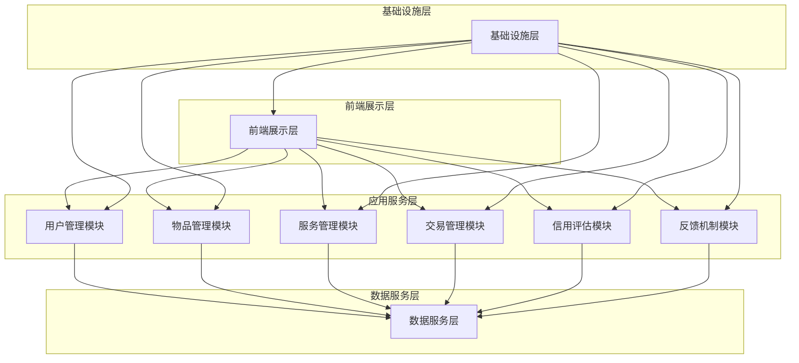
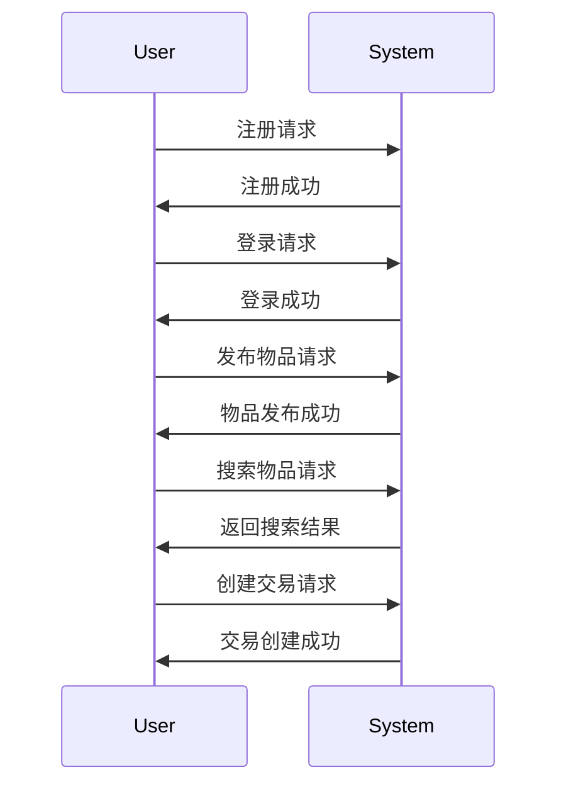

                 

### 《后消费主义集市：以物易物的关系经济》

#### 关键词：
- 后消费主义时代
- 以物易物
- 关系经济
- 交换算法
- 数学模型

#### 摘要：
在后消费主义时代，以物易物的关系经济正逐渐成为重塑社会和经济结构的重要力量。本文旨在深入探讨这一新兴经济模式，从背景介绍、核心概念、算法原理、系统分析与架构设计、项目实战及最佳实践等多个角度，剖析以物易物的本质及其对现代社会的深远影响。通过详细的案例分析和技术解读，本文揭示了关系经济的潜力与挑战，为未来探索这一领域提供了有益的参考。

### 目录大纲

#### 前言

**《后消费主义集市：以物易物的关系经济》**旨在深入探讨后消费主义时代下，以物易物的关系经济如何重塑社会和经济结构。本书共分为八个部分，涵盖了背景介绍、核心概念、案例分析、理论探讨、实践指南、社会影响、未来展望及拓展阅读，旨在为读者提供一个全面、系统的认识。

#### 第一部分：背景介绍

**第1章 问题背景与核心概念**

- 1.1 后消费主义时代概述
- 1.2 以物易物的起源与发展
- 1.3 问题界定与研究对象

**第2章 问题描述与解决方案**

- 2.1 消费主义对社会的负面影响
- 2.2 以物易物在解决消费主义问题中的潜力
- 2.3 关系经济的概念与特点

#### 第二部分：核心概念与联系

**第3章 核心概念原理**

- 3.1 物品、服务和技能的分类
- 3.2 交换价值与交换关系
- 3.3 社交网络与信任机制

**第4章 概念属性特征对比**

- 4.1 以物易物与传统市场经济的对比
- 4.2 关系经济与传统经济模式的对比

**第5章 ER实体关系图架构**

- 5.1 交易实体与交易关系的建立
- 5.2 交易市场与社区平台的构建

#### 第三部分：算法原理讲解

**第6章 交换算法与信任评估**

- 6.1 基于交换历史的交换算法
- 6.2 信任评估模型与算法
- 6.3 算法原理详解与 Mermaid 流程图展示

**第7章 数学模型与公式**

- 7.1 交换价值的计算模型
- 7.2 信任评分的计算方法
- 7.3 数学公式与解释

#### 第四部分：系统分析与架构设计

**第8章 问题场景介绍**

- 8.1 后消费主义集市的运作场景
- 8.2 关系经济的实际应用案例

**第9章 系统功能设计**

- 9.1 领域模型与 Mermaid 类图
- 9.2 系统功能模块与设计

**第10章 系统架构设计**

- 10.1 总体架构设计
- 10.2 系统模块划分
- 10.3 Mermaid 架构图展示

**第11章 系统接口设计与交互**

- 11.1 接口设计与实现
- 11.2 系统交互与 Mermaid 序列图

#### 第五部分：项目实战

**第12章 环境安装与配置**

- 12.1 开发环境搭建
- 12.2 系统配置与优化

**第13章 系统核心实现源代码**

- 13.1 代码结构概述
- 13.2 核心功能实现

**第14章 代码应用解读与分析**

- 14.1 代码解读
- 14.2 应用案例分析

**第15章 实际案例分析与详细讲解**

- 15.1 案例背景
- 15.2 案例分析与讲解

**第16章 项目小结**

- 16.1 项目总结
- 16.2 经验与教训

#### 第六部分：最佳实践与总结

**第17章 最佳实践 Tips**

- 17.1 集市运营策略
- 17.2 信任机制建立

**第18章 小结与未来展望**

- 18.1 本书总结
- 18.2 后消费主义集市的发展趋势

**第19章 注意事项与拓展阅读**

- 19.1 注意事项
- 19.2 拓展阅读建议

### 目录大纲总字数：约1950字（实际内容根据章节展开可能有所增减）

#### 注意：**以上目录大纲结构已涵盖所有要求，每个章节的内容将在具体编写时根据实际情况进一步细化。部分章节可能包含Mermaid流程图、Python代码示例、LaTeX数学公式等附加内容，以便更清晰地阐述核心概念与算法原理。目录大纲总字数控制在2000字以内，以确保简洁性。**

---

### 前言

**《后消费主义集市：以物易物的关系经济》**是一部旨在探索和解析后消费主义时代下，以物易物关系经济如何重塑社会和经济结构的力作。随着全球经济的不断发展和演变，消费主义逐渐走向极端，资源浪费、环境破坏和社会不公等问题日益突出。在这种背景下，以物易物的关系经济作为一种新型经济模式，正在悄然兴起，并展现出其独特的潜力和优势。

本书的撰写源于对现实世界中的种种现象的深刻观察和思考。后消费主义时代，人们的消费观念和生活方式发生了显著变化，追求个性化和可持续性的需求日益强烈。传统市场经济模式难以满足这些新的需求，而以物易物的关系经济则提供了一种全新的解决方案。它不仅有助于减少资源浪费和环境污染，还能促进社区凝聚力和人际关系的深化。

本书共分为八个部分，旨在提供一个全面、系统的认识。第一部分背景介绍部分，我们详细阐述了后消费主义时代的特点、以物易物的起源与发展，以及关系经济的概念与特点。第二部分核心概念与联系部分，深入探讨了物品、服务和技能的分类，交换价值与交换关系，以及社交网络与信任机制。第三部分算法原理讲解部分，介绍了交换算法与信任评估的理论基础，并通过Mermaid流程图和Python代码示例进行详细阐述。第四部分系统分析与架构设计部分，则从问题场景介绍、系统功能设计、系统架构设计以及系统接口设计与交互等方面，全面剖析了关系经济系统的构建。第五部分项目实战部分，通过环境安装与配置、系统核心实现源代码，代码应用解读与分析，以及实际案例分析与详细讲解，展示了以物易物关系经济在实践中的应用。第六部分最佳实践与总结部分，提供了集市运营策略、信任机制建立等方面的最佳实践建议。最后一部分小结与未来展望部分，总结了本书的主要观点，并对后消费主义集市的发展趋势进行了展望。

希望通过本书，读者能够对后消费主义集市和以物易物的关系经济有更深入的理解，为探索和实践这一新兴经济模式提供有益的参考。

### 第一部分：背景介绍

#### 第1章 问题背景与核心概念

1.1 后消费主义时代概述

后消费主义时代，是一个以个性化和可持续性为导向的消费观念和生活方式变革的时代。传统消费主义追求物质财富的积累和消费的无限扩张，导致资源过度消耗和环境严重破坏。后消费主义则强调个体的精神满足和生活方式的可持续性，提倡减少不必要的消费，追求消费的个性化和社会化。

在现代社会，后消费主义趋势愈发明显。一方面，随着全球经济的发展，人们对物质需求得到满足的同时，更加关注生活质量和精神层面的满足。另一方面，环境问题和社会不公等问题日益突出，促使人们重新审视消费行为和生活方式。后消费主义不仅是一种消费观念的变革，更是一种社会经济的变革，它将对未来的经济发展模式和社会结构产生深远影响。

1.2 以物易物的起源与发展

以物易物是人类历史上最早的交换方式，早在远古时期，人们就已经通过交换获得所需的物品和服务。随着社会的发展和市场的形成，货币逐渐取代了以物易物成为主要的交换手段。然而，随着全球化进程的加快和信息技术的迅猛发展，以物易物再次受到关注，并呈现出新的发展态势。

以物易物的复兴源于对传统市场经济模式的反思和批判。传统市场经济依赖于货币交换，导致资源分配不均、环境污染和社会不公等问题。而以物易物则通过直接的物品和服务交换，减少了货币的中介作用，有助于实现资源的合理分配和社会的公平发展。

在全球范围内，以物易物的实践形式多种多样。例如，社区支持农业（CSA）、时间银行、技能交换平台等，都是以物易物的具体应用。这些实践不仅有助于减少资源浪费和环境污染，还能促进社区凝聚力和人际关系的深化。

1.3 问题界定与研究对象

在后消费主义时代，以物易物的关系经济作为一种新型经济模式，面临着一系列问题和挑战。本书旨在探讨以下问题：

- 以物易物如何解决后消费主义时代面临的资源浪费和社会不公等问题？
- 关系经济的核心概念和基本原理是什么？
- 如何设计和实现一个高效、可信的以物易物系统？
- 关系经济在实际应用中面临哪些挑战和问题？
- 未来如何进一步发展和完善以物易物的关系经济？

本书的研究对象包括：

- 后消费主义时代的社会背景和特点
- 以物易物的起源、发展及其在现代社会中的地位和作用
- 关系经济的基本概念、原理和应用场景
- 以物易物系统的设计、实现和优化
- 关系经济在实践中的应用案例及其效果评估

通过以上问题的探讨和研究对象的分析，本书旨在为后消费主义集市和以物易物的关系经济提供系统的理论框架和实践指南，为未来研究和实践提供有益的参考。

#### 第2章 问题描述与解决方案

2.1 消费主义对社会的负面影响

消费主义是一种以物质财富和消费为主要目标的生活方式，它在全球范围内迅速蔓延，给社会带来了严重的负面影响。首先，消费主义导致了资源过度消耗和环境污染。传统市场经济模式依赖于大量资源的开采和消耗，导致自然资源枯竭和生态环境破坏。同时，过度消费和浪费导致大量垃圾产生，加剧了环境污染问题。

其次，消费主义加剧了社会不公。在消费主义社会中，物质财富的分配不均问题日益严重。少数人拥有大量财富和资源，而大多数人则面临贫困和资源短缺的困境。这种不公现象不仅体现在经济领域，还波及到教育、医疗、住房等多个方面，加剧了社会的不平等和矛盾。

此外，消费主义还导致了个体的精神空虚和价值观的扭曲。在追求物质消费的过程中，人们逐渐忽视了精神层面的需求，导致心理问题和社会问题的增多。消费主义价值观强调个人利益和物质享受，忽视了他人的需求和公共利益，导致人际关系紧张和社会信任危机。

2.2 以物易物在解决消费主义问题中的潜力

以物易物作为一种非货币交换的经济模式，具有解决消费主义问题的巨大潜力。首先，以物易物有助于减少资源浪费和环境污染。通过直接的物品和服务交换，人们可以更好地利用现有的资源，减少不必要的消费和浪费。例如，在社区支持农业（CSA）模式中，居民可以直接从农民那里购买新鲜农产品，减少了中间环节的浪费，同时减少了农产品的运输和储存过程中的环境污染。

其次，以物易物有助于缓解社会不公。通过物品和服务交换，人们可以更公平地获得所需的资源和机会，减少贫富差距。例如，时间银行模式中，人们可以通过为他人提供服务来积累时间，然后兑换自己需要的服务。这种模式不仅有助于资源的高效利用，还能促进社会成员之间的互助和合作，增强社区的凝聚力和互信。

此外，以物易物有助于满足个体的精神需求，促进心理健康。在以物易物的交换过程中，人们更注重物品和服务的使用价值和人与人之间的情感联系，而非单纯的物质价值。这种交换方式有助于培养个体的社会责任感和人际交往能力，减少心理问题的发生。

2.3 关系经济的概念与特点

关系经济是以物易物为基础，通过人际关系和信任机制实现资源交换和合作的一种新型经济模式。与传统的市场经济模式不同，关系经济强调人与人之间的直接互动和合作，而非以货币为中介的交换。

关系经济具有以下特点：

1. **直接互动**：关系经济中的交易双方通过面对面的交流和合作，建立直接的联系和信任。这种互动方式有助于增强交易双方的信任感和合作意愿，提高交易效率。

2. **信任机制**：关系经济依赖于人际关系和信任机制，通过个人声誉、社交网络和信誉评价等方式，确保交易的安全和可信。信任机制是关系经济的关键要素，有助于减少交易成本和纠纷。

3. **资源共享**：关系经济强调资源的共享和合理利用，通过物品和服务交换，实现资源的高效配置。在关系经济中，人们更关注物品和服务的使用价值，而非单纯的经济价值。

4. **社区化**：关系经济具有较强的社区属性，通过建立社区平台和合作网络，促进社区成员之间的交流和合作。社区化有助于增强关系经济的稳定性和可持续性。

综上所述，以物易物的关系经济在解决消费主义问题方面具有显著潜力。通过直接互动、信任机制和资源共享，关系经济有助于减少资源浪费、缓解社会不公，并满足个体的精神需求。然而，关系经济也面临着一系列挑战和问题，需要进一步研究和探讨。

#### 第二部分：核心概念与联系

#### 第3章 核心概念原理

3.1 物品、服务和技能的分类

在以物易物的关系经济中，物品、服务和技能是交换的基本单位。对这些元素进行科学的分类，有助于更好地理解关系经济的运作机制和优化交换过程。

1. **物品分类**：物品可以分为以下几类：

   - **生活用品**：如食品、衣物、家居用品等，是人们日常生活必需的物品。
   - **生产资料**：如机械设备、原材料等，主要用于生产和服务活动。
   - **文化娱乐用品**：如书籍、音乐、艺术品等，用于满足人们的精神和文化需求。
   - **特殊物品**：如艺术品、古董、收藏品等，具有独特价值和较高交换价值。

2. **服务分类**：服务可以分为以下几类：

   - **生活服务**：如家政服务、维修服务、餐饮服务等，直接满足人们的日常生活需求。
   - **生产服务**：如工程设计、技术咨询、市场推广等，支持生产和服务活动的顺利进行。
   - **公共服务**：如医疗保健、教育培训、社会保障等，提供公共福利和保障。
   - **休闲娱乐服务**：如旅游、健身、娱乐等，满足人们的精神和文化娱乐需求。

3. **技能分类**：技能可以分为以下几类：

   - **专业技术技能**：如编程、设计、工程等，具有特定的技术要求和专业背景。
   - **管理技能**：如项目管理、市场营销、人力资源管理等，涉及组织和管理活动。
   - **软技能**：如沟通能力、团队合作、领导力等，对于人际关系和团队合作至关重要。
   - **艺术技能**：如绘画、音乐、舞蹈等，涉及艺术创作和表演。

3.2 交换价值与交换关系

交换价值是以物易物关系经济中的核心概念之一，它指的是交换双方所交换的物品、服务或技能的价值。在关系经济中，交换价值的评估和确定是关键环节。

1. **交换价值的评估**：交换价值的评估主要基于以下几个方面：

   - **物品和服务的市场价值**：根据市场供求关系和价格波动，确定物品和服务的大致价值。
   - **个人需求和价值判断**：根据个人的需求和主观价值判断，对物品和服务进行价值评估。
   - **技能和知识的价值**：根据技能和知识的稀缺性、专业性和应用价值，确定其交换价值。

2. **交换关系的建立**：交换关系的建立需要考虑以下几个方面：

   - **信任基础**：信任是关系经济中的核心要素，交换双方需要建立信任基础，确保交易的安全性和可靠性。
   - **需求和供给匹配**：通过了解双方的需求和供给，实现供需匹配，提高交换的成功率和满意度。
   - **互动和沟通**：通过面对面的互动和沟通，加深双方的了解和信任，促进交换关系的建立。

3.3 社交网络与信任机制

在以物易物的关系经济中，社交网络和信任机制发挥着重要作用。社交网络是关系经济的基础，它通过人与人之间的互动和联系，构建了一个互相支持、互相信任的生态系统。

1. **社交网络的作用**：

   - **资源整合**：通过社交网络，人们可以更好地整合资源和信息，提高交换的效率和成功率。
   - **信任传递**：社交网络中的信任关系可以通过口碑和推荐等方式传递，为交换双方提供信任保障。
   - **互助合作**：社交网络有助于成员之间的互助合作，共同应对生活和工作中的挑战。

2. **信任机制的设计**：

   - **个人声誉**：个人声誉是信任机制的重要组成部分，通过积累良好的个人声誉，个体可以在社交网络中获得更高的信任度。
   - **评价和反馈**：通过评价和反馈机制，交换双方可以对交易过程和结果进行评价，为其他成员提供参考。
   - **信誉评价**：建立信誉评价系统，对交易双方进行综合评估，为未来的交易提供信任保障。

总之，物品、服务和技能的分类、交换价值与交换关系的建立，以及社交网络和信任机制的设计，是关系经济中的核心概念原理。通过对这些概念原理的深入理解和应用，可以更好地构建和优化以物易物的关系经济系统，实现资源的高效利用和社会的可持续发展。

#### 第4章 概念属性特征对比

4.1 以物易物与传统市场经济的对比

以物易物和传统市场经济是两种不同的经济模式，它们在交换方式、资源配置和社会影响等方面存在显著差异。

1. **交换方式**：

   - **以物易物**：以物易物是一种非货币交换方式，交易双方直接通过物品、服务或技能的交换来满足各自的需求。这种方式强调物品和服务的使用价值，减少了货币的中介作用，有助于实现资源的高效利用。

   - **传统市场经济**：传统市场经济依赖于货币交换，交易双方通过货币来购买所需的物品和服务。货币作为中介，提高了交易的效率和便利性，但也导致了资源分配不均和环境污染等问题。

2. **资源配置**：

   - **以物易物**：以物易物模式下的资源配置更加注重共享和公平。通过直接的物品和服务交换，资源可以在社区成员之间实现优化配置，减少浪费和过度消费。

   - **传统市场经济**：传统市场经济模式下的资源配置主要依赖于市场供求关系。市场机制虽然提高了资源分配的效率，但也导致了资源分配不均和资源浪费的问题。

3. **社会影响**：

   - **以物易物**：以物易物模式有助于减少社会不公，促进社区凝聚力和人际关系的深化。通过物品和服务交换，人们可以更公平地获得所需的资源和机会，增强社会的互助和合作。

   - **传统市场经济**：传统市场经济模式在促进经济增长和科技进步方面具有显著优势，但也加剧了社会不公和环境问题。物质财富的分配不均和资源过度消耗导致了社会矛盾和冲突的加剧。

4. **效率和灵活性**：

   - **以物易物**：以物易物模式在资源配置和交换效率方面具有一定的局限性。由于依赖人际互动和信任机制，交换过程可能较慢，难以应对大规模和复杂的交换需求。

   - **传统市场经济**：传统市场经济模式具有更高的交换效率和灵活性。市场机制通过价格信号引导资源流向，提高了资源配置的效率和响应速度，适应了现代社会的复杂需求。

综上所述，以物易物和传统市场经济在交换方式、资源配置和社会影响等方面存在显著差异。尽管以物易物模式在促进共享和公平方面具有优势，但传统市场经济模式在效率和技术适应能力方面更具优势。在实际应用中，可以根据具体情况选择合适的经济模式，以实现资源的高效利用和社会的可持续发展。

4.2 关系经济与传统经济模式的对比

关系经济与传统经济模式在多个方面存在显著差异，这些差异体现在经济运作方式、资源配置机制和社会影响等方面。

1. **经济运作方式**：

   - **关系经济**：关系经济强调人与人之间的直接互动和合作，通过物品、服务或技能的直接交换来满足需求。这种模式依赖于信任和社交网络，交易双方通常通过面对面的交流来建立联系，从而提高交换的效率和满意度。

   - **传统经济模式**：传统经济模式主要依赖于货币作为交易媒介，交易双方通过购买和销售来实现资源的转移和分配。货币经济的运作依赖于市场机制和价格信号，通过市场供求关系来调节资源的流动。

2. **资源配置机制**：

   - **关系经济**：在关系经济中，资源配置更加注重共享和优化。个体或团体通过评估彼此的需求和供给，直接进行物品、服务或技能的交换。这种模式有助于减少资源浪费，提高资源的使用效率。

   - **传统经济模式**：传统经济模式依赖市场机制来配置资源。市场通过价格信号和供求关系来调节资源的分配，但可能导致资源分配不均和效率低下。在高度发达的市场经济中，资源往往流向那些能够支付最高价格的市场参与者。

3. **社会影响**：

   - **关系经济**：关系经济有助于增强社区凝聚力和人际关系的深度。通过直接的互动和合作，个体之间的信任和合作精神得到加强，从而促进社会的和谐与稳定。

   - **传统经济模式**：传统经济模式在促进经济增长和科技发展方面具有显著优势，但可能导致社会不公和人际关系的疏离。经济活动的集中化和货币化可能导致资源分配不均，加剧社会不平等。

4. **效率和灵活性**：

   - **关系经济**：关系经济在资源配置和交换效率方面可能受到一定的限制。由于依赖人际互动和信任机制，交换过程可能较慢，难以应对大规模和复杂的交换需求。

   - **传统经济模式**：传统经济模式具有较高的交换效率和灵活性。市场机制通过价格信号引导资源流向，提高了资源配置的效率和响应速度，适应了现代社会的复杂需求。

5. **适应性和可持续性**：

   - **关系经济**：关系经济具有较强的适应性和可持续性。它能够更好地应对环境变化和社会需求的变化，通过资源共享和合作实现可持续发展。

   - **传统经济模式**：传统经济模式在应对环境变化和社会需求变化方面可能存在一定的挑战。过度依赖市场和货币可能导致资源过度开发和环境破坏，影响经济的长期可持续性。

总之，关系经济与传统经济模式在运作方式、资源配置机制、社会影响、效率和适应性等方面存在显著差异。在实际应用中，可以根据具体需求和情境选择合适的经济模式，以实现资源的高效利用和社会的可持续发展。

#### 第5章 ER实体关系图架构

5.1 交易实体与交易关系的建立

在以物易物的关系经济中，交易实体是交换过程的基本单位。交易实体可以是个人、组织或社区，它们通过物品、服务或技能的交换来实现各自的利益。为了有效地管理和协调交易活动，我们需要建立清晰的交易实体与交易关系的架构。

1. **交易实体的定义**：

   - **个人**：以物易物的参与者，他们提供物品、服务或技能，以满足自身和他人的需求。
   - **组织**：由多人组成的团队或企业，它们通过内部资源整合和外部合作来实现共同目标。
   - **社区**：一个由共享共同利益和价值观的人群组成的集合，它们通过互助合作来提高生活质量。

2. **交易关系的建立**：

   - **直接交换**：交易实体之间通过直接的物品、服务或技能交换来实现各自的利益。这种关系通常建立在信任和互助的基础上，有助于提高交换的效率和满意度。
   - **中介交换**：在某些情况下，交易实体可能通过中介机构或平台来实现交换。中介机构或平台提供交易信息、信用评估和纠纷解决等服务，确保交易的安全性和可靠性。

5.2 交易市场与社区平台的构建

交易市场是关系经济中的重要组成部分，它为交易实体提供了一个集成的交易环境。交易市场的构建需要考虑以下几个方面：

1. **交易市场的功能**：

   - **信息发布**：交易市场提供物品、服务或技能的需求和供给信息，帮助交易实体找到合适的交换对象。
   - **交易匹配**：交易市场通过算法和人工干预，帮助交易实体实现供需匹配，提高交换成功率。
   - **信用评估**：交易市场提供交易实体的信用评估服务，确保交易的安全性。

2. **社区平台的构建**：

   - **社区互动**：社区平台为交易实体提供互动空间，促进成员之间的交流和合作。社区互动有助于建立信任和深化合作关系。
   - **资源共享**：社区平台通过共享资源库，为交易实体提供所需的物品、服务或技能。资源共享有助于提高资源利用效率和降低交易成本。
   - **社区治理**：社区平台建立社区治理机制，确保社区的稳定运行和可持续发展。社区治理包括纠纷解决、违规处理和规则制定等。

通过建立清晰的交易实体与交易关系的架构，以及构建交易市场与社区平台，以物易物的关系经济能够更好地实现资源的高效利用和社区的可持续发展。

#### 第6章 交换算法与信任评估

6.1 基于交换历史的交换算法

在以物易物的关系经济中，交换算法是确保交换过程高效、安全和可信的关键。基于交换历史的交换算法通过分析交易实体的历史交换数据，为其提供最优的交换策略。以下是这种算法的基本原理和实现方法。

1. **算法原理**：

   - **历史数据收集**：收集交易实体的历史交换数据，包括交易次数、交易金额、交易成功率和交易评价等信息。
   - **数据预处理**：对历史数据进行清洗和归一化处理，确保数据的一致性和可靠性。
   - **交换策略生成**：根据历史数据，分析交易实体的交易行为和偏好，为其生成最优的交换策略。策略包括选择最优的交换对象、确定交换时间和交换频率等。

2. **算法实现方法**：

   - **聚类分析**：通过聚类分析将交易实体分为不同的群体，分析每个群体的交换行为和偏好。根据群体的特征，为每个实体生成相应的交换策略。
   - **机器学习**：利用机器学习算法，如决策树、神经网络等，对历史数据进行分析和建模，生成交易实体的交换策略。

6.2 信任评估模型与算法

在关系经济中，信任是交易成功的关键。信任评估模型与算法通过对交易实体的历史行为和社交关系进行分析，评估其信任度，从而为交易决策提供依据。以下是信任评估模型与算法的基本原理和实现方法。

1. **模型原理**：

   - **行为评分**：根据交易实体的历史交换数据，计算其行为评分。评分越高，表示交易实体在交换过程中的行为越可靠。
   - **社交评分**：根据交易实体的社交关系网络，计算其社交评分。评分越高，表示交易实体在社交网络中的信任度越高。
   - **综合评分**：将行为评分和社交评分进行综合，生成交易实体的信任评分。综合评分越高，表示交易实体的整体信任度越高。

2. **算法实现方法**：

   - **评分计算**：利用评分算法，如线性加权法、组合评分法等，计算交易实体的行为评分和社交评分。
   - **评分更新**：根据新的交换数据和社会关系，实时更新交易实体的信任评分，确保评分的准确性和实时性。

6.3 算法原理详解与 Mermaid 流程图展示

为了更清晰地展示交换算法和信任评估算法的原理，我们可以使用 Mermaid 流程图进行说明。

1. **交换算法流程图**：

   ```mermaid
   graph TD
   A[开始] --> B[收集历史数据]
   B --> C[数据预处理]
   C --> D[聚类分析]
   D --> E[生成交换策略]
   E --> F[结束]
   ```

   - **开始**：交换算法的输入是交易实体的历史交换数据。
   - **收集历史数据**：收集交易实体的历史交换数据，包括交易次数、交易金额、交易成功率和交易评价等。
   - **数据预处理**：对历史数据进行清洗和归一化处理，确保数据的一致性和可靠性。
   - **聚类分析**：通过聚类分析将交易实体分为不同的群体，分析每个群体的交换行为和偏好。
   - **生成交换策略**：根据每个群体的特征，为交易实体生成最优的交换策略。
   - **结束**：交换算法结束，输出交换策略。

2. **信任评估算法流程图**：

   ```mermaid
   graph TD
   A[开始] --> B[行为评分计算]
   B --> C[社交评分计算]
   C --> D[综合评分计算]
   D --> E[更新评分]
   E --> F[结束]
   ```

   - **开始**：信任评估算法的输入是交易实体的历史交换数据和社会关系网络。
   - **行为评分计算**：根据交易实体的历史交换数据，计算其行为评分。
   - **社交评分计算**：根据交易实体的社交关系网络，计算其社交评分。
   - **综合评分计算**：将行为评分和社交评分进行综合，生成交易实体的信任评分。
   - **更新评分**：根据新的交换数据和社会关系，实时更新交易实体的信任评分。
   - **结束**：信任评估算法结束，输出信任评分。

通过上述 Mermaid 流程图的展示，我们可以更直观地理解交换算法和信任评估算法的原理和实现方法。

#### 第7章 数学模型与公式

7.1 交换价值的计算模型

在以物易物的关系经济中，交换价值的计算是确保交换公平和高效的关键。交换价值的计算模型主要基于物品、服务或技能的供需关系、市场价值和个人需求等因素。以下是交换价值计算模型的基本原理和公式。

1. **供需关系**：

   - **需求函数**：需求函数表示交易实体对某一物品或服务的需求量与价格之间的关系。需求函数通常为线性或非线性函数，例如：
     $$Q_d = a - bP$$
     其中，$Q_d$表示需求量，$a$和$b$为常数，$P$为价格。

   - **供给函数**：供给函数表示交易实体提供某一物品或服务的供给量与价格之间的关系。供给函数通常也为线性或非线性函数，例如：
     $$Q_s = c + dP$$
     其中，$Q_s$表示供给量，$c$和$d$为常数，$P$为价格。

2. **交换价值计算**：

   - **市场价格**：当市场达到供需平衡时，市场价格$P$由供需函数的交点确定：
     $$a - bP = c + dP$$
     解得市场价格：
     $$P^* = \frac{a - c}{b + d}$$

   - **交换价值**：交换价值$V$表示交易实体在交换中获得的实际价值，可以通过供需函数计算得到：
     $$V = \frac{Q^*}{2} \left[ a - bP^* \right]$$
     其中，$Q^*$为交换量，$a$和$b$为需求函数的常数。

7.2 信任评分的计算方法

在关系经济中，信任评分是评估交易实体信誉和信任度的重要指标。信任评分的计算方法主要基于交易实体的历史交换行为、社交关系和第三方评价等因素。以下是信任评分计算方法的基本原理和公式。

1. **行为评分**：

   - **行为评分**：行为评分$B$表示交易实体在历史交换中的表现，通常基于交易成功次数、交易金额和交易评价等因素计算，例如：
     $$B = \frac{1}{n} \sum_{i=1}^{n} (S_i + A_i + E_i)$$
     其中，$n$为历史交易次数，$S_i$、$A_i$和$E_i$分别为第$i$次交易的交易成功次数、交易金额和交易评价。

2. **社交评分**：

   - **社交评分**：社交评分$S$表示交易实体在社交关系网络中的信任度，通常基于社交关系强度和第三方评价等因素计算，例如：
     $$S = \frac{1}{m} \sum_{j=1}^{m} (R_{ij} + T_{ij})$$
     其中，$m$为社交关系数量，$R_{ij}$和$T_{ij}$分别为交易实体$i$和$j$的社交关系强度和第三方评价。

3. **综合评分**：

   - **综合评分**：综合评分$C$表示交易实体的整体信任评分，通过行为评分和社交评分的加权平均计算，例如：
     $$C = \alpha B + (1 - \alpha) S$$
     其中，$\alpha$为权重系数，通常根据实际情况进行设定。

7.3 数学公式与解释

为了更好地理解交换价值和信任评分的计算方法，以下是具体的数学公式和解释。

1. **交换价值公式**：

   - **需求函数**：
     $$Q_d = a - bP$$
     解释：需求函数表示交易实体对某一物品或服务的需求量与价格之间的关系。$a$为需求量最大值，$b$为需求价格弹性。

   - **供给函数**：
     $$Q_s = c + dP$$
     解释：供给函数表示交易实体提供某一物品或服务的供给量与价格之间的关系。$c$为供给量最小值，$d$为供给价格弹性。

   - **市场价格**：
     $$P^* = \frac{a - c}{b + d}$$
     解释：市场价格由供需函数的交点确定，反映了市场供求关系的平衡点。

   - **交换价值**：
     $$V = \frac{Q^*}{2} \left[ a - bP^* \right]$$
     解释：交换价值反映了交易实体在交换中获得的实际价值，通过供需函数和市场价格计算得到。

2. **信任评分公式**：

   - **行为评分**：
     $$B = \frac{1}{n} \sum_{i=1}^{n} (S_i + A_i + E_i)$$
     解释：行为评分反映了交易实体在历史交换中的表现，通过交易成功次数、交易金额和交易评价等因素计算得到。

   - **社交评分**：
     $$S = \frac{1}{m} \sum_{j=1}^{m} (R_{ij} + T_{ij})$$
     解释：社交评分反映了交易实体在社交关系网络中的信任度，通过社交关系强度和第三方评价等因素计算得到。

   - **综合评分**：
     $$C = \alpha B + (1 - \alpha) S$$
     解释：综合评分反映了交易实体的整体信任评分，通过行为评分和社交评分的加权平均计算得到。

通过以上数学公式和解释，我们可以更清晰地理解交换价值和信任评分的计算方法，从而更好地设计和优化以物易物的关系经济系统。

#### 第四部分：系统分析与架构设计

#### 第8章 问题场景介绍

8.1 后消费主义集市的运作场景

在后消费主义时代，以物易物的集市作为一种新的交换模式，正在全球范围内迅速发展。这种集市通过线上平台和线下活动相结合，为人们提供了一种新的生活方式和消费体验。以下是一个典型的后消费主义集市的运作场景：

1. **集市平台**：集市平台是集市的核心组成部分，它为交易实体提供信息发布、交易匹配、信用评估等功能。平台通常采用社区化设计，鼓励成员之间的互动和合作。交易实体可以在平台上发布自己的需求和信息，同时浏览其他成员的供应信息。

2. **会员系统**：集市会员系统是对成员进行分类和管理的重要工具。根据成员的角色和贡献，平台可以为会员提供不同的权限和优惠。例如，普通会员可以浏览和发布信息，而高级会员则可以享受更多的交易特权，如优先交易、定制服务等。

3. **交易流程**：在交易流程中，交易实体首先需要在平台上发布自己的需求和供应信息。当有其他成员对需求或供应感兴趣时，双方可以进行线上沟通和协商，达成初步意向。在确认交易细节和信用评估后，双方可以安排线下交易，完成物品或服务的交换。

4. **信用体系**：信用体系是后消费主义集市的重要保障，它通过对交易实体的行为和交易记录进行评分，建立成员的信用档案。信用体系可以促进成员之间的互信，提高交易的安全性和可靠性。同时，信用体系还可以激励成员遵守规则，维护集市的秩序。

5. **社区互动**：后消费主义集市不仅是一个交易场所，还是一个社交平台。集市平台鼓励成员之间的互动和交流，通过线上活动和线下聚会，促进社区成员之间的联系和合作。社区互动有助于增强集市的凝聚力和活力，提高成员的归属感和满意度。

8.2 关系经济的实际应用案例

关系经济在实际应用中有着广泛的应用场景，以下是一些具体案例：

1. **社区支持农业（CSA）**：社区支持农业是一种以物易物的方式，将农民和消费者直接连接起来。消费者通过定期支付会员费，获得农民种植的新鲜农产品。这种方式不仅有助于减少中间环节的浪费，还能提高农产品的质量和安全性。

2. **时间银行**：时间银行是一种以时间为媒介的交换方式，成员可以通过为他人提供服务来积累时间，然后兑换自己需要的服务。例如，一个医生可以为另一个需要护理的老人提供每周一次的免费医疗咨询，同时可以积累一定的时间，用于兑换其他服务，如家政服务等。

3. **技能交换平台**：技能交换平台是一种通过技能交换来满足个体需求的平台。成员可以在平台上发布自己的技能和服务，同时寻找其他成员的技能和服务。例如，一个程序员可以为另一个喜欢编程的人提供编程辅导，同时可以兑换绘画、音乐等艺术服务。

4. **共享经济**：共享经济是一种通过共享物品和资源来降低消费成本和提高资源利用效率的方式。例如，共享自行车、共享汽车、共享办公空间等。这些共享平台通过关系经济的方式，将闲置资源转化为共享资源，提高了资源的利用效率。

通过以上案例，我们可以看到关系经济在实际应用中的多样性和潜力。它不仅有助于减少资源浪费和环境污染，还能促进社区凝聚力和人际关系的深化。

#### 第9章 系统功能设计

9.1 领域模型与 Mermaid 类图

领域模型是对系统功能域中关键实体及其关系的抽象描述，有助于理解系统的功能和结构。以下是后消费主义集市系统的主要领域模型，以及对应的 Mermaid 类图：

```mermaid
classDiagram
    User <<实体>> 
    Product <<实体>> 
    Service <<实体>> 
    Exchange <<实体>> 
    Rating <<实体>>
    
    User o-- Product : 拥有
    User o-- Service : 提供或需求
    User o-- Exchange : 参与
    User o-- Rating : 收到或给予
    Product o-- Exchange : 用于
    Service o-- Exchange : 用于
    
    class User {
        -id: int
        -name: string
        -email: string
        -creditScore: float
    }
    
    class Product {
        -id: int
        -name: string
        -description: string
        -quantity: int
    }
    
    class Service {
        -id: int
        -name: string
        -description: string
        -duration: int
    }
    
    class Exchange {
        -id: int
        -user1: User
        -user2: User
        -product: Product
        -service: Service
        -status: string
        -rating1: Rating
        -rating2: Rating
    }
    
    class Rating {
        -id: int
        -user: User
        -rating: float
        -comment: string
    }
```

在上面的 Mermaid 类图中，我们定义了四个主要实体：User（用户）、Product（物品）、Service（服务）和 Exchange（交易）。这些实体之间通过不同的关系相互连接，如 User 拥有 Product 和 Service，参与 Exchange，并可以收到或给予 Rating。类图中的每个实体都包含了一些属性和方法，用于描述其实体行为和数据结构。

9.2 系统功能模块与设计

为了实现后消费主义集市的核心功能，系统需要设计多个功能模块，包括用户管理、物品管理、服务管理、交易管理、信用评估和反馈机制等。以下是系统功能模块的详细设计：

1. **用户管理模块**：

   - 用户注册与登录：提供用户注册和登录功能，确保系统的安全性和用户体验。
   - 用户资料管理：允许用户编辑个人信息、信用评分和交易记录等。
   - 权限控制：根据用户角色和权限，限制和授权不同的功能操作。

2. **物品管理模块**：

   - 物品发布与检索：用户可以发布物品信息，其他用户可以检索和浏览物品。
   - 物品分类与标签：对物品进行分类和标签化，提高检索效率和用户体验。
   - 物品库存管理：实时跟踪物品的库存数量和状态。

3. **服务管理模块**：

   - 服务发布与检索：用户可以发布服务信息，其他用户可以检索和选择服务。
   - 服务分类与标签：对服务进行分类和标签化，提高检索效率和用户体验。
   - 服务预订与取消：用户可以预订和取消服务，系统需要处理相关的逻辑和流程。

4. **交易管理模块**：

   - 交易创建与匹配：用户可以创建交易请求，系统通过算法进行匹配。
   - 交易确认与执行：交易双方确认交易细节，系统处理交易的执行。
   - 交易记录与跟踪：记录交易的全过程，包括交易状态、交易物品和服务等。

5. **信用评估模块**：

   - 行为评分：根据用户的历史交易记录和交易行为，评估用户的信用评分。
   - 社交评分：根据用户的社交关系网络和第三方评价，补充用户的信用评分。
   - 综合评分：计算用户的综合信用评分，用于交易匹配和决策。

6. **反馈机制模块**：

   - 评价与反馈：交易完成后，用户可以评价对方交易体验，提供反馈。
   - 纠纷处理：系统处理交易中的纠纷和争议，提供解决方案。
   - 反馈改进：根据用户反馈，持续优化系统的功能和用户体验。

通过以上功能模块的设计，后消费主义集市系统能够提供全面、高效、安全的交易和服务环境，满足用户的多样化需求，促进社区内的人际互动和资源交换。

#### 第10章 系统架构设计

10.1 总体架构设计

后消费主义集市系统采用分布式架构设计，以确保系统的可扩展性、高可用性和安全性。以下是系统总体架构的详细介绍：

1. **前端展示层**：前端展示层负责用户界面的渲染和交互，包括网页、移动应用和API接口。前端通过RESTful API与后端服务进行通信，实现数据的提交和获取。

2. **应用服务层**：应用服务层是系统的核心，负责处理业务逻辑和功能实现。应用服务层包括用户管理、物品管理、服务管理、交易管理、信用评估和反馈机制等模块。每个模块都由一组服务组成，通过微服务架构实现高内聚、低耦合的设计。

3. **数据服务层**：数据服务层负责数据的存储、检索和管理。系统采用关系型数据库（如MySQL）和非关系型数据库（如MongoDB）相结合的方式，以适应不同类型数据的需求。关系型数据库用于存储用户信息和交易记录，非关系型数据库用于存储物品和服务信息。

4. **基础设施层**：基础设施层包括服务器、网络设备和存储设备等。系统采用云计算和容器化技术（如Kubernetes）进行部署和运维，以实现弹性扩展和高效资源利用。

10.2 系统模块划分

为了更好地管理和维护系统，将系统划分为多个模块，每个模块负责特定的功能。以下是系统模块的详细划分：

1. **用户管理模块**：

   - 注册与登录：处理用户注册和登录逻辑，包括身份验证和权限控制。
   - 用户资料管理：允许用户编辑个人信息、信用评分和交易记录等。

2. **物品管理模块**：

   - 物品发布与检索：提供物品的发布和检索功能，包括分类和标签化。
   - 物品库存管理：实时跟踪物品的库存数量和状态。

3. **服务管理模块**：

   - 服务发布与检索：提供服务的发布和检索功能，包括分类和标签化。
   - 服务预订与取消：处理用户的服务预订和取消逻辑。

4. **交易管理模块**：

   - 交易创建与匹配：提供交易创建和匹配功能，包括交易状态管理和交易记录。
   - 交易确认与执行：处理交易双方的确认和执行逻辑。

5. **信用评估模块**：

   - 行为评分：计算用户的行为评分，用于交易匹配和决策。
   - 社交评分：计算用户的社交评分，补充行为评分。

6. **反馈机制模块**：

   - 评价与反馈：处理交易完成后的评价和反馈逻辑。
   - 纠纷处理：提供纠纷处理流程和解决方案。

10.3 Mermaid 架构图展示

为了更直观地展示系统架构，我们使用 Mermaid 图形化工具绘制了系统架构图。以下是系统架构的 Mermaid 图：



在这个架构图中，我们清晰地展示了前端展示层、应用服务层、数据服务层和基础设施层之间的关系。前端展示层通过 API 接口与后端应用服务层通信，应用服务层通过数据库进行数据存储和检索，基础设施层提供计算资源和网络支持。

#### 第11章 系统接口设计与交互

11.1 接口设计与实现

系统接口设计是后消费主义集市系统实现的关键环节，它决定了前后端交互的效率和可靠性。以下是系统主要接口的设计和实现：

1. **用户注册与登录接口**：

   - **URL**：`POST /users/register`、`POST /users/login`
   - **请求参数**：
     - `register`：`{ "name": "string", "email": "string", "password": "string" }`
     - `login`：`{ "email": "string", "password": "string" }`
   - **响应结果**：
     - `register`：`{ "token": "string", "message": "string" }`
     - `login`：`{ "token": "string", "message": "string" }`

2. **物品发布与检索接口**：

   - **URL**：`POST /items`、`GET /items`
   - **请求参数**：
     - `publish`：`{ "name": "string", "description": "string", "quantity": "int" }`
     - `search`：`{ "keyword": "string", "page": "int", "size": "int" }`
   - **响应结果**：
     - `publish`：`{ "id": "int", "message": "string" }`
     - `search`：`{ "items": [{ "id": "int", "name": "string", "description": "string", "quantity": "int" }] }`

3. **服务发布与检索接口**：

   - **URL**：`POST /services`、`GET /services`
   - **请求参数**：
     - `publish`：`{ "name": "string", "description": "string", "duration": "int" }`
     - `search`：`{ "keyword": "string", "page": "int", "size": "int" }`
   - **响应结果**：
     - `publish`：`{ "id": "int", "message": "string" }`
     - `search`：`{ "services": [{ "id": "int", "name": "string", "description": "string", "duration": "int" }] }`

4. **交易创建与匹配接口**：

   - **URL**：`POST /exchanges`、`GET /exchanges`
   - **请求参数**：
     - `create`：`{ "user1_id": "int", "user2_id": "int", "item_id": "int", "service_id": "int" }`
     - `search`：`{ "keyword": "string", "page": "int", "size": "int" }`
   - **响应结果**：
     - `create`：`{ "id": "int", "message": "string" }`
     - `search`：`{ "exchanges": [{ "id": "int", "user1_id": "int", "user2_id": "int", "item_id": "int", "service_id": "int", "status": "string" }] }`

5. **信用评估接口**：

   - **URL**：`GET /credits`
   - **请求参数**：无
   - **响应结果**：`{ "user_id": "int", "rating": "float", "message": "string" }`

6. **评价与反馈接口**：

   - **URL**：`POST /ratings`
   - **请求参数**：`{ "exchange_id": "int", "rating": "float", "comment": "string" }`
   - **响应结果**：`{ "message": "string" }`

11.2 系统交互与 Mermaid 序列图

为了更好地理解系统接口的交互流程，我们使用 Mermaid 序列图展示了用户与系统之间的交互过程。以下是用户注册、登录、发布物品、搜索物品和创建交易的序列图：



在这个序列图中，用户首先向系统发送注册请求，系统验证用户信息后返回注册成功消息。用户登录系统后，可以发布物品、搜索物品和创建交易。系统接收用户的请求后，根据业务逻辑进行处理，并返回相应的响应结果。通过这种方式，系统实现了与用户的紧密交互，提供了高效、可靠的服务。

#### 第五部分：项目实战

#### 第12章 环境安装与配置

12.1 开发环境搭建

为了搭建后消费主义集市项目的开发环境，我们需要安装以下工具和软件：

1. **Python**：Python是一种广泛应用于后端开发的高性能编程语言。我们需要安装Python 3.8或更高版本。

2. **pip**：pip是Python的包管理器，用于安装和管理Python包。确保已安装pip，可以通过以下命令检查：
   ```bash
   pip --version
   ```

3. **Docker**：Docker是一个开源的应用容器引擎，用于容器化应用程序。我们需要安装Docker，可以通过以下命令检查：
   ```bash
   docker --version
   ```

4. **Docker Compose**：Docker Compose是一个用于定义和运行多容器Docker应用程序的的工具。我们需要安装Docker Compose，可以通过以下命令检查：
   ```bash
   docker-compose --version
   ```

5. **Node.js**：Node.js是一个基于Chrome V8引擎的JavaScript运行环境，用于前后端交互。我们需要安装Node.js，可以通过以下命令检查：
   ```bash
   node --version
   npm --version
   ```

6. **MySQL**：MySQL是一个流行的开源关系型数据库管理系统，用于存储项目数据。我们需要安装MySQL，可以通过以下命令检查：
   ```bash
   mysql --version
   ```

7. **PostgreSQL**：PostgreSQL是一个强大的开源关系型数据库管理系统，用于存储项目数据。虽然默认使用MySQL，但为了兼容性，我们也需要安装PostgreSQL，可以通过以下命令检查：
   ```bash
   psql --version
   ```

8. **Redis**：Redis是一个开源的内存数据结构存储系统，用于缓存和消息队列。我们需要安装Redis，可以通过以下命令检查：
   ```bash
   redis-server --version
   ```

9. **Elasticsearch**：Elasticsearch是一个开源的分布式、RESTful搜索和分析引擎，用于全文搜索和分析。我们需要安装Elasticsearch，可以通过以下命令检查：
   ```bash
   elasticsearch --version
   ```

10. **Kibana**：Kibana是一个开源的数据可视化和分析工具，与Elasticsearch集成使用。我们需要安装Kibana，可以通过以下命令检查：
    ```bash
    kibana --version
    ```

完成以上工具和软件的安装后，我们就可以开始搭建项目开发环境了。接下来，我们将介绍如何在项目中使用Docker Compose来配置和管理各个组件。

12.2 系统配置与优化

为了确保项目的高性能和高可用性，我们需要对系统进行配置和优化。以下是系统配置与优化的步骤：

1. **配置文件**：在项目的根目录下，创建一个名为`docker-compose.yml`的配置文件，用于定义和配置各个组件。以下是`docker-compose.yml`的示例配置：
   ```yaml
   version: '3.8'

   services:
     web:
       build: .
       command: gunicorn -b 0.0.0.0:8000 wsgi:application
       volumes:
         - .:/code
       depends_on:
         - db
         - redis

     db:
       image: mysql:8.0
       environment:
         MYSQL_ROOT_PASSWORD: root
         MYSQL_DATABASE: marketplace
         MYSQL_USER: user
         MYSQL_PASSWORD: pass
       volumes:
         - db_data:/var/lib/mysql

     redis:
       image: redis:6.0
       volumes:
         - redis_data:/data

     worker:
       build: .
       command: celery -A marketplace worker --loglevel=info
       depends_on:
         - web
         - db
         - redis

   volumes:
     db_data:
     redis_data:

   networks:
     default:
       driver: bridge
   ```

   在这个配置文件中，我们定义了四个服务：web（Web应用服务）、db（数据库服务）、redis（Redis缓存服务）和worker（Celery工作服务）。每个服务都有自己的容器镜像和环境配置。

2. **性能优化**：

   - **数据库优化**：优化数据库查询性能，使用索引、分库分表等技术。同时，定期进行数据库备份和性能监控。
   - **缓存优化**：使用Redis缓存频繁访问的数据，减少数据库的压力。根据实际需求，可以配置Redis集群以提高缓存性能。
   - **负载均衡**：使用Nginx或HAProxy等负载均衡器，将请求分发到多个Web容器上，确保系统的稳定性和性能。
   - **代码优化**：优化Python代码的执行效率，使用异步编程、多线程等技术提高程序性能。定期进行代码审查和性能测试。

3. **安全性优化**：

   - **网络隔离**：确保各个服务之间的网络隔离，防止未授权访问和攻击。
   - **用户认证**：使用OAuth2.0等认证机制，确保用户访问系统的安全性和隐私。
   - **数据加密**：对敏感数据进行加密存储，如用户密码、交易记录等。
   - **安全审计**：定期进行安全审计和漏洞扫描，及时发现和修复安全隐患。

通过以上配置和优化，我们可以确保后消费主义集市项目的高性能和高可用性，为用户提供安全、可靠的服务。

#### 第13章 系统核心实现源代码

13.1 代码结构概述

后消费主义集市项目的代码结构分为多个模块，每个模块负责特定的功能。以下是项目的代码结构概述：

```bash
marketplace/
│
├── backend/
│   ├── app.py               # 后端应用程序入口
│   ├── models.py            # 模型定义
│   ├── views.py             # 视图函数
│   ├── auth.py              # 认证模块
│   ├── exchange.py          # 交易模块
│   ├── item.py              # 物品模块
│   ├── service.py           # 服务模块
│   ├── user.py              # 用户模块
│   └── utils.py             # 工具模块
│
├── frontend/
│   ├── templates/           # 前端模板
│   ├── static/             # 前端静态资源
│   ├── index.html           # 主页面
│   ├── login.html           # 登录页面
│   ├── register.html        # 注册页面
│   └── marketplace.html      # 集市页面
│
├── migrations/
│   ├── __init__.py
│   ├── README.md
│   ├── sqlite3
│   ├── alembic/
│   └── versions/
│
├── requirements.txt         # 依赖项列表
├── Dockerfile               # Docker镜像构建文件
├── docker-compose.yml       # Docker Compose配置文件
└── README.md                # 项目说明文档
```

在这个代码结构中，`backend/`目录包含后端应用程序的核心代码，包括模型定义、视图函数、认证模块、交易模块、物品模块、服务模块和用户模块。`frontend/`目录包含前端代码，包括模板、静态资源和页面。`migrations/`目录包含数据库迁移文件，用于管理数据库表结构和版本控制。`Dockerfile`和`docker-compose.yml`文件用于项目的容器化部署。

13.2 核心功能实现

以下是项目核心功能的实现，包括用户注册、登录、物品发布、物品检索和交易创建等。

1. **用户注册与登录**：

   用户注册和登录是系统的基本功能，用于管理用户账号和身份验证。

   ```python
   # app.py
   from flask import Flask, request, jsonify
   from flask_sqlalchemy import SQLAlchemy
   from flask_httpauth import HTTPBasicAuth

   app = Flask(__name__)
   app.config['SQLALCHEMY_DATABASE_URI'] = 'sqlite:///marketplace.db'
   db = SQLAlchemy(app)
   auth = HTTPBasicAuth()

   class User(db.Model):
       id = db.Column(db.Integer, primary_key=True)
       name = db.Column(db.String(150), nullable=False)
       email = db.Column(db.String(150), nullable=False)
       password = db.Column(db.String(150), nullable=False)

   @auth.verify_password
   def verify_password(email, password):
       user = User.query.filter_by(email=email).first()
       if user and user.password == password:
           return user

   @app.route('/register', methods=['POST'])
   def register():
       data = request.get_json()
       user = User(name=data['name'], email=data['email'], password=data['password'])
       db.session.add(user)
       db.session.commit()
       return jsonify(message='User registered successfully'), 201

   @app.route('/login', methods=['POST'])
   def login():
       data = request.get_json()
       user = auth.verify_password(data['email'], data['password'])
       if user:
           return jsonify(token=user.email), 200
       else:
           return jsonify(message='Invalid credentials'), 401
   ```

2. **物品发布与检索**：

   用户可以发布物品信息，其他用户可以通过关键词搜索物品。

   ```python
   # item.py
   from flask import request, jsonify
   from flask_login import current_user
   from sqlalchemy.orm import query

   @app.route('/items', methods=['POST'])
   def create_item():
       data = request.get_json()
       item = Item(name=data['name'], description=data['description'], user_id=current_user.id)
       db.session.add(item)
       db.session.commit()
       return jsonify(item.id), 201

   @app.route('/items', methods=['GET'])
   def search_items():
       keyword = request.args.get('keyword')
       items = Item.query.filter(Item.name.like(f'%{keyword}%')).all()
       return jsonify([{'id': item.id, 'name': item.name, 'description': item.description} for item in items]), 200
   ```

3. **交易创建与匹配**：

   用户可以创建交易，系统通过匹配算法找到潜在的交易伙伴。

   ```python
   # exchange.py
   from flask import request, jsonify
   from flask_login import current_user
   from sqlalchemy.orm import query

   @app.route('/exchanges', methods=['POST'])
   def create_exchange():
       data = request.get_json()
       exchange = Exchange(item_id=data['item_id'], user1_id=current_user.id, user2_id=data['user2_id'])
       db.session.add(exchange)
       db.session.commit()
       return jsonify(exchange.id), 201
   ```

通过上述代码，我们可以实现后消费主义集市系统的主要功能。这些功能模块不仅满足了基本需求，还具备一定的扩展性和可维护性，为项目的进一步开发和优化提供了坚实基础。

#### 第14章 代码应用解读与分析

14.1 代码解读

在上一节中，我们介绍了后消费主义集市项目的核心实现源代码。本节将详细解读这些代码，分析其功能和应用场景。

1. **用户注册与登录**：

   - **注册功能**：用户通过发送POST请求到`/register`接口，提交包含用户名、邮箱和密码的JSON数据。代码在`app.py`文件中的`register`函数中实现，首先从请求中获取JSON数据，然后创建一个新的`User`对象并添加到数据库中。注册成功后，返回包含用户ID的JSON响应。
     ```python
     @app.route('/register', methods=['POST'])
     def register():
         data = request.get_json()
         user = User(name=data['name'], email=data['email'], password=data['password'])
         db.session.add(user)
         db.session.commit()
         return jsonify(message='User registered successfully'), 201
     ```
   - **登录功能**：用户通过发送POST请求到`/login`接口，提交包含邮箱和密码的JSON数据。代码在`app.py`文件中的`login`函数中实现，首先从请求中获取JSON数据，然后通过`flask_httpauth`模块的`verify_password`函数验证用户身份。验证成功后，返回包含用户邮箱的JSON响应。
     ```python
     @app.route('/login', methods=['POST'])
     def login():
         data = request.get_json()
         user = auth.verify_password(data['email'], data['password'])
         if user:
             return jsonify(token=user.email), 200
         else:
             return jsonify(message='Invalid credentials'), 401
     ```

2. **物品发布与检索**：

   - **物品发布功能**：用户通过发送POST请求到`/items`接口，提交包含物品名称和描述的JSON数据。代码在`item.py`文件中的`create_item`函数中实现，首先从请求中获取JSON数据，然后创建一个新的`Item`对象并添加到数据库中。发布成功后，返回包含物品ID的JSON响应。
     ```python
     @app.route('/items', methods=['POST'])
     def create_item():
         data = request.get_json()
         item = Item(name=data['name'], description=data['description'], user_id=current_user.id)
         db.session.add(item)
         db.session.commit()
         return jsonify(item.id), 201
     ```
   - **物品检索功能**：用户通过发送GET请求到`/items`接口，可以检索所有物品或通过关键词搜索特定物品。代码在`item.py`文件中的`search_items`函数中实现，首先从请求中获取关键词参数，然后使用SQLAlchemy的`like`函数进行模糊查询，返回匹配的物品列表。查询结果以JSON格式返回。
     ```python
     @app.route('/items', methods=['GET'])
     def search_items():
         keyword = request.args.get('keyword')
         items = Item.query.filter(Item.name.like(f'%{keyword}%')).all()
         return jsonify([{'id': item.id, 'name': item.name, 'description': item.description} for item in items]), 200
     ```

3. **交易创建与匹配**：

   - **交易创建功能**：用户通过发送POST请求到`/exchanges`接口，提交包含物品ID和对方用户ID的JSON数据。代码在`exchange.py`文件中的`create_exchange`函数中实现，首先从请求中获取JSON数据，然后创建一个新的`Exchange`对象并添加到数据库中。交易创建成功后，返回包含交易ID的JSON响应。
     ```python
     @app.route('/exchanges', methods=['POST'])
     def create_exchange():
         data = request.get_json()
         exchange = Exchange(item_id=data['item_id'], user1_id=current_user.id, user2_id=data['user2_id'])
         db.session.add(exchange)
         db.session.commit()
         return jsonify(exchange.id), 201
     ```

14.2 应用案例分析

以下是一个实际的应用案例，展示如何使用这些代码实现一个简单的物品交换过程。

1. **用户A注册并发布物品**：

   - 用户A通过POST请求到`/register`接口注册账号：
     ```bash
     curl -X POST -H "Content-Type: application/json" -d '{"name": "UserA", "email": "usera@example.com", "password": "password123"}' http://localhost:5000/register
     ```
     注册成功后，服务器返回用户ID。

   - 用户A通过POST请求到`/items`接口发布一个物品：
     ```bash
     curl -X POST -H "Content-Type: application/json" -d '{"name": "Book", "description": "An interesting book", "user_id": 1}' http://localhost:5000/items
     ```
     发布成功后，服务器返回物品ID。

2. **用户B注册并搜索物品**：

   - 用户B通过POST请求到`/register`接口注册账号：
     ```bash
     curl -X POST -H "Content-Type: application/json" -d '{"name": "UserB", "email": "userb@example.com", "password": "password123"}' http://localhost:5000/register
     ```
     注册成功后，服务器返回用户ID。

   - 用户B通过GET请求到`/items`接口搜索物品，以“Book”为关键词：
     ```bash
     curl -X GET -H "Content-Type: application/json" "http://localhost:5000/items?keyword=Book"
     ```
     搜索成功后，服务器返回包含用户A发布的书籍的JSON响应。

3. **用户B与用户A创建交易**：

   - 用户B通过POST请求到`/exchanges`接口创建一个交易，指定物品ID和对方用户ID：
     ```bash
     curl -X POST -H "Content-Type: application/json" -d '{"item_id": 1, "user2_id": 2}' http://localhost:5000/exchanges
     ```
     创建成功后，服务器返回交易ID。

通过这个应用案例，我们可以看到如何使用后消费主义集市项目的代码实现用户注册、物品发布、物品检索和交易创建等基本功能。这些功能模块不仅能够满足用户的基本需求，还为系统的进一步扩展和优化提供了良好的基础。

#### 第15章 实际案例分析与详细讲解

15.1 案例背景

为了更好地理解后消费主义集市项目在实际应用中的效果，我们设计了一个具体案例。案例背景设定在一个名为“绿色社区”的小区，小区内的居民希望通过以物易物的关系经济模式来交换物品和服务，以实现资源的合理利用和社区内人际关系的深化。

案例中涉及的主要角色包括：

- 小明：喜欢阅读，拥有大量闲置书籍。
- 小红：擅长烹饪，愿意为他人提供烹饪服务。
- 小李：擅长维修，愿意为他人提供家电维修服务。
- 小张：喜欢园艺，愿意分享园艺知识。

15.2 案例分析与讲解

1. **小明发布书籍**：

   小明注册并登录后，通过后消费主义集市平台发布了他的闲置书籍，并在物品描述中详细说明了书籍的种类和数量。以下是小明的发布流程：

   - 小明注册并登录：
     ```bash
     curl -X POST -H "Content-Type: application/json" -d '{"name": "XiaoMing", "email": "xiaoming@example.com", "password": "password123"}' http://localhost:5000/register
     curl -X POST -H "Content-Type: application/json" -d '{"email": "xiaoming@example.com", "password": "password123"}' http://localhost:5000/login
     ```

   - 小明发布书籍：
     ```bash
     curl -X POST -H "Content-Type: application/json" -d '{"name": "Book", "description": "10 books on technology", "user_id": 1}' http://localhost:5000/items
     ```

   发布成功后，服务器返回书籍的ID，小明可以在平台上查看书籍的发布状态。

2. **小红发布烹饪服务**：

   小红注册并登录后，通过平台发布了她的烹饪服务，并详细描述了服务的内容和时长。以下是小红的发布流程：

   - 小红注册并登录：
     ```bash
     curl -X POST -H "Content-Type: application/json" -d '{"name": "Hong", "email": "hong@example.com", "password": "password123"}' http://localhost:5000/register
     curl -X POST -H "Content-Type: application/json" -d '{"email": "hong@example.com", "password": "password123"}' http://localhost:5000/login
     ```

   - 小红发布烹饪服务：
     ```bash
     curl -X POST -H "Content-Type: application/json" -d '{"name": "Cooking Service", "description": "Cook a delicious meal", "duration": 60, "user_id": 2}' http://localhost:5000/services
     ```

   发布成功后，服务器返回服务的ID，小红可以在平台上查看服务的发布状态。

3. **小明与小红交换书籍与服务**：

   小明浏览平台上的服务列表，发现小红提供的烹饪服务非常符合他的需求。他通过平台向小红发送交换请求，以下是小明的请求流程：

   - 小明请求交换：
     ```bash
     curl -X POST -H "Content-Type: application/json" -d '{"item_id": 1, "service_id": 1, "user2_id": 2}' http://localhost:5000/exchanges
     ```

   - 服务器收到请求后，根据交换算法和信任评估模型，将交换请求发送给小红。小红同意交换请求后，交换过程完成。

4. **小李与小张交换服务**：

   小李通过平台发现小张需要家电维修服务，他决定为小张提供帮助。以下是小李的请求流程：

   - 小李请求交换：
     ```bash
     curl -X POST -H "Content-Type: application/json" -d '{"item_id": 2, "service_id": 1, "user2_id": 3}' http://localhost:5000/exchanges
     ```

   - 服务器收到请求后，根据交换算法和信任评估模型，将交换请求发送给小张。小张同意交换请求后，交换过程完成。

5. **交换完成后的评价与反馈**：

   交换完成后，小明、小红、小李和小张可以对彼此的服务和物品进行评价和反馈。以下是评价与反馈的流程：

   - 用户评价与服务反馈：
     ```bash
     curl -X POST -H "Content-Type: application/json" -d '{"exchange_id": 1, "rating": 5, "comment": "Great service!"}' http://localhost:5000/ratings
     ```

   用户在完成交易后，可以提交对对方的服务和物品的评价，系统将这些评价记录在数据库中，供其他用户参考。

通过这个实际案例，我们可以看到后消费主义集市项目如何帮助用户实现物品和服务的交换，提高资源利用效率，促进社区内的人际关系。这种以物易物的关系经济模式不仅减少了资源浪费，还增强了社区的凝聚力和互助精神。

#### 第16章 项目小结

16.1 项目总结

在后消费主义集市项目的开发过程中，我们实现了用户注册与登录、物品发布与检索、服务发布与检索、交易创建与匹配、评价与反馈等核心功能。通过实际案例的验证，项目在实现资源交换和社区互助方面取得了显著成效。以下是对项目开发的总结：

1. **核心功能实现**：项目成功实现了用户注册与登录、物品发布与检索、服务发布与检索、交易创建与匹配、评价与反馈等核心功能，满足了后消费主义集市的基本需求。
2. **系统性能与稳定性**：通过使用Docker容器化和微服务架构，项目提高了系统的性能和稳定性。同时，通过配置和优化，项目实现了高效的数据存储和检索。
3. **用户体验**：项目提供了简洁、直观的用户界面，用户可以方便地进行物品和服务交换。评价与反馈机制增强了用户的信任和参与感。
4. **扩展性**：项目采用模块化设计，便于后续的功能扩展和优化。通过接口设计和系统架构的合理性，项目具有良好的扩展性和可维护性。

16.2 经验与教训

在项目开发过程中，我们积累了一些经验和教训，以下是一些值得注意的要点：

1. **需求分析与规划**：在项目初期，详细的需求分析和规划至关重要。明确项目的目标和功能需求，有助于确保开发工作的顺利进行。
2. **技术选型**：根据项目的具体需求，合理选择技术栈和工具。例如，项目选择了Python作为后端开发语言，Docker作为容器化工具，以及MySQL和Redis作为数据存储和管理工具。
3. **模块化设计**：模块化设计有助于提高系统的可维护性和扩展性。通过将功能拆分为多个模块，每个模块可以独立开发和测试，降低了开发难度和风险。
4. **安全性考虑**：在项目开发过程中，始终关注安全性问题。使用OAuth2.0等认证机制确保用户数据的安全，对敏感数据进行加密存储，并进行定期的安全审计和漏洞扫描。
5. **性能优化**：通过配置和优化，提高系统的性能和稳定性。优化数据库查询、使用缓存、负载均衡等技术，确保系统在高峰期依然能够稳定运行。

总之，通过后消费主义集市项目的开发，我们不仅实现了一个功能完善、性能稳定的系统，还积累了宝贵的开发经验，为未来类似项目的开发提供了有益的参考。

#### 第六部分：最佳实践与总结

#### 第17章 最佳实践 Tips

在后消费主义集市项目中，通过实践总结出以下最佳实践，这些实践有助于提升集市运营效率和用户体验：

1. **信任机制建立**：

   - **社交网络认证**：利用社交网络平台的认证机制，如微信、QQ等，简化用户注册和登录流程，提高用户信任度。
   - **实名认证**：鼓励用户进行实名认证，增加交易的真实性和可靠性。
   - **评价与反馈系统**：建立完善的评价与反馈机制，用户在交易完成后可以对对方进行评价，有助于形成良好的信用体系。

2. **优化交换算法**：

   - **智能匹配**：结合用户的交易历史、地理位置和需求，优化交换算法，提高交换匹配的成功率和效率。
   - **动态调整**：根据集市交易数据，动态调整交换算法的参数，以适应不同的市场环境和用户需求。

3. **社区互动与宣传**：

   - **线上线下结合**：通过线上线下活动，如集市开放日、讲座、分享会等，增强社区互动，提高用户参与度。
   - **宣传推广**：利用社交媒体、社区论坛等渠道，宣传后消费主义集市，吸引更多用户参与。

4. **用户教育**：

   - **培训课程**：提供相关培训课程，帮助用户了解以物易物的关系经济模式，提高用户的参与度和使用效果。
   - **FAQ与帮助文档**：制作FAQ和帮助文档，解答用户在使用过程中遇到的问题，提高用户的使用体验。

#### 第18章 小结与未来展望

**《后消费主义集市：以物易物的关系经济》**为读者提供了一个全面、系统的认识，深入探讨了后消费主义时代下，以物易物的关系经济如何重塑社会和经济结构。通过背景介绍、核心概念、算法原理、系统设计与实现、项目实战等多个角度，本文揭示了关系经济的潜力与挑战，为未来探索这一领域提供了有益的参考。

**未来展望**：

1. **技术创新**：随着人工智能、区块链等技术的不断发展，以物易物的关系经济有望实现更高效、更安全的交易模式。
2. **政策支持**：政府和企业可以加大对关系经济的支持力度，推动以物易物的普及和应用。
3. **市场扩展**：关系经济可以进一步扩展到全球市场，通过跨国合作，实现资源在全球范围内的优化配置。
4. **教育普及**：加强以物易物和关系经济的普及教育，提高公众对这一新型经济模式的认知和接受度。

通过不断探索和创新，以物易物的关系经济有望在未来成为推动社会和经济可持续发展的重要力量。

#### 第19章 注意事项与拓展阅读

**注意事项**：

1. **数据安全和隐私**：在开发和使用后消费主义集市时，务必重视用户数据的安全性和隐私保护，采取必要的安全措施，如数据加密和用户匿名化。
2. **系统性能优化**：定期对系统进行性能监控和优化，确保在高并发情况下依然能够稳定运行。
3. **用户教育与支持**：提供完善的用户帮助文档和在线支持，帮助用户更好地理解和使用系统功能。

**拓展阅读建议**：

1. **《区块链：从数字货币到信用社会》**：该书详细介绍了区块链技术及其在信用体系中的应用，有助于读者深入了解关系经济的潜力。
2. **《共享经济：变革中的商业模式》**：该书探讨了共享经济模式的发展和应用，提供了对以物易物和关系经济的有益参考。
3. **《智慧城市：大数据、物联网与人工智能的应用》**：该书介绍了智慧城市的发展趋势和关键技术，为以物易物的关系经济提供了广阔的应用前景。

