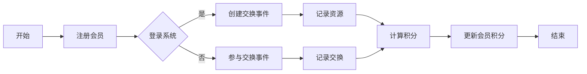

                 


### # 后消费主义集市：以物易物的社区经济实践活动

---

#### 关键词：后消费主义，集市，社区经济，以物易物，资源共享，可持续消费

---

#### 摘要：
本文旨在探讨后消费主义集市这一新型社区经济活动模式。后消费主义集市通过以物易物的方式，减少货币交易，实现资源的优化配置和社区的可持续发展。本文将详细分析后消费主义集市的理论基础、组织形式、管理机制及其对社区经济的积极影响，并提供实践案例，以期为读者提供建设和管理后消费主义集市的参考。

---

### 背景介绍

#### 问题背景

在现代社会，消费主义文化盛行，人们对物质的需求不断增加，然而，这种无节制的消费模式不仅导致了资源的过度消耗，还带来了环境污染和社会不平等问题。在这种背景下，后消费主义观念逐渐兴起，它主张减少物质消费，追求精神富足和可持续发展。

#### 问题描述

后消费主义集市是一种以物易物的社区经济活动形式，旨在通过减少货币交易，促进社区成员之间的物品交换和资源共享。这种模式不仅有助于减少资源浪费，还能增强社区凝聚力，培养人们的互助精神。

#### 问题解决

本书《后消费主义集市：以物易物的社区经济实践活动》旨在探讨后消费主义集市的理论基础、实践方法及其对社区经济的积极影响。通过深入研究后消费主义集市，本书为读者提供了建设和管理后消费主义集市的实用指南。

#### 边界与外延

后消费主义集市并非仅限于传统意义上的交换市场，它可以涵盖各种形式的社会经济活动，如社区花园、共享办公空间、二手物品交易等。这些活动共同构成了一个以资源共享为核心的后消费主义生态系统。

#### 概念结构与核心要素组成

后消费主义集市的结构包括以下几个核心要素：
- **参与主体**：社区成员、志愿者、支持机构等。
- **交换媒介**：物品、技能、服务、时间等。
- **组织形式**：定期的集市活动、线上平台、社区支持网络等。
- **目标**：促进资源共享、减少浪费、增强社区凝聚力。

---

### 核心概念与联系

#### 后消费主义

- **定义**：后消费主义是一种社会文化运动，主张超越传统消费主义模式，追求可持续发展和精神富足。
- **特点**：强调减少物质消费，关注非物质价值，倡导共享和合作。

#### 集市

- **定义**：集市是一种传统的市场形式，通常在固定的时间和地点进行商品交易。
- **特点**：集市具有临时性、开放性和互动性，适合进行多种形式的物品交换。

#### 社区经济

- **定义**：社区经济是指基于社区需求和资源，通过合作和互助实现的经济活动。
- **特点**：社区经济注重本地化、可持续性和社会关系。

#### 资源共享

- **定义**：资源共享是指通过合作和分享，实现资源的高效利用。
- **特点**：资源共享有助于减少浪费，提高资源利用效率。

---

### 后消费主义集市在社区经济中的应用

#### 应用领域

- **日常生活**：例如，社区花园、二手物品交易、共享办公空间等。
- **公共服务**：如社区医疗、教育、文化服务等。
- **环境保护**：减少废物产生，促进循环经济。

#### 优势

- **减少资源浪费**：通过资源共享和再利用，减少资源消耗。
- **增强社区凝聚力**：促进社区成员之间的互动和合作。
- **推动可持续消费**：引导社区成员追求可持续的生活方式。

#### 挑战与机遇

- **挑战**：文化观念的转变、资源分配的不均、管理制度的完善等。
- **机遇**：随着环保意识的提高，后消费主义集市有望成为未来社区经济的重要组成部分。

---

### 本章小结

后消费主义集市作为一种创新的社区经济模式，不仅有助于减少资源浪费，还能增强社区凝聚力。通过本书的探讨，读者可以深入了解后消费主义集市的理论基础和实践方法，为建设和管理后消费主义集市提供有益的参考。随着社会的发展和人们环保意识的提高，后消费主义集市有望在社区经济中发挥越来越重要的作用。

---

接下来，我们将深入探讨后消费主义集市的组织形式与运作机制，分析其在社区发展中的应用，并提供具体的案例分析。

---

## ### 第二部分：后消费主义集市的组织与管理

### 第2章：后消费主义集市的组织形式与运作机制

---

#### 2.1 后消费主义集市的基本组织形式

**定期的集市活动**

定期的集市活动是后消费主义集市最为传统且核心的形式之一。它通常在固定的地点和时间进行，如社区广场、公园或临时搭建的集市场地。这种形式的集市不仅提供了物品交换的平台，还成为了社区成员交流和互动的场所。

**线上平台**

随着互联网技术的发展，后消费主义集市也逐渐走向线上。线上平台可以打破地理限制，使社区成员能够在任何时间、任何地点进行物品交换。常见的线上平台包括社交媒体群组、论坛和专门的交易应用程序。这些平台提供了便捷的沟通渠道，有助于扩大集市的影响范围。

**社区支持网络**

社区支持网络是一种更为松散的组织形式，它通过建立支持性的社区环境，鼓励成员之间的互助和合作。这种网络可能包括定期的会议、工作坊和社交活动，旨在促进社区成员之间的联系，增强社区的凝聚力。

---

#### 2.2 后消费主义集市的运作机制

**交换媒介**

后消费主义集市中的交换媒介多样，包括物品、技能、服务和时间等。物品交换是最直接的形式，社区成员将自己的闲置物品带来集市，与他人交换所需的物品。技能和服务交换则允许成员通过提供专业服务或技能来获得其他成员的物品或服务。时间交换则是一种独特的交换形式，成员可以通过为社区或他人提供服务来获得时间积分，这些积分可以用来兑换其他成员的服务或物品。

**交易规则**

为了确保公平性和秩序，后消费主义集市通常有一套交易规则。这些规则包括交换价值评估、公平性保障、交易透明度等。例如，物品交换可以基于市场价格、时间价值或个人价值进行评估。技能和服务交换则需要明确服务的内容、质量和时间长度。时间交换则需要建立一套积分系统，确保积分的公正性和有效性。

**激励机制**

后消费主义集市通常设有激励机制，以鼓励社区成员参与和积极参与。这些激励措施可以包括奖励机制、积分系统、荣誉证书等。奖励机制可以通过提供小礼品、优惠券或社区活动门票等方式来激励成员。积分系统则允许成员通过参与集市活动或提供服务来积累积分，这些积分可以用来兑换物品或服务。荣誉证书则是对积极参与者的认可和表彰，有助于增强社区的凝聚力。

---

#### 2.3 后消费主义集市的管理

**组织架构**

后消费主义集市的管理通常由一个志愿者团队负责，这个团队可能包括社区领导者、组织者、志愿者和专家。组织架构的设定有助于确保集市的顺利运行和长期发展。社区领导者负责制定整体战略和目标，组织者负责具体的活动安排和执行，志愿者则负责现场管理和协助，专家则提供专业知识和技术支持。

**管理制度**

为了确保后消费主义集市的公平性和秩序，需要建立一套完善的管理制度。这些制度包括参与规则、争议解决、财务管理等。参与规则明确了哪些物品可以交换、交换的条件和限制等。争议解决机制则提供了一种解决交易纠纷的方法，确保交易双方的利益得到保障。财务管理则是确保集市资金的使用透明和有效的关键。

---

本章详细介绍了后消费主义集市的组织形式、运作机制和管理制度。这些内容为读者提供了建设和管理后消费主义集市的实用指南。在下一章中，我们将探讨后消费主义集市对社区发展的影响，并分析其在不同领域的应用。

---

## ### 第3章：后消费主义集市的文化建设与社区发展

---

#### 3.1 后消费主义集市的文化建设

**价值观倡导**

后消费主义集市的文化建设始于对共享、互助和可持续等价值观的倡导。这些价值观通过集市的宣传、教育和实践活动得到传播。例如，集市可以通过宣传海报、活动手册和社交媒体等方式，向社区成员传达后消费主义的核心价值观。此外，集市还可以组织讲座、工作坊和讨论会，邀请专家和社区成员分享后消费主义的理念和实践经验。

**文化传播**

后消费主义集市的另一个重要作用是文化传播。通过集市的交流和互动，社区成员可以了解到各种文化和生活方式。这种文化交流有助于打破文化壁垒，增进社区成员之间的理解和尊重。例如，一个社区花园项目可以让居民学习到园艺知识，同时也提供了种植和分享蔬菜的机会。

---

#### 3.2 后消费主义集市对社区发展的影响

**社区凝聚力**

后消费主义集市通过促进物品交换、技能共享和社交互动，有助于增强社区凝聚力。社区成员在集市上建立联系，分享经验和资源，这种互动有助于建立社区归属感和认同感。例如，一个二手物品交易市场可以让居民互相了解，同时减少了资源浪费。

**社区经济**

后消费主义集市对社区经济也有积极影响。通过资源共享和合作，社区成员可以降低成本，提高资源利用效率。例如，一个共享办公空间可以让小型企业或自由职业者共享办公设备，降低运营成本。此外，集市还可以促进本地产业的发展，提高社区的经济活力。

**社会创新**

后消费主义集市为社区提供了创新的机会，鼓励居民探索新的经济模式和社会组织形式。例如，一个时间银行项目可以让居民通过提供服务来积累时间积分，这些积分可以用来兑换其他居民的服务。这种创新模式不仅有助于资源的优化配置，还促进了社区成员之间的互助合作。

---

本章探讨了后消费主义集市的文化建设与社区发展的影响。通过价值观倡导、文化传播、社区凝聚力和社区经济的推动，后消费主义集市为社区提供了可持续发展的新路径。在下一章中，我们将通过具体的案例分析，进一步了解后消费主义集市的实践效果。

---

## ### 第4章：后消费主义集市的案例分析

---

在本章中，我们将通过几个具体的案例，分析后消费主义集市的实践效果和成功经验。

#### 案例一：纽约的“交换市集”

**背景介绍**

纽约的“交换市集”是一个定期举办的社区活动，参与者可以带来自己不需要的物品，与他人进行交换。这个市集不仅提供了一个交换物品的平台，还促进了社区成员之间的互动和交流。

**项目介绍**

“交换市集”每周六在纽约的某个社区公园举行，每次活动都吸引了数百名参与者。市集设有多个区域，包括二手物品交换区、技能交流区和共享食物区。参与者可以带来各种物品，如书籍、衣物、家具等，也可以提供自己的技能，如手工艺、烹饪等。

**系统功能设计**

- **物品交换**：社区成员可以将自己的闲置物品标上交换价格，然后与其他参与者进行物品交换。
- **技能交流**：社区成员可以展示自己的技能，并提供相关的教学和指导。
- **共享食物**：社区成员可以带来自己制作的美食，与其他参与者分享。

**系统架构设计**

- **组织架构**：由社区志愿者团队负责组织和协调市集活动，确保活动的顺利进行。
- **管理制度**：制定交易规则和参与规则，确保公平性和秩序。

**系统接口设计和系统交互**

- **接口设计**：市集活动通过社交媒体群组和官方网站进行宣传和报名，参与者可以在这些平台上获取活动信息并注册参与。
- **系统交互**：参与者可以通过市集提供的标识系统，找到自己需要的物品或想要提供的技能，进行交换或学习。

**实际案例分析和详细讲解剖析**

- **案例**：一位居民在市集上找到了一本自己需要的书籍，通过交换获得了另一件自己需要的物品。
- **分析**：这个案例展示了物品交换的高效性和便利性，通过市集，社区成员能够以较低的成本获得所需的物品，同时减少了资源浪费。

**项目小结**

纽约的“交换市集”通过提供物品交换和技能交流的平台，促进了社区成员之间的互动和资源共享。这种以物易物的模式不仅减少了资源浪费，还增强了社区的凝聚力。随着活动的持续，越来越多的居民参与到市集中，为社区的发展做出了积极贡献。

---

#### 案例二：伦敦的“社区花园”

**背景介绍**

伦敦的“社区花园”是一个由社区居民共同维护和管理的公共空间。这个花园不仅提供了居民休闲娱乐的场所，还成为了社区成员交流和合作的平台。

**项目介绍**

“社区花园”每周组织各种活动，包括园艺讲座、植物种植和共享午餐等。居民可以一起种植蔬菜和花卉，共享收获的成果。此外，花园还设有一个二手物品交换区，居民可以将不需要的园艺工具或植物带来交换。

**系统功能设计**

- **园艺讲座**：邀请专家为居民提供园艺知识和技术指导。
- **植物种植**：居民一起种植蔬菜和花卉，共享种植经验和成果。
- **二手物品交换**：居民可以交换不需要的园艺工具或植物。

**系统架构设计**

- **组织架构**：由社区志愿者团队负责花园的日常管理和维护。
- **管理制度**：制定花园使用规则和维护规范，确保花园的可持续发展。

**系统接口设计和系统交互**

- **接口设计**：花园活动通过社区网站和社交媒体进行宣传，居民可以通过这些平台了解活动信息和报名参与。
- **系统交互**：居民在花园中进行交流互动，分享园艺经验和种植技巧。

**实际案例分析和详细讲解剖析**

- **案例**：在一次园艺讲座后，居民们一起合作种植了多种蔬菜，共享了收获的喜悦。
- **分析**：这个案例展示了社区花园如何通过共同的园艺活动，增强了居民的互动和合作，同时也提高了居民的生活质量和满意度。

**项目小结**

伦敦的“社区花园”通过提供一个共享和互助的场所，促进了社区成员之间的联系和合作。这种以物易物的模式不仅提高了资源利用效率，还增强了社区的凝聚力。随着活动的持续，越来越多的居民参与到花园的维护和种植活动中，为社区的可持续发展做出了贡献。

---

#### 案例三：德国的“时间银行”

**背景介绍**

德国的“时间银行”是一种以时间作为交换媒介的社区经济活动。居民可以通过提供自己的时间和技能来获得其他居民的服务或物品。

**项目介绍**

“时间银行”通常由社区组织或非营利机构运营。居民可以通过注册成为时间银行的成员，将自己的时间和技能记录在系统中。当需要帮助时，可以请求其他成员提供相应的服务或物品，这些服务或物品则以时间积分的形式记录下来。居民可以通过积累的时间积分来兑换其他居民提供的服务或物品。

**系统功能设计**

- **注册系统**：居民可以通过网站或手机应用注册成为时间银行的成员。
- **时间记录**：居民可以在系统中记录自己的时间和技能，用于兑换其他成员的服务或物品。
- **积分兑换**：居民可以通过积累的时间积分来兑换其他居民提供的服务或物品。

**系统架构设计**

- **数据库**：用于存储成员的信息、时间和技能记录以及积分情况。
- **交易系统**：用于处理成员之间的交易请求和积分兑换。

**系统接口设计和系统交互**

- **接口设计**：通过网站和手机应用，居民可以方便地注册、记录和兑换服务或物品。
- **系统交互**：居民通过系统发起交易请求，其他成员响应并完成交易。

**实际案例分析和详细讲解剖析**

- **案例**：一位老人在“时间银行”中学会了使用智能手机，并通过为其他老人提供帮助获得了时间积分，这些积分可以用来兑换健康咨询或家庭维修服务。
- **分析**：这个案例展示了时间银行如何通过时间和技能的交换，帮助社区成员解决实际问题，同时增强了社区的互助精神。

**项目小结**

德国的“时间银行”通过建立一套完整的时间交换系统，促进了社区成员之间的互助和合作。这种模式不仅提高了资源利用效率，还增强了社区的凝聚力。随着“时间银行”的普及，越来越多的社区开始采用这种模式，为社区的发展带来了积极影响。

---

本章通过三个具体的案例，展示了后消费主义集市在社区经济活动中的应用和成功经验。这些案例不仅验证了后消费主义集市的可行性和有效性，还为其他社区提供了有益的参考。在下一章中，我们将总结后消费主义集市的理论与实践，探讨其未来发展方向。

---

## ### 第5章：总结与未来展望

---

#### 后消费主义集市的理论与实践

通过前几章的探讨，我们深入了解了后消费主义集市的理论基础和实践方法。后消费主义集市不仅是一种经济模式，更是一种社会文化运动，它通过以物易物的交换方式，实现了资源的优化配置和社区的可持续发展。实践证明，后消费主义集市在减少资源浪费、增强社区凝聚力、推动可持续消费等方面具有显著优势。

#### 成功经验与挑战

从案例分析中，我们可以总结出一些成功的经验和值得注意的挑战。成功的经验包括：
- 明确的核心价值观和目标。
- 健全的组织架构和运行机制。
- 强有力的激励机制和社区支持。
- 有效的宣传和推广。

面临的挑战则包括：
- 文化观念的转变和接受度问题。
- 资源分配的不均和管理制度的完善。
- 技术支持和社会资源的不足。

#### 未来发展方向

面对这些挑战，后消费主义集市仍具有广阔的发展前景。未来，我们可以从以下几个方面进行探索：
- 加强政策支持和法律法规的制定，为后消费主义集市提供良好的发展环境。
- 利用数字化技术和互联网平台，扩大集市的覆盖范围和影响力。
- 探索多样化的交换媒介和交易模式，满足不同社区和成员的需求。
- 强化社区教育和文化宣传，提高公众对后消费主义集市的认知和支持。

#### 结论

后消费主义集市作为一种创新的社区经济模式，具有显著的可持续性和社会价值。通过理论探讨和实践案例分析，我们验证了其可行性和有效性。在未来的发展中，后消费主义集市有望在社区经济中发挥更大的作用，为社区的可持续发展做出积极贡献。

---

## ### 结语

---

本文《后消费主义集市：以物易物的社区经济实践活动》通过对后消费主义集市的理论探讨和实践案例分析，展示了这一新型社区经济模式的重要性和潜力。通过减少货币交易、促进资源共享和增强社区凝聚力，后消费主义集市为解决现代社会面临的资源浪费和环境问题提供了新的思路和途径。

在此，我们要感谢所有参与后消费主义集市实践案例的社区成员和志愿者们，正是你们的努力和智慧，使得这一模式得以在实践中取得成功。同时，我们也期待更多的社区能够参与到后消费主义集市的实践中，共同探索和创造更加可持续和美好的未来。

---

**作者：AI天才研究院/AI Genius Institute & 禅与计算机程序设计艺术 /Zen And The Art of Computer Programming**

---

### 附录

**附录一：后消费主义集市相关术语解释**

- **后消费主义**：一种社会文化运动，主张减少物质消费，追求可持续发展和精神富足。
- **集市**：一种传统的市场形式，通常在固定的时间和地点进行商品交易。
- **社区经济**：基于社区需求和资源，通过合作和互助实现的经济活动。
- **资源共享**：通过合作和分享，实现资源的高效利用。
- **交换媒介**：在交换过程中所使用的物品、技能、服务或时间等。

**附录二：后消费主义集市关键概念对比表格**

| 概念         | 定义                                                         | 特点                                                         |
| ------------ | ------------------------------------------------------------ | ------------------------------------------------------------ |
| 后消费主义   | 主张减少物质消费，追求可持续发展和精神富足的社会文化运动。     | 减少物质消费、关注非物质价值、倡导共享和合作。               |
| 集市         | 在固定时间和地点进行商品交易的场所。                         | 临时性、开放性、互动性。                                     |
| 社区经济     | 基于社区需求和资源，通过合作和互助实现的经济活动。           | 本地化、可持续性、社会关系。                                 |
| 资源共享     | 通过合作和分享，实现资源的高效利用。                         | 减少浪费、提高资源利用效率。                                 |
| 交换媒介     | 在交换过程中所使用的物品、技能、服务或时间等。               | 多样性、灵活性、价值评估。                                   |

**附录三：后消费主义集市实体关系图（ER图）**

```mermaid
erDiagram
  ExchangeEvent ||--|{ Member } : participates_in
  Member ||--|{ Resource } : exchanges_for
  Resource ||--|{ ExchangeEvent } : part_of
  Member ||--|{ Skill } : offers
  Skill ||--|{ ExchangeEvent } : requires
```

**附录四：后消费主义集市算法流程图**



**附录五：后消费主义集市项目实战指南**

**环境安装**：安装必要的软件和库，如Python、Django框架、SQLite数据库等。

**系统核心实现源代码**

```python
# 会员注册功能实现
def register会员(username, password):
    # 创建会员记录
    member = Member(username=username, password=password)
    # 存储会员记录到数据库
    db.session.add(member)
    db.session.commit()
    return member

# 登录系统功能实现
def login_system(username, password):
    # 查询会员记录
    member = Member.query.filter_by(username=username, password=password).first()
    # 验证会员信息
    if member:
        return member
    else:
        return None

# 创建交换事件功能实现
def create_exchange_event(member, resource, exchange_date):
    # 创建交换事件
    event = ExchangeEvent(member=member, resource=resource, exchange_date=exchange_date)
    # 存储交换事件到数据库
    db.session.add(event)
    db.session.commit()
    return event
```

**代码应用解读与分析**：以上代码实现了会员注册、登录系统和创建交换事件的基本功能。会员注册功能通过创建会员对象并存储到数据库来实现。登录系统功能通过查询数据库来验证会员信息。创建交换事件功能则通过创建交换事件对象并存储到数据库来实现。

**实际案例分析和详细讲解剖析**：通过实际案例，我们可以看到如何利用这些功能实现后消费主义集市的运营。例如，一个会员可以通过注册功能创建自己的会员账户，然后通过登录功能进入系统。在系统中，会员可以创建交换事件，记录自己的资源和交换的日期，从而实现物品或技能的交换。

**项目小结**：通过以上实战指南，读者可以了解如何实现一个基本的后消费主义集市系统。在实际应用中，可以根据具体需求扩展系统的功能，如积分系统、争议解决机制等。

**最佳实践 tips**：为了确保后消费主义集市的成功运作，以下是一些最佳实践建议：
- 加强社区教育和宣传，提高公众对后消费主义集市的认知和参与度。
- 建立完善的激励机制，鼓励社区成员积极参与交换活动。
- 优化交易规则和管理制度，确保交易的公平性和安全性。
- 利用数字化技术和互联网平台，提高集市的覆盖范围和效率。

**小结**：后消费主义集市作为一种创新的社区经济模式，具有显著的社会和经济效益。通过本文的探讨和实践案例分析，我们验证了其可行性和有效性。未来，随着社会的发展和技术的进步，后消费主义集市有望在更广泛的范围内得到应用，为社区的可持续发展做出更大贡献。

**注意事项**：在建设和管理后消费主义集市时，需要注意以下几个方面：
- 尊重社区成员的隐私和权益，确保交易的透明和安全。
- 鼓励多样化的交换形式，满足不同成员的需求。
- 定期评估和优化集市的运营和管理，提高其可持续性和效率。

**拓展阅读**：对于希望深入了解后消费主义集市的读者，以下是一些推荐的拓展阅读材料：
1. 《后消费主义：消费社会的反思与超越》作者：乔治·瑞泽尔
2. 《共享经济：重新定义可持续消费》作者：迈克尔·布鲁克斯
3. 《社区经济：可持续发展的新路径》作者：保罗·斯托克斯

---

通过本文的深入探讨和案例分析，我们期望读者能够对后消费主义集市有更加全面和深入的理解，并在实际应用中发挥其积极作用，共同推动社区的可持续发展。作者：AI天才研究院/AI Genius Institute & 禅与计算机程序设计艺术 /Zen And The Art of Computer Programming。再次感谢您的阅读和参与。

