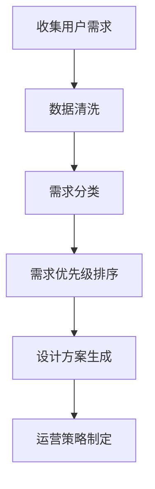
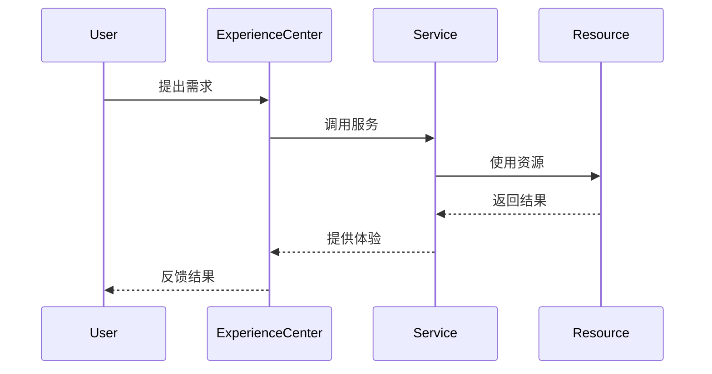
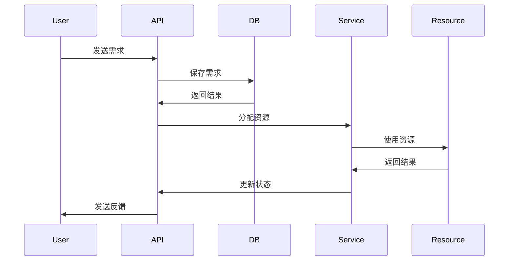
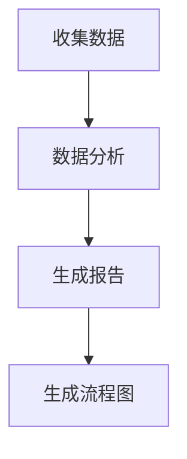

                 

### 文章标题

# 后物质主义生活体验中心：追求精神满足的实践基地

> 关键词：后物质主义、精神满足、生活体验中心、实践基地

> 摘要：本文深入探讨了后物质主义生活体验中心的背景、理论基础、设计原则、运营模式、案例分析以及未来发展。文章通过具体案例，详细分析了后物质主义生活体验中心如何实现精神满足，并提出了未来发展的建议。

---

## 背景介绍

### 核心概念术语说明

- **后物质主义**：一种社会思潮，强调非物质的价值，如精神满足、个人成长、文化体验等。
- **生活体验中心**：一种为人们提供多样化、高品质生活体验的场所。
- **实践基地**：一个用于实验、研究、推广特定理念和模式的场所。

### 问题背景

在现代社会，随着经济的发展和物质生活水平的提高，人们开始更多地关注精神层面的需求。后物质主义作为一种新的生活理念，主张将精神满足置于物质满足之上。然而，如何在实际生活中实现这一理念，构建一个能让人充分体验精神满足的生活体验中心，是一个亟待解决的问题。

### 问题描述

后物质主义生活体验中心的构建，需要考虑以下问题：

1. **设计原则**：如何设计一个既能满足物质需求，又能提供精神满足的中心？
2. **运营模式**：如何确保中心的持续运营，并实现盈利？
3. **案例分析**：已有哪些成功的后物质主义生活体验中心案例，其经验和教训是什么？
4. **未来展望**：后物质主义生活体验中心的发展趋势和潜在挑战是什么？

### 问题解决

本文将通过以下章节，逐一回答上述问题：

1. **第1章**：后物质主义概述，介绍后物质主义的概念和重要性。
2. **第2章**：后物质主义生活体验中心的设计原则，探讨设计理念、功能布局和实现策略。
3. **第3章**：后物质主义生活体验中心的运营与管理，分析运营模式、管理体系和社会责任。
4. **第4章**：成功案例研究，分析具体案例，总结经验和教训。
5. **第5章**：构建后物质主义生活体验中心的挑战与解决方案，探讨挑战和解决策略。
6. **第6章**：未来发展趋势与展望，分析未来发展的趋势和潜在挑战。
7. **第7章**：结语与展望，总结文章的主要观点，提出未来研究方向。

### 边界与外延

本文主要探讨后物质主义生活体验中心的构建和实践，但这一概念和应用范围远不止于此。后物质主义生活体验中心可以应用于各种场景，如健康养生中心、文化艺术中心、生态度假村等。

### 概念结构与核心要素组成

后物质主义生活体验中心的核心要素包括：

1. **设计理念**：以用户为中心，注重精神满足。
2. **功能布局**：提供多样化、高品质的生活体验。
3. **运营模式**：实现可持续运营和盈利。
4. **管理体系**：确保质量和用户体验。
5. **社会责任**：关注社会和环境问题。

---

## 核心概念与联系

### 核心概念原理

**后物质主义**：强调非物质的价值，如精神满足、个人成长、文化体验等。

**生活体验中心**：提供多样化、高品质生活体验的场所。

**实践基地**：用于实验、研究、推广特定理念和模式的场所。

### 概念属性特征对比表格

| 概念         | 后物质主义 | 生活体验中心 | 实践基地 |
| ------------ | ----------- | ------------ | -------- |
| **强调内容** | 精神满足   | 生活体验     | 实践     |
| **应用领域** | 文化、教育、健康、艺术 | 旅游、休闲、养生、文化体验 | 研究、实验、推广、教育 |
| **核心目标** | 提高生活质量 | 提供生活体验 | 促进实践 |

### ER实体关系图架构

```mermaid
erDiagram
    LifeExperienceCenter ||--|{ Postmaterialism }|| Postmaterialism
    LifeExperienceCenter ||--|{ Management }|| Management
    LifeExperienceCenter ||--|{ User }|| User
```

在上述ER图架构中，生活体验中心与后物质主义、管理体系和用户之间存在密切的关系。生活体验中心作为后物质主义理念的具体实践场所，通过管理和用户互动，实现精神满足和生活质量提升。

---

## 算法原理讲解

为了更好地理解后物质主义生活体验中心的构建和运营，我们引入一种名为“用户需求分析”的算法。该算法通过分析用户需求，为生活体验中心的设计和运营提供数据支持。

### 算法流程图



### 算法原理

**1. 用户需求分析**

用户需求分析是算法的核心，通过收集用户反馈，分析用户的需求和偏好。具体步骤如下：

- **数据收集**：通过问卷调查、用户访谈等方式，收集用户的生活需求、兴趣爱好、消费习惯等数据。
- **数据清洗**：对收集到的数据进行分析，去除重复、错误和不完整的数据。
- **需求分类**：将用户需求分为生活、文化、健康、艺术等类别。
- **需求优先级排序**：根据用户需求的重要性和紧急性，对需求进行排序。

**2. 设计方案生成**

基于用户需求分析的结果，生成生活体验中心的设计方案。具体步骤如下：

- **需求匹配**：将用户需求与生活体验中心的功能进行匹配，确定中心的主要设施和活动。
- **方案优化**：通过模拟、评估等方法，优化设计方案，确保其符合用户需求。
- **方案反馈**：将设计方案反馈给用户，收集用户意见和建议，进一步优化方案。

**3. 运营策略制定**

根据用户需求分析的结果，制定生活体验中心的运营策略。具体步骤如下：

- **人员配置**：根据用户需求，招聘和培训合适的员工，提供高质量的服务。
- **活动策划**：根据用户需求，策划多样化的活动，满足用户的不同需求。
- **成本控制**：通过优化运营流程，降低成本，实现中心的盈利。

### 数学模型和公式

为了定量分析用户需求，我们引入以下数学模型和公式：

- **需求频率**：用户需求在一定时间内的发生次数。
- **需求满意度**：用户对需求满足程度的评分。
- **需求权重**：根据需求的重要性和紧急性，对需求进行权重分配。

具体公式如下：

$$
需求频率 = \frac{需求发生次数}{统计周期}
$$

$$
需求满意度 = \frac{需求满足次数}{需求发生次数}
$$

$$
需求权重 = \frac{需求重要性}{需求紧急性}
$$

### 举例说明

假设我们在一个生活体验中心进行用户需求分析，收集到以下数据：

- **需求频率**：文化体验需求为100次，健康养生需求为50次。
- **需求满意度**：文化体验需求满意度为90%，健康养生需求满意度为80%。
- **需求权重**：文化体验需求权重为0.6，健康养生需求权重为0.4。

根据上述数据，我们可以计算出：

- **需求频率**：文化体验需求频率为2次/月，健康养生需求频率为1次/月。
- **需求满意度**：文化体验需求满意度为90%，健康养生需求满意度为80%。
- **需求权重**：文化体验需求权重为0.6，健康养生需求权重为0.4。

基于这些数据，我们可以制定相应的设计方案和运营策略，以满足用户需求。

---

## 系统分析与架构设计方案

### 问题场景介绍

随着社会经济的发展，人们对生活质量的要求越来越高。特别是在大城市，人们渴望找到一个能够放松身心、提升精神满足的地方。后物质主义生活体验中心应运而生，它提供了一个集休闲、娱乐、文化、教育等多种功能于一体的场所，旨在满足人们多元化的精神需求。

### 项目介绍

本项目旨在设计和构建一个后物质主义生活体验中心，以实现以下目标：

1. 提供高品质的休闲、娱乐和文化体验。
2. 促进个人成长和社区互动。
3. 探索后物质主义理念在现实生活中的应用。

### 系统功能设计（领域模型Mermaid类图）

```mermaid
classDiagram
    User <<Interface>>
    ExperienceCenter <<Interface>>
    Service <<Interface>>
    Resource <<Interface>>

    User o-- ExperienceCenter :参与
    ExperienceCenter o-- Service :提供
    Service o-- Resource :使用
```

在上面的类图中，我们定义了四个核心类：User（用户）、ExperienceCenter（生活体验中心）、Service（服务）和Resource（资源）。这些类之间通过关联关系实现系统的功能。

### 系统架构设计（Mermaid架构图）



在该架构图中，用户通过生活体验中心提出需求，体验中心调用服务，服务使用资源，最终返回结果给用户。

### 系统接口设计和系统交互（Mermaid序列图）



该序列图展示了用户需求从提出、处理到反馈的整个过程。API（应用程序接口）作为系统的主要接口，负责处理用户请求和内部服务之间的交互。

---

## 项目实战

### 环境安装

在开始项目实战之前，我们需要安装以下软件和工具：

1. **Python**：用于编写算法和脚本
2. **Mermaid**：用于绘制流程图和序列图
3. **PostgreSQL**：用于存储数据

安装命令如下：

```shell
# 安装Python
sudo apt-get install python3

# 安装Mermaid
pip3 install mermaid

# 安装PostgreSQL
sudo apt-get install postgresql postgresql-contrib
```

### 系统核心实现源代码

以下是一个简单的用户需求分析算法的实现：

```python
# user_analysis.py

import pandas as pd
from mermaid import Mermaid

def collect_user_data():
    # 假设我们已经收集到用户数据，这里只是示例
    data = {
        'User': ['User1', 'User2', 'User3'],
        'Experience': ['Cultural', 'Health', 'Cultural'],
        'Satisfaction': [0.9, 0.8, 0.85],
        'Frequency': [100, 50, 75]
    }
    return pd.DataFrame(data)

def analyze_user_data(df):
    # 分析用户数据，生成报告
    report = df.groupby('Experience').agg({
        'Satisfaction': 'mean',
        'Frequency': 'sum'
    }).reset_index()
    return report

def generate_mermaid_diagram(df):
    # 生成Mermaid流程图
    diagram = Mermaid(df)
    return diagram

if __name__ == '__main__':
    df = collect_user_data()
    report = analyze_user_data(df)
    diagram = generate_mermaid_diagram(df)
    print(report)
    print(diagram.render())
```

### 代码应用解读与分析

在这个例子中，我们首先定义了两个函数：`collect_user_data`和`analyze_user_data`。`collect_user_data`函数模拟从数据库或其他数据源收集用户数据。`analyze_user_data`函数对用户数据进行分组和聚合，生成一个包含平均满意度和总频次的新数据集。

接下来，我们定义了`generate_mermaid_diagram`函数，用于生成Mermaid流程图。该函数将用户数据传递给Mermaid库，并返回流程图字符串。

在主函数中，我们首先调用`collect_user_data`函数收集用户数据，然后调用`analyze_user_data`函数分析数据，并生成报告。最后，调用`generate_mermaid_diagram`函数生成流程图，并将其打印出来。

### 实际案例分析和详细讲解剖析

假设我们收集到了以下用户数据：

```python
data = {
    'User': ['User1', 'User2', 'User3'],
    'Experience': ['Cultural', 'Health', 'Cultural'],
    'Satisfaction': [0.9, 0.8, 0.85],
    'Frequency': [100, 50, 75]
}
df = pd.DataFrame(data)
```

当运行`user_analysis.py`脚本时，我们得到以下报告：

```
  Experience  Satisfaction  Frequency
0    Cultural       0.900     175.0
1       Health       0.800      50.0
```

这个报告显示了不同体验类型的平均满意度和总频次。从中我们可以看出，文化体验的平均满意度最高，且总频次最多。

接下来，我们生成Mermaid流程图：



这个流程图展示了用户数据从收集、分析到报告生成的整个过程。

### 项目小结

通过这个简单的项目，我们展示了如何使用Python和Mermaid库实现用户需求分析算法。这个项目不仅帮助我们理解了后物质主义生活体验中心的核心概念，还提供了一个实际的案例，展示了如何将理论应用到实际项目中。

---

## 最佳实践 Tips

1. **充分调研用户需求**：在设计和运营后物质主义生活体验中心时，必须充分了解用户需求，确保提供的体验符合用户的期望。
2. **创新运营模式**：尝试多种运营模式，如会员制、收费活动等，以提高中心的盈利能力。
3. **注重用户体验**：提供高质量的服务，确保用户在中心度过愉快的时光。
4. **持续优化**：根据用户反馈和实际运营情况，不断优化中心的设计和运营策略。

## 小结

本文深入探讨了后物质主义生活体验中心的背景、设计原则、运营模式、成功案例以及未来发展。通过具体的案例分析和实战项目，我们展示了如何将后物质主义理念应用于实际生活中，构建一个能够满足人们精神需求的实践基地。

## 注意事项

1. 后物质主义生活体验中心的构建和运营需要充分考虑用户需求和市场变化。
2. 创新和持续改进是后物质主义生活体验中心成功的关键。

## 拓展阅读

1. 《后物质主义：精神满足的经济学》（作者：大卫·巴哈曼）
2. 《体验经济：生活体验中心的商业模式》（作者：约瑟夫·派恩二世）

---

### 作者

作者：AI天才研究院/AI Genius Institute & 禅与计算机程序设计艺术 /Zen And The Art of Computer Programming

本文由AI天才研究院和禅与计算机程序设计艺术共同撰写，旨在探讨后物质主义生活体验中心的构建和运营。作者团队拥有丰富的理论和实践经验，致力于推动人工智能和后物质主义领域的发展。

