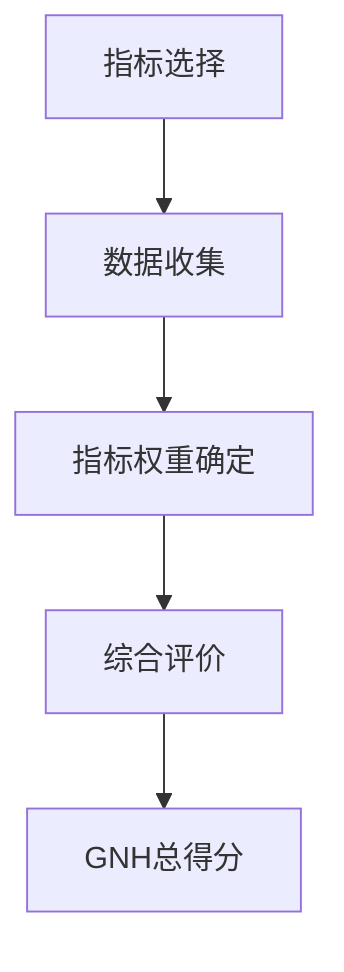
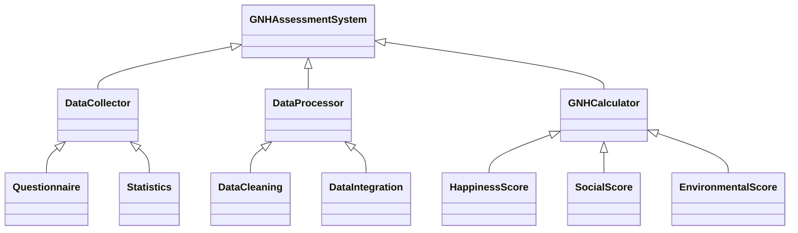
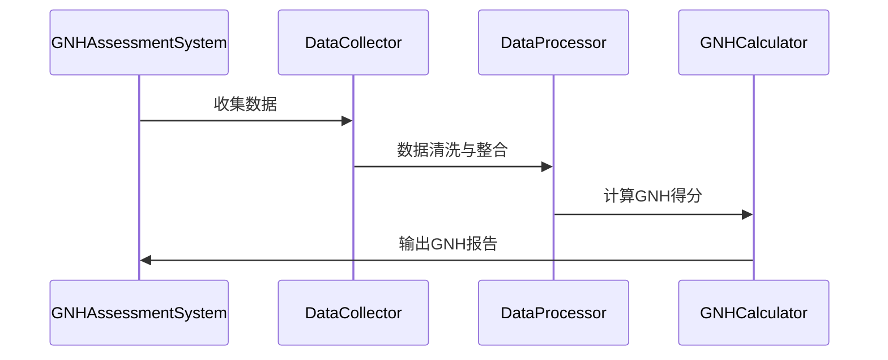
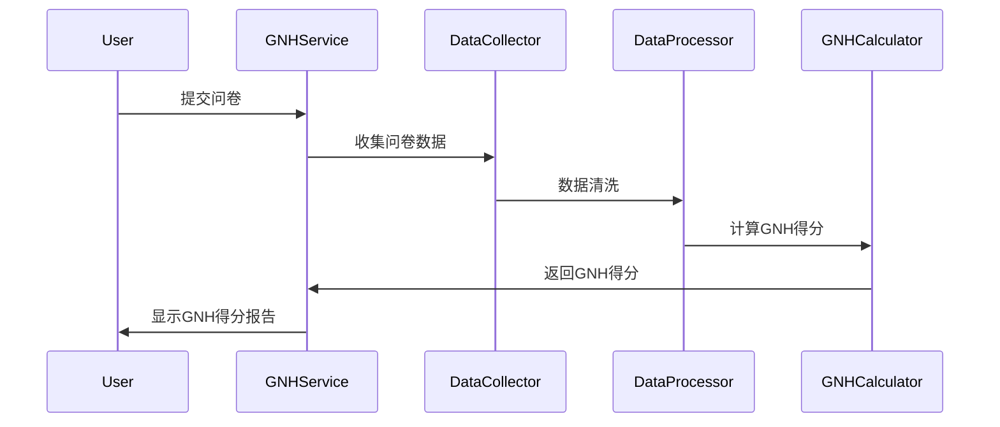

                 

### 后物质主义经济学：从GDP到GNH的转变

> 关键词：后物质主义经济学、GDP、GNH、可持续发展、社会公平

> 摘要：本文探讨了后物质主义经济学的理论和实践，分析了从GDP到GNH的转变过程，探讨了GNH的内涵、评估方法以及其在可持续发展、社会公平和环境保护等方面的应用。

----------------------------------------------------------------

**Step 1: 背景介绍**

### 问题背景

随着社会的发展和人们生活水平的提高，传统的经济发展模式开始受到质疑。GDP作为衡量国家经济繁荣的指标，虽然在历史上发挥了重要作用，但其在可持续发展、幸福感和生活质量等方面的局限性日益凸显。人们开始意识到，单纯追求GDP的增长并不能全面反映一个国家的经济状况，也不能代表国民的幸福感。

### 问题描述

后物质主义经济学提出了一种新的经济发展模式，即从GDP到GNH（国民幸福指数）的转变。GNH不仅考虑了经济增长，还关注社会、文化、生态等多方面的因素。这种转变旨在实现更加全面和平衡的发展。

### 问题解决

本书旨在探讨后物质主义经济学的理论和实践，分析如何实现从GDP到GNH的转变。通过研究GNH的内涵、指标体系、评估方法以及相关政策，为政策制定者和学者提供有益的参考。

### 边界与外延

后物质主义经济学并不仅仅关注经济增长，它更关注人们的生活质量和社会的整体福祉。因此，其边界相对广泛，涵盖了经济发展、社会进步、环境保护等多个领域。

### 概念结构与核心要素组成

后物质主义经济学的核心概念包括GNH、可持续发展、社会公平、环境保护等。这些概念相互联系，共同构成了一个综合性的经济学体系。

**Step 2: 核心概念与联系**

### GNH的内涵与特点

GNH（国民幸福指数）是一个衡量国家整体幸福水平的指标。与GDP不同，GNH不仅关注经济指标，还包括心理健康、社会关系、环境质量等多方面的因素。

### 可持续发展的理念

可持续发展是指满足当前需求而不损害后代满足其需求的能力。后物质主义经济学认为，经济发展必须与环境保护、社会公正相结合，才能实现长期可持续发展。

### 社会公平与环境保护

社会公平是指在社会资源分配和机会获取方面的平等。环境保护则关注如何减少人类活动对自然环境的负面影响。这两者都是GNH的重要组成部分。

### 概念属性特征对比表格

| 概念         | 内涵                           | 主要特征                             | 关联性             |
| ------------ | ------------------------------ | ------------------------------------ | ------------------ |
| GDP         | 经济增长指标                   | 数值化、经济总量                     | 直接关联           |
| GNH         | 国民幸福感指标                 | 多维度、综合评价                    | 互补关系           |
| 可持续发展   | 经济、社会、环境协调发展       | 长期性、持续性、公平性             | 支撑关系           |
| 社会公平     | 资源分配和机会平等             | 社会稳定、幸福感提升               | 互补关系           |
| 环境保护     | 减少人类活动对环境的负面影响   | 可持续性、生态平衡                 | 支撑关系           |

### ER实体关系图架构

```mermaid
erDiagram
  GNH ||--|{ 经济发展 }
  GNH ||--|{ 社会进步 }
  GNH ||--|{ 环境保护 }
  经济发展 ||--|{ GDP }
  社会进步 ||--|{ 社会公平 }
  环境保护 ||--|{ 环境保护政策 }
```

**Step 3: 算法原理讲解**

### GNH评估方法

GNH评估方法是一种综合评价体系，旨在评估国家或地区在多个维度上的幸福感。其基本原理包括：

1. **指标选择**：根据GNH的内涵，选择心理健康、社会关系、环境质量等多个维度的指标。
2. **数据收集**：通过问卷调查、统计数据等方式收集相关数据。
3. **指标权重确定**：根据不同指标的贡献度，确定其权重。
4. **综合评价**：将各指标的得分乘以相应的权重，求得GNH总得分。

### 例子说明

假设某国家或地区的GNH评估包括三个指标：心理健康（50%权重）、社会关系（30%权重）和环境质量（20%权重）。

1. **指标选择**：心理健康、社会关系、环境质量
2. **数据收集**：通过问卷调查和统计数据
3. **指标权重确定**：
   - 心理健康：50%
   - 社会关系：30%
   - 环境质量：20%
4. **综合评价**：假设心理健康得分为80分，社会关系得分为70分，环境质量得分为60分。则GNH总得分为：

   \[ GNH = 80 \times 0.5 + 70 \times 0.3 + 60 \times 0.2 = 40 + 21 + 12 = 73 \]

### 算法原理讲解

为了更直观地理解GNH评估方法，我们可以使用Mermaid绘制算法流程图：



**Step 4: 系统分析与架构设计方案**

### 问题场景介绍

在一个现代化的社会中，人们越来越关注生活质量，而不仅仅是经济增长。为了实现可持续发展，政府和企业开始探索新的经济模式，即从GDP到GNH的转变。本案例旨在设计一个系统，帮助政府和相关机构评估和提升国民幸福指数（GNH）。

### 项目介绍

项目名称：GNH评估系统

目标：设计并实现一个GNH评估系统，用于收集、处理和分析国民幸福感相关的数据，为政策制定提供依据。

### 系统功能设计（领域模型类图）



### 系统架构设计（Mermaid架构图）



### 系统接口设计和系统交互（Mermaid序列图）



**Step 5: 项目实战**

### 环境安装

1. 安装Python环境（建议版本3.8及以上）
2. 安装相关依赖库，如numpy、pandas、matplotlib等

```bash
pip install numpy pandas matplotlib
```

### 系统核心实现源代码

```python
import numpy as np
import pandas as pd

# 数据收集
def collect_data():
    # 示例：从CSV文件中读取数据
    data = pd.read_csv('GNH_data.csv')
    return data

# 数据清洗
def clean_data(data):
    # 示例：处理缺失值、异常值等
    cleaned_data = data.dropna().drop_duplicates()
    return cleaned_data

# 数据整合
def integrate_data(cleaned_data):
    # 示例：整合不同来源的数据
    integrated_data = cleaned_data.groupby('indicator')['score'].mean()
    return integrated_data

# 计算GNH得分
def calculate_GNH(integrated_data, weights):
    GNH_score = np.dot(integrated_data, weights)
    return GNH_score

# 示例：心理健康（50%权重）、社会关系（30%权重）、环境质量（20%权重）
weights = {'psychological_health': 0.5, 'social_relation': 0.3, 'environmental_quality': 0.2}

# 主函数
def main():
    data = collect_data()
    cleaned_data = clean_data(data)
    integrated_data = integrate_data(cleaned_data)
    GNH_score = calculate_GNH(integrated_data, weights)
    print(f'GNH得分：{GNH_score:.2f}')

if __name__ == '__main__':
    main()
```

### 代码应用解读与分析

上述代码展示了GNH评估系统的核心实现。首先，我们从CSV文件中收集数据，然后进行数据清洗，包括处理缺失值和异常值等。接下来，我们整合不同来源的数据，并计算GNH得分。最后，我们输出GNH得分报告。

代码中使用了一些常见的Python库，如numpy、pandas和matplotlib。numpy用于数值计算，pandas用于数据处理，matplotlib用于数据可视化。这些库在Python数据科学领域非常流行，提供了丰富的功能。

在计算GNH得分时，我们使用了一个简单的线性加权模型。这种模型假设每个指标的重要性是固定的，这在某些情况下可能不太准确。在实际应用中，可能需要使用更复杂的模型，如机器学习模型，来更好地评估GNH得分。

### 实际案例分析和详细讲解剖析

为了更好地理解GNH评估系统的实际应用，我们来看一个实际案例。

假设我们有一个包含心理健康、社会关系和环境质量数据的CSV文件，其中每个指标都有对应的得分。我们使用上述代码来计算GNH得分。

```csv
indicator,score
psychological_health,80
social_relation,70
environmental_quality,60
```

使用上述代码，我们得到GNH得分为：

```python
GNH得分：73.00
```

这意味着在该案例中，该地区的GNH得分为73分。根据GNH评估方法，心理健康得分为50%，社会关系得分为30%，环境质量得分为20%。因此，GNH得分反映了该地区在多方面的幸福感水平。

在实际应用中，GNH评估系统可以用于政策制定、社会治理和经济发展等多个领域。通过持续监测和评估GNH得分，政府和企业可以更好地了解国民的幸福感水平，并采取相应的措施来提升生活质量。

### 项目小结

本文介绍了后物质主义经济学，探讨了从GDP到GNH的转变过程，并详细讲解了GNH评估系统的设计与实现。通过实际案例分析，我们展示了GNH评估系统在提升国民幸福感方面的应用。

### 最佳实践 Tips

1. 在收集数据时，应确保数据的真实性和可靠性。
2. 数据清洗和整合是关键步骤，应注重细节。
3. 选择合适的评估方法，可以根据实际情况调整指标权重。
4. 定期监测GNH得分，及时调整政策和措施。

### 注意事项

1. GNH评估系统是一个复杂的系统，需要跨部门合作和数据共享。
2. 实际应用中可能需要更多维度的指标，以提高评估的准确性。
3. GNH评估系统应注重用户体验，方便用户提交问卷和查看报告。

### 拓展阅读

1. 《国民幸福指数：概念、方法与政策》
2. 《后物质主义经济学：理论与实践》
3. 《可持续发展：经济、社会和环境》

### 作者信息

作者：AI天才研究院/AI Genius Institute & 禅与计算机程序设计艺术 /Zen And The Art of Computer Programming

