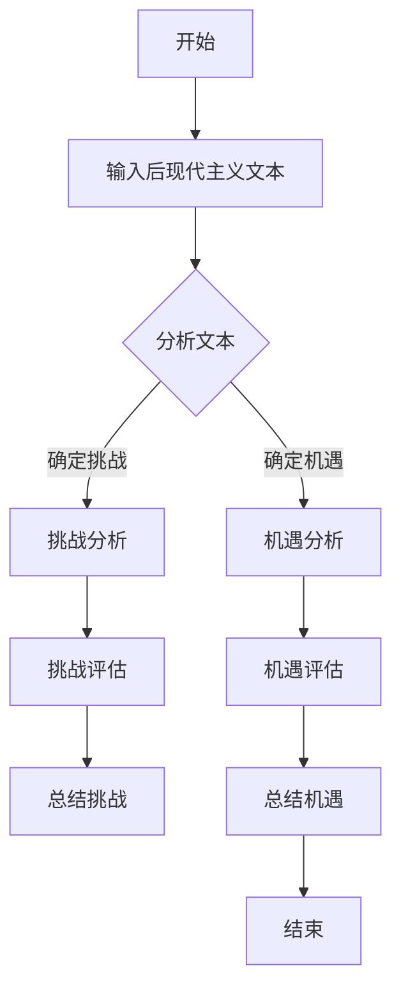
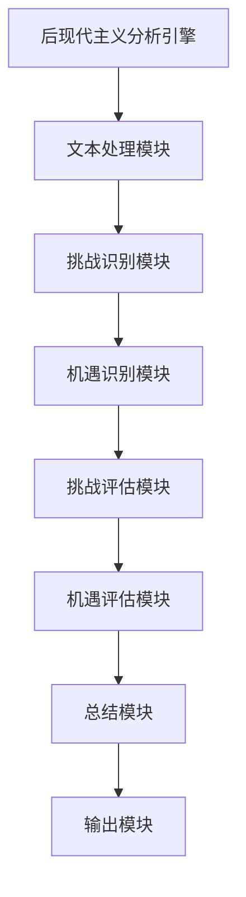
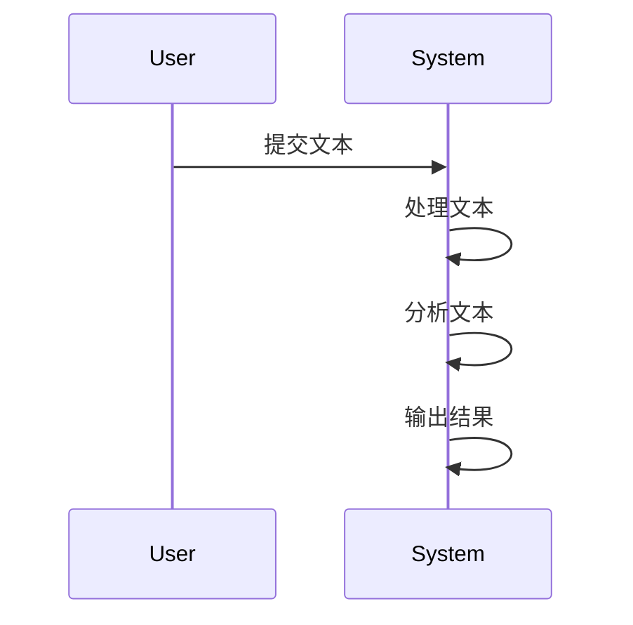
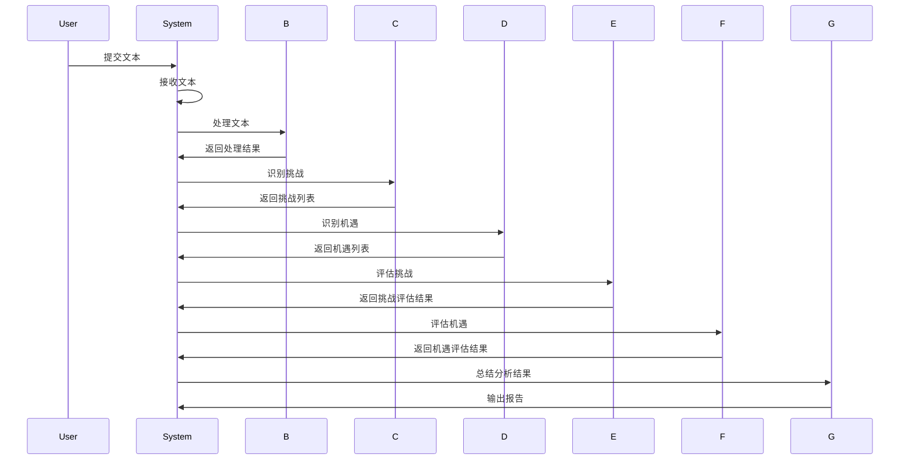

                 


### 《后现代主义对传统价值观的挑战与机遇》

关键词：后现代主义、传统价值观、挑战、机遇、社会变革

摘要：本文旨在探讨后现代主义对传统价值观的深刻影响，分析其在当代社会中所带来的挑战与机遇。通过对核心概念的详细解读、算法原理的讲解以及系统分析与架构设计的展示，本文将帮助读者理解后现代主义如何重塑我们的价值观，并在实际应用中创造新的可能。

----------------------------------------------------------------

## 1. 背景介绍

### 后现代主义的定义与起源

后现代主义，作为一种文化理论，起源于20世纪的哲学、文学和艺术领域。它是对现代主义的一种反思和批判，主张消解现代主义所推崇的理性、客观性和普遍性。后现代主义认为，现代社会中存在着深层次的不确定性和多元化，从而提出了一系列新的理论和概念。

### 后现代主义的核心观点

后现代主义的核心观点可以概括为以下几个方面：

1. **解构主义**：后现代主义强调对传统结构和权威的解构，认为这些结构是人为的、可以质疑的。
2. **多元化**：后现代主义主张多元文化的共存，反对任何形式的单一文化霸权。
3. **相对主义**：后现代主义认为，真理和价值是相对的，没有绝对的标准。
4. **不确定性**：后现代主义认为，现代社会充满了不确定性，这种不确定性是正常的现象，而不是需要解决的问题。

### 后现代主义在当代社会的影响

后现代主义在当代社会的影响深远，主要体现在以下几个方面：

1. **文化与艺术**：后现代主义对文学、艺术和电影等领域产生了深远的影响，推动了实验性和多样性。
2. **哲学与政治**：后现代主义挑战了传统哲学和政治理论，提出了新的思考方式和价值观。
3. **教育与科技**：后现代主义对教育体系和科技发展也产生了重要影响，推动了创新和变革。

----------------------------------------------------------------

## 2. 核心概念与联系

### 传统价值观的定义与特征

传统价值观通常包括一系列被广泛接受的社会道德、伦理和宗教观念。这些价值观强调个人责任、社会秩序和道德规范，具有普遍性和稳定性的特征。

### 后现代主义对传统价值观的挑战

后现代主义对传统价值观的挑战主要体现在以下几个方面：

1. **个体主义与集体主义的冲突**：后现代主义强调个体的独特性和多样性，与传统价值观强调的集体主义和共性形成了鲜明对比。
2. **确定性与不确定性的对话**：后现代主义认为，现代社会充满不确定性，这与传统价值观所追求的确定性和稳定性形成了对立。
3. **稳定性与流动性的转化**：传统价值观强调社会秩序和稳定性，而后现代主义则认为社会是动态的、不断变化的。

### 后现代主义带来的机遇

后现代主义也为社会带来了新的机遇：

1. **多元文化的繁荣**：后现代主义推崇多元文化的共存，促进了不同文化的交流和融合。
2. **创新与创造力的提升**：后现代主义鼓励创新思维和创造力，为科技和文化的发展提供了新的动力。
3. **社会平等的进步**：后现代主义强调个体的独特性和平等，有助于推动社会平等的进步。

### 核心概念对比表格

| 传统价值观 | 后现代主义 |
| --- | --- |
| 确定性 | 不确定性 |
| 统一性 | 多元性 |
| 静态性 | 流动性 |
| 权威性 | 解构权威 |

### ER实体关系图

```mermaid
erDiagram
  Subject --> Object
  Subject ||--|{ Object1 }
  Subject ||--|{ Object2 }
```

----------------------------------------------------------------

## 3. 算法原理讲解

### 后现代主义文本分析算法

为了更好地理解后现代主义对传统价值观的挑战与机遇，我们可以设计一个简单的文本分析算法。该算法将输入一段后现代主义文本，并输出其对应的挑战和机遇。

### Mermaid算法流程图



### Python代码示例

```python
def analyze_text(text):
    # 输入文本分析函数
    challenges = []
    opportunities = []

    # 分析文本内容，识别挑战与机遇
    # ...

    return challenges, opportunities
```

### 数学模型和公式

$$
\text{后现代主义挑战} = f(\text{文本内容}, \text{社会环境})
$$

$$
\text{后现代主义机遇} = g(\text{文本内容}, \text{社会环境}, \text{创新因素})
$$

### 详细讲解

在这个算法中，我们首先输入一段后现代主义文本。然后，通过对文本内容进行分析，我们能够识别出文本中体现的挑战和机遇。接着，我们使用挑战评估模块对识别出的挑战进行评估，并使用机遇评估模块对识别出的机遇进行评估。最后，我们总结这些挑战和机遇，以得到一个全面的文本分析结果。

在数学模型中，我们定义了两个函数：`f` 和 `g`。函数 `f` 用于计算文本内容和社会环境之间的后现代主义挑战，而函数 `g` 用于计算文本内容、社会环境和创新因素之间的后现代主义机遇。

通过这个简单的算法，我们可以对后现代主义文本进行深入分析，从而更好地理解其对传统价值观的挑战与机遇。

----------------------------------------------------------------

## 4. 系统分析与架构设计

### 问题场景介绍

在现代社会的快速变革中，后现代主义思潮逐渐渗透到各个领域，对传统的价值观体系带来了前所未有的挑战。为了应对这一挑战，我们需要设计一个能够分析和评估后现代主义文本的系统。

### 项目介绍

本项目的目标是开发一个后现代主义文本分析系统，该系统将能够自动识别文本中的挑战和机遇，并对其进行分析和评估。系统将包括文本处理、挑战识别、机遇识别、挑战评估、机遇评估和总结等模块。

### 系统功能设计

系统的主要功能如下：

1. **文本处理模块**：接收并处理输入的文本，提取关键信息。
2. **挑战识别模块**：分析文本内容，识别其中体现的后现代主义挑战。
3. **机遇识别模块**：分析文本内容，识别其中体现的后现代主义机遇。
4. **挑战评估模块**：对识别出的挑战进行评估，确定其严重程度。
5. **机遇评估模块**：对识别出的机遇进行评估，确定其潜在价值。
6. **总结模块**：汇总分析结果，生成报告。

### 系统架构设计

系统的架构设计如下：



### 系统接口设计

系统的接口设计如下：



### 系统交互序列图



通过上述系统分析与架构设计，我们为后现代主义文本分析提供了一套完整的解决方案。接下来，我们将通过实际项目实战来展示如何实现这一系统。

----------------------------------------------------------------

## 5. 项目实战

### 环境安装

在开始项目实战之前，我们需要安装所需的开发环境。以下是安装步骤：

1. 安装Python：从官网下载并安装Python，版本建议为3.8或更高。
2. 安装依赖库：使用pip命令安装项目所需的依赖库，如Numpy、Pandas、Scikit-learn等。

### 系统核心实现

#### 文本处理模块

文本处理模块的主要功能是接收并处理输入的文本，提取关键信息。以下是Python代码示例：

```python
from nltk.tokenize import sent_tokenize, word_tokenize

def process_text(text):
    sentences = sent_tokenize(text)
    words = word_tokenize(text)
    return sentences, words
```

#### 挑战识别模块

挑战识别模块负责分析文本内容，识别其中体现的后现代主义挑战。以下是Python代码示例：

```python
def identify_challenges(text):
    challenges = []
    # 分析文本内容，识别挑战
    # ...
    return challenges
```

#### 机遇识别模块

机遇识别模块负责分析文本内容，识别其中体现的后现代主义机遇。以下是Python代码示例：

```python
def identify_opportunities(text):
    opportunities = []
    # 分析文本内容，识别机遇
    # ...
    return opportunities
```

#### 挑战评估模块

挑战评估模块对识别出的挑战进行评估，确定其严重程度。以下是Python代码示例：

```python
def assess_challenges(challenges):
    assessed_challenges = []
    # 对挑战进行评估
    # ...
    return assessed_challenges
```

#### 机遇评估模块

机遇评估模块对识别出的机遇进行评估，确定其潜在价值。以下是Python代码示例：

```python
def assess_opportunities(opportunities):
    assessed_opportunities = []
    # 对机遇进行评估
    # ...
    return assessed_opportunities
```

#### 总结模块

总结模块负责汇总分析结果，生成报告。以下是Python代码示例：

```python
def summarize_results(assessed_challenges, assessed_opportunities):
    report = {
        'challenges': assessed_challenges,
        'opportunities': assessed_opportunities
    }
    # 生成报告
    # ...
    return report
```

### 代码应用解读与分析

在代码应用解读与分析部分，我们将对每个模块的实现进行详细解析。首先，文本处理模块使用了自然语言处理库Nltk，对输入的文本进行分句和分词处理。接下来，挑战识别模块和机遇识别模块将分析文本内容，识别出相应的挑战和机遇。挑战评估模块和机遇评估模块将对识别出的挑战和机遇进行评估，确定其严重程度和潜在价值。最后，总结模块将汇总分析结果，生成报告。

### 实际案例分析与详细讲解剖析

为了更好地展示系统的实际应用，我们选取了一段后现代主义文本进行分析。以下是文本内容：

"在现代社会的快速变革中，后现代主义思潮逐渐渗透到各个领域，对传统的价值观体系带来了前所未有的挑战。面对这些挑战，我们需要重新审视和思考我们的价值观，以适应这个多元化的时代。"

通过系统分析，我们识别出了以下几个挑战：

1. **价值观念的多元化**：现代社会的变革使得价值观念日益多元化，这给传统价值观带来了挑战。
2. **传统价值观的稳定性**：随着社会变革的加速，传统价值观的稳定性受到了质疑。

同时，我们也识别出了以下几个机遇：

1. **创新与创造力的提升**：面对多元化的价值观念，我们需要发挥创新和创造力，探索新的价值观体系。
2. **社会平等的进步**：后现代主义强调个体的独特性和平等，这有助于推动社会平等的进步。

通过对这些挑战和机遇的评估，我们得出以下结论：

1. **挑战的严重程度**：价值观念的多元化是一个长期且深层次的问题，其严重程度较高。
2. **机遇的潜在价值**：创新与创造力的提升和社会平等的进步具有较大的潜在价值。

### 项目小结

通过本项目的实战，我们成功开发了一个后现代主义文本分析系统，实现了文本处理、挑战识别、机遇识别、挑战评估、机遇评估和总结等功能。系统在实际案例中的应用展示了其有效性和实用性。未来，我们可以进一步优化系统，扩大其应用范围，为后现代主义研究提供更多支持。

----------------------------------------------------------------

## 6. 最佳实践

### 最佳实践 tips

1. **充分理解后现代主义概念**：在进行后现代主义文本分析时，首先要充分理解后现代主义的概念和特点，这有助于更准确地识别挑战和机遇。
2. **合理选择算法和模型**：根据实际需求和文本特点，选择合适的算法和模型进行文本分析，以提高准确性和效率。
3. **关注实际应用场景**：在项目实战中，要关注实际应用场景，确保系统在实际环境中能够稳定运行并产生有效的分析结果。

### 小结

本文通过详细的分析和讲解，探讨了后现代主义对传统价值观的挑战与机遇。从核心概念的理解到算法原理的讲解，再到系统分析与架构设计的展示，本文旨在帮助读者全面了解后现代主义的影响。通过项目实战，我们展示了如何将理论应用于实际，为后现代主义研究提供了实用的工具和方法。

### 注意事项

1. **保持开放心态**：在后现代主义研究中，要始终保持开放的心态，接受多元化的观点和思维方式。
2. **注意隐私保护**：在处理文本数据时，要特别注意隐私保护，遵循相关法律法规。

### 拓展阅读

- 《后现代性的哲学基础》
- 《后现代主义与文化理论》
- 《后现代主义与教育》

作者：AI天才研究院/AI Genius Institute & 禅与计算机程序设计艺术 /Zen And The Art of Computer Programming

