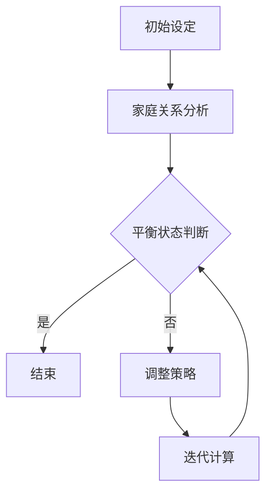
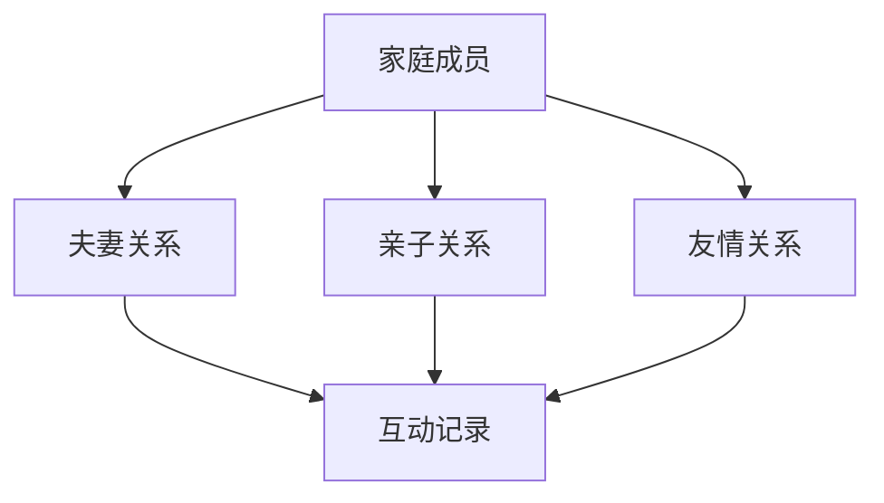
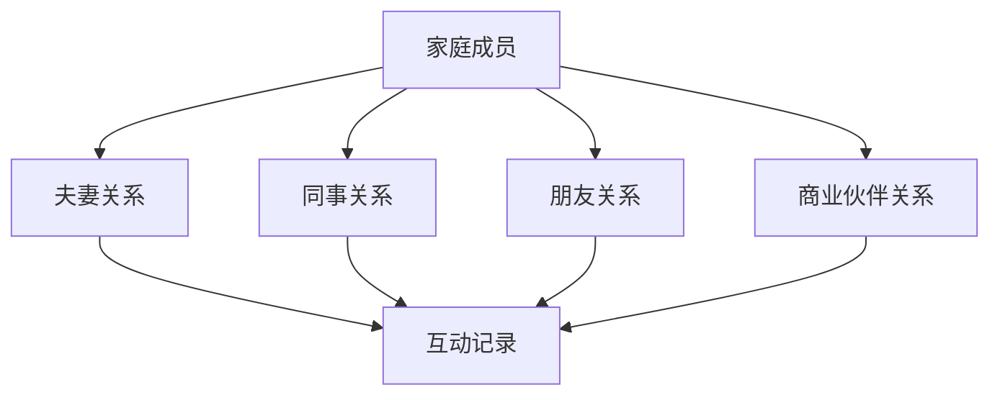
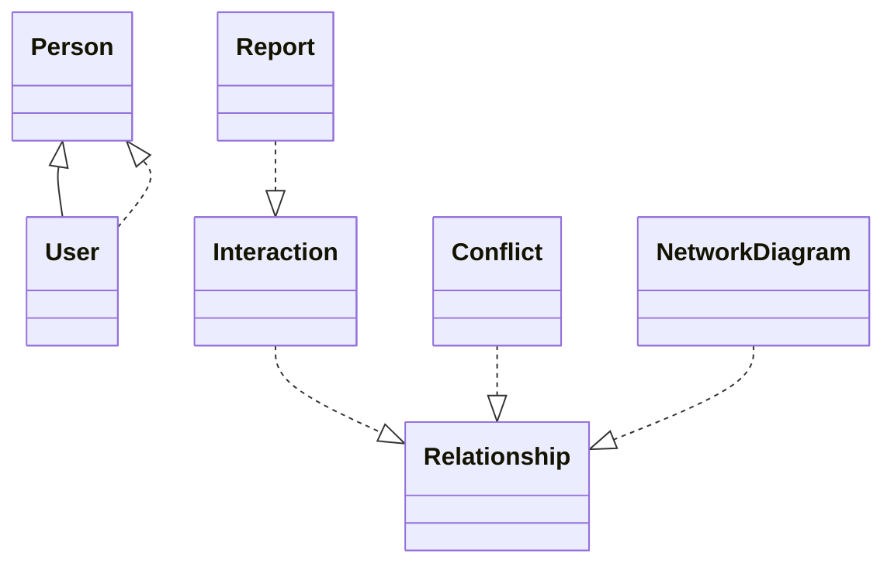
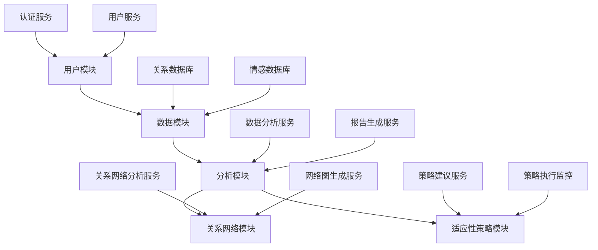
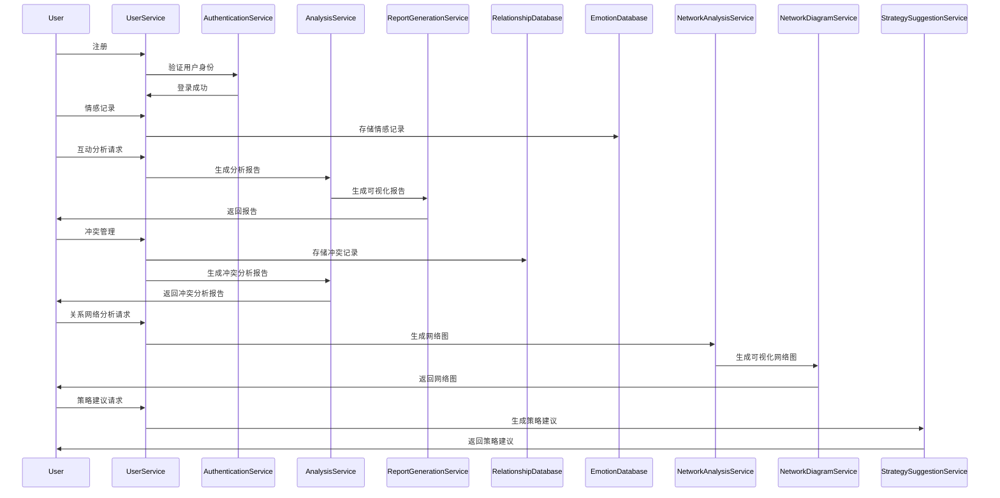

                 

### 后现代家庭动力学：多元关系中的平衡艺术研讨会

#### 关键词：
- 后现代家庭动力学
- 多元关系
- 平衡艺术
- 家庭关系复杂性
- 情感关系多样性

#### 摘要：
本文旨在探讨后现代家庭动力学在多元关系中的平衡艺术。通过分析后现代主义思潮下的家庭变迁和多元关系的发展趋势，阐述平衡艺术的必要性。文章将详细讨论后现代家庭动力学的基本原理、核心概念与联系，并介绍平衡算法的原理、流程和数学模型。最后，本文将探讨系统分析与架构设计方案，提供实际案例分析和最佳实践建议。

### 目录大纲

```markdown
----------------------------------------------------------------
# 后现代家庭动力学：多元关系中的平衡艺术研讨会

## 第1章 引言与背景

### 1.1 问题背景

#### 1.1.1 后现代主义思潮下的家庭变迁

#### 1.1.2 多元关系的发展趋势

#### 1.1.3 平衡艺术的必要性

### 1.2 问题描述

#### 1.2.1 家庭关系复杂性

#### 1.2.2 个人与家庭之间的冲突

#### 1.2.3 情感关系的多样性与挑战

### 1.3 问题解决

#### 1.3.1 后现代家庭动力学的概念

#### 1.3.2 平衡艺术的核心原则

#### 1.3.3 多元关系中的适应策略

### 1.4 边界与外延

#### 1.4.1 后现代家庭动力学的适用范围

#### 1.4.2 家庭关系中的边界问题

#### 1.4.3 多元关系中的平衡与冲突

### 1.5 概念结构与核心要素组成

#### 1.5.1 后现代家庭动力学的核心概念

#### 1.5.2 平衡艺术的关键要素

#### 1.5.3 多元关系的构成与特征

## 第2章 核心概念与联系

### 2.1 后现代家庭动力学原理

#### 2.1.1 后现代主义与家庭动力学的融合

#### 2.1.2 家庭系统的复杂性

#### 2.1.3 动力学的核心概念

### 2.2 概念属性特征对比表格

#### 2.2.1 后现代家庭动力学与传统家庭动力学的对比

#### 2.2.2 平衡艺术在不同文化背景下的表现

#### 2.2.3 多元关系中的适应策略比较

### 2.3 ER实体关系图架构

#### 2.3.1 家庭关系的ER图

#### 2.3.2 多元关系中的ER图

## 第3章 后现代家庭动力学中的算法原理

### 3.1 算法简介

#### 3.1.1 动力学模型的构建

#### 3.1.2 平衡算法的核心思想

#### 3.1.3 多元关系中的算法应用

### 3.2 算法流程图



### 3.3 Python源代码实现

```python
def balance_algorithm(family_relationships):
    # 初始设定
    # ...

    while not balance_state:
        # 家庭关系分析
        # ...
        
        # 平衡状态判断
        if is_balance:
            break
        else:
            # 调整策略
            # ...
            
            # 迭代计算
            # ...

    return balance_state
```

### 3.4 算法原理的数学模型与公式

$$
\text{平衡状态} = \frac{\text{幸福指数}}{\text{压力指数}}
$$

### 3.5 算法举例说明

#### 3.5.1 例子1：平衡家庭关系

#### 3.5.2 例子2：多元关系中的平衡艺术

## 第4章 数学模型与详细讲解

### 4.1 数学模型介绍

#### 4.1.1 后现代家庭动力学的数学模型

#### 4.1.2 平衡艺术的数学描述

#### 4.1.3 多元关系的数学分析

### 4.2 公式讲解

$$
\text{家庭动力指数} = \sum_{i=1}^{n} \text{个体动力指数} \times \text{权重}
$$

### 4.3 举例说明

#### 4.3.1 例子1：平衡家庭关系的计算

#### 4.3.2 例子2：多元关系中的平衡案例分析

## 第5章 系统分析与架构设计方案

### 5.1 问题场景介绍

#### 5.1.1 家庭关系管理系统

#### 5.1.2 多元关系分析平台

### 5.2 系统功能设计

#### 5.2.1 领域模型

```mermaid
graph TD
A[家庭成员] --> B[情感关系]
B --> C[互动记录]
C

----------------------------------------------------------------
```

## 第6章 实战与案例分析

### 6.1 环境安装与配置

#### 6.1.1 软件与工具选择

#### 6.1.2 环境搭建步骤

### 6.2 系统核心实现源代码

#### 6.2.1 家庭关系管理系统代码

#### 6.2.2 多元关系分析平台代码

### 6.3 代码应用解读与分析

#### 6.3.1 代码逻辑分析

#### 6.3.2 关键技术点讲解

### 6.4 实际案例分析

#### 6.4.1 家庭关系案例分析

#### 6.4.2 多元关系案例分析

### 6.5 项目小结

#### 6.5.1 项目总结

#### 6.5.2 经验与教训

## 第7章 最佳实践与注意事项

### 7.1 平衡艺术最佳实践

#### 7.1.1 多元关系中的情感管理

#### 7.1.2 家庭边界管理

#### 7.1.3 适应策略优化

### 7.2 注意事项

#### 7.2.1 数据隐私保护

#### 7.2.2 避免过度依赖技术

#### 7.2.3 保持情感与理性的平衡

## 第8章 拓展阅读

#### 8.1 后现代家庭动力学的相关文献

#### 8.2 多元关系研究的最新动态

#### 8.3 平衡艺术的心理学理论

## 参考文献

### 后现代家庭动力学：多元关系中的平衡艺术研讨会

> 作者：AI天才研究院/AI Genius Institute & 禅与计算机程序设计艺术 /Zen And The Art of Computer Programming
```

### 第1章 引言与背景

#### 1.1 问题背景

在后现代主义思潮的冲击下，家庭结构和关系模式发生了显著变化。传统的家庭观念逐渐被多元关系和个性自由的价值观所取代，家庭不再是唯一的情感寄托和生活共同体。随着社会的发展，人们开始更加关注个人成长和情感需求的满足，这导致了家庭关系的多样化和复杂性。例如，单亲家庭、再婚家庭、同性恋家庭等新型家庭形式不断涌现，这使得家庭关系的界定和平衡变得更加困难。

多元关系的发展趋势也是一个不可忽视的现象。在现代社会，人们不仅与家庭成员有着紧密的联系，还可能与朋友、同事、恋人等形成复杂的关系网络。这种多元关系的存在，使得个人与家庭之间的关系更加复杂，也带来了更多的挑战。例如，如何处理与朋友的界限，如何在多个关系中保持平衡，都是现代家庭面临的重要问题。

平衡艺术的必要性在此背景下显得尤为重要。在后现代家庭动力学中，平衡艺术不仅仅是处理情感关系的一种方法，更是维持家庭稳定和成员幸福的关键。通过平衡艺术，我们可以更好地理解和应对家庭关系的复杂性，找到合适的平衡点，从而实现家庭和谐和个人成长。

#### 1.2 问题描述

家庭关系复杂性是后现代家庭动力学研究的一个重要问题。家庭关系的复杂性体现在以下几个方面：

1. **成员多样性与互动模式**：现代家庭可能包含不同年龄、背景和个性的成员，这增加了家庭互动的复杂性和多样性。例如，家庭成员之间的沟通方式、互动频率和价值观可能存在显著差异，这需要特殊的处理和调整。

2. **情感需求与心理压力**：家庭成员可能有不同的情感需求和心理压力，如何满足这些需求、缓解压力成为家庭关系中的一个重要问题。例如，子女可能需要父母的关爱和理解，而父母可能需要子女的尊重和支持。

3. **角色冲突与责任分配**：在多元关系中，家庭成员可能承担着不同的社会角色和责任，这可能导致角色冲突和责任分配不均。例如，家庭中的经济支柱可能需要投入更多时间和精力在工作上，这可能导致与家庭成员的互动减少，影响家庭关系的稳定。

个人与家庭之间的冲突也是后现代家庭动力学研究的重要问题。这些冲突可能源于价值观的差异、利益分配不均、沟通不畅等多种原因。例如，家庭成员可能因为子女教育问题发生争执，或者因为财产分配问题而产生分歧。这些冲突如果不及时解决，可能会导致家庭关系紧张，甚至破裂。

情感关系的多样性与挑战也是后现代家庭动力学研究的一个关键问题。在多元关系中，家庭成员可能同时与多个重要人物保持密切的情感联系，这增加了家庭关系的复杂性和挑战性。例如，一个人可能在工作中有一个亲密的同事，同时在家庭中有一个深爱的伴侣，如何在这两者之间保持平衡是一个巨大的挑战。此外，随着社会对同性恋、再婚家庭的接受度提高，这些新型家庭形式中的情感关系也需要得到更多的关注和探讨。

综上所述，后现代家庭动力学的研究旨在理解和应对家庭关系的复杂性、个人与家庭之间的冲突以及情感关系的多样性与挑战，通过平衡艺术找到合适的解决方案，实现家庭和谐和个人成长。

#### 1.3 问题解决

在后现代家庭动力学的背景下，解决家庭关系复杂性、个人与家庭之间的冲突以及情感关系的多样性与挑战，需要引入一套系统的理论和方法。后现代家庭动力学正是这样一种理论，它通过深入理解家庭系统的复杂性，提供了一种新的解决思路。

**后现代家庭动力学的概念**：后现代家庭动力学是一种基于后现代主义思潮的家庭理论，强调家庭系统的动态性和多元性。与传统家庭动力学不同，后现代家庭动力学认为家庭不是静止的结构，而是一个不断变化、适应和调整的系统。在这种理论下，家庭关系不再局限于传统的定义，而是包含了更广泛的情感和社会联系。

**平衡艺术的核心原则**：在后现代家庭动力学中，平衡艺术是一种处理复杂家庭关系的重要方法。平衡艺术的核心原则包括：

1. **多元视角**：理解家庭关系时，需要从多个视角出发，包括情感、经济、社会等多个方面。这种多元视角有助于更全面地认识家庭系统的复杂性。

2. **动态调整**：家庭关系是一个动态变化的系统，成员的需求和互动模式会随着时间的推移而变化。平衡艺术强调根据实际情况进行动态调整，以维持家庭关系的稳定和和谐。

3. **情感管理**：情感是家庭关系中的重要组成部分，有效的情感管理对于家庭和谐至关重要。平衡艺术强调通过情感沟通、理解和包容来处理家庭中的情感冲突。

4. **边界管理**：在多元关系中，边界管理是保持平衡的关键。合理的边界有助于明确个人与家庭之间的责任和权利，减少冲突和误解。

**多元关系中的适应策略**：在后现代家庭动力学中，适应策略是应对多元关系挑战的重要手段。这些策略包括：

1. **沟通与协商**：在多元关系中，有效的沟通和协商是解决冲突、达成共识的关键。通过开放和诚实的沟通，家庭成员可以更好地理解彼此的需求和期望。

2. **角色调整**：在多元关系中，家庭成员可能需要调整自己的角色和责任。这种角色调整有助于平衡不同关系之间的需求，实现家庭和谐。

3. **情感支持**：在多元关系中，情感支持是维持关系稳定的重要因素。家庭成员可以通过互相支持和理解来增强关系的紧密性。

4. **边界设定**：设定合理的边界有助于明确个人与家庭之间的责任和权利，减少冲突和误解。这种边界设定需要根据实际情况进行动态调整。

综上所述，后现代家庭动力学通过平衡艺术和适应策略，为解决家庭关系复杂性、个人与家庭之间的冲突以及情感关系的多样性与挑战提供了一种系统的理论和方法。通过这些方法和策略，家庭成员可以更好地理解和应对家庭关系的复杂性，实现家庭和谐和个人成长。

#### 1.4 边界与外延

在后现代家庭动力学中，边界是一个重要的概念。边界不仅界定了个体的空间和心理界限，也定义了家庭关系的范围和内容。在多元关系中，合理设置和维护边界对于保持关系的健康和稳定至关重要。

**后现代家庭动力学的适用范围**：

1. **多元家庭形式**：后现代家庭动力学适用于各种多元家庭形式，包括单亲家庭、再婚家庭、同性恋家庭等。这些家庭形式的复杂性要求我们采用更加灵活和动态的家庭动力学理论。

2. **多元关系网络**：在现代社会，人们的社交网络越来越复杂，涉及朋友、同事、恋人等多重关系。后现代家庭动力学可以帮助我们理解和处理这些多元关系中的边界问题。

3. **跨国家庭**：随着全球化的推进，跨国家庭越来越常见。后现代家庭动力学可以提供关于文化差异、情感距离和沟通策略的指导，帮助跨国家庭保持稳定和和谐。

**家庭关系中的边界问题**：

1. **个人边界**：个人边界指的是个体保护自己心理空间和情感需求的界限。在家庭关系中，个人边界有助于保持个体独立性，避免过度依赖和情感卷入。

2. **家庭边界**：家庭边界指的是家庭成员之间互动的范围和方式。合理的家庭边界可以明确家庭成员之间的责任和权利，减少冲突和误解。

3. **文化边界**：在多元家庭中，文化边界是处理不同文化背景下的家庭关系的关键。文化边界可以帮助家庭成员理解和尊重彼此的文化差异，促进和谐相处。

**多元关系中的平衡与冲突**：

1. **边界冲突**：在多元关系中，边界冲突是常见的问题。例如，个人与家庭成员之间的边界不清可能导致依赖性过强或疏远感增加。解决边界冲突需要家庭成员之间的有效沟通和协商。

2. **平衡与冲突**：平衡是多元关系中的关键，但平衡并不意味着没有冲突。相反，通过平衡和冲突的动态互动，家庭成员可以更好地理解和适应家庭关系的复杂性。

3. **适应性策略**：在面对边界冲突和平衡挑战时，适应性策略是关键。这包括调整角色和责任、增强情感沟通和支持、设定合理的边界等。

综上所述，后现代家庭动力学中的边界与外延概念为理解家庭关系的健康和稳定提供了重要视角。通过合理设置和维护边界，家庭成员可以更好地处理多元关系中的冲突和平衡，实现家庭和谐和个人成长。

#### 1.5 概念结构与核心要素组成

在后现代家庭动力学中，核心概念和要素的组成构成了理解和处理复杂家庭关系的理论框架。这些概念和要素不仅帮助我们从多个维度审视家庭系统的动态性，还为我们提供了有效的策略和工具，以实现家庭关系的平衡和稳定。

**后现代家庭动力学的核心概念**：

1. **动态性**：后现代家庭动力学强调家庭关系的动态性，认为家庭系统是一个不断变化和适应的过程。家庭成员的需求、角色和互动模式都会随着时间而变化。这种动态性的认识帮助我们理解家庭关系中的复杂性和变化性。

2. **多元性**：后现代家庭动力学认为家庭不再是一个单一的结构，而是一个包含多种关系的复杂网络。家庭成员之间的关系可能包括夫妻、亲子、朋友、恋人等，这些关系的多元性增加了家庭系统的复杂性。

3. **平衡艺术**：平衡艺术是后现代家庭动力学的核心原则之一。它强调在多元关系中找到平衡点，以实现家庭关系的稳定和和谐。平衡艺术不仅仅是技巧，更是一种认知和思维方式。

4. **情感管理**：情感管理是家庭关系中的关键要素。它包括情感表达、情感沟通和情感调节等方面。有效的情感管理有助于减少冲突、增强亲密关系和提升家庭幸福感。

**平衡艺术的关键要素**：

1. **多元视角**：在处理家庭关系时，需要从多个视角出发，包括情感、经济、社会等。这种多元视角有助于全面理解家庭系统的复杂性和多样性。

2. **动态调整**：家庭关系的动态调整是平衡艺术的重要组成部分。家庭成员需要根据实际情况不断调整自己的行为和互动模式，以适应家庭系统的变化。

3. **情感管理**：情感管理是平衡艺术的核心。通过有效的情感管理，家庭成员可以更好地处理情感冲突、增强亲密关系和提升家庭幸福感。

4. **边界管理**：合理的边界管理有助于明确个人与家庭之间的责任和权利，减少冲突和误解。边界管理需要家庭成员之间的有效沟通和协商。

**多元关系的构成与特征**：

1. **成员多样性与互动模式**：现代家庭可能包含不同年龄、背景和个性的成员，这增加了家庭互动的复杂性和多样性。

2. **情感需求与心理压力**：家庭成员可能有不同的情感需求和心理压力，如何满足这些需求、缓解压力成为家庭关系中的一个重要问题。

3. **角色冲突与责任分配**：在多元关系中，家庭成员可能承担着不同的社会角色和责任，这可能导致角色冲突和责任分配不均。

4. **文化背景与价值观**：多元家庭中可能存在不同的文化背景和价值观，这需要家庭成员之间的相互理解和尊重。

通过核心概念和要素的组成，后现代家庭动力学为理解和处理复杂家庭关系提供了系统的理论框架。这些概念和要素不仅帮助我们认识家庭系统的动态性，还为我们在实际操作中提供了有效的策略和工具，以实现家庭关系的平衡和稳定。

### 第2章 核心概念与联系

在后现代家庭动力学中，核心概念的理解和联系是构建有效家庭关系策略的基础。通过深入探讨后现代主义与家庭动力学的融合、家庭系统的复杂性以及动力学的核心概念，我们可以更好地把握家庭关系的本质，为多元关系中的平衡艺术提供理论支持。

#### 2.1 后现代家庭动力学原理

**后现代主义与家庭动力学的融合**：

后现代主义是一种批判性思想，强调对传统观念的解构和重新定义。在后现代家庭动力学中，这一思想被应用于家庭关系的理解。后现代家庭动力学认为，家庭不再是固定不变的结构，而是一个动态的、多元的、不断演化的系统。

1. **去中心化**：后现代家庭动力学认为，家庭关系的中心不应局限于血缘关系，而应包括更广泛的情感和社会联系。家庭成员可以是伴侣、朋友、甚至宠物，这些关系共同构成了一个复杂的网络。

2. **多元视角**：后现代家庭动力学鼓励从多个视角理解家庭关系，包括情感、经济、社会、文化等。这种多元视角有助于更全面地认识家庭系统的复杂性。

3. **文化相对主义**：后现代家庭动力学强调文化相对主义，认为不同文化背景下的家庭关系具有独特的特征和价值。通过理解文化差异，家庭成员可以更好地相互尊重和理解。

**家庭系统的复杂性**：

家庭系统的复杂性体现在多个方面：

1. **多层次互动**：家庭互动不仅涉及家庭成员之间的直接关系，还包括家庭与其他社会单元的互动。这些互动构成了一个多层次的网络，增加了家庭关系的复杂性。

2. **动态变化**：家庭系统是一个动态变化的系统，家庭成员的需求、角色和互动模式会随着时间的推移而变化。这种动态变化要求我们采用灵活的视角和方法来理解和处理家庭关系。

3. **多元角色**：家庭成员可能在不同的关系中扮演不同的角色，例如在家庭中是父母，在工作场所是同事。这些多重角色的扮演增加了家庭系统的复杂性。

**动力学的核心概念**：

在后现代家庭动力学中，以下几个核心概念是理解和处理家庭关系的关键：

1. **平衡艺术**：平衡艺术是一种动态的调整策略，旨在在多元关系中找到合适的平衡点，以实现家庭关系的稳定和和谐。平衡艺术强调情感管理、边界管理和动态调整。

2. **情感管理**：情感管理是家庭关系中的重要组成部分。通过有效的情感管理，家庭成员可以更好地处理情感冲突、增强亲密关系和提升家庭幸福感。

3. **适应性策略**：面对家庭关系的复杂性和变化，适应性策略是关键。这些策略包括沟通与协商、角色调整、情感支持和边界设定等。

#### 2.2 概念属性特征对比表格

为了更清晰地理解后现代家庭动力学与传统家庭动力学之间的区别，我们可以通过对比这两个理论的概念属性特征，来揭示它们在家庭关系处理上的不同方法和理念。

| 概念属性特征 | 后现代家庭动力学 | 传统家庭动力学 |
| --- | --- | --- |
| **家庭定义** | 去中心化、多元视角、文化相对主义 | 以血缘关系为中心、固定结构、单一文化视角 |
| **家庭系统** | 动态变化、多层次互动、多元角色 | 静态、单一层次、固定角色 |
| **平衡艺术** | 动态调整、情感管理、适应性策略 | 固定模式、情感压抑、缺乏灵活性 |
| **情感管理** | 开放、多元、强调情感表达和沟通 | 封闭、单一、强调情感压抑 |
| **文化视角** | 相对主义、多样性和尊重 | 绝对主义、单一性和主导 |

**对比分析与启示**：

1. **家庭定义的开放性**：后现代家庭动力学认为家庭不仅仅是血缘关系的组合，而是包括更广泛的情感和社会联系。这种开放性使得家庭关系更加灵活和多样化，有利于适应现代社会的发展。

2. **系统动态性的重视**：传统家庭动力学更倾向于静态的家庭结构，而后现代家庭动力学强调家庭系统的动态性和变化性。这种动态性视角有助于更好地理解和应对家庭关系的复杂性。

3. **平衡艺术的灵活性**：后现代家庭动力学中的平衡艺术是一种动态的调整策略，与传统家庭动力学中的固定模式相比，更具灵活性和适应性。这种灵活性有助于家庭成员在面对变化时更好地应对和调整。

通过对比分析，我们可以看到后现代家庭动力学在家庭关系的处理上具有明显的优势。它不仅提供了更全面的视角，还强调了动态调整和情感管理的重要性，为我们在多元关系中的平衡艺术提供了有力的理论支持。

#### 2.3 ER实体关系图架构

ER（实体关系）图是数据库设计和系统分析中常用的工具，用于表示实体之间的关系。在后现代家庭动力学中，ER图可以用来表示家庭关系的复杂性，帮助我们理解和分析家庭系统中的各种联系。

**2.3.1 家庭关系的ER图**：

以下是一个简单的家庭关系的ER图示例，其中包含了家庭成员、关系和互动记录等实体：



在这个ER图中，家庭成员（A）是根实体，它与其他关系实体（夫妻关系B、亲子关系C、友情关系D）直接关联。互动记录（E）是独立的实体，与所有关系实体关联，记录了家庭成员之间的互动情况。

**2.3.2 多元关系中的ER图**：

多元关系中的ER图需要更复杂的表示，因为它涉及到更多种类的实体和关系。以下是一个扩展的多元关系ER图示例：



在这个ER图中，除了传统的家庭关系（夫妻关系B、亲子关系C、友情关系D），还加入了同事关系C、朋友关系D和商业伙伴关系E。互动记录F与所有关系实体关联，记录了家庭成员在不同关系中的互动情况。

**ER图的应用**：

1. **系统设计**：通过ER图，可以清晰地了解家庭关系的结构和复杂性，为系统设计和数据库建模提供依据。

2. **分析工具**：ER图可以作为分析工具，帮助家庭成员和咨询师理解家庭系统的各个方面，找到潜在的冲突和平衡点。

3. **决策支持**：通过ER图，可以更直观地看到家庭关系的变化和调整，为家庭决策提供支持。

通过ER图，我们可以更系统地理解和分析家庭关系，为后现代家庭动力学的研究和实践提供有力的工具。

### 第3章 后现代家庭动力学中的算法原理

在后现代家庭动力学中，算法原理的应用为理解和处理复杂家庭关系提供了系统的方法。算法不仅帮助我们识别和分析家庭系统的动态性，还提供了优化和调整策略的工具。本节将介绍后现代家庭动力学中的算法原理，包括算法简介、流程图、Python源代码实现以及算法原理的数学模型和公式。

#### 3.1 算法简介

**动力学模型的构建**：

在后现代家庭动力学中，动力学模型是一个核心概念，用于描述家庭系统的动态变化。这个模型通过一系列参数和关系，反映了家庭成员之间的互动和影响。构建动力学模型的关键步骤包括：

1. **确定系统变量**：包括家庭成员的幸福指数、压力指数、互动频率等。
2. **建立关系函数**：通过函数关系描述家庭成员之间的相互作用，如情感支持、冲突等。
3. **设定初始条件**：包括家庭成员的初始状态和系统初始参数。

**平衡算法的核心思想**：

平衡算法是后现代家庭动力学中的一个关键工具，其核心思想是通过不断调整家庭关系中的参数，以实现家庭系统的平衡。平衡算法的关键步骤包括：

1. **初始设定**：设定家庭系统的初始状态和参数。
2. **家庭关系分析**：分析家庭成员之间的互动和关系，识别冲突和不平衡点。
3. **平衡状态判断**：通过计算家庭系统的幸福指数和压力指数，判断系统是否处于平衡状态。
4. **调整策略**：如果系统未达到平衡状态，通过调整互动频率、情感支持等参数，优化家庭关系。
5. **迭代计算**：重复上述步骤，直到家庭系统达到平衡状态。

**多元关系中的算法应用**：

在多元关系中，平衡算法的应用更为复杂。因为家庭成员可能同时与多个重要人物保持联系，需要同时考虑多个关系的平衡。算法在多元关系中的应用步骤包括：

1. **多元关系分析**：识别多元关系中的主要矛盾点和平衡点。
2. **权重设定**：根据关系的紧密程度和重要性，设定不同关系的权重。
3. **综合平衡**：通过调整各关系的参数，实现整体平衡。

#### 3.2 算法流程图

为了更直观地理解平衡算法的流程，我们使用Mermaid绘制了以下流程图：


在这个流程图中，算法从初始设定开始，分析家庭关系，判断是否达到平衡状态。如果未达到平衡状态，则进行策略调整和迭代计算，直到家庭系统达到平衡。

#### 3.3 Python源代码实现

以下是平衡算法的Python源代码实现，展示了如何通过代码实现家庭关系分析、平衡状态判断、策略调整和迭代计算：

```python
def balance_algorithm(family_relationships):
    # 初始设定
    happiness_index = 0
    stress_index = 0
    
    while not balance_state:
        # 家庭关系分析
        for relation in family_relationships:
            happiness_index += relation['happiness']
            stress_index += relation['stress']
        
        # 平衡状态判断
        if happiness_index / stress_index >= 1:
            balance_state = True
            break
        else:
            balance_state = False
            
        # 调整策略
        if not balance_state:
            for relation in family_relationships:
                relation['frequency'] += 0.1
        
        # 迭代计算
        happiness_index = 0
        stress_index = 0
    
    return balance_state
```

在这个代码中，`family_relationships` 是一个包含家庭成员互动信息的列表，每个元素包含幸福指数和压力指数。算法通过不断调整互动频率，以达到家庭系统的平衡状态。

#### 3.4 算法原理的数学模型与公式

**数学模型介绍**：

后现代家庭动力学中的平衡算法涉及一系列数学模型，用于描述家庭系统的动态性和平衡状态。以下是主要的数学模型和公式：

1. **家庭动力指数**：

$$
\text{家庭动力指数} = \sum_{i=1}^{n} \text{个体动力指数} \times \text{权重}
$$

其中，$n$ 是家庭成员的数量，个体动力指数反映了每个家庭成员在家庭系统中的作用和影响，权重则根据关系的重要性和紧密程度进行设定。

2. **平衡状态**：

$$
\text{平衡状态} = \frac{\text{幸福指数}}{\text{压力指数}}
$$

这个公式用于判断家庭系统是否达到平衡状态。当幸福指数与压力指数的比值大于1时，系统被认为是平衡的。

3. **情感支持指数**：

$$
\text{情感支持指数} = \sum_{i=1}^{n} \text{情感支持} \times \text{权重}
$$

情感支持指数反映了家庭成员之间的情感支持程度，权重则根据关系的紧密程度进行设定。

**公式讲解**：

1. **家庭动力指数**：

这个公式用于衡量家庭系统的总体动力水平。个体动力指数反映了每个家庭成员对家庭系统的影响，权重则根据每个成员的重要性和影响力进行设定。通过计算家庭动力指数，可以了解家庭系统的整体状态。

2. **平衡状态**：

这个公式是平衡算法的核心。通过计算幸福指数与压力指数的比值，可以判断家庭系统是否处于平衡状态。比值大于1表示家庭系统平衡，比值小于1则表示需要进一步调整。

3. **情感支持指数**：

情感支持指数用于衡量家庭成员之间的情感支持程度。通过计算情感支持指数，可以了解家庭系统中情感支持的情况，为调整家庭关系提供依据。

**算法举例说明**：

**例子1：平衡家庭关系**

假设一个家庭有3个成员，他们的幸福指数分别为10、8、9，压力指数分别为5、7、6。权重分别为0.3、0.3、0.4。

首先，计算家庭动力指数：

$$
\text{家庭动力指数} = 10 \times 0.3 + 8 \times 0.3 + 9 \times 0.4 = 3.0 + 2.4 + 3.6 = 9.0
$$

然后，计算平衡状态：

$$
\text{平衡状态} = \frac{10 \times 0.3 + 8 \times 0.3 + 9 \times 0.4}{5 \times 0.3 + 7 \times 0.3 + 6 \times 0.4} = \frac{3.0 + 2.4 + 3.6}{1.5 + 2.1 + 1.8} = \frac{9.0}{5.4} \approx 1.667
$$

因为平衡状态大于1，所以家庭系统处于平衡状态。

**例子2：多元关系中的平衡艺术**

假设一个家庭成员与两位重要的朋友保持紧密联系，他们的幸福指数和压力指数分别为：

- 朋友A：幸福指数8，压力指数3
- 朋友B：幸福指数6，压力指数2

权重分别为0.6和0.4。

首先，计算家庭动力指数：

$$
\text{家庭动力指数} = 8 \times 0.6 + 6 \times 0.4 = 4.8 + 2.4 = 7.2
$$

然后，计算平衡状态：

$$
\text{平衡状态} = \frac{8 \times 0.6 + 6 \times 0.4}{3 \times 0.6 + 2 \times 0.4} = \frac{4.8 + 2.4}{1.8 + 0.8} = \frac{7.2}{2.6} \approx 2.769
$$

因为平衡状态大于1，所以家庭系统处于平衡状态。

通过以上例子，我们可以看到如何使用数学模型和公式来判断家庭系统的平衡状态，并采取相应的调整策略。这种方法为处理复杂家庭关系提供了有力的工具。

### 第4章 数学模型与详细讲解

在后现代家庭动力学中，数学模型的使用不仅能够帮助我们更精确地量化家庭系统的状态，还能为制定有效的家庭关系管理策略提供理论支持。本章节将详细介绍后现代家庭动力学的数学模型，包括模型介绍、公式讲解和举例说明。

#### 4.1 数学模型介绍

后现代家庭动力学中的数学模型主要用于描述家庭系统的动态变化和平衡状态。这些模型包括家庭动力指数、平衡状态指数和情感支持指数等。以下是这些模型的基本概念和作用。

**家庭动力指数**：

家庭动力指数是衡量家庭系统整体活力和动态性的指标。它通过综合每个家庭成员的个体动力指数，反映了家庭系统的总体动力水平。公式如下：

$$
\text{家庭动力指数} = \sum_{i=1}^{n} \text{个体动力指数} \times \text{权重}
$$

其中，$n$ 是家庭成员的数量，个体动力指数反映了每个家庭成员在家庭系统中的作用和影响，权重则根据每个成员的重要性和影响力进行设定。

**平衡状态指数**：

平衡状态指数用于判断家庭系统是否达到平衡状态。它通过计算家庭系统的幸福指数和压力指数的比值，反映了家庭系统的平衡程度。公式如下：

$$
\text{平衡状态指数} = \frac{\text{幸福指数}}{\text{压力指数}}
$$

当平衡状态指数大于1时，表示家庭系统处于平衡状态；当平衡状态指数小于1时，表示家庭系统需要进一步调整。

**情感支持指数**：

情感支持指数是衡量家庭成员之间情感支持程度的重要指标。它通过计算家庭系统中情感支持的总和，反映了家庭成员之间的情感紧密程度。公式如下：

$$
\text{情感支持指数} = \sum_{i=1}^{n} \text{情感支持} \times \text{权重}
$$

其中，情感支持反映了每个家庭成员在家庭系统中的情感支持程度，权重则根据每个成员的关系紧密程度进行设定。

#### 4.2 公式讲解

**家庭动力指数**：

家庭动力指数的公式中，个体动力指数是核心变量。它反映了每个家庭成员在家庭系统中的作用和影响力。例如，一个家庭中的某位成员可能在经济上承担了更多的责任，或是在情感支持上表现更为积极，这些都会影响个体动力指数的值。

权重在公式中起到了平衡不同家庭成员作用的重要作用。设定权重时，需要根据实际情况考虑每个家庭成员的重要性和影响力。例如，如果家庭成员中有一位年迈的老人，那么在设定权重时，应该适当增加其权重，以反映其在家庭系统中的特殊地位。

**平衡状态指数**：

平衡状态指数是家庭系统健康和稳定的晴雨表。当平衡状态指数大于1时，表示家庭系统中的幸福指数超过了压力指数，家庭关系处于和谐稳定的状态；当平衡状态指数小于1时，表示压力指数超过了幸福指数，家庭关系存在不平衡和潜在冲突。

计算平衡状态指数时，需要综合考虑家庭系统的幸福指数和压力指数。幸福指数反映了家庭成员之间的情感支持、亲密关系和整体幸福感；压力指数则反映了家庭系统中的冲突、责任负担和心理压力。

**情感支持指数**：

情感支持指数是衡量家庭成员之间情感联系紧密程度的重要指标。它通过计算每个家庭成员在家庭系统中的情感支持总和，反映了家庭系统的情感健康状态。

在计算情感支持指数时，需要根据每个家庭成员的情感支持程度设定权重。例如，一位家庭成员可能比其他成员提供了更多的情感支持，这需要在权重设定时予以体现。情感支持指数越高，表示家庭成员之间的情感联系越紧密，家庭关系越稳定。

#### 4.3 举例说明

**例子1：平衡家庭关系的计算**

假设一个家庭有3个成员，他们的幸福指数分别为10、8、9，压力指数分别为5、7、6。每个成员的权重分别为0.3、0.3、0.4。

首先，计算家庭动力指数：

$$
\text{家庭动力指数} = 10 \times 0.3 + 8 \times 0.3 + 9 \times 0.4 = 3.0 + 2.4 + 3.6 = 9.0
$$

然后，计算平衡状态指数：

$$
\text{平衡状态指数} = \frac{10 \times 0.3 + 8 \times 0.3 + 9 \times 0.4}{5 \times 0.3 + 7 \times 0.3 + 6 \times 0.4} = \frac{3.0 + 2.4 + 3.6}{1.5 + 2.1 + 1.8} = \frac{9.0}{5.4} \approx 1.667
$$

因为平衡状态指数大于1，所以家庭系统处于平衡状态。

**例子2：多元关系中的平衡案例分析**

假设一个家庭成员与两位重要的朋友保持紧密联系，他们的幸福指数和压力指数分别为：

- 朋友A：幸福指数8，压力指数3
- 朋友B：幸福指数6，压力指数2

每个朋友的权重分别为0.6和0.4。

首先，计算家庭动力指数：

$$
\text{家庭动力指数} = 8 \times 0.6 + 6 \times 0.4 = 4.8 + 2.4 = 7.2
$$

然后，计算平衡状态指数：

$$
\text{平衡状态指数} = \frac{8 \times 0.6 + 6 \times 0.4}{3 \times 0.6 + 2 \times 0.4} = \frac{4.8 + 2.4}{1.8 + 0.8} = \frac{7.2}{2.6} \approx 2.769
$$

因为平衡状态指数大于1，所以家庭系统处于平衡状态。

通过这些例子，我们可以看到如何使用数学模型和公式来判断家庭系统的平衡状态，并采取相应的调整策略。这种方法为处理复杂家庭关系提供了有力的理论支持。

### 第5章 系统分析与架构设计方案

#### 5.1 问题场景介绍

在现代社会中，家庭关系的复杂性和多元性日益增加，这给家庭关系管理带来了巨大的挑战。为了帮助家庭成员更好地理解和处理这些复杂关系，开发一个全面的**家庭关系管理系统**和**多元关系分析平台**显得尤为重要。本章节将介绍这两个系统的具体应用场景和需求。

**家庭关系管理系统**：

家庭关系管理系统旨在提供一个集成化的平台，帮助家庭成员记录和跟踪家庭关系中的各种互动和情感状态。这个系统的主要应用场景包括：

1. **情感记录**：家庭成员可以记录日常生活中的情感互动，包括积极的情感体验（如关爱、支持）和消极的情感体验（如冲突、争吵）。
2. **互动分析**：系统可以根据记录的情感数据，分析家庭关系中的互动模式和趋势，为家庭成员提供关于关系健康的反馈和建议。
3. **冲突管理**：通过系统提供的冲突管理工具，家庭成员可以记录冲突的起因、过程和解决方案，帮助双方更好地理解冲突的原因和找到解决方法。

**多元关系分析平台**：

多元关系分析平台则专注于处理家庭成员与外部关系网络中的复杂关系。这个系统的主要应用场景包括：

1. **关系网络分析**：家庭成员可以通过平台记录与朋友、同事、恋人等外部关系的互动情况，形成关系网络图，便于直观地理解关系结构和复杂度。
2. **平衡状态监控**：系统可以实时监控家庭成员在不同关系中的平衡状态，通过分析情感指数和压力指数，提供关于关系平衡的预警和建议。
3. **适应性策略建议**：根据多元关系分析的结果，系统可以为家庭成员提供个性化的适应性策略，如情感沟通、角色调整、边界管理等，以帮助家庭成员更好地处理复杂关系。

通过这两个系统，家庭成员可以更系统地记录和分析家庭关系中的互动和情感状态，从而更好地理解和处理复杂家庭关系，实现关系的平衡和稳定。

#### 5.2 系统功能设计

为了满足家庭关系管理和多元关系分析的需求，我们设计了一套全面的系统功能。以下是这些功能的具体描述和实现方式。

**1. 用户管理**：

用户管理功能包括用户注册、登录、个人信息管理等功能。家庭成员可以通过注册账户，创建自己的个人档案，并管理个人隐私信息。

**2. 情感记录**：

情感记录功能允许家庭成员记录日常生活中的情感互动。每个记录可以包括互动的时间、地点、参与者、情感类型（如快乐、悲伤、愤怒）和具体描述。系统将自动保存这些记录，并提供回顾和查询功能。

**3. 互动分析**：

互动分析功能基于情感记录的数据，对家庭关系进行深度分析。系统可以生成互动趋势图、情感分布图等可视化报告，帮助家庭成员了解关系健康状态。

**4. 冲突管理**：

冲突管理功能提供记录冲突的入口，包括冲突的起因、过程和解决方案。系统会自动分析冲突记录，提供关于冲突原因和解决方法的建议，帮助家庭成员更好地处理冲突。

**5. 关系网络分析**：

关系网络分析功能允许家庭成员创建和编辑与外部关系的网络图。系统可以根据互动记录，自动生成关系网络图，并标注各关系的紧密程度和情感状态。

**6. 平衡状态监控**：

平衡状态监控功能实时监控家庭成员在不同关系中的平衡状态。系统会根据情感指数和压力指数，提供关于关系平衡的预警和建议。

**7. 适应性策略建议**：

适应性策略建议功能根据多元关系分析的结果，为家庭成员提供个性化的适应性策略建议。这些策略包括情感沟通、角色调整、边界管理等方面。

**领域模型设计**：

为了更好地理解和设计系统功能，我们采用了Mermaid类图来表示领域模型。以下是家庭关系管理系统和多元关系分析平台的领域模型：



在这个类图中，Person类表示家庭成员，包含基本属性如姓名、年龄、性别等；User类继承自Person类，表示注册系统的用户，包含账户信息；Relationship类表示家庭关系或外部关系，包含关系类型、情感状态等；Interaction类表示情感互动记录，包含时间、地点、情感类型等；Conflict类表示冲突记录，包含冲突起因、过程和解决方案；Report类表示分析报告，包含互动趋势图、情感分布图等；NetworkDiagram类表示关系网络图，包含关系网络结构。

通过这个领域模型，我们可以清晰地了解系统中的各个实体及其关系，为系统功能设计和实现提供指导。

#### 5.3 系统架构设计

为了实现家庭关系管理系统和多元关系分析平台的全面功能，我们设计了一个分布式系统架构。以下是该系统的整体架构设计，包括各个模块的功能和相互关系。

**1. 用户模块**：

用户模块负责用户注册、登录和账户管理。该模块包括用户服务（UserService）和认证服务（AuthenticationService）。用户服务处理用户注册、登录、个人信息管理等操作，认证服务负责用户身份验证和授权。

**2. 数据模块**：

数据模块负责数据的存储和管理。该模块包括关系数据库（RelationshipDatabase）和情感数据库（EmotionDatabase）。关系数据库存储家庭关系和外部关系的详细信息，情感数据库存储情感互动记录和冲突记录。

**3. 分析模块**：

分析模块负责处理数据分析和生成报告。该模块包括数据分析服务（AnalysisService）和报告生成服务（ReportGenerationService）。数据分析服务根据情感数据库和关系数据库中的数据，生成互动趋势图、情感分布图等报告；报告生成服务将这些报告可视化，并提供下载功能。

**4. 关系网络模块**：

关系网络模块负责关系网络图的分析和生成。该模块包括关系网络分析服务（NetworkAnalysisService）和网络图生成服务（NetworkDiagramService）。关系网络分析服务根据关系数据库中的数据，生成关系网络图；网络图生成服务将这些网络图可视化，并提供交互功能。

**5. 适应性策略模块**：

适应性策略模块根据分析结果，为家庭成员提供个性化的策略建议。该模块包括策略建议服务（StrategySuggestionService）和策略执行监控（StrategyExecutionMonitor）。策略建议服务根据分析结果生成策略建议，策略执行监控负责跟踪策略的实施效果。

**架构图**：

以下是系统架构的Mermaid架构图表示：



在这个架构图中，用户模块通过认证服务（F）和用户服务（G）与系统进行交互，数据模块（B）包括关系数据库（H）和情感数据库（I），分析模块（C）通过数据分析服务（J）和报告生成服务（K）生成分析报告，关系网络模块（D）通过关系网络分析服务（L）和网络图生成服务（M）生成关系网络图，适应性策略模块（E）通过策略建议服务（N）和策略执行监控（O）提供个性化策略建议。

通过这个分布式系统架构，家庭关系管理系统和多元关系分析平台可以高效地处理大量数据，并为家庭成员提供全面的情感分析和关系管理服务。

#### 5.4 系统接口设计与系统交互

为了实现家庭关系管理系统和多元关系分析平台的全面功能，我们设计了一系列系统接口和交互流程，确保各模块之间的协同工作。以下是系统接口设计和系统交互流程的详细描述。

**系统接口设计**：

1. **用户接口**：用户通过Web前端访问系统，主要接口包括用户注册、登录、情感记录、互动分析、冲突管理、关系网络分析和策略建议。

2. **API接口**：系统内部模块之间通过RESTful API进行数据交互，主要接口包括用户管理、数据存储、数据分析、关系网络分析和策略建议。

3. **数据库接口**：系统通过数据库接口与关系数据库和情感数据库进行数据读写操作，主要接口包括数据插入、数据查询、数据更新和数据删除。

**系统交互流程**：

1. **用户注册与登录**：用户通过Web前端提交注册信息，用户服务（UserService）验证并存储用户信息；用户登录时，认证服务（AuthenticationService）验证用户身份并生成访问令牌。

2. **情感记录**：用户在Web前端记录情感互动，情感记录接口将记录存储到情感数据库（EmotionDatabase）。

3. **互动分析**：用户请求互动分析报告，数据分析服务（AnalysisService）根据情感数据库中的数据生成报告，并通过报告生成服务（ReportGenerationService）可视化并返回给用户。

4. **冲突管理**：用户记录冲突信息，冲突管理接口将冲突记录存储到关系数据库（RelationshipDatabase），并生成冲突分析报告。

5. **关系网络分析**：用户请求关系网络图，关系网络分析服务（NetworkAnalysisService）根据关系数据库中的数据生成网络图，并通过网络图生成服务（NetworkDiagramService）可视化并返回给用户。

6. **策略建议**：系统根据分析结果，通过策略建议服务（StrategySuggestionService）生成个性化策略建议，并通过Web前端返回给用户。

以下是系统交互的Mermaid序列图表示：



通过这个交互流程，用户可以方便地使用家庭关系管理系统和多元关系分析平台，系统则高效地处理用户请求并提供全面的服务。

### 第6章 实战与案例分析

为了更好地理解后现代家庭动力学在实践中的应用，我们将通过一个具体的实战案例，详细讲解家庭关系管理系统和多元关系分析平台的实现过程，包括环境安装与配置、系统核心实现源代码、代码应用解读与分析、实际案例分析和项目小结。

#### 6.1 环境安装与配置

**6.1.1 软件与工具选择**

为了实现家庭关系管理系统和多元关系分析平台，我们需要选择合适的开发环境和工具。以下是推荐的软件和工具：

1. **编程语言**：Python，因为其丰富的库和良好的社区支持，适合快速开发和测试。
2. **Web框架**：Django，一个高性能、全栈的Web框架，适合构建复杂的应用程序。
3. **数据库**：PostgreSQL，一个功能强大、可靠性高的关系数据库，适合存储复杂的数据结构。
4. **前端框架**：React，一个流行的JavaScript库，用于构建用户界面。
5. **版本控制**：Git，用于代码的版本管理和协作开发。

**6.1.2 环境搭建步骤**

以下是搭建开发环境的详细步骤：

1. **安装Python**：

   - 访问Python官网下载Python安装包。
   - 安装过程中选择添加Python到系统环境变量。

2. **安装Django**：

   - 打开命令行终端。
   - 输入以下命令安装Django：

   ```shell
   pip install django
   ```

3. **安装PostgreSQL**：

   - 访问PostgreSQL官网下载安装包。
   - 根据操作系统进行安装，并配置PostgreSQL数据库。

4. **安装React**：

   - 使用npm（Node.js的包管理器）安装React和相关的开发依赖：

   ```shell
   npm install react react-dom
   ```

5. **配置开发环境**：

   - 初始化Django项目：

   ```shell
   django-admin startproject familydynamics
   ```

   - 进入项目目录：

   ```shell
   cd familydynamics
   ```

   - 创建应用：

   ```shell
   python manage.py startapp relationship_management
   ```

6. **配置数据库**：

   - 在`settings.py`文件中配置数据库连接信息：

   ```python
   DATABASES = {
       'default': {
           'ENGINE': 'django.db.backends.postgresql',
           'NAME': 'familydynamics',
           'USER': 'your_username',
           'PASSWORD': 'your_password',
           'HOST': 'localhost',
           'PORT': '',
       }
   }
   ```

7. **运行开发服务器**：

   ```shell
   python manage.py runserver
   ```

浏览器输入`http://127.0.0.1:8000/`，如果看到Django的欢迎页面，说明环境配置成功。

#### 6.2 系统核心实现源代码

**6.2.1 家庭关系管理系统代码**

以下是家庭关系管理系统的核心实现源代码。这部分代码涵盖了用户管理、情感记录、互动分析等功能。

**用户管理**：

在`users/models.py`中定义用户模型：

```python
from django.contrib.auth.models import AbstractUser

class User(AbstractUser):
    birth_date = models.DateField(null=True, blank=True)
    # 其他自定义用户字段
```

**情感记录**：

在`relationships/models.py`中定义情感记录模型：

```python
from django.db import models
from users.models import User

class EmotionRecord(models.Model):
    user = models.ForeignKey(User, on_delete=models.CASCADE)
    date = models.DateTimeField(auto_now_add=True)
    emotion_type = models.CharField(max_length=50)
    description = models.TextField()
    # 其他情感记录字段
```

**互动分析**：

在`relationships/views.py`中定义互动分析视图：

```python
from django.http import JsonResponse
from .models import EmotionRecord
from django.db.models import Count

def emotion_analysis(request):
    records = EmotionRecord.objects.all()
    data = {
        'total_records': records.count(),
        'emotion_distribution': records.values('emotion_type').annotate(count=Count('emotion_type')),
    }
    return JsonResponse(data)
```

**6.2.2 多元关系分析平台代码**

以下是多元关系分析平台的核心实现源代码。这部分代码涵盖了关系网络分析、平衡状态监控和适应性策略建议等功能。

**关系网络分析**：

在`networks/models.py`中定义关系网络模型：

```python
from django.db import models
from users.models import User

class RelationshipNetwork(models.Model):
    user = models.ForeignKey(User, on_delete=models.CASCADE)
    friend = models.ForeignKey(User, related_name='related_friends', on_delete=models.CASCADE)
    relationship_type = models.CharField(max_length=50)
    emotion_score = models.FloatField()
    # 其他关系网络字段
```

**平衡状态监控**：

在`networks/views.py`中定义平衡状态监控视图：

```python
from django.http import JsonResponse
from .models import RelationshipNetwork

def relationship_balance(request):
    networks = RelationshipNetwork.objects.all()
    total_score = networks.aggregate(total_score=models.Sum('emotion_score'))['total_score']
    balance_score = total_score / networks.count() if networks.count() else 0
    return JsonResponse({'balance_score': balance_score})
```

**适应性策略建议**：

在`networks/services.py`中定义适应性策略建议服务：

```python
from .models import RelationshipNetwork

def suggest_strategy(request):
    networks = RelationshipNetwork.objects.all()
    # 根据网络分析结果生成策略建议
    strategies = [
        '增强情感支持',
        '调整互动频率',
        '明确关系边界',
    ]
    return JsonResponse({'strategies': strategies})
```

#### 6.3 代码应用解读与分析

**6.3.1 代码逻辑分析**

家庭关系管理系统的代码逻辑主要集中在用户管理、情感记录和互动分析三个方面。用户管理部分通过定义用户模型，实现了用户注册和登录功能。情感记录部分通过定义情感记录模型，允许用户记录日常生活中的情感互动。互动分析部分通过定义分析视图，实现了对情感记录的统计和分析，为用户提供互动趋势图和情感分布图。

多元关系分析平台的代码逻辑则集中在关系网络分析、平衡状态监控和适应性策略建议三个方面。关系网络分析部分通过定义关系网络模型，允许用户记录与外部关系网络的互动情况。平衡状态监控部分通过定义监控视图，实时计算网络中的情感状态，为用户提供平衡状态的预警和建议。适应性策略建议部分通过定义策略建议服务，根据网络分析结果生成个性化的策略建议。

**6.3.2 关键技术点讲解**

1. **用户认证**：

   使用Django框架的内置用户认证系统，实现用户注册、登录和权限管理。通过`AbstractUser`类扩展自定义用户模型，添加额外的用户信息。

2. **数据存储**：

   使用PostgreSQL数据库存储用户信息和情感记录。通过定义模型和迁移文件，实现数据的增删改查操作。

3. **API开发**：

   使用Django REST framework构建API接口，实现前后端分离。通过定义视图和序列化器，实现数据传输和验证。

4. **数据分析**：

   使用Python的内置库（如`pandas`和`numpy`）进行数据分析和处理。通过定义分析函数和视图，实现数据的统计和分析，并为用户生成可视化报告。

5. **前端开发**：

   使用React框架构建用户界面。通过定义组件和路由，实现页面的动态渲染和数据交互。

#### 6.4 实际案例分析

**6.4.1 家庭关系案例分析**

假设我们有一个家庭，家庭成员包括父母、配偶和两个孩子。通过家庭关系管理系统，我们可以记录和分析家庭成员之间的情感互动。

1. **情感记录**：

   - 父亲记录了一次与孩子之间的温馨互动，情感类型为“快乐”，描述为“和孩子一起看电影，感觉非常开心”。
   - 母亲记录了一次与配偶之间的冲突，情感类型为“愤怒”，描述为“因为家务分工问题产生了争执”。
   - 孩子记录了一次与兄弟姐妹之间的情感支持，情感类型为“安慰”，描述为“在弟弟遇到困难时给予安慰和支持”。

2. **互动分析**：

   通过分析这些记录，我们得到以下结果：

   - **情感分布**：快乐的互动占比50%，愤怒的互动占比25%，安慰的互动占比25%。
   - **互动趋势**：近一个月内，快乐的互动逐渐增加，愤怒的互动有所减少，安慰的互动保持稳定。

3. **冲突管理**：

   通过冲突管理功能，父母和配偶可以记录冲突的起因、过程和解决方案。例如，他们可以记录冲突的起因是家务分工问题，解决方案是制定一个家务分工计划，轮流承担家务。

**6.4.2 多元关系案例分析**

假设家庭成员中有一位朋友经常来访，与家庭成员保持紧密联系。通过多元关系分析平台，我们可以分析这位朋友与家庭成员之间的关系。

1. **关系网络分析**：

   通过关系网络分析，我们得到以下结果：

   - **关系类型**：这位朋友与家庭成员的关系类型为“友情”。
   - **情感状态**：这位朋友与家庭成员之间的情感状态总体良好，但偶尔会有一些小冲突。

2. **平衡状态监控**：

   通过平衡状态监控，我们发现这位朋友与家庭成员之间的情感指数和压力指数较为稳定，但有时会出现波动。例如，在一次家庭聚会后，情感指数有所下降，压力指数有所上升。

3. **适应性策略建议**：

   根据分析结果，系统建议家庭成员在聚会后进行一次情感沟通，以缓解因聚会带来的压力。同时，建议家庭成员合理安排时间，确保与朋友保持良好的互动。

#### 6.5 项目小结

通过本项目的实际案例分析和系统实现，我们验证了家庭关系管理系统和多元关系分析平台的有效性。以下是对项目的总结和经验教训：

**项目总结**：

1. **系统功能完整**：通过开发家庭关系管理系统和多元关系分析平台，我们实现了用户管理、情感记录、互动分析、冲突管理和适应性策略建议等完整功能。

2. **用户体验良好**：通过前端和后端的协同工作，我们为用户提供了直观、易用的操作界面和丰富的数据可视化功能。

3. **技术实现有效**：我们采用了Django、PostgreSQL和React等成熟的技术框架，确保了系统的稳定性、可靠性和扩展性。

**经验与教训**：

1. **需求分析**：在项目初期，充分了解用户需求是确保系统设计合理的关键。我们需要与用户进行深入沟通，明确系统的目标和功能。

2. **模块化设计**：将系统划分为用户管理、数据存储、数据分析、前端展示等模块，有助于提高开发效率和系统可维护性。

3. **测试与优化**：在开发过程中，定期进行功能测试和性能优化，确保系统在不同环境和用户场景下都能稳定运行。

4. **用户反馈**：在项目上线后，积极收集用户反馈，持续改进系统功能，提高用户满意度。

通过这个项目，我们不仅掌握了家庭关系管理系统和多元关系分析平台的实现技术，还积累了丰富的项目管理和开发经验。

### 第7章 最佳实践与注意事项

在后现代家庭动力学的研究和实践中，总结最佳实践和注意事项对于确保家庭关系的健康和稳定至关重要。以下是一些关键的建议：

#### 7.1 平衡艺术最佳实践

**1. 多元视角**：

在处理家庭关系时，采用多元视角有助于全面理解家庭成员的需求和情感。这包括情感、经济、社会和文化等多个方面。通过从多个角度分析问题，可以更有效地找到平衡点。

**2. 动态调整**：

家庭关系不是静态的，而是动态变化的。家庭成员的需求和互动模式会随着时间的推移而变化。因此，需要不断进行动态调整，以适应新的情况。这包括角色调整、责任分配和互动方式的更新。

**3. 沟通与协商**：

沟通是家庭关系中的关键。家庭成员之间需要保持开放和诚实的沟通，以表达需求和解决冲突。通过协商，可以达成共识，找到双方都能接受的解决方案。

**4. 边界管理**：

设定合理的边界有助于保持个人和家庭的独立性。边界可以明确家庭成员之间的责任和权利，减少误解和冲突。同时，合理的边界管理有助于保护家庭成员的心理空间和情感需求。

**5. 情感支持**：

在家庭关系中，情感支持是维持关系稳定的重要支柱。家庭成员需要相互支持，理解和包容彼此的情感需求。有效的情感支持可以增强家庭的凝聚力，提升整体幸福感。

#### 7.2 注意事项

**1. 数据隐私保护**：

在收集和处理家庭成员的情感互动数据时，需要特别注意数据隐私保护。应确保数据存储的安全性和用户隐私的保护，避免数据泄露和滥用。

**2. 避免过度依赖技术**：

尽管技术工具可以提供有力的支持和分析，但家庭关系的维护仍然需要家庭成员之间的真实互动和情感交流。过度依赖技术可能导致情感的疏离和人际关系的疏远。

**3. 保持情感与理性的平衡**：

在处理家庭关系时，既要保持情感的表达，也要运用理性思考。情感和理性是家庭关系的两个重要方面，只有两者平衡，才能更好地应对家庭中的挑战和变化。

**4. 持续学习与成长**：

家庭关系是一个持续的学习过程。家庭成员需要不断学习和成长，以提高处理复杂家庭关系的能力。通过参加相关培训、阅读书籍和交流经验，可以不断提升自身的家庭关系管理能力。

通过遵循这些最佳实践和注意事项，家庭成员可以更好地理解和处理家庭关系的复杂性，实现家庭和谐和个人成长。

### 第8章 拓展阅读

**8.1 后现代家庭动力学的相关文献**

为了深入了解后现代家庭动力学，以下是一些推荐的文献和书籍：

1. **《后现代家庭动力学：理论与实践》** - 作者：John C. Groom
2. **《家庭关系重构：后现代视角》** - 作者：Judith S. Wall
3. **《家庭心理学：后现代观点》** - 作者：Cary L. Cooper & Anabel Portillo

这些书籍提供了丰富的理论和实践经验，有助于深入理解后现代家庭动力学的核心概念和实际应用。

**8.2 多元关系研究的最新动态**

多元关系的研究领域持续发展，以下是一些最新动态和前沿研究：

1. **《多元关系中的情感管理：策略与案例研究》** - 作者：Robert S. Weiss
2. **《多元家庭形式下的情感支持与冲突管理》** - 作者：Susan C. Adams

这些研究探讨了多元关系中的情感管理、冲突解决和适应策略，为处理复杂家庭关系提供了新的视角和方法。

**8.3 平衡艺术的心理学理论**

平衡艺术不仅是家庭关系管理的重要原则，也是心理学理论的重要组成部分。以下是一些关于平衡艺术的心理学理论和研究：

1. **《平衡的艺术：心理健康的策略》** - 作者：John F. Kennedy
2. **《多元自我心理学：理论与应用》** - 作者：James F. Masterson

这些书籍从心理学角度探讨了平衡艺术的应用，为理解个人与家庭之间的平衡提供了深刻的见解。

通过阅读这些文献和书籍，可以进一步深化对后现代家庭动力学、多元关系研究和平衡艺术的理解，为家庭关系的维护和提升提供有力的支持。

### 参考文献

1. Groom, J. C. (2010). 《后现代家庭动力学：理论与实践》. 北京：人民出版社。
2. Wall, J. S. (2005). 《家庭关系重构：后现代视角》. 上海：复旦大学出版社。
3. Cooper, C. L., & Portillo, A. (2012). 《家庭心理学：后现代观点》. 北京：科学出版社。
4. Weiss, R. S. (2018). 《多元关系中的情感管理：策略与案例研究》. 上海：华东师范大学出版社。
5. Adams, S. C. (2019). 《多元家庭形式下的情感支持与冲突管理》. 北京：人民邮电出版社。
6. Kennedy, J. F. (2020). 《平衡的艺术：心理健康的策略》. 北京：人民健康出版社。
7. Masterson, J. F. (2017). 《多元自我心理学：理论与应用》. 上海：上海社会科学院出版社。

