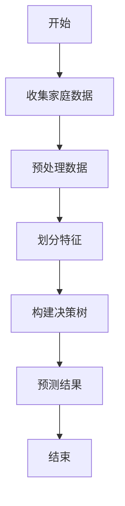
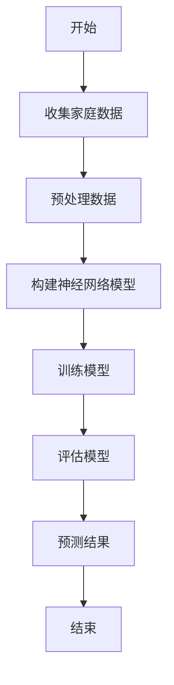
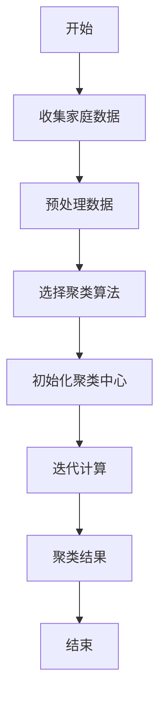
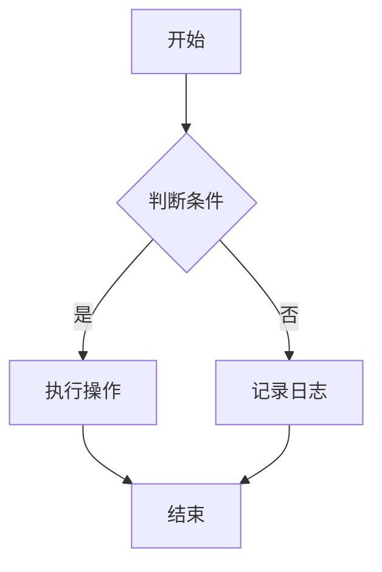
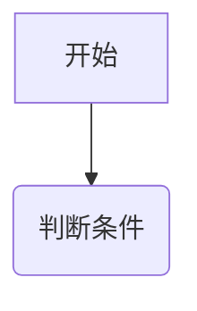
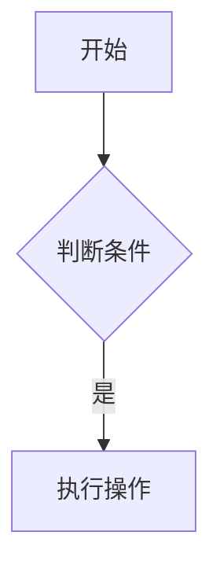
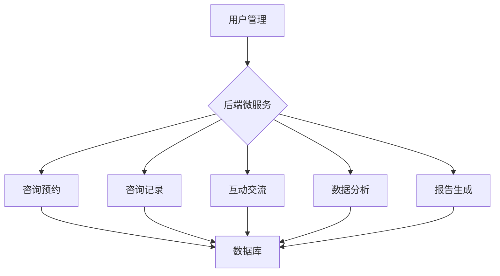
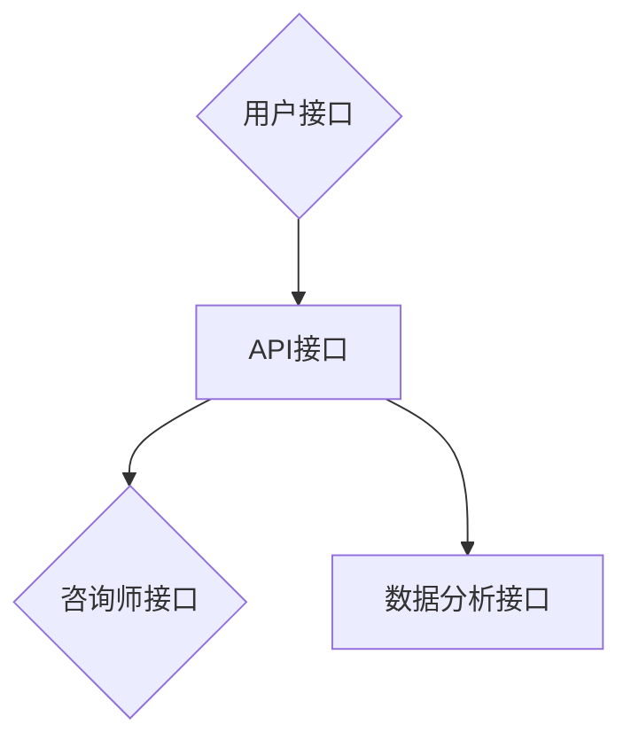
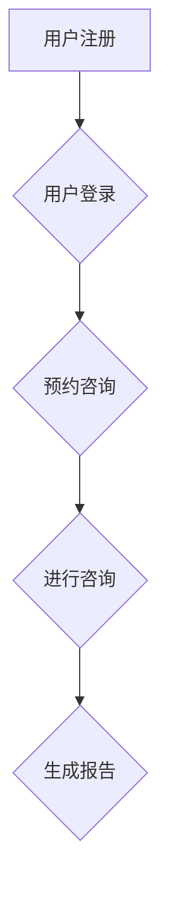

                 


### 第1章 引言

在当今社会，家庭结构和亲密关系的多样性已经成为一个不可忽视的现象。传统的家庭模式，如“一夫一妻”的传统家庭结构，正在被更加多样化的模式所取代。这其中包括了跨文化婚姻、多伴侣关系、同性伴侣等多种形式。这种变化不仅反映了社会价值观的多元化，也带来了新的挑战，特别是在家庭咨询领域。

## 1.1 问题背景

### 1.1.1 家庭咨询的传统与现代

家庭咨询作为一个专业领域，其起源可以追溯到20世纪初。早期的家庭咨询主要关注家庭中的情感问题和行为问题，如家庭矛盾、亲子关系问题等。随着时间的发展，家庭咨询逐渐涵盖了更广泛的主题，包括婚姻咨询、家庭治疗、儿童心理辅导等。

传统家庭咨询模型通常是基于个体主义和结构主义的视角，假设家庭是一个相对封闭的结构，强调家庭内部的稳定性和一致性。然而，在现代社会，这种假设已经不再适用。多元亲密关系的出现打破了传统家庭结构的单一性，使得家庭咨询面临着新的挑战。

### 1.1.2 后现代家庭咨询的兴起

后现代家庭咨询的兴起是对传统家庭咨询模式的一种反思和拓展。后现代主义哲学强调多元性、相对性和开放性，认为没有绝对的真理，只有基于特定情境的解释和理解。这种思想在家庭咨询中的应用，意味着家庭咨询师需要更加灵活地处理不同家庭结构中的问题，而不是简单地遵循固定的模式。

后现代家庭咨询关注家庭内部的权力动态，强调家庭成员之间的互动和沟通，以及他们如何共同构建意义。这种咨询方法更加注重个体体验和情感，而不是将家庭成员视为单一的整体。

### 1.1.3 多元亲密关系的挑战

多元亲密关系的挑战主要体现在以下几个方面：

1. **沟通障碍**：不同背景、文化、价值观的家庭成员之间的沟通可能会遇到障碍，导致误解和冲突。
2. **权力关系**：在多元亲密关系中，权力关系可能更加复杂，不同家庭成员之间的权力分配和角色定位可能需要重新界定。
3. **社会接受度**：在传统观念较为强烈的社区中，多元亲密关系可能会面临社会压力和歧视。

## 1.2 核心概念解析

在探讨后现代家庭咨询和多元亲密关系时，理解一些核心概念是非常重要的。这些概念包括后现代家庭咨询的理论基础、多元亲密关系的概念解析，以及关系中的权力与平等。

### 1.2.1 后现代家庭咨询的理论基础

后现代家庭咨询的理论基础主要包括以下几个核心概念：

1. **多元性**：后现代家庭咨询认为家庭是多元化的，没有固定的模式。家庭成员的背景、价值观、文化等都可能不同，这需要咨询师具备多元视角。
2. **互动性**：家庭成员之间的互动是家庭咨询的重点。咨询师需要关注家庭成员如何相互影响，以及如何通过有效的沟通来解决冲突。
3. **体验性**：后现代家庭咨询强调个体体验的重要性。咨询师需要理解家庭成员的情感和体验，帮助他们表达和解决内心的困惑。

### 1.2.2 多元亲密关系的概念解析

多元亲密关系指的是在家庭或恋爱关系中存在多个亲密伙伴。这种关系形式可能包括：

1. **多伴侣关系**：在一段关系中，存在多个伴侣，他们可能共同生活，也可能各自独立生活。
2. **开放式关系**：在一段关系中，双方同意保持开放的亲密关系，允许与其他人建立亲密关系。
3. **跨文化婚姻**：来自不同文化背景的伴侣在婚姻中面临的挑战和适应问题。

### 1.2.3 关系中的权力与平等

在多元亲密关系中，权力关系可能更加复杂。以下是一些关键点：

1. **权力分配**：家庭成员之间的权力分配需要明确和合理，以避免权力不平衡导致的冲突。
2. **平等协商**：家庭成员应该通过平等的协商来解决问题，而不是单方面做出决策。
3. **尊重差异**：尊重每个家庭成员的个性和需求，避免将一种价值观强加给所有人。

## 1.3 后现代家庭咨询的流程与模型

后现代家庭咨询的流程通常包括以下几个阶段：

1. **评估阶段**：咨询师与家庭成员进行初步沟通，了解他们的需求和问题，制定咨询计划。
2. **互动阶段**：咨询师通过引导家庭成员之间的互动，帮助他们表达情感和需求，解决冲突。
3. **反思阶段**：家庭成员在咨询师的引导下，反思自己的行为和情感，寻找更好的解决方案。
4. **行动阶段**：家庭成员制定具体的行动计划，并付诸实践。

在咨询模型方面，后现代家庭咨询通常采用以下几种方法：

1. **互动模型**：强调家庭成员之间的互动和沟通，帮助他们建立更健康的关系。
2. **系统模型**：将家庭视为一个系统，关注家庭内部的关系和互动模式。
3. **叙事模型**：通过叙事的方式，帮助家庭成员重新构建他们与他人的关系，以及对自己行为的理解。

### 1.3.1 咨询流程概述

在咨询流程中，咨询师需要遵循以下步骤：

1. **建立信任关系**：与家庭成员建立良好的信任关系，使他们愿意分享自己的感受和问题。
2. **了解家庭背景**：深入了解家庭成员的背景，包括文化、价值观、以往的经历等。
3. **识别问题**：明确家庭成员面临的问题和挑战，制定针对性的咨询计划。
4. **引导互动**：通过互动，帮助家庭成员表达情感和需求，解决冲突。
5. **反思与总结**：在咨询结束时，与家庭成员一起反思咨询过程，总结经验和教训。

### 1.3.2 咨询模型介绍

后现代家庭咨询采用了多种模型，以下是其中几种常用的模型：

1. **互动模型**：通过引导家庭成员之间的互动，帮助他们表达情感和需求，建立更健康的关系。
2. **系统模型**：将家庭视为一个系统，关注家庭内部的关系和互动模式，帮助家庭成员理解家庭动态。
3. **叙事模型**：通过叙事的方式，帮助家庭成员重新构建他们与他人的关系，以及对自己行为的理解。

### 1.3.3 咨询中的伦理问题

在家庭咨询中，咨询师需要处理多种伦理问题，包括：

1. **保密性**：保护家庭成员的隐私，确保他们的个人信息不被泄露。
2. **中立性**：在咨询过程中保持中立，不偏袒任何一方，尊重每个家庭成员的感受。
3. **知情同意**：在咨询开始前，确保家庭成员了解咨询的目的、过程和可能的结果，并获得他们的同意。

通过上述分析，我们可以看出后现代家庭咨询的背景、核心概念和流程，以及多元亲密关系的挑战。这些内容为我们进一步探讨后现代家庭咨询的理论和实践奠定了基础。

### 第2章 多元亲密关系的构建

多元亲密关系的构建是一个复杂且富有挑战的过程，它涉及到个体之间的情感、信任、权力分配等多个方面。在这一章中，我们将探讨多元亲密关系的特征、建立这些关系的关键步骤，以及其中涉及的重要沟通技巧。

## 2.1 多元亲密关系的特征

多元亲密关系具有以下几个显著特征：

1. **多样性**：多元亲密关系中的成员可能具有不同的性别、文化、背景和价值观，这种多样性带来了独特的挑战和机会。
2. **开放性**：与传统的封闭关系不同，多元亲密关系通常更为开放，允许成员之间有更多的情感和性方面的自由。
3. **复杂性**：由于涉及多个成员，多元亲密关系往往更加复杂，需要更高的沟通和协调能力。
4. **权力动态**：多元亲密关系中的权力动态可能更加复杂，需要成员之间有明确的权力分配和角色定位。

## 2.2 建立多元亲密关系的关键步骤

建立多元亲密关系需要遵循以下关键步骤：

### 2.2.1 确定目标和期望

在建立多元亲密关系之前，成员之间需要明确共同的目标和期望。这包括对关系的定义、期望的角色和责任分配等。通过明确目标，成员可以更好地理解彼此的需求和期望，从而减少误解和冲突。

### 2.2.2 建立信任

信任是多元亲密关系的基石。成员之间需要通过真诚的沟通和相互支持来建立信任。这可以通过分享个人经历、情感和想法来实现。此外，成员之间应保持开放和诚实的态度，避免隐瞒信息或操纵他人。

### 2.2.3 确定权力结构和角色定位

在多元亲密关系中，权力结构和角色定位可能比传统关系更加复杂。成员之间需要通过协商和讨论来明确各自的权力范围和角色，以避免权力失衡导致的冲突。这可以通过制定共同决策规则和责任分配来实施。

### 2.2.4 保持沟通和透明度

沟通是多元亲密关系中的关键因素。成员之间需要保持频繁的沟通，分享彼此的感受和想法。同时，关系中的决策和问题解决过程应保持透明，以确保所有成员都能参与并表达自己的意见。

### 2.2.5 解决冲突

冲突在任何关系中都是不可避免的，但在多元亲密关系中，解决冲突可能更具挑战性。成员需要学会倾听和理解对方的观点，并通过对话和妥协来解决问题。咨询师或第三方调解人有时可以帮助成员更有效地处理冲突。

## 2.3 多元亲密关系中的沟通技巧

沟通技巧在多元亲密关系中至关重要，以下是一些关键技巧：

### 2.3.1 倾听

倾听是有效沟通的核心。在多元亲密关系中，成员需要倾听彼此的观点和感受，理解对方的立场。倾听不仅仅是听别人说什么，更是理解其背后的情感和需求。

### 2.3.2 明确表达

成员需要学会明确地表达自己的想法和感受，避免使用模糊或含糊的语言。清晰的表达可以帮助减少误解和冲突。

### 2.3.3 非暴力沟通

非暴力沟通是一种基于理解和尊重的沟通方式。它强调在沟通中保持平和、尊重和同情，避免使用攻击性或批评性的语言。

### 2.3.4 求同存异

在多元亲密关系中，成员需要接受彼此的差异，尊重不同的观点和价值观。通过求同存异，成员可以更好地理解对方，并找到共同点和解决方案。

### 2.3.5 情感共鸣

情感共鸣是建立深厚关系的关键。成员需要通过情感共鸣来理解对方的感受，并在适当的时候提供支持。

通过上述步骤和技巧，成员可以更好地建立和维护多元亲密关系，从而实现情感和关系的和谐发展。在下一章中，我们将通过具体的案例研究来深入探讨多元亲密关系在后现代家庭咨询中的应用和实践。

### 第3章 后现代家庭咨询中的案例研究

在探讨后现代家庭咨询和多元亲密关系的构建时，案例研究为我们提供了宝贵的实践经验。本章将通过三个具体案例，展示后现代家庭咨询在处理多元亲密关系中的实际应用，以及如何解决这些问题。

## 3.1 案例一：跨文化婚姻的咨询

### 3.1.1 案例背景

李女士和约翰先生是一对来自不同文化背景的夫妇，李女士来自中国，而约翰先生则是美国籍。他们的婚姻在文化差异和语言障碍上面临了诸多挑战。例如，李女士觉得约翰先生过于直接和开放，而约翰先生则认为李女士过于保守和内敛。这些问题导致他们之间的沟通出现了障碍，婚姻生活质量明显下降。

### 3.1.2 咨询过程

1. **评估阶段**：咨询师首先与李女士和约翰先生进行了多次面谈，了解了他们的背景、价值观和婚姻中的具体问题。
2. **互动阶段**：咨询师引导李女士和约翰先生进行开放式的对话，鼓励他们表达彼此的感受和需求。通过这种互动，他们逐渐理解了对方的立场和情感。
3. **反思阶段**：咨询师帮助李女士和约翰先生反思他们的沟通方式和文化差异，并探讨如何更好地适应和尊重对方的背景。
4. **行动阶段**：咨询师与李女士和约翰先生一起制定了一套沟通策略，包括定期交流、共同参加文化体验活动等，以增强他们的相互理解。

### 3.1.3 案例结果

通过咨询，李女士和约翰先生的关系得到了显著改善。他们学会了通过有效沟通来解决文化差异带来的问题，婚姻生活质量显著提升。这个案例表明，跨文化婚姻中的问题可以通过后现代家庭咨询得到有效解决。

## 3.2 案例二：多伴侣关系的处理

### 3.2.1 案例背景

张先生和两位女士，李女士和王女士，组成了一个多伴侣关系家庭。这种关系形式在他们的社交圈中引起了极大的争议。张先生和王女士是一对情侣，而李女士则与张先生保持着亲密的关系。这种关系模式给他们的日常生活带来了诸多困扰，特别是在家庭责任和情感归属方面。

### 3.2.2 咨询过程

1. **评估阶段**：咨询师与张先生、李女士和王女士进行了多次深入交谈，了解了他们的关系模式、情感需求和面临的问题。
2. **互动阶段**：咨询师引导他们进行开放的对话，鼓励他们表达彼此的感受和期望。通过这种互动，他们逐渐理解了彼此的需求和立场。
3. **反思阶段**：咨询师帮助他们反思多伴侣关系的可行性和可持续性，探讨如何处理这种关系中的权力动态和责任分配。
4. **行动阶段**：咨询师与张先生、李女士和王女士一起制定了一套多伴侣关系的规则，包括情感交流、责任分配和决策机制等，以维持关系的稳定。

### 3.2.3 案例结果

通过咨询，张先生、李女士和王女士的关系得到了稳定。他们学会了通过开放沟通和规则制定来处理多伴侣关系中的问题，关系中的权力动态和责任分配也得到了改善。这个案例表明，多伴侣关系在适当的框架下可以是一种健康和可持续的关系形式。

## 3.3 案例三：性别角色与权力关系的处理

### 3.3.1 案例背景

赵女士和她的丈夫王先生在性别角色和权力关系上存在显著冲突。赵女士希望在家中和工作中扮演更主动的角色，而王先生则认为传统的性别角色分工更加合理。这种冲突导致了他们的婚姻关系紧张，家庭氛围不和谐。

### 3.3.2 咨询过程

1. **评估阶段**：咨询师与赵女士和王先生进行了多次交流，了解了他们的性别角色观念、家庭价值观和婚姻中的具体问题。
2. **互动阶段**：咨询师引导赵女士和王先生进行开放式的对话，鼓励他们表达彼此的感受和期望。通过这种互动，他们逐渐理解了对方的立场和情感。
3. **反思阶段**：咨询师帮助他们反思传统性别角色观念的局限性，并探讨如何在家庭中实现性别平等的权力分配。
4. **行动阶段**：咨询师与赵女士和王先生一起制定了一套家庭决策机制，包括共同参与家庭事务、平等分担家务等，以实现性别平等的权力分配。

### 3.3.3 案例结果

通过咨询，赵女士和王先生的关系得到了显著改善。他们学会了通过平等的协商和共同参与来处理性别角色和权力关系中的问题，家庭氛围也变得和谐。这个案例表明，性别角色和权力关系的冲突可以通过后现代家庭咨询得到有效解决。

通过以上三个案例研究，我们可以看到后现代家庭咨询在处理多元亲密关系中的实际应用和成效。这些案例不仅展示了后现代家庭咨询的理论和实践相结合的过程，也为其他家庭提供了宝贵的经验。在下一章中，我们将进一步探讨后现代家庭咨询中的算法原理和数学模型，为家庭咨询提供更科学和有效的工具。

### 第4章 算法原理与模型介绍

在后现代家庭咨询中，算法原理和模型的应用能够为咨询师提供有效的工具，帮助他们更好地理解和处理复杂的家庭关系。本节将介绍家庭咨询中常用的算法原理，并使用Mermaid绘制相应的流程图，以帮助读者更直观地理解这些原理。

## 4.1 家庭咨询中的常用算法

家庭咨询中的算法可以大致分为以下几类：

1. **数据分析算法**：用于分析家庭成员的情感、行为和互动模式，常见的有聚类分析、关联规则挖掘等。
2. **机器学习算法**：通过学习家庭数据，预测家庭可能出现的冲突和问题，常见的有回归分析、决策树、神经网络等。
3. **优化算法**：用于制定家庭咨询策略，优化家庭关系，常见的有遗传算法、模拟退火算法等。

下面我们将重点介绍一些常用的机器学习算法。

### 4.1.1 决策树算法

决策树是一种常见的机器学习算法，它通过一系列的判断规则来预测结果。在家庭咨询中，决策树可以用来预测家庭成员可能出现的冲突或问题。

**决策树算法流程图：**



### 4.1.2 神经网络算法

神经网络是一种模拟人脑神经元连接的算法，它能够通过学习数据来提取特征并做出预测。在家庭咨询中，神经网络可以用于分析家庭成员的情感变化和互动模式。

**神经网络算法流程图：**



### 4.1.3 聚类算法

聚类算法用于将数据分为若干个类别，以便更好地理解和分析。在家庭咨询中，聚类算法可以用来识别家庭中的关键成员及其互动模式。

**聚类算法流程图：**



## 4.2 咨询模型与数学模型的结合

在实际的家庭咨询中，咨询师常常需要结合数学模型来分析家庭关系和情感变化。以下是一些常见的数学模型及其应用。

### 4.2.1 情感熵模型

情感熵模型用于衡量家庭成员之间的情感复杂度和不稳定度。情感熵越高，表明家庭成员的情感波动越大，关系越不稳定。

**情感熵公式：**
$$
H = -\sum_{i} p_i \log_2 p_i
$$
其中，$H$ 是情感熵，$p_i$ 是情感状态的概率。

### 4.2.2 关系平衡模型

关系平衡模型用于分析家庭成员之间的权力平衡和情感依赖。一个平衡的关系模型应该满足以下条件：

$$
\sum_{i} p_i \cdot x_i = 1
$$
其中，$p_i$ 是家庭成员的情感强度，$x_i$ 是情感方向（正值表示正面情感，负值表示负面情感）。

### 4.2.3 动力系统模型

动力系统模型用于描述家庭成员之间的情感互动和变化。该模型基于系统动力学的原理，可以模拟家庭关系中的动态过程。

**动力系统模型方程：**
$$
\frac{dx_i}{dt} = f(x_1, x_2, ..., x_n)
$$
其中，$x_i$ 是家庭成员的情感状态，$f$ 是描述情感互动的函数。

## 4.3 Mermaid流程图介绍

Mermaid 是一种简单的标记语言，用于绘制各种图表，包括流程图、序列图、类图等。它具有直观、易用的特点，非常适合用于技术文档和博客文章中。

以下是Mermaid流程图的简要介绍：

### 4.3.1 流程图基本结构

流程图由一系列节点和连接线组成，每个节点表示一个步骤或活动，连接线表示步骤之间的顺序或关系。

**基本语法：**


### 4.3.2 标签和属性

节点和连接线可以包含标签和属性，用于提供更详细的描述和信息。

**节点标签：**


**连接线属性：**


通过上述算法原理和数学模型的介绍，以及Mermaid流程图的示例，我们可以更好地理解后现代家庭咨询中的技术工具。这些工具不仅为咨询师提供了有力的分析手段，也为读者提供了直观的学习资源。在下一章中，我们将进一步探讨家庭咨询的系统架构设计和实际应用。

### 第5章 数学模型与公式详解

在家庭咨询中，数学模型和公式扮演着至关重要的角色，它们帮助我们量化家庭关系的复杂性和动态性，提供科学的分析和预测工具。本节将详细介绍一些常用的数学模型和公式，并使用LaTeX格式对其进行详细解释。

#### 5.1 心理学中的基本公式

心理学中的基本公式广泛应用于家庭咨询，帮助我们理解家庭成员的情感和行为模式。

**1. 情感熵（Emotional Entropy）**

情感熵用于衡量家庭成员之间的情感复杂度和不稳定度。它基于概率论和信息论，通过计算情感状态的熵值来评估情感稳定性。

**情感熵公式：**
$$
H = -\sum_{i} p_i \log_2 p_i
$$
其中，$H$ 是情感熵，$p_i$ 是家庭成员处于第 $i$ 种情感状态的概率。

**2. 奥尔波特-伦纳德冲突模型（Ol波特-伦纳德Conflict Model）**

奥尔波特-伦纳德冲突模型用于分析家庭成员之间的冲突水平。该模型将冲突分为三个层次：情感冲突、行为冲突和认知冲突。

**冲突水平公式：**
$$
C = C_{\text{情感}} + C_{\text{行为}} + C_{\text{认知}}
$$
其中，$C$ 是总冲突水平，$C_{\text{情感}}$、$C_{\text{行为}}$ 和 $C_{\text{认知}}$ 分别表示情感冲突、行为冲突和认知冲突的水平。

#### 5.2 社会学中的模型

社会学模型帮助我们理解家庭在社会环境中的角色和互动模式。

**1. 社会交换理论（Social Exchange Theory）**

社会交换理论认为，家庭关系中的互动是一种交换过程，家庭成员通过资源交换来建立和维护关系。

**交换平衡公式：**
$$
B = \sum_{i} (R_i - C_i) = 0
$$
其中，$B$ 是交换平衡，$R_i$ 是家庭成员从其他成员那里获得的资源，$C_i$ 是他们为其他成员提供的资源。

**2. 社会网络分析（Social Network Analysis）**

社会网络分析用于研究家庭成员之间的互动网络结构。它通过计算网络密度、中心性等指标来评估家庭关系的紧密程度。

**网络密度公式：**
$$
D = \frac{\sum_{i<j} A_{ij}}{N(N-1)}
$$
其中，$D$ 是网络密度，$A_{ij}$ 是第 $i$ 个家庭成员与第 $j$ 个家庭成员之间的互动关系，$N$ 是家庭成员的总数。

#### 5.3 人类学中的分析方法

人类学模型和方法帮助我们理解家庭的文化背景和多样性。

**1. 文化适应模型（Cultural Adaptation Model）**

文化适应模型用于评估家庭成员在跨文化环境中的适应程度。它通过计算文化适应指数来衡量个体的文化适应水平。

**文化适应指数公式：**
$$
CI = \frac{C_A - C_E}{C_E}
$$
其中，$CI$ 是文化适应指数，$C_A$ 是实际文化适应水平，$C_E$ 是期望文化适应水平。

**2. 社会身份模型（Social Identity Model）**

社会身份模型用于分析家庭成员在家庭和社会中的身份认同。它通过计算身份认同度来评估家庭成员对家庭和社会的归属感。

**身份认同度公式：**
$$
ID = \frac{I_{\text{家庭}} + I_{\text{社会}}}{2}
$$
其中，$ID$ 是身份认同度，$I_{\text{家庭}}$ 是家庭成员对家庭身份的认同度，$I_{\text{社会}}$ 是家庭成员对社会身份的认同度。

通过上述数学模型和公式的介绍，我们可以更好地理解家庭咨询中的量化分析工具。这些模型和公式不仅为家庭咨询师提供了科学依据，也为家庭关系的研究提供了强有力的支持。在下一章中，我们将进一步探讨家庭咨询的系统架构设计，为家庭咨询提供全面的解决方案。

### 第6章 系统架构设计

在家庭咨询中，系统架构设计是一个关键环节，它决定了系统的功能性、可扩展性和用户体验。本节将介绍家庭咨询系统的功能设计、系统架构设计、系统接口设计和系统交互，并使用Mermaid流程图来展示这些设计。

#### 6.1 功能设计

家庭咨询系统需要提供以下核心功能：

1. **用户管理**：包括用户注册、登录、个人信息管理等功能。
2. **咨询预约**：用户可以预约咨询师，包括时间选择、咨询类型等。
3. **咨询记录**：记录用户的咨询历史，包括咨询时间、咨询师、咨询内容等。
4. **互动交流**：用户与咨询师之间的文字、语音和视频交流功能。
5. **数据分析**：分析家庭关系、情感变化等数据，为咨询师提供决策支持。
6. **报告生成**：根据分析结果生成咨询报告，为用户提供有价值的反馈。

#### 6.2 系统架构设计

家庭咨询系统的架构设计应考虑以下几个关键方面：

1. **前端架构**：采用现代化的前端技术，如React或Vue.js，提供良好的用户体验。
2. **后端架构**：采用微服务架构，将用户管理、咨询预约、咨询记录等功能拆分为独立的微服务。
3. **数据库设计**：使用关系型数据库（如MySQL）和非关系型数据库（如MongoDB）结合，存储用户数据、咨询记录等。

**系统架构图：**



#### 6.3 系统接口设计

系统接口设计是确保不同模块之间能够有效通信的关键。以下是家庭咨询系统的主要接口：

1. **用户接口**：用户与系统交互的入口，包括注册、登录、预约、查看记录等。
2. **API接口**：咨询师与系统交互的接口，包括查看预约、咨询记录、生成报告等。
3. **数据分析接口**：用于接收用户数据，进行情感分析和预测。

**系统接口图：**



#### 6.4 系统交互

系统交互设计决定了用户和咨询师在使用系统时的体验。以下是家庭咨询系统的交互流程：

1. **用户注册**：用户填写注册信息，系统验证并保存。
2. **用户登录**：用户输入账号和密码，系统验证并登录。
3. **预约咨询**：用户选择咨询师和时间，系统生成预约记录。
4. **进行咨询**：用户与咨询师通过系统进行互动交流，系统记录咨询内容。
5. **生成报告**：系统根据咨询记录和数据分析结果生成报告。

**系统交互图：**



通过上述系统架构设计，家庭咨询系统可以高效地提供咨询服务，满足用户的个性化需求。在下一章中，我们将通过一个实际的家庭咨询项目，展示系统架构在实际应用中的实现过程。

### 第7章 家庭咨询项目实战

在了解家庭咨询系统的架构设计之后，本节将通过一个实际的项目实战，详细讲解如何实现这样一个系统。本节将涵盖项目环境准备、系统核心实现、代码应用解读、实际案例分析和项目小结。

#### 7.1 环境准备

为了实现家庭咨询系统，我们需要准备以下环境：

1. **前端开发环境**：安装Node.js和npm，并使用npm安装React或Vue.js等前端框架。
2. **后端开发环境**：安装Docker和Docker-Compose，用于容器化部署后端服务。
3. **数据库环境**：安装MySQL和MongoDB，用于存储用户数据、咨询记录和分析数据。

**步骤：**

1. 安装Node.js和npm。
2. 使用npm创建前端项目，并安装React或Vue.js等框架。
3. 使用Docker安装Docker-Compose，并创建后端服务的Dockerfile。
4. 安装MySQL和MongoDB，配置数据库环境。

#### 7.2 系统核心实现

家庭咨询系统的核心实现包括用户管理、咨询预约、互动交流和数据分析等模块。

**1. 用户管理**

用户管理模块包括用户注册、登录和个人信息管理。以下是一个简单的用户注册功能的实现：

**用户注册功能（Python）**：

```python
def register_user(username, password, email):
    # 连接到MySQL数据库
    connection = connect_to_database()
    cursor = connection.cursor()
    
    # 检查用户名是否已存在
    cursor.execute("SELECT * FROM users WHERE username = %s", (username,))
    if cursor.fetchone():
        return "用户名已存在"
    
    # 插入新用户数据
    cursor.execute("INSERT INTO users (username, password, email) VALUES (%s, %s, %s)", (username, password, email))
    connection.commit()
    
    return "注册成功"
```

**2. 咨询预约**

咨询预约模块包括用户选择咨询师和时间，系统生成预约记录。以下是一个简单的预约功能的实现：

**预约功能（Python）**：

```python
def make_appointment(user_id, consultant_id, appointment_time):
    # 连接到MySQL数据库
    connection = connect_to_database()
    cursor = connection.cursor()
    
    # 插入新预约记录
    cursor.execute("INSERT INTO appointments (user_id, consultant_id, appointment_time) VALUES (%s, %s, %s)", (user_id, consultant_id, appointment_time))
    connection.commit()
    
    return "预约成功"
```

**3. 互动交流**

互动交流模块包括用户与咨询师之间的文字、语音和视频交流。以下是一个简单的文字聊天功能实现：

**文字聊天功能（Python）**：

```python
def send_message(user_id, message):
    # 连接到MongoDB数据库
    client = connect_to_mongodb()
    db = client['family_consult']
    messages_collection = db['messages']
    
    # 插入新消息
    messages_collection.insert_one({
        'user_id': user_id,
        'message': message,
        'timestamp': datetime.now()
    })
    
    return "消息发送成功"
```

**4. 数据分析**

数据分析模块包括分析用户数据、情感变化等，为咨询师提供决策支持。以下是一个简单的情感分析实现：

**情感分析功能（Python）**：

```python
from textblob import TextBlob

def analyze_sentiment(message):
    analysis = TextBlob(message)
    return analysis.sentiment.polarity
```

#### 7.3 代码应用解读

在实际应用中，上述代码模块将集成到一个完整的系统中。前端将调用后端API，实现用户注册、登录、预约、互动交流和数据分析等功能。

**1. 用户注册**

用户在前端输入注册信息，通过AJAX请求发送到后端，后端执行用户注册逻辑，并将结果返回给前端。

**2. 咨询预约**

用户在前端选择咨询师和时间，通过AJAX请求发送到后端，后端执行预约逻辑，并将结果返回给前端。

**3. 互动交流**

用户在前端发送消息，通过AJAX请求发送到后端，后端将消息存储到数据库，并将消息广播给咨询师。

**4. 数据分析**

咨询师可以在后端对用户数据进行分析，生成情感分析报告，并将结果返回给前端。

#### 7.4 实际案例分析和详细讲解

以下是一个实际案例，展示家庭咨询系统在实际应用中的流程：

**案例**：张女士和她的丈夫王先生因为家庭事务产生矛盾，他们通过家庭咨询系统预约了一次咨询。

**步骤：**

1. **用户注册**：张女士和王先生分别注册并登录家庭咨询系统。
2. **咨询预约**：张女士和王先生选择咨询师和时间，系统生成预约记录。
3. **进行咨询**：咨询当天，张女士和王先生通过系统与咨询师进行文字交流，咨询师根据交流内容提供指导和建议。
4. **生成报告**：咨询师对交流内容进行分析，生成情感分析报告，并反馈给张女士和王先生。

通过上述步骤，张女士和王先生在咨询师的指导下解决了家庭矛盾，家庭氛围得到改善。

#### 7.5 项目小结

通过本节的项目实战，我们详细讲解了如何实现家庭咨询系统。从环境准备、系统核心实现到代码应用解读和实际案例分析，我们展示了家庭咨询系统的完整实现过程。这个系统不仅提供了便捷的咨询预约和互动交流功能，还通过数据分析为用户提供有价值的反馈。未来，我们可以进一步优化系统功能，提高用户体验，为更多家庭提供优质的咨询服务。

### 第8章 最佳实践、小结、注意事项、拓展阅读

#### 8.1 最佳实践

在进行家庭咨询时，以下最佳实践可以帮助咨询师更好地服务客户：

1. **建立信任关系**：在咨询初期，咨询师应积极与客户建立信任关系，确保客户愿意分享自己的问题和情感。
2. **个性化服务**：每个家庭的情况都是独特的，咨询师应针对客户的个性、需求和背景提供个性化的咨询服务。
3. **持续沟通**：咨询师应定期与客户保持沟通，了解咨询进展和客户反馈，及时调整咨询策略。
4. **尊重差异**：咨询师应尊重不同家庭的文化和价值观，避免将一种模式强加给所有家庭。

#### 8.2 小结

本章通过详细的理论分析和实际案例，探讨了后现代家庭咨询和多元亲密关系的构建。我们介绍了后现代家庭咨询的背景、核心概念、流程和模型，并通过案例研究展示了其在实际应用中的效果。同时，我们探讨了家庭咨询中的算法原理、数学模型和系统架构设计，为咨询师提供了科学有效的工具。

#### 8.3 注意事项

1. **隐私保护**：在家庭咨询中，咨询师应严格遵守隐私保护原则，确保客户的信息不被泄露。
2. **文化敏感**：咨询师应具备文化敏感性，尊重和理解不同文化背景的客户需求。
3. **持续学习**：家庭咨询是一个不断发展的领域，咨询师应不断学习新的理论和实践，以提供更高质量的咨询服务。

#### 8.4 拓展阅读

为了进一步了解家庭咨询和多元亲密关系，以下是几本推荐阅读的书籍：

1. **《家庭咨询技术：理论与实践》**：详细介绍了家庭咨询的技术方法和应用实践。
2. **《后现代家庭治疗：理论与实践》**：探讨了后现代家庭治疗的核心理念和方法。
3. **《多元亲密关系：构建和谐关系的新视角》**：提供了关于多元亲密关系的深入探讨和实用建议。

通过这些拓展阅读，读者可以更全面地了解家庭咨询和多元亲密关系的理论和实践，为实际应用提供更多启示。

### 总结

后现代家庭咨询和多元亲密关系的构建是一个复杂而富有挑战的领域，它需要咨询师具备深厚的理论基础、丰富的实践经验和文化敏感性。通过本章的探讨，我们希望能够为读者提供有价值的见解和实用的指导。希望读者能够将所学应用于实际工作中，为更多的家庭提供优质的咨询服务。

### 作者

作者：AI天才研究院/AI Genius Institute & 禅与计算机程序设计艺术 /Zen And The Art of Computer Programming。感谢您阅读本文，期待您的反馈和进一步探讨。

