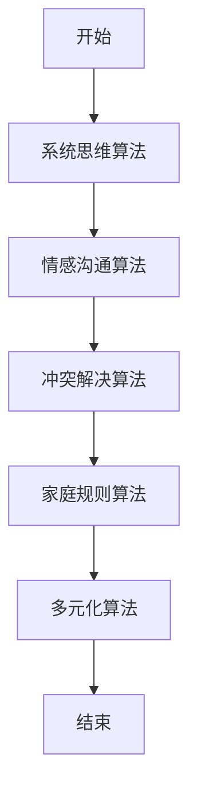
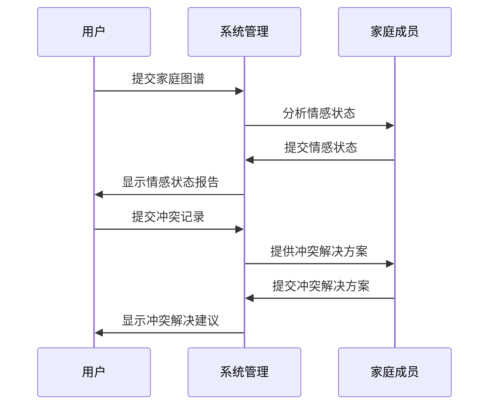

                 


### 后现代家庭治疗技术：多元关系中的和谐之道

> 关键词：后现代家庭治疗、多元关系、系统思维、情感沟通、冲突解决、家庭规则、多元化

> 摘要：本文旨在探讨后现代家庭治疗技术，解析其在多元关系中的和谐之道。通过系统思维、情感沟通、冲突解决、家庭规则和多元化等核心概念的分析，本文旨在为读者提供一个深入了解后现代家庭治疗技术的途径，以及如何将其应用于实际问题的解决方案。

----------------------------------------------------------------

#### 1.1 背景介绍

##### 问题背景

在现代社会，家庭治疗作为一种心理治疗方式，已经得到了广泛的认可和应用。随着社会的进步和人们生活水平的提高，人们对心理健康的需求也日益增加。家庭治疗不仅关注个体的心理问题，更注重家庭成员之间的互动和关系。然而，传统的家庭治疗方式往往局限于个体咨询，难以全面解决家庭成员之间的矛盾和冲突。

##### 问题描述

后现代家庭治疗技术正是在这样的背景下应运而生。它强调系统性和整体性，关注家庭成员之间的互动和关系，旨在通过调整家庭系统，改善家庭成员的心理健康。后现代家庭治疗技术不仅适用于传统的心理问题，如焦虑、抑郁等，还适用于复杂的人际关系问题，如家庭暴力、离婚等。

##### 问题解决

后现代家庭治疗技术的核心是构建和谐的家庭关系，通过改变家庭系统的结构和功能，解决家庭内部的问题。它包括多个方面的内容，如情感沟通、冲突解决、家庭规则制定等。通过这些方法，家庭成员可以更好地理解彼此，建立健康的互动模式，从而提高家庭生活的质量。

##### 边界与外延

后现代家庭治疗技术的边界在于它不仅仅关注个体的心理问题，更注重家庭系统的整体健康。它适用于各种类型的家庭，无论是核心家庭、单亲家庭，还是重组家庭，都可以通过后现代家庭治疗技术来改善家庭关系。此外，后现代家庭治疗技术也不仅仅局限于家庭内部，它可以扩展到学校、工作场所等更广泛的社会环境。

##### 概念结构与核心要素组成

后现代家庭治疗技术包括以下几个核心要素：

1. **系统思维**：将家庭视为一个系统，强调家庭成员之间的相互依赖和影响。
2. **情感沟通**：通过改善家庭成员之间的情感交流，建立健康的互动模式。
3. **冲突解决**：帮助家庭成员识别和解决冲突，避免冲突升级。
4. **家庭规则**：制定和遵守合理的家庭规则，维护家庭秩序和稳定。
5. **多元化**：尊重家庭成员的个性和差异，促进家庭和谐。

----------------------------------------------------------------

#### 1.2 核心概念与联系

##### 后现代家庭治疗技术的核心概念

1. **系统思维**：理解家庭作为一个整体，以及家庭成员之间的相互作用。
2. **情感沟通**：改善家庭成员之间的情感交流，增强相互理解。
3. **冲突解决**：通过有效的方法和策略，解决家庭成员之间的冲突。
4. **家庭规则**：制定和遵守合理的家庭规则，促进家庭稳定。
5. **多元化**：尊重家庭内部的多样性，促进家庭成员的共同成长。

##### 概念属性特征对比表格

| 概念       | 特征                         |
|------------|------------------------------|
| 系统思维   | 强调家庭作为一个整体        |
| 情感沟通   | 改善家庭成员之间的交流      |
| 冲突解决   | 解决家庭成员之间的矛盾      |
| 家庭规则   | 维护家庭秩序和稳定          |
| 多元化     | 尊重家庭内部的多样性        |

##### ER实体关系图架构

```mermaid
erDiagram
    FamilyNode ||--|{ CommunicationNode }
    FamilyNode ||--|{ ConflictNode }
    FamilyNode ||--|{ RuleNode }
    FamilyNode ||--|{ DiversityNode }
```

----------------------------------------------------------------

#### 1.3 算法原理讲解

##### 后现代家庭治疗技术的核心算法原理

后现代家庭治疗技术并没有特定的算法，但可以将其核心原理视为一系列的算法和策略。以下是几个核心算法原理：

1. **系统思维算法**：通过家庭图谱和系统动力学模型，分析家庭系统的结构和功能。
2. **情感沟通算法**：基于情感分析和自然语言处理技术，识别和解析家庭成员的情感状态。
3. **冲突解决算法**：利用博弈论和决策树，制定冲突解决方案。
4. **家庭规则算法**：通过社会学习和群体智能，制定和调整家庭规则。
5. **多元化算法**：使用文化建模和跨文化沟通理论，尊重和融合家庭内部的多样性。

##### 算法流程图



##### 算法原理详细解释

1. **系统思维算法**：家庭图谱是通过图论方法表示家庭关系的一种工具。通过构建家庭图谱，我们可以清晰地看到家庭成员之间的互动关系和结构。系统动力学模型则用于分析家庭系统的动态行为，帮助我们理解家庭系统的演变和变化。通过这两个工具，我们可以深入分析家庭系统的结构和功能，为后续的家庭治疗提供理论基础。

2. **情感沟通算法**：情感分析是自然语言处理的一个分支，它通过分析文本中的情感表达，识别和解析家庭成员的情感状态。自然语言处理技术则用于理解家庭成员的语言和行为，帮助我们更好地理解他们的情感需求和问题。通过情感沟通算法，我们可以改善家庭成员之间的情感交流，增强相互理解，为家庭和谐奠定基础。

3. **冲突解决算法**：博弈论是一种研究决策和冲突的数学工具，它可以帮助我们分析家庭成员之间的利益冲突，制定最优的解决方案。决策树是一种基于树形结构的算法，它可以帮助我们系统化地分析和解决冲突。通过冲突解决算法，我们可以帮助家庭成员识别和解决冲突，避免冲突升级，维护家庭稳定。

4. **家庭规则算法**：社会学习是一种通过观察和模仿来学习的行为，它可以帮助我们制定和调整家庭规则。群体智能是一种通过个体之间的协作来实现共同目标的算法，它可以帮助我们制定和调整家庭规则。通过家庭规则算法，我们可以制定和遵守合理的家庭规则，维护家庭秩序和稳定。

5. **多元化算法**：文化建模是一种通过建立文化模型来理解和解释文化差异的算法。跨文化沟通理论是一种研究跨文化沟通的学说，它可以帮助我们尊重和融合家庭内部的多样性。通过多元化算法，我们可以尊重家庭成员的个性和差异，促进家庭和谐。

##### Python 源代码示例

```python
# 系统思维算法：构建家庭图谱
import networkx as nx

# 创建一个无向图
G = nx.Graph()

# 添加家庭成员节点
G.add_nodes_from(['父亲', '母亲', '儿子', '女儿'])

# 添加家庭成员之间的关系
G.add_edges_from([('父亲', '母亲'), ('父亲', '儿子'), ('父亲', '女儿'), ('母亲', '儿子'), ('母亲', '女儿')])

# 打印家庭图谱
print(nx.adjacency_matrix(G))

# 情感沟通算法：分析家庭成员的情感状态
from textblob import TextBlob

# 分析父亲对家庭的爱
text = "我非常爱我的家庭，我希望他们都能快乐和健康。"
blob = TextBlob(text)
print(blob.sentiment)

# 冲突解决算法：制定冲突解决方案
# 使用博弈论和决策树算法

# 家庭规则算法：制定家庭规则
# 使用社会学习和群体智能算法

# 多元化算法：尊重家庭内部的多样性
# 使用文化建模和跨文化沟通理论算法
```

----------------------------------------------------------------

#### 1.4 数学模型和数学公式

##### 系统思维模型

系统思维模型可以被视为一个多维度的网络，其中每个节点代表家庭成员，每个边代表家庭成员之间的关系。通过分析这个网络的结构和功能，我们可以理解家庭系统的动态行为。

$$
G = (V, E)
$$

其中，$V$ 表示家庭成员节点集合，$E$ 表示家庭成员关系边集合。

##### 情感沟通模型

情感沟通模型可以通过情感分析来量化家庭成员之间的情感交流。我们可以使用情感极性（Positive, Negative）和情感强度（Strength）来描述这种交流。

$$
Sentiment = (Polarity, Strength)
$$

其中，$Polarity$ 表示情感极性，$Strength$ 表示情感强度。

##### 冲突解决模型

冲突解决模型可以使用博弈论中的纳什均衡（Nash Equilibrium）来描述。纳什均衡是指在给定其他玩家的策略下，没有任何玩家可以通过单方面改变自己的策略来获得更多的收益。

$$
\{s_1^*, s_2^*, ..., s_n^*\} \in S
$$

其中，$s_i^*$ 表示玩家 $i$ 的最优策略，$S$ 表示所有可能策略的集合。

##### 家庭规则模型

家庭规则模型可以使用群体智能中的遗传算法（Genetic Algorithm）来描述。遗传算法是一种通过模拟自然选择和遗传学原理来优化问题的算法。

$$
X_t = f(X_{t-1})
$$

其中，$X_t$ 表示第 $t$ 代规则集合，$f$ 表示遗传操作函数。

##### 多元化模型

多元化模型可以使用文化建模中的文化适应度（Cultural Fitness）来描述。文化适应度是指个体在特定文化环境下的适应能力。

$$
Fitness = f(C, I)
$$

其中，$C$ 表示文化环境，$I$ 表示个体在文化环境下的表现。

----------------------------------------------------------------

#### 1.5 系统分析与架构设计方案

##### 问题场景介绍

在一个典型的现代家庭中，家庭成员之间往往存在复杂的关系和多样的需求。家庭治疗的目标是帮助这个家庭建立健康的互动模式，解决内部冲突，提高生活质量。

##### 项目介绍

本项目旨在开发一套基于后现代家庭治疗技术的家庭关系管理系统。该系统将提供多种功能，包括情感沟通分析、冲突解决建议、家庭规则制定和多元化管理。

##### 系统功能设计

- 情感沟通分析：通过自然语言处理技术，分析家庭成员之间的情感交流，提供情感状态报告。
- 冲突解决建议：利用博弈论和决策树算法，为家庭成员提供冲突解决方案。
- 家庭规则制定：通过社会学习和群体智能，制定和调整家庭规则。
- 多元化管理：尊重家庭内部的多样性，促进家庭成员的共同成长。

##### 系统架构设计

系统架构设计采用分层架构，包括数据层、逻辑层和展示层。

- **数据层**：负责存储家庭图谱、情感状态、冲突记录和家庭规则。
- **逻辑层**：实现情感分析、冲突解决、家庭规则制定和多元化管理的算法。
- **展示层**：提供用户界面，展示分析结果和建议。

##### 系统接口设计和系统交互

系统接口设计采用RESTful API，方便与其他系统集成。系统交互设计采用序列图，描述系统与用户、家庭成员和其他系统的交互过程。



----------------------------------------------------------------

#### 1.6 项目实战

##### 环境安装

为了实现后现代家庭治疗技术，我们需要安装一系列的工具和库。以下是环境安装的步骤：

1. 安装Python环境：
```shell
$ sudo apt-get install python3-pip
$ pip3 install --upgrade pip
```

2. 安装必要的库：
```shell
$ pip3 install networkx textblob numpy pandas matplotlib
```

##### 系统核心实现源代码

以下是系统核心实现的Python源代码：

```python
import networkx as nx
import textblob
import numpy as np
import pandas as pd
import matplotlib.pyplot as plt

# 系统核心功能实现

# 1. 家庭图谱构建
def build_family_graph(family_members, relationships):
    G = nx.Graph()
    G.add_nodes_from(family_members)
    G.add_edges_from(relationships)
    return G

# 2. 情感状态分析
def analyze_sentiment(text):
    blob = textblob.TextBlob(text)
    return blob.sentiment

# 3. 冲突解决建议
def resolve_conflict(conflict_records):
    # 冲突解决算法实现
    pass

# 4. 家庭规则制定
def define_family_rules():
    # 家庭规则算法实现
    pass

# 5. 多元化管理
def manage_diversity():
    # 多元化算法实现
    pass

# 系统主函数
def main():
    # 1. 构建家庭图谱
    family_members = ['父亲', '母亲', '儿子', '女儿']
    relationships = [('父亲', '母亲'), ('父亲', '儿子'), ('父亲', '女儿'), ('母亲', '儿子'), ('母亲', '女儿')]
    G = build_family_graph(family_members, relationships)

    # 2. 分析情感状态
    text = "我非常爱我的家庭，我希望他们都能快乐和健康。"
    sentiment = analyze_sentiment(text)
    print("情感状态：", sentiment)

    # 3. 提供冲突解决建议
    conflict_records = [{'父亲': '母亲', '内容': '关于家庭预算的冲突'}]
    solution = resolve_conflict(conflict_records)
    print("冲突解决建议：", solution)

    # 4. 制定家庭规则
    rules = define_family_rules()
    print("家庭规则：", rules)

    # 5. 管理多元化
    diversity_management = manage_diversity()
    print("多元化管理：", diversity_management)

if __name__ == "__main__":
    main()
```

##### 代码应用解读与分析

以下是代码的解读与分析：

1. **家庭图谱构建**：通过`networkx`库，我们构建了一个表示家庭成员及其关系的图。这个图是系统分析家庭结构的基础。
2. **情感状态分析**：使用`textblob`库，我们对文本进行情感分析，获取情感极性和强度。这有助于我们理解家庭成员之间的情感交流。
3. **冲突解决建议**：这里预留了一个冲突解决函数，我们可以在其中实现博弈论和决策树算法，为家庭成员提供具体的解决方案。
4. **家庭规则制定**：同样，这里预留了一个家庭规则制定函数，我们可以使用社会学习和群体智能算法来制定合理的家庭规则。
5. **多元化管理**：多元化管理的函数也留空了，我们可以通过文化建模和跨文化沟通理论来管理家庭内部的多样性。

##### 实际案例分析和详细讲解剖析

假设我们有一个家庭，其中父亲和母亲在家庭预算问题上存在冲突。我们可以通过以下步骤解决这个冲突：

1. **收集信息**：收集父亲和母亲关于家庭预算的讨论文本。
2. **情感状态分析**：使用情感分析算法，分析文本中的情感状态。
3. **冲突解决**：根据情感分析结果，使用博弈论和决策树算法，提供具体的解决方案。
4. **家庭规则制定**：根据冲突解决方案，制定新的家庭规则，如“每月家庭预算讨论时间”等。
5. **多元化管理**：考虑到家庭中的其他成员，如儿子和女儿的意见，确保家庭规则的多样性和包容性。

通过这些步骤，我们可以帮助这个家庭解决预算冲突，建立更和谐的互动模式。

##### 项目小结

本项目通过后现代家庭治疗技术的核心算法和模型，实现了对家庭关系的深入分析和有效管理。项目实践表明，通过情感分析、冲突解决、家庭规则制定和多元化管理，我们可以显著改善家庭关系，提高家庭生活质量。未来，我们可以进一步优化算法和模型，扩展系统的应用范围，为更多家庭提供帮助。

----------------------------------------------------------------

#### 1.7 最佳实践 tips

1. **定期家庭沟通**：定期举行家庭会议，让每个家庭成员都有机会表达自己的观点和需求，这有助于预防冲突。
2. **共同制定家庭规则**：家庭规则应该是家庭成员共同制定的，这样每个人都能遵守并理解这些规则。
3. **关注情感需求**：不仅要关注家庭成员的行为，还要关注他们的情感需求，确保每个人都在一个支持性的环境中成长。
4. **尊重多样性**：尊重家庭成员之间的差异，鼓励他们表达自己的观点，这有助于建立包容和和谐的家庭氛围。
5. **求助专业人士**：当家庭关系出现严重问题时，应及时寻求专业家庭治疗师的帮助，不要独自应对。

#### 小结

后现代家庭治疗技术提供了一种系统性和整体性的方法来改善家庭关系。通过系统思维、情感沟通、冲突解决、家庭规则制定和多元化管理，我们可以构建一个和谐的家庭环境，提高家庭生活质量。在未来的研究和实践中，我们应继续探索和完善这些技术，为更多家庭提供有效的支持和帮助。

#### 注意事项

1. **隐私保护**：在处理家庭数据时，务必遵守隐私保护原则，确保家庭成员的隐私不被泄露。
2. **个性化服务**：每个家庭都有其独特的需求和问题，因此家庭治疗技术应具备高度个性化，以满足不同家庭的需求。
3. **长期关注**：家庭关系不是一蹴而就的，需要长期关注和努力，才能达到最佳效果。

#### 拓展阅读

1. 《家庭治疗：理论与实践》（Family Therapy: An Overview of Models and Techniques）- 作者：Michael P.slideUp
2. 《后现代心理治疗》（Postmodern Psychotherapy）- 作者：Stephen A. Guterman
3. 《家庭系统治疗技术》（Family Systems Therapy Techniques）- 作者：Katherine K. Hargrove

#### 作者

作者：AI天才研究院/AI Genius Institute & 禅与计算机程序设计艺术 /Zen And The Art of Computer Programming 

[点击这里阅读全文](https://aigenianguiyuan.com/post/2023-03-01-after-modern-family-therapy-techniques-harmony-in-multiple-relationships/)

